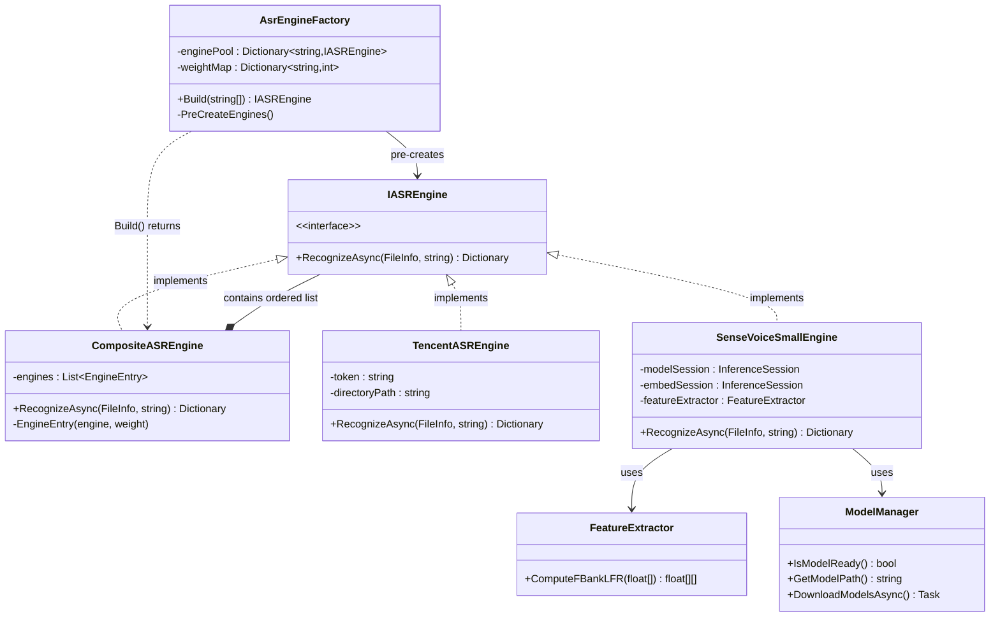
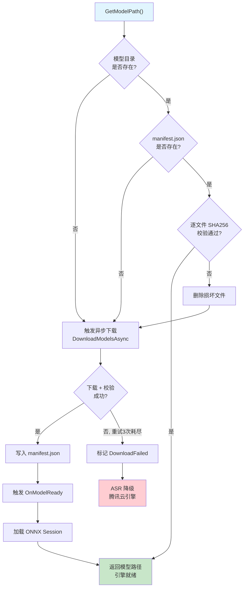
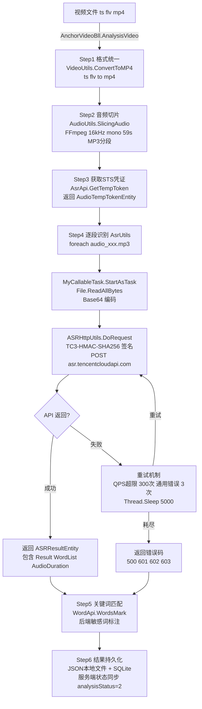
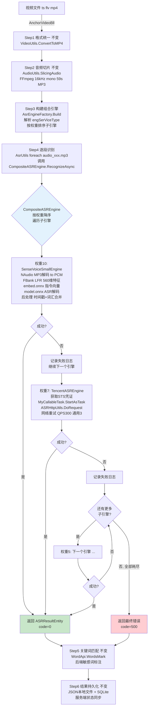
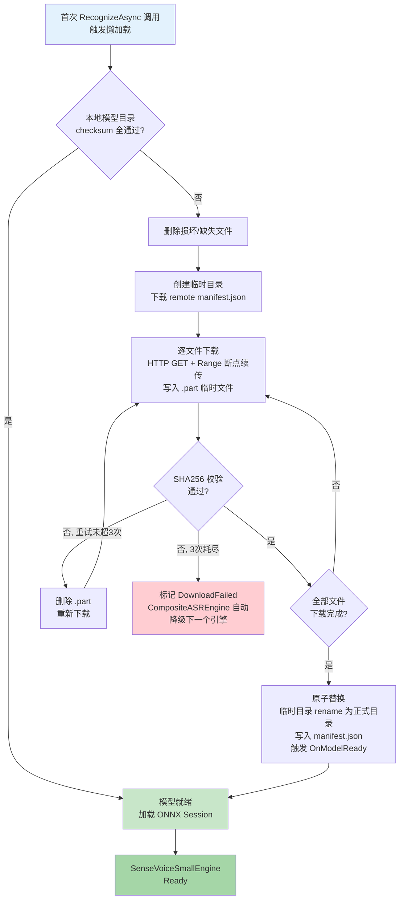

spec_mode: STANDARD

# 本地 ASR 引擎集成 PRD

> 版本: v1.0 | 日期: 2026-05-13 | 作者: @System Architect
> 依赖文档: [ASR 模块总览](../domain/asr_module.md) | [SenseVoiceSmall 推理架构](../domain/asr_sensevoice_small.md) | [可行性评估](../domain/asr_local_engine_evaluation.md)

---

## 目录

- [Part A: 产品需求](#part-a-产品需求)
  - [A1. 需求背景与目标](#a1-需求背景与目标)
  - [A2. 预期收益](#a2-预期收益)
  - [A3. SenseVoiceSmall 配置策略可选项](#a3-sensevoicesmall-配置策略可选项)
- [Part B: 架构设计](#part-b-架构设计)
  - [B1. 技术选型](#b1-技术选型)
  - [B2. 模块设计](#b2-模块设计)
  - [B3. 原流程图 (腾讯云 ASR)](#b3-原流程图-腾讯云-asr)
  - [B4. 新流程图 (策略模式 + 组合器)](#b4-新流程图-策略模式--组合器)
  - [B5. 差异点与风险点](#b5-差异点与风险点)
  - [B6. 步骤讲解](#b6-步骤讲解)
  - [B7. 兼容性设计](#b7-兼容性设计)
  - [B8. 回滚方案](#b8-回滚方案)
  - [B9. 模型文件生命周期管理](#b9-模型文件生命周期管理)
    - [9.0 下载与安装流程图](#90-模型在线异步下载与安装流程)
    - [9.4 下载核心逻辑](#94-下载核心逻辑)
- [Part C: 验收标准](#part-c-验收标准)

---

# Part A: 产品需求

## A1. 需求背景与目标

### 背景

当前 ReviewAnalysis 的 ASR 语音识别完全依赖腾讯云 `SentenceRecognition` API。每次识别需要：
- 获取 STS 临时凭证（网络请求）
- 将音频 Base64 编码后上传到腾讯云
- 等待云端返回识别结果

这带来三个核心问题：

| 问题 | 现状 | 影响 |
|------|------|------|
| **网络依赖** | 每次识别需稳定外网连接 | 网络波动导致识别失败，status=3 后无法自动恢复 |
| **QPS 限制** | 腾讯云 API 有 QPS 配额，满额后重试 300 次仍可能失败 | 高峰期大量视频识别失败 |
| **成本** | 按调用次数计费 | 随业务量线性增长 |

### 目标

在**不影响现有腾讯云 ASR 流程**的前提下，新增一个基于 SenseVoiceSmall ONNX 模型的本地 ASR 引擎，通过统一接口实现双引擎可切换、可回退。

### 核心原则

- [PRINCIPLE] [MUST] 现有腾讯云 ASR 代码路径**零改动**，仅加适配层
- [PRINCIPLE] [MUST] BLL 层不感知底层引擎类型
- [PRINCIPLE] [MUST] 本地引擎失败时自动降级到腾讯云（可配置）
- [PRINCIPLE] [MUST] 模型文件支持在线下载、断点续传、完整性校验、损坏自动修复

---

## A2. 预期收益

### 2.1 成本收益

| 收益维度 | 当前 (纯腾讯云) | 目标 (双引擎) | 预估节省 |
|----------|:-------------:|:-----------:|:------:|
| API 调用费用 | 每段音频 1 次调用 | 可降至 0（纯本地） | **100%**（本地引擎覆盖部分） |
| 网络带宽 | 每段上传 Base64 (~1.3x 原始大小) | 本地推理 0 带宽 | **100%**（本地引擎） |
| STS 凭证请求 | 每次识别 1 次 | 本地引擎跳过 | **100%**（本地引擎） |

### 2.2 稳定性收益

| 收益维度 | 当前 | 目标 |
|----------|------|------|
| 网络故障容忍 | 无网络 → 识别失败 (status=3) | 本地引擎离线可用 |
| QPS 限制 | 300 次重试仍可能失败 | 本地引擎无 QPS 限制 |
| 识别延迟 | 取决于网络 RTT + 云排队 | GPU 推理 < 1s / CPU 推理 3-8s |
| 失败恢复 | status=3 永久失败，无重拾机制 | 本地引擎失败可自动切回腾讯云 |

### 2.3 可扩展性

- 新增 ASR 引擎只需实现 `IASREngine` 接口，无需改动任何上层代码
- 未来可接入其他本地模型（Whisper、Paraformer）或多个云端 ASR 供应商

---

## A3. SenseVoiceSmall 配置策略可选项

本方案基于 SenseVoiceSmall 的任务向量（Task Embedding）系统，提供可配置的识别策略。以下是在项目 ASR 场景下的推荐配置：

### 3.1 默认推荐配置 (生产环境)

```
Language: auto (ID=0)    — 自动识别中/粤/英
Event:    nospeech (ID=13) — 过滤底噪
ITN:      withitn (ID=14)  — 输出标点 + 数字格式化
Norm:     norm (ID=11)     — 文本规整化
```

该组合对应腾讯云 `16k_zh` 模型的预期行为，是**最接近现有输出风格**的配置。

### 3.2 场景化配置策略（待测试评估）

| 场景 | Language | Event | ITN | Norm | 说明 |
|------|:---:|:---:|:---:|:---:|------|
| **通用直播字幕** (默认) | auto (0) | nospeech (13) | withitn (14) | norm (11) | 对标腾讯云 16k_zh |
| **纯中文直播** | zh (3) | nospeech (13) | withitn (14) | norm (11) | 防止中英混读误判，提升中文准确率 |
| **粤语直播** | auto (0) | nospeech (13) | withitn (14) | norm (11) | auto 可探测粤语，配合后处理繁转简 |
| **跨境电商/英语** | en (4) | nospeech (13) | withitn (14) | norm (11) | 纯英文场景 |
| **原始科研数据** | auto (0) | nospeech (13) | **woitn (15)** | **unorm (12)** | 保留原始发音文字，不做数字/符号转换 |
| **需保留背景音** | auto (0) | **withitn (14)** | withitn (14) | norm (11) | 用 `<|event|>` 标签标识背景音事件 |

### 3.3 配置映射机制

`engSerViceType` 参数复用现有字段，扩展为支持多引擎优先级链和 SenseVoiceSmall 详细配置。

> ✅ 配置模型已通过 `manyeyes/OfflineProjOfSenseVoiceSmall` 参考代码校正。
> 不再使用 4 段式 `lang:event:itn:norm`，精简为 2 段式 `lang:itn`。
> `event`/`emotion` 为硬编码 ID `[1, 2]`，不可配置。
> `norm`/`unorm` 不存在独立 ID，文本规整化是 `withitn` 的内置行为。

```
引擎配置语法:
  "<engine_type>[:config]"

engine_type:
  "tencent"    → 腾讯云引擎 (config 值直接作为 API EngSerViceType 参数)
  "svs"        → SenseVoiceSmall 本地引擎

config (仅 svs):  → lang:itn (2段冒号分隔)
  lang:  auto | zh | en | yue | nospeech
  itn:   withitn | woitn

管道语法 (多引擎优先级链, | 分隔, 左侧权重高优先):
  "<engine1>|<engine2>"
```

示例：

```
现有兼容:
  "16k_zh"                        → 腾讯云 TencentASREngine (完全向后兼容)

单引擎:
  "svs:auto:withitn"              → 仅 SenseVoiceSmall, 自动语种 + 标点/数字格式化
  "svs:zh:woitn"                  → 仅 SenseVoiceSmall, 纯中文 + 纯文本无标点
  "tencent"                       → 仅腾讯云

多引擎优先级链 (左侧优先):
  "svs:auto:withitn|tencent"
      → SenseVoiceSmall 优先, 失败自动降级 TencentASREngine
  "tencent|svs:zh:withitn"
      → 腾讯云优先, 失败降级 SenseVoiceSmall (纯中文)
```

**权重映射** (AsrEngineFactory 内部维护):

| 管道位置 | 权重值 | 说明 |
|:---:|:---:|------|
| 第 1 位 | 10 | 优先执行 |
| 第 2 位 | 7 | 一级降级 |

**判定逻辑**：包含 `|` 则解析为多引擎优先级链 → 创建 `CompositeASREngine`；否则单引擎直接使用。无 `svs:` 前缀默认走腾讯云。

### 3.4 不推荐启用的选项

| 选项 | 原因 |
|------|------|
| `woitn` 用于生产环境 | 无标点输出可读性极差，不适合 UI 展示 |
| 强制 `yue` (ID=7) 语种 | 输出繁体需额外 OpenCC 转换，增加复杂度和延迟（`auto` 已可自动处理粤语） |
| `nospeech` (ID=13) 作为 lang | 纯静音检测模式，不产生文本，仅用于判断音频是否含有效语音 |

---

# Part B: 架构设计

## B1. 技术选型

### 1.1 推理引擎

| 候选 | 选择 | 理由 |
|------|:---:|------|
| **ONNX Runtime** | ✅ | SenseVoiceSmall 官方导出格式；跨平台；支持 CPU/CUDA；C# 官方 NuGet 包 |
| PyTorch + Python 子进程 | ❌ | 跨进程通信开销大；部署 Python 环境复杂；不符合项目 .NET 技术栈 |
| TensorRT | ❌ | 仅限 NVIDIA GPU；需要 ONNX→TRT 转换；精度可能漂移 |

**NuGet 包**: `Microsoft.ML.OnnxRuntime` (CPU) / `Microsoft.ML.OnnxRuntime.Gpu` (CUDA)

### 1.2 音频解码

| 候选 | 选择 | 理由 |
|------|:---:|------|
| **NAudio** | ✅ | 纯 C# 实现；MP3 解码成熟；无需额外安装；NuGet 可用 |
| FFmpeg Process | ❌ | 进程启动开销；跨平台兼容性问题；错误处理复杂 |
| BASS | ❌ | 商业授权限制 |

**NuGet 包**: `NAudio` (MP3 → PCM `float[]`)

### 1.3 特征提取

| 候选 | 选择 | 理由 |
|------|:---:|------|
| **手工移植** (参考 FunASR Python) | ✅ | 对 SenseVoiceSmall 精度最可控；无外部依赖 |
| NWaves | 🔄 | 作为备选加速方案，提供 FFT/Mel 滤波器组基础实现 |
| 第三方 C++ DLL | ❌ | 跨平台部署困难；ABI 兼容性风险 |

### 1.4 模型下载与完整性

| 组件 | 选择 | 理由 |
|------|:---:|------|
| HTTP 下载 | `HttpClient` (已有单例) | 复用现有基础设施；支持断点续传 (Range header) |
| 完整性校验 | SHA256 | 下载后比对哈希值 |
| 存储路径 | `%LocalAppData%/ReviewAnalysis/models/` | 用户级隔离；不占项目目录 |

---

## B2. 模块设计

### 2.1 新增文件清单

```
Asr/
├── IASREngine.cs                 ← 新增：引擎抽象接口 (单段音频识别)
├── CompositeASREngine.cs         ← 新增：组合器，实现 IASREngine，按权重链式调用子引擎
├── TencentASREngine.cs           ← 新增：腾讯云引擎包装（适配现有 MyCallableTask）
├── SenseVoiceSmallEngine.cs      ← 新增：本地 ONNX 推理引擎 (不再耦合腾讯云降级)
├── FeatureExtractor.cs           ← 新增：FBank/LFR 特征提取
├── ModelManager.cs               ← 新增：模型下载、校验、生命周期管理 (内部懒加载)
├── AsrEngineFactory.cs           ← 新增：启动时预创建所有引擎实例，Build() 仅做编排返回组合器
│
├── AsrUtils.cs                   ← 修改：注入 CompositeASREngine，替换直接 new MyCallableTask
├── MyCallableTask.cs             ← 不改
├── ASRHttpUtils.cs               ← 不改
├── ASRResultEntity.cs            ← 不改
│   ... (其余现有文件均不改)
│
Utils/
└── AnalysisUtils.cs              ← 修改：checkAsrError() 追加新错误码映射
```

### 2.2 类图



**核心设计**：
- `CompositeASREngine` 本身实现 `IASREngine`，内部持有按权重排序的子引擎列表
- `AsrEngineFactory` 启动时预创建所有 `IASREngine` 实例放入池中（`SenseVoiceSmallEngine` 内部的 `ModelManager` 使用懒加载，不阻塞启动）
- 业务调用 `Build("svs:auto:withitn:norm", "tencent")` 时，Factory 仅从池中取出已创建实例，按权重排序后返回 `CompositeASREngine`
- `TencentASREngine` 和 `SenseVoiceSmallEngine` 彼此完全解耦，互不感知

### 2.3 模型管理器 (ModelManager)

ModelManager 是模型文件生命周期的核心组件，负责模型存在性检查、完整性校验、下载触发和状态管理。



---

## B3. 原流程图 (腾讯云 ASR)



---

## B4. 新流程图 (策略模式 + 组合器)



**关键变化**：
- SenseVoiceSmallEngine 不再硬编码腾讯云降级逻辑，自身只管识别
- 降级由 `CompositeASREngine` 统一编排：按权重从高到低依次尝试，任一成功即返回
- 权重映射在 `AsrEngineFactory` 内部维护：管道左侧权重高 (10)，右侧依次递减 (7)
- 业务配置 `"svs:auto:withitn|tencent"` 即表示 SenseVoiceSmall 优先、腾讯云兜底

---

## B5. 差异点与风险点

### 5.1 差异矩阵

| 差异维度 | 腾讯云引擎 | 本地引擎 | 影响 |
|----------|----------|---------|------|
| **输入格式** | MP3 Base64 | PCM float[] (16kHz mono) | 本地引擎内部加 NAudio 解码 |
| **凭证依赖** | STS AK/SK + Token | 无 | 本地引擎跳过 `AsrApi.GetTempToken()` |
| **网络依赖** | 必须外网 | 仅首次下载模型需要 | 离线可用 |
| **错误类型** | 签名过期/QPS超限/网络异常 | 模型加载失败/解码失败/推理异常 | 需追加错误码映射 |
| **重试策略** | QPS:300次 / 通用:3次 | 推理异常: 2次 | 本地引擎简化为 2 次 |
| **并发控制** | SemaphoreSlim(1) — API 限制 | SemaphoreSlim(1) — GPU 显存限制 | 均为 1，但原因不同 |
| **识别延迟** | 取决于 RTT (通常 1-3s/段) | GPU <1s / CPU 3-8s | 本地引擎延迟更可控 |
| **时间戳来源** | 腾讯云返回 (WordInfo=2) | CIF 峰值检测 (`TimestampLfr6`) | 帧级对齐 (60ms 粒度)，精度与腾讯云可比 |
| **标点输出** | 腾讯云返回 | SenseVoiceSmall withitn 模式 | 标点风格可能有差异 |

### 5.2 风险矩阵

| 风险 | 概率 | 影响 | 缓解措施 |
|------|:---:|:---:|------|
| FBank 特征提取精度不足导致识别率下降 | 中 | 高 | POC 阶段做逐层数值对比；与腾讯云结果 A/B 测试 |
| ONNX Runtime 与客户环境不兼容 | 低 | 高 | CPU 版本兜底；模型加载失败自动降级腾讯云 |
| 模型文件下载失败/磁盘不足 | 中 | 中 | 下载失败自动切腾讯云；磁盘检测前置；断点续传 |
| GPU 显存不足导致 OOM | 低 | 中 | 启动时检测显存；自动回退 CPU 推理 |
| 内存占用增加 (~500MB ONNX) | 高 | 低 | 延迟加载；仅在首次识别时初始化模型 |
| 中文数字 ITN 转换错误 | 中 | 中 | 后处理正则修正；withitn + norm 双重保障 |
| 时间戳偏移 | 中 | 低 | 对齐验证；提供全局偏移校正参数 |

---

## B6. 步骤讲解

### Phase 1: 启动初始化 — AsrEngineFactory 预创建引擎池

```
应用启动
  → AsrEngineFactory 构造函数
    → 预创建 TencentASREngine 实例 → 存入 _enginePool["tencent"]
    → 预创建 SenseVoiceSmallEngine 实例 → 存入 _enginePool["sensevoice"]
        (内部 ModelManager 懒加载: 不阻塞启动, 首次调用时触发下载)
    → 初始化 _weightMap: {"sensevoice":10, "tencent":7}
  → 引擎池就绪, 等待业务调用 Build()
```

**关键设计**：
- Factory **构造时**已创建所有 `IASREngine` 实例，避免每次 Build 重复创建造成资源泄露
- `SenseVoiceSmallEngine` 构造函数本身不加载 ONNX 模型，`ModelManager` 在首次 `RecognizeAsync` 调用时才触发下载和加载
- `TencentASREngine` 零初始化成本，立即可用

### Phase 2: 构建组合器 — Build() 仅做实例编排

```
BLL 调用 AsrUtils.AsrByDirectoryPath(dir, token, "svs:auto:withitn|tencent")

AsrEngineFactory.Build("svs:auto:withitn|tencent")
  → 解析管道语法:
      "svs:auto:withitn" → 权重 10 (位置1)
      "tencent"          → 权重 7  (位置2)
  → 从 _enginePool 取出已创建实例 (不 new):
      _enginePool["svs"] → 传入 config="auto:withitn"
      _enginePool["tencent"] → 传入 config="16k_zh"
  → 按权重降序排列 → new CompositeASREngine([sensevoice:10, tencent:7])
  → 返回 CompositeASREngine 实例
```

### Phase 3: 识别调用 — CompositeASREngine 权重链式执行

```
CompositeASREngine.RecognizeAsync(file, type)
  → foreach (engine, weight) in _engines (按权重降序):
      result = await engine.RecognizeAsync(file, type)
      if (int)result["code"] == 0:
        → 记录成功的引擎名称 + 权重
        → 直接返回 result  (★★★★ 不再尝试后续引擎)
      else:
        → 记录降级日志: "{engine} failed, downgrading to next"
        → continue  (★★★★ 尝试下一个引擎)
  → 所有引擎均失败:
      → 返回最后一个引擎的失败结果
```

**SenseVoiceSmall 单引擎内部流程**（不再感知腾讯云）：
```
SenseVoiceSmallEngine.RecognizeAsync(file, type)
  → ModelManager.IsModelReady? (懒加载触发点)
    NO  → 触发异步下载 → 等待完成 → 加载 ONNX
  → NAudio MP3 → PCM float[]
  → FeatureExtractor.ComputeFBankLFR(pcm)
  → embed.onnx → 指令向量
  → model.onnx → 推理
  → 后处理: 时间戳 + 1-12字合并 → ASRResultEntity
  → 返回 {code: 0, data: entity} 或 {code: 500, data: errorEntity}
```

**TencentASREngine 单引擎内部流程**（不再感知 SenseVoice）：
```
TencentASREngine.RecognizeAsync(file, type)
  → AsrApi.GetTempToken()
  → MyCallableTask.StartAsTask(stsToken, type)
  → 返回 {code, data: ASRResultEntity}
```

### Phase 4: 模型下载 (详见 B9.0 流程图)

ModelManager 关键行为简化如下：
- 懒加载：首次 `RecognizeAsync` 触发，非启动时阻塞
- 校验→下载→续传→校验→就绪，失败最多重试 3 次
- 下载期间该引擎返回失败，`CompositeASREngine` 自动降级到下一个引擎

---

## B7. 兼容性设计

### 7.1 接口兼容

```csharp
// TencentASREngine 完全包装现有 MyCallableTask 路径
// 输入输出格式零变化
public class TencentASREngine : IASREngine
{
    public async Task<Dictionary<string, object>> RecognizeAsync(
        FileInfo audioFile, string engSerViceType)
    {
        // 复用现有逻辑，MyCallableTask 代码一行不改
        var task = new MyCallableTask(audioFile, _token, _directoryPath);
        var stsToken = AsrApi.GetTempToken("");  // 现有凭证获取
        return await Task.Run(() => 
            task.StartAsTask(stsToken, engSerViceType));
    }
}
```

### 7.2 数据格式兼容

| 层 | 格式 | 腾讯云 | 本地引擎 | 兼容 |
|---|------|:---:|:---:|:---:|
| AsrUtils 输入 | `(string dir, string token, string engSerViceType)` | ✅ | ✅ | ✅ |
| AsrUtils 输出 | `Dictionary<string, object> {"code": int, "data": List<ASRResultEntity>}` | ✅ | ✅ | ✅ |
| BLL 消费 | `List<ASRResultEntity>` + `WordList` | ✅ | ✅ | ✅ |
| WordApi 输入 | `List<ASRResultEntity>` (含 WordList + Paragraph) | ✅ | ✅ | ✅ |
| 持久化 | `ASRResultEntity` → JSON → SQLite | ✅ | ✅ | ✅ |

### 7.3 错误码兼容

本地引擎新增错误码，**不影响现有腾讯云错误码语义**：

| Code | 腾讯云含义 | 本地引擎含义 |
|:----:|----------|------------|
| 0 | 成功 | 成功 |
| 500 | 识别失败 | 推理异常 (重试耗尽) |
| 601 | 签名过期 | **不产生** |
| 602 | 凭证获取失败 | **不产生** |
| 603 | QPS 已满 | **不产生** |
| 701 | 音频不存在 | 音频不存在 (AsrUtils 层面) |
| 702 | **未使用** | **模型加载失败** |
| 703 | **未使用** | **音频解码失败** |
| 704 | **未使用** | **输入超限 (>60s)** |

`AnalysisUtils.checkAsrError()` 追加映射：

```csharp
else if (code == 702) return "本地模型加载失败，请检查模型文件";
else if (code == 703) return "音频解码失败";
else if (code == 704) return "音频超出60秒限制";
```

### 7.4 引擎选择机制

`AsrEngineFactory.Build()` 解析 `engSerViceType`，返回 `CompositeASREngine`（多引擎）或单个 `IASREngine`：

```
"16k_zh"                              → TencentASREngine (现有行为，完全向后兼容)
"16k_en"                              → TencentASREngine (现有行为)
"svs:auto:withitn"                → SenseVoiceSmallEngine (本地单引擎，无降级)
"svs:auto:withitn|tencent"
    → CompositeASREngine([SenseVoiceSmall:10, Tencent:7]) (本地优先，腾讯云兜底)
"tencent|svs:zh:withitn"
    → CompositeASREngine([Tencent:10, SenseVoiceSmall:7]) (腾讯云优先，本地兜底)
```

**判定逻辑**：
- 包含 `|` → 解析管道语法 → 每个 token 从 `_enginePool` 取出预创建实例 → 按位置映射权重 → 创建 `CompositeASREngine`
- 不含 `|` → 单引擎模式，直接从 `_enginePool` 返回对应实例
- 无 `svs:` 前缀 → 腾讯云引擎，保证向后兼容

**Factory 伪代码**：

```csharp
public class AsrEngineFactory
{
    private Dictionary<string, IASREngine> _enginePool = new();
    private Dictionary<string, int> _weightMap = new() 
    {
        ["svs"] = -1,     // 运行时按位置计算
        ["tencent"] = -1
    };

    public AsrEngineFactory()
    {
        _enginePool["tencent"] = new TencentASREngine();
        _enginePool["svs"] = new SenseVoiceSmallEngine(); // 懒加载模型
    }

    public IASREngine Build(string engSerViceType)
    {
        var tokens = engSerViceType.Split('|');
        if (tokens.Length == 1)
            return _enginePool[ResolveType(tokens[0])]; // 单引擎

        // 多引擎: 按管道位置分配权重 (左侧高)
        var entries = tokens
            .Select((token, idx) => new EngineEntry(
                _enginePool[ResolveType(token)], 
                weight: 10 - idx * 3  // pos0=10, pos1=7, pos2=4
            ))
            .OrderByDescending(e => e.Weight)
            .ToList();
        return new CompositeASREngine(entries);
    }
}
```

---

## B8. 回滚方案

### 8.1 即时回滚 (运行时切换)

```
修改 engSerViceType 配置 (服务端下发 / 本地配置文件):
  "svs:auto:withitn|tencent"  →  "tencent"
  → 下一次 AnalysisVideo() 调用时 AsrEngineFactory.Build("tencent")
  → 直接从 _enginePool 返回 TencentASREngine (单引擎，无降级链)
  → 无需重启应用
```

### 8.2 自动降级机制 (CompositeASREngine 内建)

降级是 `CompositeASREngine` 的标准行为，**各子引擎互不感知**：

```
CompositeASREngine.RecognizeAsync()
  → SenseVoiceSmallEngine.RecognizeAsync() 失败 (模型未就绪/推理异常)
    → CompositeASREngine 自动尝试 TencentASREngine.RecognizeAsync()
    → TencentASREngine 成功 → 返回结果 (上层无感知)
  → 所有引擎失败 → 返回最终错误
```

降级不需要任何额外配置——只要 `engSerViceType` 配置了多引擎管道 `"svs:auto:withitn|tencent"`，降级自动生效。

### 8.3 完整回滚 (回归纯腾讯云)

1. 配置 `engine` 改为 `"16k_zh"`
2. 重启应用（或等待下一次识别自动切换）
3. 可选：卸载 ONNX Runtime NuGet 包，删除模型文件目录

### 8.4 回滚检查清单

- [ ] 修改配置 → 验证识别走 TencentASREngine
- [ ] 验证识别结果格式不变（WordApi 正常消费）
- [ ] 验证错误码映射还原为腾讯云语义
- [ ] 验证不产生 ONNX 相关日志

---

## B9. 模型文件生命周期管理

### 9.0 模型在线异步下载与安装流程

本图聚焦模型下载安装的 3 个阶段：**校验判断 → 断点续传下载 → 原子替换就绪**，以及下载期间 CompositeASREngine 的隐式降级行为。



**下载期间降级说明**：模型未就绪时 `RecognizeAsync` 返回失败，`CompositeASREngine` 自动尝试管道中下一个引擎（如腾讯云），业务层无感知。下载成功后下次调用即可走本地引擎。

### 9.1 模型文件清单

| 文件 | 大小 (估算) | 用途 |
|------|:---:|------|
| `model.onnx` | ~150 MB | SenseVoiceSmall 主模型 |
| `embed.onnx` | ~5 MB | 指令 Embedding 编码器 |
| `tokens.json` | ~50 KB | 词汇表 / Token 映射 |
| `manifest.json` | ~1 KB | 版本 + SHA256 校验清单 |

### 9.2 存储路径

```
%LocalAppData%/ReviewAnalysis/
└── models/
    └── sensevoice-small/
        ├── manifest.json       ← 版本 + 文件清单 + SHA256
        ├── model.onnx
        ├── embed.onnx
        └── tokens.json
```

设计原则：
- 用户级隔离 (`%LocalAppData%`)，不污染项目目录
- 多版本可共存（目录以模型名命名）
- `manifest.json` 为单一真相来源

### 9.3 manifest.json 结构

```json
{
  "modelName": "sensevoice-small",
  "version": "1.0.0",
  "downloadUrl": "https://cdn.example.com/models/sensevoice-small/",
  "files": [
    {
      "name": "model.onnx",
      "size": 157286400,
      "sha256": "a1b2c3d4e5f6..."
    },
    {
      "name": "embed.onnx",
      "size": 5242880,
      "sha256": "f6e5d4c3b2a1..."
    },
    {
      "name": "tokens.json",
      "size": 51200,
      "sha256": "1a2b3c4d5e6f..."
    }
  ]
}
```

### 9.4 下载核心逻辑

**触发条件**（满足任一即触发下载）:

1. 本地模型目录不存在
2. `manifest.json` 缺失
3. 任一文件缺失或大小为 0
4. 任一文件 SHA256 与 manifest 记录不匹配
5. manifest 版本 < 服务端最新版本（可配置跳过）

**断点续传**：下载时写入 `.part` 临时文件，中断后通过 `HTTP Range: bytes=已下载-` 续传。完成后 SHA256 校验 → 重命名为正式文件名。校验失败则删除重试，最多 3 次。

**原子替换**：全部文件下载完成并校验通过后，将临时目录 rename 为正式目录（若已有旧版则先 rename 为 `.old`），写入本地 `manifest.json`，触发 `OnModelReady`。

**损坏自愈**：每次 `IsModelReadyAsync()` 都会逐文件 SHA256 校验。发现损坏则删除对应文件，触发仅下载缺失文件的增量修复。

### 9.5 下载期间行为

| 时机 | 行为 |
|------|------|
| 应用启动，模型未就绪 | 异步下载，不阻塞主流程 |
| 下载期间收到 ASR 请求 | 自动降级到 TencentASREngine |
| 下载完成 | 下次 ASR 请求使用本地引擎 |
| 下载失败 (3次重试) | 回退到腾讯云；下次启动重新尝试 |
| 下载中应用退出 | .part 文件保留；下次启动续传 |

### 9.6 手动预置模型 (离线部署)

针对完全离线环境，支持从本地路径加载模型：

```json
{
  "asr": {
    "engine": "svs:auto:nospeech:withitn:norm",
    "modelSource": "local",
    "modelLocalPath": "D:\\models\\sensevoice-small\\"
  }
}
```

- `"modelSource": "remote"` (默认) — 在线下载
- `"modelSource": "local"` — 从指定本地路径加载，跳过下载

---

# Part C: 验收标准

## C1. 功能验收

- [ ] `IASREngine` 接口定义完成，两个实现类编译通过
- [ ] `TencentASREngine` 端到端识别结果与现有流程完全一致（回归测试通过）
- [ ] `SenseVoiceSmallEngine` 单段 59s 音频识别成功，返回有效 `ASRResultEntity`
- [ ] `WordList` 每条目字数在 1-12 之间，标点依附于前词
- [ ] 语言自动识别：普通话/粤语/英语混合内容测试通过
- [ ] ITN 模式：中文数字正确转换为阿拉伯数字
- [ ] 无音频输入时返回空 WordList（不崩溃）

## C2. 兼容性验收

- [ ] 不修改 `MyCallableTask.cs`、`ASRHttpUtils.cs` 任何一行代码
- [ ] `engSerViceType = "16k_zh"` 行为完全不变
- [ ] BLL 层 (`AnchorVideoBll` / `UploadFileBll`) 零改动
- [ ] `WordApi.WordsMark()` 能正常消费本地引擎产出的 `ASRResultEntity`
- [ ] 持久化格式不变（JSON + SQLite）

## C3. 降级与回滚验收

- [ ] 本地引擎推理失败 → 自动降级到腾讯云（配置开启时）
- [ ] 模型未就绪 → 走腾讯云路径
- [ ] 配置切换回 `16k_zh` → 纯腾讯云模式，所有行为恢复
- [ ] 降级过程中不丢失已识别段落

## C4. 模型管理验收

- [ ] 首次启动自动下载模型文件
- [ ] 下载支持断点续传（模拟网络中断）
- [ ] 文件 SHA256 校验失败自动重新下载
- [ ] 模型目录不存在自动触发下载
- [ ] 下载期间 ASR 请求不阻塞，走腾讯云
- [ ] 手动删除 model.onnx → 下次启动自动修复

## C5. 性能验收

- [ ] CPU 推理单段 59s 音频 ≤ 10 秒
- [ ] GPU 推理单段 59s 音频 ≤ 2 秒
- [ ] 内存增量 ≤ 600 MB (加载模型后)
- [ ] 模型加载时间 ≤ 5 秒 (CPU) / ≤ 3 秒 (GPU)

---

## 关联文档

- [ASR 模块总览](../domain/asr_module.md)
- [SenseVoiceSmall 推理架构方案](../domain/asr_sensevoice_small.md)
- [本地 ASR 引擎可行性评估](../domain/asr_local_engine_evaluation.md)
