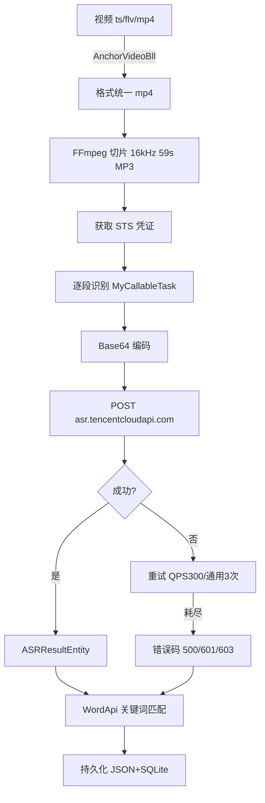
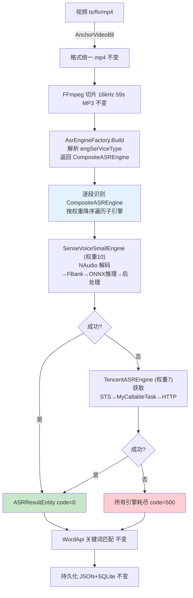
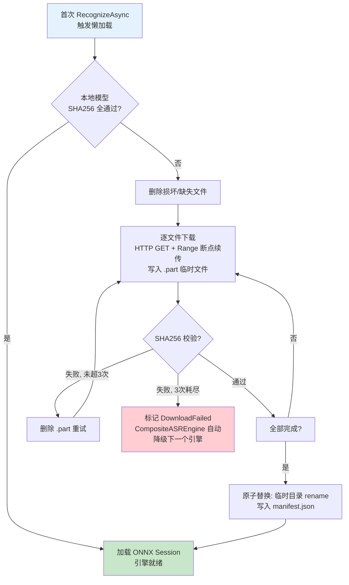

# 本地 ASR 引擎集成 — 统一 PRD + 架构设计

> 版本: v2.0 | 日期: 2026-05-13 | 作者: @System Architect
> 整合来源: [ASR 模块总览](../domain/asr_module.md) · [SenseVoiceSmall 推理架构](../domain/asr_sensevoice_small.md) · [可行性评估](../domain/asr_local_engine_evaluation.md)

---

## 目录

- [1. 需求背景与目标](#1-需求背景与目标)
- [2. 预期收益](#2-预期收益)
- [3. SenseVoiceSmall 模型技术规格](#3-sensevoicesmall-模型技术规格)
- [4. 架构设计](#4-架构设计)
- [5. 新旧流程对比](#5-新旧流程对比)
- [6. 实施计划与工程量](#6-实施计划与工程量)
- [7. 风险与缓解](#7-风险与缓解)
- [8. 兼容性与回滚](#8-兼容性与回滚)
- [9. 模型生命周期管理](#9-模型生命周期管理)
- [10. 验收标准](#10-验收标准)

---

## 1. 需求背景与目标

### 1.1 当前痛点

ReviewAnalysis 的 ASR 完全依赖腾讯云 `SentenceRecognition` API：

| 问题 | 现状 | 影响 |
|------|------|------|
| 网络依赖 | 每次识别需稳定外网连接 | 网络波动导致识别失败 |
| QPS 限制 | API 有 QPS 配额，满额后重试 300 次仍可能失败 | 高峰期大量视频识别失败 |
| 成本 | 按调用次数计费 | 随业务量线性增长 |

### 1.2 目标

在**不修改现有腾讯云 ASR 代码**的前提下，新增 SenseVoiceSmall ONNX 本地引擎。双引擎通过统一接口可切换、可自动降级。

### 1.3 核心原则

- [MUST] 现有腾讯云 ASR 代码路径零改动
- [MUST] BLL 层不感知底层引擎类型
- [MUST] 本地引擎失败时自动降级到腾讯云（可配置）
- [MUST] 模型文件支持在线下载、断点续传、SHA256 完整性校验

### 1.4 现有调用链

```
AnchorVideoBll / UploadFileBll
  → AsrUtils.AsrByDirectoryPath(dir, token, engSerViceType)
    → MyCallableTask(file, token, dir).StartAsTask(stsToken, modelType)
      → ASRHttpUtils.DoRequest(secretId, secretKey, token, body, modelType)
    → 返回 Dictionary<string, object> {"code": int, "data": List<ASRResultEntity>}
  → WordApi.WordsMark()
  → AnalysisUtils.saveVideoLocalAnalysisData()
```

**唯一替换点**：`MyCallableTask.StartAsTask()` — BLL 层完全不感知底层是腾讯云还是本地模型。

---

## 2. 预期收益

### 2.1 成本

| 收益维度 | 纯腾讯云 | 双引擎后 |
|----------|:-----:|:-----:|
| API 调用费用 | 每段 1 次 | 可降至 0（纯本地） |
| 网络带宽 | 每段上传 Base64 | 本地推理 0 带宽 |
| STS 凭证请求 | 每次识别 1 次 | 本地引擎跳过 |

### 2.2 稳定性

| 收益维度 | 当前 | 目标 |
|----------|------|------|
| 网络故障容忍 | 无网络 → 识别失败 | 本地引擎离线可用 |
| QPS 限制 | 300 次重试仍可能失败 | 本地引擎无 QPS 限制 |
| 识别延迟 | 取决于网络 RTT | GPU <2s / CPU 8-25s |
| 失败恢复 | 永久失败，无重拾 | 本地失败自动切回腾讯云 |

---

## 3. SenseVoiceSmall 模型技术规格

### 3.1 模型来源

| 项目 | 详情 |
|------|------|
| 模型名称 | SenseVoiceSmall-onnx |
| 来源 | ModelScope `iic/SenseVoiceSmall-onnx` |
| 格式 | ONNX 量化导出 |
| 官方运行时 | FunASR `runtime/csharp/AliParaformerAsr/` |
| C# 参考实现 | `WavFrontend.cs` + `OfflineProjOfSenseVoiceSmall.cs`（由 manyeyes 贡献） |

### 3.2 推理管道

```
PCM 16kHz mono
  → FBank (80维 Mel 滤波器组)
  → LFR 拼接 (560维特征向量)
  → ONNX 推理 (model.onnx)
  → GreedyDecode (token序列)
  → TimestampLfr6 (CIF 峰值→时间戳)
  → 词汇合并 (1-12字窗口)
  → ASRResultEntity
```

### 3.3 ONNX 模型输入输出

**已通过 FunASR 官方 C# 代码验证，ModelScope 模型为「新版」：**

| 节点 | 维度 | 类型 | 说明 |
|------|------|------|------|
| **输入** `speech` | [batch, T, 560] | float | FBank+LFR 特征 |
| **输入** `speech_lengths` | [batch] | int | 有效帧数 |
| **输入** `language` | [batch] | int | 语种 ID 标量 |
| **输入** `textnorm` | [batch] | int | withitn=14 / woitn=15 |
| 输出 | [batch, T, V] | float | token logits |
| 输出 | [batch] | int | 有效序列长度 |
| 输出 (可选) | [batch, T] | float | CIF peak 激活值 |

> **无需 embed.onnx**：新版模型 language/textnorm 以标量直接传入 ONNX 图，不需要额外的 Embedding 编码器。

### 3.4 FBank 特征提取

- 来源：FunASR 官方 `runtime/csharp/AliParaformerAsr/AliParaformerAsr/WavFrontend.cs`
- 80 维 Mel-FBank → LFR 拼接 → 560 维
- **直接复用，无需从 Python 移植**

### 3.5 任务配置 (Task Vector)

配置语法: `lang:itn`（2 段式冒号分隔）

#### 语种 (Language)

| Token | ID | 说明 |
|-------|:--:|------|
| `auto` | 0 | 自动识别中英粤 |
| `zh` | 3 | 强制中文普通话 |
| `en` | 4 | 强制英语 |
| `yue` | 7 | 强制粤语（输出繁体） |
| `ja` | 11 | 日语 |
| `ko` | 12 | 韩语 |
| `nospeech` | 13 | 纯静音检测 |

#### 文本标准化 (Text Norm) — 互斥

| Token | ID | 说明 |
|-------|:--:|------|
| `withitn` | 14 | 标点 + 数字格式化（**生产推荐**） |
| `woitn` | 15 | 纯文本，无标点无格式 |

> Event (ID=1) 和 Emotion (ID=2) 为硬编码，不可配置。不存在独立的 norm/unorm 任务 ID。

### 3.6 时间戳对齐 (CIF 机制)

- 算法：`TimestampLfr6(cifPeak, tokenIds)` — CIF 峰值检测
- 帧率：LFR6，每帧 60ms 物理时长
- 模型第 4 个输出为 `cif_peak` tensor

```csharp
Tensor<float> cifPeak = results[3].AsTensor<float>();
List<int[]> timestamps = ComputeHelper.TimestampLfr6(cifPeak, tokenIds);
// timestamps[i] = [startTime_ms, endTime_ms]
```

### 3.7 词汇合并

- 字数累计 ≥ 12 → 合并为一个 WordList 条目
- 遇到 `。` `？` `！` → 强制合并
- 语种标签切换 → 强制合并
- 标点依附前词，继承前词结束时间

### 3.8 GPU 加速

启动时自动探测硬件加速器，优先级：**CUDA > DirectML > CoreML > CPU**

```csharp
var providers = OrtEnv.Instance().GetAvailableProviders();
// HasCuda / HasDirectML / HasCoreML → 选最优 → SessionOptions
```

#### 推理延迟估算

| 硬件 | 后端 | 58s 音频延迟 | 显存 |
|------|------|:---:|:---:|
| RTX 3060+ (12GB) | CUDA | 0.5-1.5s | ~1.5GB |
| GTX 1650 (4GB) | CUDA | 2-4s | ~1.5GB |
| Intel Arc / AMD | DirectML | 3-6s | ~1.5GB |
| Apple M1-M3 | CoreML | 2-5s | ~1.0GB |
| i5-12400 | CPU MLAS | 15-25s | ~600MB RAM |
| i7-12700 | CPU MLAS | 8-15s | ~600MB RAM |

- 并发策略：`SemaphoreSlim(1)` 保守串行

### 3.9 推荐配置

| 场景 | 配置 | 说明 |
|------|------|------|
| **通用直播字幕**（默认） | `svs:auto:withitn` | 对标腾讯云 16k_zh |
| 纯中文直播 | `svs:zh:withitn` | 防止中英混读误判 |
| 跨境电商/英语 | `svs:en:withitn` | 纯英文场景 |
| 科研/原始数据 | `svs:auto:woitn` | 保留原始发音 |

---

## 4. 架构设计

### 4.1 技术选型

| 层次 | 选择 | 理由 |
|------|:---:|------|
| 推理引擎 | ONNX Runtime (NuGet) | SenseVoiceSmall 官方格式；跨平台 CPU/CUDA |
| 音频解码 | NAudio (NuGet) | 纯 C#；MP3→PCM float[]；零依赖 |
| FBank 特征 | 复用官方 WavFrontend.cs | FunASR 官方 C# 实现，无需移植 |
| 模型下载 | HttpClient Range 续传 | 已有单例复用；SHA256 校验 |

### 4.2 核心模式：策略 + 组合

```
                    ┌──────────────┐
                    │  IASREngine  │  (接口)
                    │  RecognizeAsync()
                    └──────┬───────┘
           ┌───────────────┼───────────────┐
           │               │               │
  ┌────────┴────────┐ ┌───┴────────────┐
  │CompositeASREngine│ │TencentASREngine│  SenseVoiceSmallEngine
  │ (权重链式降级)    │ │(适配现有代码)   │  (ONNX 本地推理)
  └────────┬────────┘ └────────────────┘
           │
    ┌──────┴──────┐
    │ 子引擎列表    │  按权重降序，任一成功即返回
    │ [svs:10]    │  全部失败 → 返回最终错误
    │ [tencent:7] │
    └─────────────┘
```

- `CompositeASREngine` 本身实现 `IASREngine`，内部持有按权重排序的子引擎
- `AsrEngineFactory` 启动时预创建所有引擎实例，`Build()` 仅做编排
- 子引擎彼此完全解耦，互不感知

### 4.3 新增/修改文件清单

```
Asr/
├── IASREngine.cs                 ← 新增：引擎接口
├── CompositeASREngine.cs         ← 新增：组合器，权重链式降级
├── TencentASREngine.cs           ← 新增：腾讯云适配器
├── SenseVoiceSmallEngine.cs      ← 新增：本地 ONNX 引擎
├── WavFrontend.cs                ← 新增：FBank+LFR 特征（复用 FunASR 官方）
├── OfflineModel.cs               ← 新增：ONNX Session 加载（复用 FunASR 官方）
├── ModelManager.cs               ← 新增：模型下载/校验/生命周期
├── GpuProbe.cs                   ← 新增：GPU 硬件探测
├── AsrEngineFactory.cs           ← 新增：工厂，预创建实例 + Build 编排
│
├── AsrUtils.cs                   ← 修改：注入 CompositeASREngine
├── MyCallableTask.cs             ← 不改
├── ASRHttpUtils.cs               ← 不改
├── ASRResultEntity.cs            ← 不改

Utils/
└── AnalysisUtils.cs              ← 修改：checkAsrError() 追加新错误码
```

### 4.4 引擎配置语法

```
语法:
  "<engine_type>[:config][|<engine2>...]"

engine_type:
  "tencent"    → 腾讯云（config = API EngSerViceType）
  "svs"        → SenseVoiceSmall 本地引擎

svs config:  lang:itn  (2段)
  lang:  auto | zh | en | yue | nospeech
  itn:   withitn | woitn

管道语法 (|):
  左侧权重高优先，失败自动降级右侧
```

示例：

```
"16k_zh"                       → TencentASREngine（完全向后兼容）
"svs:auto:withitn"             → 仅 SenseVoiceSmall
"svs:auto:withitn|tencent"     → 本地优先，腾讯云兜底
"tencent|svs:zh:withitn"       → 腾讯云优先，本地兜底
```

### 4.5 引擎工厂

```csharp
public class AsrEngineFactory
{
    private Dictionary<string, IASREngine> _enginePool = new();

    public AsrEngineFactory()
    {
        _enginePool["tencent"] = new TencentASREngine();        // 立即可用
        _enginePool["svs"] = new SenseVoiceSmallEngine();       // 懒加载模型
    }

    public IASREngine Build(string engSerViceType)
    {
        var tokens = engSerViceType.Split('|');
        if (tokens.Length == 1)
            return _enginePool[ResolveType(tokens[0])];         // 单引擎

        // 多引擎: 管道位置=权重 (左高右低)
        var entries = tokens.Select((t, i) => new EngineEntry(
            _enginePool[ResolveType(t)],
            weight: 10 - i * 3   // pos0=10, pos1=7, pos2=4
        )).OrderByDescending(e => e.Weight).ToList();

        return new CompositeASREngine(entries);
    }
}
```

### 4.6 识别调用链

```
CompositeASREngine.RecognizeAsync(file, type)
  → foreach (engine, weight) in _engines (按权重降序):
      result = await engine.RecognizeAsync(file, type)
      if result["code"] == 0 → 返回 (不再尝试后续)
      else → 记录降级日志 → continue
  → 所有引擎均失败 → 返回最终错误 code=500
```

**SenseVoiceSmallEngine 内部**（不感知腾讯云）：
```
NAudio MP3→PCM → WavFrontend FBank+LFR → model.onnx 推理
  → GreedyDecode → TimestampLfr6 → 词汇合并 → ASRResultEntity
```

**TencentASREngine 内部**（不感知本地引擎）：
```
AsrApi.GetTempToken → MyCallableTask.StartAsTask → 返回结果
```

### 4.7 错误码追加

新增错误码不影响现有语义：

| Code | 含义 | 触发条件 |
|:----:|------|---------|
| 0 | 成功 | — |
| 500 | 识别失败 | 推理异常或重试耗尽 |
| 702 | **新增** 模型加载失败 | ONNX 模型文件缺失或损坏 |
| 703 | **新增** 音频解码失败 | MP3→PCM 转换异常 |
| 704 | **新增** 输入超限 | 音频超过 60s |

---

## 5. 新旧流程对比

### 5.1 原流程（纯腾讯云）



### 5.2 新流程（双引擎 + 组合降级）



**关键变化**：SenseVoiceSmallEngine 和 TencentASREngine 互不感知，降级由 CompositeASREngine 统一编排。

---

## 6. 实施计划与工程量

### 6.1 任务分解

| # | 任务 | 文件 | 工作量 | 说明 |
|---|------|------|:---:|------|
| 1 | `IASREngine` 接口 | `Asr/IASREngine.cs` | 小 | 单方法，~15 行 |
| 2 | `TencentASREngine` 适配器 | `Asr/TencentASREngine.cs` | 小 | 包装 MyCallableTask，零改动 |
| 3 | `CompositeASREngine` 组合器 | `Asr/CompositeASREngine.cs` | 小 | 权重链式调用，~50 行 |
| 4 | `AsrEngineFactory` 工厂 | `Asr/AsrEngineFactory.cs` | 小 | 预创建 + Build 编排，~60 行 |
| 5 | FBank 特征提取 | 复用 `WavFrontend.cs` | **小** | FunASR 官方 C# 实现，直接集成 |
| 6 | ONNX 模型加载 | 复用 `OfflineModel.cs` | 小 | FunASR 官方 C# 实现 |
| 7 | `SenseVoiceSmallEngine` | `Asr/SenseVoiceSmallEngine.cs` | 中 | ONNX 推理 + 后处理，~200 行 |
| 8 | `GpuProbe` GPU 探测 | `Asr/GpuProbe.cs` | 小 | 硬件加速器检测，~70 行 |
| 9 | `ModelManager` 模型管理 | `Asr/ModelManager.cs` | 中 | 下载/校验/续传/原子替换，~150 行 |
| 10 | MP3→PCM 解码 | NAudio 集成 | 中 | `Mp3FileReader` → `float[]`，~30 行 |
| 11 | 时间戳对齐 + 词汇合并 | Engine 内 | 中 | 1-12 字窗口合并，~80 行 |
| 12 | 修改 `AsrUtils` | `Asr/AsrUtils.cs` | 小 | 注入 IASREngine |
| 13 | 追加错误码映射 | `Utils/AnalysisUtils.cs` | 小 | 702/703/704 中文映射 |

**总工时：4-6 天**（FBank 复用官方实现节省 2-3 天）

### 6.2 实施路径

```
Phase 1: POC 验证 (1天)
  ├── 集成 ONNX Runtime + 加载模型 (复用 OfflineModel.cs)
  ├── 集成 WavFrontend.cs + OfflineProjOfSenseVoiceSmall.cs
  ├── 单段音频推理 + 结果对比腾讯云 A/B
  └── 决策门: 准确率 ≥ 腾讯云 95% → 继续

Phase 2: 工程集成 (2-3天)
  ├── IASREngine 接口 + TencentASREngine + CompositeASREngine
  ├── AsrEngineFactory + SenseVoiceSmallEngine 完善
  ├── ModelManager 模型下载生命周期
  ├── AsrUtils 改造 + 引擎切换配置
  └── 错误码映射 + 日志

Phase 3: 测试验证 (1-2天)
  ├── 端到端集成测试 (录播+上传)
  ├── 边界 case (空音频/超长/纯音乐/纯噪音)
  ├── 并发稳定性测试
  └── 准确率对比报告
```

---

## 7. 风险与缓解

| 风险 | 概率 | 影响 | 缓解措施 |
|------|:---:|:---:|------|
| ~~FBank 特征提取精度不足~~ | ~~中~~ **已消除** | — | FunASR 官方 C# 实现可直接复用 |
| ONNX Runtime 环境不兼容 | 低 | 高 | CPU 版本兜底；加载失败自动降级腾讯云 |
| 模型文件下载失败/磁盘不足 | 中 | 中 | 下载失败自动切腾讯云；断点续传；磁盘检测前置 |
| GPU 显存不足 OOM | 低 | 中 | 启动时 GPU 探针检测；自动回退 CPU |
| 内存增加 (~600MB ONNX) | 高 | 低 | 延迟加载；首次识别时才初始化 |
| CPU 推理延迟偏高 (15-25s) | 高 | 中 | 仅 GPU 环境推荐生产使用；CPU 环境需评估接受度 |
| 时间戳偏移 | 中 | 低 | CIF 帧级对齐验证；提供全局偏移校正参数 |

---

## 8. 兼容性与回滚

### 8.1 数据格式兼容

所有层输入输出格式不变：

| 层 | 腾讯云 | 本地引擎 | 兼容 |
|---|:---:|:---:|:---:|
| AsrUtils 输入 | `(dir, token, engSerViceType)` | 同 | ✅ |
| AsrUtils 输出 | `{code, data: List<ASRResultEntity>}` | 同 | ✅ |
| BLL 消费 | `List<ASRResultEntity>` + `WordList` | 同 | ✅ |
| WordApi 消费 | 同 | 同 | ✅ |
| 持久化 | JSON + SQLite | 同 | ✅ |

### 8.2 运行时切换

```
"svs:auto:withitn|tencent"  →  "tencent"
  → 下一次 AnalysisVideo() 自动切换，无需重启
```

### 8.3 自动降级

配置 `"svs:auto:withitn|tencent"` 后，本地引擎失败时 CompositeASREngine 自动尝试腾讯云，业务层无感知。

### 8.4 完整回滚

1. 配置 `engSerViceType` 改回 `"16k_zh"`
2. 重启或等待下次识别自动切换
3. 可选：卸载 ONNX NuGet、删除模型目录

---

## 9. 模型生命周期管理

### 9.1 文件清单

| 文件 | 大小 | 来源 |
|------|:---:|------|
| `model.onnx` | ~150 MB | ModelScope `iic/SenseVoiceSmall-onnx` |
| `tokens.json` | ~50 KB | 同上 |
| `manifest.json` | ~1 KB | 部署服务器 |

> 新版模型不需要 `embed.onnx`。

### 9.2 存储路径

```
%LocalAppData%/ReviewAnalysis/
└── models/
    └── sensevoice-small/
        ├── manifest.json
        ├── model.onnx
        └── tokens.json
```

### 9.3 下载流程



### 9.4 下载期间行为

| 时机 | 行为 |
|------|------|
| 应用启动，模型未就绪 | 异步下载，不阻塞主流程 |
| 下载期间收到 ASR 请求 | CompositeASREngine 自动降级到腾讯云 |
| 下载完成 | 下次请求走本地引擎 |
| 下载失败 (3次重试耗尽) | 回退腾讯云；下次启动重新尝试 |
| 应用退出 | .part 文件保留，下次启动续传 |
| 手动删除 model.onnx | 下次校验发现损坏 → 自动修复 |

---

## 10. 验收标准

### 功能

- [ ] `IASREngine` 接口定义 + 3 个实现类编译通过
- [ ] `TencentASREngine` 端到端识别结果与现有流程完全一致
- [ ] `SenseVoiceSmallEngine` 单段 59s 音频识别成功，返回有效 `ASRResultEntity`
- [ ] `WordList` 每条目字数 1-12 之间，标点依附前词
- [ ] 中粤英混合识别测试通过
- [ ] `engSerViceType = "16k_zh"` 行为完全不变

### 降级与回滚

- [ ] 本地引擎失败 → 自动降级到腾讯云
- [ ] 模型未就绪 → 走腾讯云
- [ ] 配置切换回 `"16k_zh"` → 所有行为恢复

### 模型管理

- [ ] 首次启动自动下载模型
- [ ] 断点续传（模拟网络中断）
- [ ] SHA256 校验失败自动重新下载
- [ ] 手动删除 model.onnx → 自动修复

### 性能

- [ ] GPU 推理单段 59s ≤ 2 秒
- [ ] CPU 推理单段 59s ≤ 25 秒
- [ ] 内存增量 ≤ 600 MB
- [ ] BLL 层零改动

---

## 关联文档

- [ASR 模块总览](../domain/asr_module.md) — 现有腾讯云流程与架构
- [SenseVoiceSmall 推理架构](../domain/asr_sensevoice_small.md) — 模型推理细节
- [可行性评估](../domain/asr_local_engine_evaluation.md) — 风险评估与工程量
