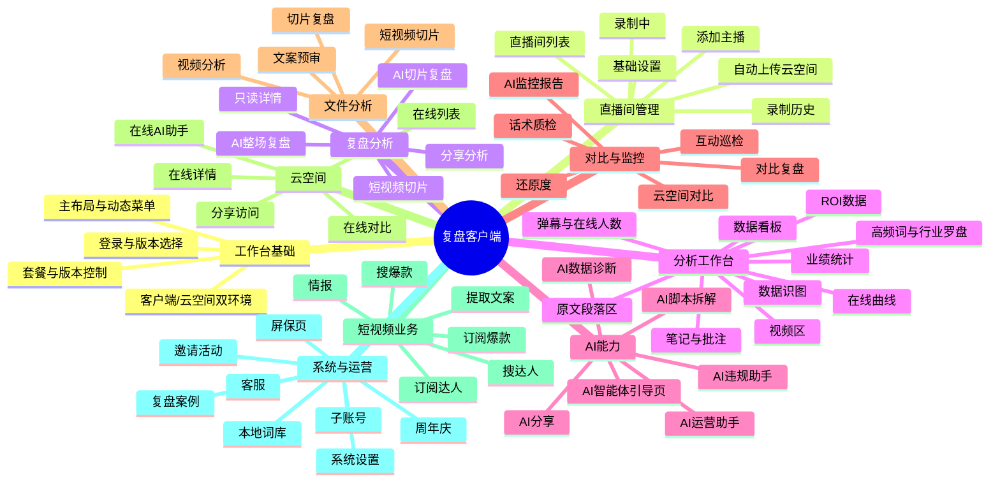
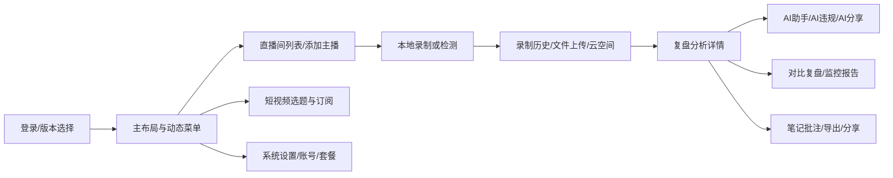

# 项目-复盘客户端-反向需求总览

## 本文档用途

- 基于当前前端代码、路由、菜单、组件、请求与状态实现，反向推理项目已经承载的需求范围与产品版图。
- 为后续开发智能体、需求分析智能体、评审智能体提供统一“基线地图”，避免只盯局部代码而偏离产品全貌。
- 明确哪些结论是“代码已落地的稳定事实”，哪些只是“高概率推断”，便于后续继续追溯到接口、PRD 或业务同学确认。

## 使用边界

- 本文档不是产品原始 PRD，而是“代码基线反推版需求总览”。
- 当本页与 `docs/需求版本库/README.md` 中的正式需求文档冲突时，正式需求仍应优先；本页主要承担“从现状代码理解系统”的作用。
- 本页偏全局导航与模块边界；更细的功能点、证据锚点与隐含约束，见《项目-复盘客户端-反向需求清单》。

## 反推方法

### 观察入口

- 路由与菜单：`src/router/index.js`、`src/router/permission.js`、`src/assets/json/menu.json`、`src/router/页面路由表.md`
- 页面模块：`src/views/modules/*`、`src/views/pages/*`
- 业务骨架：`src/views/commonComponent/*`、`src/components/analysis/*`
- 请求聚合：`src/utils/request-api-back.js`、`src/utils/request-api-client.js`
- 共享状态：`src/store/index.js`
- 复用协议：`src/mixins/*`

### 结论分级

- A 级：代码中已有清晰页面、路由、接口、状态、组件协同证据，可视为“已实现稳定能力”
- B 级：代码中有多个入口与局部实现，但业务规则可能仍依赖后端/配置，视为“高概率需求”
- C 级：仅在命名、按钮文案、弱引用路径中出现，视为“线索型推断”，后续应再结合 PRD/接口确认

## 项目一句话定位

`fupan-client` 是一个同时覆盖“本地客户端录制控制”和“云端分析/分享/AI 工作台”的直播复盘平台，核心主线是：

- 主播/直播间接入
- 录制或上传内容进入分析链路
- 围绕复盘详情承载文本、数据、图表、弹幕、AI 助手、监控报告、批注笔记
- 向云空间、分享页、短视频选题与企业运营场景延展

## 产品全景图

## 业务主链路

## 板块布局总表

| 板块 | 主要目标 | 代表入口 | 代表目录 | 结论级别 | 说明 |
| --- | --- | --- | --- | --- | --- |
| 工作台基础 | 提供登录后统一桌面壳、菜单、权限与页签体验 | `/login` `/versionSelection` `/layout` | `src/views/layout` `src/router` | A | 项目是典型桌面工作台，而不是单页营销站 |
| 直播间管理 | 管理主播、录制状态、历史记录、设置、知识库等 | `/dataAnalysis` `/addCompere` | `src/views/modules/dataAnalysis` `src/views/modules/addCompere` | A | 属于业务主入口之一 |
| 复盘分析 | 承接整场、切片、短视频切片等多种分析类型 | `/replay` `/section` `/short` | `src/views/modules/replay` | A | 项目核心业务域 |
| 对比复盘 | 多场数据/内容并排对比并进入 AI 分析 | `/contrastReplay` `/contrastSection` | `src/views/modules/replay/contrast` | A | 对比是独立产品能力，不是单页弹窗 |
| 文件分析 | 上传视频、文案、切片文件进入同一分析骨架 | `/playBckAnalysis` `/uploadVideo` | `src/views/modules/playBckAnalysis` `src/views/modules/replay/fileUpload` | A | 本地内容与外部文件双入口并存 |
| 云空间 | 支持在线内容浏览、分析、对比、AI 与分享访问 | `/online` `/onlineAnalysis/:type/:id` | `src/views/modules/online` `src/views/pages/onlineAnalysis` | A | Web 公开访问是完整产品面 |
| 分析工作台 | 在一个详情工作台中汇聚视频、文本、图表、AI、笔记、监控等 | 各类 `analysis` 页面 | `src/views/commonComponent/analysis*` `src/components/analysis` | A | 是整个项目的“核心操作台” |
| AI 能力 | 以运营助手、违规助手、AI 智能体为中心扩展分析结果消费方式 | `/aiAssistant` `/aiViolation` `/aiAgent` | `src/views/modules/ai*` `src/components/analysis/ai` | A | AI 已是产品级主功能，不只是点状外挂 |
| AI 监控 | 话术质检、互动巡检、还原度、监控报告形成新增业务线 | 录制列表、监控详情、AI 报告弹窗 | `src/views/modules/replay/monitorDetail` | A | 具备从列表到详情的完整链路 |
| 短视频业务 | 围绕达人、爆款、文案提取与情报做选题支持 | `/extractDoc` `/expert` `/subscribeExpert` | `src/views/modules/shortVideo` | A | 是相对独立的第二业务域 |
| 设置与运营 | 账号、套餐、子账号、词库、客服、邀请活动等 | `/system` `/invite` | `src/views/modules/setup` `src/views/modules/invite` | A | 承担运营与商业化支撑 |

## 信息架构判断

### 一级结构

从 `menu.json`、`nav.vue` 与 `src/views/modules/*` 可以反推出，项目的一级信息架构大体是：

1. 直播间与录制管理
2. 复盘与对比分析
3. 文件分析
4. AI 助手相关工作台
5. 云空间
6. 短视频业务
7. 系统设置与运营活动

### 二级结构

每个一级板块内部普遍采用“列表/入口页 -> 详情页 -> AI/只读/对比/导出”等衍生页的模式，例如：

- 复盘：列表 -> 分析详情 -> AI 助手 -> 只读页 -> 分享页
- 文件分析：上传入口 -> 分析详情 -> AI 助手 -> 只读页
- 云空间：在线列表 -> 在线详情 -> 在线对比 -> 在线 AI -> 外链分享
- 短视频：查询入口 -> 详情列表 -> 订阅管理/分组管理

### 统一壳层

项目并没有为每个板块设计完全不同的前端形态，而是通过统一的布局、动态菜单、复用的详情工作台与 AI 渲染层来承接不同业务场景，这意味着：

- 后续新增需求优先判断能否复用现有工作台骨架
- 详情类需求大概率不应重新起一套布局，而应接入 `analysis-item / analysisLayout / controlTabs`
- 列表类需求优先考虑 `CoreTable + table mixin` 协议

## 运行环境与产品分层

### 运行形态

- 客户端形态：强调本地录制控制、文件系统、C# 推送、本地服务调用
- Web/云空间形态：强调在线查看、分享、外链访问、云端数据消费

### 版本/套餐分层

代码中存在多类“可见能力裁剪”：

- 客户端版本差异：`AGENT` 与 `PURE` 的菜单和功能显隐不同
- 套餐等级差异：不同会员等级控制 AI、监控、数据、排班等能力入口
- 场景差异：`online/webOnline/example` 与本地客户端环境有不同展示与请求逻辑

### 反推出的产品策略

- 项目不是“所有人同一套功能”，而是明显存在版本化售卖与套餐升级引导
- 云空间不是简单镜像客户端，而是独立考虑了分享、公开访问和跨端只读场景
- AI 与监控能力正在从“高级附加能力”逐渐演变成核心卖点

## 核心工作台判断

### 为什么说“分析详情工作台”是项目中心

多个业务线最终都会汇入分析详情骨架：

- 本地录制复盘
- 文件上传分析
- 云空间分析
- 对比分析
- 只读分享页

它们虽然入口不同，但最终都围绕同一套能力展开：

- 视频/原文联动
- 分钟段落与搜索
- 弹幕、在线人数、语速、成交、互动等指标
- 高频词、行业罗盘、曲线、截图、看板、业绩、ROI
- AI 助手、AI 违规、AI 脚本拆解
- 笔记、批注、导出、分享

这说明后续任何“复盘增强型需求”都应优先从该工作台的扩展点思考，而不是孤立看某个页面。

## 需求域地图

### 1. 直播与录制域

- 目标：把主播接入系统，并对直播过程进行录制、检测、历史管理与设置配置。
- 典型能力：添加主播、查看录制中、录制历史、优秀账号热度榜、基础设置、自动上传云空间。

### 2. 复盘分析域

- 目标：把直播、切片、短视频、上传文件统一转成可分析内容。
- 典型能力：分析详情、AI 助手、只读详情、分析完成列表、对比列表。

### 3. 分析消费域

- 目标：帮助用户从视频与文本中提炼问题、亮点与优化方向。
- 典型能力：段落搜索、关键词/敏感词、行业识别、图表、看板、笔记、批注、导出。

### 4. AI 协同域

- 目标：把结构化分析结果进一步转化为运营建议、违规判断、脚本优化与分享内容。
- 典型能力：AI 运营助手、AI 违规助手、模型切换、知识库配置、AI 分享。

### 5. 监控与质检域

- 目标：对直播中的话术、互动、还原度等进行持续监控，并生成报告。
- 典型能力：监控开关、监控状态、报告列表、详情面板、未读态管理。

### 6. 短视频选题域

- 目标：把直播数据/内容进一步转化为短视频方向、达人参考、爆款参考与情报能力。
- 典型能力：提取文案、搜达人、订阅达人、搜爆款、订阅爆款、情报页。

### 7. 商业化与设置域

- 目标：承载账号、套餐、子账号、词库、客服、邀请等运营支撑能力。
- 典型能力：套餐展示、升级提示、二维码引导、词库维护、邀请记录。

## 后续开发防跑偏约束

### 需求理解侧

- 先判断需求落在哪个既有业务域，不要一上来新增全新板块。
- 先判断是否属于“详情工作台增强”，而不是新起一页。
- 先判断是否受版本、套餐、环境三类条件影响。

### 实现方案侧

- 列表页优先考虑 `CoreTable`、`table mixin`、既有搜索/分页协议。
- 详情页优先考虑 `analysis-item`、`analysisLayout`、`controlTabs`、`DiscernSearchContainer`。
- AI 渲染优先考虑 `src/components/aiContentRenderer/`，而不是自行拼接 Markdown/HTML。
- 升级提示、扫码弹窗、权限降级优先复用现有 `qrCodeGuard`、升级提示链路。

### 评估成本侧

- 若需求只是在现有分析骨架中加一个新指标、新 Tab、新按钮，通常属于“中低风险增量改造”。
- 若需求涉及新的环境分支、套餐权限、客户端与云端双通道适配，成本会明显升高。
- 若需求跨越 `menu -> route -> page -> analysisMixin -> API 聚合层 -> store` 多层，需优先做影响评估。

## 适合继续深挖的专题

- 《项目-复盘客户端-反向需求清单》：按业务域拆出的细粒度功能点与证据
- `wiki/项目-复盘客户端-路由与菜单体系.md`：看路由装配与信息架构
- `wiki/项目-复盘客户端-请求与接口体系.md`：看双通道接口与聚合层
- `wiki/项目-复盘客户端-状态管理.md`：看共享状态与页面耦合
- `wiki/项目-复盘客户端-组件体系.md`：看组件复用边界
- `src/router/页面路由表.md`：看页面 URL 与详情分流结构

## 结论

- 当前项目已经不是单一“直播复盘页面”，而是形成了以复盘工作台为中心、向 AI、监控、云空间、短视频、运营设置扩展的综合产品。
- 对后续开发最重要的不是“局部页面怎么改”，而是先确认需求在整张产品地图中的位置、边界与复用落点。
- 若将本页作为需求分析智能体的上游材料，最适合承担“建立全局上下文”和“识别需求落点”的职责。
