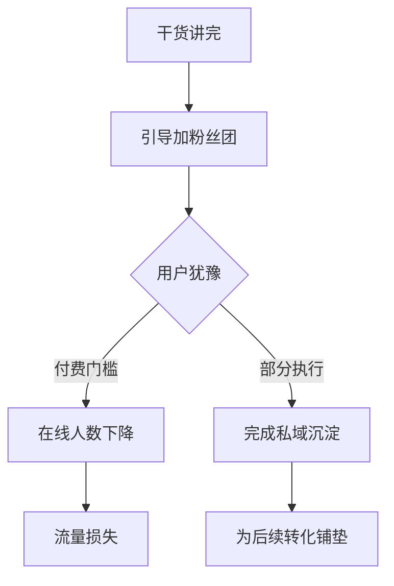

<!--
/**
 * @file 自定义标签使用方式与解析策略说明。
 * @description 按标签大类说明 aifupan 自定义标签的推荐写法、数据提取方式与渲染顺序，便于后续作为提示词与开发资料使用。
 */
-->

# 自定义标签使用方式与解析策略说明

## 一、目标

本说明用于回答两个核心问题：

1. 每个自定义标签推荐怎么写，才能尽量保留原始 Markdown 形态
2. 每类标签在解析器中应采用什么策略，是“先提取数据再渲染”，还是“先转 Markdown 再套样式”

核心原则：

- Markdown 主体优先
- 自定义标签轻标注优先
- 单标签优先声明渲染意图
- 双标签优先作为容器
- 数据型标签按类型单独拆分解析策略
- 自定义标签只负责样式增强，不应反向破坏原始 Markdown 的内容结构

## 二、总流程

当前推荐的整体流程如下：

1. 先扫描 `aifupan-` 标签
2. 判断标签属于“单标签意图型”还是“双标签容器型”
3. 对单标签尝试绑定下一行或下一块 Markdown 数据
4. 对 `aifupan-mermaid` 这类双标签先提取包裹内容，再识别其内部是否存在标准 ` ```mermaid ` fenced code block
5. 按标签类别决定：
   - 先提取结构化数据再渲染
   - 或先把 Markdown 转成 HTML 再套样式
6. 对剩余普通 Markdown 走原始 Markdown 渲染
7. 若最终 HTML 中仍残留明显 Markdown 语法，再补做一次 Markdown 清洗

## 三、标签分类与推荐策略

### 3.1 标题类

适用标签：

- `aifupan-title-*`
- `aifupan-title`

推荐写法：

```html
<aifupan-title-1-filled /> # 项目复盘报告
```

或：

```html
<aifupan-title>
## 项目复盘报告
</aifupan-title>
```

解析策略：

- 单标签标题：优先提取当前行尾随文本，并先判断是否是 Markdown 标题
- 若尾随文本是 `# / ## / ###` 标题，则以 Markdown 标题级别为准，自定义标签只负责样式
- 双标签标题：提取内部文本，优先判断是否包含 Markdown 标题，再生成标题样式

结论：

- **标题类属于“先识别 Markdown 标题级别，再套标题样式”**

### 3.2 容器类

适用标签：

- `aifupan-card`
- `aifupan-card-head`
- `aifupan-card-body`
- `aifupan-callout`
- `aifupan-columns-*`
- `aifupan-column`
- `aifupan-quote-modern`

推荐写法：

```html
<aifupan-card>
<aifupan-card-head>
### 核心问题
</aifupan-card-head>
<aifupan-card-body>
- 互动偏弱
- 转化链路不顺
</aifupan-card-body>
</aifupan-card>
```

解析策略：

- 先提取完整双标签包裹内容
- 再根据子标签结构拆分内容块
- 内部正文优先继续走 Markdown 渲染
- 最后再套卡片、提示块、分栏等容器样式

结论：

- **容器类属于“先提取内容，再做 Markdown，再包裹容器”**

### 3.2.1 备注标签（Note）

适用标签：

- `aifupan-note`

推荐写法（双标签包裹正文）：

```html
<aifupan-note title="备注">
这里是提示/免责声明/操作说明等“非正文内容”，用于醒目提示用户。
</aifupan-note>
```

解析策略：

- 备注标签只负责样式渲染，不根据内容做语义判断或自动分类
- 内部正文继续按 Markdown 渲染（允许包含普通 Markdown 与必要的 `aifupan-` 标签）

使用建议：

- 适合放在报告末尾的固定提示、免责声明、使用说明、交互引导等内容
- 需要醒目但不希望与正文报告产生强视觉关联时，优先使用 `aifupan-note`

### 3.3 列表类

适用标签：

- `aifupan-list-check`
- `aifupan-list-steps`
- `aifupan-list-icon`
- `aifupan-steps`

推荐写法：

```html
<aifupan-list-icon icon="check">
- 已完成脚本拆解
- 已完成数据复盘
</aifupan-list-icon>
```

解析策略：

- 提取内部列表项
- 将每一行列表项转换成结构化数组
- 再根据列表类型映射符号、序号或步骤样式

`list-icon` 特别说明：

- `icon` 只建议传语义值
- 推荐值：
  - `check`
  - `check-circle`
  - `warning`
  - `info`
  - `star`
  - `arrow`
  - `close`
  - `x-circle`
- 解析器应映射为可见符号，如：
  - `check -> ✅`
  - `check-circle -> ✅`
  - `warning -> ⚠️`
  - `star -> ⭐`
- 若不是预设白名单值，解析器直接回退为默认符号，不显示原始 icon 名称

结论：

- **列表类属于“先提取列表结构，再渲染样式”**

### 3.4 数据块类（DataBlock：JSON 包裹/隐藏/结构化渲染）

适用标签：

- `aifupan-data-block`

推荐写法：

~~~text
<aifupan-data-block type="structured" visible="false" cacheKey="quota">
```json
{ "limit": 10, "used": 3 }
```
</aifupan-data-block>
~~~

解析策略（推荐）：

1. 先提取 `aifupan-data-block` 双标签内的原始文本
2. 在内部内容中优先识别 ` ```json ` fenced code block，提取 JSON 字符串
3. 尝试解析 JSON：
   - 解析成功：写入缓存（按 cacheKey）；若 `visible=true` 再走 `type` 对应的 JSON 渲染器输出 HTML
   - 解析失败：降级为普通 Markdown 或输出“数据块解析失败”提示（避免直接把错误 JSON 原样展示）
4. 若 `visible=false`：
   - 必须从最终 HTML 中移除该数据块的可见内容
   - 仅保留缓存，供页面逻辑/函数调用取用

type 扩展建议：

- `structured`：走通用 JSON 渲染器（适合表格/卡片/进度等通用结构）
- `scriptQualityReport`：走“话术质检报告”结构化渲染模板（作为可复用示例）

参数约束补充：

- 当 `visible=false` 时：允许不传 `type`（仅缓存并过滤显示）
- 当 `visible=true` 时：建议传 `type`（用于选择渲染器）；不传则默认按 `structured` 处理
- DataBlock 标签基础语法/缓存/解析规则见：[data-block标签使用说明.md](file:///c:/Users/JYJY/Desktop/fupan-client/src/components/aiContentRenderer/prompt-doc/data-block标签使用说明.md)
- 各 `type` 的详细 JSON 字段约定与示例见：[data-block/README.md](file:///c:/Users/JYJY/Desktop/fupan-client/src/components/aiContentRenderer/prompt-doc/data-block/README.md)

### 3.3.1 Steps 特别说明

`aifupan-steps` 与普通列表不同，它不是“每一行都算一个步骤”，而是“先识别顶层步骤标题，再把后续内容归到对应步骤正文”。

推荐写法：

```html
<aifupan-steps>
<aifupan-steps-item name="步骤1：价值塑造与痛点放大" />
“你自己背要几个月，用我的方法只要几天。”
“补考费一次一两百，够买好几本书了。”

<aifupan-steps-item name="步骤2：产品卖点轰炸与稀缺性营造" />
“原价139，今天39.9，前27名。”
“送软件、送视频课、送500考题。”

<aifupan-steps-item name="步骤3：风险消除与行动指令" />
“7天无理由退货，运费险。”
“最后3本，抓紧支付。”
</aifupan-steps>
```

解析策略：

- 优先识别 `aifupan-steps-item name="步骤1"` 或 `<aifupan-steps-1 />` 这类单标签边界
- 若没有显式步骤标记，再回退识别 `步骤1：`、`步骤2：`、`步骤3：`
- 步骤标题以下的说明句、引用、补充点都归入该步骤正文
- 直到遇到下一个步骤标题，才开启新的步骤

不推荐写法：

- 把每一行说明都写成新的步骤
- 在没有明确步骤标题边界的情况下使用 `aifupan-steps`

结论：

- **`steps`** **属于“先识别步骤边界，再渲染步骤块”，不是简单按行拆分**

### 3.4 表格类

适用标签：

- `aifupan-table-striped`
- `aifupan-table-bordered`
- `aifupan-table-compact`
- `aifupan-table-hover`

推荐写法：

```html
<aifupan-table-striped>
| 指标 | 数值 |
|------|------|
| 互动率 | 2.02% |
</aifupan-table-striped>
```

解析策略：

- 先提取内部 Markdown 表格
- 将表格解析为 `headers + rows`
- 再按表格样式生成 HTML 表格

结论：

- **表格类属于“先提取表格数据，再渲染表格”**

### 3.5 图表类

适用标签：

- `aifupan-echarts-line`
- `aifupan-echarts-bar`
- `aifupan-echarts-pie`
- `aifupan-echarts-area`
- `aifupan-echarts-scatter`
- `aifupan-echarts-radar`

推荐写法一：双标签包裹表格

```html
<aifupan-echarts-pie title="年龄分布">
| 年龄段 | 占比 |
|--------|------|
| 18-23岁 | 18.06 |
| 24-30岁 | 29.34 |
</aifupan-echarts-pie>
```

推荐写法二：单标签绑定下一块表格

```html
<aifupan-echarts-pie title="年龄分布" />
| 年龄段 | 占比 |
|--------|------|
| 18-23岁 | 18.06 |
| 24-30岁 | 29.34 |
```

解析策略：

- 图表类不应先走原始 Markdown 表格渲染
- 应优先提取表格数据
- 然后根据图表类型转换为结构化序列
- 最后输出 SVG/HTML 图形

其中：

- `pie`：第一列为名称，第二列为数值
- `bar/line/area`：第一列为类目轴，第二列起为数值列
- `scatter/radar`：按专门数据结构提取
- `pie` 渲染结果应保持单层结构，标题、饼图、图例、表格直接放在同一个图表块中，不再额外嵌套二级卡片
- `aifupan-echarts-pie` 外层不建议再包裹 `aifupan-column`
- 若数值列是区间、箭头变化、趋势文案等非单值数据，如 `~300人 -> ~150人`，则不应生成图形，应回退为原始表格

结论：

- **图表类属于“先提取数据，再渲染图形”，不能先直接渲染原始 Markdown 表格**

### 3.6 数值类

适用标签：

- `aifupan-progress`
- `aifupan-statistic`
- `aifupan-statistic-trend`
- `aifupan-meter`

推荐写法：

```html
<aifupan-progress value="60" status="warning" /> 60%（警告）
```

```html
<aifupan-statistic title="平均在线人数" value="100">平均在线人数：100</aifupan-statistic>
```

```html
<aifupan-statistic title="总观看人次" value="5.67k" col="1">总观看人次：5.67k</aifupan-statistic>
<aifupan-statistic title="新增粉丝数" value="154" col="2">新增粉丝数：154</aifupan-statistic>
```

解析策略：

- 读取标签属性中的结构化数值
- 若标签后方或标签内部保留了原始文本，则优先将原始文本作为回退数据源
- 进行数值校验、百分比钳位、趋势方向判断
- 再渲染为卡片、进度条或趋势卡
- `statistic` 支持 `col="1|2|3|4"`，表示宽度占比，默认 `1` 为 1/4 行宽，`4` 为整行

限制说明：

- 此类标签可以使用属性承载数值
- 但不适合承载大段正文
- 若是纯文字洞见，不应用 `statistic`，应改用 `callout` 或 `card`
- 若需要兼顾 Markdown 原文保留与自定义渲染，推荐使用“标签 + 原始文本共存”或“双标签包裹原始文本”
- `statistic/statistic-trend` 现在更推荐双标签写法，便于保留原始 Markdown 文本

结论：

- **数值类属于“先读属性数据，再渲染组件”**

### 3.7 流程与漏斗类

适用标签：

- `aifupan-mermaid`
- `aifupan-flowchart`

推荐写法：

````html
<aifupan-mermaid>

</aifupan-mermaid>
````

解析策略：

- 先提取 `aifupan-mermaid` 包裹内容
- 优先识别内部标准 ` ```mermaid ` fenced code block
- 解析 Mermaid 节点、连线与分支标签
- `[]` 表示普通节点，`{}` 表示判断节点，判断节点的多条外连边表示多个分支
- 若结构可解析，则统一转为用户可读的纵向 PRD 树形 SVG
- 若结构不完整或语法异常，再回退为代码块展示

结论：

- **流程类属于“先提取结构，再决定是图形化展示还是代码回退”**

### 3.8 行内样式类

适用标签：

- `aifupan-highlight`
- `aifupan-mark-red`
- `aifupan-badge`
- `aifupan-tag`
- `aifupan-font`
- `aifupan-kbd`
- `aifupan-emoji`

推荐写法：

```html
这是 <aifupan-font color="red" weight="700">风险提示</aifupan-font>。
```

```html
这是一组标签：
<aifupan-tag-success>已完成</aifupan-tag-success>
<aifupan-tag-7>直播分类</aifupan-tag-7>
<aifupan-tag color="#1d4ed8">仅自定义文字色</aifupan-tag>
<aifupan-tag color="#0f172a" bgColor="#2ec5ff">自定义双色标签</aifupan-tag>
```

解析策略：

- 作为行内标签优先处理
- 提取内部文本后做行内 Markdown 解析
- 最后套颜色、背景、徽章、键帽等样式

其中 `aifupan-tag` 需要额外遵循以下规则：

1. 预设色兼容
   - 保留语义标签：`success / warning / danger / error / info / default`
   - 新增编号标签：`aifupan-tag-1` 到 `aifupan-tag-30`
   - 编号标签只负责取预设主色，实际背景和边框仍由渲染器统一转为透明色，避免色块过重

2. 自定义色优先级
   - `color`：文字颜色
   - `bgColor`：背景基准色
   - 只传 `color`：文字使用 `color`，背景和边框也基于 `color` 自动转透明
   - 同时传 `color + bgColor`：文字使用 `color`，背景和边框基于 `bgColor` 自动转透明

3. 透明度生成规则
   - 背景透明度固定走轻底色逻辑
   - 边框透明度略高于背景，保证边界可见但不刺眼
   - 即使 `bgColor` 已传入，也不应直接使用纯实色背景

4. 颜色输入限制
   - 推荐使用命名色、十六进制色、`rgb(...)` / `rgba(...)`
   - 若颜色值非法，回退到标签默认样式或预设色，不输出脏样式

推荐使用场景：

- 语义明确的状态标签：优先 `aifupan-tag-success` / `warning` / `error`
- 只需要换一组稳定常用色：优先 `aifupan-tag-1` ~ `aifupan-tag-30`
- 需要和业务主题精确对齐：使用 `color` / `bgColor`

结论：

- **行内样式类属于“先取文本，再行内渲染”**

## 四、推荐写法与不推荐写法

### 4.1 推荐

- 使用 Markdown 标题、列表、表格作为正文主体
- 用单标签声明图表、标题样式、颜色样式
- 用双标签做卡片、提示块、列布局
- 用图表标签包裹或绑定标准 Markdown 表格

### 4.2 不推荐

- 把大量业务文字塞进 `title=""`、`value=""`、`description=""`
- 使用未定义 iconfont 名称作为 `list-icon` 的 `icon`
- 让 `echarts-pie` 只输出标签而不提供表格数据
- 为了样式把正常 Markdown 全部改写成复杂标签属性

## 五、实现建议

建议渲染器内部按以下三条主线维护：

1. **行绑定型单标签**
   - 标题
   - 图表
   - 部分短文本样式
2. **容器型双标签**
   - 卡片
   - 提示块
   - 分栏
   - 表格样式
3. **数据提取型标签**
   - 图表
   - 数值卡片
   - 流程与漏斗

## 六、总结

最终推荐方案不是“全面依赖自定义标签”，而是：

- 继续保留 Markdown 的主体表达能力
- 让自定义标签只做“渲染意图声明”和“局部样式增强”
- 对少数需要结构化解析的模块，走独立的数据提取逻辑

这样既能保留原始 Markdown 文档的可读性，也能满足自定义渲染和样式控制需求。
