# 企业后台管理账户体系设计文档

## 1. 系统概述

### 1.1 系统定位

本文档描述"企业后台管理系统"（fupan-governance-server）的完整账户体系架构，包括其与"爱复盘后台系统"（back-fupan-server）的双系统联动机制。

| 系统 | 角色 | 核心职责 |
|------|------|----------|
| **企业后台管理系统** | 企业管理端 | 管理 Employee（员工）、组织架构、RBAC权限、直播间数据 |
| **爱复盘后台系统** | 直播复盘端 | 管理 User（回放账号）、直播数据、录制与回放功能 |

### 1.2 账户体系全景架构

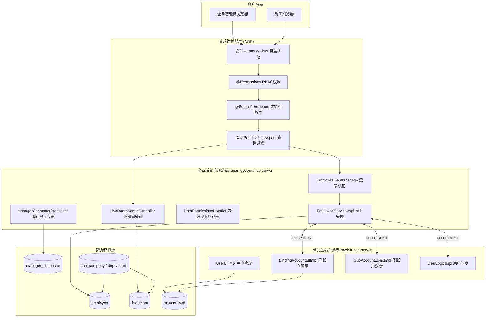

### 1.3 系统交互全景与数据流向

企业后台管理系统的账户体系核心特征在于其**跨系统联动架构**。两个独立部署的系统（企业后台管理系统和爱复盘后台系统）通过 HTTP REST 接口实现账户的创建、绑定、同步和注销，而数据权限体系则完全在企业后台管理系统内部通过 Spring AOP 拦截机制实现。

**账户联动数据流**：

1. **创建方向**：当企业管理员在企业管理后台创建一个 Employee 并赋予录制权限（`onRec=true`）时，企业后台管理系统会主动调用爱复盘后台系统的子账户绑定接口，在远端创建一个类型为 `userType=2` 的子账户，并将返回的 `tb_user.id` 回写到本地 `Employee.connectorClientUserId` 字段。这个字段是两套系统账户数据关联的**唯一桥梁**。

2. **同步方向**：企业后台管理系统通过定时或手动触发 `syncSubAccount()` 方法，从爱复盘后台系统拉取全量子账户列表，然后与本地 Employee 表进行**双向对账**：远端子账户在本地没有对应 Employee 的则自动创建；远端子账户已被删除的则自动解绑本地的关联关系；跨租户同名手机号但远端已冻结的，则在本地的其他租户中也将对应 Employee 状态标记为 FREEZE。

3. **登录方向**：当用户在企业后台管理系统输入手机号和密码登录时，系统首先在本地 Employee 表中查找。如果密码不匹配，系统会进一步向爱复盘后台系统发起查询——检查该手机号是否在远端存在一个符合条件的主账户（`userType=0` 且套餐等级达标）。如果存在，则执行**首次主账户登录初始化**流程，从远端数据创建本地 Employee 并完成租户初始化。

4. **注销方向**：当 Employee 被禁用或删除时，如果该 Employee 拥有远端子账户关联（`connectorClientUserId > 0` 且 `onRec=true`），系统会调用远端解绑接口释放子账户资源。特别地，如果被解绑的是租户主账户（`holdTenant=true`），系统将触发整个租户的作废流程——该租户下所有 Employee 被批量设置为 FREEZE 状态，所有权限缓存被清除。

**数据权限数据流**：

1. 用户登录后，系统通过 `ManagerConnectorProcessor` 从 `manager_connector` 表中查询该用户在各组织层级（子公司、部门、小组、直播间）的管理员关联关系。
2. 查询结果经过 Redis 三级缓存（用户权限缓存 1 小时、租户全量缓存 1~7 天、组织子级缓存 3 天）加速后返回。
3. 当用户发起数据查询时，`DataPermissionsAspect` 拦截带有 `DataPermissionsRequest` 参数的方法，调用 `DataPermissionsHandler.apply()` 将用户的可见组织 ID 列表注入到请求对象中。
4. MyBatis Mapper SQL 通过 `company_id IN (...) OR dept_id IN (...) OR team_id IN (...)` 的三层 OR 条件实现行级数据隔离。

### 1.4 关键设计原则

**原则一：远端为真（Remote as Source of Truth）**

爱复盘后台系统的 User 数据是子账户的权威数据源。任何子账户的状态变更（冻结、注销、密码修改）都在远端发生，企业后台管理系统通过 `syncSubAccount()` 同步机制单向拉取远端状态。本地对子账户的修改（如解绑、禁用）最终也通过 REST 调用同步回远端。

**原则二：租户隔离 + 组织穿透**

数据权限的隔离以租户（Tenant）为第一维度，同一租户内的数据可见性由组织层级（子公司 → 部门 → 小组 → 直播间 → 员工）的上下级关系决定。上级管理员可以**穿透查看**所有下级组织的数据（例如子公司管理员能看到该公司下所有部门的直播数据），而平级组织之间互相隔离。

**原则三：手机号作为全局关联键**

在跨系统、跨租户的场景中，手机号（mobile）是识别同一自然人身份的唯一全局标识。`getMobileLoginAccount` 方法通过手机号跨所有租户查询 Employee，支持一个自然人在多个租户中拥有不同的 Employee 身份。

**原则四：AOP 驱动的无侵入权限**

权限校验不依赖 Servlet Filter 或 HandlerInterceptor，而是完全通过 Spring AOP 注解（`@GovernanceUser`、`@Permissions`、`@BeforePermission`）和切面（`DataPermissionsAspect`）实现。这种设计的优势在于：权限逻辑与业务代码解耦；可以在方法级别精细控制权限粒度；支持 SpEL 表达式动态获取参数中的数据 ID。

---

## 2. 请求拦截器（三层认证体系）

**重要说明：** 系统不使用传统的 Servlet Filter / HandlerInterceptor 拦截器，而是通过 **Spring AOP 注解驱动** 的拦截机制实现三层认证：

### 2.1 第一层：@GovernanceUser — 用户类型认证

```java
@RequiredLogin(OauthConstant.GOVERNANCE_USER)  // governance_user
@Retention(RetentionPolicy.RUNTIME)
@Target({ElementType.METHOD, ElementType.TYPE})
public @interface GovernanceUser {}
```

**业务规则说明**：

系统定义了三类用户类型，每类用户只能访问标记了对应注解的接口。`@GovernanceUser` 注解是三层认证体系的第一道防线，它在方法执行之前验证当前请求的访问令牌（Token）中的 `userType` 字段值。

- 注解可以加在 Controller 类级别，表示该 Controller 下所有公开方法都需要 `governance_user` 类型的令牌
- 也可以加在具体方法级别，实现更精细的控制
- 框架在执行方法前从请求上下文中提取 `AccessUser` 对象，检查其 `userType` 是否为 `governance_user`
- 如果用户类型不匹配（例如 `system_user` 或 `client_user` 的令牌试图访问标记了 `@GovernanceUser` 的接口），框架会直接拦截请求并返回认证失败响应，后续的 `@Permissions` 和 `@BeforePermission` 不会被触发

**三种用户类型的隔离策略**：

- `governance_user`：企业后台管理系统的用户（Employee），通过企业后台的登录接口获得令牌。这类用户拥有完整的组织架构数据访问能力（受 `@BeforePermission` 限制）。
- `system_user`：爱复盘后台系统的用户（User），通过爱复盘后台系统的登录接口获得令牌。这类用户在企业后台管理系统中只能访问与其关联的特定数据，通常用于回调接口。
- `client_user`：C 端客户端用户，权限范围最小，通常只能访问公开的直播间数据。

> 三种用户类型常量定义在 [OauthConstant](file:///Users/hehui/dev/git/jiuyu/fupan-governance-server/src/main/java/com/jiuyu/governance/plugins/oauth/pojo/OauthConstant.java)：
>
> | 常量 | 值 | 说明 |
> |------|-----|------|
> | `GOVERNANCE_USER` | `governance_user` | 企业后台管理用户 |
> | `SYSTEM_USER` | `system_user` | 爱复盘后台系统用户 |
> | `CLIENT_USER` | `client_user` | 客户端用户 |

### 2.2 第二层：@Permissions — 功能权限 (RBAC)

```java
@Permissions({"room:mgmt:add", "room:mgmt:update"})
public ApiResponse<Void> addLiveRoom(...) { ... }
```

**业务规则说明**：

`@Permissions` 注解实现了基于角色的访问控制（Role-Based Access Control）。它不关心数据的内容范围，只关心**当前用户是否拥有执行某个操作的资格**。

- 注解值是一个字符串数组，每个字符串代表一个功能权限标识（Permission Code）
- 权限标识通常遵循 `模块:子模块:操作` 的命名规范，例如 `room:mgmt:add` 表示直播间管理模块的添加操作
- 框架在执行方法前，从用户的角色（Role）中查找其拥有的权限标识列表，然后与注解声明的权限标识做交集匹配
- 如果用户不拥有任何一个声明的权限标识，请求被拒绝，返回无权限错误

**权限与角色的关系**：

在 RBAC 体系中，权限不直接授予用户，而是通过角色间接授予：

```
角色 (Role) → 权限 (Permission) → API方法
用户 (Employee) → 角色 (Role)
```

一个 Employee 可以拥有多个角色，一个角色可以包含多个权限标识，一个 API 方法可以标记多个所需的权限标识。这种多层间接关系使得权限管理具有极大的灵活性——管理员只需要调整用户的角色即可控制其可访问的功能范围，而无需逐个修改 API 的权限配置。

**权限标识的粒度控制**：

- **粗粒度**：`@Permissions({"admin"})` — 标记为管理员权限，拥有此标识的用户可以访问所有管理功能
- **中粒度**：`@Permissions({"room:mgmt"})` — 直播间管理模块的所有操作
- **细粒度**：`@Permissions({"room:mgmt:add"})` — 仅限添加直播间的操作

### 2.3 第三层：@BeforePermission — 数据行权限前置验证

```java
@BeforePermission(type = OauthConstant.COMPANY, dataId = "#request.companyId")
public ApiResponse<Void> updateCompany(...) { ... }
```

**业务规则说明**：

`@BeforePermission` 是三层体系中最精细的一层，它回答的问题是：**当前用户是否有权操作这个具体的数据行（例如这个子公司、这个直播间）？**

与 `@Permissions` 不同，`@BeforePermission` 关注的是数据对象级别的权限，而非功能操作级别的权限。它通过对比**被操作数据所属的组织 ID** 与**用户所管理的组织 ID 范围**来判断权限。

**核心字段说明**：

- `type`：指定权限维度类型。可选的类型常量包括 `OauthConstant.COMPANY`（子公司维度）、`OauthConstant.DEPT`（部门维度）、`OauthConstant.TEAM`（小组维度）、`OauthConstant.LIVE_ROOM`（直播间维度）、`OauthConstant.EMPLOYEE`（人员维度）
- `dataId`：通过 SpEL（Spring Expression Language）表达式指定要校验的数据 ID。`#request.companyId` 表示从方法参数 `request` 对象中提取 `companyId` 字段的值
- `enableLevel`：是否启用层级穿透验证。当设为 `true` 时，如果用户是某公司的管理员，他可以操作该公司下属的所有部门和小组数据，而不需要被显式添加为这些下属组织的管理员
- `Multiple`：支持多组权限条件组合。当需要同时验证多个维度的权限时（例如既要验证用户管理该子公司，又要验证用户管理该部门），可以使用 `@BeforePermission.Multiple` 包装多个 `@BeforePermission` 实例

**Level 模式的工作原理**：

```
enableLevel = true 时：
  如果 type = COMPANY, dataId = 公司A
  → 检查用户的管理范围是否包含 公司A 或 公司A的下级(部门、小组)
  → 如果用户是部门B的管理员，而部门B属于公司A，也判定为有权限
```

**SpEL 表达式支持**：

`dataId` 字段使用 SpEL 表达式，可以从方法参数中动态提取数据 ID，常见的表达式模式包括：
- `#request.companyId` — 从请求对象的字段取值
- `#id` — 直接取方法参数值
- `#room.companyId` — 从嵌套对象的字段取值

### 2.4 DataPermissionsAspect — 查询结果过滤

通过 `DataPermissionsHandler.apply(request, businessFunction)` 模式，在查询泛型方法执行前，将用户的**可见数据范围ID**注入到 `DataPermissionsRequest` 中（如 `dataCompanyIds`、`dataDeptIds`、`dataTeamIds`），实现 SQL 级别的数据隔离。

**可见数据范围规则（字段级说明）**：

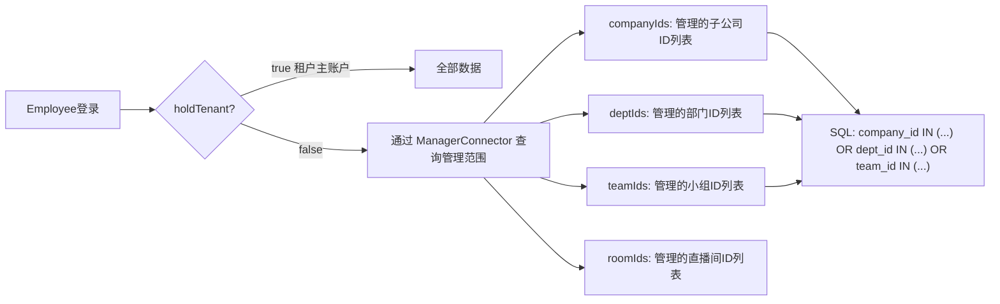

---

## 3. 登录认证流程（最高优先级）

### 3.1 登录入口

登录接口定义在 [EmployeeOauthController](file:///Users/hehui/dev/git/jiuyu/fupan-governance-server/src/main/java/com/jiuyu/governance/business/rbac/controller/EmployeeOauthController.java)，核心逻辑在 [EmployeeOauthManage](file:///Users/hehui/dev/git/jiuyu/fupan-governance-server/src/main/java/com/jiuyu/governance/business/rbac/service/impl/EmployeeOauthManage.java)。

支持两种登录方式：
- **密码登录** (`POST /password-login`)：手机号 + 密码
- **验证码登录** (`POST /code-login`)：手机号 + 短信验证码

### 3.2 密码登录完整流程

**业务流程逐步说明**：

密码登录是整个账户体系中最复杂的流程，因为它需要处理三种不同的登录场景：**已有 Employee 登录**、**首次主账户登录**、**密码错误**。每一步都有明确的判断条件和处理逻辑。

**Step 1 — 多租户手机号查询**：

系统首先调用 `EmployeeServiceImpl.getMobileLoginAccount(mobile)` 方法，以手机号为条件，跨所有租户查询 Employee 表。这一步的查询是无租户隔离的——因为系统需要判断该手机号在哪些租户中注册了 Employee。

查询结果按以下优先级排序：
- 第一优先级：账户状态为 NORMAL（正常）的记录
- 第二优先级：其他状态（DISABLED、FREEZE）的记录
- 在每个优先级组内，进一步按 `onRec=true`（有录制权限）优先、然后 `holdTenant=true`（租户主账户）优先的顺序排列

如果查询结果为空，意味着该手机号未在任何租户中注册，系统直接返回"账号不存在"错误。

**Step 2 — 密码验证**：

系统取排序后的第一条 Employee 记录，调用 `passwordService.matches()` 方法将用户输入的明文密码与数据库中存储的 BCrypt 哈希值进行比对。BCrypt 是一种单向哈希算法，即使数据库泄露也无法还原明文密码。

**Step 3 — 首次主账户登录（降级路径）**：

如果密码不匹配，系统不会立即返回"密码错误"。相反，它启动一条**降级路径**：向爱复盘后台系统发起 REST 调用，查询该手机号在远端是否存在一个主账户。

远端返回的 `ReplayAccessUser` 对象需要满足两个条件才能进入首次登录流程：
- `userType == 0`（必须是主账户类型，而非子账户）
- `packageLevel >= MIN_GOVERNANCE_LEVEL`（套餐等级达到企业后台管理的最低要求）

如果远端存在符合条件的主账户，系统执行 `doInitLogin()` 流程：
1. 检查该租户是否已经存在，如果不存在则创建租户主 AccessUser，执行 `tenantInitializationManage.runInit()` 初始化租户的基础数据
2. 调用 `employeeService.addForReplayAccount()` 从远端数据创建本地 Employee 记录
3. 如果本地已存在同名 Employee（由之前的同步操作创建），则直接复用
4. 最后执行正常的 `doLogin()` 生成令牌

这个降级路径的设计目的是支持**从爱复盘后台系统迁移到企业后台管理系统的用户**——他们已经在远端注册了主账户，但尚未在企业后台管理系统中登录过。通过这个流程，系统实现了"无感迁移"。

**Step 4 — 真正的密码错误**：

如果远端的查询也返回空（该手机号在远端不存在符合条件的主账户），系统才最终判定为"密码不正确"并拒绝登录。这个判断顺序确保了：只有同时排除了"本地密码匹配"和"远端首次登录"两种可能后，才给出密码错误的结论。

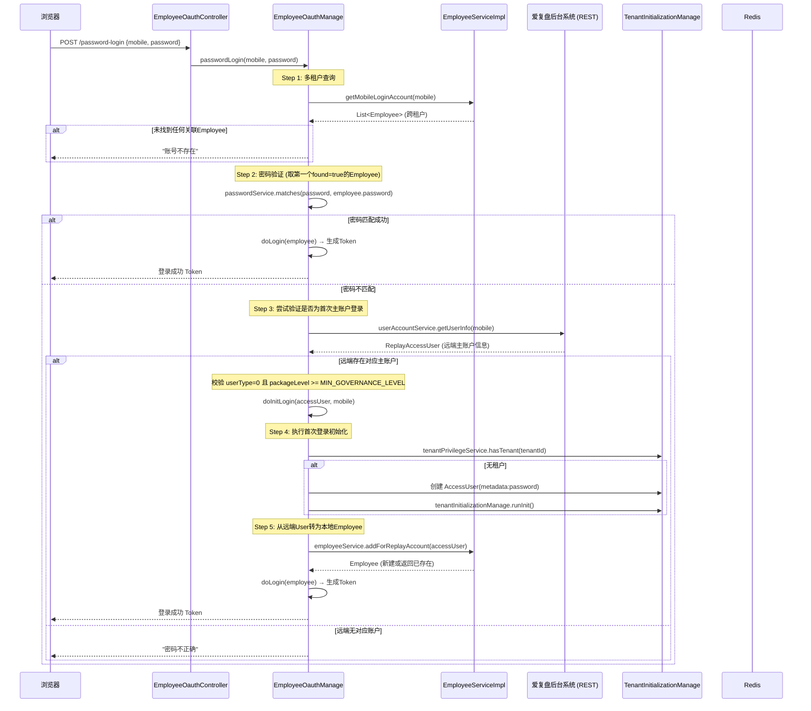

### 3.3 多租户登录账户查询（getMobileLoginAccount）

> **核心实现类**：[EmployeeServiceImpl.java:L1228-L1294](file:///Users/hehui/dev/git/jiuyu/fupan-governance-server/src/main/java/com/jiuyu/governance/business/rbac/service/impl/EmployeeServiceImpl.java#L1228-L1294)

**背景**：一个自然人的手机号可以在多个租户中同时拥有 Employee 记录（例如同一个运营人员同时为租户 A 和租户 B 工作）。当用户输入手机号登录时，系统必须从这些记录中选出**唯一的、正确的**一个 Employee 进行认证。`getMobileLoginAccount(mobile)` 方法的核心任务就是完成这个多租户选择决策。

**算法的输入与输出**：

| 属性 | 说明 |
|------|------|
| 输入 | 用户的手机号（`mobile`） |
| 输出 | `MobileLoginEmployee` 对象：包含 `employee`（选中的 Employee 实体）和 `tenantStatus`（对应租户的状态） |
| 返回 null | 该手机号未在任何租户中注册任何 Employee |

**决策算法的完整步骤**：

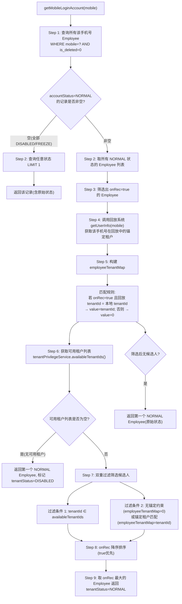

### 3.4 租户选择的三重约束条件详解

`getMobileLoginAccount` 本质上是一个**多租户环境下的最优账户选择器**，其决策受到三个核心因素的逐级约束：

---

**约束一：Employee 自身的账户状态（accountStatus）—— 第一级硬过滤**

| 判断逻辑 | 决策 | 结果 |
|---------|------|------|
| 所有 Employee 的 `accountStatus` 都不为 NORMAL | 越过 NORMAL 优先规则 | 返回任意一条记录（`LIMIT 1`），登录时提示"账户已被禁用或冻结" |
| 仅有一条 NORMAL 记录 | 无需多租户选择 | 直接进入该 Employee 的登录验证 |
| 有多条 NORMAL 记录 | 进入约束二和约束三的进一步筛选 | 需要从多个 NORMAL 候选人中选择最优 |

---

**约束二：租户权益状态（availableTenantIds）—— 第二级租户有效性过滤**

- `TenantPrivilegeService.availableTenantIds(tenantIds)` 方法对每个候选租户进行可用性验证：
  1. **记录缺失**：`TenantPrivilege` 表中不存在该租户 → 不可用
  2. **租户已冻结**：`tenantPrivilege.accountStatus == FREEZE` → 不可用（这是租户级别冻结，与 Employee 个体的 FREEZE 是独立的概念）
  3. **远端主账户验证失败**：对于 `accountStatus == NORMAL` 的租户，系统每 10 分钟向爱复盘后台系统发送远端验证——检查该租户的主账户（`holdTenant=true` 且 `connectorClientUserId > 0`）是否在远端仍然有效。若远端返回的主账户不存在或不匹配 → 不可用
- 如果所有候选 Employee 所属的租户都不可用 → 返回第一个 NORMAL 状态的 Employee，但将其 `tenantStatus` 标记为 `DISABLED`，登录界面提示"账户已被禁用"

---

**约束三：回放系统的锚定租户关系 —— 第三级录制权限约束**

这是算法中最关键、也最容易被忽略的机制。当一个 Employee 拥有录制权限（`onRec=true`）时，该 Employee 在爱复盘后台系统中存在关联的子账户（`userType=2`），而子账户在远端被"锚定"到某个特定的租户。

**锚定检查流程**：

1. 系统调用爱复盘后台系统的 `getUserInfo(mobile)` 接口
2. 接口返回该手机号在回放系统中的当前活跃租户 ID（即子账户真正所属的租户）
3. 遍历所有 NORMAL 的 Employee，对比每个 Employee 的本地 `tenantId` 与回放系统返回的 `tenantId`
4. **如果匹配** → `employeeTenantMap[employeeId] = 本地 tenantId`（锚定约束满足，该 Employee 进入候选人池）
5. **如果不匹配** → `employeeTenantMap[employeeId] = 0`（锚定冲突，该 Employee 在后续筛选时被排除）

**锚定约束的设计意图**：确保拥有录制权限（子账户）的 Employee 必须在回放系统确认的租户下登录。这防止了子账户被意外迁移后，用户仍在原租户中登录并访问已不属于他们的录制数据。

**最终优先级排序**：

```
最终 Employee = max(候选 Employee, 按 onRec 降序)  // onRec=true 优先于 onRec=false
```

- 同一手机号下多个可用租户的 Employee，系统**优先选择拥有录制权限（onRec=true）的那个**
- 如果多个候选拥有相同的 onRec 值 → 取列表中的第一条（取决于数据库返回顺序，一般首个返回的租户优先）

---

**三种约束的全景对比**：

| 约束级别 | 判断来源 | 失败行为 | 影响范围 |
|---------|---------|---------|---------|
| 约束一：Employee 状态 | Employee.accountStatus 字段 | 返回任意状态记录 | 单条 Employee |
| 约束二：租户权益 | TenantPrivilegeService + 远端主账户验证 | 标记 tenantStatus=DISABLED | 该租户下所有 Employee |
| 约束三：锚定租户 | 回放系统 getUserInfo(mobile) | 排除该 Employee 候选人 | 仅该条 Employee |

---

**典型多租户场景举例**：

| 场景 | 候选 Employee | 决策依据 | 最终结果 |
|------|-------------|---------|---------|
| 张三同时在租户 A（onRec=true）和租户 B（onRec=false）中 | A(rec=true), B(rec=false) | 约束三：回放锚定匹配租户 A；优先级 max(onRec)=A | 选 A |
| 张三在租户 A（onRec=false）和租户 B（onRec=false） | A(rec=false), B(rec=false) | 同优先级，数据库第一条 | 选 A（首个） |
| 张三在租户 A（onRec=true），但回放锚定租户 B | A(rec=true, 锚定冲突) | 约束三排除 A；无其他候选人 | 返回 A（原始状态） |
| 张三在租户 A，但租户 A 已过期 | A(不可用) | 约束二：租户 A 不可用 | 标记 DISABLED |

### 3.5 首次主账户登录初始化 (doInitLogin)

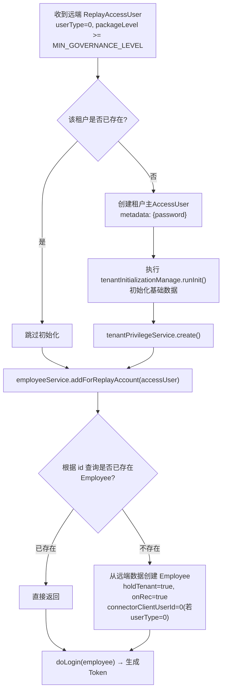

### 3.6 Token生成机制 (doLogin)

```java
void doLogin(Employee employee) {
    // 1. 校验 employee 非空
    // 2. 检查 accountStatus != DISABLED (禁用禁止登录)
    // 3. 检查 accountStatus != FREEZE (冻结禁止登录)

    // 4. 构建认证信息
    AccessUser tokenUser = OauthConstant.buildAccessUser(
        employee.getTenantId(),
        employee.getId(),
        OauthConstant.GOVERNANCE_USER
    );

    // 5. 设置租户管理员标识
    if (employee.getHoldTenant()) {
        tokenUser.metadata().put(OauthConstant.TENANT_ADMIN, "true");
    }

    // 6. 存储令牌
    authenticationTokenStorage.login(OauthConstant.GOVERNANCE_USER, tokenUser);
}
```

### 3.7 强制登出

| 方法 | 触发场景 | 实现 |
|------|---------|------|
| `forcedLogout(employeeId)` | 管理员禁用单个员工 | `authenticationTokenStorage.logout(GOVERNANCE_USER, employeeId)` |
| `forcedForTenant(tenantId)` | 租户下所有员工批量登出 | 分页查询该租户全部 employee → 逐个调用 `forcedLogout()` |

### 3.8 验证码登录流程

除了密码登录，系统还支持通过短信验证码登录：

1. 用户先调用发送验证码接口（`POST /send-code`），系统生成 6 位随机数字验证码，通过短信服务发送到用户手机
2. 验证码有效期通常为 5 分钟，存储在 Redis 中，key 格式为 `sms:code:{mobile}:{scene}`
3. 用户输入验证码后调用 `POST /code-login` 接口
4. 系统从 Redis 中取出存储的验证码，与用户输入的验证码比对
5. 验证码匹配成功后，执行与密码登录相同的第一步：调用 `getMobileLoginAccount(mobile)` 查询 Employee
6. 与密码登录不同的是，验证码登录**跳过密码验证步骤**，也**不执行首次主账户登录的降级路径**——验证码仅用于已存在的 Employee 登录
7. 验证码验证成功后，直接执行 `doLogin(employee)` 生成令牌

**验证码登录的安全机制**：
- 同一手机号在同一场景下，60 秒内只能发送一次验证码
- 同一手机号连续 5 次输入错误验证码后，该验证码被作废
- 验证码使用后立即从 Redis 中删除，防止重复使用

### 3.9 登录失败场景汇总

| 失败场景 | 判断条件 | 返回信息 |
|---------|---------|---------|
| 手机号未注册 | `getMobileLoginAccount()` 返回空列表 | "账号不存在" |
| 密码错误（无远端账户） | 本地密码不匹配 + 远端主账户不存在 | "密码不正确" |
| 远端主账户套餐等级不足 | `packageLevel < MIN_GOVERNANCE_LEVEL` | "套餐不支持企业后台功能" |
| 账户被禁用 | `accountStatus == DISABLED` | "账号已被禁用" |
| 账户被冻结 | `accountStatus == FREEZE` | "账号已被冻结" |
| 验证码过期 | Redis 中验证码已过期或不存在 | "验证码已过期" |
| 验证码错误 | 用户输入与 Redis 中存储不一致 | "验证码不正确" |
| 验证码发送频率限制 | 60 秒内重复请求 | "操作过于频繁，请稍后再试" |

### 3.10 会话与令牌生命周期

**令牌存储机制**：

登录成功后，系统通过 `authenticationTokenStorage.login()` 将生成的 Token 存储到 Redis 中。Token 的 key 格式为 `auth:token:{userType}:{userId}`，value 为序列化的 `AccessUser` 对象。

**令牌元数据**：

Token 中携带的 `AccessUser` 对象包含以下关键元数据：
- `userId`：Employee 的 ID
- `tenantId`：所属租户 ID
- `userType`：固定为 `governance_user`
- `metadata`：扩展数据 Map，其中 `TENANT_ADMIN = "true"` 标记该用户为租户主账户

**令牌过期策略**：

- 默认有效期：2 小时（可配置）
- 滑动过期：每次请求时自动续期，重置过期时间
- 主动登出：调用 `authenticationTokenStorage.logout()` 立即删除 Redis 中的 Token
- 强制登出：管理员操作触发，被登出的用户下次请求时发现 Token 不存在，需要重新登录

**令牌校验流程**（每次请求执行）：

1. 从 HTTP 请求头中提取 Token（通常位于 `Authorization: Bearer xxx` 头）
2. 从 Redis 中查询 Token 对应的 `AccessUser` 对象
3. 如果 Token 不存在或已过期 → 返回 401 未认证
4. 如果 Token 存在 → 将 `AccessUser` 对象绑定到当前请求的线程上下文中
5. 后续的 `@GovernanceUser`、`@Permissions`、`@BeforePermission` 注解从线程上下文中读取 `AccessUser` 进行权限校验

---

## 4. Employee 账户体系

### 4.1 Employee 实体关键字段

| 字段 | 类型 | 说明 |
|------|------|------|
| `id` | Long | 主键（雪花ID） |
| `tenantId` | Long | 所属租户 |
| `name` | String | 员工姓名 |
| `staffNumber` | String | 工号（租户内唯一） |
| `mobile` | String | 手机号（全局用于跨系统关联） |
| `password` | String | 密码（BCrypt哈希存储） |
| `email` | String | 邮箱 |
| **`holdTenant`** | Boolean | **是否租户持有者（主账户）** |
| **`onRec`** | Boolean | **是否有爱复盘录制权限（子账户标识）** |
| **`connectorClientUserId`** | Long | **关联的爱复盘子账户 tb_user.id** |
| `companyId` | Long | 所属子公司 |
| `deptId` | Long | 所属部门 |
| `teamId` | Long | 所属小组 |
| `positionId` | Long | 岗位 |
| `accountStatus` | Integer | 账号状态 |
| `userAvatar` | String | 头像URL |
| `jobType` | Integer | 工作类型 |

### 4.2 Employee 分类

根据 `holdTenant` + `onRec` 两个字段的组合，Employee分为三类：

| Employee类型 | holdTenant | onRec | connectorClientUserId | 说明 |
|-------------|------------|-------|----------------------|------|
| **租户主账户** | true | true | 0 | 企业核心管理员，拥有全部数据权限，不可删除、不可解绑录制 |
| **子账户（有录制权限）** | false | true | > 0 | 普通员工，拥有录制回放权限，对应爱复盘后台系统的子账户 |
| **普通企业后台用户** | false | false | 0 | 仅拥有企业后台管理功能，无录制权限 |

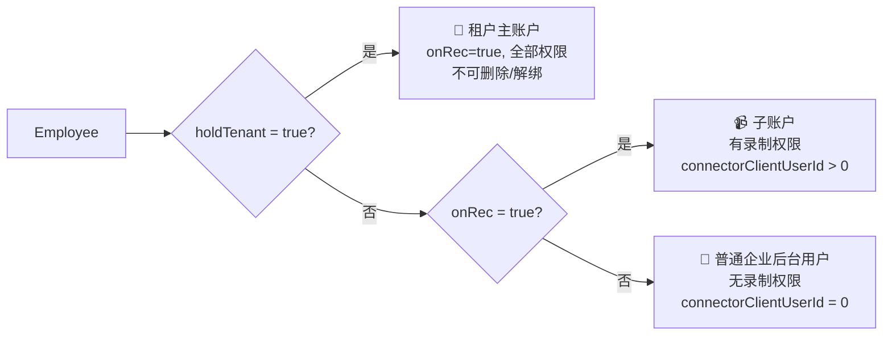

### 4.3 账号状态机

```
                    ┌──────────┐
          创建/启用   │  NORMAL  │
        ┌──────────►│  (1)     │◄──────────┐
        │           └────┬─────┘           │
        │                │                  │
        │           disable()         enable()
        │                │                  │
        │                ▼                  │
        │           ┌──────────┐     ┌─────┴─────┐
        │           │ DISABLED │     │  FREEZE   │
        │           │  (0)     │     │   (2)     │
        │           └──────────┘     └───────────┘
        │                                  ▲
        └──────────────────────────────────┘
           enable() 不可恢复FREEZE状态，
           必须通过 syncSubAccount() 才能恢复
```

**状态切换规则（[EmployeeServiceImpl](file:///Users/hehui/dev/git/jiuyu/fupan-governance-server/src/main/java/com/jiuyu/governance/business/rbac/service/impl/EmployeeServiceImpl.java)）**：

| 操作 | 允许的状态转换 | 附加条件 |
|------|--------------|---------|
| `enable()` | DISABLED → NORMAL | FREEZE状态无法通过enable恢复 |
| `disable()` | NORMAL → DISABLED | CAS乐观锁更新（WHERE status=NORMAL） |
| `syncSubAccount()` | FREEZE → NORMAL | 子账户同步时恢复 |
| 解绑 | | holdTenant=true不可解绑 |

### 4.4 各字段的业务规则详解

**holdTenant（租户持有者标识）**：

这是 Employee 表中**最核心的控制字段**，决定了该 Employee 是否为租户的创建者/主账户。

- `holdTenant = true` 的含义：
  - 该 Employee 是该租户的唯一主账户，一个租户有且仅有一个 `holdTenant=true` 的 Employee
  - 主账户拥有该租户下的**全部数据访问权限**（数据权限检查时 `isAll()==true`，直接跳过 SQL 数据过滤）
  - 主账户**不可被删除**（`delete()` 方法中直接抛出异常）
  - 主账户**不可被解绑录制权限**（`offRec()` 和 `unbindReplayAccount()` 中直接拒绝）
  - 主账户的 `onRec` 始终为 `true`（创建时强制设置）
  - 主账户的 `connectorClientUserId` 为 `0`（不与远端子账户关联，因为主账户对应的是 `userType=0` 的远端主账户，而非 `userType=2` 的子账户）
- `holdTenant = false` 的含义：
  - 普通 Employee，由主账户或管理员创建
  - 数据访问范围受 `ManagerConnector` 和 `DataPermissionsHandler` 限制
  - 可以被删除、可以被解绑录制权限

**onRec（录制权限标识）**：

这是 Employee 分类的**第二维度字段**，决定了该 Employee 是否拥有爱复盘后台系统的录制与回放功能。

- `onRec = true`：该 Employee 在爱复盘后台系统中存在一个关联的子账户（`userType=2`）
  - `connectorClientUserId` 必须 > 0（存储远端 `tb_user.id`）
  - 该 Employee 可以使用录制和回放功能
  - 创建时触发远端子账户绑定流程（`createReplayAccount()`）
  - 禁用录制时触发远端子账户解绑流程（`offRec()` → `unbindReplayAccount()`）
- `onRec = false`：该 Employee 没有录制权限
  - `connectorClientUserId` 必须为 0
  - 该 Employee 仅能使用企业后台管理功能（如查看组织架构、管理直播间等）
  - 可以通过 `onRec()` 方法开启录制权限

**connectorClientUserId（远端关联ID）**：

这是两套系统账户关联的**唯一技术桥梁**。

- 值为 0：表示该 Employee 与远端子账户无关联
- 值 > 0：存储的是爱复盘后台系统 `tb_user` 表的主键 ID
- 当 `onRec = true` 时，此字段必须 > 0
- 当 `onRec = false` 时，此字段必须为 0
- 当远端解绑回调触发时（`unbind(connectorClientUserId)`），系统根据此字段定位要操作的 Employee
- 当执行 `syncSubAccount()` 同步时，系统通过 `mobile`（手机号）更新此字段的值

**accountStatus（账户状态）**：

| 状态值 | 枚举名 | 含义 | 可登录 | 可操作数据 |
|--------|--------|------|--------|-----------|
| 1 | NORMAL | 正常 | ✅ 是 | ✅ 是 |
| 0 | DISABLED | 已禁用 | ❌ 否 | ❌ 否 |
| 2 | FREEZE | 已冻结（跨租户联动） | ❌ 否 | ❌ 否 |

状态切换的详细规则：
- NORMAL → DISABLED：管理员调用 `disable(employeeId)`，使用 CAS 乐观锁（`WHERE account_status = 1`）防止并发修改
- DISABLED → NORMAL：管理员调用 `enable(employeeId)`，直接更新状态
- NORMAL → FREEZE：由 `syncSubAccount()` 同步触发，当检测到远端该手机号对应的用户已被冻结时，跨租户设置 FREEZE
- FREEZE → NORMAL：**仅能通过** `syncSubAccount()` 恢复，当检测到远端状态恢复时自动恢复本地状态
- FREEZE 的特殊性：`enable()` 方法无法将 FREEZE 恢复为 NORMAL，这是有意设计的——FREEZE 是远端触发的状态，必须等待远端恢复后经同步流程解除

**mobile（手机号）**：

手机号在系统中扮演多重角色：
1. 作为 Employee 的登录凭据之一（配合密码或验证码）
2. 作为跨系统关联的关键字段（企业后台 Employee.mobile ↔ 爱复盘后台 tb_user.mobile）
3. 作为同步对账的核心匹配字段（`syncSubAccount()` 通过 mobile 匹配远端子账户与本地 Employee）
4. 在租户范围内唯一（同一租户下不允许重复手机号）
5. 允许跨租户重复（同一手机号可以在多个租户中拥有 Employee）

**password（密码）**：

密码使用 BCrypt 单向哈希算法存储，这是一种自包含盐值的哈希算法，特点包括：
- 同一明文密码每次哈希的结果不同（因为每次生成随机盐值）
- 验证时使用 `BCryptPasswordEncoder.matches(rawPassword, encodedPassword)` 方法
- 哈希值格式为 `$2a$10$...`，其中 `10` 表示哈希轮数（cost factor），轮数越高越安全但越慢
- 首次创建 Employee 时，密码同步设置到远端子账户的 metadata 中
- 修改密码时，通过 REST 接口同步更新远端子账户的密码

**staffNumber（工号）**：

- 在租户范围内唯一
- 创建 Employee 时校验唯一性（`staffNumberOccupy()`）
- 可用于 Employee 的搜索和筛选

### 4.5 Employee 分类的完整业务场景

**场景一：企业首次开通（租户主账户创建）**

1. 企业在爱复盘后台系统注册并购买企业套餐
2. 该企业的管理员首次登录企业后台管理系统
3. 触发 `doInitLogin()` 流程：从远端数据创建本地 Employee，`holdTenant=true`, `onRec=true`, `connectorClientUserId=0`
4. 该 Employee 成为租户主账户，拥有全部数据权限
5. 后续所有 Employee 都由该主账户创建和管理

**场景二：添加有录制权限的员工（子账户创建）**

1. 主账户管理员在企业管理后台填写员工信息（姓名、手机号、工号等），勾选"录制权限"
2. 系统调用 `addEmployee()` 创建本地 Employee（`holdTenant=false`）
3. 随后调用 `createReplayAccount()` 向爱复盘后台系统发起子账户绑定请求
4. 远端创建 `userType=2` 的子账户，返回 `tb_user.id`
5. 本地更新 `connectorClientUserId = 返回值`，`onRec = true`
6. 该员工可以使用手机号和初始密码登录企业后台管理系统，同时拥有录制回放功能

**场景三：添加无录制权限的员工（普通企业后台用户）**

1. 主账户管理员填写员工信息，不勾选"录制权限"
2. 系统仅创建本地 Employee（`holdTenant=false`, `onRec=false`, `connectorClientUserId=0`）
3. 不调用远端接口
4. 该员工可以使用手机号和初始密码登录企业后台管理系统，但只能使用企业后台管理功能（组织架构查看、数据报表等），无权使用录制回放功能

**场景四：为已有员工开通录制权限**

1. 管理员找到 `onRec=false` 的 Employee，点击"开通录制权限"
2. 系统调用 `onRec(employeeId)` 方法
3. 方法内部检查 `connectorClientUserId` 是否为 0
4. 如果为 0（从未绑定过远端），调用 `createReplayAccount()` 向远端发起绑定请求
5. 如果已有 `connectorClientUserId` 值（之前绑定过但录制权限被关闭了），则仅将 `onRec` 改为 `true`，不重新创建远端账户

**场景五：员工离职（禁用账户）**

1. 管理员调用 `disable(employeeId)` 将 Employee 设置为 DISABLED 状态
2. 禁用后，该员工无法登录系统
3. 同时调用 `forcedLogout(employeeId)` 强制登出该员工的所有活跃会话
4. 注意：禁用操作**不会**解绑远端子账户（录制权限保留），远端子账户仍然存在
5. 如果需要在禁用的同时收回录制权限，需要额外调用 `offRec(employeeId)`

---

## 5. Employee ↔ 爱复盘后台系统 User 联动机制

### 5.1 字段级对应关系

```
┌─────────────────────────────────┐      ┌──────────────────────────────┐
│   企业后台 Employee              │      │  爱复盘后台 tb_user            │
│   fupan-governance-server       │      │  back-fupan-server           │
├─────────────────────────────────┤      ├──────────────────────────────┤
│  mobile          ◄──全局唯一键──►│      │  mobile (关联键)              │
│  connectorClientUserId ──关联──►│      │  id (tb_user主键)            │
│  onRec = true     ◄──状态映射──  │      │  userType = 2 (子账户)       │
│  holdTenant=true  ◄──状态映射──  │      │  userType = 0 (主账户)       │
│  name             ──首次同步──►  │      │  nickName                    │
│  password         ──首次设置──►  │      │  metadata: {password}        │
│  accountStatus    ◄──跨系统联动─►│      │  status (远端冻结/解冻)      │
└─────────────────────────────────┘      └──────────────────────────────┘
```

### 5.2 绑定子账户流程 (createReplayAccount)

当管理员给 `onRec=false` 的 Employee 开启录制权限时触发：

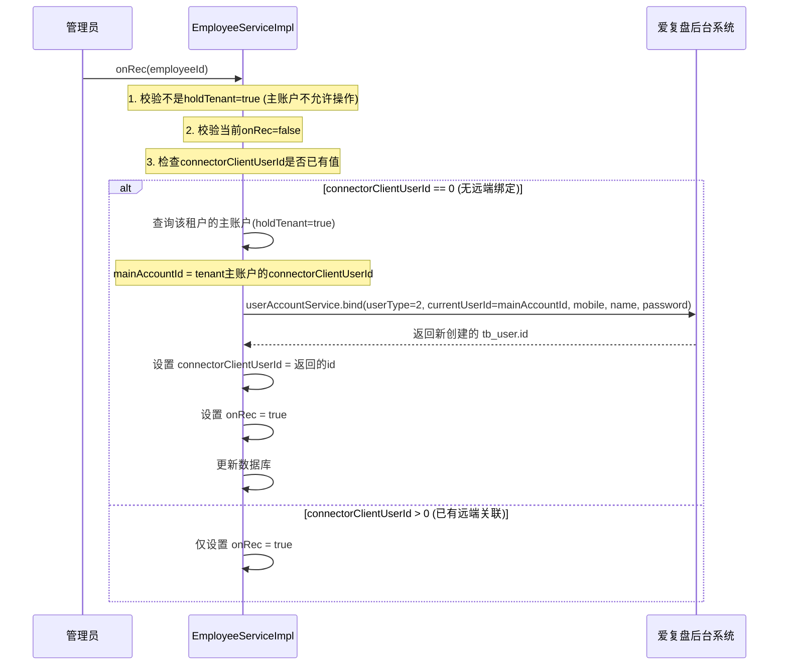

### 5.3 解绑子账户流程 (unbindReplayAccount)

当管理员移除 Employee 的录制权限时触发：

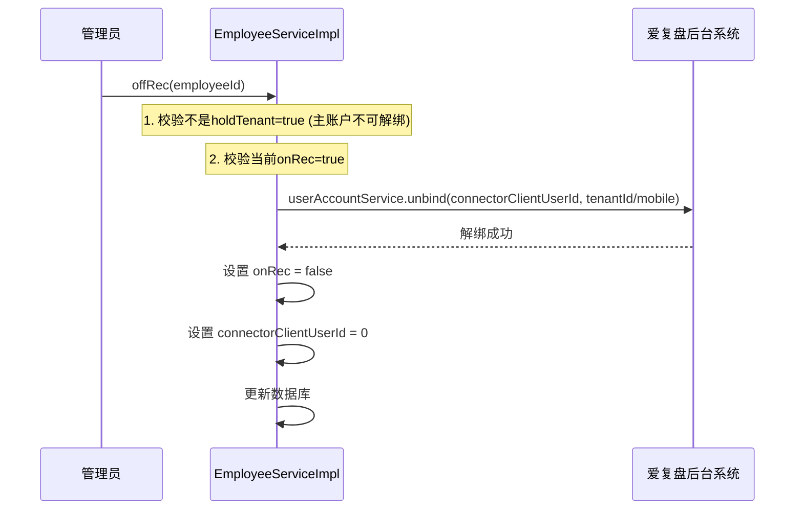

### 5.4 子账户同步流程 (syncSubAccount)

这是保持两端数据一致的核心定时/手动同步任务：

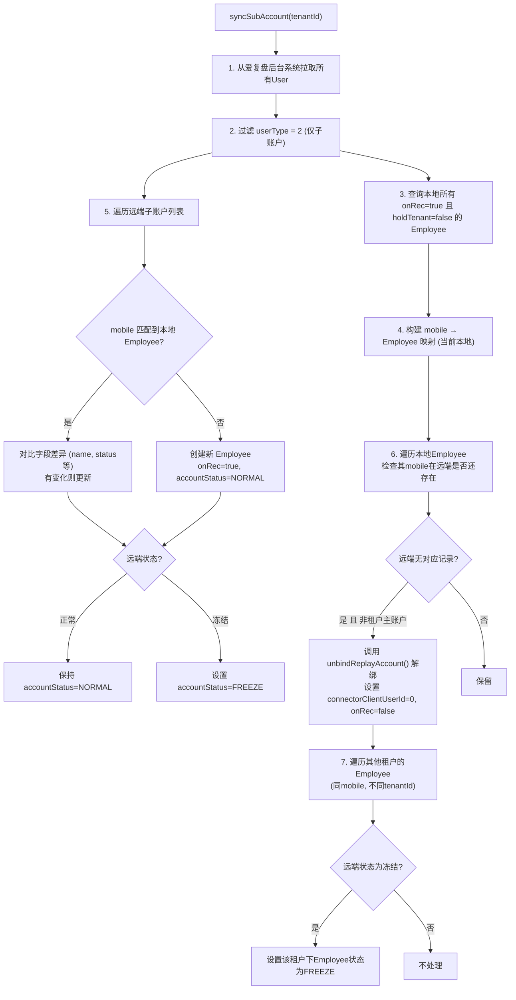

### 5.5 同步流程的详细业务场景分析

**syncSubAccount 的触发时机**：

1. **手动触发**：管理员在企业后台管理系统中点击"同步子账户"按钮
2. **定时触发**：通过定时任务（如每天凌晨执行一次）自动同步
3. **远端回调触发**：当爱复盘后台系统的子账户发生变更时，通过回调接口触发同步

**syncSubAccount 的 7 个步骤详解**：

**步骤 1 — 拉取远端子账户列表**：系统通过 REST 接口向爱复盘后台系统请求该租户下的所有子账户。接口返回 `List<SubAccount>`，每个子账户包含 `mobile`（手机号）、`name`（昵称）、`status`（状态）、`userId`（tb_user.id）等字段。

**步骤 2 — 过滤子账户类型**：从返回列表中过滤出 `userType == 2` 的记录，排除主账户（`userType=0`）。这是因为主账户不在同步范围内，主账户有自己的创建和登录流程。

**步骤 3 — 查询本地 Employee**：查询本地 `onRec = true` 且 `holdTenant = false` 的 Employee 列表，构建 `mobile → Employee` 的映射。这个映射用于后续的双向对账。

**步骤 4 — 前向对账（远端 → 本地）**：遍历远端子账户列表，对每个子账户：
- 如果 `mobile` 在本地 Employee 映射中存在：
  - 比对 `name` 和 `status` 字段，如有变化则更新本地 Employee
  - 如果远端状态为"冻结"，将本地 Employee 的 `accountStatus` 设置为 `FREEZE`
  - 如果远端状态为"正常"且本地为 `FREEZE`，恢复为 `NORMAL`
- 如果 `mobile` 在本地 Employee 映射中不存在：
  - 这是一个"远端有、本地无"的新子账户，系统自动创建本地 Employee 记录
  - 新 Employee 的属性：`onRec = true`, `holdTenant = false`, `connectorClientUserId = 远端子账户ID`, `accountStatus` 根据远端状态设置

**步骤 5 — 后向对账（本地 → 远端）**：遍历本地 Employee 映射中的所有 Employee，对每个 Employee：
- 检查其 `mobile` 是否在远端子账户列表中存在
- 如果远端不存在（即本地有记录但远端已删除）：
  - 且该 Employee 不是租户主账户（`holdTenant != true`）
  - 调用 `unbindReplayAccount()` 解绑：设置 `connectorClientUserId = 0`, `onRec = false`
  - 这是"本地有、远端无"的情况，表示远端子账户已被删除，本地需要同步解绑

**步骤 6 — 跨租户状态同步**：这是同步流程中最复杂的步骤。

背景：同一手机号可能在不同租户中存在多个 Employee。如果用户在租户 A 中被冻结，那么他在租户 B、C 中的 Employee 也应该被冻结（因为冻结通常是针对自然人的处罚行为）。

实现逻辑：
- 遍历所有与当前同步子账户手机号相同、但 `tenantId` 不同的 Employee（即其他租户中的同手机号 Employee）
- 如果远端子账户的状态为"冻结"，将这些其他租户的 Employee 也设置为 `FREEZE`
- 这个操作确保了一个自然人在所有租户中的状态保持一致

**步骤 7 — 缓存清除**：同步完成后，清除相关的 Redis 缓存，确保下次查询时能获取到最新的数据。

### 5.6 同步流程中的边界情况处理

**边界情况 1：同一手机号绑定多个子账户**

如果远端存在多个子账户使用同一手机号（例如同一员工在不同业务线中有多个子账户），`syncSubAccount` 只会匹配到第一个。这种情况下需要管理员手动处理。

**边界情况 2：本地 Employee 的 mobile 被修改**

如果管理员修改了 Employee 的手机号，而远端子账户的 mobile 未同步修改，下一次 `syncSubAccount` 时会导致匹配失败——远端认为该子账户对应的手机号是旧号码，而本地已经改为新号码。解决方案是：修改手机号时同步调用远端接口更新子账户的手机号。

**边界情况 3：远端主账户降级**

如果爱复盘后台系统将某个主账户（`userType=0`）降级为子账户（`userType=2`），这会影响本地 `holdTenant=true` 的 Employee。当前系统的处理方式是通过 `syncSubAccount` 检测到状态变更后，将该 Employee 的 `holdTenant` 调整为 `false`（由租户初始化服务处理）。

**边界情况 4：并发同步**

多次同时执行 `syncSubAccount` 可能导致数据不一致。系统通过 `@ResourceLock` 注解实现 Redis 分布式锁，确保同一租户的同步操作串行执行。锁的 key 格式为 `lock:sync:subAccount:{tenantId}`，超时时间通常设为 5 分钟。

---

## 6. 组织架构与管理员体系

### 6.1 组织架构层级

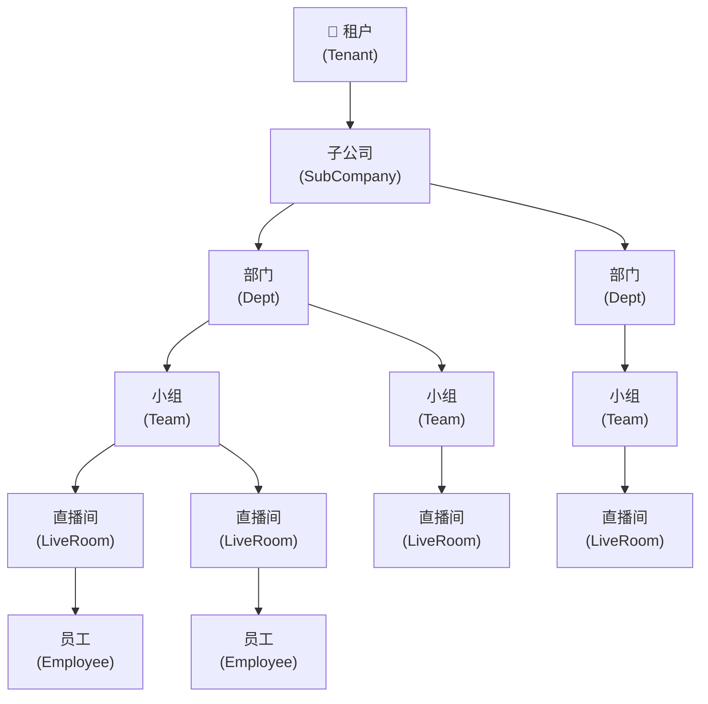

**数据表结构**：

| 层级 | 表名 | 关键字段 | 说明 |
|------|------|---------|------|
| 1 | `sub_company` | id, tenantId, name, sort | 子公司 |
| 2 | `dept` | id, tenantId, name, companyId, sort | 部门（归属子公司） |
| 3 | `team` | id, tenantId, name, companyId, deptId, sort | 小组（归属部门） |
| 4 | `live_room` | id, tenantId, companyId, deptId, teamId | 直播间（归属小组） |
| 5 | `employee` | id, tenantId, companyId, deptId, teamId | 员工（归属小组/部门/公司） |

### 6.2 管理员连接器 (ManagerConnector)

`manager_connector` 表记录"谁管理谁"的关系：

| 字段 | 类型 | 说明 |
|------|------|------|
| `id` | Long | 主键 |
| `managerType` | Integer | 管理类型（见ManagerType枚举） |
| `targetId` | Long | 被管理的组织/直播间/人员ID |
| `employeeId` | Long | 管理员Employee ID |
| `isDeleted` | Boolean | 逻辑删除 |

**ManagerType 枚举层级关系**：

| 枚举值 | Code | 描述 | 上级 (Superior) | 下级 (Subs) |
|--------|------|------|----------------|------------|
| COMPANY | 1 | 子公司 | null | DEPT, TEAM, LIVE_ROOM, EMPLOYEE |
| DEPT | 2 | 部门 | COMPANY | TEAM, LIVE_ROOM, EMPLOYEE |
| TEAM | 3 | 小组 | DEPT, COMPANY | LIVE_ROOM, EMPLOYEE |
| LIVE_ROOM | 4 | 直播间 | TEAM, DEPT, COMPANY | — |
| EMPLOYEE | 5 | 人员 | TEAM, DEPT, COMPANY | — |

**数据权限下级穿透逻辑**（[ManagerConnectorProcessor.getOrgSubIds](file:///Users/hehui/dev/git/jiuyu/fupan-governance-server/src/main/java/com/jiuyu/governance/business/org/service/impl/ManagerConnectorProcessor.java#L332-L510)）：

- 如果 Employee 是某**子公司**（COMPANY）的管理员 → 自动获得该公司下所有**部门、小组、直播间、员工**的查看权限
- 如果 Employee 是某**部门**（DEPT）的管理员 → 自动获得该部门下所有**小组、直播间、员工**的查看权限
- 如果 Employee 是某**小组**（TEAM）的管理员 → 自动获得该小组下所有**直播间、员工**的查看权限
- 如果 Employee 是某**直播间**（LIVE_ROOM）的管理员 → 仅该直播间

### 6.3 缓存策略

`ManagerConnectorProcessor` 使用 Redis 三级缓存体系：

| 缓存粒度 | Key 格式 | 过期时间 | 说明 |
|---------|---------|---------|------|
| 用户权限缓存 | `oauth:data-permissions:manage-org:{employeeId}` | 1小时 | 单个用户的所有管理员连接 |
| 租户全量缓存 | `oauth:data-permissions:tenant:{tenantId}:{type}` | 3天/1天/3小时/7天 | 租户下某类型的所有ID |
| 组织子级缓存 | `oauth:data-permissions:org-{target}-{source}:{orgId}` | 3天 | 上级组织 → 下级组织ID映射 |

缓存清除时机：
- `connector()` — 管理员增删时清除用户缓存
- `disconnectAll()` — 清除管理员连接时清除用户缓存
- `clearTenantCache()` — 组织CRUD时清除租户缓存
- `clearOrgCache()` — 组织CRUD时清除层级关系缓存

### 6.4 管理员分配的典型业务场景

**场景一：子公司的全面管理**

某大型 MCN 机构在系统中注册为一个租户，旗下有"北京子公司"和"上海子公司"两个子公司。租户主账户将员工 ZhangSan 设置为"北京子公司"的管理员。

操作：在 `manager_connector` 表中插入一条记录：`(managerType=COMPANY, targetId=北京子公司ID, employeeId=ZhangSan的ID)`。

结果：
- ZhangSan 登录后，`ManagerConnectorProcessor.getUserConnectorIds()` 返回其管理范围
- 组织穿透逻辑自动计算出：北京子公司 → 其下所有部门 → 每个部门下所有小组 → 每个小组下所有直播间
- ZhangSan 在查询直播间时，SQL 自动注入 `company_id IN (北京子公司ID, ...)` 的 WHERE 条件
- ZhangSan 无法看到上海子公司的任何数据

**场景二：跨层级的多头管理**

同一个 Employee 可以同时是不同层级的多个组织的管理员。例如：
- Employee LiSi 同时是"运营部"的管理员（`managerType=DEPT, targetId=运营部ID`）和"高端客户组"的管理员（`managerType=TEAM, targetId=高端客户组ID`）
- 系统查询时生成：`company_id IN (...) OR dept_id IN (...) OR team_id IN (...)`
- "运营部"的权限范围包括该部门下所有小组和直播间
- "高端客户组"的权限范围包括该小组下所有直播间
- 最终可见范围是两者的并集（UNION）

**场景三：直播间的专属管理员**

在直播电商场景中，每个直播间有一个专门负责的运营人员。系统通过 `managerType=LIVE_ROOM` 实现直播间级别的权限隔离。
- Employee WangWu 仅仅是直播间 ID=100 的管理员
- 在查询直播间数据时，SQL LEFT JOIN `manager_connector` 表，条件 `b.manager_type=4 AND b.employee_id=WangWu的ID`
- WangWu 只能看到 ID=100 的直播间，无权查看其他直播间

**场景四：权限变更的实时生效**

当管理员调整了某个 Employee 的管理范围（添加或删除管理员关系）后：
1. `ManagerConnectorProcessor.connector()` 立即清除该 Employee 的用户权限缓存（`oauth:data-permissions:manage-org:{employeeId}`）
2. 该 Employee 的下一次查询请求时，缓存未命中，系统重新从 `manager_connector` 表加载最新权限
3. 如果在修改前该 Employee 正在访问数据，修改后立即生效
4. 如果是大规模的组织调整（如部门重组），可以调用 `clearTenantCache()` 清除整个租户的所有缓存

### 6.5 组织架构变更对数据权限的影响

**变更类型一：部门归属变更** — 将某个部门从子公司A转移到子公司B
- 更新 `dept.companyId` 字段
- 该部门下的小组和直播间仍属于该部门，因此自动跟随到新的子公司
- 调用 `clearOrgCache()` 清除该部门及其上级组织的子级缓存
- 子公司A的管理员不再能看到该部门的数据，子公司B的管理员开始能看到

**变更类型二：直播间归属变更** — 将某个直播间从小组A转移到小组B
- 更新 `live_room.deptId` 和 `live_room.teamId` 字段
- 小组A的管理员不再能看到该直播间，小组B的管理员开始能看到
- 直播间级别的管理员（`managerType=LIVE_ROOM`）不依赖组织归属，因此不受影响

**变更类型三：管理员关系解除** — 删除某个 Employee 的管理员身份
- 调用 `ManagerConnectorProcessor.disconnectAll(employeeId)` 删除该 Employee 在 `manager_connector` 表中的所有记录
- 同时清除该 Employee 的用户权限缓存
- 该 Employee 登录后，`getUserConnectorIds()` 返回空列表
- 该 Employee 在查询数据时，SQL 条件变成 `company_id IN (空) OR dept_id IN (空) OR team_id IN (空)`，结果为空
- 但如果该 Employee 是租户主账户（`holdTenant=true`），`isAll()==true`，仍能看到全部数据

---

## 7. 数据权限体系

### 7.1 权限模型架构

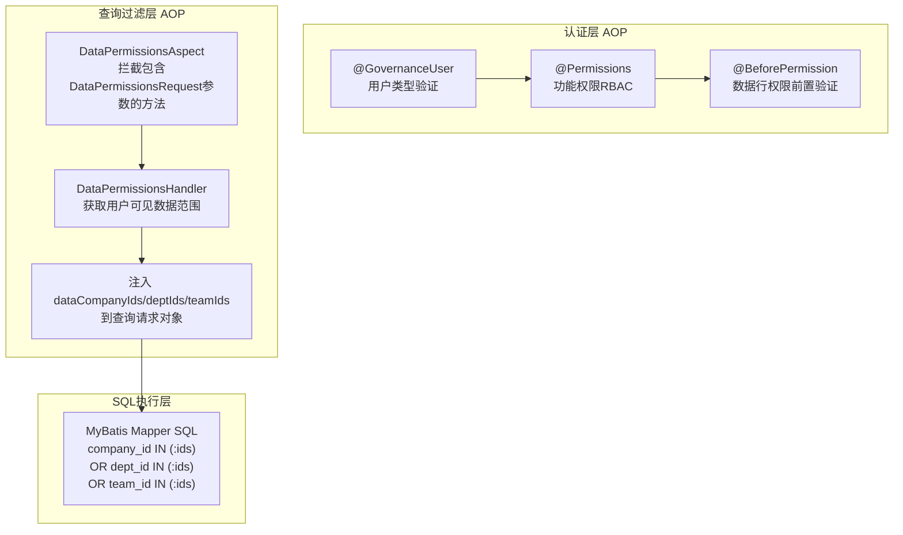

### 7.2 DataPermissionsHandler 核心方法

位于 [DataPermissionsHandler](file:///Users/hehui/dev/git/jiuyu/fupan-governance-server/src/main/java/com/jiuyu/governance/plugins/oauth/data/supports/DataPermissionsHandler.java)：

| 方法 | 用途 | 场景 |
|------|------|------|
| `apply(request, businessFn)` | 查询前注入权限ID，执行过滤查询 | 分页查询、列表查询 |
| `run(type, dataId, actuator)` | 操作前校验单条数据的访问权限 | 详情查看、修改、删除 |
| `runBatch(user, map, actuator)` | 批量数据权限校验 | 批量操作 |
| `afterCheck(type, supplier, getDataId)` | 查询后校验结果数据的访问权限 | 单条查询后校验 |
| `ignore(supplier)` | 临时跳过数据权限检查 | 系统内部操作 |

### 7.3 getUserDataIds — 权限数据获取链

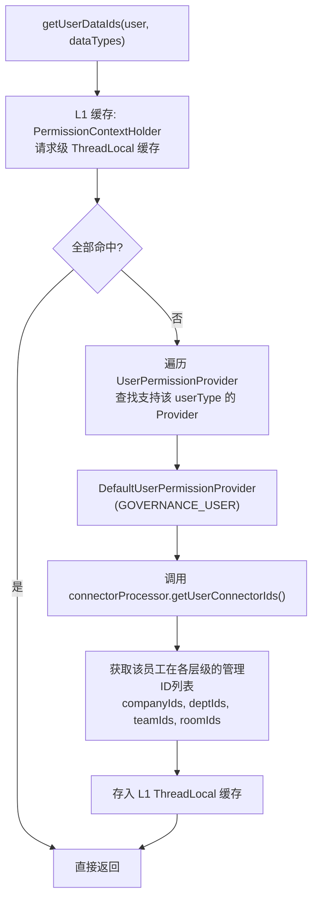

### 7.4 isAll — 全部数据权限判断

```java
public boolean isAll(List<Long> ids) {
    if (ids == null) return false;
    if (EmptyUtil.isEmpty(ids)) return false;
    return ids.contains(0L);  // all = 0L
}
```

- 当用户权限 ID 列表包含 `0` 时，表示**全部数据权限**
- 全部数据权限设置 `request.ifSystemUser(true)`，跳过 SQL 数据过滤条件

### 7.5 数据权限查询模式的详细对比

系统支持三种不同的数据权限注入模式，每种模式适用于不同的查询场景：

**模式一：四字段注入模式（dataCompanyIds / dataDeptIds / dataTeamIds / dataRoomIds）**

这是最常用的模式，适用于分页查询和列表查询。

工作流程：
1. Controller 接收查询请求，请求对象中包含 `DataPermissionsRequest` 接口的四个字段
2. `DataPermissionsAspect` 拦截注解了 `@DataPermissions` 的方法
3. 在方法执行前，通过 `DataPermissionsHandler.apply()` 获取当前用户的权限 ID 列表
4. 将权限 ID 列表注入到请求对象的 `dataCompanyIds`、`dataDeptIds`、`dataTeamIds`、`dataRoomIds` 字段
5. MyBatis Mapper 中的 SQL 动态拼接 `AND (company_id IN (...) OR dept_id IN (...) OR team_id IN (...))`

```java
// 请求对象需实现 DataPermissionsRequest 接口
public class LiveRoomPageRequest extends PageQuery implements DataPermissionsRequest {
    private List<Long> dataCompanyIds;  // AOP注入
    private List<Long> dataDeptIds;     // AOP注入
    private List<Long> dataTeamIds;     // AOP注入
    private List<Long> dataRoomIds;     // AOP注入
}
```

**模式二：manager_connector JOIN 模式**

适用于查询与管理员直接关联的实体，如直播间的"我的直播间"查询。

工作流程：
1. SQL 中使用 LEFT JOIN `manager_connector` 表
2. JOIN 条件：`target_id = entity.id AND manager_type = 对应类型 AND employee_id = 当前用户ID AND is_deleted = 0`
3. 获取到 JOIN 结果的记录是当前用户直接管理的实体
4. 然后通过 WHERE 条件中的四字段 OR 模式再次过滤，确保组织穿透权限也生效

**模式三：精确组织ID匹配模式（companyIds / deptIds / teamIds）**

适用于用户主动筛选特定组织的数据，如"查看A部门的直播间"。

工作流程：
1. 用户在前端选择要查看的组织
2. 前端将组织 ID 传递给后端的 `companyIds`、`deptIds`、`teamIds` 字段
3. SQL 中使用 AND 精确匹配模式：`AND a.company_id = ? AND a.dept_id = ? AND a.team_id = ?`
4. 这种模式与权限过滤模式（OR）是独立的两层条件，同时生效

**三种模式的对比**：

| 对比维度 | 四字段注入 | manager_connector JOIN | 精确ID匹配 |
|---------|-----------|----------------------|-----------|
| 触发方式 | AOP自动注入 | SQL显式JOIN | 用户主动传入 |
| SQL条件类型 | OR（任一命中） | JOIN条件 | AND（全部满足） |
| 组织穿透 | 支持（自动展开下级） | 仅直接管理 | 不支持穿透 |
| 适用场景 | 分页/列表查询 | "我的"查询 | 精确筛选 |
| 性能影响 | 低（缓存命中后几乎无开销） | 中（JOIN操作） | 低（索引查询） |

### 7.6 数据权限的边界情况与防御性设计

**边界情况一：无管理权限的用户**

当一个 Employee 不是任何组织的管理员（`manager_connector` 表中无记录），且不是租户主账户时，`getUserConnectorIds()` 返回空列表。注入到 SQL 中的条件是 `company_id IN () OR dept_id IN () OR team_id IN ()`，SQL 执行结果为空集。系统不会报错，只是返回空列表。这是有意设计的——用户可以看到页面，但看不到任何数据。

**边界情况二：isAll 的最高优先级**

当 `isAll()` 返回 `true` 时（用户权限 ID 列表包含 `0`），系统设置 `request.ifSystemUser(true)`，MyBatis Mapper SQL 直接跳过数据权限过滤条件（`<if test="!ifSystemUser">` 判断）。这意味着租户主账户的查询完全不受数据权限限制，性能也最好（无需额外的 WHERE 子句和 JOIN）。

**边界情况三：数据权限与功能权限的叠加**

一个 API 方法可能同时被 `@Permissions` 和 `@DataPermissions` 注解标记。执行顺序为：
1. `@GovernanceUser` 验证用户类型
2. `@Permissions` 验证功能权限标识
3. `@DataPermissions` 注入数据权限 ID
4. 方法执行，SQL 中包含数据权限过滤

如果用户在第二步失败（没有对应功能权限），第三步和第四步不会执行。

**边界情况四：批量操作中的权限校验**

对于批量操作（如批量删除直播间），系统使用 `DataPermissionsHandler.runBatch()` 方法。该方法：
1. 从当前线程上下文获取用户权限范围
2. 遍历被操作的数据列表
3. 提取每条数据的组织 ID
4. 检查组织 ID 是否在用户权限范围内
5. 任意一条数据不符合权限，整体操作失败

这种全量检查机制防止了部分成功、部分失败的不一致状态。

**边界情况五：ignore 的临时权限提升**

在某些内部操作中（如系统初始化、定时任务），需要临时绕过数据权限检查。系统提供了 `DataPermissionsHandler.ignore()` 方法：

```java
DataPermissionsHandler.ignore(() -> {
    // 此代码块中的所有查询都不受数据权限限制
    List<LiveRoom> allRooms = liveRoomMapper.listAll();
    return allRooms;
});
```

`ignore()` 方法通过向 ThreadLocal 中设置一个特殊标记来实现。标记在 lambda 执行完毕后自动清除。这种方式确保权限提升是临时的、有边界的，不会泄漏到其他请求。

---

## 8. 直播间场景的 SQL 查询

### 8.1 直播间分页查询 (pageQueryLiveRoom)

[LiveRoomMapper.xml:L34-L109](file:///Users/hehui/dev/git/jiuyu/fupan-governance-server/src/main/resources/mapper/room/LiveRoomMapper.xml#L34-L109)

**核心查询逻辑**：

```sql
SELECT a.id, a.anchor_name, a.platform, a.company_id, a.dept_id, a.team_id ...
FROM live_room AS a
-- 当用户请求数据权限过滤时，JOIN管理员连接表
LEFT JOIN manager_connector AS b
    ON a.id = b.target_id
    AND b.manager_type = 4          -- 直播间管理员
    AND b.is_deleted = 0
    AND b.employee_id = #{currentUserId}
WHERE a.is_deleted = 0
  AND a.tenant_id = #{tenantId}

-- 数据权限过滤 (OR 模式: 任一维度命中即可)
AND (
    a.company_id IN (?)     -- dataCompanyIds
    OR a.dept_id IN (?)     -- dataDeptIds
    OR a.team_id IN (?)     -- dataTeamIds
)

-- 业务筛选条件
AND a.anchor_name LIKE CONCAT('%', ?, '%')     -- 主播名称模糊搜索
AND a.anchor_number LIKE CONCAT(?, '%')        -- 主播号前缀搜索
AND a.company_id = ?                           -- 精确子公司筛选
AND a.dept_id = ?                              -- 精确部门筛选
AND a.team_id = ?                              -- 精确小组筛选
AND a.platform = ?                             -- 平台筛选
AND a.account_status = ?                       -- 状态筛选
ORDER BY a.id DESC
```

### 8.2 查询场景对照表

| 查询场景 | companyId/deptId/teamId | dataCompanyIds/DeptIds/TeamIds | SQL JOIN | 说明 |
|---------|------------------------|-------------------------------|----------|------|
| **租户主账户查询全部** | null | all包含0 | 无 | 所有直播间可见 |
| **子公司管理员** | null | companyIds=[1,2] | 无 | 该公司及下属全部直播间 |
| **部门管理员** | null | deptIds=[5] | 无 | 该部门及下属全部直播间 |
| **小组管理员** | null | teamIds=[10] | 无 | 该小组下全部直播间 |
| **直播间管理员** | null | null | INNER JOIN manager_connector | 仅管理员关联的直播间 |
| **按子公司精确筛选** | companyId=1 | null | 无 | 该子公司下的直播间 |
| **按部门精确筛选** | deptId=5 | null | 无 | 该部门下的直播间 |
| **主播名搜索** | null | null | 按权限 | 模糊搜索+权限过滤 |

### 8.3 直播间下拉选项查询

```sql
SELECT a.id, a.anchor_name, a.platform, a.company_id, a.dept_id, a.team_id
FROM live_room AS a
LEFT JOIN manager_connector AS b
    ON a.id = b.target_id AND b.manager_type = 4
    AND b.employee_id = #{currentUserId} AND b.is_deleted = 0
WHERE a.is_deleted = 0 AND a.tenant_id = #{tenantId}
  AND (权限过滤 OR 条件)
  AND (关键字搜索: anchor_name LIKE ... OR anchor_number LIKE ...)
LIMIT #{limit}
```

### 8.4 员工与直播间关联查询

```sql
-- 查询某员工参与的直播间
SELECT DISTINCT live_room_id
FROM schedule_employee
WHERE is_deleted = 0
  AND employee_id = #{employeeId}
  AND position_id = #{positionId}
  AND work_day >= #{deadlineDay}
LIMIT 1000
```

---

## 9. Employee 创建与生命周期

### 9.1 新建 Employee 完整流程 (addEmployee)

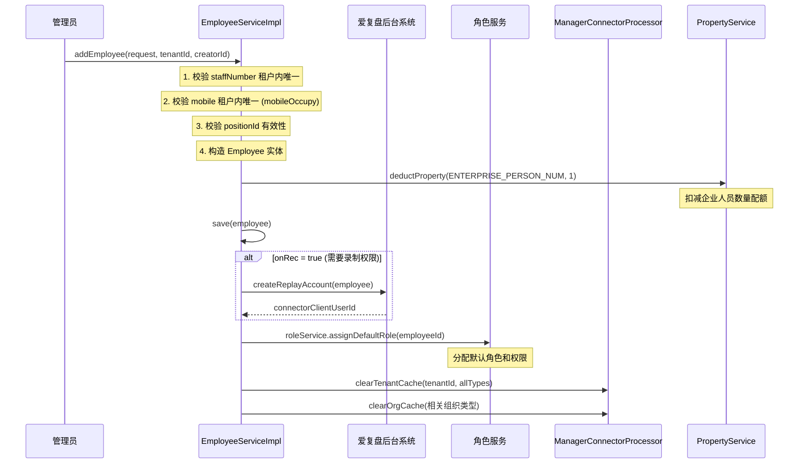

### 9.2 删除 Employee

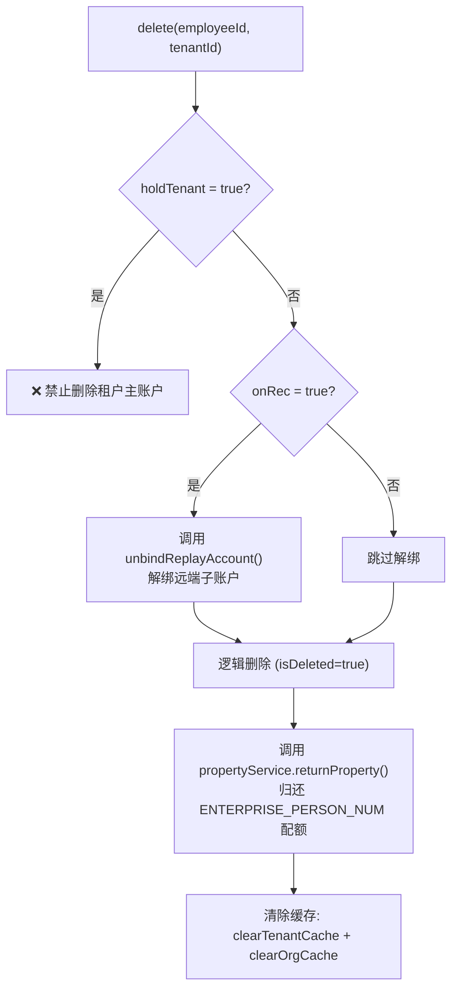

### 9.3 远端解绑触发 (unbind — 从爱复盘后台系统回调)

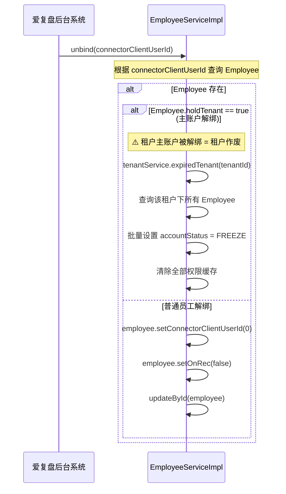

### 9.4 员工离职的完整操作链

员工离职是企业后台管理系统中最常见的操作场景之一，需要同时处理多方面的联动：

**完整操作步骤**：

1. **禁用账户**：管理员调用 `POST /employee/disable` 接口，将 `accountStatus` 从 `NORMAL` 设置为 `DISABLED`。使用 CAS 乐观锁（`UPDATE employee SET account_status=0 WHERE id=? AND account_status=1`）确保操作幂等。如果并发执行了两次禁用，第二次更新影响行数为 0，系统返回"该员工已被禁用"。

2. **强制登出**：禁用后调用 `EmployeeOauthManage.forcedLogout(employeeId)`。`forcedLogout` 调用 `authenticationTokenStorage.logout(GOVERNANCE_USER, employeeId)` 从 Redis 中删除该 Employee 的 Token。该员工如果正在操作系统中，下一次 API 请求时会发现 Token 不存在，被重定向到登录页面。

3. **录制权限处理（可选）**：如果离职员工拥有录制权限（`onRec=true`），根据实际业务需求选择处理方式：
   - **立即回收**：调用 `offRec(employeeId)` → `unbindReplayAccount(employeeId)`，向爱复盘后台系统发起解绑请求，释放子账户
   - **保留待回收**：保留录制权限不释放，等后续重新分配给新员工
   - **延迟回收**：设置一个延迟任务，在 30 天后自动回收录制权限

4. **归还企业配额**：如果离职员工的 `holdTenant=false`（非主账户），系统在删除该 Employee 时自动调用 `propertyService.returnProperty(ENTERPRISE_PERSON_NUM, 1)` 归还企业人员配额。

5. **组织架构调整**：如果离职员工是某些组织的管理员，需要将其从 `manager_connector` 表中移除，防止权限残留。调用 `ManagerConnectorProcessor.disconnectAll(employeeId)`。

6. **角色回收**：清除该 Employee 的角色分配，防止离职员工仍拥有功能权限。

### 9.5 录制权限的动态变更流程

**开通录制权限（onRec: false → true）**：

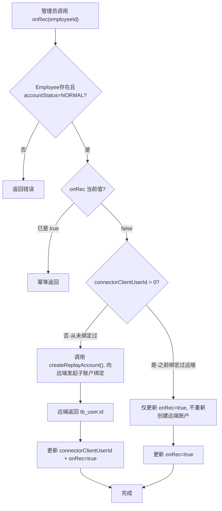

**关闭录制权限（onRec: true → false）**：

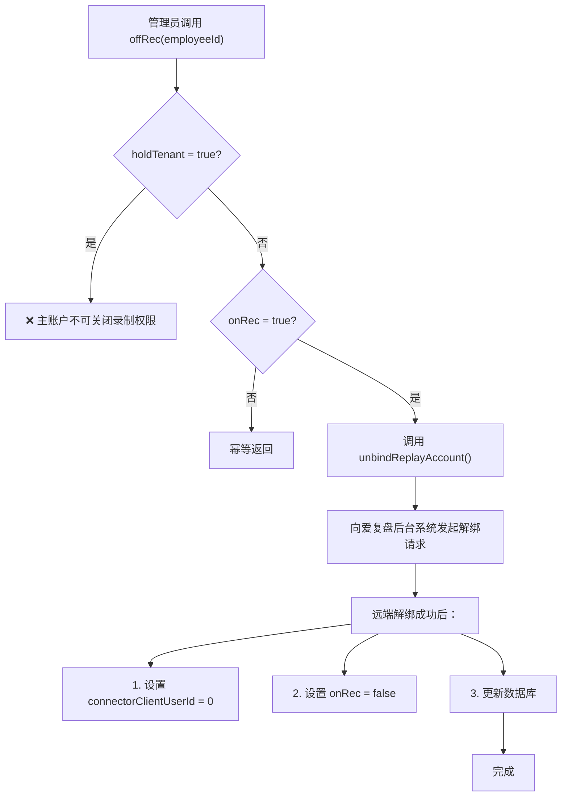

**关键业务规则**：

- 关闭录制权限不会删除本地 Employee 记录，只是解除与远端子账户的关联
- 之前关联的远端 `tb_user` 记录在解绑后状态变为"已解绑"，其 `userType=2` 的子账户标识被清除
- 解绑后的子账户可以重新绑定给其他 Employee
- 录制权限的开关操作会触发用户权限缓存的清除

### 9.6 Employee 数据更新时的约束规则

**修改手机号**：

1. 新手机号在租户范围内必须唯一（`mobileOccupy() 校验`）
2. 如果 `onRec = true`（有录制权限），需要同步调用爱复盘后台系统接口更新子账户的手机号
3. 更新缓存中的手机号索引

**修改密码**：

1. 管理员可以在不输入旧密码的情况下直接修改 Employee 的密码（管理员重置密码场景）
2. 修改密码不影响该 Employee 的当前登录会话（不会触发 `forcedLogout`）
3. 如果 `onRec = true`，同步调用远端接口更新子账户密码（存储在远端 User 的 metadata 中）

**修改工号**：

1. 新工号在租户范围内必须唯一（`staffNumberOccupy() 校验`）
2. 工号修改不影响任何权限、关联关系或远端数据

**修改组织归属**：

1. 修改 Employee 的 `companyId`/`deptId`/`teamId` 并不会自动触发 `manager_connector` 的更新
2. 管理员关系（`manager_connector` 表）与组织归属（`employee` 表的 companyId/deptId/teamId 字段）是两个独立的维度
3. 改变 Employee 的组织归属主要影响其"被谁管理"的关系（通过 `employee.companyId IN (...) OR ...` 查询），而不影响其"管理谁"的关系

---

## 10. Employee 新增详细接口说明

### 10.1 Employee 分页查询 (EmployeeController)

> **安全接入**: 企业后台管理用户 `@GovernanceUser` 认证后访问 [EmployeeController](file:///Users/hehui/dev/git/jiuyu/fupan-governance-server/src/main/java/com/jiuyu/governance/business/rbac/controller/EmployeeController.java)

**关键查询 SQL**（[EmployeeMapper.xml:L46-L130](file:///Users/hehui/dev/git/jiuyu/fupan-governance-server/src/main/resources/mapper/rbac/EmployeeMapper.xml#L46-L130)）：

```sql
SELECT e.id, e.name, e.mobile, e.staff_number, e.company_id, e.dept_id, e.team_id,
       e.position_id, e.on_rec, e.job_type, e.account_status, e.hold_tenant
FROM employee e
WHERE e.tenant_id = #{tenantId}
  AND e.is_deleted = 0

-- 数据权限过滤 (OR模式，三层级)
AND (
    e.company_id IN (?)     -- dataCompanyIds
    OR e.dept_id IN (?)     -- dataDeptIds
    OR e.team_id IN (?)     -- dataTeamIds
)

-- 确切组织筛选 (AND模式)
AND e.company_id IN (?)     -- companyIds (精确筛选)
AND e.dept_id IN (?)        -- deptIds (精确筛选)
AND e.team_id IN (?)        -- teamIds (精确筛选)

-- 业务筛选
AND e.position_id IN (?)    -- 岗位筛选
AND e.name LIKE CONCAT('%', ?, '%')
AND e.mobile LIKE CONCAT('%', ?, '%')
AND e.staff_number LIKE CONCAT('%', ?, '%')
AND e.account_status = ?
AND e.on_rec = ?             -- 筛选是否有录制权限
AND e.job_type = ?
ORDER BY e.id DESC
```

**双字段体系的含义**：

| 字段组 | 字段名 | 用途 | 数据来源 |
|--------|--------|------|----------|
| 数据权限过滤 | `dataCompanyIds` / `dataDeptIds` / `dataTeamIds` | OR 模式，自动注入当前用户的可见范围 | DataPermissionsHandler 根据 ManagerConnector 自动计算 |
| 精确组织筛选 | `companyIds` / `deptIds` / `teamIds` | AND 模式，前端手动选择的筛选条件 | 前端传入 |

> 当 `systemUser == true`（全部数据权限）时，数据权限过滤条件被跳过，查询所有数据。

---

## 11. 错误码体系

### 11.1 账户相关错误码

| 错误码 | 场景 | 说明 | HTTP状态 |
|--------|------|------|---------|
| `ACCOUNT_NOT_FOUND` | 登录/操作 | 手机号未在任何租户中注册 | 401 |
| `ACCOUNT_PASSWORD_ERROR` | 密码登录 | 密码不匹配且远端不存在符合条件的主账户 | 401 |
| `ACCOUNT_DISABLED` | 登录/请求 | 账户已被管理员禁用（accountStatus=0） | 403 |
| `ACCOUNT_FREEZE` | 登录/请求 | 账户已被冻结（accountStatus=2，远端触发） | 403 |
| `ACCOUNT_STAFF_NUMBER_OCCUPY` | 创建/修改 | 工号在租户内已存在 | 409 |
| `ACCOUNT_MOBILE_OCCUPY` | 创建/修改 | 手机号在租户内已存在 | 409 |
| `ACCOUNT_POSITION_INVALID` | 创建/修改 | 指定的职位ID不存在或无效 | 400 |
| `ACCOUNT_HOLD_TENANT_DELETE` | 删除 | 不允许删除租户主账户（holdTenant=true） | 403 |
| `ACCOUNT_HOLD_TENANT_OFF_REC` | 关闭录制 | 不允许关闭租户主账户的录制权限 | 403 |
| `ACCOUNT_TENANT_EXPIRED` | 登录 | 租户已过期/作废 | 403 |

### 11.2 数据权限相关错误码

| 错误码 | 场景 | 说明 |
|--------|------|------|
| `CONFLICT` | afterCheck 无权限 | 用户查询了一条不属于其管理范围的单个数据（如通过直接URL访问他人数据） |
| `NO_POWER` | run/apply 无权限 | 用户无数据权限执行该操作（如尝试修改非管理组织下的数据） |
| `PARAM_INVALID` | 非法权限维度 | 请求了不存在的权限类型维度（如 type=99） |
| `NOT_FOUND` | 数据ID为空 | 传入的数据ID为空值或权限维度类型为空 |

### 11.3 功能权限相关错误码

| 错误码 | 场景 | 说明 |
|--------|------|------|
| `NO_PERMISSION` | @Permissions 校验失败 | 当前用户角色不包含所需的功能权限标识 |
| `NO_MENU_PERMISSION` | 菜单访问 | 用户请求的菜单不在其角色权限范围内 |

### 11.4 认证与登录相关错误码

| 错误码 | 场景 | 说明 |
|--------|------|------|
| `UNAUTHORIZED` | Token无效/过期 | 请求中缺少Token或Token已过期，需要重新登录 |
| `TOKEN_EXPIRED` | Token过期 | Token已超过有效期（默认2小时） |
| `TOKEN_NOT_FOUND` | Token不存在 | Token在Redis中不存在（可能已被强制登出） |
| `WRONG_USER_TYPE` | 用户类型不匹配 | 当前Token的userType与接口要求的@GovernanceUser/@SystemUser等不匹配 |
| `SMS_CODE_EXPIRED` | 验证码登录 | 短信验证码已过期（超过5分钟） |
| `SMS_CODE_ERROR` | 验证码登录 | 验证码输入错误 |
| `SMS_CODE_RATE_LIMIT` | 发送验证码 | 同一手机号60秒内重复请求发送验证码 |

### 11.5 子账户联动相关错误码

| 错误码 | 场景 | 说明 |
|--------|------|------|
| `REPLAY_ACCOUNT_CREATE_FAILED` | 创建子账户 | 调用爱复盘后台系统创建子账户接口失败 |
| `REPLAY_ACCOUNT_UNBIND_FAILED` | 解绑子账户 | 调用爱复盘后台系统解绑子账户接口失败 |
| `REPLAY_ACCOUNT_SYNC_FAILED` | 同步子账户 | 调用爱复盘后台系统拉取子账户列表接口失败 |
| `REPLAY_ACCOUNT_ALREADY_BOUND` | 绑定子账户 | 远端该手机号已经绑定了其他子账户 |
| `REPLAY_USER_NOT_EXISTS` | 主账户登录 | 远端该手机号不存在主账户记录 |
| `REPLAY_PACKAGE_LEVEL_LOW` | 主账户登录 | 远端套餐等级不满足企业后台最低要求 |

### 11.6 组织架构相关错误码

| 错误码 | 场景 | 说明 |
|--------|------|------|
| `ORG_COMPANY_NOT_FOUND` | 操作子公司 | 指定的子公司ID不存在 |
| `ORG_DEPT_NOT_FOUND` | 操作部门 | 指定的部门ID不存在 |
| `ORG_TEAM_NOT_FOUND` | 操作小组 | 指定的小组ID不存在 |
| `ORG_DUPLICATE_NAME` | 创建组织 | 同一层级下组织名称已存在 |
| `ORG_CASCADE_DELETE` | 删除组织 | 该组织下存在子组织，禁止直接删除 |

### 11.7 资源与配额相关错误码

| 错误码 | 场景 | 说明 |
|--------|------|------|
| `QUOTA_EXCEEDED` | 创建Employee | 企业人员数量配额不足（ENTERPRISE_PERSON_NUM） |
| `QUOTA_DEDUCT_FAILED` | 扣减配额 | 扣减配额操作失败 |
| `QUOTA_RETURN_FAILED` | 归还配额 | 归还配额操作失败 |

### 11.8 分布式锁与并发控制错误码

| 错误码 | 场景 | 说明 |
|--------|------|------|
| `RESOURCE_LOCK_FAILED` | @ResourceLock | 获取Redis分布式锁失败（通常因并发操作触发） |
| `RESOURCE_LOCK_TIMEOUT` | @ResourceLock | 分布式锁等待超时 |
| `CONCURRENT_UPDATE` | CAS更新 | 乐观锁更新失败（数据已被其他操作修改） |

---

## 12. 关键文件索引

| 文件 | 职责 |
|------|------|
| [EmployeeOauthManage.java](file:///Users/hehui/dev/git/jiuyu/fupan-governance-server/src/main/java/com/jiuyu/governance/business/rbac/service/impl/EmployeeOauthManage.java) | 登录认证核心逻辑 |
| [EmployeeServiceImpl.java](file:///Users/hehui/dev/git/jiuyu/fupan-governance-server/src/main/java/com/jiuyu/governance/business/rbac/service/impl/EmployeeServiceImpl.java) | Employee 完整生命周期管理 |
| [ManagerConnectorProcessor.java](file:///Users/hehui/dev/git/jiuyu/fupan-governance-server/src/main/java/com/jiuyu/governance/business/org/service/impl/ManagerConnectorProcessor.java) | 管理员连接器与组织树缓存 |
| [DataPermissionsHandler.java](file:///Users/hehui/dev/git/jiuyu/fupan-governance-server/src/main/java/com/jiuyu/governance/plugins/oauth/data/supports/DataPermissionsHandler.java) | 数据权限核心处理器 |
| [DataPermissionsAspect.java](file:///Users/hehui/dev/git/jiuyu/fupan-governance-server/src/main/java/com/jiuyu/governance/plugins/oauth/data/aop/DataPermissionsAspect.java) | 数据权限 AOP 切面拦截 |
| [BeforePermission.java](file:///Users/hehui/dev/git/jiuyu/fupan-governance-server/src/main/java/com/jiuyu/governance/plugins/oauth/data/BeforePermission.java) | @BeforePermission 注解定义 |
| [GovernanceUser.java](file:///Users/hehui/dev/git/jiuyu/fupan-governance-server/src/main/java/com/jiuyu/governance/plugins/oauth/GovernanceUser.java) | @GovernanceUser 注解定义 |
| [OauthConstant.java](file:///Users/hehui/dev/git/jiuyu/fupan-governance-server/src/main/java/com/jiuyu/governance/plugins/oauth/pojo/OauthConstant.java) | 权限类型常量与工具方法 |
| [LiveRoomAdminController.java](file:///Users/hehui/dev/git/jiuyu/fupan-governance-server/src/main/java/com/jiuyu/governance/business/room/controller/LiveRoomAdminController.java) | 直播间管理 API |
| [LiveRoomMapper.xml](file:///Users/hehui/dev/git/jiuyu/fupan-governance-server/src/main/resources/mapper/room/LiveRoomMapper.xml) | 直播间 SQL（含管理员关联+数据权限） |
| [EmployeeMapper.xml](file:///Users/hehui/dev/git/jiuyu/fupan-governance-server/src/main/resources/mapper/rbac/EmployeeMapper.xml) | Employee SQL（含双字段数据权限） |
| [AccountStatus.java](file:///Users/hehui/dev/git/jiuyu/fupan-governance-server/src/main/java/com/jiuyu/governance/business/rbac/pojo/constants/AccountStatus.java) | Employee 账户状态枚举 |