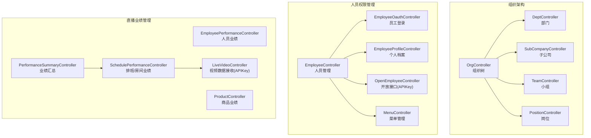
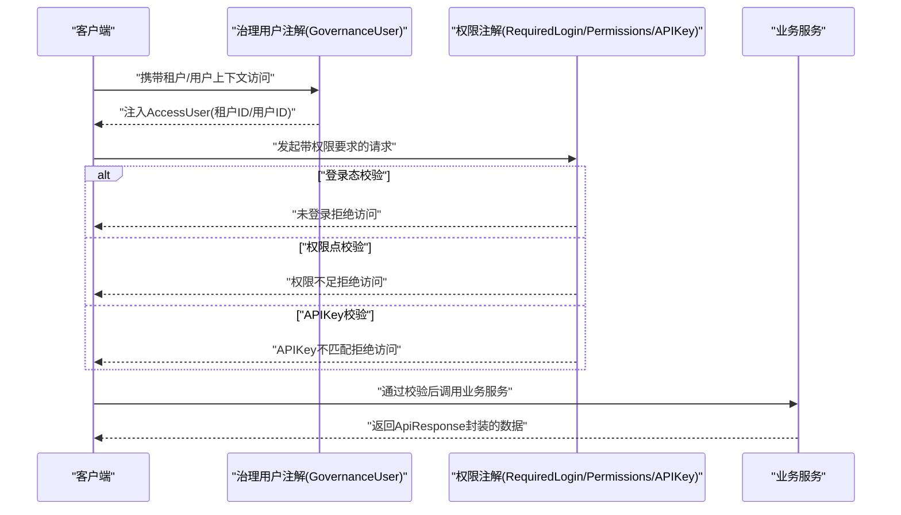
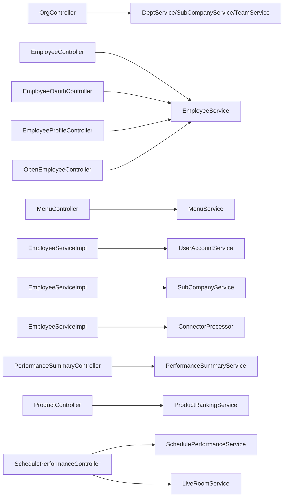

# API接口文档

<cite>
**本文引用的文件**
- [OrgController.java](file://src/main/java/com/jiuyu/governance/business/org/controller/OrgController.java)
- [DeptController.java](file://src/main/java/com/jiuyu/governance/business/org/controller/DeptController.java)
- [SubCompanyController.java](file://src/main/java/com/jiuyu/governance/business/org/controller/SubCompanyController.java)
- [TeamController.java](file://src/main/java/com/jiuyu/governance/business/org/controller/TeamController.java)
- [PositionController.java](file://src/main/java/com/jiuyu/governance/business/org/controller/PositionController.java)
- [EmployeeController.java](file://src/main/java/com/jiuyu/governance/business/rbac/controller/EmployeeController.java)
- [EmployeeOauthController.java](file://src/main/java/com/jiuyu/governance/business/rbac/controller/EmployeeOauthController.java)
- [EmployeeProfileController.java](file://src/main/java/com/jiuyu/governance/business/rbac/controller/EmployeeProfileController.java)
- [OpenEmployeeController.java](file://src/main/java/com/jiuyu/governance/business/rbac/controller/OpenEmployeeController.java)
- [MenuController.java](file://src/main/java/com/jiuyu/governance/business/rbac/controller/MenuController.java)
- [EmployeeServiceImpl.java](file://src/main/java/com/jiuyu/governance/business/rbac/service/impl/EmployeeServiceImpl.java)
- [BindSubAccountRequest.java](file://src/main/java/com/jiuyu/governance/business/rbac/pojo/request/BindSubAccountRequest.java)
- [EmployeePerformanceController.java](file://src/main/java/com/jiuyu/governance/business/performance/controller/EmployeePerformanceController.java)
- [LiveVideoController.java](file://src/main/java/com/jiuyu/governance/business/performance/controller/LiveVideoController.java)
- [PerformanceSummaryController.java](file://src/main/java/com/jiuyu/governance/business/performance/controller/PerformanceSummaryController.java)
- [ProductController.java](file://src/main/java/com/jiuyu/governance/business/performance/controller/ProductController.java)
- [SchedulePerformanceController.java](file://src/main/java/com/jiuyu/governance/business/performance/controller/SchedulePerformanceController.java)
- [接口权限列表.md](file://docs/接口权限列表.md)
- [index.md](file://.agents/llm_wiki/wiki/api/index.md)
</cite>

## 更新摘要
**所做更改**
- 新增权限系统统一化说明，涵盖权限标识标准化和权限前缀规范化
- 新增子账号同步接口文档，包括同步流程、绑定机制和解绑流程
- 新增开放接口模块，包含平台端人员开放接口和APIKey认证机制
- 更新API索引结构，反映权限系统重构后的模块化管理
- 完善RBAC权限管理模块的接口清单和权限控制说明

## 目录
1. [简介](#简介)
2. [项目结构](#项目结构)
3. [核心组件](#核心组件)
4. [架构总览](#架构总览)
5. [详细组件分析](#详细组件分析)
6. [依赖分析](#依赖分析)
7. [性能考虑](#性能考虑)
8. [故障排查指南](#故障排查指南)
9. [结论](#结论)
10. [附录](#附录)

## 简介
本文件为 fupan-governance-server 的完整 API 接口文档，覆盖组织架构管理、人员权限管理、直播业绩管理与直播房间管理四大模块。文档面向前端开发者与第三方集成商，提供接口清单、请求参数、响应格式、状态码、认证与权限控制说明、签名验证、数据权限控制、接口测试用例与调试方法、版本管理与兼容性策略等。

**更新** 本次更新反映了权限系统统一化、新增子账号同步接口以及API索引结构重构的重要变化。

## 项目结构
后端采用 Spring MVC 控制器分层设计，按业务域划分包结构：
- 组织架构管理：org.controller（公司、部门、小组、岗位、组织树）
- 人员权限管理：rbac.controller（员工、菜单、角色、租户、个人档案、开放接口）
- 直播业绩管理：performance.controller（人员、商品、汇总、排班）
- 直播房间管理：room.controller（房间、排班）

**图表来源**
- [OrgController.java:36-137](file://src/main/java/com/jiuyu/governance/business/org/controller/OrgController.java#L36-L137)
- [EmployeeController.java:30-235](file://src/main/java/com/jiuyu/governance/business/rbac/controller/EmployeeController.java#L30-L235)
- [OpenEmployeeController.java:27-66](file://src/main/java/com/jiuyu/governance/business/rbac/controller/OpenEmployeeController.java#L27-L66)
- [PerformanceSummaryController.java:60-343](file://src/main/java/com/jiuyu/governance/business/performance/controller/PerformanceSummaryController.java#L60-L343)

**章节来源**
- [OrgController.java:36-137](file://src/main/java/com/jiuyu/governance/business/org/controller/OrgController.java#L36-L137)
- [EmployeeController.java:30-235](file://src/main/java/com/jiuyu/governance/business/rbac/controller/EmployeeController.java#L30-L235)
- [OpenEmployeeController.java:27-66](file://src/main/java/com/jiuyu/governance/business/rbac/controller/OpenEmployeeController.java#L27-L66)
- [PerformanceSummaryController.java:60-343](file://src/main/java/com/jiuyu/governance/business/performance/controller/PerformanceSummaryController.java#L60-L343)

## 核心组件
- 组织架构管理：提供公司、部门、小组、岗位的增删改查、下拉选择与组织树构建；支持数据权限过滤。
- 人员权限管理：提供员工登录、菜单与角色管理、租户权限；新增子账号同步功能；控制器统一标注治理用户注解，确保访问上下文。
- 直播业绩管理：提供人员维度、商品维度、汇总维度、排班维度的多维统计与导出能力；提供视频数据接收接口（APIKey）。
- 直播房间管理：提供房间维度的业绩列表、排班详情、保存与删除等操作。

**更新** 权限系统已统一化，采用标准化的权限标识前缀（org:*, sys:*, room:*），并新增子账号同步和开放接口模块。

**章节来源**
- [EmployeeController.java:30-235](file://src/main/java/com/jiuyu/governance/business/rbac/controller/EmployeeController.java#L30-L235)
- [EmployeeServiceImpl.java:537-673](file://src/main/java/com/jiuyu/governance/business/rbac/service/impl/EmployeeServiceImpl.java#L537-L673)
- [OpenEmployeeController.java:27-66](file://src/main/java/com/jiuyu/governance/business/rbac/controller/OpenEmployeeController.java#L27-L66)

## 架构总览
- 认证与权限
  - 治理用户注解：统一注入当前租户与用户上下文。
  - 登录态校验：部分接口标注登录态注解，未登录禁止访问。
  - 权限点校验：基于注解的权限点，如 org:dept:add 等，现已统一化管理。
  - APIKey 校验：视频数据接收接口和开放接口使用 APIKey 注解，用于服务间安全调用。
- 数据权限
  - 组织树构建与分页查询均自动应用数据权限过滤，避免越权访问。
- 响应规范
  - 统一 ApiResponse 包裹，包含 code、message、data 三段式结构；分页使用 PageData。

**图表来源**
- [OrgController.java:36-137](file://src/main/java/com/jiuyu/governance/business/org/controller/OrgController.java#L36-L137)
- [EmployeeController.java:30-235](file://src/main/java/com/jiuyu/governance/business/rbac/controller/EmployeeController.java#L30-L235)
- [LiveVideoController.java:22-48](file://src/main/java/com/jiuyu/governance/business/performance/controller/LiveVideoController.java#L22-L48)

## 详细组件分析

### 组织架构管理

#### 接口清单
- GET /api/governance/org/tree
  - 功能：获取组织架构树（公司 -> 部门 -> 小组）
  - 权限：无需显式权限点（治理用户上下文已注入）
  - 参数：level（可选，默认3，1-公司，2-部门及上，3-小组及上）
  - 响应：组织树结构列表，包含公司、部门、小组层级关系
  - 状态码：200 成功
  - 数据权限：自动应用访问用户的数据权限过滤
  - 业务场景：前端组织树展示、筛选器联动

- POST /api/governance/dept/add
  - 功能：新增部门
  - 权限：org:dept:add
  - 参数：DeptAddRequest（请求体）
  - 响应：Void
  - 状态码：200 成功，400 参数错误，401 未授权，403 无权限

- POST /api/governance/dept/update
  - 功能：修改部门
  - 权限：org:dept:update 或 org:dept:add
  - 参数：DeptUpdateRequest（请求体）
  - 响应：Void
  - 状态码：200 成功

- POST /api/governance/dept/delete
  - 功能：删除部门
  - 权限：org:dept:delete
  - 参数：IdRequest（请求体，id）
  - 响应：Void
  - 状态码：200 成功

- POST /api/governance/dept/page
  - 功能：分页查询部门
  - 权限：org:dept:list
  - 参数：DeptPageQueryRequest（请求体）
  - 响应：PageData<DeptResponse>
  - 状态码：200 成功

- GET /api/governance/dept/options
  - 功能：部门下拉选择
  - 权限：无需显式权限点
  - 参数：DeptSelectQueryRequest（查询参数）
  - 响应：List<LabelOption>
  - 状态码：200 成功

- POST /api/governance/sub-company/add
  - 功能：新增子公司
  - 权限：org:sub-company:add
  - 参数：SubCompanyAddRequest（请求体）
  - 响应：Void
  - 状态码：200 成功

- POST /api/governance/sub-company/update
  - 功能：修改子公司
  - 权限：org:sub-company:update 或 org:sub-company:add
  - 参数：SubCompanyUpdateRequest（请求体）
  - 响应：Void
  - 状态码：200 成功

- POST /api/governance/sub-company/delete
  - 功能：删除子公司
  - 权限：org:sub-company:delete
  - 参数：IdRequest（请求体，id）
  - 响应：Void
  - 状态码：200 成功

- POST /api/governance/sub-company/page
  - 功能：分页查询子公司
  - 权限：org:sub-company:list
  - 参数：SubCompanyPageQueryRequest（请求体）
  - 响应：PageData<SubCompanyResponse>
  - 状态码：200 成功

- GET /api/governance/sub-company/options
  - 功能：子公司下拉选择
  - 权限：无需显式权限点
  - 参数：SubCompanySelectQueryRequest（查询参数）
  - 响应：List<LabelOption>
  - 状态码：200 成功

- POST /api/governance/team/add
  - 功能：新增小组
  - 权限：org:team:add
  - 参数：TeamAddRequest（请求体）
  - 响应：Void
  - 状态码：200 成功

- POST /api/governance/team/update
  - 功能：修改小组
  - 权限：org:team:update 或 org:team:add
  - 参数：TeamUpdateRequest（请求体）
  - 响应：Void
  - 状态码：200 成功

- POST /api/governance/team/delete
  - 功能：删除小组
  - 权限：org:team:delete
  - 参数：IdRequest（请求体，id）
  - 响应：Void
  - 状态码：200 成功

- POST /api/governance/team/page
  - 功能：分页查询小组
  - 权限：org:team:list
  - 参数：TeamPageQueryRequest（请求体）
  - 响应：PageData<TeamResponse>
  - 状态码：200 成功

- GET /api/governance/team/options
  - 功能：小组下拉选择
  - 权限：无需显式权限点
  - 参数：TeamSelectQueryRequest（查询参数）
  - 响应：List<LabelOption>
  - 状态码：200 成功

- POST /api/governance/position/add
  - 功能：新增岗位
  - 权限：org:position:add
  - 参数：PositionAddRequest（请求体）
  - 响应：Void
  - 状态码：200 成功

- POST /api/governance/position/update
  - 功能：修改岗位
  - 权限：org:position:update
  - 参数：PositionUpdateRequest（请求体）
  - 响应：Void
  - 状态码：200 成功

- POST /api/governance/position/delete
  - 功能：删除岗位
  - 权限：org:position:delete
  - 参数：IdRequest（请求体，id）
  - 响应：Void
  - 状态码：200 成功

- POST /api/governance/position/list
  - 功能：分页查询岗位
  - 权限：org:position:list
  - 参数：PositionPageQueryRequest（请求体）
  - 响应：PageData<PositionResponse>
  - 状态码：200 成功

- GET /api/governance/position/options
  - 功能：岗位下拉
  - 权限：无需显式权限点
  - 参数：keyword（关键字，可选）、limit（默认10）
  - 响应：List<LabelOption>
  - 状态码：200 成功

**章节来源**
- [OrgController.java:66-137](file://src/main/java/com/jiuyu/governance/business/org/controller/OrgController.java#L66-L137)
- [DeptController.java:45-100](file://src/main/java/com/jiuyu/governance/business/org/controller/DeptController.java#L45-L100)
- [SubCompanyController.java:45-99](file://src/main/java/com/jiuyu/governance/business/org/controller/SubCompanyController.java#L45-L99)
- [TeamController.java:46-104](file://src/main/java/com/jiuyu/governance/business/org/controller/TeamController.java#L46-L104)
- [PositionController.java:42-99](file://src/main/java/com/jiuyu/governance/business/org/controller/PositionController.java#L42-L99)

### 人员权限管理

#### 人员管理
- POST /api/governance/employee/add
  - 功能：新增人员
  - 权限：sys:employee:manage:add
  - 参数：EmployeeAddRequest（请求体）
  - 响应：Void
  - 状态码：200 成功

- POST /api/governance/employee/update
  - 功能：修改人员
  - 权限：sys:employee:manage:update 或 sys:employee:manage:add
  - 参数：EmployeeUpdateRequest（请求体）
  - 响应：Void
  - 状态码：200 成功

- POST /api/governance/employee/password
  - 功能：修改密码
  - 权限：sys:employee:manage:update 或 sys:employee:manage:add
  - 参数：EditEmployeePasswordRequest（请求体）
  - 响应：Void
  - 状态码：200 成功

- GET /api/governance/employee/detail
  - 功能：人员详情
  - 权限：sys:employee:list
  - 参数：employId（查询参数）
  - 响应：EmployeeInfoResponse
  - 状态码：200 成功

- POST /api/governance/employee/page
  - 功能：分页查询人员
  - 权限：sys:employee:list
  - 参数：EmployeeQueryRequest（请求体）
  - 响应：PageData<EmployeeInfoResponse>
  - 状态码：200 成功

- POST /api/governance/employee/special-page
  - 功能：无功能权限的特殊分页
  - 权限：sys:employee:list
  - 参数：EmployeeQueryRequest（请求体）
  - 响应：PageData<EmployeeInfoResponse>
  - 状态码：200 成功

- POST /api/governance/employee/on-rec
  - 功能：开启录制权限
  - 权限：sys:employee:manage:update 或 sys:employee:manage:add
  - 参数：EmployOnRecRequest（请求体）
  - 响应：Void
  - 状态码：200 成功

- POST /api/governance/employee/off-rec
  - 功能：关闭录制权限
  - 权限：sys:employee:manage:update 或 sys:employee:manage:add
  - 参数：EmployOnRecRequest（请求体）
  - 响应：Void
  - 状态码：200 成功

- POST /api/governance/employee/sync-sub-account
  - 功能：同步子账户
  - 权限：sys:employee:manage:update 或 sys:employee:manage:add
  - 参数：AccessUser（请求头）
  - 响应：Void
  - 状态码：200 成功
  - 业务场景：从爱复盘平台同步子账户信息

- POST /api/governance/employee/enable
  - 功能：启用人员
  - 权限：sys:employee:manage:update 或 sys:employee:manage:add
  - 参数：IdRequest（请求体）
  - 响应：Void
  - 状态码：200 成功

- POST /api/governance/employee/disable
  - 功能：禁用人员
  - 权限：sys:employee:manage:update 或 sys:employee:manage:add
  - 参数：IdRequest（请求体）
  - 响应：Void
  - 状态码：200 成功
  - 业务场景：强制下线已禁用人员

- GET /api/governance/employee/option
  - 功能：搜索下拉
  - 权限：sys:employee:list
  - 参数：EmployeeOptionSearchRequest（查询参数）
  - 响应：List<LabelOption>
  - 状态码：200 成功

- POST /api/governance/employee/delete
  - 功能：删除人员
  - 权限：sys:employee:manage:delete
  - 参数：IdRequest（请求体）
  - 响应：Void
  - 状态码：200 成功

#### 员工登录
- POST /api/governance/oauth/password
  - 功能：手机号码 + 密码登录
  - 权限：无需权限点
  - 参数：EmployeeOauthPasswordLoginRequest（请求体）
  - 响应：EmployeeOauthResponse
  - 状态码：200 成功

- POST /api/governance/oauth/code
  - 功能：获取登录验证码
  - 权限：无需权限点
  - 参数：EmployeeMobileRequest（请求体）
  - 响应：Void
  - 状态码：200 成功

- POST /api/governance/oauth/code-login
  - 功能：手机号码 + 验证码登录
  - 权限：无需权限点
  - 参数：EmployeeMobileLoginRequest（请求体）
  - 响应：EmployeeOauthResponse
  - 状态码：200 成功

- GET /api/governance/oauth/logout
  - 功能：登出
  - 权限：无需权限点
  - 参数：AccessUser（请求头）
  - 响应：Void
  - 状态码：200 成功

#### 个人档案
- GET /api/governance/employee-profile/info
  - 功能：个人资料
  - 权限：my:profile:page
  - 参数：loadRoom（查询参数，可选）
  - 响应：EmployeeProfileResponse
  - 状态码：200 成功

- POST /api/governance/employee-profile/info
  - 功能：修改个人资料
  - 权限：my:profile:page
  - 参数：EmployeeProfileUpdateRequest（请求体）
  - 响应：Void
  - 状态码：200 成功

- POST /api/governance/employee-profile/send-password-code
  - 功能：发送密码重置验证码
  - 权限：无需权限点
  - 参数：AccessUser（请求头）
  - 响应：Void
  - 状态码：200 成功

- POST /api/governance/employee-profile/update-password
  - 功能：修改密码
  - 权限：无需权限点
  - 参数：EmployeeUpdatePasswordRequest（请求体）
  - 响应：Void
  - 状态码：200 成功

- POST /api/governance/employee-profile/send-bind-code
  - 功能：发送绑定手机号码验证码
  - 权限：无需权限点
  - 参数：EmployeeSendBindMobileCodeRequest（请求体）
  - 响应：Void
  - 状态码：200 成功

- POST /api/governance/employee-profile/update-mobile
  - 功能：更改手机号码
  - 权限：无需权限点
  - 参数：EmployeeUpdateMobileRequest（请求体）
  - 响应：Void
  - 状态码：200 成功

- GET /api/governance/employee-profile/base
  - 功能：员工资料
  - 权限：my:profile:page
  - 参数：employeeId（查询参数）、loadRoom（查询参数，可选）
  - 响应：EmployeeProfileResponse
  - 状态码：200 成功

#### 开放接口（APIKey）
- POST /api/governance/employee-open/unbind
  - 功能：解绑子账户
  - 权限：APIKey
  - 参数：IdRequest（请求体）
  - 响应：Void
  - 状态码：200 成功
  - 业务场景：平台端调用，解除员工与子账户的绑定关系

- POST /api/governance/employee-open/bind
  - 功能：绑定子账户
  - 权限：APIKey
  - 参数：BindSubAccountRequest（请求体）
  - 响应：Void
  - 状态码：200 成功
  - 业务场景：平台端调用，建立员工与子账户的绑定关系

#### 菜单管理
- POST /api/governance/menu/add
  - 功能：新增菜单
  - 权限：system:menu:add
  - 参数：MenuAddRequest（请求体）
  - 响应：Void
  - 状态码：200 成功

- POST /api/governance/menu/update
  - 功能：修改菜单
  - 权限：system:menu:update
  - 参数：MenuUpdateRequest（请求体）
  - 响应：Void
  - 状态码：200 成功

- POST /api/governance/menu/delete/{id}
  - 功能：删除菜单
  - 权限：system:menu:delete
  - 参数：id（路径参数）
  - 响应：Void
  - 状态码：200 成功

- GET /api/governance/menu/tree
  - 功能：获取菜单树形结构
  - 权限：system:menu:list
  - 参数：无
  - 响应：List<MenuTreeResponse>
  - 状态码：200 成功

**更新** 新增子账号同步接口（/api/governance/employee/sync-sub-account）和开放接口模块，权限系统已统一化管理。

**章节来源**
- [EmployeeController.java:50-233](file://src/main/java/com/jiuyu/governance/business/rbac/controller/EmployeeController.java#L50-L233)
- [EmployeeOauthController.java:39-82](file://src/main/java/com/jiuyu/governance/business/rbac/controller/EmployeeOauthController.java#L39-L82)
- [EmployeeProfileController.java:58-192](file://src/main/java/com/jiuyu/governance/business/rbac/controller/EmployeeProfileController.java#L58-L192)
- [OpenEmployeeController.java:45-65](file://src/main/java/com/jiuyu/governance/business/rbac/controller/OpenEmployeeController.java#L45-L65)
- [MenuController.java:41-84](file://src/main/java/com/jiuyu/governance/business/rbac/controller/MenuController.java#L41-L84)
- [EmployeeServiceImpl.java:537-673](file://src/main/java/com/jiuyu/governance/business/rbac/service/impl/EmployeeServiceImpl.java#L537-L673)

### 直播业绩管理

#### 业绩汇总
- POST /api/governance/performance/summary/sub-company/page
  - 功能：各分公司业绩分页查询
  - 权限：登录态 RequiredLogin
  - 参数：SubCompanyPerformancePageRequest（请求体）
  - 响应：PageData<PerformanceSummaryResponse>
  - 状态码：200 成功

- POST /api/governance/performance/summary/dept/page
  - 功能：各部门业绩分页查询
  - 权限：登录态 RequiredLogin
  - 参数：DeptPerformancePageRequest（请求体）
  - 响应：PageData<PerformanceSummaryResponse>
  - 状态码：200 成功

- POST /api/governance/performance/summary/team/page
  - 功能：各小组业绩分页查询
  - 权限：登录态 RequiredLogin
  - 参数：TeamPerformancePageRequest（请求体）
  - 响应：PageData<PerformanceSummaryResponse>
  - 状态码：200 成功

- POST /api/governance/performance/summary/live-room/page
  - 功能：各直播间业绩分页查询
  - 权限：登录态 RequiredLogin
  - 参数：LiveRoomPerformancePageRequest（请求体）
  - 响应：PageData<PerformanceSummaryResponse>
  - 状态码：200 成功

- POST /api/governance/performance/summary/org/count
  - 功能：获取组织数量统计
  - 权限：登录态 RequiredLogin
  - 参数：OrgCountRequest（请求体）
  - 响应：OrgCountResponse
  - 状态码：200 成功

- POST /api/governance/performance/summary/period-stats
  - 功能：获取业绩时段统计（六时段）
  - 权限：登录态 RequiredLogin
  - 参数：PerformancePeriodStatsRequest（请求体）
  - 响应：PerformancePeriodStatsResponse
  - 状态码：200 成功

- POST /api/governance/performance/summary/trend
  - 功能：获取数据趋势（柱形图）
  - 权限：登录态 RequiredLogin
  - 参数：PerformanceTrendRequest（请求体）
  - 响应：List<DailyPerformanceResponse>
  - 状态码：200 成功

- POST /api/governance/performance/summary/daily/page
  - 功能：获取数据详情分页列表
  - 权限：登录态 RequiredLogin
  - 参数：PerformanceDailyPageRequest（请求体）
  - 响应：PageData<DailyPerformanceResponse>
  - 状态码：200 成功

- GET /api/governance/performance/summary/daily/export
  - 功能：导出数据详情列表（Excel）
  - 权限：登录态 RequiredLogin
  - 参数：PerformanceDailyPageRequest（查询参数）
  - 响应：Excel 文件字节流
  - 状态码：200 成功

- POST /api/governance/performance/summary/sales-revenue/summary
  - 功能：销售额汇总
  - 权限：登录态 RequiredLogin
  - 参数：SalesRevenueSummaryRequest（请求体）
  - 响应：List<SalesRevenueSummaryResponse>
  - 状态码：200 成功

- GET /api/governance/performance/summary/sub-company/export
  - 功能：导出各分公司业绩数据（Excel）
  - 权限：登录态 RequiredLogin
  - 参数：SubCompanyPerformancePageRequest（查询参数）
  - 响应：Excel 文件字节流
  - 状态码：200 成功

- GET /api/governance/performance/summary/dept/export
  - 功能：导出各部门业绩数据（Excel）
  - 权限：登录态 RequiredLogin
  - 参数：DeptPerformancePageRequest（查询参数）
  - 响应：Excel 文件字节流
  - 状态码：200 成功

- GET /api/governance/performance/summary/team/export
  - 功能：导出各小组业绩数据（Excel）
  - 权限：登录态 RequiredLogin
  - 参数：TeamPerformancePageRequest（查询参数）
  - 响应：Excel 文件字节流
  - 状态码：200 成功

- GET /api/governance/performance/summary/live-room/export
  - 功能：导出各直播间业绩数据（Excel）
  - 权限：登录态 RequiredLogin
  - 参数：LiveRoomPerformancePageRequest（查询参数）
  - 响应：Excel 文件字节流
  - 状态码：200 成功

#### 商品业绩
- POST /api/governance/performance/product/ranking
  - 功能：商品排行分页查询
  - 权限：登录态 RequiredLogin
  - 参数：ProductRankingRequest（请求体）
  - 响应：PageData<ProductRankingResponse>
  - 状态码：200 成功

- POST /api/governance/performance/product/sessions
  - 功能：商品关联直播场次分页查询
  - 权限：登录态 RequiredLogin
  - 参数：ProductSessionRequest（请求体）
  - 响应：PageData<ProductSessionResponse>
  - 状态码：200 成功

- POST /api/governance/performance/product/companies
  - 功能：商品关联分公司列表查询
  - 权限：登录态 RequiredLogin
  - 参数：ProductCompanyRequest（请求体）
  - 响应：List<ProductCompanyResponse>
  - 状态码：200 成功

#### 排班/房间业绩
- POST /api/governance/performance/live-room/pageLiveRoomPerformance
  - 功能：直播间的业绩分页列表
  - 权限：无需登录态（注释掉治理用户）
  - 参数：LiveRoomQueryRequest（请求体）
  - 响应：PageData<LiveRoomPerformanceResponse>
  - 状态码：200 成功

- POST /api/governance/performance/live-room/pageQuerySchedule
  - 功能：详细的排班业绩分页查询
  - 权限：登录态 RequiredLogin
  - 参数：SchedulePerformancePageRequest（请求体）
  - 响应：PageData<SchedulePerformanceResponse>
  - 状态码：200 成功

- POST /api/governance/performance/live-room/dailyStats
  - 功能：按天维度统计排班业绩
  - 权限：登录态 RequiredLogin
  - 参数：DailyPerformanceStatsRequest（请求体）
  - 响应：PageData<DailyPerformanceStatsResponse>
  - 状态码：200 成功

- GET /api/governance/performance/live-room/schedulePerformance/{id}
  - 功能：单个班次业绩详情查询
  - 权限：登录态 RequiredLogin
  - 参数：id（路径参数）
  - 响应：SchedulePerformanceDetailResponse
  - 状态码：200 成功

- POST /api/governance/performance/live-room/schedulePerformanceSave
  - 功能：单个班次业绩保存/修改
  - 权限：登录态 RequiredLogin
  - 参数：SchedulePerformanceSaveRequest（请求体）
  - 响应：Long（业绩ID）
  - 状态码：200 成功

- POST /api/governance/performance/live-room/deleteSchedulePerformance
  - 功能：删除班次业绩
  - 权限：登录态 RequiredLogin
  - 参数：IdRequest（请求体，id）
  - 响应：Void
  - 状态码：200 成功

#### 视频数据接收
- POST /api/governance/performance/video/receive
  - 功能：视频数据接收（爱复盘服务器使用）
  - 权限：APIKey
  - 参数：VideoPushRequest（请求体）
  - 响应：Void
  - 状态码：200 成功

**章节来源**
- [PerformanceSummaryController.java:78-342](file://src/main/java/com/jiuyu/governance/business/performance/controller/PerformanceSummaryController.java#L78-L342)
- [ProductController.java:52-91](file://src/main/java/com/jiuyu/governance/business/performance/controller/ProductController.java#L52-L91)
- [SchedulePerformanceController.java:61-156](file://src/main/java/com/jiuyu/governance/business/performance/controller/SchedulePerformanceController.java#L61-L156)
- [LiveVideoController.java:43-47](file://src/main/java/com/jiuyu/governance/business/performance/controller/LiveVideoController.java#L43-L47)

### 接口调用示例与错误处理

- 调用示例（通用）
  - 组织树：GET /api/governance/org/tree?level=3
  - 部门分页：POST /api/governance/dept/page（请求体包含分页与筛选条件）
  - 人员业绩趋势：POST /api/governance/performance/employee/trend（请求体包含起止日期与员工/房间筛选）
  - 商品排行：POST /api/governance/performance/product/ranking（请求体包含时间范围与排序）
  - 业绩汇总导出：GET /api/governance/performance/summary/dept/export?startDate=...&endDate=...
  - 子账号同步：POST /api/governance/employee/sync-sub-account（需要权限：sys:employee:manage:update 或 sys:employee:manage:add）

- 错误处理
  - 未登录：返回 401 未授权
  - 权限不足：返回 403 禁止访问
  - 参数错误：返回 400 参数错误
  - 业务异常：返回 500 内部错误，携带错误码与提示
  - 统一响应体：code、message、data

- 权限控制
  - 治理用户注解：自动注入租户与用户上下文
  - 登录态注解：RequiredLogin 强制登录
  - 权限点注解：Permissions("org:dept:add") 进行细粒度授权，现已统一化管理
  - APIKey 注解：用于服务间调用的安全校验，适用于开放接口和视频数据接收

**更新** 权限系统已统一化，采用标准化的权限标识前缀（org:*, sys:*, room:*），并新增子账号同步和开放接口的APIKey认证。

**章节来源**
- [EmployeeController.java:50-233](file://src/main/java/com/jiuyu/governance/business/rbac/controller/EmployeeController.java#L50-L233)
- [OpenEmployeeController.java:45-65](file://src/main/java/com/jiuyu/governance/business/rbac/controller/OpenEmployeeController.java#L45-L65)
- [LiveVideoController.java:43-47](file://src/main/java/com/jiuyu/governance/business/performance/controller/LiveVideoController.java#L43-L47)

## 依赖分析
- 控制器与服务层解耦：控制器仅负责参数校验与上下文注入，业务逻辑下沉至服务层。
- 统一注解体系：治理用户、登录态、权限点、APIKey 注解贯穿各控制器，形成一致的鉴权策略。
- 数据权限：组织树与分页查询均自动应用数据权限过滤，避免越权。
- 权限系统统一化：采用标准化的权限标识前缀，便于权限管理和维护。

**图表来源**
- [OrgController.java:42-46](file://src/main/java/com/jiuyu/governance/business/org/controller/OrgController.java#L42-L46)
- [EmployeeController.java:36-38](file://src/main/java/com/jiuyu/governance/business/rbac/controller/EmployeeController.java#L36-L38)
- [EmployeeServiceImpl.java:540-542](file://src/main/java/com/jiuyu/governance/business/rbac/service/impl/EmployeeServiceImpl.java#L540-L542)
- [PerformanceSummaryController.java:66-67](file://src/main/java/com/jiuyu/governance/business/performance/controller/PerformanceSummaryController.java#L66-L67)

**章节来源**
- [EmployeeServiceImpl.java:537-673](file://src/main/java/com/jiuyu/governance/business/rbac/service/impl/EmployeeServiceImpl.java#L537-L673)

## 性能考虑
- 分页查询：统一使用 PageData，建议前端合理设置 page/limit，避免一次性加载过多数据。
- 组织树构建：对部门与小组采用分批查询与分组聚合，减少重复查询与内存占用。
- 导出功能：导出接口将分页参数强制为全量导出，建议在前端控制时间范围与筛选条件，避免超大数据量导出。
- 缓存策略：建议在服务层对热点数据（如岗位下拉、组织树）增加缓存，降低数据库压力。
- 子账号同步：采用批量操作和缓存清理机制，避免频繁的数据库操作和缓存失效。

**更新** 新增子账号同步的性能考虑，包括批量操作和缓存清理优化。

## 故障排查指南
- 401 未授权
  - 检查是否携带有效的治理用户上下文与登录态
  - 确认 RequiredLogin 注解是否满足
- 403 禁止访问
  - 检查权限点是否正确配置（Permissions 注解）
  - 确认当前用户角色是否具备相应权限
  - 验证权限标识前缀是否符合统一化标准（org:*, sys:*, room:*）
- 400 参数错误
  - 检查请求体与查询参数是否符合接口定义
  - 关注必填字段与数据类型
- 500 内部错误
  - 查看服务端日志，定位具体异常
  - 确认数据库连接与事务配置
- APIKey 校验失败
  - 确认调用方是否正确配置 APIKey 并在请求头中传递
  - 验证开放接口的调用权限

**更新** 新增权限系统统一化和子账号同步相关的故障排查指导。

**章节来源**
- [EmployeeController.java:50-233](file://src/main/java/com/jiuyu/governance/business/rbac/controller/EmployeeController.java#L50-L233)
- [OpenEmployeeController.java:45-65](file://src/main/java/com/jiuyu/governance/business/rbac/controller/OpenEmployeeController.java#L45-L65)
- [LiveVideoController.java:43-47](file://src/main/java/com/jiuyu/governance/business/performance/controller/LiveVideoController.java#L43-L47)

## 结论
本接口文档覆盖了组织架构、人员权限、直播业绩与直播房间管理的完整 API 清单，明确了认证与权限控制、数据权限过滤、统一响应格式与错误处理策略。权限系统已统一化管理，采用标准化的权限标识前缀，新增子账号同步和开放接口模块，提升了系统的安全性和可扩展性。建议在集成过程中严格遵循权限点与登录态要求，合理使用分页与导出接口，确保系统的安全性与稳定性。

**更新** 本次更新反映了权限系统统一化、新增子账号同步接口以及API索引结构重构的重要变化，为开发者提供了更清晰的权限管理和接口调用指导。

## 附录

### 版本管理、兼容性与废弃策略
- 版本管理
  - 接口路径采用 /api/governance/v{version}/... 形式（当前仓库未体现显式版本号，建议后续引入版本号以支持向后兼容）
- 兼容性
  - 建议新增接口采用向后兼容策略，保留旧字段并在新字段中扩展
  - 对于破坏性变更，建议通过新增接口或版本化路径实现平滑过渡
- 废弃策略
  - 对于不再维护的接口，建议在接口文档中标注废弃时间与替代方案，并在服务端保留一段时间以保障存量调用

### 接口测试用例与调试方法
- 测试用例建议
  - 组织树：构造多层级组织数据，验证 level 参数与数据权限过滤
  - 分页查询：构造大量数据，验证 page/limit 与排序字段
  - 权限校验：模拟无权限用户与越权访问，验证 403 返回
  - 登录态校验：模拟未登录访问，验证 401 返回
  - 导出功能：构造大范围时间数据，验证导出文件完整性
  - 子账号同步：构造不同类型的子账户数据，验证同步逻辑和边界条件
  - 开放接口：使用正确的 APIKey 调用，验证安全校验机制
- 调试方法
  - 使用 Postman 或 curl 构造请求，观察统一响应体结构
  - 在服务端开启日志，定位异常堆栈与 SQL 执行计划
  - 对高频接口增加监控埋点，关注延迟与错误率
  - 使用权限管理系统验证权限标识的正确性

### 权限系统统一化说明
- 权限前缀标准化
  - org:* - 组织管理权限：部门、岗位、子公司、小组管理
  - sys:* - 系统管理权限：员工管理、角色管理、菜单管理
  - room:* - 直播间管理权限：直播间管理、排班管理
- 权限标识命名规范
  - 采用动词+对象+操作的形式，如 org:dept:add、sys:employee:list
  - 支持多个权限标识组合，如修改接口需要 update 或 add 权限
- 权限管理最佳实践
  - 为每个接口明确权限标识，避免过度宽泛的权限配置
  - 定期审查权限配置，确保最小权限原则
  - 建立权限变更审批流程，确保权限调整的可追溯性

**更新** 新增权限系统统一化的详细说明，包括权限前缀标准化、命名规范和最佳实践。

**章节来源**
- [接口权限列表.md:109-117](file://docs/接口权限列表.md#L109-L117)
- [EmployeeController.java:50-233](file://src/main/java/com/jiuyu/governance/business/rbac/controller/EmployeeController.java#L50-L233)