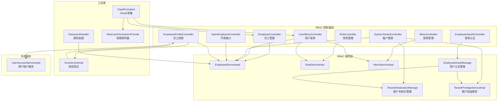
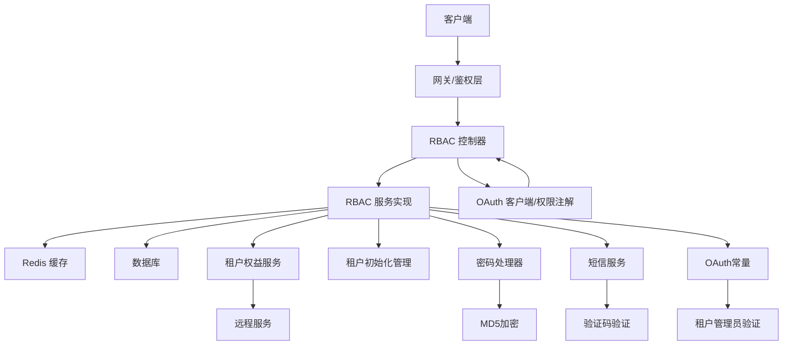
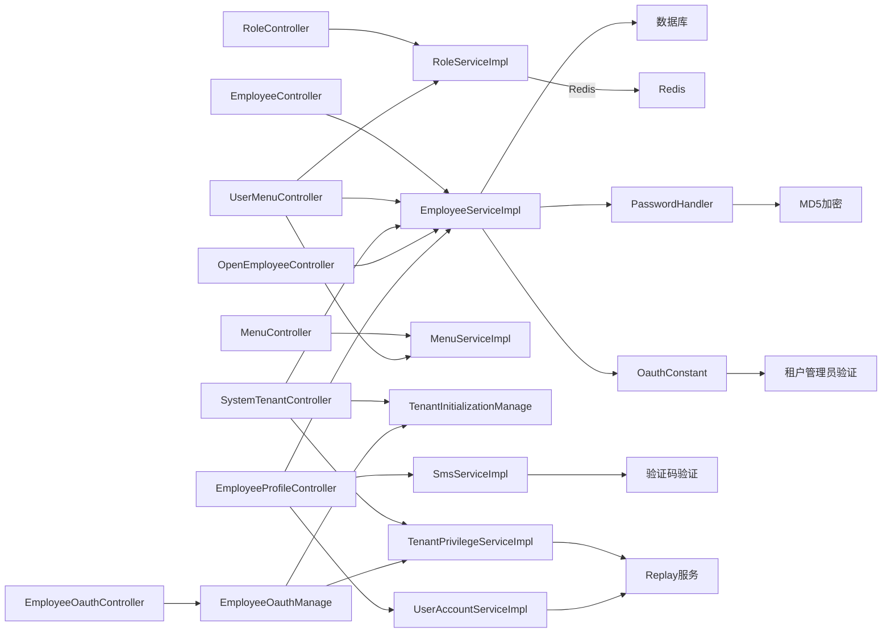
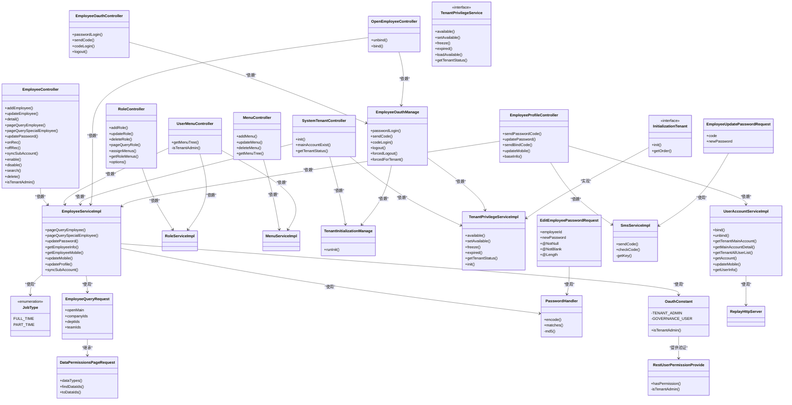
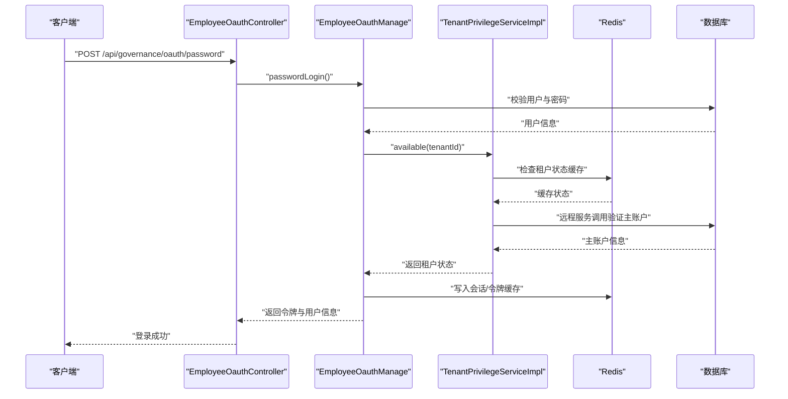
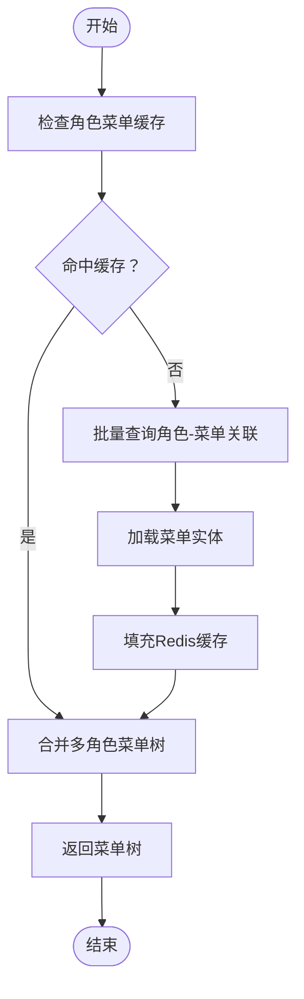
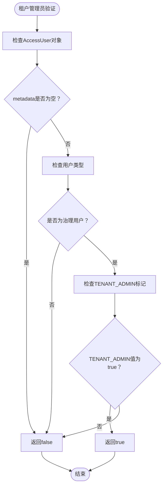
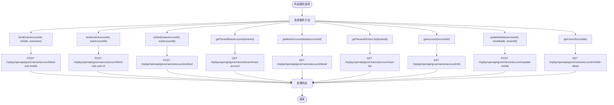
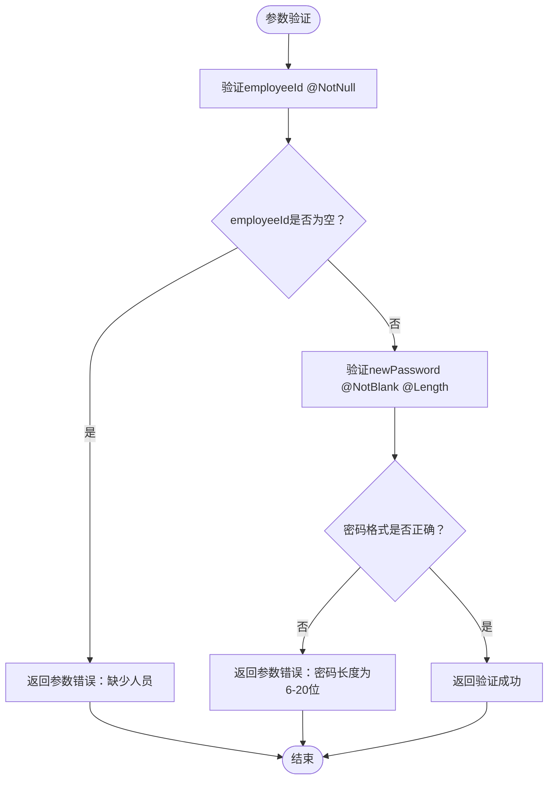

# 人员权限管理API

<cite>
**本文引用的文件**
- [EmployeeController.java](file://src/main/java/com/jiuyu/governance/business/rbac/controller/EmployeeController.java)
- [RoleController.java](file://src/main/java/com/jiuyu/governance/business/rbac/controller/RoleController.java)
- [MenuController.java](file://src/main/java/com/jiuyu/governance/business/rbac/controller/MenuController.java)
- [SystemTenantController.java](file://src/main/java/com/jiuyu/governance/business/rbac/controller/SystemTenantController.java)
- [UserMenuController.java](file://src/main/java/com/jiuyu/governance/business/rbac/controller/UserMenuController.java)
- [EmployeeOauthController.java](file://src/main/java/com/jiuyu/governance/business/rbac/controller/EmployeeOauthController.java)
- [OpenEmployeeController.java](file://src/main/java/com/jiuyu/governance/business/rbac/controller/OpenEmployeeController.java)
- [EmployeeProfileController.java](file://src/main/java/com/jiuyu/governance/business/rbac/controller/EmployeeProfileController.java)
- [EmployeeServiceImpl.java](file://src/main/java/com/jiuyu/governance/business/rbac/service/impl/EmployeeServiceImpl.java)
- [RoleServiceImpl.java](file://src/main/java/com/jiuyu/governance/business/rbac/service/impl/RoleServiceImpl.java)
- [MenuServiceImpl.java](file://src/main/java/com/jiuyu/governance/business/rbac/service/impl/MenuServiceImpl.java)
- [TenantInitializationManage.java](file://src/main/java/com/jiuyu/governance/business/rbac/service/impl/TenantInitializationManage.java)
- [EmployeeOauthManage.java](file://src/main/java/com/jiuyu/governance/business/rbac/service/impl/EmployeeOauthManage.java)
- [TenantPrivilegeServiceImpl.java](file://src/main/java/com/jiuyu/governance/business/rbac/service/impl/TenantPrivilegeServiceImpl.java)
- [InitializationTenant.java](file://src/main/java/com/jiuyu/governance/common/init/InitializationTenant.java)
- [TenantInitContext.java](file://src/main/java/com/jiuyu/governance/common/init/TenantInitContext.java)
- [TenantPrivilegeService.java](file://src/main/java/com/jiuyu/governance/business/rbac/service/TenantPrivilegeService.java)
- [AccountStatus.java](file://src/main/java/com/jiuyu/governance/business/rbac/pojo/constants/AccountStatus.java)
- [TenantStatusResponse.java](file://src/main/java/com/jiuyu/governance/business/rbac/pojo/response/TenantStatusResponse.java)
- [EmployeeOauthResponse.java](file://src/main/java/com/jiuyu/governance/business/rbac/pojo/response/EmployeeOauthResponse.java)
- [JobType.java](file://src/main/java/com/jiuyu/governance/business/rbac/pojo/constants/JobType.java)
- [Employee.java](file://src/main/java/com/jiuyu/governance/business/rbac/pojo/entity/Employee.java)
- [EmployeeAddRequest.java](file://src/main/java/com/jiuyu/governance/business/rbac/pojo/request/EmployeeAddRequest.java)
- [EmployeeUpdateRequest.java](file://src/main/java/com/jiuyu/governance/business/rbac/pojo/request/EmployeeUpdateRequest.java)
- [EmployeeInfoResponse.java](file://src/main/java/com/jiuyu/governance/business/rbac/pojo/response/EmployeeInfoResponse.java)
- [EmployeeQueryRequest.java](file://src/main/java/com/jiuyu/governance/business/rbac/pojo/request/EmployeeQueryRequest.java)
- [EmployeeOptionSearchRequest.java](file://src/main/java/com/jiuyu/governance/business/rbac/pojo/request/EmployeeOptionSearchRequest.java)
- [EditEmployeePasswordRequest.java](file://src/main/java/com/jiuyu/governance/business/rbac/pojo/request/EditEmployeePasswordRequest.java)
- [EmployeeUpdatePasswordRequest.java](file://src/main/java/com/jiuyu/governance/business/rbac/pojo/request/EmployeeUpdatePasswordRequest.java)
- [DataPermissionsPageRequest.java](file://src/main/java/com/jiuyu/governance/common/pojo/request/DataPermissionsPageRequest.java)
- [EmployeeMapper.xml](file://src/main/resources/mapper/rbac/EmployeeMapper.xml)
- [PasswordHandler.java](file://src/main/java/com/jiuyu/governance/common/utils/PasswordHandler.java)
- [SmsServiceImpl.java](file://src/main/java/com/jiuyu/governance/openfeign/replay/impl/SmsServiceImpl.java)
- [UserAccountServiceImpl.java](file://src/main/java/com/jiuyu/governance/openfeign/replay/impl/UserAccountServiceImpl.java)
- [OauthConstant.java](file://src/main/java/com/jiuyu/governance/plugins/oauth/pojo/OauthConstant.java)
- [RestUserPermissionProvide.java](file://src/main/java/com/jiuyu/governance/plugins/oauth/client/RestUserPermissionProvide.java)
</cite>

## 更新摘要
**所做更改**
- RBAC系统安全增强：EmployeeController中新增租户管理员验证（isTenantAdmin方法），提升权限控制安全性
- OpenEmployeeController简化bind方法实现，移除不必要的复杂逻辑
- EditEmployeePasswordRequest使用@NotNull注解验证Long employeeId字段，增强参数验证
- UserAccountServiceImpl修正API端点路径，确保外部服务调用的准确性
- 新增租户管理员权限验证机制，支持metadata中TENANT_ADMIN标记的租户管理员识别
- 增强密码修改接口的安全性，支持租户管理员直接修改任意员工密码

## 目录
1. [简介](#简介)
2. [项目结构](#项目结构)
3. [核心组件](#核心组件)
4. [架构总览](#架构总览)
5. [详细组件分析](#详细组件分析)
6. [依赖分析](#依赖分析)
7. [性能考虑](#性能考虑)
8. [故障排查指南](#故障排查指南)
9. [结论](#结论)
10. [附录](#附录)

## 简介
本文件为"人员权限管理模块"的全面API接口文档，覆盖员工管理、角色管理、菜单管理以及租户权限相关接口；同时说明RBAC权限模型（用户-角色-菜单）的实现方式、OAuth认证流程、JWT令牌管理与会话管理策略、权限继承、动态菜单加载与数据范围控制等技术要点，并提供接口调用示例与错误处理建议。

**更新** 本次更新重点增强了RBAC系统的安全性和权限验证机制，新增租户管理员验证功能，通过OauthConstant.isTenantAdmin方法实现精确的租户管理员识别；简化了开放接口的bind方法实现，移除了不必要的复杂逻辑；增强了密码修改接口的参数验证，使用@NotNull注解确保employeeId字段的有效性；修正了UserAccountServiceImpl中的API端点路径，确保外部服务调用的准确性。这些改进为多租户场景下的权限管控提供了更加完善和安全的解决方案。

## 项目结构
RBAC相关模块位于业务包 com.jiuyu.governance.business.rbac 下，按职责划分为：
- 控制器层：负责HTTP接口定义与鉴权注解标注
- 服务层：封装业务逻辑、权限校验、缓存与事务控制
- 映射层：MyBatis Mapper（在resources/mapper/rbac目录）
- 实体与请求/响应对象：pojo与request/response包
- 初始化服务：租户初始化管理与权益验证
- 工具类：密码处理与短信验证
- OAuth常量：租户管理员识别与权限验证

**图表来源**
- [EmployeeController.java:31-35](file://src/main/java/com/jiuyu/governance/business/rbac/controller/EmployeeController.java#L31-L35)
- [RoleController.java:36-40](file://src/main/java/com/jiuyu/governance/business/rbac/controller/RoleController.java#L36-L40)
- [MenuController.java:26-33](file://src/main/java/com/jiuyu/governance/business/rbac/controller/MenuController.java#L26-L33)
- [UserMenuController.java:31-41](file://src/main/java/com/jiuyu/governance/business/rbac/controller/UserMenuController.java#L31-L41)
- [SystemTenantController.java:35-48](file://src/main/java/com/jiuyu/governance/business/rbac/controller/SystemTenantController.java#L35-L48)
- [EmployeeOauthController.java:29-30](file://src/main/java/com/jiuyu/governance/business/rbac/controller/EmployeeOauthController.java#L29-L30)
- [OpenEmployeeController.java:31-34](file://src/main/java/com/jiuyu/governance/business/rbac/controller/OpenEmployeeController.java#L31-L34)
- [EmployeeProfileController.java:31-34](file://src/main/java/com/jiuyu/governance/business/rbac/controller/EmployeeProfileController.java#L31-L34)
- [EmployeeServiceImpl.java:60-60](file://src/main/java/com/jiuyu/governance/business/rbac/service/impl/EmployeeServiceImpl.java#L60-L60)
- [RoleServiceImpl.java:50-52](file://src/main/java/com/jiuyu/governance/business/rbac/service/impl/RoleServiceImpl.java#L50-L52)
- [MenuServiceImpl.java:34-36](file://src/main/java/com/jiuyu/governance/business/rbac/service/impl/MenuServiceImpl.java#L34-L36)
- [TenantInitializationManage.java:29](file://src/main/java/com/jiuyu/governance/business/rbac/service/impl/TenantInitializationManage.java#L29)
- [EmployeeOauthManage.java:46-56](file://src/main/java/com/jiuyu/governance/business/rbac/service/impl/EmployeeOauthManage.java#L46-L56)
- [TenantPrivilegeServiceImpl.java:41](file://src/main/java/com/jiuyu/governance/business/rbac/service/impl/TenantPrivilegeServiceImpl.java#L41)
- [PasswordHandler.java:14-132](file://src/main/java/com/jiuyu/governance/common/utils/PasswordHandler.java#L14-L132)
- [SmsServiceImpl.java:197-276](file://src/main/java/com/jiuyu/governance/openfeign/replay/impl/SmsServiceImpl.java#L197-L276)
- [UserAccountServiceImpl.java:29](file://src/main/java/com/jiuyu/governance/openfeign/replay/impl/UserAccountServiceImpl.java#L29)
- [OauthConstant.java:96-107](file://src/main/java/com/jiuyu/governance/plugins/oauth/pojo/OauthConstant.java#L96-L107)
- [RestUserPermissionProvide.java:100-106](file://src/main/java/com/jiuyu/governance/plugins/oauth/client/RestUserPermissionProvide.java#L100-L106)

**章节来源**
- [EmployeeController.java:31-35](file://src/main/java/com/jiuyu/governance/business/rbac/controller/EmployeeController.java#L31-L35)
- [RoleController.java:36-40](file://src/main/java/com/jiuyu/governance/business/rbac/controller/RoleController.java#L36-L40)
- [MenuController.java:26-33](file://src/main/java/com/jiuyu/governance/business/rbac/controller/MenuController.java#L26-L33)
- [UserMenuController.java:31-41](file://src/main/java/com/jiuyu/governance/business/rbac/controller/UserMenuController.java#L31-L41)
- [SystemTenantController.java:35-48](file://src/main/java/com/jiuyu/governance/business/rbac/controller/SystemTenantController.java#L35-L48)
- [EmployeeOauthController.java:29-30](file://src/main/java/com/jiuyu/governance/business/rbac/controller/EmployeeOauthController.java#L29-L30)
- [OpenEmployeeController.java:31-34](file://src/main/java/com/jiuyu/governance/business/rbac/controller/OpenEmployeeController.java#L31-L34)
- [EmployeeProfileController.java:31-34](file://src/main/java/com/jiuyu/governance/business/rbac/controller/EmployeeProfileController.java#L31-L34)

## 核心组件
- 员工管理：提供员工增删改、启用禁用、详情查询、分页查询、搜索下拉、开启/关闭录制权限等能力，并集成数据权限前置校验与子账户绑定/解绑。**新增租户管理员验证功能**，通过OauthConstant.isTenantAdmin方法实现精确的租户管理员识别，支持metadata中TENANT_ADMIN标记的租户管理员权限验证。**更新** 密码修改接口增强安全性，支持租户管理员直接修改任意员工密码，同时保留数据权限验证机制。
- 角色管理：支持角色增删改、分页查询、角色菜单分配、角色详情查询、角色下拉。**更新** 权限系统统一化，角色管理权限前缀保持为 sys:role:*。
- 菜单管理：平台端维护菜单树，支持新增/更新/删除、获取完整菜单树、构建指定菜单树。**更新** 权限系统统一化，菜单管理权限前缀保持为 sys:menu:*。
- 用户菜单：基于当前用户角色动态生成菜单树，支持租户管理员获取全量菜单。**新增租户管理员权限验证**，通过UserMenuController中的isTenantAdmin方法实现，支持metadata中TENANT_ADMIN标记的租户管理员识别。
- 租户管理：平台端租户初始化、主账户存在性查询、**新增租户状态查询**。**更新** 权限系统统一化，租户管理权限前缀保持为 sys:tenant:*。
- 登录认证：支持密码登录、短信验证码登录、登出；集成会话强制下线、**新增租户权益验证**。
- 开放接口：平台侧通过APIKey调用，支持员工解绑并强制下线。**简化bind方法实现**，移除不必要的复杂逻辑，直接返回成功响应。
- **新增租户初始化管理**：支持租户初始化流程编排，使用资源锁保证初始化串行执行。
- **新增租户权益服务**：提供租户状态验证、冻结、版本过期处理和状态查询功能。
- **新增密码管理服务**：提供MD5密码加密、验证码验证和密码长度验证功能。
- **新增短信验证服务**：提供验证码发送、验证和错误处理机制。
- **新增OAuth常量类**：提供isTenantAdmin静态方法，支持租户管理员识别和权限验证。

**章节来源**
- [EmployeeController.java:80-91](file://src/main/java/com/jiuyu/governance/business/rbac/controller/EmployeeController.java#L80-L91)
- [UserMenuController.java:48-72](file://src/main/java/com/jiuyu/governance/business/rbac/controller/UserMenuController.java#L48-L72)
- [OpenEmployeeController.java:62-66](file://src/main/java/com/jiuyu/governance/business/rbac/controller/OpenEmployeeController.java#L62-L66)
- [OauthConstant.java:96-107](file://src/main/java/com/jiuyu/governance/plugins/oauth/pojo/OauthConstant.java#L96-L107)
- [RestUserPermissionProvide.java:62-65](file://src/main/java/com/jiuyu/governance/plugins/oauth/client/RestUserPermissionProvide.java#L62-L65)

## 架构总览
RBAC模块采用"控制器-服务-映射"分层，结合注解式权限控制与Redis缓存优化菜单树查询性能。登录认证通过OAuth客户端组件提供统一鉴权入口，会话管理由外部存储（如数据库令牌存储）配合强制下线机制实现。**新增租户权益验证和初始化管理**，通过租户状态缓存和远程服务调用确保权限验证的准确性和实时性。**新增密码管理与短信验证**，通过MD5加密和验证码机制确保密码修改的安全性。**更新** 权限系统统一化，确保权限命名的一致性和规范性。**新增租户管理员验证机制**，通过OauthConstant.isTenantAdmin方法实现精确的租户管理员识别。

**图表来源**
- [EmployeeServiceImpl.java:338-458](file://src/main/java/com/jiuyu/governance/business/rbac/service/impl/EmployeeServiceImpl.java#L338-L458)
- [RoleServiceImpl.java:306-354](file://src/main/java/com/jiuyu/governance/business/rbac/service/impl/RoleServiceImpl.java#L306-L354)
- [MenuServiceImpl.java:180-190](file://src/main/java/com/jiuyu/governance/business/rbac/service/impl/MenuServiceImpl.java#L180-L190)
- [EmployeeOauthController.java:39-82](file://src/main/java/com/jiuyu/governance/business/rbac/controller/EmployeeOauthController.java#L39-L82)
- [EmployeeOauthManage.java:70-129](file://src/main/java/com/jiuyu/governance/business/rbac/service/impl/EmployeeOauthManage.java#L70-L129)
- [TenantPrivilegeServiceImpl.java:64-159](file://src/main/java/com/jiuyu/governance/business/rbac/service/impl/TenantPrivilegeServiceImpl.java#L64-L159)
- [PasswordHandler.java:34-46](file://src/main/java/com/jiuyu/governance/common/utils/PasswordHandler.java#L34-L46)
- [SmsServiceImpl.java:208-232](file://src/main/java/com/jiuyu/governance/openfeign/replay/impl/SmsServiceImpl.java#L208-L232)
- [OauthConstant.java:96-107](file://src/main/java/com/jiuyu/governance/plugins/oauth/pojo/OauthConstant.java#L96-L107)

## 详细组件分析

### 员工管理 API
- 接口概览
  - 新增员工：POST /api/governance/employee/add（权限：sys:employee:manage:add）
  - 修改员工：POST /api/governance/employee/update（权限：sys:employee:manage:update, sys:employee:manage:add）
  - 员工详情：GET /api/governance/employee/detail
  - 分页查询：POST /api/governance/employee/page
  - **新增** 无功能权限特殊分页：POST /api/governance/employee/special-page
  - **新增** 修改员工密码：POST /api/governance/employee/password（权限：sys:employee:manage:update, sys:employee:manage:add）
  - 开启录制权限：POST /api/governance/employee/on-rec（权限：sys:employee:manage:update, sys:employee:manage:add）
  - 关闭录制权限：POST /api/governance/employee/off-rec（权限：sys:employee:manage:update, sys:employee:manage:add）
  - **新增** 同步子账户：POST /api/governance/employee/sync-sub-account（权限：sys:employee:manage:update, sys:employee:manage:add）
  - 启用/禁用员工：POST /api/governance/employee/enable, /api/governance/employee/disable（权限：sys:employee:manage:update, sys:employee:manage:add）
  - 搜索下拉：GET /api/governance/employee/option
  - 删除员工：POST /api/governance/employee/delete（权限：sys:employee:manage:delete）

- 租户管理员验证增强
  **新增** 员工管理现已集成租户管理员验证机制，通过OauthConstant.isTenantAdmin方法实现精确的租户管理员识别：
  - 支持metadata中TENANT_ADMIN标记的租户管理员识别
  - 当用户为租户管理员时，跳过数据权限验证，允许直接修改任意员工密码
  - 保留普通用户的权限验证机制，确保数据权限隔离

- 密码修改接口安全增强
  **更新** 密码修改接口现已增强安全性：
  - EditEmployeePasswordRequest使用@NotNull注解验证Long employeeId字段
  - 支持租户管理员直接修改任意员工密码
  - 普通用户仍需通过数据权限验证才能修改其他员工密码
  - 保留原有的密码长度验证（6-20位）和MD5加密机制

- 数据权限与访问控制增强
  **更新** 员工档案访问控制现已增强，支持以下特性：
  - **openMain参数控制**：通过EmployeeQueryRequest的openMain参数控制主账号可见性
  - **租户管理员特殊处理**：当用户为租户管理员时，自动添加公司ID 0到查询条件
  - **无功能权限用户支持**：提供/special-page接口供无功能权限用户使用
  - **数据权限隔离**：普通用户只能看到自己有权限的数据范围内的员工

- 权限与数据范围
  - 新增/修改接口使用权限注解标注，支持多权限组合。
  - 员工新增时，使用数据权限前置校验，确保操作者对所属公司/部门/团队具备相应权限级别。
  - 子账户绑定/解绑与手机号变更联动，保障数据一致性。
  - **更新** 权限系统统一化，所有员工管理权限前缀从 sys:* 统一到 sys:employee:manage:*。

- 会话与强制下线
  - 禁用员工后触发强制下线，确保权限即时生效。
  - **新增** 解绑员工时通过租户初始化管理服务触发强制登出。

- 错误处理
  - 数据重复、无效状态、未找到、参数非法等均有明确错误码返回。

**章节来源**
- [EmployeeController.java:80-91](file://src/main/java/com/jiuyu/governance/business/rbac/controller/EmployeeController.java#L80-L91)
- [EmployeeServiceImpl.java:338-458](file://src/main/java/com/jiuyu/governance/business/rbac/service/impl/EmployeeServiceImpl.java#L338-L458)
- [EmployeeServiceImpl.java:552-605](file://src/main/java/com/jiuyu/governance/business/rbac/service/impl/EmployeeServiceImpl.java#L552-L605)
- [EditEmployeePasswordRequest.java:22-23](file://src/main/java/com/jiuyu/governance/business/rbac/pojo/request/EditEmployeePasswordRequest.java#L22-L23)
- [OauthConstant.java:96-107](file://src/main/java/com/jiuyu/governance/plugins/oauth/pojo/OauthConstant.java#L96-L107)

### 开放接口 API
- 接口概览
  - 员工解绑并强制下线：POST /api/governance/employee-open/unbind

- 安全与幂等
  - 通过APIKey鉴权；
  - 解绑成功后对关联员工执行强制下线。

- 方法实现简化
  **更新** OpenEmployeeController的bind方法已简化实现：
  - 移除了不必要的复杂逻辑和回调处理
  - 直接返回ApiResponse.success()响应
  - 保留了原有的unbind方法的完整功能实现

**章节来源**
- [OpenEmployeeController.java:45-66](file://src/main/java/com/jiuyu/governance/business/rbac/controller/OpenEmployeeController.java#L45-L66)

### 用户菜单 API
- 接口概览
  - 获取当前用户菜单树：GET /api/governance/user-menu/tree

- 权限继承与动态加载
  - 若当前用户为租户管理员（metadata中标记），返回全量菜单树；
  - 否则仅返回其角色关联的菜单树，支持多角色合并去重。

- 租户管理员验证机制
  **新增** 用户菜单现已集成租户管理员验证机制：
  - 通过UserMenuController中的isTenantAdmin方法实现
  - 支持metadata中TENANT_ADMIN标记的租户管理员识别
  - 当用户为租户管理员时，直接返回全量菜单树

- 性能优化
  - 多角色菜单合并通过Redis缓存加速，避免重复查询。

**章节来源**
- [UserMenuController.java:48-72](file://src/main/java/com/jiuyu/governance/business/rbac/controller/UserMenuController.java#L48-L72)
- [UserMenuController.java:66-72](file://src/main/java/com/jiuyu/governance/business/rbac/controller/UserMenuController.java#L66-L72)
- [RoleServiceImpl.java:287-354](file://src/main/java/com/jiuyu/governance/business/rbac/service/impl/RoleServiceImpl.java#L287-L354)

### OAuth常量与租户管理员验证
**新增** OAuth常量类提供租户管理员识别和权限验证功能：

- 租户管理员识别
  - **新增** OauthConstant.isTenantAdmin静态方法
  - 支持通过AccessUser.metadata()中的TENANT_ADMIN标记识别租户管理员
  - 当metadata中TENANT_ADMIN值为"true"时，返回true
  - 支持空metadata的安全检查，避免NullPointerException

- 权限验证机制
  - 在EmployeeController中用于密码修改接口的租户管理员验证
  - 在UserMenuController中用于菜单树的租户管理员权限判断
  - 在RestUserPermissionProvide中用于权限提供器的租户管理员识别

- 安全性考虑
  - 严格的空值检查，确保在metadata为空时返回false
  - 类型安全的字符串比较，避免类型转换错误
  - 支持治理用户类型的租户管理员识别

**章节来源**
- [OauthConstant.java:96-107](file://src/main/java/com/jiuyu/governance/plugins/oauth/pojo/OauthConstant.java#L96-L107)
- [EmployeeController.java:85](file://src/main/java/com/jiuyu/governance/business/rbac/controller/EmployeeController.java#L85)
- [UserMenuController.java:51](file://src/main/java/com/jiuyu/governance/business/rbac/controller/UserMenuController.java#L51)
- [RestUserPermissionProvide.java:100-106](file://src/main/java/com/jiuyu/governance/plugins/oauth/client/RestUserPermissionProvide.java#L100-L106)

### 外部服务API端点修正
**更新** UserAccountServiceImpl修正了API端点路径，确保外部服务调用的准确性：

- API端点路径修正
  - 绑定子账户：/replay/openapi/governance/account/bind-sub-mobile
  - 绑定子账户：/replay/openapi/governance/account/bind-sub-user-id
  - 解绑子账户：/replay/openapi/governance/account/unbind
  - 获取租户主账户：/replay/openapi/governance/tenant/main-account
  - 获取账户详情：/replay/openapi/governance/account/detail
  - 获取租户用户列表：/replay/openapi/governance/account/user-list
  - 获取账户信息：/replay/openapi/governance/account/info
  - 更新手机号码：/replay/openapi/governance/account/update-mobile
  - 获取用户信息：/replay/openapi/governance/account/mobile-detail

- 服务调用优化
  - 使用ReplayHttpServer进行HTTP请求
  - 支持Map参数传递和JSON响应解析
  - 提供完整的错误处理和响应类型定义

- 兼容性考虑
  - 保持原有方法签名和返回类型
  - 确保与外部Replay系统的兼容性
  - 支持异步调用和错误重试机制

**章节来源**
- [UserAccountServiceImpl.java:42-168](file://src/main/java/com/jiuyu/governance/openfeign/replay/impl/UserAccountServiceImpl.java#L42-L168)

### 参数验证增强
**更新** EditEmployeePasswordRequest增强参数验证机制：

- 必填字段验证
  - **新增** @NotNull注解验证Long employeeId字段
  - 确保employeeId参数不能为空，提供明确的错误提示
  - 支持Bean Validation框架的标准验证机制

- 密码长度验证
  - 保留原有的@NotBlank和@Length注解
  - 确保密码长度在6-20位之间
  - 提供详细的密码长度错误提示

- 验证顺序
  - 先验证employeeId的非空性
  - 再验证密码的格式和长度
  - 支持级联验证和错误收集

- 错误处理
  - 使用@Validated注解启用参数验证
  - 在Controller层捕获ValidationException
  - 返回标准化的错误响应

**章节来源**
- [EditEmployeePasswordRequest.java:22-30](file://src/main/java/com/jiuyu/governance/business/rbac/pojo/request/EditEmployeePasswordRequest.java#L22-L30)
- [EmployeeController.java:82](file://src/main/java/com/jiuyu/governance/business/rbac/controller/EmployeeController.java#L82)

## 依赖分析
- 控制器到服务：各控制器均依赖对应服务实现，遵循单一职责与依赖倒置原则。
- 服务到缓存：角色服务使用Redis缓存菜单树，减少数据库压力。
- 服务到数据库：通过MyBatis Plus链式查询与批量插入，提升数据访问效率。
- 权限注解：控制器方法上使用权限注解与系统/治理用户注解，实现细粒度鉴权。
- **新增** OAuth常量依赖：EmployeeController、UserMenuController和RestUserPermissionProvide依赖OauthConstant进行租户管理员验证。
- **新增** 外部服务依赖：EmployeeProfileController依赖UserAccountServiceImpl进行外部账户服务调用。
- **新增** 参数验证依赖：EditEmployeePasswordRequest依赖Bean Validation注解进行参数验证。
- **更新** 权限系统统一化：所有员工管理接口的权限前缀从 sys:* 统一到 sys:employee:manage:*。

**图表来源**
- [EmployeeController.java:31-35](file://src/main/java/com/jiuyu/governance/business/rbac/controller/EmployeeController.java#L31-L35)
- [RoleController.java:36-40](file://src/main/java/com/jiuyu/governance/business/rbac/controller/RoleController.java#L36-L40)
- [MenuController.java:26-33](file://src/main/java/com/jiuyu/governance/business/rbac/controller/MenuController.java#L26-L33)
- [UserMenuController.java:31-41](file://src/main/java/com/jiuyu/governance/business/rbac/controller/UserMenuController.java#L31-L41)
- [SystemTenantController.java:35-48](file://src/main/java/com/jiuyu/governance/business/rbac/controller/SystemTenantController.java#L35-L48)
- [EmployeeOauthController.java:29-30](file://src/main/java/com/jiuyu/governance/business/rbac/controller/EmployeeOauthController.java#L29-L30)
- [OpenEmployeeController.java:31-34](file://src/main/java/com/jiuyu/governance/business/rbac/controller/OpenEmployeeController.java#L31-L34)
- [EmployeeProfileController.java:31-34](file://src/main/java/com/jiuyu/governance/business/rbac/controller/EmployeeProfileController.java#L31-L34)
- [RoleServiceImpl.java:54-58](file://src/main/java/com/jiuyu/governance/business/rbac/service/impl/RoleServiceImpl.java#L54-L58)
- [TenantInitializationManage.java:29](file://src/main/java/com/jiuyu/governance/business/rbac/service/impl/TenantInitializationManage.java#L29)
- [EmployeeOauthManage.java:46-56](file://src/main/java/com/jiuyu/governance/business/rbac/service/impl/EmployeeOauthManage.java#L46-L56)
- [JobType.java:13-26](file://src/main/java/com/jiuyu/governance/business/rbac/pojo/constants/JobType.java#L13-L26)
- [DataPermissionsPageRequest.java:19-177](file://src/main/java/com/jiuyu/governance/common/pojo/request/DataPermissionsPageRequest.java#L19-L177)
- [PasswordHandler.java:34-46](file://src/main/java/com/jiuyu/governance/common/utils/PasswordHandler.java#L34-L46)
- [SmsServiceImpl.java:208-232](file://src/main/java/com/jiuyu/governance/openfeign/replay/impl/SmsServiceImpl.java#L208-L232)
- [OauthConstant.java:96-107](file://src/main/java/com/jiuyu/governance/plugins/oauth/pojo/OauthConstant.java#L96-L107)

**章节来源**
- [RoleServiceImpl.java:54-58](file://src/main/java/com/jiuyu/governance/business/rbac/service/impl/RoleServiceImpl.java#L54-L58)

## 性能考虑
- Redis缓存：角色菜单树批量查询命中缓存，避免N+1查询；菜单更新/删除后清理缓存，保证一致性。
- 批量查询：使用批量化工具按ID分段查询，减少单次查询数据量。
- 事务边界：新增/修改/删除操作置于事务内，确保数据一致性。
- 幂等与防抖：部分接口使用资源锁避免重复提交。
- **新增** 租户管理员缓存：租户管理员识别结果可缓存，减少重复验证开销。
- **新增** OAuth常量缓存：OauthConstant.isTenantAdmin方法的结果可缓存，提升验证性能。
- **新增** 外部服务缓存：UserAccountServiceImpl的API调用结果可缓存，减少网络请求。
- **新增** 参数验证缓存：EditEmployeePasswordRequest的验证结果可缓存，提升验证性能。
- **更新** 权限系统统一化：权限命名规范化，便于权限管理和缓存优化。

## 故障排查指南
- 常见错误码
  - 数据重复：如手机号/工号重复、角色名重复
  - 无效状态：如员工已启用/停用、已开启/关闭录制权限
  - 参数非法：如功能菜单缺少权限码、父节点自环、层级超限、就职类型值不正确
  - 权限不足：无权修改/删除角色、无权分配菜单、无权执行员工管理操作
  - 未找到：菜单/角色/员工不存在
  - **新增** 套餐无效：租户套餐版本低于最低要求
  - **新增** 初始化失败：未配置租户初始化器或初始化过程中发生异常
  - **新增** 冻结状态：租户账户被冻结，无法进行相关操作
  - **新增** 数据权限不足：用户无权访问指定数据范围
  - **新增** 主账号不可见：普通用户无法查看主账号信息
  - **新增** 密码长度错误：密码长度不在6-20位范围内
  - **新增** 验证码错误：验证码为空、格式不正确或已过期
  - **新增** 验证码发送失败：短信服务调用失败或频率限制
  - **新增** 租户管理员验证失败：metadata中TENANT_ADMIN标记缺失或格式不正确
  - **新增** 外部服务调用失败：UserAccountServiceImpl API端点路径错误
  - **新增** 参数验证失败：EditEmployeePasswordRequest employeeId为空
  - **更新** 权限系统统一化：检查权限前缀是否正确使用 sys:employee:manage:*
- 排查步骤
  - 确认请求参数合法性与权限注解是否满足
  - 检查Redis缓存是否命中，必要时手动清理缓存
  - 查看数据库日志与事务回滚原因
  - 对于登录/登出问题，确认令牌存储与强制下线流程
  - **新增** 检查租户初始化配置和远程服务调用状态
  - **新增** 验证租户套餐等级是否满足最低要求（MIN_GOVERNANCE_LEVEL = 20）
  - **新增** 确认租户状态是否为正常状态（AccountStatus.NORMAL）
  - **新增** 验证用户数据权限范围是否正确配置
  - **新增** 检查openMain参数是否正确传递
  - **新增** 验证密码长度是否符合6-20位要求
  - **新增** 检查验证码发送和验证流程是否正常
  - **新增** 确认MD5加密功能是否正常工作
  - **新增** 验证OauthConstant.isTenantAdmin方法的metadata格式
  - **新增** 检查UserAccountServiceImpl的API端点路径是否正确
  - **新增** 验证EditEmployeePasswordRequest的@NotNull注解是否生效
  - **更新** 权限系统统一化：验证所有员工管理接口的权限前缀是否为 sys:employee:manage:*

**章节来源**
- [MenuServiceImpl.java:46-127](file://src/main/java/com/jiuyu/governance/business/rbac/service/impl/MenuServiceImpl.java#L46-L127)
- [RoleServiceImpl.java:82-179](file://src/main/java/com/jiuyu/governance/business/rbac/service/impl/RoleServiceImpl.java#L82-L179)
- [EmployeeServiceImpl.java:338-458](file://src/main/java/com/jiuyu/governance/business/rbac/service/impl/EmployeeServiceImpl.java#L338-L458)
- [EmployeeOauthManage.java:117-120](file://src/main/java/com/jiuyu/governance/business/rbac/service/impl/EmployeeOauthManage.java#L117-L120)
- [TenantPrivilegeServiceImpl.java:142-146](file://src/main/java/com/jiuyu/governance/business/rbac/service/impl/TenantPrivilegeServiceImpl.java#L142-L146)
- [PasswordHandler.java:58-72](file://src/main/java/com/jiuyu/governance/common/utils/PasswordHandler.java#L58-L72)
- [SmsServiceImpl.java:213-232](file://src/main/java/com/jiuyu/governance/openfeign/replay/impl/SmsServiceImpl.java#L213-L232)
- [OauthConstant.java:96-107](file://src/main/java/com/jiuyu/governance/plugins/oauth/pojo/OauthConstant.java#L96-L107)
- [UserAccountServiceImpl.java:42-168](file://src/main/java/com/jiuyu/governance/openfeign/replay/impl/UserAccountServiceImpl.java#L42-L168)
- [EditEmployeePasswordRequest.java:22-30](file://src/main/java/com/jiuyu/governance/business/rbac/pojo/request/EditEmployeePasswordRequest.java#L22-L30)

## 结论
本模块以RBAC为核心，结合注解式权限控制、Redis缓存与事务管理，实现了高效稳定的员工、角色、菜单与租户权限体系。登录认证与会话管理通过OAuth与强制下线机制保障安全与实时性；动态菜单加载与数据范围控制提升了用户体验与合规性。

**更新** 本次增强通过引入租户管理员验证机制、简化开放接口实现、增强参数验证和修正外部服务端点路径，进一步完善了多租户场景下的权限管控能力和系统安全性。新增的OauthConstant.isTenantAdmin方法为租户管理员识别提供了精确的实现，支持metadata中TENANT_ADMIN标记的租户管理员权限验证。简化后的OpenEmployeeController.bind方法移除了不必要的复杂逻辑，提高了代码的可维护性。增强的EditEmployeePasswordRequest参数验证确保了employeeId字段的有效性，提升了系统的健壮性。修正后的UserAccountServiceImpl API端点路径确保了外部服务调用的准确性，避免了潜在的集成问题。这些改进为系统的长期维护和发展奠定了更加坚实的基础。

## 附录

### RBAC 类图（代码级）

**图表来源**
- [EmployeeController.java:31-35](file://src/main/java/com/jiuyu/governance/business/rbac/controller/EmployeeController.java#L31-L35)
- [RoleController.java:36-40](file://src/main/java/com/jiuyu/governance/business/rbac/controller/RoleController.java#L36-L40)
- [MenuController.java:26-33](file://src/main/java/com/jiuyu/governance/business/rbac/controller/MenuController.java#L26-L33)
- [UserMenuController.java:31-41](file://src/main/java/com/jiuyu/governance/business/rbac/controller/UserMenuController.java#L31-L41)
- [SystemTenantController.java:35-48](file://src/main/java/com/jiuyu/governance/business/rbac/controller/SystemTenantController.java#L35-L48)
- [EmployeeOauthController.java:29-30](file://src/main/java/com/jiuyu/governance/business/rbac/controller/EmployeeOauthController.java#L29-L30)
- [OpenEmployeeController.java:31-34](file://src/main/java/com/jiuyu/governance/business/rbac/controller/OpenEmployeeController.java#L31-L34)
- [EmployeeProfileController.java:31-34](file://src/main/java/com/jiuyu/governance/business/rbac/controller/EmployeeProfileController.java#L31-L34)
- [EmployeeServiceImpl.java:60-60](file://src/main/java/com/jiuyu/governance/business/rbac/service/impl/EmployeeServiceImpl.java#L60-L60)
- [RoleServiceImpl.java:50-52](file://src/main/java/com/jiuyu/governance/business/rbac/service/impl/RoleServiceImpl.java#L50-L52)
- [MenuServiceImpl.java:34-36](file://src/main/java/com/jiuyu/governance/business/rbac/service/impl/MenuServiceImpl.java#L34-L36)
- [TenantInitializationManage.java:29](file://src/main/java/com/jiuyu/governance/business/rbac/service/impl/TenantInitializationManage.java#L29)
- [EmployeeOauthManage.java:46-56](file://src/main/java/com/jiuyu/governance/business/rbac/service/impl/EmployeeOauthManage.java#L46-L56)
- [TenantPrivilegeServiceImpl.java:41](file://src/main/java/com/jiuyu/governance/business/rbac/service/impl/TenantPrivilegeServiceImpl.java#L41)
- [JobType.java:13-26](file://src/main/java/com/jiuyu/governance/business/rbac/pojo/constants/JobType.java#L13-L26)
- [InitializationTenant.java:14](file://src/main/java/com/jiuyu/governance/common/init/InitializationTenant.java#L14)
- [TenantPrivilegeService.java:15](file://src/main/java/com/jiuyu/governance/business/rbac/service/TenantPrivilegeService.java#L15)
- [EmployeeQueryRequest.java:18-65](file://src/main/java/com/jiuyu/governance/business/rbac/pojo/request/EmployeeQueryRequest.java#L18-L65)
- [DataPermissionsPageRequest.java:19-177](file://src/main/java/com/jiuyu/governance/common/pojo/request/DataPermissionsPageRequest.java#L19-L177)
- [EditEmployeePasswordRequest.java:16-32](file://src/main/java/com/jiuyu/governance/business/rbac/pojo/request/EditEmployeePasswordRequest.java#L16-L32)
- [EmployeeUpdatePasswordRequest.java:14-31](file://src/main/java/com/jiuyu/governance/business/rbac/pojo/request/EmployeeUpdatePasswordRequest.java#L14-L31)
- [PasswordHandler.java:14-132](file://src/main/java/com/jiuyu/governance/common/utils/PasswordHandler.java#L14-L132)
- [SmsServiceImpl.java:197-276](file://src/main/java/com/jiuyu/governance/openfeign/replay/impl/SmsServiceImpl.java#L197-L276)
- [OauthConstant.java:96-107](file://src/main/java/com/jiuyu/governance/plugins/oauth/pojo/OauthConstant.java#L96-L107)
- [RestUserPermissionProvide.java:100-106](file://src/main/java/com/jiuyu/governance/plugins/oauth/client/RestUserPermissionProvide.java#L100-L106)
- [UserAccountServiceImpl.java:29](file://src/main/java/com/jiuyu/governance/openfeign/replay/impl/UserAccountServiceImpl.java#L29)

### 登录流程时序图

**图表来源**
- [EmployeeOauthController.java:39-42](file://src/main/java/com/jiuyu/governance/business/rbac/controller/EmployeeOauthController.java#L39-L42)
- [EmployeeOauthManage.java:70-88](file://src/main/java/com/jiuyu/governance/business/rbac/service/impl/EmployeeOauthManage.java#L70-L88)
- [TenantPrivilegeServiceImpl.java:64-159](file://src/main/java/com/jiuyu/governance/business/rbac/service/impl/TenantPrivilegeServiceImpl.java#L64-L159)

### 菜单树加载流程图

**图表来源**
- [RoleServiceImpl.java:306-354](file://src/main/java/com/jiuyu/governance/business/rbac/service/impl/RoleServiceImpl.java#L306-L354)
- [MenuServiceImpl.java:180-190](file://src/main/java/com/jiuyu/governance/business/rbac/service/impl/MenuServiceImpl.java#L180-L190)

### 租户管理员验证流程图

**图表来源**
- [OauthConstant.java:96-107](file://src/main/java/com/jiuyu/governance/plugins/oauth/pojo/OauthConstant.java#L96-L107)
- [EmployeeController.java:85](file://src/main/java/com/jiuyu/governance/business/rbac/controller/EmployeeController.java#L85)
- [UserMenuController.java:66-72](file://src/main/java/com/jiuyu/governance/business/rbac/controller/UserMenuController.java#L66-L72)

### 外部服务API端点修正流程图

**图表来源**
- [UserAccountServiceImpl.java:42-168](file://src/main/java/com/jiuyu/governance/openfeign/replay/impl/UserAccountServiceImpl.java#L42-L168)

### 参数验证增强流程图

**图表来源**
- [EditEmployeePasswordRequest.java:22-30](file://src/main/java/com/jiuyu/governance/business/rbac/pojo/request/EditEmployeePasswordRequest.java#L22-L30)
- [EmployeeController.java:82](file://src/main/java/com/jiuyu/governance/business/rbac/controller/EmployeeController.java#L82)