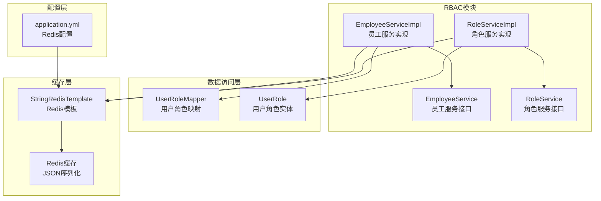
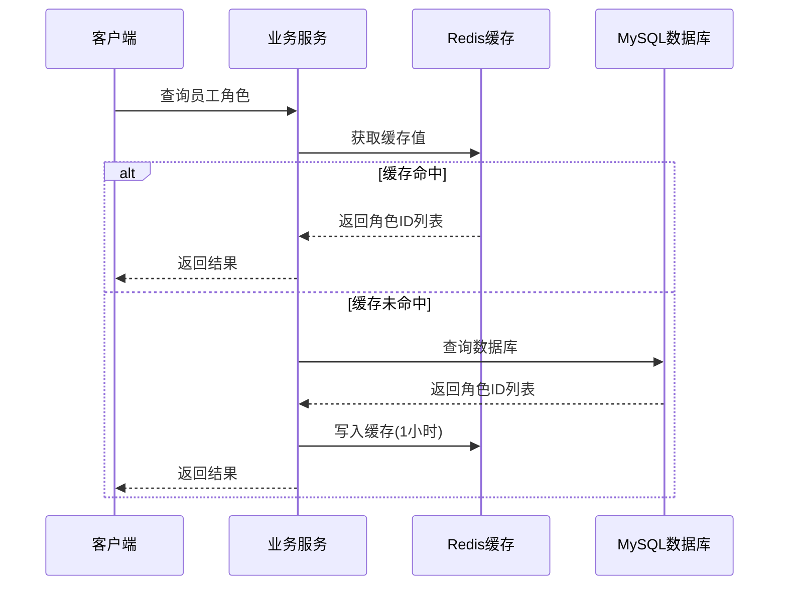
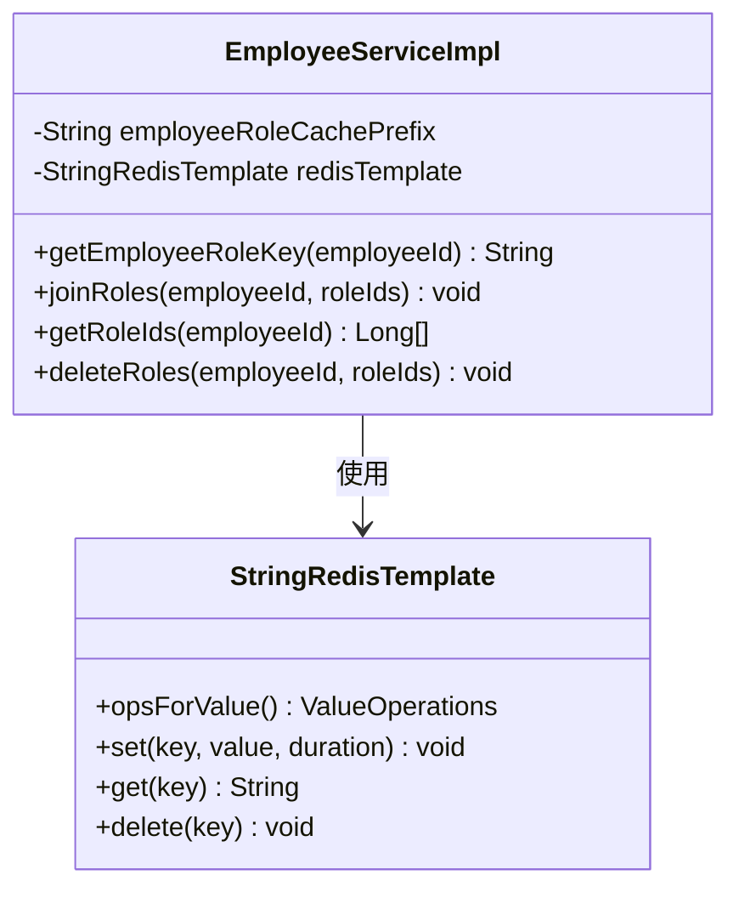
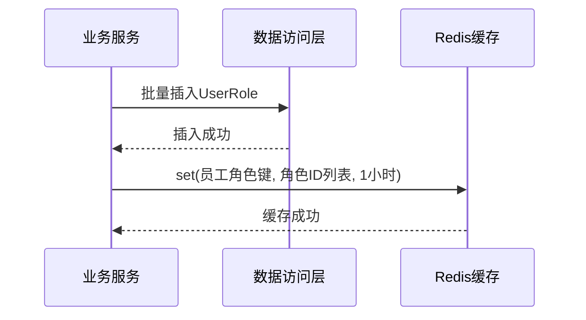
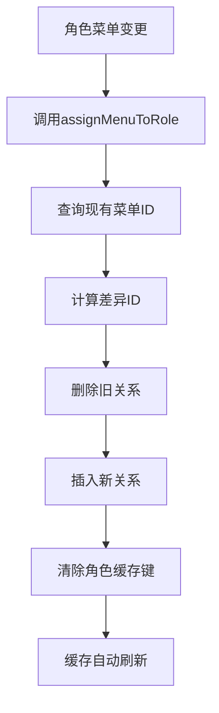
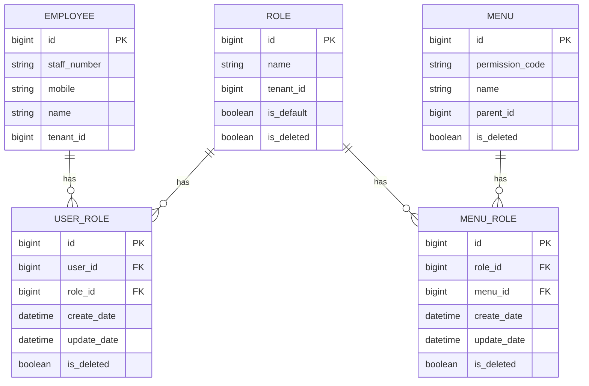
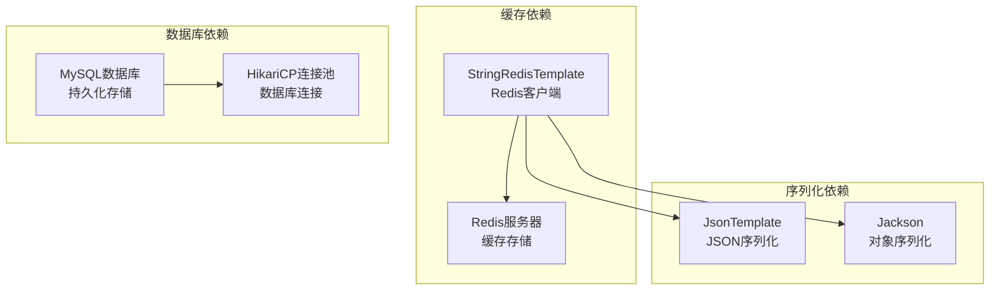
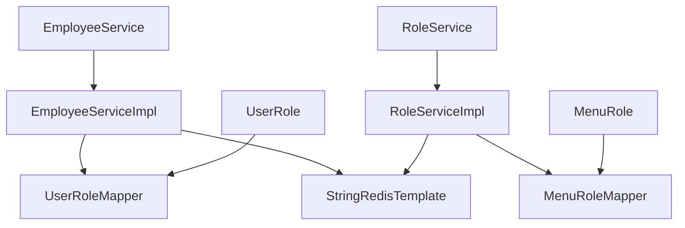
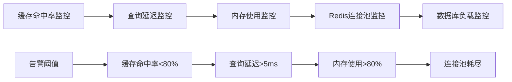

# 员工角色缓存机制

<cite>
**本文档引用的文件**
- [EmployeeServiceImpl.java](file://src/main/java/com/jiuyu/governance/business/rbac/service/impl/EmployeeServiceImpl.java)
- [RoleServiceImpl.java](file://src/main/java/com/jiuyu/governance/business/rbac/service/impl/RoleServiceImpl.java)
- [UserRoleMapper.java](file://src/main/java/com/jiuyu/governance/business/rbac/mapper/UserRoleMapper.java)
- [UserRole.java](file://src/main/java/com/jiuyu/governance/business/rbac/pojo/entity/UserRole.java)
- [EmployeeService.java](file://src/main/java/com/jiuyu/governance/business/rbac/service/EmployeeService.java)
- [RoleService.java](file://src/main/java/com/jiuyu/governance/business/rbac/service/RoleService.java)
- [application.yml](file://src/main/resources/application.yml)
</cite>

## 目录
1. [简介](#简介)
2. [项目结构](#项目结构)
3. [核心组件](#核心组件)
4. [架构概览](#架构概览)
5. [详细组件分析](#详细组件分析)
6. [依赖关系分析](#依赖关系分析)
7. [性能考虑](#性能考虑)
8. [故障排除指南](#故障排除指南)
9. [结论](#结论)

## 简介

本文档深入分析了fupan-governance-server项目中的员工角色缓存机制。该系统实现了基于Redis的两级缓存架构，用于优化员工角色查询性能，减少数据库访问压力，并确保数据一致性。

该缓存机制主要涉及两个核心方面：
- **员工角色ID缓存**：缓存员工与其角色之间的关联关系
- **角色菜单权限缓存**：缓存角色与其菜单权限之间的关联关系

通过合理的缓存策略和失效机制，系统能够在保证数据准确性的同时，显著提升查询性能。

## 项目结构

该项目采用标准的Spring Boot多模块架构，员工角色缓存机制主要分布在以下模块中：



**图表来源**
- [EmployeeServiceImpl.java:1-1511](file://src/main/java/com/jiuyu/governance/business/rbac/service/impl/EmployeeServiceImpl.java#L1-L1511)
- [RoleServiceImpl.java:1-553](file://src/main/java/com/jiuyu/governance/business/rbac/service/impl/RoleServiceImpl.java#L1-L553)
- [application.yml:84-100](file://src/main/resources/application.yml#L84-L100)

**章节来源**
- [EmployeeServiceImpl.java:1-1511](file://src/main/java/com/jiuyu/governance/business/rbac/service/impl/EmployeeServiceImpl.java#L1-L1511)
- [RoleServiceImpl.java:1-553](file://src/main/java/com/jiuyu/governance/business/rbac/service/impl/RoleServiceImpl.java#L1-L553)
- [application.yml:84-100](file://src/main/resources/application.yml#L84-L100)

## 核心组件

### 员工角色缓存组件

员工角色缓存机制的核心实现位于`EmployeeServiceImpl`类中，包含以下关键组件：

#### 缓存键管理
- **缓存前缀**：`"oauth:employee-role:"`
- **完整键格式**：`oauth:employee-role:{employeeId}`
- **缓存有效期**：1小时

#### 核心方法
1. **`joinRoles()`** - 批量添加角色时更新缓存
2. **`getRoleIds()`** - 获取员工角色ID列表（缓存优先）
3. **`deleteRoles()`** - 批量删除角色时清除缓存

### 角色权限缓存组件

角色权限缓存机制位于`RoleServiceImpl`类中，包含以下关键组件：

#### 缓存键管理
- **缓存前缀**：`"system:role:menu:"`
- **完整键格式**：`system:role:menu:{roleId}`
- **缓存有效期**：3小时

#### 核心方法
1. **`queruRoleMenuList()`** - 批量查询角色菜单权限
2. **`assignMenuToRole()`** - 分配菜单时清除缓存
3. **`clearAllCache()`** - 清空所有角色缓存

**章节来源**
- [EmployeeServiceImpl.java:94-358](file://src/main/java/com/jiuyu/governance/business/rbac/service/impl/EmployeeServiceImpl.java#L94-L358)
- [RoleServiceImpl.java:70-433](file://src/main/java/com/jiuyu/governance/business/rbac/service/impl/RoleServiceImpl.java#L70-L433)

## 架构概览

该缓存机制采用了经典的两级缓存架构，结合Redis实现高性能的数据访问：



**图表来源**
- [EmployeeServiceImpl.java:322-341](file://src/main/java/com/jiuyu/governance/business/rbac/service/impl/EmployeeServiceImpl.java#L322-L341)

### 缓存更新策略

系统实现了多种缓存更新策略以确保数据一致性：

```mermaid
flowchart TD
A[角色变更事件] --> B{操作类型}
B --> |添加角色| C[调用joinRoles()<br/>写入缓存]
B --> |删除角色| D[调用deleteRoles()<br/>清除缓存]
B --> |更新角色| E[调用assignMenuToRole()<br/>清除缓存]
C --> F[缓存有效期1小时]
D --> G[立即失效]
E --> G
F --> H[下次查询自动刷新]
G --> H
```

**图表来源**
- [EmployeeServiceImpl.java:300-358](file://src/main/java/com/jiuyu/governance/business/rbac/service/impl/EmployeeServiceImpl.java#L300-L358)
- [RoleServiceImpl.java:307-355](file://src/main/java/com/jiuyu/governance/business/rbac/service/impl/RoleServiceImpl.java#L307-L355)

## 详细组件分析

### 员工角色缓存实现

#### 缓存键设计


**图表来源**
- [EmployeeServiceImpl.java:94-105](file://src/main/java/com/jiuyu/governance/business/rbac/service/impl/EmployeeServiceImpl.java#L94-L105)
- [EmployeeServiceImpl.java:300-358](file://src/main/java/com/jiuyu/governance/business/rbac/service/impl/EmployeeServiceImpl.java#L300-L358)

#### 缓存查询流程
```mermaid
flowchart TD
A[调用getRoleIds(employeeId)] --> B[生成缓存键]
B --> C[从Redis获取值]
C --> D{缓存是否存在}
D --> |是| E[验证JSON格式]
E --> |有效| F[解析为Long列表]
E --> |无效| G[查询数据库]
D --> |否| G
G --> H[查询UserRole表]
H --> I[收集角色ID]
I --> J[写入Redis缓存]
J --> K[返回结果]
F --> K
```

**图表来源**
- [EmployeeServiceImpl.java:322-341](file://src/main/java/com/jiuyu/governance/business/rbac/service/impl/EmployeeServiceImpl.java#L322-L341)

#### 缓存更新流程


**图表来源**
- [EmployeeServiceImpl.java:300-313](file://src/main/java/com/jiuyu/governance/business/rbac/service/impl/EmployeeServiceImpl.java#L300-L313)

**章节来源**
- [EmployeeServiceImpl.java:94-358](file://src/main/java/com/jiuyu/governance/business/rbac/service/impl/EmployeeServiceImpl.java#L94-L358)

### 角色权限缓存实现

#### 批量查询优化
```mermaid
flowchart TD
A[调用queruRoleMenuList(roleIds)] --> B[生成缓存键映射]
B --> C[批量获取Redis值]
C --> D{部分命中}
D --> |是| E[分离命中和未命中ID]
D --> |否| F[全部未命中]
E --> G[处理命中数据]
F --> H[查询数据库]
G --> I[合并结果]
H --> J[查询菜单树]
J --> K[写入Redis缓存]
K --> L[返回结果]
I --> L
```

**图表来源**
- [RoleServiceImpl.java:385-433](file://src/main/java/com/jiuyu/governance/business/rbac/service/impl/RoleServiceImpl.java#L385-L433)

#### 缓存失效机制


**图表来源**
- [RoleServiceImpl.java:307-355](file://src/main/java/com/jiuyu/governance/business/rbac/service/impl/RoleServiceImpl.java#L307-L355)

**章节来源**
- [RoleServiceImpl.java:70-433](file://src/main/java/com/jiuyu/governance/business/rbac/service/impl/RoleServiceImpl.java#L70-L433)

### 数据模型关系



**图表来源**
- [UserRole.java:18-60](file://src/main/java/com/jiuyu/governance/business/rbac/pojo/entity/UserRole.java#L18-L60)
- [UserRoleMapper.java:18-36](file://src/main/java/com/jiuyu/governance/business/rbac/mapper/UserRoleMapper.java#L18-L36)

**章节来源**
- [UserRole.java:18-60](file://src/main/java/com/jiuyu/governance/business/rbac/pojo/entity/UserRole.java#L18-L60)
- [UserRoleMapper.java:18-36](file://src/main/java/com/jiuyu/governance/business/rbac/mapper/UserRoleMapper.java#L18-L36)

## 依赖关系分析

### 外部依赖

系统依赖以下关键外部组件：



**图表来源**
- [application.yml:84-100](file://src/main/resources/application.yml#L84-L100)

### 内部依赖关系



**图表来源**
- [EmployeeServiceImpl.java:20-92](file://src/main/java/com/jiuyu/governance/business/rbac/service/impl/EmployeeServiceImpl.java#L20-L92)
- [RoleServiceImpl.java:16-67](file://src/main/java/com/jiuyu/governance/business/rbac/service/impl/RoleServiceImpl.java#L16-L67)

**章节来源**
- [application.yml:84-100](file://src/main/resources/application.yml#L84-L100)
- [EmployeeServiceImpl.java:20-92](file://src/main/java/com/jiuyu/governance/business/rbac/service/impl/EmployeeServiceImpl.java#L20-L92)
- [RoleServiceImpl.java:16-67](file://src/main/java/com/jiuyu/governance/business/rbac/service/impl/RoleServiceImpl.java#L16-L67)

## 性能考虑

### 缓存性能指标

| 缓存类型 | 命中率 | 命中延迟 | 缓存大小 | 失效策略 |
|---------|--------|----------|----------|----------|
| 员工角色缓存 | 高 | <1ms | 小 | 1小时TTL |
| 角色菜单缓存 | 中高 | <2ms | 中等 | 3小时TTL |

### 优化策略

1. **批量查询优化**
   - 使用`multiGet()`进行批量缓存查询
   - 实现N+1问题的解决方案

2. **内存优化**
   - JSON序列化减少内存占用
   - 合理的缓存过期时间平衡性能和一致性

3. **网络优化**
   - Redis连接池配置
   - 批量操作减少网络往返

### 性能监控建议



## 故障排除指南

### 常见问题及解决方案

#### 缓存未命中问题
**症状**：查询员工角色时总是走数据库
**排查步骤**：
1. 检查Redis连接状态
2. 验证缓存键格式正确性
3. 确认缓存值为有效的JSON数组

#### 缓存数据不一致
**症状**：角色变更后查询结果未更新
**排查步骤**：
1. 确认`deleteRoles()`或`assignMenuToRole()`是否正确调用
2. 检查Redis缓存是否被正确清除
3. 验证缓存过期时间设置

#### 缓存性能问题
**症状**：缓存查询响应缓慢
**排查步骤**：
1. 检查Redis服务器性能
2. 分析批量查询的执行时间
3. 优化Redis连接池配置

**章节来源**
- [EmployeeServiceImpl.java:322-358](file://src/main/java/com/jiuyu/governance/business/rbac/service/impl/EmployeeServiceImpl.java#L322-L358)
- [RoleServiceImpl.java:385-433](file://src/main/java/com/jiuyu/governance/business/rbac/service/impl/RoleServiceImpl.java#L385-L433)

## 结论

该员工角色缓存机制通过合理的架构设计和实现策略，成功实现了高性能的权限查询服务。主要特点包括：

1. **双层缓存架构**：同时缓存员工角色关系和角色菜单权限，满足不同场景需求
2. **数据一致性保障**：通过精确的缓存失效策略确保数据准确性
3. **性能优化**：采用批量查询和连接池技术提升整体性能
4. **可维护性**：清晰的代码结构和完善的异常处理机制

该系统为后续的功能扩展和性能优化奠定了良好的基础，能够有效支撑大规模的企业权限管理需求。