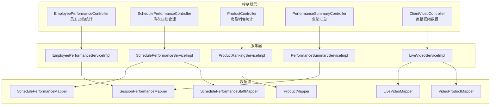
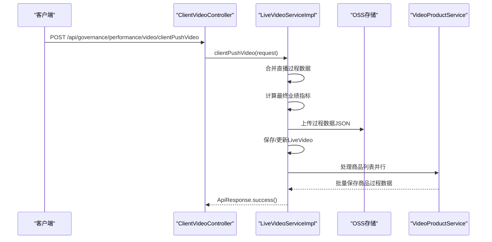
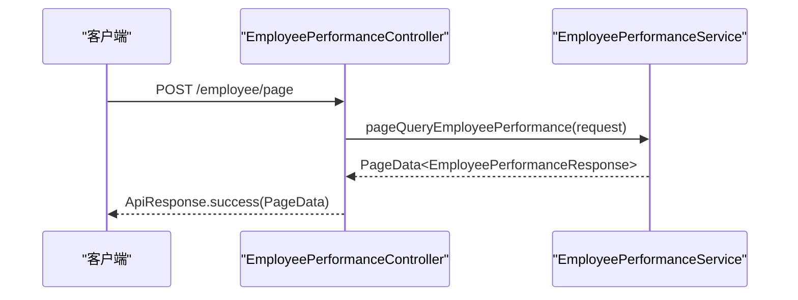
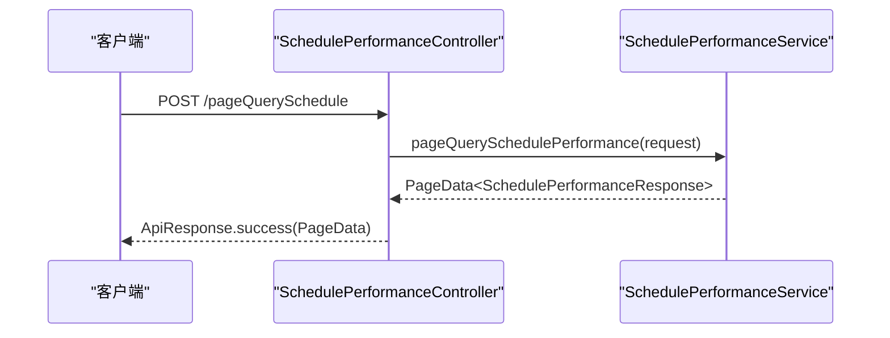
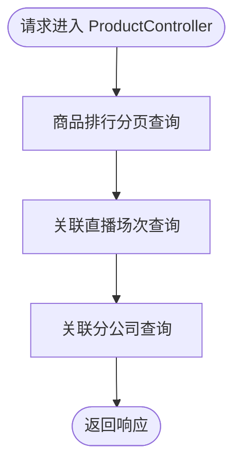
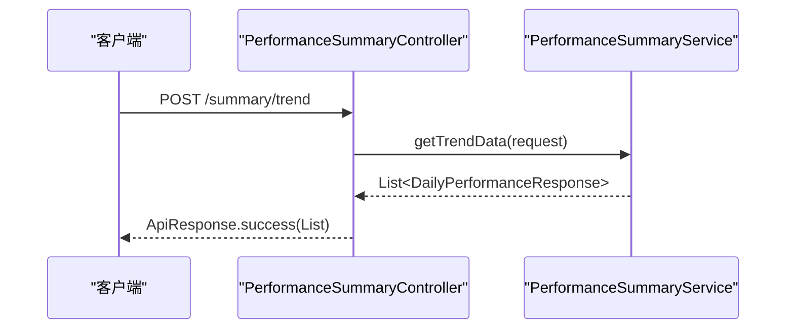
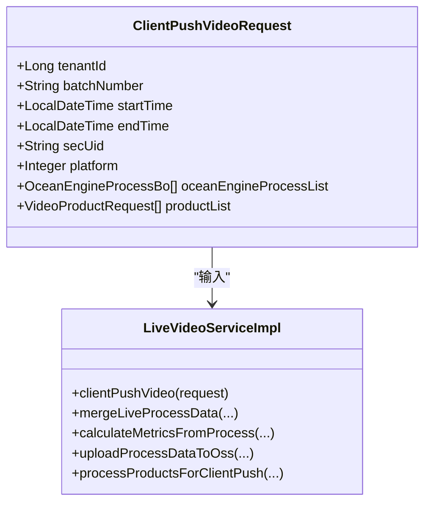
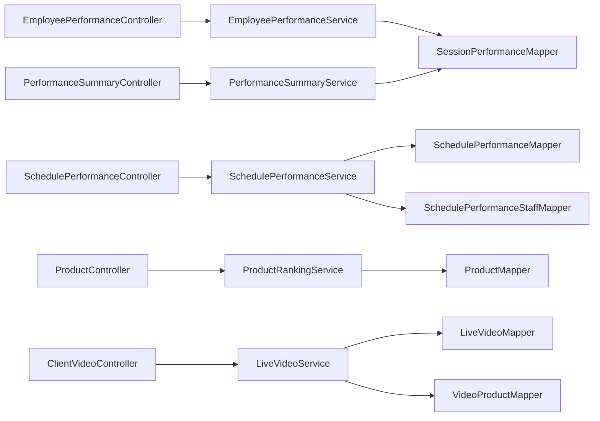

# 直播业绩管理API

<cite>
**本文档引用的文件**
- [EmployeePerformanceController.java](file://src/main/java/com/jiuyu/governance/business/performance/controller/EmployeePerformanceController.java)
- [SchedulePerformanceController.java](file://src/main/java/com/jiuyu/governance/business/performance/controller/SchedulePerformanceController.java)
- [ProductController.java](file://src/main/java/com/jiuyu/governance/business/performance/controller/ProductController.java)
- [PerformanceSummaryController.java](file://src/main/java/com/jiuyu/governance/business/performance/controller/PerformanceSummaryController.java)
- [ClientVideoController.java](file://src/main/java/com/jiuyu/governance/business/performance/controller/ClientVideoController.java)
- [LiveVideoServiceImpl.java](file://src/main/java/com/jiuyu/governance/business/performance/service/impl/LiveVideoServiceImpl.java)
- [SchedulePerformanceServiceImpl.java](file://src/main/java/com/jiuyu/governance/business/performance/service/impl/SchedulePerformanceServiceImpl.java)
- [SchedulePerformanceService.java](file://src/main/java/com/jiuyu/governance/business/performance/service/SchedulePerformanceService.java)
- [SchedulePerformanceResponse.java](file://src/main/java/com/jiuyu/governance/business/performance/pojo/response/SchedulePerformanceResponse.java)
- [SchedulePerformanceStaff.java](file://src/main/java/com/jiuyu/governance/business/performance/pojo/entity/SchedulePerformanceStaff.java)
- [SchedulePerformanceStaffMapper.java](file://src/main/java/com/jiuyu/governance/business/performance/mapper/SchedulePerformanceStaffMapper.java)
- [ClientPushVideoRequest.java](file://src/main/java/com/jiuyu/governance/business/performance/pojo/request/ClientPushVideoRequest.java)
- [DailyPerformanceResponse.java](file://src/main/java/com/jiuyu/governance/business/performance/pojo/response/DailyPerformanceResponse.java)
- [BasePerformanceMetrics.java](file://src/main/java/com/jiuyu/governance/business/performance/pojo/base/BasePerformanceMetrics.java)
- [ClientSchedulePerformanceResponse.java](file://src/main/java/com/jiuyu/governance/business/performance/pojo/response/client/ClientSchedulePerformanceResponse.java)
- [ProcessStatus.java](file://src/main/java/com/jiuyu/governance/business/performance/pojo/constants/ProcessStatus.java)
- [VideoTask.java](file://src/main/java/com/jiuyu/governance/business/performance/task/VideoTask.java)
- [LiveRoomScheduleManageServiceImpl.java](file://src/main/java/com/jiuyu/governance/business/room/service/impl/LiveRoomScheduleManageServiceImpl.java)
- [performance_tables.sql](file://src/main/resources/sql/performance_tables.sql)
- [schedule_performance_staff.md](file://docs/db/schedule_performance_staff.md)
</cite>

## 更新摘要
**所做更改**
- 新增排班业绩人员管理功能(updateSchedulePerformanceStaff)的完整文档说明
- 增强视频处理错误处理机制的技术实现细节
- 修复调度系统分页查询逻辑的优化方案
- 更新数据库表结构和实体类的对应关系

## 目录
1. [简介](#简介)
2. [项目结构](#项目结构)
3. [核心组件](#核心组件)
4. [架构概览](#架构概览)
5. [详细组件分析](#详细组件分析)
6. [依赖分析](#依赖分析)
7. [性能考虑](#性能考虑)
8. [故障排除指南](#故障排除指南)
9. [结论](#结论)
10. [附录](#附录)

## 简介
本文件为直播业绩管理模块的详细API接口文档，覆盖员工业绩统计、场次业绩管理、商品销售统计、业绩汇总以及直播视频数据处理等核心能力。文档重点说明以下统计分析接口与功能：
- 员工维度：日统计、周期统计、趋势分析、排行榜与实时数据更新
- 场次维度：排班业绩管理、按天统计、导出功能、人员管理
- 商品维度：销售排行、场次关联、公司分布
- 汇总维度：多组织层级的业绩汇总、周期统计、趋势分析
- 视频数据：客户端推流、过程数据合并、指标计算、异步任务调度

同时提供数据聚合算法、性能优化策略、缓存机制说明，以及完整的接口调用示例与数据分析结果格式。

## 项目结构
直播业绩管理模块位于 business/performance 包下，采用按功能域划分的层次化结构：
- controller：对外暴露REST接口，负责鉴权、参数校验与响应封装
- service：业务逻辑层，包含服务接口与实现类
- mapper：MyBatis映射文件，负责数据库访问
- pojo：数据模型、请求/响应对象与常量
- task：定时任务与异步处理
- utils：工具类（如数据处理、指标计算）

**图表来源**
- [EmployeePerformanceController.java:54-252](file://src/main/java/com/jiuyu/governance/business/performance/controller/EmployeePerformanceController.java#L54-L252)
- [SchedulePerformanceController.java:53-257](file://src/main/java/com/jiuyu/governance/business/performance/controller/SchedulePerformanceController.java#L53-L257)
- [ProductController.java:34-97](file://src/main/java/com/jiuyu/governance/business/performance/controller/ProductController.java#L34-L97)
- [PerformanceSummaryController.java:61-364](file://src/main/java/com/jiuyu/governance/business/performance/controller/PerformanceSummaryController.java#L61-L364)
- [ClientVideoController.java:26-68](file://src/main/java/com/jiuyu/governance/business/performance/controller/ClientVideoController.java#L26-L68)

**章节来源**
- [EmployeePerformanceController.java:54-252](file://src/main/java/com/jiuyu/governance/business/performance/controller/EmployeePerformanceController.java#L54-L252)
- [SchedulePerformanceController.java:53-257](file://src/main/java/com/jiuyu/governance/business/performance/controller/SchedulePerformanceController.java#L53-L257)
- [ProductController.java:34-97](file://src/main/java/com/jiuyu/governance/business/performance/controller/ProductController.java#L34-L97)
- [PerformanceSummaryController.java:61-364](file://src/main/java/com/jiuyu/governance/business/performance/controller/PerformanceSummaryController.java#L61-L364)
- [ClientVideoController.java:26-68](file://src/main/java/com/jiuyu/governance/business/performance/controller/ClientVideoController.java#L26-L68)

## 核心组件
- 员工业绩统计控制器：提供员工业绩分页、周期统计、汇总、趋势、按天/按班次分页与导出功能
- 场次业绩管理控制器：提供直播间业绩列表、排班业绩分页、按天统计、详情查询、保存/删除、导出功能、人员管理
- 商品销售统计控制器：提供商品排行、关联场次、关联公司查询
- 业绩汇总控制器：提供多组织层级的业绩汇总、周期统计、趋势、每日详情、销售汇总与导出
- 直播视频数据控制器：提供客户端推流、排班业绩查询
- 视频服务实现：负责过程数据合并、指标计算、OSS存储、异步任务调度与状态管理
- 排班业绩人员管理：支持动态更新排班业绩关联的人员信息

**章节来源**
- [EmployeePerformanceController.java:73-251](file://src/main/java/com/jiuyu/governance/business/performance/controller/EmployeePerformanceController.java#L73-L251)
- [SchedulePerformanceController.java:74-255](file://src/main/java/com/jiuyu/governance/business/performance/controller/SchedulePerformanceController.java#L74-L255)
- [ProductController.java:53-95](file://src/main/java/com/jiuyu/governance/business/performance/controller/ProductController.java#L53-L95)
- [PerformanceSummaryController.java:79-362](file://src/main/java/com/jiuyu/governance/business/performance/controller/PerformanceSummaryController.java#L79-L362)
- [ClientVideoController.java:40-66](file://src/main/java/com/jiuyu/governance/business/performance/controller/ClientVideoController.java#L40-L66)
- [LiveVideoServiceImpl.java:200-591](file://src/main/java/com/jiuyu/governance/business/performance/service/impl/LiveVideoServiceImpl.java#L200-L591)

## 架构概览
直播业绩管理API采用分层架构，控制器负责HTTP协议与鉴权，服务层承载业务规则，数据层通过MyBatis访问数据库。视频数据处理采用异步任务与分布式锁，确保高并发下的数据一致性与性能。

**图表来源**
- [ClientVideoController.java:40-48](file://src/main/java/com/jiuyu/governance/business/performance/controller/ClientVideoController.java#L40-L48)
- [LiveVideoServiceImpl.java:200-248](file://src/main/java/com/jiuyu/governance/business/performance/service/impl/LiveVideoServiceImpl.java#L200-L248)
- [LiveVideoServiceImpl.java:517-591](file://src/main/java/com/jiuyu/governance/business/performance/service/impl/LiveVideoServiceImpl.java#L517-L591)

## 详细组件分析

### 员工业绩统计API
- 接口：POST /api/governance/performance/employee/page
  - 功能：按人员维度统计业绩，支持组织架构筛选与员工筛选
  - 权限：my:performance:list 或 sys:employee:performance:list
  - 参数：EmployeePerformancePageRequest（包含租户ID、时间范围、组织ID、员工ID等）
  - 返回：PageData<EmployeePerformanceResponse>
- 接口：POST /api/governance/performance/employee/period-stats
  - 功能：员工六时段业绩统计（今天/昨天/本周/上周/本月/上月）
  - 返回：PerformancePeriodStatsResponse
- 接口：POST /api/governance/performance/employee/summary
  - 功能：员工总场观与销售额汇总
  - 返回：EmployeeSummaryResponse
- 接口：POST /api/governance/performance/employee/trend
  - 功能：员工日维度趋势数据（按天聚合）
  - 返回：List<DailyPerformanceResponse>
- 接口：POST /api/governance/performance/employee/daily/page
  - 功能：按天维度分页列表（每天一条记录，包含当天参与的直播间）
  - 返回：PageData<EmployeeDailyPerformanceResponse>
- 接口：POST /api/governance/performance/employee/schedule/page
  - 功能：按班次维度分页列表（schedule_performance.id为维度）
  - 返回：PageData<EmployeeSchedulePerformanceResponse>
- 接口：GET /api/governance/performance/employee/daily/export
  - 功能：按天维度导出全部员工业绩数据（Excel）
- 接口：GET /api/governance/performance/employee/schedule/export
  - 功能：按班次维度导出全部员工业绩数据（Excel）

**图表来源**
- [EmployeePerformanceController.java:73-80](file://src/main/java/com/jiuyu/governance/business/performance/controller/EmployeePerformanceController.java#L73-L80)
- [EmployeePerformanceController.java:147-153](file://src/main/java/com/jiuyu/governance/business/performance/controller/EmployeePerformanceController.java#L147-L153)

**章节来源**
- [EmployeePerformanceController.java:73-251](file://src/main/java/com/jiuyu/governance/business/performance/controller/EmployeePerformanceController.java#L73-L251)

### 场次业绩管理API
- 接口：POST /api/governance/performance/live-room/pageLiveRoomPerformance
  - 功能：按直播间维度统计业绩数据（分页）
  - 返回：PageData<LiveRoomPerformanceResponse>
- 接口：POST /api/governance/performance/live-room/pageQuerySchedule
  - 功能：按排班维度统计业绩数据（支持时间范围与主播筛选）
  - 返回：PageData<SchedulePerformanceResponse>
- 接口：POST /api/governance/performance/live-room/dailyStats
  - 功能：按天维度统计排班业绩（支持多字段排序）
  - 返回：PageData<DailyPerformanceStatsResponse>
- 接口：GET /api/governance/performance/live-room/schedulePerformance/{id}
  - 功能：查询单个班次业绩详情
  - 返回：SchedulePerformanceDetailResponse
- 接口：POST /api/governance/performance/live-room/schedulePerformanceSave
  - 功能：新增或修改班次业绩（根据scheduleId或自定义时间）
  - 返回：ApiResponse<Long>（业绩ID）
- 接口：POST /api/governance/performance/live-room/deleteSchedulePerformance
  - 功能：逻辑删除班次业绩及关联数据
  - 返回：ApiResponse<Void>
- 接口：POST /api/governance/performance/live-room/updateSchedulePerformanceStaff
  - 功能：更新排班业绩关联的人员信息
  - 返回：ApiResponse<Void>
- 接口：GET /api/governance/performance/live-room/export/schedule
  - 功能：导出排班业绩（Excel）
- 接口：GET /api/governance/performance/live-room/export/daily-stats
  - 功能：导出按天统计排班业绩（Excel）

**图表来源**
- [SchedulePerformanceController.java:92-98](file://src/main/java/com/jiuyu/governance/business/performance/controller/SchedulePerformanceController.java#L92-L98)

**章节来源**
- [SchedulePerformanceController.java:74-255](file://src/main/java/com/jiuyu/governance/business/performance/controller/SchedulePerformanceController.java#L74-L255)

### 排班业绩人员管理API
- 接口：POST /api/governance/performance/live-room/updateSchedulePerformanceStaff
  - 功能：动态更新排班业绩关联的人员信息
  - 权限：room:performance:update
  - 参数：UpdateSchedulePerformanceStaffRequest（包含人员列表、排班ID、租户ID）
  - 返回：ApiResponse<Void>
  - 实现：通过scheduleId查找对应的排班业绩记录，删除原有人员记录，批量插入新的人员信息

**章节来源**
- [SchedulePerformanceController.java:255-257](file://src/main/java/com/jiuyu/governance/business/performance/controller/SchedulePerformanceController.java#L255-L257)
- [SchedulePerformanceServiceImpl.java:915-933](file://src/main/java/com/jiuyu/governance/business/performance/service/impl/SchedulePerformanceServiceImpl.java#L915-L933)
- [SchedulePerformanceService.java:90-98](file://src/main/java/com/jiuyu/governance/business/performance/service/SchedulePerformanceService.java#L90-L98)

### 商品销售统计API
- 接口：POST /api/governance/performance/product/ranking
  - 功能：商品维度销售排行（支持时间范围、组织筛选与多字段排序）
  - 返回：PageData<ProductRankingResponse>
- 接口：POST /api/governance/performance/product/sessions
  - 功能：查询指定商品关联的直播场次列表
  - 返回：PageData<ProductSessionResponse>
- 接口：POST /api/governance/performance/product/companies
  - 功能：查询指定商品关联的分公司列表及其汇总数据
  - 返回：List<ProductCompanyResponse>

**图表来源**
- [ProductController.java:53-95](file://src/main/java/com/jiuyu/governance/business/performance/controller/ProductController.java#L53-L95)

**章节来源**
- [ProductController.java:53-95](file://src/main/java/com/jiuyu/governance/business/performance/controller/ProductController.java#L53-L95)

### 业绩汇总API
- 接口：POST /api/governance/performance/summary/sub-company/page
  - 功能：按分公司维度分页查询
  - 返回：PageData<PerformanceSummaryResponse>
- 接口：POST /api/governance/performance/summary/dept/page
  - 功能：按部门维度分页查询
  - 返回：PageData<PerformanceSummaryResponse>
- 接口：POST /api/governance/performance/summary/team/page
  - 功能：按小组维度分页查询
  - 返回：PageData<PerformanceSummaryResponse>
- 接口：POST /api/governance/performance/summary/live-room/page
  - 功能：按直播间维度分页查询
  - 返回：PageData<PerformanceSummaryResponse>
- 接口：POST /api/governance/performance/summary/org/count
  - 功能：获取组织数量统计
  - 返回：OrgCountResponse
- 接口：POST /api/governance/performance/summary/period-stats
  - 功能：获取业绩时段统计（今天/昨天/本周/上周/本月/上月）
  - 返回：PerformancePeriodStatsResponse
- 接口：POST /api/governance/performance/summary/trend
  - 功能：获取数据趋势（每日汇总，无数据日期也返回）
  - 返回：List<DailyPerformanceResponse>
- 接口：POST /api/governance/performance/summary/daily/page
  - 功能：按日期维度分页详情列表
  - 返回：PageData<DailyPerformanceResponse>
- 接口：GET /api/governance/performance/summary/daily/export
  - 功能：导出每日详情列表（Excel）
- 接口：POST /api/governance/performance/summary/sales-revenue/summary
  - 功能：按维度汇总销售额（支持top排名）
  - 返回：List<SalesRevenueSummaryResponse>
- 接口：GET /api/governance/performance/summary/sub-company/export
  - 功能：导出各分公司业绩（Excel）
- 接口：GET /api/governance/performance/summary/dept/export
  - 功能：导出各部门业绩（Excel）
- 接口：GET /api/governance/performance/summary/team/export
  - 功能：导出各小组业绩（Excel）
- 接口：GET /api/governance/performance/summary/live-room/export
  - 功能：导出各直播间业绩（Excel）

**图表来源**
- [PerformanceSummaryController.java:189-195](file://src/main/java/com/jiuyu/governance/business/performance/controller/PerformanceSummaryController.java#L189-L195)

**章节来源**
- [PerformanceSummaryController.java:79-362](file://src/main/java/com/jiuyu/governance/business/performance/controller/PerformanceSummaryController.java#L79-L362)

### 直播视频数据API
- 接口：POST /api/governance/performance/video/clientPushVideo
  - 功能：客户端推送直播过程数据与商品数据，服务端进行合并、去重、指标计算与持久化
  - 权限：ClientUser，带分布式锁防止重复提交
  - 返回：ApiResponse<Void>
- 接口：POST /api/governance/performance/video/querySchedulePerformance
  - 功能：根据主播secUid与时间范围查询对应的排班业绩记录（最多1条）
  - 返回：ClientSchedulePerformanceResponse

**图表来源**
- [ClientPushVideoRequest.java:32-88](file://src/main/java/com/jiuyu/governance/business/performance/pojo/request/ClientPushVideoRequest.java#L32-L88)
- [LiveVideoServiceImpl.java:200-248](file://src/main/java/com/jiuyu/governance/business/performance/service/impl/LiveVideoServiceImpl.java#L200-L248)

**章节来源**
- [ClientVideoController.java:40-66](file://src/main/java/com/jiuyu/governance/business/performance/controller/ClientVideoController.java#L40-L66)
- [LiveVideoServiceImpl.java:200-591](file://src/main/java/com/jiuyu/governance/business/performance/service/impl/LiveVideoServiceImpl.java#L200-L591)

## 依赖分析
- 控制器与服务层解耦：各控制器仅依赖对应的服务接口，便于单元测试与替换实现
- 数据模型统一：BasePerformanceMetrics统一管理核心指标字段，减少重复与不一致
- 异步与锁：视频推流接口使用分布式锁与线程池异步处理，提升吞吐与稳定性
- 导出功能：统一使用Excel模板下载，支持多维度导出
- 人员管理：新增排班业绩人员管理功能，通过独立的Mapper和Service实现

**图表来源**
- [EmployeePerformanceController.java:59-60](file://src/main/java/com/jiuyu/governance/business/performance/controller/EmployeePerformanceController.java#L59-L60)
- [SchedulePerformanceController.java:59-60](file://src/main/java/com/jiuyu/governance/business/performance/controller/SchedulePerformanceController.java#L59-L60)
- [ProductController.java:40-40](file://src/main/java/com/jiuyu/governance/business/performance/controller/ProductController.java#L40-L40)
- [PerformanceSummaryController.java:67-67](file://src/main/java/com/jiuyu/governance/business/performance/controller/PerformanceSummaryController.java#L67-L67)
- [ClientVideoController.java:31-32](file://src/main/java/com/jiuyu/governance/business/performance/controller/ClientVideoController.java#L31-L32)

**章节来源**
- [EmployeePerformanceController.java:59-60](file://src/main/java/com/jiuyu/governance/business/performance/controller/EmployeePerformanceController.java#L59-L60)
- [SchedulePerformanceController.java:59-60](file://src/main/java/com/jiuyu/governance/business/performance/controller/SchedulePerformanceController.java#L59-L60)
- [ProductController.java:40-40](file://src/main/java/com/jiuyu/governance/business/performance/controller/ProductController.java#L40-L40)
- [PerformanceSummaryController.java:67-67](file://src/main/java/com/jiuyu/governance/business/performance/controller/PerformanceSummaryController.java#L67-L67)
- [ClientVideoController.java:31-32](file://src/main/java/com/jiuyu/governance/business/performance/controller/ClientVideoController.java#L31-L32)

## 性能考虑
- 过程数据去重：按分钟粒度对直播与商品过程数据进行去重，保留每分钟最早与最晚记录，降低存储与计算成本
- 异步处理：商品过程数据采用线程池并行处理，批量保存，显著提升吞吐
- 缓存策略：建议在查询热点数据（如排行榜、趋势）时引入Redis缓存，设置合理过期时间
- 分页与排序：所有分页接口支持多字段排序，建议在数据库层面建立复合索引以优化排序性能
- 导出优化：导出接口通过一次性加载全量数据并批量写入Excel，避免多次IO操作
- 锁优化：排班业绩人员更新采用原子性操作，避免并发冲突

## 故障排除指南
- 视频推流失败
  - 现象：客户端推送后未生成或更新业绩数据
  - 排查：检查OSS上传是否成功、过程数据JSON序列化是否异常、是否存在分布式锁冲突
  - 参考：[LiveVideoServiceImpl.java:276-286](file://src/main/java/com/jiuyu/governance/business/performance/service/impl/LiveVideoServiceImpl.java#L276-L286)
- 数据重复或丢失
  - 现象：过程数据重复或部分缺失
  - 排查：确认去重逻辑（按分钟粒度）是否正确执行，检查时间戳精度
  - 参考：[LiveVideoServiceImpl.java:291-332](file://src/main/java/com/jiuyu/governance/business/performance/service/impl/LiveVideoServiceImpl.java#L291-L332)
- 指标计算异常
  - 现象：ROI、转化率等衍生指标为null或异常
  - 排查：确认基础指标是否为空，除法运算的分母是否为0
  - 参考：[LiveVideoServiceImpl.java:355-412](file://src/main/java/com/jiuyu/governance/business/performance/service/impl/LiveVideoServiceImpl.java#L355-L412)
- 排班业绩保存冲突
  - 现象：新增/修改时时间重叠或来源为系统导致无法修改
  - 排查：检查时间范围是否与现有记录冲突，系统来源的数据是否需要特殊流程
  - 参考：[SchedulePerformanceController.java:150-156](file://src/main/java/com/jiuyu/governance/business/performance/controller/SchedulePerformanceController.java#L150-L156)
- 视频处理错误处理
  - 现象：视频处理过程中出现异常，状态未正确更新
  - 排查：检查ProcessStatus枚举状态转换，确认失败原因是否正确记录
  - 参考：[LiveVideoServiceImpl.java:186-197](file://src/main/java/com/jiuyu/governance/business/performance/service/impl/LiveVideoServiceImpl.java#L186-L197)
  - 参考：[ProcessStatus.java:14-32](file://src/main/java/com/jiuyu/governance/business/performance/pojo/constants/ProcessStatus.java#L14-L32)
- 排班业绩人员更新失败
  - 现象：updateSchedulePerformanceStaff接口调用后人员信息未更新
  - 排查：确认scheduleId是否正确，检查数据库连接和事务配置
  - 参考：[SchedulePerformanceServiceImpl.java:915-933](file://src/main/java/com/jiuyu/governance/business/performance/service/impl/SchedulePerformanceServiceImpl.java#L915-L933)

**章节来源**
- [LiveVideoServiceImpl.java:276-412](file://src/main/java/com/jiuyu/governance/business/performance/service/impl/LiveVideoServiceImpl.java#L276-L412)
- [SchedulePerformanceController.java:150-156](file://src/main/java/com/jiuyu/governance/business/performance/controller/SchedulePerformanceController.java#L150-L156)
- [LiveVideoServiceImpl.java:186-197](file://src/main/java/com/jiuyu/governance/business/performance/service/impl/LiveVideoServiceImpl.java#L186-L197)
- [ProcessStatus.java:14-32](file://src/main/java/com/jiuyu/governance/business/performance/pojo/constants/ProcessStatus.java#L14-L32)
- [SchedulePerformanceServiceImpl.java:915-933](file://src/main/java/com/jiuyu/governance/business/performance/service/impl/SchedulePerformanceServiceImpl.java#L915-L933)

## 结论
直播业绩管理API围绕员工业绩、场次业绩、商品销售、业绩汇总与视频数据五大维度构建，具备完善的统计分析能力与导出功能。通过过程数据去重、异步处理与分布式锁等技术手段，保障了高并发场景下的稳定性与性能。新增的排班业绩人员管理功能进一步完善了系统的人力资源管理能力，增强了系统的灵活性和可维护性。建议在生产环境中结合Redis缓存与数据库索引优化，进一步提升查询效率与用户体验。

## 附录

### 数据模型与核心指标
- 基础指标基类：统一管理核心业绩指标字段，便于扩展与维护
  - 参考：[BasePerformanceMetrics.java:25-30](file://src/main/java/com/jiuyu/governance/business/performance/pojo/base/BasePerformanceMetrics.java#L25-L30)
- 每日业绩响应：以日期为维度的汇总数据
  - 参考：[DailyPerformanceResponse.java:21-30](file://src/main/java/com/jiuyu/governance/business/performance/pojo/response/DailyPerformanceResponse.java#L21-L30)
- 排班业绩人员实体：管理排班业绩与人员的关联关系
  - 参考：[SchedulePerformanceStaff.java:18-92](file://src/main/java/com/jiuyu/governance/business/performance/pojo/entity/SchedulePerformanceStaff.java#L18-L92)

### 接口调用示例（路径参考）
- 员工业绩分页查询
  - 路径：POST /api/governance/performance/employee/page
  - 请求体：EmployeePerformancePageRequest
  - 响应：ApiResponse<PageData<EmployeePerformanceResponse>>
  - 参考：[EmployeePerformanceController.java:73-80](file://src/main/java/com/jiuyu/governance/business/performance/controller/EmployeePerformanceController.java#L73-L80)
- 场次业绩详情查询
  - 路径：GET /api/governance/performance/live-room/schedulePerformance/{id}
  - 响应：ApiResponse<SchedulePerformanceDetailResponse>
  - 参考：[SchedulePerformanceController.java:130-134](file://src/main/java/com/jiuyu/governance/business/performance/controller/SchedulePerformanceController.java#L130-L134)
- 商品排行查询
  - 路径：POST /api/governance/performance/product/ranking
  - 响应：ApiResponse<PageData<ProductRankingResponse>>
  - 参考：[ProductController.java:53-59](file://src/main/java/com/jiuyu/governance/business/performance/controller/ProductController.java#L53-L59)
- 业绩汇总趋势
  - 路径：POST /api/governance/performance/summary/trend
  - 响应：ApiResponse<List<DailyPerformanceResponse>>
  - 参考：[PerformanceSummaryController.java:189-195](file://src/main/java/com/jiuyu/governance/business/performance/controller/PerformanceSummaryController.java#L189-L195)
- 客户端推流
  - 路径：POST /api/governance/performance/video/clientPushVideo
  - 请求体：ClientPushVideoRequest
  - 响应：ApiResponse<Void>
  - 参考：[ClientVideoController.java:40-48](file://src/main/java/com/jiuyu/governance/business/performance/controller/ClientVideoController.java#L40-L48)
- 排班业绩人员更新
  - 路径：POST /api/governance/performance/live-room/updateSchedulePerformanceStaff
  - 请求体：UpdateSchedulePerformanceStaffRequest
  - 响应：ApiResponse<Void>
  - 参考：[SchedulePerformanceController.java:255-257](file://src/main/java/com/jiuyu/governance/business/performance/controller/SchedulePerformanceController.java#L255-L257)

### 数据库表结构
- 排班业绩人员表（schedule_performance_staff）
  - 主要字段：id, tenant_id, schedule_performance_id, employee_id, position_id
  - 索引：唯一索引(uk_tenant_performance_employee), 普通索引(idx_tenant_performance, idx_tenant_employee)
  - 参考：[schedule_performance_staff.md:1-66](file://docs/db/schedule_performance_staff.md#L1-L66)
  - 参考：[performance_tables.sql:8-25](file://src/main/resources/sql/performance_tables.sql#L8-L25)

### 错误处理机制
- 视频处理状态管理
  - 状态枚举：PENDING(0), PROCESSING(1), SUCCESS(2), FAILED(3)
  - 失败原因记录：支持批量更新失败原因和状态
  - 参考：[ProcessStatus.java:14-32](file://src/main/java/com/jiuyu/governance/business/performance/pojo/constants/ProcessStatus.java#L14-L32)
  - 参考：[LiveVideoServiceImpl.java:186-197](file://src/main/java/com/jiuyu/governance/business/performance/service/impl/LiveVideoServiceImpl.java#L186-L197)

### 分页查询优化
- 调度系统分页查询改进
  - 使用last("limit " + limit)替代传统offset分页
  - 支持深度分页的高效查询模式
  - 参考：[LiveRoomScheduleManageServiceImpl.java:861](file://src/main/java/com/jiuyu/governance/business/room/service/impl/LiveRoomScheduleManageServiceImpl.java#L861)