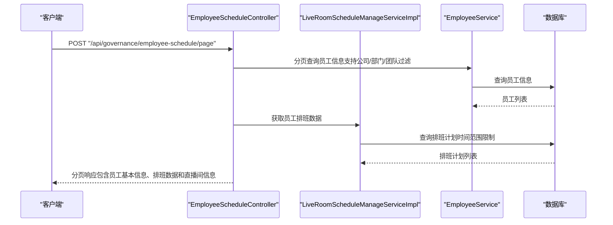
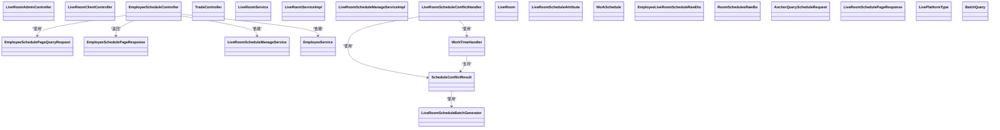

# 直播间管理API

<cite>
**本文档引用的文件**
- [LiveRoomAdminController.java](file://src/main/java/com/jiuyu/governance/business/room/controller/LiveRoomAdminController.java)
- [LiveRoomClientController.java](file://src/main/java/com/jiuyu/governance/business/room/controller/LiveRoomClientController.java)
- [EmployeeScheduleController.java](file://src/main/java/com/jiuyu/governance/business/room/controller/EmployeeScheduleController.java)
- [TradeController.java](file://src/main/java/com/jiuyu/governance/business/room/controller/TradeController.java)
- [LiveRoomService.java](file://src/main/java/com/jiuyu/governance/business/room/service/LiveRoomService.java)
- [LiveRoomServiceImpl.java](file://src/main/java/com/jiuyu/governance/business/room/service/impl/LiveRoomServiceImpl.java)
- [LiveRoomScheduleManageService.java](file://src/main/java/com/jiuyu/governance/business/room/service/LiveRoomScheduleManageService.java)
- [LiveRoomScheduleManageServiceImpl.java](file://src/main/java/com/jiuyu/governance/business/room/service/impl/LiveRoomScheduleManageServiceImpl.java)
- [LiveRoomScheduleConflictHandler.java](file://src/main/java/com/jiuyu/governance/business/room/service/handler/LiveRoomScheduleConflictHandler.java)
- [WorkTimeHandler.java](file://src/main/java/com/jiuyu/governance/business/room/handler/WorkTimeHandler.java)
- [LiveRoomAddRequest.java](file://src/main/java/com/jiuyu/governance/business/room/pojo/request/LiveRoomAddRequest.java)
- [LiveRoomUpdateRequest.java](file://src/main/java/com/jiuyu/governance/business/room/pojo/request/LiveRoomUpdateRequest.java)
- [LiveRoomQueryRequest.java](file://src/main/java/com/jiuyu/governance/business/room/pojo/request/LiveRoomQueryRequest.java)
- [LiveRoomSearchQueryRequest.java](file://src/main/java/com/jiuyu/governance/business/room/pojo/request/LiveRoomSearchQueryRequest.java)
- [LiveRoomScheduleAttributeSetRequest.java](file://src/main/java/com/jiuyu/governance/business/room/pojo/request/LiveRoomScheduleAttributeSetRequest.java)
- [LiveRoomResponse.java](file://src/main/java/com/jiuyu/governance/business/room/pojo/response/LiveRoomResponse.java)
- [LiveRoomScheduleAttributeResponse.java](file://src/main/java/com/jiuyu/governance/business/room/pojo/response/LiveRoomScheduleAttributeResponse.java)
- [LiveRoom.java](file://src/main/java/com/jiuyu/governance/business/room/pojo/entity/LiveRoom.java)
- [LiveRoomScheduleAttribute.java](file://src/main/java/com/jiuyu/governance/business/room/pojo/entity/LiveRoomScheduleAttribute.java)
- [WorkSchedule.java](file://src/main/java/com/jiuyu/governance/business/room/pojo/entity/WorkSchedule.java)
- [EmployeeLiveRoomScheduleRawDto.java](file://src/main/java/com/jiuyu/governance/business/room/pojo/bo/EmployeeLiveRoomScheduleRawDto.java)
- [RoomSchedulesRawBo.java](file://src/main/java/com/jiuyu/governance/business/room/pojo/bo/RoomSchedulesRawBo.java)
- [AnchorQueryScheduleRequest.java](file://src/main/java/com/jiuyu/governance/business/room/pojo/request/schedule/AnchorQueryScheduleRequest.java)
- [LiveRoomSchedulePageResponse.java](file://src/main/java/com/jiuyu/governance/business/room/pojo/response/schedule/LiveRoomSchedulePageResponse.java)
- [LivePlatformType.java](file://src/main/java/com/jiuyu/governance/business/room/pojo/constants/LivePlatformType.java)
- [WebContextConfigure.java](file://src/main/java/com/jiuyu/governance/plugins/webmvc/WebContextConfigure.java)
- [BatchQuery.java](file://src/main/java/com/jiuyu/framework/function/BatchQuery.java)
- [GlobalExceptionHandler.java](file://src/main/java/com/jiuyu/governance/plugins/webmvc/GlobalExceptionHandler.java)
- [EmployeeSchedulePageQueryRequest.java](file://src/main/java/com/jiuyu/governance/business/room/pojo/request/schedule/EmployeeSchedulePageQueryRequest.java)
- [EmployeeSchedulePageResponse.java](file://src/main/java/com/jiuyu/governance/business/room/pojo/response/schedule/EmployeeSchedulePageResponse.java)
- [ScheduleConflictResult.java](file://src/main/java/com/jiuyu/governance/business/room/pojo/bo/ScheduleConflictResult.java)
</cite>

## 更新摘要
**变更内容**
- 新增员工排班分页查询功能：EmployeeScheduleController新增/page端点，支持按员工姓名、职位ID、公司、部门、团队过滤
- 新增数据传输对象：EmployeeSchedulePageQueryRequest和EmployeeSchedulePageResponse，提供结构化的分页查询能力
- 新增调度冲突管理系统：ScheduleConflictResult类用于冲突检测结果封装，支持批量生成结果的冲突分离
- 新增冲突类型枚举：ConflictType枚举区分直播间冲突和人员冲突类型
- 增强工作时间处理：WorkTimeHandler增强时间格式解析能力，支持HHmm、Hmm、HH、H等多种输入格式的自动标准化处理
- LiveRoomScheduleConflictHandler增强：支持批量生成结果的冲突分离，提供更精细的冲突检测能力

## 目录
1. [简介](#简介)
2. [项目结构](#项目结构)
3. [核心组件](#核心组件)
4. [架构总览](#架构总览)
5. [详细组件分析](#详细组件分析)
6. [依赖关系分析](#依赖关系分析)
7. [性能考虑](#性能考虑)
8. [故障排查指南](#故障排查指南)
9. [结论](#结论)
10. [附录](#附录)

## 简介
本文件为直播房间管理模块的完整API接口文档，涵盖企业端与客户端两类接口，包括：
- 直播间管理：创建、更新、删除、启用/停用、分页查询、详情查询、下拉选项、排班属性设置与查询
- 员工排班管理：个人排班列表查询、排班分页查询、排班冲突检测、批量排班生成
- 交易数据：行业树结构查询
- **新增** 员工排班分页查询：支持按员工姓名、职位ID、公司、部门、团队过滤的分页查询功能
- **新增** 调度冲突管理系统：提供冲突检测结果封装、批量生成结果冲突分离、冲突类型枚举
- **新增** 工作时间处理优化：增强时间格式解析能力，支持多种输入格式的自动标准化处理
- 权限控制、数据隔离与安全机制：基于租户与组织架构的数据权限、资源锁防抖、鉴权注解等

**更新** 新增员工排班分页查询功能，通过EmployeeScheduleController的/page端点提供结构化的分页查询能力。调度冲突管理系统通过ScheduleConflictResult类提供精细化的冲突检测和分离功能。工作时间处理优化通过WorkTimeHandler增强时间格式解析能力，支持更多输入格式的自动标准化处理。

## 项目结构
直播房间管理相关代码位于 business/room 模块，按职责分为控制器、服务接口与实现、请求/响应对象、实体类、处理器等层次。

```mermaid
graph TB
subgraph "控制器层"
A1["LiveRoomAdminController<br/>企业端直播房间管理"]
A2["LiveRoomClientController<br/>客户端直播房间排班"]
A3["EmployeeScheduleController<br/>个人排班查询与分页"]
A4["TradeController<br/>行业树查询"]
end
subgraph "服务层"
S1["LiveRoomService<br/>接口"]
S2["LiveRoomServiceImpl<br/>实现"]
S3["LiveRoomScheduleManageService<br/>排班管理接口"]
S4["LiveRoomScheduleManageServiceImpl<br/>排班管理实现"]
end
subgraph "处理器层"
H1["WorkTimeHandler<br/>时间处理中心"]
H2["LiveRoomScheduleConflictHandler<br/>冲突检测处理器"]
end
subgraph "领域模型"
E1["LiveRoom<br/>直播间实体"]
E2["LiveRoomScheduleAttribute<br/>排班属性实体"]
E3["WorkSchedule<br/>工作排班实体"]
E4["EmployeeLiveRoomScheduleRawDto<br/>员工排班DTO"]
E5["RoomSchedulesRawBo<br/>批量排班DTO"]
E6["LivePlatformType<br/>直播平台类型枚举"]
E7["ScheduleConflictResult<br/>冲突检测结果"]
E8["EmployeeSchedulePageQueryRequest<br/>员工排班分页查询请求"]
E9["EmployeeSchedulePageResponse<br/>员工排班分页响应"]
end
subgraph "请求/响应"
R1["LiveRoomAddRequest"]
R2["LiveRoomUpdateRequest"]
R3["LiveRoomQueryRequest"]
R4["LiveRoomSearchQueryRequest"]
R5["LiveRoomScheduleAttributeSetRequest"]
R6["LiveRoomResponse"]
R7["LiveRoomScheduleAttributeResponse"]
R8["AnchorQueryScheduleRequest<br/>新增"]
R9["LiveRoomSchedulePageResponse<br/>新增"]
end
A1 --> S1
A2 --> S3
A3 --> S3
A4 --> S1
S1 --> S2
S3 --> S4
S4 --> H1
S4 --> H2
S2 --> E1
S2 --> E2
S4 --> E3
S4 --> E4
S4 --> E5
S4 --> E6
S4 --> E7
S4 --> E8
S4 --> E9
S4 --> R8
S4 --> R9
```

**图表来源**
- [LiveRoomAdminController.java:34-221](file://src/main/java/com/jiuyu/governance/business/room/controller/LiveRoomAdminController.java#L34-L221)
- [LiveRoomClientController.java:22-64](file://src/main/java/com/jiuyu/governance/business/room/controller/LiveRoomClientController.java#L22-L64)
- [EmployeeScheduleController.java:25-181](file://src/main/java/com/jiuyu/governance/business/room/controller/EmployeeScheduleController.java#L25-L181)
- [TradeController.java:21-40](file://src/main/java/com/jiuyu/governance/business/room/controller/TradeController.java#L21-L40)
- [LiveRoomService.java:30-148](file://src/main/java/com/jiuyu/governance/business/room/service/LiveRoomService.java#L30-L148)
- [LiveRoomServiceImpl.java:56-148](file://src/main/java/com/jiuyu/governance/business/room/service/impl/LiveRoomServiceImpl.java#L56-L148)
- [LiveRoomScheduleManageService.java:18-122](file://src/main/java/com/jiuyu/governance/business/room/service/LiveRoomScheduleManageService.java#L18-L122)
- [LiveRoomScheduleManageServiceImpl.java:64-1018](file://src/main/java/com/jiuyu/governance/business/room/service/impl/LiveRoomScheduleManageServiceImpl.java#L64-L1018)
- [WorkTimeHandler.java:14-107](file://src/main/java/com/jiuyu/governance/business/room/handler/WorkTimeHandler.java#L14-L107)
- [LiveRoomScheduleConflictHandler.java:40-357](file://src/main/java/com/jiuyu/governance/business/room/service/handler/LiveRoomScheduleConflictHandler.java#L40-L357)
- [LivePlatformType.java:12-45](file://src/main/java/com/jiuyu/governance/business/room/pojo/constants/LivePlatformType.java#L12-L45)
- [RoomSchedulesRawBo.java:16-56](file://src/main/java/com/jiuyu/governance/business/room/pojo/bo/RoomSchedulesRawBo.java#L16-L56)
- [ScheduleConflictResult.java:14-192](file://src/main/java/com/jiuyu/governance/business/room/pojo/bo/ScheduleConflictResult.java#L14-L192)
- [EmployeeSchedulePageQueryRequest.java:15-50](file://src/main/java/com/jiuyu/governance/business/room/pojo/request/schedule/EmployeeSchedulePageQueryRequest.java#L15-L50)
- [EmployeeSchedulePageResponse.java:15-80](file://src/main/java/com/jiuyu/governance/business/room/pojo/response/schedule/EmployeeSchedulePageResponse.java#L15-L80)

## 核心组件
- 控制器层：提供HTTP接口，负责参数接收、鉴权与调用服务层
- 服务层：封装业务逻辑，包含数据权限校验、第三方对接、事务控制、缓存清理等
- 处理器层：提供专门的时间处理和冲突检测功能，确保时间计算的准确性和一致性
- 请求/响应对象：定义接口输入输出结构，包含校验规则
- 实体类：映射数据库表结构，包含序列化/反序列化与类型处理器
- **新增** 数据传输对象：EmployeeSchedulePageQueryRequest和EmployeeSchedulePageResponse提供结构化的分页查询能力
- **新增** 冲突检测系统：ScheduleConflictResult类提供冲突检测结果封装和批量生成结果冲突分离功能
- **新增** 工作时间处理：WorkTimeHandler增强时间格式解析能力，支持多种输入格式的自动标准化处理

**更新** 新增员工排班分页查询功能，通过EmployeeScheduleController的/page端点提供结构化的分页查询能力。调度冲突管理系统通过ScheduleConflictResult类提供精细化的冲突检测和分离功能。工作时间处理优化通过WorkTimeHandler增强时间格式解析能力，支持更多输入格式的自动标准化处理。

**章节来源**
- [LiveRoomService.java:30-148](file://src/main/java/com/jiuyu/governance/business/room/service/LiveRoomService.java#L30-L148)
- [LiveRoomServiceImpl.java:56-148](file://src/main/java/com/jiuyu/governance/business/room/service/impl/LiveRoomServiceImpl.java#L56-L148)
- [LiveRoomScheduleManageService.java:18-122](file://src/main/java/com/jiuyu/governance/business/room/service/LiveRoomScheduleManageService.java#L18-L122)
- [LiveRoomScheduleManageServiceImpl.java:64-1018](file://src/main/java/com/jiuyu/governance/business/room/service/impl/LiveRoomScheduleManageServiceImpl.java#L64-L1018)
- [WorkTimeHandler.java:14-107](file://src/main/java/com/jiuyu/governance/business/room/handler/WorkTimeHandler.java#L14-L107)
- [LiveRoomScheduleConflictHandler.java:40-357](file://src/main/java/com/jiuyu/governance/business/room/service/handler/LiveRoomScheduleConflictHandler.java#L40-L357)
- [RoomSchedulesRawBo.java:16-56](file://src/main/java/com/jiuyu/governance/business/room/pojo/bo/RoomSchedulesRawBo.java#L16-L56)
- [EmployeeSchedulePageQueryRequest.java:15-50](file://src/main/java/com/jiuyu/governance/business/room/pojo/request/schedule/EmployeeSchedulePageQueryRequest.java#L15-L50)
- [EmployeeSchedulePageResponse.java:15-80](file://src/main/java/com/jiuyu/governance/business/room/pojo/response/schedule/EmployeeSchedulePageResponse.java#L15-L80)
- [ScheduleConflictResult.java:14-192](file://src/main/java/com/jiuyu/governance/business/room/pojo/bo/ScheduleConflictResult.java#L14-L192)

## 架构总览
系统采用分层架构，控制器层通过注解进行权限与资源锁控制，服务层结合数据权限请求接口实现租户与组织维度的数据隔离，调用第三方开放平台接口获取主播信息，最终持久化至数据库。新增的 WorkTimeHandler 提供统一的时间处理能力，LiveRoomScheduleConflictHandler 负责复杂的冲突检测逻辑。**新增** EmployeeScheduleController提供员工排班分页查询功能，**新增** ScheduleConflictResult提供冲突检测结果封装，**新增** 增强的WorkTimeHandler支持多种时间格式解析。

**图表来源**
- [EmployeeScheduleController.java:92-179](file://src/main/java/com/jiuyu/governance/business/room/controller/EmployeeScheduleController.java#L92-L179)
- [LiveRoomScheduleManageServiceImpl.java:247-290](file://src/main/java/com/jiuyu/governance/business/room/service/impl/LiveRoomScheduleManageServiceImpl.java#L247-L290)

## 详细组件分析

### 企业端直播房间管理API
- 接口路径：/api/governance/live-room
- 权限要求：通过注解标注，如 room:manage:add、room:manage:update、room:manage:delete、room:manage:list
- 资源锁：对关键写操作使用资源锁避免并发重复提交
- 数据权限：通过 DataPermissionsRequest 与 BeforePermission 注解实现按公司/部门/小组维度的数据隔离

接口清单与说明
- 新增直播间
  - 方法：POST
  - 路径：/add
  - 权限：room:manage:add
  - 参数：LiveRoomAddRequest
  - 业务要点：调用第三方开放平台获取主播信息；校验同平台下 secUid 在租户内唯一；保存并绑定管理员
  - 参考路径：[LiveRoomAdminController.addLiveRoom:54-59](file://src/main/java/com/jiuyu/governance/business/room/controller/LiveRoomAdminController.java#L54-L59)，[LiveRoomServiceImpl.addLiveRoom:84-148](file://src/main/java/com/jiuyu/governance/business/room/service/impl/LiveRoomServiceImpl.java#L84-L148)

- 修改直播间
  - 方法：POST
  - 路径：/update
  - 权限：room:manage:update 或 room:manage:add
  - 参数：LiveRoomUpdateRequest
  - 业务要点：更新基础信息；全量覆盖管理员绑定；清理相关缓存
  - 参考路径：[LiveRoomAdminController.updateLiveRoom:69-74](file://src/main/java/com/jiuyu/governance/business/room/controller/LiveRoomAdminController.java#L69-L74)，[LiveRoomServiceImpl.updateLiveRoom:159-188](file://src/main/java/com/jiuyu/governance/business/room/service/impl/LiveRoomServiceImpl.java#L159-L188)

- 删除直播间
  - 方法：POST
  - 路径：/delete
  - 权限：room:manage:delete
  - 参数：IdRequest（包含id）
  - 业务要点：逻辑删除；解除管理员关联；清理缓存
  - 参考路径：[LiveRoomAdminController.deleteLiveRoom:84-89](file://src/main/java/com/jiuyu/governance/business/room/controller/LiveRoomAdminController.java#L84-L89)，[LiveRoomServiceImpl.removeLogic:190-210](file://src/main/java/com/jiuyu/governance/business/room/service/impl/LiveRoomServiceImpl.java#L190-L210)

- 启用/停用直播间
  - 方法：POST
  - 路径：/enable、/disable
  - 权限：room:manage:update 或 room:manage:add
  - 参数：IdRequest（包含id）
  - 业务要点：切换账号状态为 NORMAL 或 DISABLED
  - 参考路径：[LiveRoomAdminController.enableLiveRoom:99-104](file://src/main/java/com/jiuyu/governance/business/room/controller/LiveRoomAdminController.java#L99-L104)，[LiveRoomAdminController.disableLiveRoom:114-119](file://src/main/java/com/jiuyu/governance/business/room/controller/LiveRoomAdminController.java#L114-L119)

- 直播间分页列表
  - 方法：POST
  - 路径：/page
  - 权限：room:manage:list
  - 参数：LiveRoomQueryRequest（继承分页与数据权限）
  - 业务要点：支持按平台、主播账号/昵称、状态、组织架构等多条件过滤；返回组装后的组织名称与管理员信息
  - 参考路径：[LiveRoomAdminController.pageQueryLiveRoom:140-164](file://src/main/java/com/jiuyu/governance/business/room/controller/LiveRoomAdminController.java#L140-L164)，[LiveRoomQueryRequest:22-221](file://src/main/java/com/jiuyu/governance/business/room/pojo/request/LiveRoomQueryRequest.java#L22-L221)

- 直播间详情
  - 方法：GET
  - 路径：/detail
  - 权限：room:manage:list
  - 参数：id（Long）
  - 业务要点：按id与租户维度查询详情
  - 参考路径：[LiveRoomAdminController.getLiveRoomDetail:174-178](file://src/main/java/com/jiuyu/governance/business/room/controller/LiveRoomAdminController.java#L174-L178)

- 直播间下拉选项
  - 方法：GET
  - 路径：/options
  - 参数：LiveRoomSearchQueryRequest
  - 业务要点：返回LabelOption列表，支持limit、平台、状态、组织过滤
  - 参考路径：[LiveRoomAdminController.options:188-191](file://src/main/java/com/jiuyu/governance/business/room/controller/LiveRoomAdminController.java#L188-L191)，[LiveRoomSearchQueryRequest:21-214](file://src/main/java/com/jiuyu/governance/business/room/pojo/request/LiveRoomSearchQueryRequest.java#L21-L214)

- 设置排班配置
  - 方法：POST
  - 路径：/schedule-attribute
  - 权限：room:manage:update 或 room:manage:add
  - 参数：LiveRoomScheduleAttributeSetRequest
  - 业务要点：设置轮班起止时间、班次/休息时长可选项、岗位可选项
  - 参考路径：[LiveRoomAdminController.setScheduleAttribute:202-206](file://src/main/java/com/jiuyu/governance/business/room/controller/LiveRoomAdminController.java#L202-L206)，[LiveRoomScheduleAttributeSetRequest:20-61](file://src/main/java/com/jiuyu/governance/business/room/pojo/request/LiveRoomScheduleAttributeSetRequest.java#L20-L61)

- 获取排班配置
  - 方法：GET
  - 路径：/schedule-attribute
  - 权限：room:manage:list
  - 参数：id（Long）
  - 返回：LiveRoomScheduleAttributeResponse
  - 参考路径：[LiveRoomAdminController.getScheduleAttribute:216-219](file://src/main/java/com/jiuyu/governance/business/room/controller/LiveRoomAdminController.java#L216-L219)，[LiveRoomScheduleAttributeResponse:18-50](file://src/main/java/com/jiuyu/governance/business/room/pojo/response/LiveRoomScheduleAttributeResponse.java#L18-L50)

请求/响应对象说明
- LiveRoomAddRequest：平台类型、主播账号、行业、公司/部门/小组、首播日期、管理员列表
  - 参考路径：[LiveRoomAddRequest:19-71](file://src/main/java/com/jiuyu/governance/business/room/pojo/request/LiveRoomAddRequest.java#L19-L71)
- LiveRoomUpdateRequest：修改id、行业、公司/部门/小组、首播日期、管理员列表（全量覆盖）
  - 参考路径：[LiveRoomUpdateRequest:20-64](file://src/main/java/com/jiuyu/governance/business/room/pojo/request/LiveRoomUpdateRequest.java#L20-L64)
- LiveRoomQueryRequest：分页、平台、账号/昵称、状态、组织id、数据权限维度
  - 参考路径：[LiveRoomQueryRequest:22-221](file://src/main/java/com/jiuyu/governance/business/room/pojo/request/LiveRoomQueryRequest.java#L22-L221)
- LiveRoomSearchQueryRequest：limit、平台、关键词、状态、组织id、数据权限维度
  - 参考路径：[LiveRoomSearchQueryRequest:21-214](file://src/main/java/com/jiuyu/governance/business/room/pojo/request/LiveRoomSearchQueryRequest.java#L21-L214)
- LiveRoomScheduleAttributeSetRequest：id、startPlan、endPlan、shiftOptions、restOptions、positionOptions
  - 参考路径：[LiveRoomScheduleAttributeSetRequest:20-61](file://src/main/java/com/jiuyu/governance/business/room/pojo/request/LiveRoomScheduleAttributeSetRequest.java#L20-L61)
- LiveRoomResponse：直播间基础信息、组织名称、管理员列表、状态、时间戳
  - 参考路径：[LiveRoomResponse:19-124](file://src/main/java/com/jiuyu/governance/business/room/pojo/response/LiveRoomResponse.java#L19-L124)
- LiveRoomScheduleAttributeResponse：轮班起止时间、班次/休息时长可选项、岗位可选项（IdName）
  - 参考路径：[LiveRoomScheduleAttributeResponse:18-50](file://src/main/java/com/jiuyu/governance/business/room/pojo/response/LiveRoomScheduleAttributeResponse.java#L18-L50)

实体类说明
- LiveRoom：直播间实体，包含平台、主播信息、组织关系、状态、租户与审计字段
  - 参考路径：[LiveRoom:22-167](file://src/main/java/com/jiuyu/governance/business/room/pojo/entity/LiveRoom.java#L22-L167)
- LiveRoomScheduleAttribute：排班属性实体，包含轮班时间、可选项列表（使用类型处理器存储）
  - 参考路径：[LiveRoomScheduleAttribute:25-154](file://src/main/java/com/jiuyu/governance/business/room/pojo/entity/LiveRoomScheduleAttribute.java#L25-L154)

**章节来源**
- [LiveRoomAdminController.java:54-219](file://src/main/java/com/jiuyu/governance/business/room/controller/LiveRoomAdminController.java#L54-L219)
- [LiveRoomServiceImpl.java:84-210](file://src/main/java/com/jiuyu/governance/business/room/service/impl/LiveRoomServiceImpl.java#L84-L210)
- [LiveRoomAddRequest.java:19-71](file://src/main/java/com/jiuyu/governance/business/room/pojo/request/LiveRoomAddRequest.java#L19-L71)
- [LiveRoomUpdateRequest.java:20-64](file://src/main/java/com/jiuyu/governance/business/room/pojo/request/LiveRoomUpdateRequest.java#L20-L64)
- [LiveRoomQueryRequest.java:22-221](file://src/main/java/com/jiuyu/governance/business/room/pojo/request/LiveRoomQueryRequest.java#L22-L221)
- [LiveRoomSearchQueryRequest.java:21-214](file://src/main/java/com/jiuyu/governance/business/room/pojo/request/LiveRoomSearchQueryRequest.java#L21-L214)
- [LiveRoomScheduleAttributeSetRequest.java:20-61](file://src/main/java/com/jiuyu/governance/business/room/pojo/request/LiveRoomScheduleAttributeSetRequest.java#L20-L61)
- [LiveRoomResponse.java:19-124](file://src/main/java/com/jiuyu/governance/business/room/pojo/response/LiveRoomResponse.java#L19-L124)
- [LiveRoomScheduleAttributeResponse.java:18-50](file://src/main/java/com/jiuyu/governance/business/room/pojo/response/LiveRoomScheduleAttributeResponse.java#L18-L50)
- [LiveRoom.java:22-167](file://src/main/java/com/jiuyu/governance/business/room/pojo/entity/LiveRoom.java#L22-L167)
- [LiveRoomScheduleAttribute.java:25-154](file://src/main/java/com/jiuyu/governance/business/room/pojo/entity/LiveRoomScheduleAttribute.java#L25-L154)

### 企业端员工排班管理API
**新增** 企业端员工排班管理API提供员工排班的分页查询功能，支持按多种维度进行过滤和查询。

- 接口路径：/api/governance/employee-schedule
- 用户类型：GovernanceUser
- 权限要求：支持员工排班查询权限

接口清单与说明
- 个人排班列表
  - 方法：POST
  - 路径：/list
  - 参数：EmployeeScheduleQueryRequest
  - 返回：LiveRoomSchedulePageResponse 列表
  - 参考路径：[EmployeeScheduleController.planList:67-76](file://src/main/java/com/jiuyu/governance/business/room/controller/EmployeeScheduleController.java#L67-L76)

- **新增** 员工排班分页查询
  - 方法：POST
  - 路径：/page
  - 权限：employee:schedule:manage:list
  - 参数：EmployeeSchedulePageQueryRequest（支持员工姓名、职位ID、公司ID、部门ID、团队ID、分页参数）
  - 返回：PageData<EmployeeSchedulePageResponse>
  - 业务要点：支持按员工姓名、职位ID、公司、部门、团队过滤；返回员工基本信息、当天和明天排班、直播间信息、工作周月状态
  - 参考路径：[EmployeeScheduleController.list:92-179](file://src/main/java/com/jiuyu/governance/business/room/controller/EmployeeScheduleController.java#L92-L179)

- **新增** 员工排班分页查询请求模型
  - 字段：employeeName（员工名称）、positionId（职位ID）、deptId（部门ID）、teamId（团队ID）、companyId（公司ID）、分页参数
  - 参考路径：[EmployeeSchedulePageQueryRequest:15-50](file://src/main/java/com/jiuyu/governance/business/room/pojo/request/schedule/EmployeeSchedulePageQueryRequest.java#L15-L50)

- **新增** 员工排班分页查询响应模型
  - 字段：id（ID）、name（员工名称）、userAvatar（头像）、positionId（所属岗位ID）、positionName（岗位名称）、roomInfos（员工直播间信息）、thatDaySchedules（当天排班信息列表）、tomorrowSchedules（明天排班信息列表）、thisWeekWork（本周是否工作）、nextWeekWork（下周是否工作）、thisMonthWork（本月是否工作）
  - 参考路径：[EmployeeSchedulePageResponse:15-80](file://src/main/java/com/jiuyu/governance/business/room/pojo/response/schedule/EmployeeSchedulePageResponse.java#L15-L80)

**章节来源**
- [EmployeeScheduleController.java:25-181](file://src/main/java/com/jiuyu/governance/business/room/controller/EmployeeScheduleController.java#L25-L181)
- [EmployeeSchedulePageQueryRequest.java:15-50](file://src/main/java/com/jiuyu/governance/business/room/pojo/request/schedule/EmployeeSchedulePageQueryRequest.java#L15-L50)
- [EmployeeSchedulePageResponse.java:15-80](file://src/main/java/com/jiuyu/governance/business/room/pojo/response/schedule/EmployeeSchedulePageResponse.java#L15-L80)

### 客户端直播房间排班API
- 接口路径：/api/governance/client/live-room
- 用户类型：ClientUser
- 功能：根据日期查询直播房间排班计划

接口清单与说明
- 获取直播房间排班计划
  - 方法：GET
  - 路径：/schedules
  - 参数：day（LocalDate，yyyy-MM-dd或yyyy/MM/dd）
  - 返回：ClientLiveRoomSchedulesResponse 列表
  - 参考路径：[LiveRoomClientController.getLiveRoomSchedules:40-43](file://src/main/java/com/jiuyu/governance/business/room/controller/LiveRoomClientController.java#L40-L43)

- **新增** 获取主播排班计划
  - 方法：POST
  - 路径：/plan
  - 参数：AnchorQueryScheduleRequest（直播平台类型、主播ID、开始时间、结束时间）
  - 返回：LiveRoomSchedulePageResponse 列表
  - 业务要点：支持按主播ID和时间范围查询排班计划；时间范围不超过3天；严格验证平台类型
  - 参考路径：[LiveRoomClientController.query:56-63](file://src/main/java/com/jiuyu/governance/business/room/controller/LiveRoomClientController.java#L56-L63)，[AnchorQueryScheduleRequest:18-44](file://src/main/java/com/jiuyu/governance/business/room/pojo/request/schedule/AnchorQueryScheduleRequest.java#L18-L44)

**章节来源**
- [LiveRoomClientController.java:22-64](file://src/main/java/com/jiuyu/governance/business/room/controller/LiveRoomClientController.java#L22-L64)
- [AnchorQueryScheduleRequest.java:16-44](file://src/main/java/com/jiuyu/governance/business/room/pojo/request/schedule/AnchorQueryScheduleRequest.java#L16-L44)

### 交易数据API
- 接口路径：/api/governance/trade
- 用户类型：GovernanceUser
- 功能：获取行业树结构

接口清单与说明
- 获取行业树
  - 方法：GET
  - 路径：/tree
  - 返回：TradeSimpleTreeResponse 列表
  - 实现：调用 openfeign.replay.TradeService.getTradeSimpleTree(1)
  - 参考路径：[TradeController.getTradeSimpleTree:36-39](file://src/main/java/com/jiuyu/governance/business/room/controller/TradeController.java#L36-L39)

**章节来源**
- [TradeController.java:21-40](file://src/main/java/com/jiuyu/governance/business/room/controller/TradeController.java#L21-L40)

### 排班管理服务API
**新增** 排班管理服务提供完整的排班生命周期管理功能，包括新增、查询、修改、删除等操作。

- 接口路径：/api/governance/live-room/schedule
- 用户类型：GovernanceUser
- 权限要求：room:schedule:manage:* 系列权限

接口清单与说明
- 新增排班
  - 方法：POST
  - 路径：/add
  - 权限：room:schedule:manage:add
  - 参数：LiveRoomScheduleAddRequest
  - 业务要点：支持批量生成排班；执行冲突检测；批量插入数据库
  - 参考路径：[LiveRoomScheduleManageServiceImpl.addSchedule:91-138](file://src/main/java/com/jiuyu/governance/business/room/service/impl/LiveRoomScheduleManageServiceImpl.java#L91-L138)

- 查询排班列表
  - 方法：POST
  - 路径：/list-range
  - 权限：room:schedule:manage:list
  - 参数：LiveRoomScheduleQueryRequest
  - 返回：LiveRoomScheduleResponse 列表
  - 业务要点：支持指定时间范围查询；按工作日和开始时间排序；组装人员信息
  - 参考路径：[LiveRoomScheduleManageServiceImpl.listRange:141-195](file://src/main/java/com/jiuyu/governance/business/room/service/impl/LiveRoomScheduleManageServiceImpl.java#L141-L195)

- 分页查询排班
  - 方法：POST
  - 路径：/page
  - 权限：room:schedule:manage:list
  - 参数：LiveRoomSchedulePageRequest
  - 返回：PageData<LiveRoomSchedulePageResponse>
  - 业务要点：支持分页查询；按工作日和开始时间降序排序；填充人员信息
  - 参考路径：[LiveRoomScheduleManageServiceImpl.page:306-337](file://src/main/java/com/jiuyu/governance/business/room/service/impl/LiveRoomScheduleManageServiceImpl.java#L306-L337)

- **新增** 锚点排班查询
  - 方法：POST
  - 路径：/anchor-plan
  - 权限：room:schedule:manage:list
  - 参数：AnchorQueryScheduleRequest
  - 返回：LiveRoomSchedulePageResponse 列表
  - 业务要点：支持按主播ID和时间范围查询排班计划；时间范围不超过3天；严格验证平台类型
  - 参考路径：[LiveRoomScheduleManageServiceImpl.queryAnchorRoomSchedule:247-290](file://src/main/java/com/jiuyu/governance/business/room/service/impl/LiveRoomScheduleManageServiceImpl.java#L247-L290)

- **新增** 批量获取直播间排班
  - 方法：POST
  - 路径：/batch-schedules
  - 权限：room:schedule:manage:list
  - 参数：BatchScheduleRequest（租户ID、直播间ID集合、时间范围）
  - 返回：RoomSchedulesRawBo 列表
  - 业务要点：支持批量查询指定时间范围内的排班信息；使用BatchQuery优化大数据量查询；返回标准化的排班数据结构
  - 参考路径：[LiveRoomScheduleManageServiceImpl.getLiveRoomSchedules:986-1016](file://src/main/java/com/jiuyu/governance/business/room/service/impl/LiveRoomScheduleManageServiceImpl.java#L986-L1016)

- 添加排班人员
  - 方法：POST
  - 路径：/add-employee
  - 权限：room:schedule:manage:add
  - 参数：ScheduleAddEmployeeRequest
  - 业务要点：检查排班未开始；验证人员是否已存在；执行人员冲突检测
  - 参考路径：[LiveRoomScheduleManageServiceImpl.addEmployee:357-401](file://src/main/java/com/jiuyu/governance/business/room/service/impl/LiveRoomScheduleManageServiceImpl.java#L357-L401)

- 移除排班人员
  - 方法：POST
  - 路径：/remove-employee
  - 权限：room:schedule:manage:remove
  - 参数：ScheduleRemoveEmployeeRequest
  - 业务要点：逻辑删除人员排班关联；若无其他人员则自动删除排班
  - 参考路径：[LiveRoomScheduleManageServiceImpl.removeEmployee:403-455](file://src/main/java/com/jiuyu/governance/business/room/service/impl/LiveRoomScheduleManageServiceImpl.java#L403-L455)

- 修改排班
  - 方法：POST
  - 路径：/update
  - 权限：room:schedule:manage:update
  - 参数：ScheduleUpdateRequest
  - 业务要点：校验排班未开始；更新时间信息；重新执行人员冲突检测
  - 参考路径：[LiveRoomScheduleManageServiceImpl.updateSchedule:457-505](file://src/main/java/com/jiuyu/governance/business/room/service/impl/LiveRoomScheduleManageServiceImpl.java#L457-L505)

- 删除排班
  - 方法：POST
  - 路径：/delete
  - 权限：room:schedule:manage:delete
  - 参数：IdRequest（包含scheduleId）
  - 业务要点：校验排班未开始；逻辑删除排班及其关联人员
  - 参考路径：[LiveRoomScheduleManageServiceImpl.deleteSchedule:507-532](file://src/main/java/com/jiuyu/governance/business/room/service/impl/LiveRoomScheduleManageServiceImpl.java#L507-L532)

**章节来源**
- [LiveRoomScheduleManageService.java:18-122](file://src/main/java/com/jiuyu/governance/business/room/service/LiveRoomScheduleManageService.java#L18-L122)
- [LiveRoomScheduleManageServiceImpl.java:64-1018](file://src/main/java/com/jiuyu/governance/business/room/service/impl/LiveRoomScheduleManageServiceImpl.java#L64-L1018)

### **新增** ScheduleConflictResult 冲突检测结果封装
**新增** ScheduleConflictResult类提供冲突检测结果的结构化封装，支持批量生成结果的冲突分离功能。

- 核心字段
  - successScheduleIds：成功的排班ID列表（无冲突）
  - successEmployeeIds：成功的人员排班ID列表（无冲突）
  - conflictSchedules：冲突的排班信息列表
  - conflictSchedules：冲突的排班信息列表

- 核心方法
  - hasConflict()：判断是否存在冲突
  - filterSuccessData(generateResult)：从批量生成结果中过滤出成功的数据

- 冲突信息结构
  - conflictType：冲突类型（ROOM-直播间冲突, EMPLOYEE-人员冲突）
  - scheduleId：冲突的排班ID
  - employeeId：冲突的员工ID（仅人员冲突时有值）
  - workDay：冲突日期
  - timeRange：冲突时间段
  - conflictReason：冲突原因描述
  - liveRoomId：冲突的直播间ID

- 冲突类型枚举
  - ROOM("直播间冲突")：同一直播间在同一时间段内有多个排班
  - EMPLOYEE("人员冲突")：同一员工在同一时间段内有多个排班

**章节来源**
- [ScheduleConflictResult.java:14-192](file://src/main/java/com/jiuyu/governance/business/room/pojo/bo/ScheduleConflictResult.java#L14-L192)

### **新增** WorkTimeHandler 时间处理类增强
**更新** WorkTimeHandler增强时间格式解析能力，支持更多输入格式的自动标准化处理。

- 增强的时间解析功能
  - 支持的时间格式：HHmm（如1230）、Hmm（如930）、HH（如20）、H（如9）
  - 自动标准化处理：将输入格式统一转换为LocalTime对象
  - 格式化功能：支持LocalTime对象格式化为整数格式

- 核心方法
  - parseTime(Integer time)：解析时间格式（支持多种输入格式）
  - formatTime(LocalTime time)：格式化时间为整数格式
  - isOverlap(Range<LocalDateTime> r1, Range<LocalDateTime> r2)：判断时间段重叠（首尾相连不算冲突）
  - isOverlapWithBoundary(Range<LocalDateTime> r1, Range<LocalDateTime> r2)：判断时间段重叠（包含边界相接）

- 冲突检测算法
  - 使用 max(start1, start2) < min(end1, end2) 的数学公式
  - 支持跨天时间段的正确处理
  - 提供两种检测模式以满足不同业务需求

**章节来源**
- [WorkTimeHandler.java:14-107](file://src/main/java/com/jiuyu/governance/business/room/handler/WorkTimeHandler.java#L14-L107)

### LiveRoomScheduleConflictHandler 冲突检测处理器增强
**更新** 冲突检测处理器现在使用增强的WorkTimeHandler进行时间处理，提供更精确的冲突检测能力和冲突分离功能。

- 核心功能
  - 直播间维度冲突检测：确保同一直播间在同一时间段内只有一个排班
  - 人员维度冲突检测：确保同一员工在同一时间段内只有一个排班
  - 内部冲突检测：检测新提交排班之间的相互冲突
  - 批量查询优化：使用 BatchQuery 防止一次性查询过多数据
  - **新增** 冲突分离：支持批量生成结果的冲突分离，提供精细化的冲突检测

- 检测流程
  1. 提取待校验的直播间ID、员工ID和时间范围
  2. 批量查询数据库中的冲突记录
  3. 执行双重校验：直播间冲突 + 人员冲突
  4. 同时校验新提交排班之间的内部冲突
  5. **新增** 收集所有冲突信息并返回，支持冲突分离和成功数据过滤

- **新增** 冲突分离机制
  - 支持按冲突类型（直播间冲突、人员冲突）进行分离
  - 提供成功的排班和员工ID列表
  - 支持从批量生成结果中过滤出成功的数据

**章节来源**
- [LiveRoomScheduleConflictHandler.java:40-357](file://src/main/java/com/jiuyu/governance/business/room/service/handler/LiveRoomScheduleConflictHandler.java#L40-L357)

### **新增** AnchorQueryScheduleRequest 锚点查询模型
**新增** AnchorQueryScheduleRequest 作为专门的锚点排班查询模型，提供严格的参数验证和类型安全。

- 核心字段
  - livePlatformType：直播平台类型（0-抖音，1-快手，2-视频号），必填
  - secUid：主播ID，必填且非空
  - startTime：排班开始时间，必填
  - endTime：排班结束时间，可选

- 验证规则
  - 使用 @NotNull 和 @NotBlank 注解确保参数完整性
  - startTime 为空时直接返回空列表
  - 时间范围不超过3天的业务限制

- 业务逻辑
  - 通过 LivePlatformType.getByValue() 验证平台类型有效性
  - 根据 secUid 和平台类型查询对应的直播间
  - 支持单日或多日时间范围查询
  - 自动处理跨天时间段的边界情况

**章节来源**
- [AnchorQueryScheduleRequest.java:16-44](file://src/main/java/com/jiuyu/governance/business/room/pojo/request/schedule/AnchorQueryScheduleRequest.java#L16-L44)

### **新增** LivePlatformType 直播平台类型枚举
**新增** LivePlatformType 作为统一的直播平台类型管理枚举，提供类型安全的平台标识。

- 平台类型定义
  - DOU_YIN(0, "抖音")
  - KUAI_SHOU(1, "快手")  
  - SHI_PING_HAO(2, "视频号")

- 核心方法
  - getByValue(Integer value)：根据数值获取对应枚举
  - getvalue()：获取平台类型的数值标识
  - getDesc()：获取平台类型的描述信息

- 应用场景
  - 锚点排班查询中的平台类型验证
  - 直播间信息查询中的平台过滤
  - 排班计划生成中的平台适配

**章节来源**
- [LivePlatformType.java:12-45](file://src/main/java/com/jiuyu/governance/business/room/pojo/constants/LivePlatformType.java#L12-L45)

### **新增** 批量查询优化机制
**更新** 通过BatchQuery类实现的大数据量查询优化，显著提升系统性能。

- BatchQuery 类特性
  - 分批查询：支持分批次查询大量数据，避免内存溢出
  - 自动分页：根据索引字段自动分页，确保查询效率
  - 最大限制：默认最多查询10万条记录，防止系统过载
  - 灵活配置：支持自定义每批查询数量

- 应用场景
  - 批量获取直播间排班信息
  - 冲突检测中的历史数据查询
  - 个人排班列表的批量查询
  - 员工关联排班的批量获取

- 性能优势
  - 减少单次查询数据量，降低数据库压力
  - 避免长时间阻塞，提升响应速度
  - 支持大数据量的稳定查询
  - 自动处理查询边界和索引优化

**章节来源**
- [BatchQuery.java](file://src/main/java/com/jiuyu/framework/function/BatchQuery.java)
- [LiveRoomScheduleManageServiceImpl.java:175-187](file://src/main/java/com/jiuyu/governance/business/room/service/impl/LiveRoomScheduleManageServiceImpl.java#L175-L187)
- [LiveRoomScheduleManageServiceImpl.java:220-222](file://src/main/java/com/jiuyu/governance/business/room/service/impl/LiveRoomScheduleManageServiceImpl.java#L220-L222)
- [LiveRoomScheduleManageServiceImpl.java:687-695](file://src/main/java/com/jiuyu/governance/business/room/service/impl/LiveRoomScheduleManageServiceImpl.java#L687-L695)
- [LiveRoomScheduleManageServiceImpl.java:880-886](file://src/main/java/com/jiuyu/governance/business/room/service/impl/LiveRoomScheduleManageServiceImpl.java#L880-L886)
- [LiveRoomScheduleManageServiceImpl.java:955-963](file://src/main/java/com/jiuyu/governance/business/room/service/impl/LiveRoomScheduleManageServiceImpl.java#L955-L963)
- [LiveRoomScheduleManageServiceImpl.java:991-1002](file://src/main/java/com/jiuyu/governance/business/room/service/impl/LiveRoomScheduleManageServiceImpl.java#L991-L1002)

### **新增** 改进的日期验证逻辑
**更新** 新增的日期验证机制确保时间范围的准确性和安全性。

- 验证规则
  - 个人排班查询：时间范围不超过31天
  - 主播排班查询：时间范围不超过3天
  - 批量查询：支持更大的时间范围但受BatchQuery限制
  - **新增** 员工排班分页查询：支持按公司/部门/团队维度过滤

- 错误处理
  - 超时范围时抛出BizErrorCode.PARAM_INVALID异常
  - 详细的错误信息提示具体的时间范围限制
  - 日志记录超时范围的详细信息

- 业务保护
  - 防止恶意查询造成系统过载
  - 确保查询结果的合理性和可用性
  - 提升系统的稳定性和可靠性

**章节来源**
- [LiveRoomScheduleManageServiceImpl.java:170-173](file://src/main/java/com/jiuyu/governance/business/room/service/impl/LiveRoomScheduleManageServiceImpl.java#L170-L173)
- [LiveRoomScheduleManageServiceImpl.java:211-218](file://src/main/java/com/jiuyu/governance/business/room/service/impl/LiveRoomScheduleManageServiceImpl.java#L211-L218)
- [LiveRoomScheduleManageServiceImpl.java:266-268](file://src/main/java/com/jiuyu/governance/business/room/service/impl/LiveRoomScheduleManageServiceImpl.java#L266-L268)

### **新增** 增强的错误处理机制
**更新** 通过GlobalExceptionHandler和BizErrorCode实现的统一错误处理。

- 错误分类
  - 参数验证错误：ConstraintViolationException
  - 非法参数错误：IllegalArgumentException
  - 请求参数缺失：MissingServletRequestParameterException
  - 业务逻辑错误：BizErrorCode.PARAM_INVALID

- 处理策略
  - 统一的错误响应格式
  - 详细的错误信息描述
  - 完善的日志记录机制
  - 业务友好的错误提示

- 性能保障
  - 防止系统异常导致的服务中断
  - 提供稳定的错误恢复机制
  - 支持批量查询的异常处理
  - 优化大数据量处理的错误响应

**章节来源**
- [GlobalExceptionHandler.java:263-291](file://src/main/java/com/jiuyu/governance/plugins/webmvc/GlobalExceptionHandler.java#L263-L291)
- [LiveRoomScheduleManageServiceImpl.java:171](file://src/main/java/com/jiuyu/governance/business/room/service/impl/LiveRoomScheduleManageServiceImpl.java#L171)
- [LiveRoomScheduleManageServiceImpl.java:216](file://src/main/java/com/jiuyu/governance/business/room/service/impl/LiveRoomScheduleManageServiceImpl.java#L216)
- [LiveRoomScheduleManageServiceImpl.java:267](file://src/main/java/com/jiuyu/governance/business/room/service/impl/LiveRoomScheduleManageServiceImpl.java#L267)

### **新增** 时间格式灵活性改进
**更新** WebContextConfigure 中的 FlexibleLocalTimeDeserializer 提供灵活的时间格式解析能力。

- 支持的格式
  - HH:mm（小时:分钟）
  - HH:mm:ss（小时:分钟:秒）
  - 自动识别和解析

- 解析逻辑
  - 优先尝试 HH:mm:ss 格式解析
  - 失败时回退到 HH:mm 格式解析
  - 解析失败时抛出详细的错误信息

- 应用场景
  - 排班开始/结束时间的灵活输入
  - 用户友好的时间格式支持
  - 向后兼容多种时间输入格式

**章节来源**
- [WebContextConfigure.java:103-128](file://src/main/java/com/jiuyu/governance/plugins/webmvc/WebContextConfigure.java#L103-L128)

## 依赖关系分析
- 控制器依赖服务接口，服务实现依赖实体与Mapper、第三方开放平台服务、组织/岗位服务、权限处理器
- 新增 WorkTimeHandler 作为时间处理中心，被冲突检测处理器和实体类广泛使用
- 冲突检测处理器依赖 WorkTimeHandler 进行精确的时间范围比较
- 请求/响应对象作为接口契约，约束输入输出结构
- 实体类映射数据库表，使用类型处理器存储列表型配置
- **新增** EmployeeScheduleController提供员工排班分页查询功能
- **新增** ScheduleConflictResult提供冲突检测结果封装和批量生成结果冲突分离
- **新增** EmployeeSchedulePageQueryRequest和EmployeeSchedulePageResponse提供结构化的分页查询能力
- **新增** 增强的WorkTimeHandler支持多种时间格式解析
- **新增** BatchQuery 作为批量查询的基础设施类
- **新增** AnchorQueryScheduleRequest 作为专门的查询模型，依赖 LivePlatformType 进行平台类型验证

**图表来源**
- [LiveRoomAdminController.java:34-221](file://src/main/java/com/jiuyu/governance/business/room/controller/LiveRoomAdminController.java#L34-L221)
- [LiveRoomClientController.java:22-64](file://src/main/java/com/jiuyu/governance/business/room/controller/LiveRoomClientController.java#L22-L64)
- [EmployeeScheduleController.java:25-181](file://src/main/java/com/jiuyu/governance/business/room/controller/EmployeeScheduleController.java#L25-L181)
- [TradeController.java:21-40](file://src/main/java/com/jiuyu/governance/business/room/controller/TradeController.java#L21-L40)
- [LiveRoomService.java:30-148](file://src/main/java/com/jiuyu/governance/business/room/service/LiveRoomService.java#L30-L148)
- [LiveRoomServiceImpl.java:56-148](file://src/main/java/com/jiuyu/governance/business/room/service/impl/LiveRoomServiceImpl.java#L56-L148)
- [LiveRoomScheduleManageService.java:18-122](file://src/main/java/com/jiuyu/governance/business/room/service/LiveRoomScheduleManageService.java#L18-L122)
- [LiveRoomScheduleManageServiceImpl.java:64-1018](file://src/main/java/com/jiuyu/governance/business/room/service/impl/LiveRoomScheduleManageServiceImpl.java#L64-L1018)
- [WorkTimeHandler.java:14-107](file://src/main/java/com/jiuyu/governance/business/room/handler/WorkTimeHandler.java#L14-L107)
- [LiveRoomScheduleConflictHandler.java:40-357](file://src/main/java/com/jiuyu/governance/business/room/service/handler/LiveRoomScheduleConflictHandler.java#L40-L357)
- [LivePlatformType.java:12-45](file://src/main/java/com/jiuyu/governance/business/room/pojo/constants/LivePlatformType.java#L12-L45)
- [RoomSchedulesRawBo.java:16-56](file://src/main/java/com/jiuyu/governance/business/room/pojo/bo/RoomSchedulesRawBo.java#L16-L56)
- [AnchorQueryScheduleRequest.java:16-44](file://src/main/java/com/jiuyu/governance/business/room/pojo/request/schedule/AnchorQueryScheduleRequest.java#L16-L44)
- [BatchQuery.java](file://src/main/java/com/jiuyu/framework/function/BatchQuery.java)
- [EmployeeSchedulePageQueryRequest.java:15-50](file://src/main/java/com/jiuyu/governance/business/room/pojo/request/schedule/EmployeeSchedulePageQueryRequest.java#L15-L50)
- [EmployeeSchedulePageResponse.java:15-80](file://src/main/java/com/jiuyu/governance/business/room/pojo/response/schedule/EmployeeSchedulePageResponse.java#L15-L80)
- [ScheduleConflictResult.java:14-192](file://src/main/java/com/jiuyu/governance/business/room/pojo/bo/ScheduleConflictResult.java#L14-L192)

## 性能考虑
- 资源锁：对新增/修改/删除/启停等关键写操作加资源锁，避免重复提交导致的性能与一致性问题
- 缓存清理：在管理员绑定/变更后主动清理租户与组织缓存，保证数据一致性
- 第三方接口：新增时调用开放平台接口获取主播信息，需注意网络延迟与重试策略
- 分页查询：列表查询支持多维过滤与分页，建议前端合理设置limit与筛选条件
- **更新** 冲突检测优化：使用按维度分组和批处理查询，避免一次性加载过多数据
- **更新** 时间处理优化：WorkTimeHandler 提供统一的时间解析格式化，减少重复计算
- **更新** 跨天处理：智能处理跨天时间段，确保冲突检测的准确性
- **更新** 组件复用：WorkTimeHandler 在多个实体类中复用，避免重复的时间处理逻辑
- **新增** 员工排班分页查询优化：支持按公司/部门/团队维度过滤，减少不必要的数据查询
- **新增** 冲突分离优化：ScheduleConflictResult支持批量生成结果的冲突分离，提升数据处理效率
- **新增** 增强的时间格式解析：支持多种输入格式的自动标准化，减少数据转换开销
- **新增** 批量查询优化：BatchQuery 支持分批查询，最多10万条记录，防止内存溢出
- **新增** 数据传输优化：EmployeeSchedulePageResponse提供结构化的数据传输格式，减少数据转换开销
- **新增** 锚点查询优化：queryAnchorRoomSchedule 方法支持最多3天的时间范围限制，防止查询过载
- **新增** 参数验证优化：AnchorQueryScheduleRequest 提供严格的参数验证，减少无效查询
- **新增** 错误处理优化：统一的异常处理机制，提升系统稳定性和用户体验

## 故障排查指南
- 新增失败：无法获取主播信息
  - 现象：返回"无法获取主播信息，请检查账号是否正确"
  - 排查：确认平台类型与主播账号是否正确；检查开放平台接口可用性
  - 参考路径：[LiveRoomServiceImpl.addLiveRoom:94-99](file://src/main/java/com/jiuyu/governance/business/room/service/impl/LiveRoomServiceImpl.java#L94-L99)

- 新增失败：直播间已存在
  - 现象：返回"该直播间已存在"
  - 排查：同一租户下同一平台的 secUid 不可重复
  - 参考路径：[LiveRoomServiceImpl.addLiveRoom:105-115](file://src/main/java/com/jiuyu/governance/business/room/service/impl/LiveRoomServiceImpl.java#L105-L115)

- 修改失败：直播间不存在
  - 现象：返回"直播间不存在"
  - 排查：确认id是否正确
  - 参考路径：[LiveRoomServiceImpl.updateLiveRoom:162-166](file://src/main/java/com/jiuyu/governance/business/room/service/impl/LiveRoomServiceImpl.java#L162-L166)

- **新增** 员工排班分页查询失败：参数验证错误
  - 现象：返回参数验证相关的错误信息
  - 排查：确认EmployeeSchedulePageQueryRequest的参数格式是否正确；检查必填字段是否完整
  - 参考路径：[EmployeeSchedulePageQueryRequest:15-50](file://src/main/java/com/jiuyu/governance/business/room/pojo/request/schedule/EmployeeSchedulePageQueryRequest.java#L15-L50)

- **新增** 员工排班分页查询失败：数据量过大
  - 现象：系统响应缓慢或内存溢出
  - 排查：确认BatchQuery的限制（最多10万条）；检查查询条件是否过于宽泛
  - 参考路径：[LiveRoomScheduleManageServiceImpl.java:991-1002](file://src/main/java/com/jiuyu/governance/business/room/service/impl/LiveRoomScheduleManageServiceImpl.java#L991-L1002)

- **新增** 冲突分离失败：批量生成结果处理错误
  - 现象：返回"批量生成结果处理失败"
  - 排查：确认GenerateResult的结构是否正确；检查successScheduleIds和successEmployeeIds的映射关系
  - 参考路径：[ScheduleConflictResult.filterSuccessData:71-122](file://src/main/java/com/jiuyu/governance/business/room/pojo/bo/ScheduleConflictResult.java#L71-L122)

- **新增** 冲突检测算法错误
  - 现象：冲突检测结果不准确
  - 排查：确认使用的是增强的WorkTimeHandler.isOverlap方法；检查时间段边界处理
  - 参考路径：[WorkTimeHandler.isOverlap:69-80](file://src/main/java/com/jiuyu/governance/business/room/handler/WorkTimeHandler.java#L69-L80)

- **新增** 时间格式解析错误：增强的WorkTimeHandler
  - 现象：返回时间格式相关的错误
  - 排查：确认时间格式是否符合增强的WorkTimeHandler支持的格式要求（HHmm、Hmm、HH、H）
  - 参考路径：[WorkTimeHandler.parseTime:35-43](file://src/main/java/com/jiuyu/governance/business/room/handler/WorkTimeHandler.java#L35-L43)

- **新增** 冲突类型枚举错误
  - 现象：返回冲突类型相关的错误
  - 排查：确认ConflictType枚举值是否正确（ROOM、EMPLOYEE）
  - 参考路径：[ScheduleConflictResult.ConflictType:172-190](file://src/main/java/com/jiuyu/governance/business/room/pojo/bo/ScheduleConflictResult.java#L172-L190)

- **新增** 锚点查询参数错误
  - 现象：返回"直播平台类型错误"或查询结果为空
  - 排查：确认 livePlatformType 是否为 0、1、2；确认 secUid 是否正确；检查时间范围是否超过3天
  - 参考路径：[LiveRoomClientController.query:58-62](file://src/main/java/com/jiuyu/governance/business/room/controller/LiveRoomClientController.java#L58-L62)，[LiveRoomScheduleManageServiceImpl.queryAnchorRoomSchedule:246-267](file://src/main/java/com/jiuyu/governance/business/room/service/impl/LiveRoomScheduleManageServiceImpl.java#L246-L267)

- **新增** 时间格式解析错误：增强的WebContextConfigure
  - 现象：返回"无法解析时间格式 'xxx'，支持的格式为：HH:mm 或 HH:mm:ss"
  - 排查：确认时间字符串格式是否正确；检查是否有额外字符
  - 参考路径：[WebContextConfigure.java:123-125](file://src/main/java/com/jiuyu/governance/plugins/webmvc/WebContextConfigure.java#L123-L125)

- **新增** 批量查询异常：BatchQuery配置错误
  - 现象：批量查询失败或性能异常
  - 排查：确认BatchQuery的分批大小设置；检查索引字段的选择；验证查询条件的合理性
  - 参考路径：[BatchQuery.java](file://src/main/java/com/jiuyu/framework/function/BatchQuery.java)

- 权限不足
  - 现象：接口返回无权限
  - 排查：确认用户是否具备 room:manage:* 权限
  - 参考路径：[LiveRoomAdminController:54-219](file://src/main/java/com/jiuyu/governance/business/room/controller/LiveRoomAdminController.java#L54-L219)

**章节来源**
- [LiveRoomServiceImpl.java:94-115](file://src/main/java/com/jiuyu/governance/business/room/service/impl/LiveRoomServiceImpl.java#L94-L115)
- [LiveRoomServiceImpl.java:162-166](file://src/main/java/com/jiuyu/governance/business/room/service/impl/LiveRoomServiceImpl.java#L162-L166)
- [EmployeeScheduleController.java:92-179](file://src/main/java/com/jiuyu/governance/business/room/controller/EmployeeScheduleController.java#L92-L179)
- [EmployeeSchedulePageQueryRequest.java:15-50](file://src/main/java/com/jiuyu/governance/business/room/pojo/request/schedule/EmployeeSchedulePageQueryRequest.java#L15-L50)
- [ScheduleConflictResult.java:71-122](file://src/main/java/com/jiuyu/governance/business/room/pojo/bo/ScheduleConflictResult.java#L71-L122)
- [WorkTimeHandler.java:35-43](file://src/main/java/com/jiuyu/governance/business/room/handler/WorkTimeHandler.java#L35-L43)
- [ScheduleConflictResult.java:172-190](file://src/main/java/com/jiuyu/governance/business/room/pojo/bo/ScheduleConflictResult.java#L172-L190)
- [LiveRoomClientController.java:58-62](file://src/main/java/com/jiuyu/governance/business/room/controller/LiveRoomClientController.java#L58-L62)
- [LiveRoomScheduleManageServiceImpl.java:246-267](file://src/main/java/com/jiuyu/governance/business/room/service/impl/LiveRoomScheduleManageServiceImpl.java#L246-L267)
- [WebContextConfigure.java:123-125](file://src/main/java/com/jiuyu/governance/plugins/webmvc/WebContextConfigure.java#L123-L125)
- [LiveRoomAdminController.java:54-219](file://src/main/java/com/jiuyu/governance/business/room/controller/LiveRoomAdminController.java#L54-L219)
- [LiveRoomScheduleManageServiceImpl.java:991-1002](file://src/main/java/com/jiuyu/governance/business/room/service/impl/LiveRoomScheduleManageServiceImpl.java#L991-L1002)

## 结论
直播房间管理API围绕企业端与客户端两类场景设计，提供从创建、配置、状态管理到排班与交易数据查询的完整能力。通过权限注解、资源锁与数据权限隔离确保安全性与一致性；通过第三方开放平台对接提升数据准确性与完整性。

**更新** 新增的员工排班分页查询功能通过EmployeeScheduleController的/page端点提供结构化的分页查询能力，支持按员工姓名、职位ID、公司、部门、团队过滤。调度冲突管理系统通过ScheduleConflictResult类提供精细化的冲突检测和分离功能，支持批量生成结果的冲突分离。工作时间处理优化通过增强的WorkTimeHandler支持多种时间格式解析，显著提升了系统的灵活性和用户体验。

**新增** EmployeeScheduleController提供完整的员工排班分页查询功能，支持多维度过滤和结构化响应。ScheduleConflictResult类提供冲突检测结果的结构化封装，支持批量生成结果的冲突分离和成功数据过滤。增强的WorkTimeHandler支持更多时间格式的自动标准化处理，提升了数据处理的准确性和效率。

建议在生产环境关注接口幂等性、缓存一致性、异常重试策略以及时间处理的准确性。同时，合理使用批量查询功能，避免不必要的大数据量操作，确保系统的最佳性能。

## 附录
- 接口调用示例（以路径与参数形式描述）
  - 新增直播间
    - 方法：POST /api/governance/live-room/add
    - 参数：LiveRoomAddRequest（平台类型、主播账号、公司/部门/小组、管理员列表等）
    - 参考路径：[LiveRoomAddRequest:19-71](file://src/main/java/com/jiuyu/governance/business/room/pojo/request/LiveRoomAddRequest.java#L19-L71)
  - 修改直播间
    - 方法：POST /api/governance/live-room/update
    - 参数：LiveRoomUpdateRequest（id、组织关系、管理员列表等）
    - 参考路径：[LiveRoomUpdateRequest:20-64](file://src/main/java/com/jiuyu/governance/business/room/pojo/request/LiveRoomUpdateRequest.java#L20-L64)
  - 删除直播间
    - 方法：POST /api/governance/live-room/delete
    - 参数：IdRequest（id）
    - 参考路径：[LiveRoomAdminController.deleteLiveRoom:84-89](file://src/main/java/com/jiuyu/governance/business/room/controller/LiveRoomAdminController.java#L84-L89)
  - 启用/停用
    - 方法：POST /api/governance/live-room/enable 或 /disable
    - 参数：IdRequest（id）
    - 参考路径：[LiveRoomAdminController.enableLiveRoom:99-104](file://src/main/java/com/jiuyu/governance/business/room/controller/LiveRoomAdminController.java#L99-L104)，[LiveRoomAdminController.disableLiveRoom:114-119](file://src/main/java/com/jiuyu/governance/business/room/controller/LiveRoomAdminController.java#L114-L119)
  - 分页列表
    - 方法：POST /api/governance/live-room/page
    - 参数：LiveRoomQueryRequest（分页与多维过滤）
    - 参考路径：[LiveRoomQueryRequest:22-221](file://src/main/java/com/jiuyu/governance/business/room/pojo/request/LiveRoomQueryRequest.java#L22-L221)
  - 详情
    - 方法：GET /api/governance/live-room/detail?id={id}
    - 参考路径：[LiveRoomAdminController.getLiveRoomDetail:174-178](file://src/main/java/com/jiuyu/governance/business/room/controller/LiveRoomAdminController.java#L174-L178)
  - 下拉选项
    - 方法：GET /api/governance/live-room/options
    - 参数：LiveRoomSearchQueryRequest（limit、平台、关键词、状态、组织）
    - 参考路径：[LiveRoomSearchQueryRequest:21-214](file://src/main/java/com/jiuyu/governance/business/room/pojo/request/LiveRoomSearchQueryRequest.java#L21-L214)
  - 设置排班配置
    - 方法：POST /api/governance/live-room/schedule-attribute
    - 参数：LiveRoomScheduleAttributeSetRequest（id、轮班时间、可选项）
    - 参考路径：[LiveRoomScheduleAttributeSetRequest:20-61](file://src/main/java/com/jiuyu/governance/business/room/pojo/request/LiveRoomScheduleAttributeSetRequest.java#L20-L61)
  - 获取排班配置
    - 方法：GET /api/governance/live-room/schedule-attribute?id={id}
    - 参考路径：[LiveRoomAdminController.getScheduleAttribute:216-219](file://src/main/java/com/jiuyu/governance/business/room/controller/LiveRoomAdminController.java#L216-L219)
  - 客户端排班计划
    - 方法：GET /api/governance/client/live-room/schedules?day=yyyy-MM-dd
    - 参考路径：[LiveRoomClientController.getLiveRoomSchedules:40-43](file://src/main/java/com/jiuyu/governance/business/room/controller/LiveRoomClientController.java#L40-L43)
  - **新增** 主播排班查询
    - 方法：POST /api/governance/client/live-room/plan
    - 参数：AnchorQueryScheduleRequest（直播平台类型、主播ID、开始时间、结束时间）
    - 参考路径：[LiveRoomClientController.query:56-63](file://src/main/java/com/jiuyu/governance/business/room/controller/LiveRoomClientController.java#L56-L63)
  - **新增** 员工排班分页查询
    - 方法：POST /api/governance/employee-schedule/page
    - 参数：EmployeeSchedulePageQueryRequest（员工姓名、职位ID、公司ID、部门ID、团队ID、分页参数）
    - 参考路径：[EmployeeScheduleController.list:92-179](file://src/main/java/com/jiuyu/governance/business/room/controller/EmployeeScheduleController.java#L92-L179)
  - **新增** 冲突检测结果封装
    - 方法：POST /api/governance/live-room/schedule/add
    - 参数：LiveRoomScheduleAddRequest（直播间ID、日期、时段、人员等）
    - 返回：ScheduleConflictResult（包含成功列表和冲突列表）
    - 参考路径：[LiveRoomScheduleManageServiceImpl.addSchedule:91-138](file://src/main/java/com/jiuyu/governance/business/room/service/impl/LiveRoomScheduleManageServiceImpl.java#L91-L138)
  - 行业树
    - 方法：GET /api/governance/trade/tree
    - 参考路径：[TradeController.getTradeSimpleTree:36-39](file://src/main/java/com/jiuyu/governance/business/room/controller/TradeController.java#L36-L39)
  - **新增** 新增排班
    - 方法：POST /api/governance/live-room/schedule/add
    - 参数：LiveRoomScheduleAddRequest（直播间ID、日期、时段、人员等）
    - 参考路径：[LiveRoomScheduleManageServiceImpl.addSchedule:91-138](file://src/main/java/com/jiuyu/governance/business/room/service/impl/LiveRoomScheduleManageServiceImpl.java#L91-L138)
  - **新增** 查询排班列表
    - 方法：POST /api/governance/live-room/schedule/list-range
    - 参数：LiveRoomScheduleQueryRequest（时间范围、直播间ID等）
    - 参考路径：[LiveRoomScheduleManageServiceImpl.listRange:141-195](file://src/main/java/com/jiuyu/governance/business/room/service/impl/LiveRoomScheduleManageServiceImpl.java#L141-L195)
  - **新增** 分页查询排班
    - 方法：POST /api/governance/live-room/schedule/page
    - 参数：LiveRoomSchedulePageRequest（分页参数、时间范围等）
    - 参考路径：[LiveRoomScheduleManageServiceImpl.page:306-337](file://src/main/java/com/jiuyu/governance/business/room/service/impl/LiveRoomScheduleManageServiceImpl.java#L306-L337)
  - **新增** 锚点排班查询
    - 方法：POST /api/governance/live-room/schedule/anchor-plan
    - 参数：AnchorQueryScheduleRequest（直播平台类型、主播ID、开始时间、结束时间）
    - 参考路径：[LiveRoomScheduleManageServiceImpl.queryAnchorRoomSchedule:247-290](file://src/main/java/com/jiuyu/governance/business/room/service/impl/LiveRoomScheduleManageServiceImpl.java#L247-L290)
  - **新增** 批量获取直播间排班
    - 方法：POST /api/governance/live-room/schedule/batch-schedules
    - 参数：BatchScheduleRequest（租户ID、直播间ID集合、时间范围）
    - 参考路径：[LiveRoomScheduleManageServiceImpl.getLiveRoomSchedules:986-1016](file://src/main/java/com/jiuyu/governance/business/room/service/impl/LiveRoomScheduleManageServiceImpl.java#L986-L1016)
  - **新增** 添加排班人员
    - 方法：POST /api/governance/live-room/schedule/add-employee
    - 参数：ScheduleAddEmployeeRequest（排班ID、员工ID、岗位ID等）
    - 参考路径：[LiveRoomScheduleManageServiceImpl.addEmployee:357-401](file://src/main/java/com/jiuyu/governance/business/room/service/impl/LiveRoomScheduleManageServiceImpl.java#L357-L401)
  - **新增** 移除排班人员
    - 方法：POST /api/governance/live-room/schedule/remove-employee
    - 参数：ScheduleRemoveEmployeeRequest（排班ID、员工ID等）
    - 参考路径：[LiveRoomScheduleManageServiceImpl.removeEmployee:403-455](file://src/main/java/com/jiuyu/governance/business/room/service/impl/LiveRoomScheduleManageServiceImpl.java#L403-L455)
  - **新增** 修改排班
    - 方法：POST /api/governance/live-room/schedule/update
    - 参数：ScheduleUpdateRequest（排班ID、开始/结束时间、时长等）
    - 参考路径：[LiveRoomScheduleManageServiceImpl.updateSchedule:457-505](file://src/main/java/com/jiuyu/governance/business/room/service/impl/LiveRoomScheduleManageServiceImpl.java#L457-L505)
  - **新增** 删除排班
    - 方法：POST /api/governance/live-room/schedule/delete
    - 参数：IdRequest（排班ID）
    - 参考路径：[LiveRoomScheduleManageServiceImpl.deleteSchedule:507-532](file://src/main/java/com/jiuyu/governance/business/room/service/impl/LiveRoomScheduleManageServiceImpl.java#L507-L532)