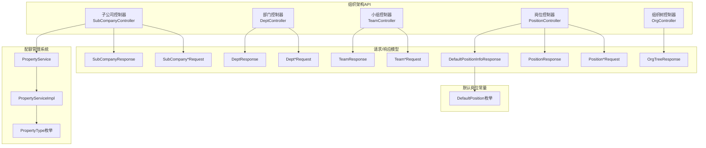
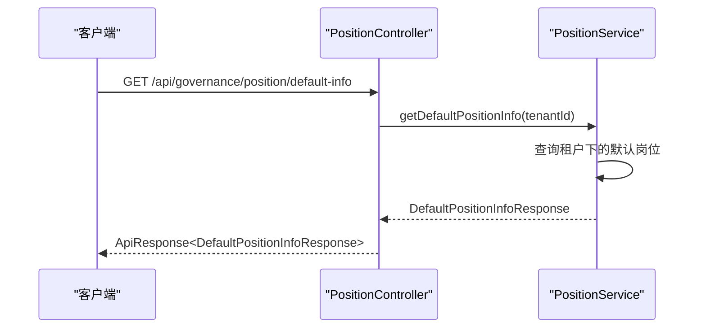
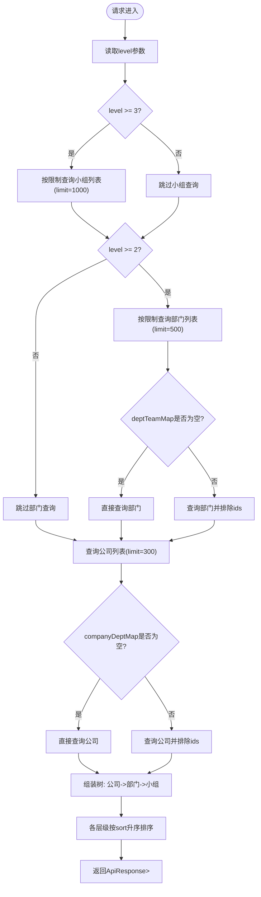
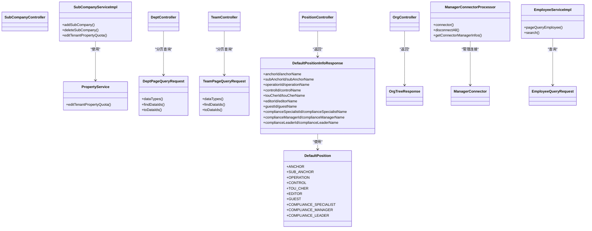

# 组织架构管理API

<cite>
**本文引用的文件**
- [OrgController.java](file://src/main/java/com/jiuyu/governance/business/org/controller/OrgController.java)
- [SubCompanyController.java](file://src/main/java/com/jiuyu/governance/business/org/controller/SubCompanyController.java)
- [DeptController.java](file://src/main/java/com/jiuyu/governance/business/org/controller/DeptController.java)
- [TeamController.java](file://src/main/java/com/jiuyu/governance/business/org/controller/TeamController.java)
- [PositionController.java](file://src/main/java/com/jiuyu/governance/business/org/controller/PositionController.java)
- [SubCompanyAddRequest.java](file://src/main/java/com/jiuyu/governance/business/org/pojo/request/SubCompanyAddRequest.java)
- [SubCompanyPageQueryRequest.java](file://src/main/java/com/jiuyu/governance/business/org/pojo/request/SubCompanyPageQueryRequest.java)
- [DeptAddRequest.java](file://src/main/java/com/jiuyu/governance/business/org/pojo/request/DeptAddRequest.java)
- [DeptPageQueryRequest.java](file://src/main/java/com/jiuyu/governance/business/org/pojo/request/DeptPageQueryRequest.java)
- [TeamAddRequest.java](file://src/main/java/com/jiuyu/governance/business/org/pojo/request/TeamAddRequest.java)
- [TeamPageQueryRequest.java](file://src/main/java/com/jiuyu/governance/business/org/pojo/request/TeamPageQueryRequest.java)
- [PositionAddRequest.java](file://src/main/java/com/jiuyu/governance/business/org/pojo/request/PositionAddRequest.java)
- [PositionPageQueryRequest.java](file://src/main/java/com/jiuyu/governance/business/org/pojo/request/PositionPageQueryRequest.java)
- [SubCompanyResponse.java](file://src/main/java/com/jiuyu/governance/business/org/pojo/response/SubCompanyResponse.java)
- [DeptResponse.java](file://src/main/java/com/jiuyu/governance/business/org/pojo/response/DeptResponse.java)
- [TeamResponse.java](file://src/main/java/com/jiuyu/governance/business/org/pojo/response/TeamResponse.java)
- [PositionResponse.java](file://src/main/java/com/jiuyu/governance/business/org/pojo/response/PositionResponse.java)
- [OrgTreeResponse.java](file://src/main/java/com/jiuyu/governance/business/org/pojo/response/OrgTreeResponse.java)
- [DefaultPositionInfoResponse.java](file://src/main/java/com/jiuyu/governance/business/org/pojo/response/DefaultPositionInfoResponse.java)
- [DefaultPosition.java](file://src/main/java/com/jiuyu/governance/business/rbac/pojo/constants/DefaultPosition.java)
- [SubCompanySelectQueryRequest.java](file://src/main/java/com/jiuyu/governance/business/org/pojo/request/SubCompanySelectQueryRequest.java)
- [DeptSelectQueryRequest.java](file://src/main/java/com/jiuyu/governance/business/org/pojo/request/DeptSelectQueryRequest.java)
- [TeamSelectQueryRequest.java](file://src/main/java/com/jiuyu/governance/business/org/pojo/request/TeamSelectQueryRequest.java)
- [ManagerConnectorProcessor.java](file://src/main/java/com/jiuyu/governance/business/org/service/impl/ManagerConnectorProcessor.java)
- [SubCompanyServiceImpl.java](file://src/main/java/com/jiuyu/governance/business/org/service/impl/SubCompanyServiceImpl.java)
- [PropertyService.java](file://src/main/java/com/jiuyu/governance/openfeign/replay/PropertyService.java)
- [PropertyServiceImpl.java](file://src/main/java/com/jiuyu/governance/openfeign/replay/impl/PropertyServiceImpl.java)
- [PropertyType.java](file://src/main/java/com/jiuyu/governance/openfeign/replay/consts/PropertyType.java)
- [EmployeeServiceImpl.java](file://src/main/java/com/jiuyu/governance/business/rbac/service/impl/EmployeeServiceImpl.java)
- [EmployeeQueryRequest.java](file://src/main/java/com/jiuyu/governance/business/rbac/pojo/request/EmployeeQueryRequest.java)
</cite>

## 更新摘要
**所做更改**
- 更新了组织治理增强：ManagerConnectorProcessor修复空指针异常，增强组织层次查询的空集合验证
- 新增了子公司管理配额强制执行：SubCompanyServiceImpl集成新的配额管理系统，在子公司的创建和删除操作中自动验证配额合规性
- 新增了员工查询功能支持更精细的组织过滤和报告能力
- 更新了组织架构树查询的性能优化策略，包括智能排除逻辑和按需加载机制

## 目录
1. [简介](#简介)
2. [项目结构](#项目结构)
3. [核心组件](#核心组件)
4. [架构总览](#架构总览)
5. [详细组件分析](#详细组件分析)
6. [依赖分析](#依赖分析)
7. [性能考虑](#性能考虑)
8. [故障排查指南](#故障排查指南)
9. [结论](#结论)
10. [附录](#附录)

## 简介
本文件为组织架构管理模块的API接口文档，覆盖子公司、部门、小组、岗位与组织架构树的完整CRUD能力，并补充层级关系查询、管理员绑定、分页查询、条件筛选与排序等能力说明。文档同时解释数据权限控制与业务逻辑，提供接口调用示例、参数说明与错误处理建议。**新增**组织架构默认位置管理功能，支持不同角色的默认位置信息查询。**更新**增强了组织治理能力，包括管理员连接处理器的空指针异常修复和配额管理系统集成。

## 项目结构
组织架构相关模块采用按领域分层的控制器-服务-持久层结构，控制器统一在 org.controller 包中，请求/响应对象位于 org.pojo.request 与 org.pojo.response，服务接口与实现位于 org.service。**新增**默认岗位信息响应类与枚举常量，以及配额管理系统的集成。

**图表来源**
- [SubCompanyController.java:1-102](file://src/main/java/com/jiuyu/governance/business/org/controller/SubCompanyController.java#L1-L102)
- [DeptController.java:1-103](file://src/main/java/com/jiuyu/governance/business/org/controller/DeptController.java#L1-L103)
- [TeamController.java:1-107](file://src/main/java/com/jiuyu/governance/business/org/controller/TeamController.java#L1-L107)
- [PositionController.java:1-117](file://src/main/java/com/jiuyu/governance/business/org/controller/PositionController.java#L1-L117)
- [OrgController.java:1-147](file://src/main/java/com/jiuyu/governance/business/org/controller/OrgController.java#L1-L147)
- [DefaultPositionInfoResponse.java:1-116](file://src/main/java/com/jiuyu/governance/business/org/pojo/response/DefaultPositionInfoResponse.java#L1-L116)
- [DefaultPosition.java:1-35](file://src/main/java/com/jiuyu/governance/business/rbac/pojo/constants/DefaultPosition.java#L1-L35)
- [PropertyService.java:38-50](file://src/main/java/com/jiuyu/governance/openfeign/replay/PropertyService.java#L38-L50)
- [PropertyServiceImpl.java:64-134](file://src/main/java/com/jiuyu/governance/openfeign/replay/impl/PropertyServiceImpl.java#L64-L134)
- [PropertyType.java:15-30](file://src/main/java/com/jiuyu/governance/openfeign/replay/consts/PropertyType.java#L15-L30)

**章节来源**
- [SubCompanyController.java:1-102](file://src/main/java/com/jiuyu/governance/business/org/controller/SubCompanyController.java#L1-L102)
- [DeptController.java:1-103](file://src/main/java/com/jiuyu/governance/business/org/controller/DeptController.java#L1-L103)
- [TeamController.java:1-107](file://src/main/java/com/jiuyu/governance/business/org/controller/TeamController.java#L1-L107)
- [PositionController.java:1-117](file://src/main/java/com/jiuyu/governance/business/org/controller/PositionController.java#L1-L117)
- [OrgController.java:1-147](file://src/main/java/com/jiuyu/governance/business/org/controller/OrgController.java#L1-L147)
- [DefaultPositionInfoResponse.java:1-116](file://src/main/java/com/jiuyu/governance/business/org/pojo/response/DefaultPositionInfoResponse.java#L1-L116)
- [DefaultPosition.java:1-35](file://src/main/java/com/jiuyu/governance/business/rbac/pojo/constants/DefaultPosition.java#L1-L35)
- [PropertyService.java:38-50](file://src/main/java/com/jiuyu/governance/openfeign/replay/PropertyService.java#L38-L50)
- [PropertyServiceImpl.java:64-134](file://src/main/java/com/jiuyu/governance/openfeign/replay/impl/PropertyServiceImpl.java#L64-L134)
- [PropertyType.java:15-30](file://src/main/java/com/jiuyu/governance/openfeign/replay/consts/PropertyType.java#L15-L30)

## 核心组件
- 子公司管理：新增、修改、删除、分页查询、下拉选择，**新增配额强制执行**
- 部门管理：新增、修改、删除、分页查询、下拉选择
- 小组管理：新增、修改、删除、分页查询、下拉选择
- 岗位管理：新增、修改、删除、分页查询、下拉选择、**新增默认岗位信息查询**
- 组织架构树：按公司-部门-小组三层构建树形结构，支持层级参数与数据权限过滤
- **新增**管理员连接管理：支持公司、部门、小组的管理员绑定与解绑
- **新增**员工查询功能：支持基于组织架构的精细化员工查询和报告

**更新** 新增默认岗位信息查询功能，支持获取不同角色的默认岗位配置信息。**更新**增强了子公司管理的配额控制能力，集成了完整的配额管理系统。

**章节来源**
- [SubCompanyController.java:38-99](file://src/main/java/com/jiuyu/governance/business/org/controller/SubCompanyController.java#L38-L99)
- [DeptController.java:38-100](file://src/main/java/com/jiuyu/governance/business/org/controller/DeptController.java#L38-L100)
- [TeamController.java:38-104](file://src/main/java/com/jiuyu/governance/business/org/controller/TeamController.java#L38-L104)
- [PositionController.java:35-117](file://src/main/java/com/jiuyu/governance/business/org/controller/PositionController.java#L35-L117)
- [OrgController.java:49-145](file://src/main/java/com/jiuyu/governance/business/org/controller/OrgController.java#L49-L145)
- [ManagerConnectorProcessor.java:76-137](file://src/main/java/com/jiuyu/governance/business/org/service/impl/ManagerConnectorProcessor.java#L76-L137)
- [EmployeeServiceImpl.java:568-816](file://src/main/java/com/jiuyu/governance/business/rbac/service/impl/EmployeeServiceImpl.java#L568-816)

## 架构总览
组织架构API通过REST控制器暴露，统一使用分页请求基类与权限注解，结合数据权限接口实现按公司/部门维度的权限过滤。组织树接口根据层级参数动态加载公司-部门-小组关系，并对各层级按sort字段升序排序。**新增**默认岗位信息查询接口，支持按租户维度获取预设的默认岗位配置。**更新**管理员连接处理器增强了空指针异常处理和空集合验证，确保组织层次查询的稳定性。

**图表来源**
- [PositionController.java:111-114](file://src/main/java/com/jiuyu/governance/business/org/controller/PositionController.java#L111-L114)
- [PositionServiceImpl.java:345-404](file://src/main/java/com/jiuyu/governance/business/org/service/impl/PositionServiceImpl.java#L345-L404)

**章节来源**
- [OrgController.java:49-145](file://src/main/java/com/jiuyu/governance/business/org/controller/OrgController.java#L49-L145)
- [PositionController.java:111-114](file://src/main/java/com/jiuyu/governance/business/org/controller/PositionController.java#L111-L114)
- [PositionServiceImpl.java:345-404](file://src/main/java/com/jiuyu/governance/business/org/service/impl/PositionServiceImpl.java#L345-L404)

## 详细组件分析

### 子公司管理API
- 新增子公司
  - 方法与路径：POST /api/governance/sub-company/add
  - 权限：org:sub-company:add
  - 请求体：SubCompanyAddRequest
    - name：字符串，必填，长度限制
    - sort：整数，必填
    - managerUserIds：管理员用户ID列表（可选）
  - **更新** 配额强制执行：自动验证子公司数量配额，超出限制时返回QUOTA_EXCEEDED错误
  - 成功响应：ApiResponse<Void>，状态码200
  - 失败响应：依据框架异常机制返回相应错误码，包括配额不足错误

- 修改子公司
  - 方法与路径：POST /api/governance/sub-company/update
  - 权限：org:sub-company:update 或 org:sub-company:add
  - 请求体：SubCompanyAddRequest（同新增，但包含id字段由服务侧处理）
  - 成功响应：ApiResponse<Void>，状态码200

- 删除子公司
  - 方法与路径：POST /api/governance/sub-company/delete
  - 权限：org:sub-company:delete
  - 请求体：IdRequest（包含id）
  - **更新** 配额强制执行：删除前检查子公司数量不得低于1，确保租户至少保留一个子公司
  - 成功响应：ApiResponse<Void>，状态码200

- 分页查询子公司
  - 方法与路径：POST /api/governance/sub-company/page
  - 权限：org:sub-company:list
  - 请求体：SubCompanyPageQueryRequest（继承分页请求，name关键字可选）
  - 成功响应：ApiResponse<PageData<SubCompanyResponse>>

- 下拉选择
  - 方法与路径：GET /api/governance/sub-company/options
  - 参数：SubCompanySelectQueryRequest（含limit等）
  - 成功响应：ApiResponse<List<LabelOption>>

**更新** 子公司管理集成了完整的配额管理系统，包括创建和删除操作的自动配额验证，确保租户的子公司数量不超过配置的上限。

**章节来源**
- [SubCompanyController.java:38-99](file://src/main/java/com/jiuyu/governance/business/org/controller/SubCompanyController.java#L38-L99)
- [SubCompanyAddRequest.java:19-40](file://src/main/java/com/jiuyu/governance/business/org/pojo/request/SubCompanyAddRequest.java#L19-L40)
- [SubCompanyPageQueryRequest.java:17-27](file://src/main/java/com/jiuyu/governance/business/org/pojo/request/SubCompanyPageQueryRequest.java#L17-L27)
- [SubCompanyResponse.java:18-56](file://src/main/java/com/jiuyu/governance/business/org/pojo/response/SubCompanyResponse.java#L18-L56)
- [SubCompanyServiceImpl.java:128-140](file://src/main/java/com/jiuyu/governance/business/org/service/impl/SubCompanyServiceImpl.java#L128-L140)
- [SubCompanyServiceImpl.java:217-224](file://src/main/java/com/jiuyu/governance/business/org/service/impl/SubCompanyServiceImpl.java#L217-L224)

### 部门管理API
- 新增部门
  - 方法与路径：POST /api/governance/dept/add
  - 权限：org:dept:add
  - 请求体：DeptAddRequest
    - companyId：所属公司ID，必填
    - name：部门名称，必填
    - sort：排序，必填
    - managerUserIds：管理员用户ID列表（可选）
  - 成功响应：ApiResponse<Void>，状态码200

- 修改部门
  - 方法与路径：POST /api/governance/dept/update
  - 权限：org:dept:update 或 org:dept:add
  - 请求体：DeptAddRequest（包含id由服务侧处理）

- 删除部门
  - 方法与路径：POST /api/governance/dept/delete
  - 权限：org:dept:delete
  - 请求体：IdRequest（包含id）

- 分页查询部门
  - 方法与路径：POST /api/governance/dept/page
  - 权限：org:dept:list
  - 请求体：DeptPageQueryRequest（继承分页请求，支持companyId/name，具备数据权限接口实现）
  - 成功响应：ApiResponse<PageData<DeptResponse>>

- 下拉选择
  - 方法与路径：GET /api/governance/dept/options
  - 参数：DeptSelectQueryRequest（含limit等）
  - 成功响应：ApiResponse<List<LabelOption>>

数据权限说明
- DeptPageQueryRequest 实现 DataPermissionsRequest，支持按公司维度的数据权限过滤，内部维护companyIds与tenantId，并通过dataTypes()/findDataIds()/toDataIds()提供权限边界。

**章节来源**
- [DeptController.java:38-100](file://src/main/java/com/jiuyu/governance/business/org/controller/DeptController.java#L38-L100)
- [DeptAddRequest.java:19-45](file://src/main/java/com/jiuyu/governance/business/org/pojo/request/DeptAddRequest.java#L19-L45)
- [DeptPageQueryRequest.java:21-109](file://src/main/java/com/jiuyu/governance/business/org/pojo/request/DeptPageQueryRequest.java#L21-L109)
- [DeptResponse.java:18-67](file://src/main/java/com/jiuyu/governance/business/org/pojo/response/DeptResponse.java#L18-L67)

### 小组管理API
- 新增小组
  - 方法与路径：POST /api/governance/team/add
  - 权限：org:team:add
  - 请求体：TeamAddRequest
    - deptId：所属部门ID，必填
    - name：小组名称，必填
    - sort：排序，必填
    - managerUserIds：管理员用户ID列表（可选）
  - 成功响应：ApiResponse<Void>，状态码200

- 修改小组
  - 方法与路径：POST /api/governance/team/update
  - 权限：org:team:update 或 org:team:add
  - 请求体：TeamAddRequest（包含id由服务侧处理）

- 删除小组
  - 方法与路径：POST /api/governance/team/delete
  - 权限：org:team:delete
  - 请求体：IdRequest（包含id）

- 分页查询小组
  - 方法与路径：POST /api/governance/team/page
  - 权限：org:team:list
  - 请求体：TeamPageQueryRequest（继承分页请求，支持deptId/companyId/name，具备数据权限接口实现）
  - 成功响应：ApiResponse<PageData<TeamResponse>>

- 下拉选择
  - 方法与路径：GET /api/governance/team/options
  - 参数：TeamSelectQueryRequest（含limit等）
  - 成功响应：ApiResponse<List<LabelOption>>

数据权限说明
- TeamPageQueryRequest 实现 DataPermissionsRequest，支持按公司与部门维度的数据权限过滤，内部维护deptIds、companyIds与tenantId，并通过dataTypes()/findDataIds()/toDataIds()提供权限边界。

**章节来源**
- [TeamController.java:38-104](file://src/main/java/com/jiuyu/governance/business/org/controller/TeamController.java#L38-L104)
- [TeamAddRequest.java:19-45](file://src/main/java/com/jiuyu/governance/business/org/pojo/request/TeamAddRequest.java#L19-L45)
- [TeamPageQueryRequest.java:21-124](file://src/main/java/com/jiuyu/governance/business/org/pojo/request/TeamPageQueryRequest.java#L21-L124)
- [TeamResponse.java:18-76](file://src/main/java/com/jiuyu/governance/business/org/pojo/response/TeamResponse.java#L18-L76)

### 岗位管理API
- 新增岗位
  - 方法与路径：POST /api/governance/position/add
  - 权限：org:position:add
  - 请求体：PositionAddRequest
    - name：岗位名称，必填，长度限制
    - sort：排序，必填
  - 成功响应：ApiResponse<Void>，状态码200

- 修改岗位
  - 方法与路径：POST /api/governance/position/update
  - 权限：org:position:update
  - 请求体：PositionAddRequest（包含id由服务侧处理）

- 删除岗位
  - 方法与路径：POST /api/governance/position/delete
  - 权限：org:position:delete
  - 请求体：IdRequest（包含id）

- 分页查询岗位
  - 方法与路径：POST /api/governance/position/list
  - 权限：org:position:list
  - 请求体：PositionPageQueryRequest（继承分页请求，name关键字可选）
  - 成功响应：ApiResponse<PageData<PositionResponse>>

- 岗位下拉
  - 方法与路径：GET /api/governance/position/options
  - 参数：keyword（关键字）、limit（默认10）
  - 成功响应：ApiResponse<List<LabelOption>>

**新增** 默认岗位信息查询
- 获取默认岗位信息
  - 方法与路径：GET /api/governance/position/default-info
  - 权限：org:position:list
  - 请求体：无需请求体，自动从AccessUser中获取租户ID
  - 成功响应：ApiResponse<DefaultPositionInfoResponse>
  - 响应字段说明：
    - anchorId/anchorName：主播岗位ID和名称
    - subAnchorId/subAnchorName：副播岗位ID和名称
    - operationId/operationName：运营岗位ID和名称
    - controlId/controlName：中控岗位ID和名称
    - touCherId/touCherName：投手岗位ID和名称
    - editorId/editorName：剪辑岗位ID和名称
    - guestId/guestName：嘉宾岗位ID和名称
    - complianceSpecialistId/complianceSpecialistName：合规专员岗位ID和名称
    - complianceManagerId/complianceManagerName：合规经理岗位ID和名称
    - complianceLeaderId/complianceLeaderName：合规负责人岗位ID和名称

**章节来源**
- [PositionController.java:35-117](file://src/main/java/com/jiuyu/governance/business/org/controller/PositionController.java#L35-L117)
- [PositionAddRequest.java:17-31](file://src/main/java/com/jiuyu/governance/business/org/pojo/request/PositionAddRequest.java#L17-L31)
- [PositionPageQueryRequest.java:17-26](file://src/main/java/com/jiuyu/governance/business/org/pojo/request/PositionPageQueryRequest.java#L17-L26)
- [PositionResponse.java:16-49](file://src/main/java/com/jiuyu/governance/business/org/pojo/response/PositionResponse.java#L16-L49)
- [DefaultPositionInfoResponse.java:1-116](file://src/main/java/com/jiuyu/governance/business/org/pojo/response/DefaultPositionInfoResponse.java#L1-L116)
- [DefaultPosition.java:12-34](file://src/main/java/com/jiuyu/governance/business/rbac/pojo/constants/DefaultPosition.java#L12-L34)

### 组织架构树查询API
- 获取组织架构树
  - 方法与路径：GET /api/governance/org/tree
  - 参数：
    - level：整数，可选，默认3；1表示仅公司，2表示公司+部门，3表示公司+部门+小组
    - accessUser：访问用户上下文（自动注入）
  - 成功响应：ApiResponse<List<OrgTreeResponse>>
  - 业务逻辑要点：
    - 自动应用数据权限过滤（通过AccessUser中的权限信息）
    - **优化后的层级处理**：部门和小组的查询使用了排除逻辑，避免同一层级数据重复
    - **改进的排序机制**：所有层级都按sort字段进行升序排序
    - **增强的容错处理**：如果某一层级没有数据，不会影响到上层节点的返回
    - **前端兼容性**：children可能为null，前端需兼容

**更新** 组织架构树构建逻辑优化，改进层级组织结构处理和排序机制，增强了空集合验证和容错处理能力。

**图表来源**
- [OrgController.java:66-145](file://src/main/java/com/jiuyu/governance/business/org/controller/OrgController.java#L66-L145)

**章节来源**
- [OrgController.java:49-145](file://src/main/java/com/jiuyu/governance/business/org/controller/OrgController.java#L49-L145)
- [OrgTreeResponse.java:17-38](file://src/main/java/com/jiuyu/governance/business/org/pojo/response/OrgTreeResponse.java#L17-L38)

### 管理员连接管理API
- 连接管理员
  - 方法与路径：POST /api/governance/org/manager/connect
  - 权限：org:company:manage 或 org:dept:manage 或 org:team:manage
  - 请求体：connector(ManagerType type, long targetId, List<Long> employeeIds)
  - **更新** 空指针异常修复：增强了对employeeIds为空的处理，避免空指针异常
  - 成功响应：ApiResponse<Void>，状态码200

- 断开管理员连接
  - 方法与路径：POST /api/governance/org/manager/disconnect-all
  - 权限：org:company:manage 或 org:dept:manage 或 org:team:manage
  - 请求体：disconnectAll(ManagerType type, long targetId)
  - **更新** 空集合验证：增强了对空集合的处理，避免不必要的数据库操作
  - 成功响应：ApiResponse<Void>，状态码200

- 获取管理员信息
  - 方法与路径：GET /api/governance/org/manager/info
  - 权限：org:company:list 或 org:dept:list 或 org:team:list
  - 参数：getConnectorManagerInfos(ManagerType type, List<Long> targetIds)
  - **更新** 空集合验证：增强了对空集合的处理，确保查询结果的稳定性
  - 成功响应：ApiResponse<Map<Long, List<EmployeeBaseInfo>>>

**更新** 管理员连接处理器修复了空指针异常问题，增强了组织层次查询的空集合验证，提高了系统的稳定性和可靠性。

**章节来源**
- [ManagerConnectorProcessor.java:76-137](file://src/main/java/com/jiuyu/governance/business/org/service/impl/ManagerConnectorProcessor.java#L76-L137)
- [ManagerConnectorProcessor.java:607-637](file://src/main/java/com/jiuyu/governance/business/org/service/impl/ManagerConnectorProcessor.java#L607-L637)

### 员工查询功能API
- 员工分页查询
  - 方法与路径：POST /api/governance/employee/page
  - 权限：org:employee:list
  - 请求体：EmployeeQueryRequest（支持name、staffNumber、mobile、positionIds、onRec、jobType、accountStatus、companyIds、deptIds、teamIds等条件）
  - **更新** 精细化组织过滤：支持基于公司、部门、小组的多维度过滤
  - 成功响应：ApiResponse<PageData<EmployeeInfoResponse>>

- 员工下拉搜索
  - 方法与路径：GET /api/governance/employee/options
  - 权限：org:employee:list
  - 参数：EmployeeOptionSearchRequest（支持positionCodeList、companyIds、deptIds、teamIds等条件）
  - **更新** 报告能力增强：支持更精细的组织过滤条件
  - 成功响应：ApiResponse<List<LabelOption>>

**更新** 员工查询功能支持更精细的组织过滤和报告能力，包括基于职位编码、组织架构层级的多维度查询。

**章节来源**
- [EmployeeServiceImpl.java:568-816](file://src/main/java/com/jiuyu/governance/business/rbac/service/impl/EmployeeServiceImpl.java#L568-816)
- [EmployeeQueryRequest.java:18-65](file://src/main/java/com/jiuyu/governance/business/rbac/pojo/request/EmployeeQueryRequest.java#L18-65)

## 依赖分析
- 控制器层：统一使用注解权限与访问用户上下文，请求体参数校验，响应封装为统一的ApiResponse
- 数据权限：部门与小组分页查询请求实现DataPermissionsRequest，支持多维度（公司、部门）权限过滤
- 组织树：按层级动态加载，避免重复查询，对children进行空值处理
- **新增**默认岗位信息：PositionController依赖DefaultPositionInfoResponse响应类和DefaultPosition枚举常量
- **新增**配额管理系统：SubCompanyServiceImpl依赖PropertyService进行配额验证和管理
- **新增**管理员连接管理：ManagerConnectorProcessor提供统一的管理员连接管理能力
- **新增**员工查询功能：EmployeeServiceImpl支持精细化的组织过滤和报告查询

**图表来源**
- [SubCompanyController.java:1-102](file://src/main/java/com/jiuyu/governance/business/org/controller/SubCompanyController.java#L1-L102)
- [DeptController.java:1-103](file://src/main/java/com/jiuyu/governance/business/org/controller/DeptController.java#L1-L103)
- [TeamController.java:1-107](file://src/main/java/com/jiuyu/governance/business/org/controller/TeamController.java#L1-L107)
- [PositionController.java:1-117](file://src/main/java/com/jiuyu/governance/business/org/controller/PositionController.java#L1-L117)
- [OrgController.java:1-147](file://src/main/java/com/jiuyu/governance/business/org/controller/OrgController.java#L1-L147)
- [ManagerConnectorProcessor.java:49-694](file://src/main/java/com/jiuyu/governance/business/org/service/impl/ManagerConnectorProcessor.java#L49-L694)
- [SubCompanyServiceImpl.java:106-245](file://src/main/java/com/jiuyu/governance/business/org/service/impl/SubCompanyServiceImpl.java#L106-245)
- [PropertyService.java:38-50](file://src/main/java/com/jiuyu/governance/openfeign/replay/PropertyService.java#L38-L50)
- [EmployeeServiceImpl.java:568-816](file://src/main/java/com/jiuyu/governance/business/rbac/service/impl/EmployeeServiceImpl.java#L568-816)
- [DeptPageQueryRequest.java:21-109](file://src/main/java/com/jiuyu/governance/business/org/pojo/request/DeptPageQueryRequest.java#L21-L109)
- [TeamPageQueryRequest.java:21-124](file://src/main/java/com/jiuyu/governance/business/org/pojo/request/TeamPageQueryRequest.java#L21-L124)
- [DefaultPositionInfoResponse.java:1-116](file://src/main/java/com/jiuyu/governance/business/org/pojo/response/DefaultPositionInfoResponse.java#L1-L116)
- [DefaultPosition.java:12-34](file://src/main/java/com/jiuyu/governance/business/rbac/pojo/constants/DefaultPosition.java#L12-L34)

**章节来源**
- [DeptPageQueryRequest.java:57-109](file://src/main/java/com/jiuyu/governance/business/org/pojo/request/DeptPageQueryRequest.java#L57-L109)
- [TeamPageQueryRequest.java:67-124](file://src/main/java/com/jiuyu/governance/business/org/pojo/request/TeamPageQueryRequest.java#L67-L124)
- [DefaultPositionInfoResponse.java:1-116](file://src/main/java/com/jiuyu/governance/business/org/pojo/response/DefaultPositionInfoResponse.java#L1-L116)
- [DefaultPosition.java:12-34](file://src/main/java/com/jiuyu/governance/business/rbac/pojo/constants/DefaultPosition.java#L12-L34)
- [ManagerConnectorProcessor.java:76-137](file://src/main/java/com/jiuyu/governance/business/org/service/impl/ManagerConnectorProcessor.java#L76-L137)
- [SubCompanyServiceImpl.java:128-140](file://src/main/java/com/jiuyu/governance/business/org/service/impl/SubCompanyServiceImpl.java#L128-L140)
- [SubCompanyServiceImpl.java:217-224](file://src/main/java/com/jiuyu/governance/business/org/service/impl/SubCompanyServiceImpl.java#L217-L224)
- [EmployeeServiceImpl.java:568-816](file://src/main/java/com/jiuyu/governance/business/rbac/service/impl/EmployeeServiceImpl.java#L568-816)

## 性能考虑
- 组织树查询
  - **优化的查询限制**：对小组与部门查询设置了上限（如1000、500），避免一次性加载过多数据
  - **智能排除逻辑**：部门和小组的查询使用了排除逻辑，避免同一层级数据重复，减少不必要的查询
  - **分组与流式合并**：使用分组与流式合并减少重复查询，提高查询效率
  - **按需加载**：根据level参数动态决定查询层级，避免不必要的数据加载
- 分页查询
  - 所有分页接口均继承分页请求基类，建议前端传入合理页码与每页大小
- 数据权限
  - 通过数据权限接口限定查询范围，避免全量扫描
- **新增**默认岗位信息查询
  - 通过单次数据库查询获取所有默认岗位配置，避免多次往返
  - 使用枚举映射优化switch-case逻辑
- **新增**配额管理系统
  - **原子性操作**：使用PropertyService的editTenantPropertyQuota方法确保配额更新的原子性
  - **远程调用保护**：通过分布式锁防止并发操作导致的配额超限
  - **回调机制**：采用回调函数模式，先验证配额再执行业务逻辑，确保数据一致性
- **新增**管理员连接管理
  - **缓存优化**：使用Redis缓存管理员连接信息，减少数据库查询压力
  - **批量操作**：支持批量插入和更新，提高操作效率
  - **空集合处理**：增强了对空集合的处理，避免不必要的数据库操作

**更新** 组织树查询性能优化，包括智能排除逻辑和按需加载机制。**更新**新增了配额管理系统的性能考虑，包括原子性操作和远程调用保护机制。

**章节来源**
- [OrgController.java:66-145](file://src/main/java/com/jiuyu/governance/business/org/controller/OrgController.java#L66-L145)
- [DeptPageQueryRequest.java:21-109](file://src/main/java/com/jiuyu/governance/business/org/pojo/request/DeptPageQueryRequest.java#L21-L109)
- [TeamPageQueryRequest.java:21-124](file://src/main/java/com/jiuyu/governance/business/org/pojo/request/TeamPageQueryRequest.java#L21-L124)
- [PositionServiceImpl.java:345-404](file://src/main/java/com/jiuyu/governance/business/org/service/impl/PositionServiceImpl.java#L345-L404)
- [PropertyServiceImpl.java:64-134](file://src/main/java/com/jiuyu/governance/openfeign/replay/impl/PropertyServiceImpl.java#L64-L134)
- [ManagerConnectorProcessor.java:158-213](file://src/main/java/com/jiuyu/governance/business/org/service/impl/ManagerConnectorProcessor.java#L158-L213)

## 故障排查指南
- 权限不足
  - 现象：返回权限相关错误
  - 处理：确认用户是否具备对应权限标识（如org:dept:list）
- 参数校验失败
  - 现象：请求体参数不满足约束（如必填、长度限制）
  - 处理：检查请求体字段是否符合请求类定义
- 数据权限过滤导致结果为空
  - 现象：分页或下拉查询结果为空
  - 处理：确认当前用户的数据权限范围与传入的过滤条件（如companyId、deptId）
- 组织树children为空
  - 现象：部分层级children为null
  - 处理：前端需兼容children为null的情况
- **新增**默认岗位信息查询失败
  - 现象：返回空响应或部分字段为null
  - 处理：确认租户下是否存在已设置为默认的岗位配置，检查DefaultPosition枚举值与数据库中的positionCode是否匹配
- **新增**组织树查询性能问题
  - 现象：查询响应时间过长
  - 处理：检查level参数设置，确认是否启用了智能排除逻辑，验证查询限制是否合理
- **新增**配额管理错误
  - 现象：创建或删除子公司时返回QUOTA_EXCEEDED错误
  - 处理：检查租户的配额配置，确认当前使用量是否超过总配额，验证editTenantPropertyQuota回调函数的执行结果
- **新增**管理员连接异常
  - 现象：管理员连接或断开操作失败
  - 处理：检查employeeIds参数是否为空，确认目标组织是否存在，验证Redis缓存是否正常工作
- **新增**员工查询过滤问题
  - 现象：员工查询结果不符合预期
  - 处理：检查companyIds、deptIds、teamIds等过滤条件是否正确，确认职位编码列表的有效性

**更新** 新增组织树查询性能问题的故障排查指导。**更新**新增了配额管理、管理员连接管理和员工查询功能的故障排查指导。

**章节来源**
- [SubCompanyController.java:45-84](file://src/main/java/com/jiuyu/governance/business/org/controller/SubCompanyController.java#L45-L84)
- [DeptController.java:45-84](file://src/main/java/com/jiuyu/governance/business/org/controller/DeptController.java#L45-L84)
- [TeamController.java:46-88](file://src/main/java/com/jiuyu/governance/business/org/controller/TeamController.java#L46-L88)
- [PositionController.java:42-83](file://src/main/java/com/jiuyu/governance/business/org/controller/PositionController.java#L42-L83)
- [OrgController.java:49-145](file://src/main/java/com/jiuyu/governance/business/org/controller/OrgController.java#L49-L145)
- [SubCompanyServiceImpl.java:128-140](file://src/main/java/com/jiuyu/governance/business/org/service/impl/SubCompanyServiceImpl.java#L128-L140)
- [SubCompanyServiceImpl.java:217-224](file://src/main/java/com/jiuyu/governance/business/org/service/impl/SubCompanyServiceImpl.java#L217-L224)
- [ManagerConnectorProcessor.java:76-137](file://src/main/java/com/jiuyu/governance/business/org/service/impl/ManagerConnectorProcessor.java#L76-L137)
- [EmployeeServiceImpl.java:568-816](file://src/main/java/com/jiuyu/governance/business/rbac/service/impl/EmployeeServiceImpl.java#L568-816)

## 结论
组织架构管理API提供了完善的CRUD与查询能力，支持按公司/部门维度的数据权限过滤，组织树接口兼顾性能与易用性。**新增**默认岗位信息查询功能，支持不同角色的默认位置配置管理。**优化后的组织架构树构建逻辑**通过智能排除逻辑和按需加载机制，显著提升了查询性能和用户体验。**更新**增强了组织治理能力，包括管理员连接处理器的空指针异常修复、配额管理系统的集成，以及员工查询功能的精细化组织过滤和报告能力。建议在前端对接时关注层级参数、children空值处理、权限标识配置、默认岗位信息的缓存策略，以及配额管理的错误处理机制。

## 附录

### 接口调用示例（示例性描述）
- 新增子公司
  - 请求：POST /api/governance/sub-company/add
  - 请求体：{
    "name": "示例公司",
    "sort": 1,
    "managerUserIds": [1001, 1002]
  }
  - 返回：200 成功，无内容
  - **新增** 配额验证：系统会自动检查子公司数量配额，超出限制时返回QUOTA_EXCEEDED错误

- 分页查询部门
  - 请求：POST /api/governance/dept/page
  - 请求体：{
    "page": 1,
    "pageSize": 10,
    "companyId": 1,
    "name": "研发"
  }
  - 返回：PageData<DeptResponse>

- 获取组织树
  - 请求：GET /api/governance/org/tree?level=3
  - 返回：List<OrgTreeResponse>，包含公司-部门-小组三层结构
  - **更新** 性能优化：启用智能排除逻辑，避免重复查询，提升响应速度

**新增** 默认岗位信息查询
- 获取默认岗位信息
  - 请求：GET /api/governance/position/default-info
  - 返回：{
    "anchorId": 1001,
    "anchorName": "主播",
    "subAnchorId": 1002,
    "subAnchorName": "副播",
    "operationId": 1003,
    "operationName": "运营",
    "controlId": 1004,
    "controlName": "中控",
    "touCherId": 1005,
    "touCherName": "投手",
    "editorId": 1006,
    "editorName": "剪辑",
    "guestId": 1007,
    "guestName": "嘉宾",
    "complianceSpecialistId": 1008,
    "complianceSpecialistName": "合规专员",
    "complianceManagerId": 1009,
    "complianceManagerName": "合规经理",
    "complianceLeaderId": 1010,
    "complianceLeaderName": "合规负责人"
  }

**新增** 管理员连接管理示例
- 连接管理员
  - 请求：POST /api/governance/org/manager/connect
  - 请求体：{
    "type": "COMPANY",
    "targetId": 1,
    "employeeIds": [1001, 1002]
  }
  - 返回：200 成功，无内容
  - **更新** 空指针异常修复：增强了对空集合的处理，避免异常

**新增** 员工查询功能示例
- 员工分页查询
  - 请求：POST /api/governance/employee/page
  - 请求体：{
    "page": 1,
    "pageSize": 10,
    "companyIds": [1, 2],
    "deptIds": [10, 11],
    "teamIds": [100, 101],
    "positionIds": [1, 2]
  }
  - 返回：PageData<EmployeeInfoResponse>
  - **更新** 精细化过滤：支持基于组织架构的多维度查询

**章节来源**
- [SubCompanyController.java:45-87](file://src/main/java/com/jiuyu/governance/business/org/controller/SubCompanyController.java#L45-L87)
- [DeptController.java:84-87](file://src/main/java/com/jiuyu/governance/business/org/controller/DeptController.java#L84-L87)
- [OrgController.java:49-145](file://src/main/java/com/jiuyu/governance/business/org/controller/OrgController.java#L49-L145)
- [PositionController.java:111-114](file://src/main/java/com/jiuyu/governance/business/org/controller/PositionController.java#L111-L114)
- [DefaultPositionInfoResponse.java:1-116](file://src/main/java/com/jiuyu/governance/business/org/pojo/response/DefaultPositionInfoResponse.java#L1-L116)
- [ManagerConnectorProcessor.java:76-137](file://src/main/java/com/jiuyu/governance/business/org/service/impl/ManagerConnectorProcessor.java#L76-L137)
- [EmployeeServiceImpl.java:568-816](file://src/main/java/com/jiuyu/governance/business/rbac/service/impl/EmployeeServiceImpl.java#L568-816)