# 直播会话服务

<cite>
**本文档引用的文件**
- [LiveVideoController.java](file://src/main/java/com/jiuyu/governance/business/performance/controller/LiveVideoController.java)
- [LiveVideoService.java](file://src/main/java/com/jiuyu/governance/business/performance/service/LiveVideoService.java)
- [LiveVideoServiceImpl.java](file://src/main/java/com/jiuyu/governance/business/performance/service/impl/LiveVideoServiceImpl.java)
- [LiveVideo.java](file://src/main/java/com/jiuyu/governance/business/performance/pojo/entity/LiveVideo.java)
- [LiveVideoMapper.java](file://src/main/java/com/jiuyu/governance/business/performance/mapper/LiveVideoMapper.java)
- [VideoPushRequest.java](file://src/main/java/com/jiuyu/governance/business/performance/pojo/request/VideoPushRequest.java)
- [ClientPushVideoRequest.java](file://src/main/java/com/jiuyu/governance/business/performance/pojo/request/ClientPushVideoRequest.java)
- [ProcessStatus.java](file://src/main/java/com/jiuyu/governance/business/performance/pojo/constants/ProcessStatus.java)
- [PendingVideoGroup.java](file://src/main/java/com/jiuyu/governance/business/performance/pojo/bo/PendingVideoGroup.java)
- [LiveVideoMapper.xml](file://src/main/resources/mapper/performance/LiveVideoMapper.xml)
- [LiveSession.java](file://src/main/java/com/jiuyu/governance/business/performance/pojo/entity/LiveSession.java)
- [LiveSessionService.java](file://src/main/java/com/jiuyu/governance/business/performance/service/LiveSessionService.java)
- [LiveSessionServiceImpl.java](file://src/main/java/com/jiuyu/governance/business/performance/service/impl/LiveSessionServiceImpl.java)
- [LiveSessionMapper.xml](file://src/main/resources/mapper/performance/LiveSessionMapper.xml)
- [live_session.md](file://docs/db/live_session.md)
- [MetricsUtil.java](file://src/main/java/com/jiuyu/governance/business/performance/utils/MetricsUtil.java)
- [BasePerformanceEntity.java](file://src/main/java/com/jiuyu/governance/business/performance/pojo/base/BasePerformanceEntity.java)
- [BasePerformanceMetrics.java](file://src/main/java/com/jiuyu/governance/business/performance/pojo/base/BasePerformanceMetrics.java)
- [VideoProcessContext.java](file://src/main/java/com/jiuyu/governance/business/performance/pojo/bo/VideoProcessContext.java)
- [VideoTask.java](file://src/main/java/com/jiuyu/governance/business/performance/task/VideoTask.java)
- [Product.java](file://src/main/java/com/jiuyu/governance/business/performance/pojo/entity/Product.java)
- [SessionProduct.java](file://src/main/java/com/jiuyu/governance/business/performance/pojo/entity/SessionProduct.java)
- [VideoProduct.java](file://src/main/java/com/jiuyu/governance/business/performance/pojo/entity/VideoProduct.java)
- [ProductService.java](file://src/main/java/com/jiuyu/governance/business/performance/service/ProductService.java)
- [ProductServiceImpl.java](file://src/main/java/com/jiuyu/governance/business/performance/service/impl/ProductServiceImpl.java)
- [ProductMapper.java](file://src/main/java/com/jiuyu/governance/business/performance/mapper/ProductMapper.java)
- [product.md](file://docs/db/product.md)
- [session_product.md](file://docs/db/session_product.md)
</cite>

## 更新摘要
**变更内容**
- 更新视频OSS数据处理重大重构：从`mergeAndUploadVideoOssData`重命名为`loadVideoOssData`
- 移除了复杂的多视频合并和上传逻辑，改为直接使用现有`videoOssUrl`
- 引入BasePerformanceEntity中间对象模式用于区间指标计算
- 更新性能计算方法，支持区间点击-成交率和区间互动率计算
- 优化事务拆分架构，将耗时操作移出事务边界

## 目录
1. [简介](#简介)
2. [项目结构](#项目结构)
3. [核心组件](#核心组件)
4. [架构概览](#架构概览)
5. [详细组件分析](#详细组件分析)
6. [依赖关系分析](#依赖关系分析)
7. [性能考虑](#性能考虑)
8. [故障排除指南](#故障排除指南)
9. [结论](#结论)

## 简介

直播会话服务是爱复盘治理平台的核心业务模块，主要负责直播数据的接收、处理、存储和分析。该服务通过统一的接口接收来自不同直播平台的数据，包括抖音、快手、视频号等，提供完整的直播业绩数据分析能力。

服务采用分层架构设计，包含控制器层、服务层、数据访问层和实体模型层，支持高并发处理和数据一致性保证。通过OSS存储直播过程数据，实现了数据的持久化和可追溯性。

**更新** 服务现已完成视频OSS数据处理的重大重构，采用新的`loadVideoOssData`方法直接加载现有过程数据，引入BasePerformanceEntity中间对象模式支持区间指标计算，并优化了事务拆分架构以提升系统性能。

## 项目结构

直播会话服务位于 `src/main/java/com/jiuyu/governance/business/performance/` 目录下，采用按功能模块划分的组织方式：

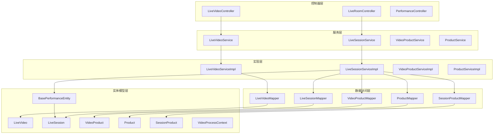

**图表来源**
- [LiveVideoController.java:1-69](file://src/main/java/com/jiuyu/governance/business/performance/controller/LiveVideoController.java#L1-L69)
- [LiveVideoService.java:1-94](file://src/main/java/com/jiuyu/governance/business/performance/service/LiveVideoService.java#L1-L94)
- [LiveVideoServiceImpl.java:1-804](file://src/main/java/com/jiuyu/governance/business/performance/service/impl/LiveVideoServiceImpl.java#L1-L804)
- [LiveSessionServiceImpl.java:1-1241](file://src/main/java/com/jiuyu/governance/business/performance/service/impl/LiveSessionServiceImpl.java#L1-L1241)

**章节来源**
- [LiveVideoController.java:1-69](file://src/main/java/com/jiuyu/governance/business/performance/controller/LiveVideoController.java#L1-L69)
- [LiveVideoService.java:1-94](file://src/main/java/com/jiuyu/governance/business/performance/service/LiveVideoService.java#L1-L94)

## 核心组件

直播会话服务包含以下核心组件：

### 视频数据处理组件
- **LiveVideoController**: 处理视频数据接收和客户端推送请求
- **LiveVideoService**: 定义视频数据处理接口规范
- **LiveVideoServiceImpl**: 实现视频数据处理的完整业务逻辑
- **LiveVideo**: 视频数据实体模型，包含直播过程数据

### 场次数据管理组件
- **LiveSession**: 场次实体模型，存储直播场次的汇总信息，继承BasePerformanceEntity
- **LiveSessionService**: 场次数据管理接口，新增`loadVideoOssData`方法
- **LiveSessionServiceImpl**: 实现场次数据的完整处理流程，包含区间指标计算
- **LiveSessionMapper**: 场次数据访问层

### 性能计算核心组件
- **BasePerformanceEntity**: 业绩指标基类，统一管理核心指标字段，支持中间对象模式
- **BasePerformanceMetrics**: 业绩核心指标基类（不含ROI），支持Builder模式
- **VideoProcessContext**: 视频处理上下文，用于事务拆分后的数据传递

### 商品数据处理组件
- **Product**: 商品基础信息实体模型，存储商品的基础属性
- **SessionProduct**: 场次商品关联实体模型，存储场次与商品的关联关系
- **VideoProduct**: 视频商品实体模型，存储视频中的商品数据
- **ProductService**: 商品服务接口
- **ProductServiceImpl**: 商品服务实现类
- **ProductMapper**: 商品数据访问层

### 数据处理工具组件
- **MetricsUtil**: 业务指标计算工具类
- **ProcessStatus**: 视频处理状态枚举

**章节来源**
- [LiveVideo.java:1-124](file://src/main/java/com/jiuyu/governance/business/performance/pojo/entity/LiveVideo.java#L1-L124)
- [LiveSession.java:1-133](file://src/main/java/com/jiuyu/governance/business/performance/pojo/entity/LiveSession.java#L1-L133)
- [BasePerformanceEntity.java:1-261](file://src/main/java/com/jiuyu/governance/business/performance/pojo/base/BasePerformanceEntity.java#L1-L261)
- [BasePerformanceMetrics.java:1-31](file://src/main/java/com/jiuyu/governance/business/performance/pojo/base/BasePerformanceMetrics.java#L1-L31)
- [VideoProcessContext.java:1-79](file://src/main/java/com/jiuyu/governance/business/performance/pojo/bo/VideoProcessContext.java#L1-L79)

## 架构概览

直播会话服务采用分层架构设计，确保了良好的可维护性和扩展性：

```mermaid
graph TB
subgraph "表现层"
API[REST API接口]
UI[前端界面]
end
subgraph "应用层"
CTRL[控制器层]
SVC[服务层]
JOB[定时任务]
end
subgraph "领域层"
CORE[核心业务逻辑]
UTIL[工具类]
PRODUCT[商品处理]
PERFORMANCE[性能计算]
END
subgraph "基础设施层"
DB[(数据库)]
OSS[(对象存储)]
MQ[(消息队列)]
end
API --> CTRL
UI --> CTRL
CTRL --> SVC
SVC --> CORE
CORE --> UTIL
CORE --> PRODUCT
CORE --> PERFORMANCE
PRODUCT --> DB
PERFORMANCE --> DB
CORE --> DB
CORE --> OSS
JOB --> SVC
```

**图表来源**
- [LiveVideoController.java:26-69](file://src/main/java/com/jiuyu/governance/business/performance/controller/LiveVideoController.java#L26-L69)
- [LiveVideoServiceImpl.java:44-804](file://src/main/java/com/jiuyu/governance/business/performance/service/impl/LiveVideoServiceImpl.java#L44-L804)
- [LiveSessionServiceImpl.java:570-650](file://src/main/java/com/jiuyu/governance/business/performance/service/impl/LiveSessionServiceImpl.java#L570-L650)

### 事务拆分数据流处理流程

服务采用新的事务拆分架构，将耗时的OSS数据加载操作移出事务边界：

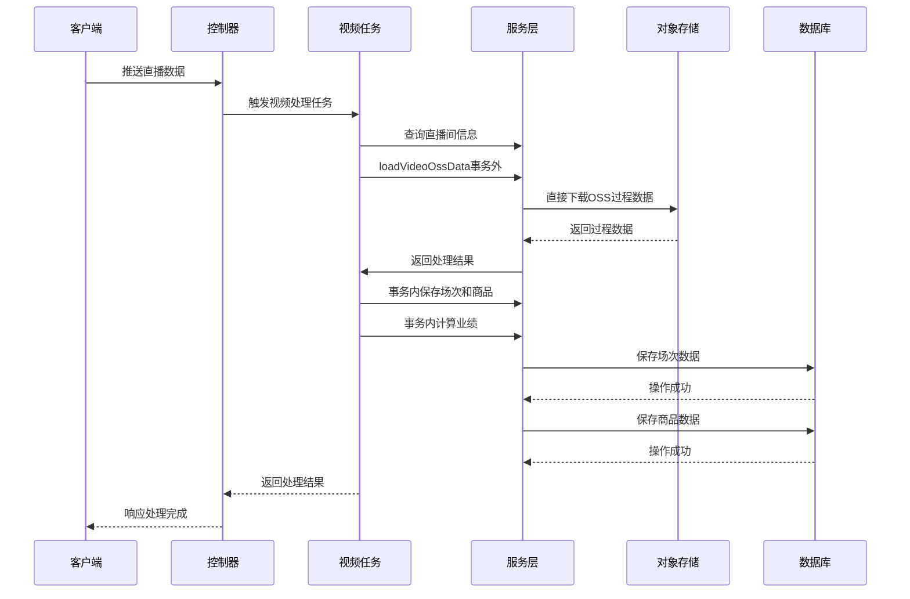

**图表来源**
- [VideoTask.java:221-233](file://src/main/java/com/jiuyu/governance/business/performance/task/VideoTask.java#L221-L233)
- [LiveSessionService.java:24-32](file://src/main/java/com/jiuyu/governance/business/performance/service/LiveSessionService.java#L24-L32)
- [LiveSessionServiceImpl.java:570-650](file://src/main/java/com/jiuyu/governance/business/performance/service/impl/LiveSessionServiceImpl.java#L570-L650)

**章节来源**
- [LiveVideoController.java:33-67](file://src/main/java/com/jiuyu/governance/business/performance/controller/LiveVideoController.java#L33-L67)
- [LiveVideoServiceImpl.java:55-139](file://src/main/java/com/jiuyu/governance/business/performance/service/impl/LiveVideoServiceImpl.java#L55-L139)

## 详细组件分析

### 视频数据处理组件

#### LiveVideoController 控制器
负责处理直播视频数据的接收和推送请求，提供以下核心功能：

- **服务器数据接收**: 处理来自爱复盘服务器的视频数据推送
- **客户端数据推送**: 支持直播客户端实时推送过程数据
- **数据验证**: 使用注解进行请求参数验证
- **分布式锁**: 防止重复提交和并发冲突

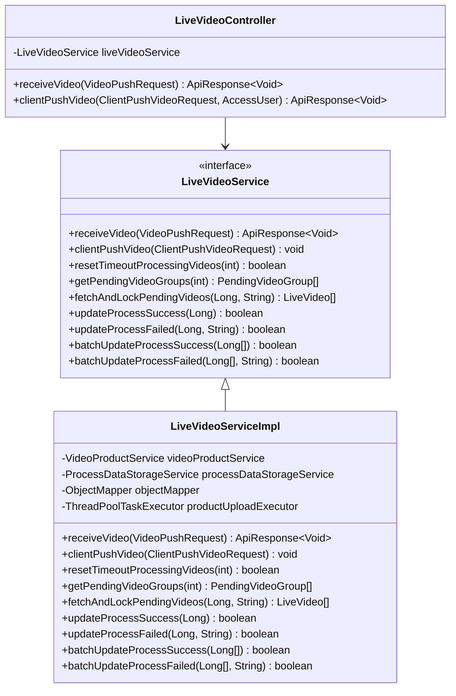

**图表来源**
- [LiveVideoController.java:29-67](file://src/main/java/com/jiuyu/governance/business/performance/controller/LiveVideoController.java#L29-L67)
- [LiveVideoService.java:18-93](file://src/main/java/com/jiuyu/governance/business/performance/service/LiveVideoService.java#L18-L93)
- [LiveVideoServiceImpl.java:47-804](file://src/main/java/com/jiuyu/governance/business/performance/service/impl/LiveVideoServiceImpl.java#L47-L804)

#### LiveVideo 实体模型
视频数据实体模型，包含直播过程的所有关键指标：

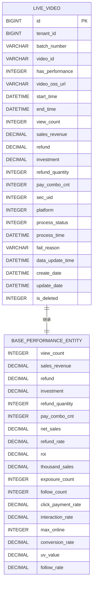

**图表来源**
- [LiveVideo.java:19-124](file://src/main/java/com/jiuyu/governance/business/performance/pojo/entity/LiveVideo.java#L19-L124)
- [BasePerformanceEntity.java:34-261](file://src/main/java/com/jiuyu/governance/business/performance/pojo/base/BasePerformanceEntity.java#L34-L261)

#### 数据处理算法
服务实现了智能的数据处理算法，能够处理重复推送和状态冲突：

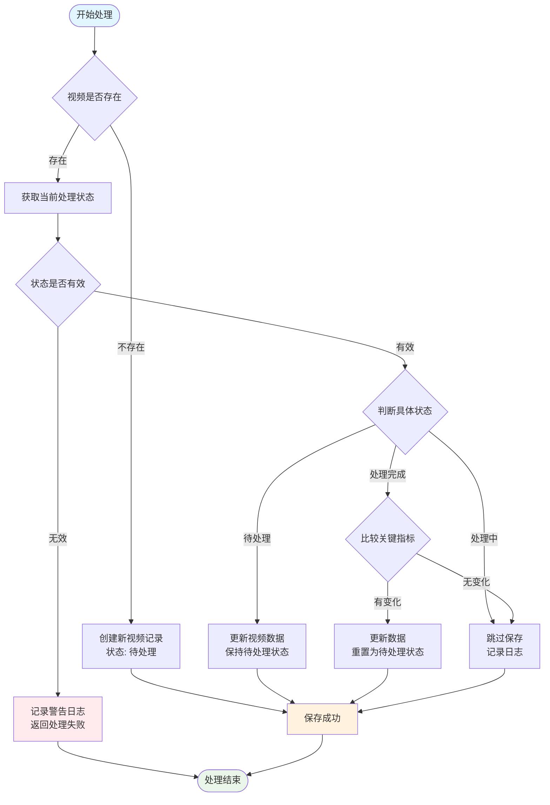

**图表来源**
- [LiveVideoServiceImpl.java:82-139](file://src/main/java/com/jiuyu/governance/business/performance/service/impl/LiveVideoServiceImpl.java#L82-L139)

**章节来源**
- [LiveVideoController.java:33-67](file://src/main/java/com/jiuyu/governance/business/performance/controller/LiveVideoController.java#L33-L67)
- [LiveVideoServiceImpl.java:55-458](file://src/main/java/com/jiuyu/governance/business/performance/service/impl/LiveVideoServiceImpl.java#L55-L458)

### 场次数据管理组件

#### LiveSession 实体模型
场次实体模型存储直播场次的汇总信息，继承自BasePerformanceEntity，支持多维度的业务分析：

| 字段名称 | 数据类型 | 说明 | 用途 |
|---------|---------|------|-----|
| id | BIGINT | 主键 | 唯一标识直播场次 |
| tenant_id | BIGINT | 租户ID | 区分不同客户的数据隔离 |
| live_room_id | BIGINT | 直播间ID | 关联具体的直播间 |
| batch_number | VARCHAR | 直播批次号 | 批量处理标识 |
| start_time | DATETIME | 开始时间 | 直播开始时刻 |
| end_time | DATETIME | 结束时间 | 直播结束时刻 |
| duration | INT | 总时长 | 直播持续时间（秒） |
| oss_url | VARCHAR | 实时数据 | 过程数据存储地址 |
| company_id | BIGINT | 公司ID | 组织架构关联 |
| dept_id | BIGINT | 部门ID | 部门归属 |
| team_id | BIGINT | 小组ID | 团队归属 |
| source | TINYINT | 数据来源 | 推送或手动录入 |
| version | INT | 乐观锁 | 并发控制 |

**章节来源**
- [LiveSession.java:21-133](file://src/main/java/com/jiuyu/governance/business/performance/pojo/entity/LiveSession.java#L21-L133)
- [live_session.md:8-99](file://docs/db/live_session.md#L8-L99)

#### LoadVideoOssData 方法重构
**更新** 新增`loadVideoOssData`方法，替代原有的`mergeAndUploadVideoOssData`，直接使用现有`videoOssUrl`：

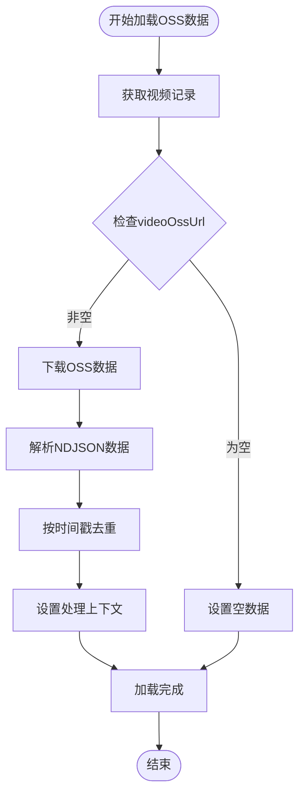

**图表来源**
- [LiveSessionService.java:24-32](file://src/main/java/com/jiuyu/governance/business/performance/service/LiveSessionService.java#L24-L32)
- [LiveSessionServiceImpl.java:570-650](file://src/main/java/com/jiuyu/governance/business/performance/service/impl/LiveSessionServiceImpl.java#L570-L650)

### 性能计算核心组件

#### BasePerformanceEntity 中间对象模式
**更新** 引入BasePerformanceEntity作为中间对象，支持区间指标计算：

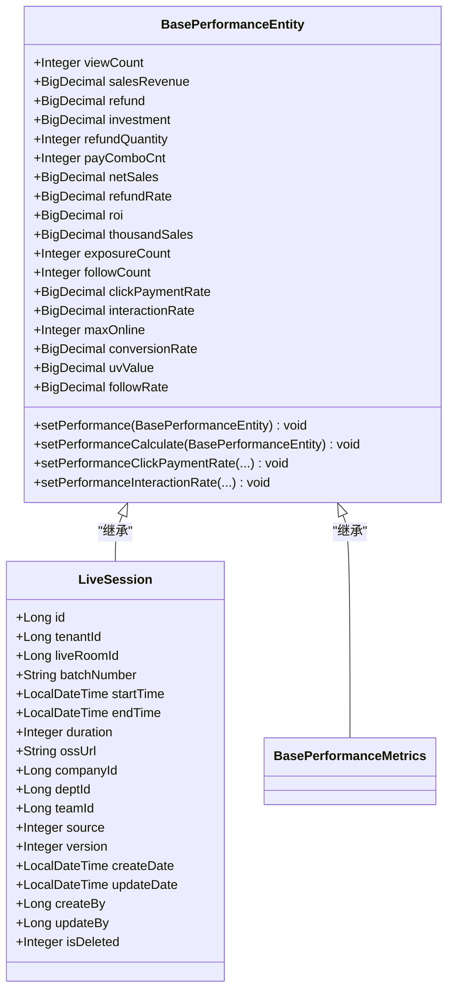

**图表来源**
- [BasePerformanceEntity.java:34-261](file://src/main/java/com/jiuyu/governance/business/performance/pojo/base/BasePerformanceEntity.java#L34-L261)
- [LiveSession.java:21-133](file://src/main/java/com/jiuyu/governance/business/performance/pojo/entity/LiveSession.java#L21-L133)
- [BasePerformanceMetrics.java:25-31](file://src/main/java/com/jiuyu/governance/business/performance/pojo/base/BasePerformanceMetrics.java#L25-L31)

#### 区间指标计算算法
**更新** 新增区间点击-成交率和区间互动率计算方法：

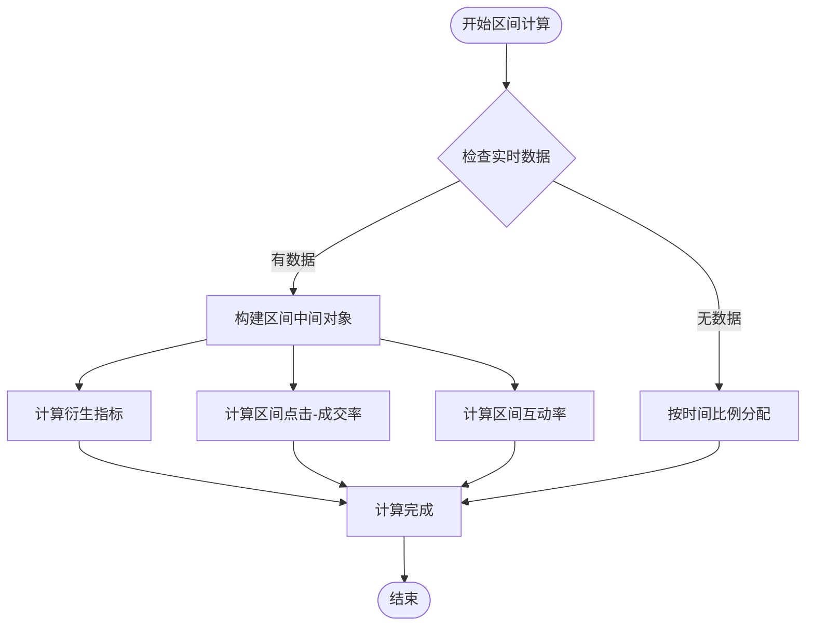

**图表来源**
- [LiveSessionServiceImpl.java:706-747](file://src/main/java/com/jiuyu/governance/business/performance/service/impl/LiveSessionServiceImpl.java#L706-L747)
- [LiveSessionServiceImpl.java:915-947](file://src/main/java/com/jiuyu/governance/business/performance/service/impl/LiveSessionServiceImpl.java#L915-L947)

**章节来源**
- [LiveSessionServiceImpl.java:570-650](file://src/main/java/com/jiuyu/governance/business/performance/service/impl/LiveSessionServiceImpl.java#L570-L650)
- [BasePerformanceEntity.java:208-261](file://src/main/java/com/jiuyu/governance/business/performance/pojo/base/BasePerformanceEntity.java#L208-L261)

### 商品数据处理组件

#### 商品数据处理流程
服务实现了完整的商品数据处理流程，确保商品基础信息与场次商品关联的精确关联：

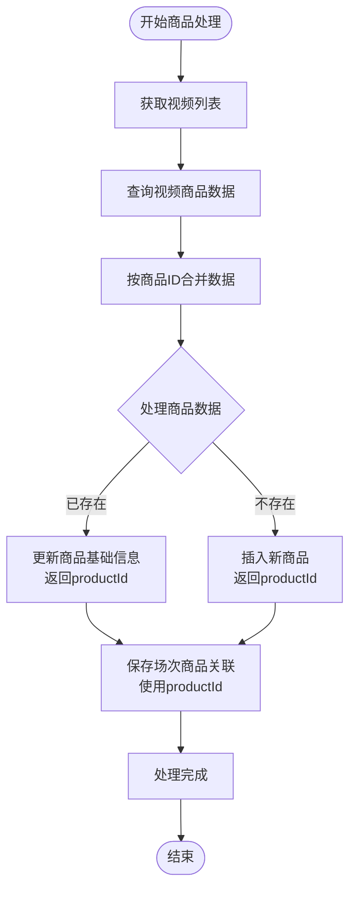

**图表来源**
- [LiveSessionServiceImpl.java:360-419](file://src/main/java/com/jiuyu/governance/business/performance/service/impl/LiveSessionServiceImpl.java#L360-L419)
- [LiveSessionServiceImpl.java:455-487](file://src/main/java/com/jiuyu/governance/business/performance/service/impl/LiveSessionServiceImpl.java#L455-L487)

#### Product 实体模型
商品基础信息实体模型，存储商品的基础属性：

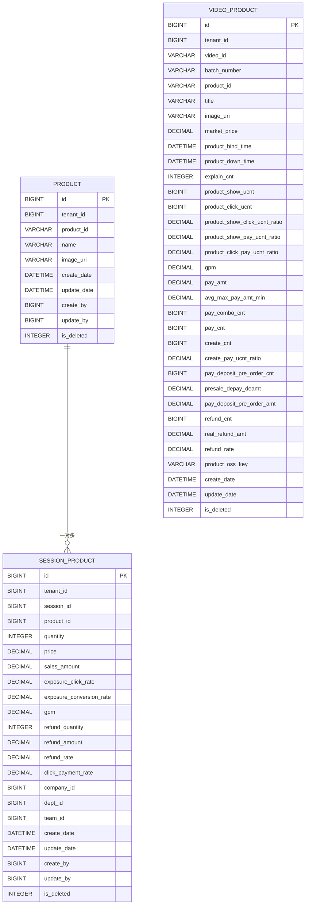

**图表来源**
- [Product.java:20-81](file://src/main/java/com/jiuyu/governance/business/performance/pojo/entity/Product.java#L20-L81)
- [VideoProduct.java:21-220](file://src/main/java/com/jiuyu/governance/business/performance/pojo/entity/VideoProduct.java#L21-L220)
- [SessionProduct.java:21-154](file://src/main/java/com/jiuyu/governance/business/performance/pojo/entity/SessionProduct.java#L21-L154)

#### 商品处理算法
服务实现了智能的商品数据处理算法，确保数据的准确性和完整性：

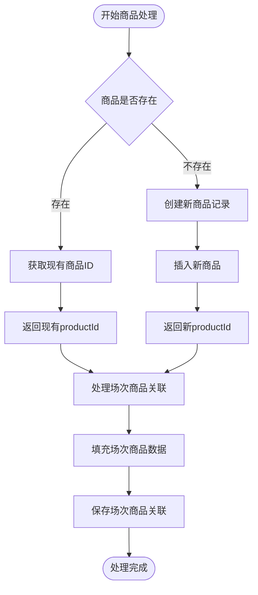

**图表来源**
- [LiveSessionServiceImpl.java:455-487](file://src/main/java/com/jiuyu/governance/business/performance/service/impl/LiveSessionServiceImpl.java#L455-L487)

**章节来源**
- [LiveSessionServiceImpl.java:354-520](file://src/main/java/com/jiuyu/governance/business/performance/service/impl/LiveSessionServiceImpl.java#L354-L520)
- [Product.java:1-81](file://src/main/java/com/jiuyu/governance/business/performance/pojo/entity/Product.java#L1-L81)
- [SessionProduct.java:1-154](file://src/main/java/com/jiuyu/governance/business/performance/pojo/entity/SessionProduct.java#L1-L154)
- [VideoProduct.java:1-220](file://src/main/java/com/jiuyu/governance/business/performance/pojo/entity/VideoProduct.java#L1-L220)

### 指标计算工具组件

#### MetricsUtil 工具类
提供统一的业务指标计算方法，确保数据计算的一致性和准确性：

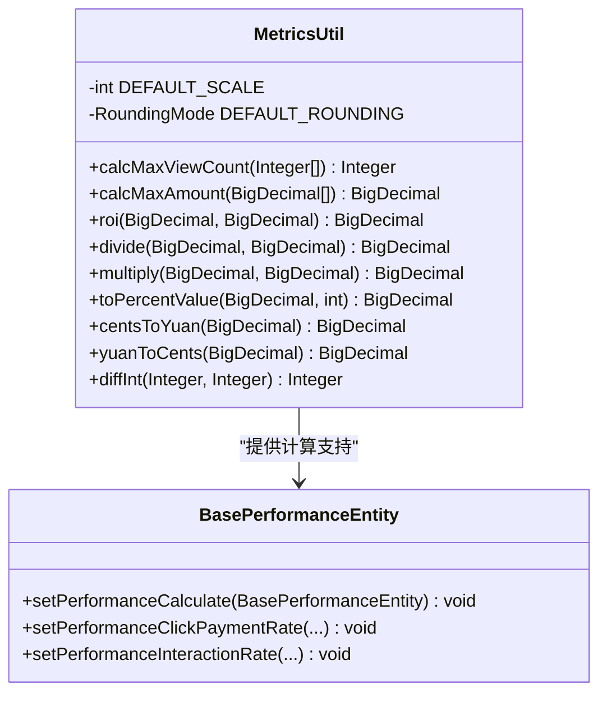

**图表来源**
- [MetricsUtil.java:14-290](file://src/main/java/com/jiuyu/governance/business/performance/utils/MetricsUtil.java#L14-L290)
- [BasePerformanceEntity.java:208-261](file://src/main/java/com/jiuyu/governance/business/performance/pojo/base/BasePerformanceEntity.java#L208-L261)

**章节来源**
- [MetricsUtil.java:197-226](file://src/main/java/com/jiuyu/governance/business/performance/utils/MetricsUtil.java#L197-L226)
- [BasePerformanceEntity.java:208-261](file://src/main/java/com/jiuyu/governance/business/performance/pojo/base/BasePerformanceEntity.java#L208-L261)

## 依赖关系分析

直播会话服务的依赖关系体现了清晰的分层架构：

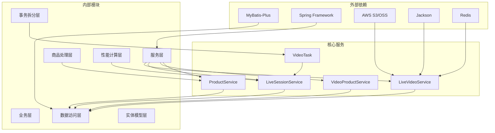

**图表来源**
- [LiveVideoServiceImpl.java:3-28](file://src/main/java/com/jiuyu/governance/business/performance/service/impl/LiveVideoServiceImpl.java#L3-L28)
- [LiveSessionService.java:1-38](file://src/main/java/com/jiuyu/governance/business/performance/service/LiveSessionService.java#L1-L38)
- [ProductServiceImpl.java:1-18](file://src/main/java/com/jiuyu/governance/business/performance/service/impl/ProductServiceImpl.java#L1-L18)

### 数据访问层设计

数据访问层采用MyBatis-Plus框架，提供了强大的ORM能力和灵活的查询方式：

| 组件 | 功能 | 特点 |
|------|------|------|
| LiveVideoMapper | 视频数据访问 | 支持复杂查询和批量操作 |
| LiveSessionMapper | 场次数据访问 | 提供乐观锁支持，继承BasePerformanceEntity |
| VideoProductMapper | 商品数据访问 | 支持过程数据存储 |
| ProductMapper | 商品基础信息访问 | 支持商品ID唯一性约束 |
| SessionProductMapper | 场次商品关联访问 | 支持productId精确关联 |
| BaseMapper | 基础数据操作 | 自动生成CRUD方法 |

**章节来源**
- [LiveVideoMapper.java:13-16](file://src/main/java/com/jiuyu/governance/business/performance/mapper/LiveVideoMapper.java#L13-L16)
- [LiveVideoMapper.xml:27-36](file://src/main/resources/mapper/performance/LiveVideoMapper.xml#L27-L36)

## 性能考虑

直播会话服务在设计时充分考虑了性能优化：

### 事务拆分机制
**更新** 采用新的事务拆分架构，将耗时操作移出事务边界：

- **阶段1（事务外）**: 加载视频OSS过程数据，使用`loadVideoOssData`方法
- **阶段2（事务内）**: 保存场次和商品数据
- **阶段3（事务内）**: 计算业绩指标，使用BasePerformanceEntity中间对象

### 并发处理机制
- **分布式锁**: 使用Redis分布式锁防止重复提交
- **线程池**: 异步处理商品数据上传
- **批量操作**: 支持批量数据处理减少数据库交互
- **乐观锁**: 场次数据更新使用乐观锁机制

### 缓存策略
- **过程数据缓存**: 使用OSS存储过程数据，支持快速检索
- **状态缓存**: 缓存视频处理状态避免重复查询
- **指标缓存**: 缓存计算结果支持快速响应
- **商品ID缓存**: 缓存商品基础信息避免重复查询

### 数据优化
- **索引设计**: 为常用查询字段建立索引
- **分页查询**: 支持大数据量的分页处理
- **连接池**: 优化数据库连接管理
- **唯一约束**: 商品ID唯一性约束确保数据完整性

## 故障排除指南

### 常见问题及解决方案

#### 视频数据处理异常
**问题**: 视频状态异常导致处理失败
**解决方案**: 
1. 检查ProcessStatus枚举定义
2. 验证数据库状态字段值
3. 查看相关日志信息

#### OSS数据加载异常
**问题**: `loadVideoOssData`方法执行失败
**解决方案**:
1. 检查`videoOssUrl`是否为空或格式正确
2. 验证OSS数据格式（NDJSON）是否正确
3. 确认zip压缩包内容是否完整
4. 查看日志中的具体错误信息

#### 区间指标计算异常
**问题**: 区间点击-成交率或区间互动率计算错误
**解决方案**:
1. 检查`BasePerformanceEntity`中间对象的构建逻辑
2. 验证`setPerformanceClickPaymentRate`和`setPerformanceInteractionRate`方法
3. 确认实时数据的时间戳去重逻辑
4. 验证跨天场景下的数据分割算法

#### 商品数据处理异常
**问题**: 商品基础信息与场次商品关联不匹配
**解决方案**:
1. 检查saveOrUpdateProduct返回的productId
2. 验证productId在SessionProduct中的正确性
3. 确认商品ID合并逻辑的准确性

#### 数据重复推送处理
**问题**: 同一视频多次推送导致数据不一致
**解决方案**:
1. 检查视频ID和批次号的唯一性
2. 验证状态判断逻辑
3. 确认关键指标比较算法

#### 性能指标计算错误
**问题**: ROI、退款率等指标计算异常
**解决方案**:
1. 检查MetricsUtil工具类方法
2. 验证BigDecimal精度设置
3. 确认除零保护机制

**章节来源**
- [LiveVideoServiceImpl.java:99-138](file://src/main/java/com/jiuyu/governance/business/performance/service/impl/LiveVideoServiceImpl.java#L99-L138)
- [LiveSessionServiceImpl.java:570-650](file://src/main/java/com/jiuyu/governance/business/performance/service/impl/LiveSessionServiceImpl.java#L570-L650)
- [LiveSessionServiceImpl.java:706-747](file://src/main/java/com/jiuyu/governance/business/performance/service/impl/LiveSessionServiceImpl.java#L706-L747)
- [MetricsUtil.java:221-226](file://src/main/java/com/jiuyu/governance/business/performance/utils/MetricsUtil.java#L221-L226)

## 结论

直播会话服务通过模块化的架构设计和完善的业务逻辑，为直播数据分析提供了全面的解决方案。服务具有以下特点：

1. **高可用性**: 采用分布式锁和事务机制确保数据一致性
2. **高性能**: 支持异步处理和批量操作提升系统性能
3. **可扩展性**: 清晰的分层架构便于功能扩展和维护
4. **可靠性**: 完善的错误处理和监控机制保障系统稳定运行
5. **数据完整性**: 通过saveOrUpdateProduct返回的productId确保商品数据的精确关联

**更新** 通过重大重构，服务现在具备了更强的性能计算能力：
- **简化OSS数据处理**: 直接使用现有`videoOssUrl`，移除了复杂的合并上传逻辑
- **引入中间对象模式**: BasePerformanceEntity作为区间指标计算的中间载体
- **增强区间计算**: 支持区间点击-成交率和区间互动率的精确计算
- **优化事务架构**: 采用阶段化事务拆分，提升系统整体性能

新的架构通过`loadVideoOssData`方法实现了更高效的OSS数据加载，通过BasePerformanceEntity中间对象模式支持了复杂的区间指标计算，为直播业绩分析提供了更准确、更高效的技术支撑。通过统一的接口设计和标准化的数据处理流程，服务能够有效支持多平台直播数据的接入和分析，为企业提供准确的直播业绩洞察。