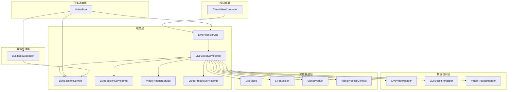
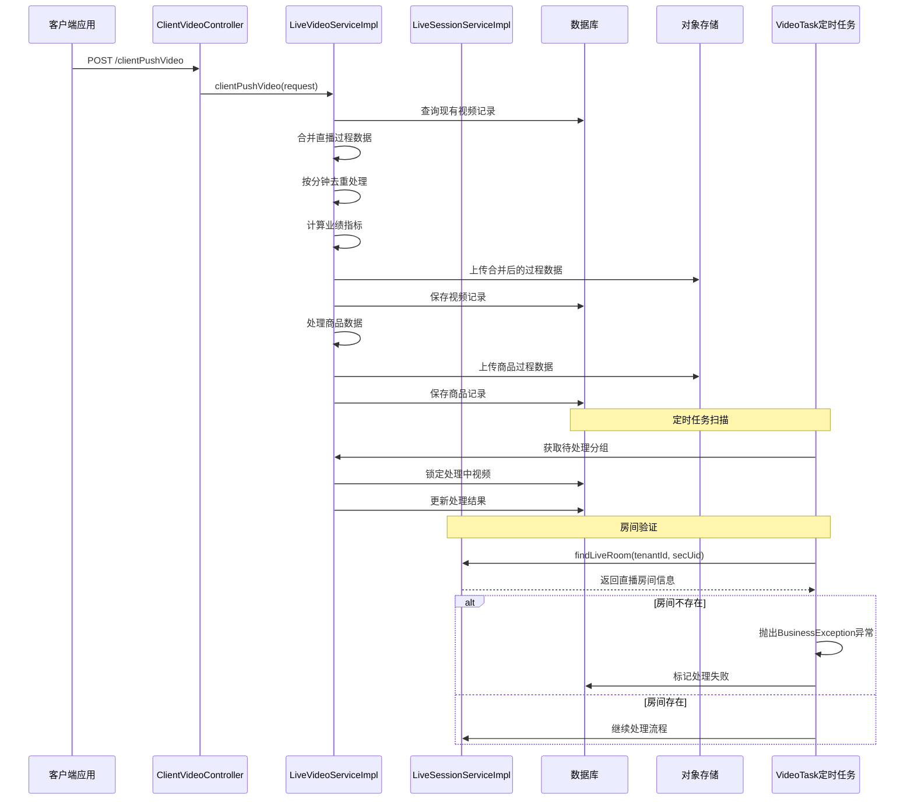
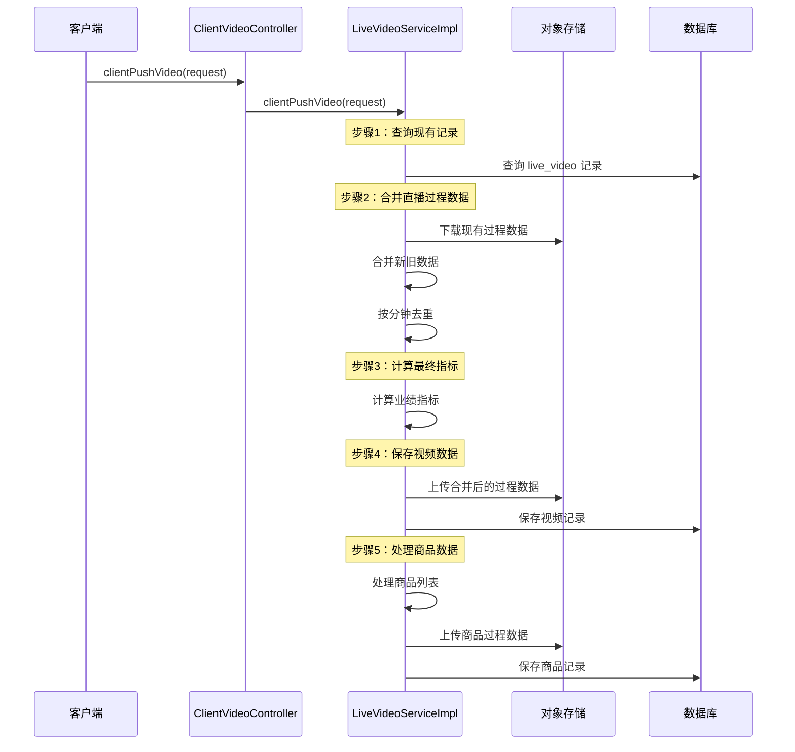
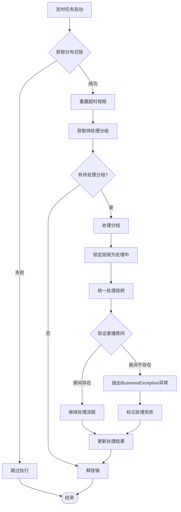
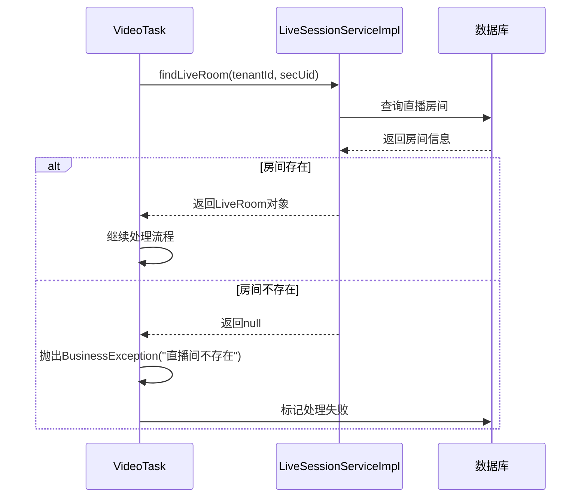
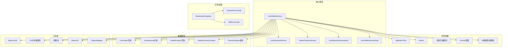
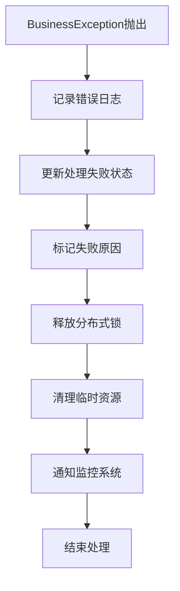

# 直播视频服务

<cite>
**本文档引用的文件**
- [ClientVideoController.java](file://src/main/java/com/jiuyu/governance/business/performance/controller/ClientVideoController.java)
- [LiveVideoService.java](file://src/main/java/com/jiuyu/governance/business/performance/service/LiveVideoService.java)
- [LiveVideoServiceImpl.java](file://src/main/java/com/jiuyu/governance/business/performance/service/impl/LiveVideoServiceImpl.java)
- [LiveVideoMapper.java](file://src/main/java/com/jiuyu/governance/business/performance/mapper/LiveVideoMapper.java)
- [LiveVideo.java](file://src/main/java/com/jiuyu/governance/business/performance/pojo/entity/LiveVideo.java)
- [ClientPushVideoRequest.java](file://src/main/java/com/jiuyu/governance/business/performance/pojo/request/ClientPushVideoRequest.java)
- [VideoProductRequest.java](file://src/main/java/com/jiuyu/governance/business/performance/pojo/request/VideoProductRequest.java)
- [OceanEngineProcessBo.java](file://src/main/java/com/jiuyu/governance/business/performance/pojo/bo/OceanEngineProcessBo.java)
- [CommodityProcessDataBo.java](file://src/main/java/com/jiuyu/governance/business/performance/pojo/bo/CommodityProcessDataBo.java)
- [ProcessStatus.java](file://src/main/java/com/jiuyu/governance/business/performance/pojo/constants/ProcessStatus.java)
- [LiveVideoMapper.xml](file://src/main/resources/mapper/performance/LiveVideoMapper.xml)
- [performance_tables.sql](file://src/main/resources/sql/performance_tables.sql)
- [VideoTask.java](file://src/main/java/com/jiuyu/governance/business/performance/task/VideoTask.java)
- [BasePerformanceEntity.java](file://src/main/java/com/jiuyu/governance/business/performance/pojo/base/BasePerformanceEntity.java)
- [BasePerformanceMetrics.java](file://src/main/java/com/jiuyu/governance/business/performance/pojo/base/BasePerformanceMetrics.java)
- [LiveSessionService.java](file://src/main/java/com/jiuyu/governance/business/performance/service/LiveSessionService.java)
- [LiveSessionServiceImpl.java](file://src/main/java/com/jiuyu/governance/business/performance/service/impl/LiveSessionServiceImpl.java)
- [VideoProcessContext.java](file://src/main/java/com/jiuyu/governance/business/performance/pojo/bo/VideoProcessContext.java)
- [BusinessException.java](file://src/main/java/com/jiuyu/governance/common/exceptions/BusinessException.java)
- [liveVideo.http](file://src/test/java/resources/liveVideo.http)
</cite>

## 更新摘要
**变更内容**
- 新增了更健壮的错误处理机制，在视频处理任务中当直播房间不存在时抛出BusinessException异常
- 增强了直播房间验证逻辑，确保数据处理的完整性和准确性
- 完善了异常处理流程，提高了系统的稳定性和可靠性

## 目录
1. [简介](#简介)
2. [项目结构](#项目结构)
3. [核心组件](#核心组件)
4. [架构概览](#架构概览)
5. [详细组件分析](#详细组件分析)
6. [依赖关系分析](#依赖关系分析)
7. [性能考虑](#性能考虑)
8. [故障排除指南](#故障排除指南)
9. [结论](#结论)

## 简介

直播视频服务是爱复盘治理平台的核心模块之一，负责处理直播视频数据的接收、存储、处理和分析。该服务支持多平台直播数据接入（抖音、快手、视频号），提供实时监控、数据分析和业绩评估功能。

系统采用微服务架构，通过分布式锁机制确保数据一致性，利用定时任务处理批量视频数据，结合对象存储服务实现过程数据的持久化管理。**最新版本**专注于客户端推送模式，移除了服务器间数据接收功能，提供更加简洁高效的直播数据处理流程。

**重大更新**：新增了更健壮的错误处理机制，当直播房间不存在时会抛出BusinessException异常，确保数据处理的完整性和系统的稳定性。

## 项目结构

直播视频服务位于 `src/main/java/com/jiuyu/governance/business/performance/` 目录下，采用典型的分层架构设计：

**图表来源**
- [ClientVideoController.java:1-67](file://src/main/java/com/jiuyu/governance/business/performance/controller/ClientVideoController.java#L1-L67)
- [LiveVideoServiceImpl.java:1-607](file://src/main/java/com/jiuyu/governance/business/performance/service/impl/LiveVideoServiceImpl.java#L1-L607)
- [LiveSessionServiceImpl.java:1-1241](file://src/main/java/com/jiuyu/governance/business/performance/service/impl/LiveSessionServiceImpl.java#L1-L1241)
- [BusinessException.java:1-48](file://src/main/java/com/jiuyu/governance/common/exceptions/BusinessException.java#L1-L48)

**章节来源**
- [ClientVideoController.java:1-67](file://src/main/java/com/jiuyu/governance/business/performance/controller/ClientVideoController.java#L1-L67)
- [LiveVideoService.java:1-83](file://src/main/java/com/jiuyu/governance/business/performance/service/LiveVideoService.java#L1-L83)

## 核心组件

### 控制器层

**ClientVideoController** 提供两个主要接口：
- `/api/governance/performance/video/clientPushVideo` - 客户端推送直播数据接口
- `/api/governance/performance/video/querySchedulePerformance` - 客户端查询排班业绩数据接口

**重要变更**：移除了原有的 `/api/governance/performance/video/receive` 服务器间数据接收接口。

### 服务层

**LiveVideoService** 接口现已简化，只保留核心功能：
- 视频处理状态管理（重置超时、获取分组、锁定处理）
- 视频处理结果更新（成功/失败）
- 客户端推送数据处理

**LiveVideoServiceImpl** 实现类提供完整的客户端推送处理逻辑：
- 客户端推送视频数据的完整处理流程
- 直播过程数据合并与去重
- 业绩指标计算与更新
- 商品数据处理与存储

### 数据访问层

**LiveVideoMapper** 和 **LiveSessionMapper** 基于 MyBatis-Plus 提供视频和场次数据的 CRUD 操作，支持复杂的查询条件和分组统计。

### 实体模型层

**LiveVideo** 实体类定义了视频数据的完整结构，包括：
- 基础信息：租户ID、批次号、视频ID
- 业绩指标：场观、销售额、退款、投放等
- 处理状态：待处理、处理中、成功、失败
- 平台信息：抖音、快手、视频号支持

**VideoProcessContext** 上下文类包含：
- 视频列表和场次信息
- OSS实时数据（合并后）
- 合并后上传到OSS的URL

**章节来源**
- [ClientVideoController.java:25-67](file://src/main/java/com/jiuyu/governance/business/performance/controller/ClientVideoController.java#L25-L67)
- [LiveVideoService.java:15-83](file://src/main/java/com/jiuyu/governance/business/performance/service/LiveVideoService.java#L15-L83)
- [LiveVideo.java:16-124](file://src/main/java/com/jiuyu/governance/business/performance/pojo/entity/LiveVideo.java#L16-L124)
- [VideoProcessContext.java:52-60](file://src/main/java/com/jiuyu/governance/business/performance/pojo/bo/VideoProcessContext.java#L52-L60)

## 架构概览

直播视频服务采用事件驱动的异步处理架构，专注于客户端推送模式：

**图表来源**
- [ClientVideoController.java:39-47](file://src/main/java/com/jiuyu/governance/business/performance/controller/ClientVideoController.java#L39-L47)
- [LiveVideoServiceImpl.java:200-248](file://src/main/java/com/jiuyu/governance/business/performance/service/impl/LiveVideoServiceImpl.java#L200-L248)
- [VideoTask.java:52-97](file://src/main/java/com/jiuyu/governance/business/performance/task/VideoTask.java#L52-L97)
- [VideoTask.java:224-228](file://src/main/java/com/jiuyu/governance/business/performance/task/VideoTask.java#L224-L228)

## 详细组件分析

### 客户端推送处理流程

客户端推送接口提供了完整的直播过程数据处理能力：

**图表来源**
- [ClientVideoController.java:43-47](file://src/main/java/com/jiuyu/governance/business/performance/controller/ClientVideoController.java#L43-L47)
- [LiveVideoServiceImpl.java:200-248](file://src/main/java/com/jiuyu/governance/business/performance/service/impl/LiveVideoServiceImpl.java#L200-L248)

### 定时任务处理机制

系统通过定时任务实现批量视频数据的异步处理，**新增了健壮的错误处理机制**：

**图表来源**
- [VideoTask.java:52-97](file://src/main/java/com/jiuyu/governance/business/performance/task/VideoTask.java#L52-L97)
- [VideoTask.java:128-197](file://src/main/java/com/jiuyu/governance/business/performance/task/VideoTask.java#L128-L197)
- [VideoTask.java:224-228](file://src/main/java/com/jiuyu/governance/business/performance/task/VideoTask.java#L224-L228)

**章节来源**
- [LiveVideoServiceImpl.java:58-197](file://src/main/java/com/jiuyu/governance/business/performance/service/impl/LiveVideoServiceImpl.java#L58-L197)
- [VideoTask.java:51-97](file://src/main/java/com/jiuyu/governance/business/performance/task/VideoTask.java#L51-L97)

### 直播房间验证机制

**新增功能**：视频处理任务中新增了直播房间验证机制，确保数据处理的完整性和准确性：

**图表来源**
- [VideoTask.java:224-228](file://src/main/java/com/jiuyu/governance/business/performance/task/VideoTask.java#L224-L228)
- [LiveSessionServiceImpl.java:127-138](file://src/main/java/com/jiuyu/governance/business/performance/service/impl/LiveSessionServiceImpl.java#L127-L138)

**章节来源**
- [VideoTask.java:224-228](file://src/main/java/com/jiuyu/governance/business/performance/task/VideoTask.java#L224-L228)
- [LiveSessionServiceImpl.java:127-138](file://src/main/java/com/jiuyu/governance/business/performance/service/impl/LiveSessionServiceImpl.java#L127-L138)

## 依赖关系分析

直播视频服务的依赖关系体现了清晰的分层架构：

**图表来源**
- [LiveVideoServiceImpl.java:1-607](file://src/main/java/com/jiuyu/governance/business/performance/service/impl/LiveVideoServiceImpl.java#L1-L607)
- [LiveVideoService.java:1-83](file://src/main/java/com/jiuyu/governance/business/performance/service/LiveVideoService.java#L1-L83)
- [LiveSessionServiceImpl.java:1-1241](file://src/main/java/com/jiuyu/governance/business/performance/service/impl/LiveSessionServiceImpl.java#L1-L1241)
- [BusinessException.java:1-48](file://src/main/java/com/jiuyu/governance/common/exceptions/BusinessException.java#L1-L48)

**章节来源**
- [LiveVideoServiceImpl.java:1-607](file://src/main/java/com/jiuyu/governance/business/performance/service/impl/LiveVideoServiceImpl.java#L1-L607)
- [LiveVideoService.java:1-83](file://src/main/java/com/jiuyu/governance/business/performance/service/LiveVideoService.java#L1-L83)

## 性能考虑

### 数据一致性保障

系统通过多种机制确保数据一致性：
- **分布式锁**：使用 Redis 实现分布式锁，防止并发处理冲突
- **事务管理**：关键操作使用 Spring 事务确保数据完整性
- **状态机控制**：严格的视频处理状态转换机制
- **异常处理**：新增的BusinessException机制确保错误处理的一致性

### 性能优化策略

1. **批量处理**：定时任务采用分组批量处理，提高处理效率
2. **并行计算**：商品数据处理使用线程池并行处理
3. **缓存机制**：合理使用 Redis 缓存热点数据
4. **异步处理**：过程数据上传采用异步方式，减少响应时间
5. **按分钟去重**：优化数据合并算法，提升处理速度
6. **早期验证**：直播房间验证在处理流程早期进行，避免无效计算

### 内存管理

- **流式处理**：大数据量处理时采用流式方式，避免内存溢出
- **连接池管理**：合理配置数据库和对象存储连接池
- **超时控制**：设置合理的超时时间，防止长时间占用资源
- **异常恢复**：BusinessException提供统一的异常恢复机制

## 故障排除指南

### 常见问题及解决方案

**视频处理超时**
- 检查分布式锁是否正确释放
- 验证 Redis 连接状态
- 查看定时任务执行日志

**数据不一致**
- 检查事务配置
- 验证数据库连接状态
- 确认幂等性设计

**性能问题**
- 监控线程池使用情况
- 检查数据库索引
- 优化查询条件

**客户端推送异常**
- 验证请求参数完整性
- 检查OSS存储权限
- 确认商品数据格式正确

**直播房间不存在异常**
- **新增问题**：当直播房间不存在时，系统会抛出BusinessException异常
- **解决方案**：检查直播房间配置，确认租户ID和secUid的正确性
- **预防措施**：在推送视频数据前验证直播房间是否存在

### 异常处理机制

**BusinessException异常处理流程**：

**图表来源**
- [BusinessException.java:1-48](file://src/main/java/com/jiuyu/governance/common/exceptions/BusinessException.java#L1-L48)
- [VideoTask.java:182-197](file://src/main/java/com/jiuyu/governance/business/performance/task/VideoTask.java#L182-L197)

### 日志分析

系统提供了详细的日志记录，包括：
- 视频处理状态变更日志
- 数据对比和更新日志
- 异常处理和错误日志
- 性能监控和耗时统计
- **新增**：BusinessException异常日志记录

**章节来源**
- [LiveVideoServiceImpl.java:200-248](file://src/main/java/com/jiuyu/governance/business/performance/service/impl/LiveVideoServiceImpl.java#L200-L248)
- [VideoTask.java:105-123](file://src/main/java/com/jiuyu/governance/business/performance/task/VideoTask.java#L105-L123)

## 结论

直播视频服务是一个设计完善的微服务系统，经过重构后具有以下特点：

1. **架构清晰**：采用分层架构，职责分离明确
2. **扩展性强**：支持多平台直播数据接入
3. **可靠性高**：通过多种机制确保数据一致性和系统稳定性
4. **性能优秀**：采用异步处理和批量操作提升整体性能
5. **简洁高效**：移除冗余功能，专注于客户端推送模式
6. **易于维护**：接口简化，代码结构更加清晰
7. **健壮性强**：新增的BusinessException异常处理机制确保系统在异常情况下也能保持稳定运行

**重大改进**：新增的直播房间验证机制和BusinessException异常处理机制显著提升了系统的健壮性和可靠性。当直播房间不存在时，系统能够及时发现并处理异常，避免无效的数据处理操作，同时提供清晰的错误信息用于问题诊断和解决。

该服务为爱复盘平台提供了强大的直播数据分析能力，能够满足大规模直播业务的实时监控和分析需求。**重构后的简洁架构和健壮的错误处理机制**使得系统更加稳定可靠，为业务发展提供了更好的技术支撑。