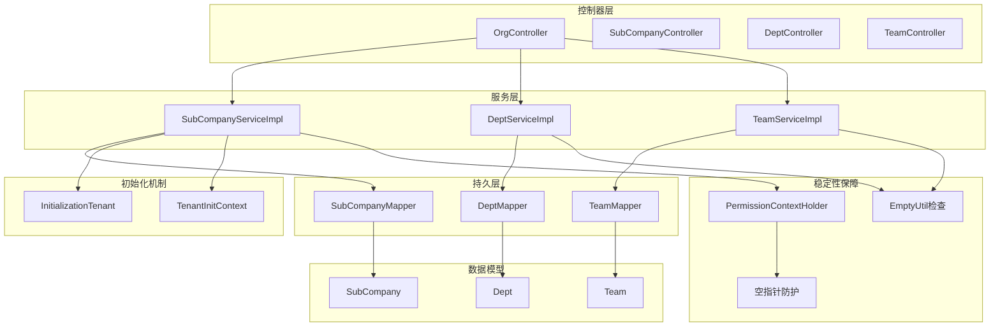
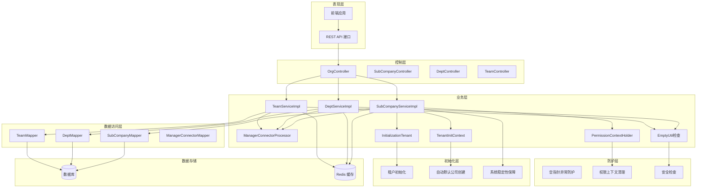
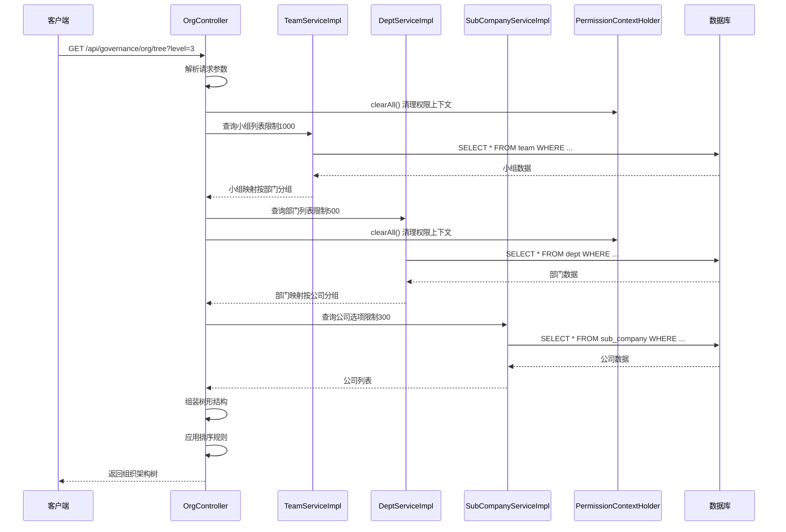
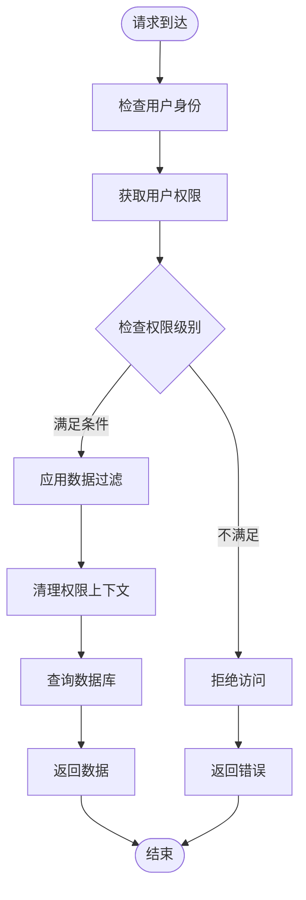
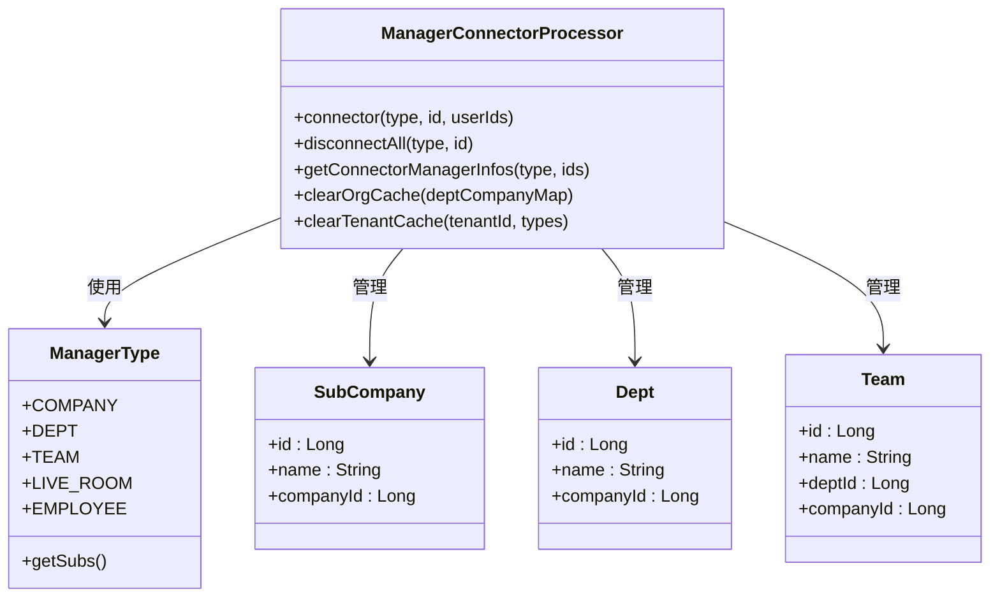
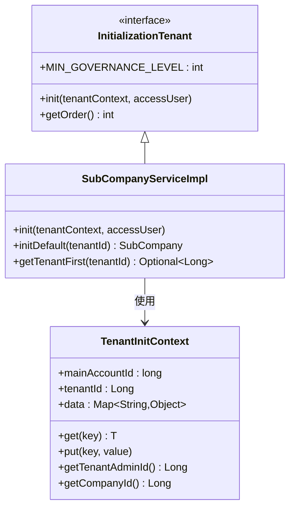
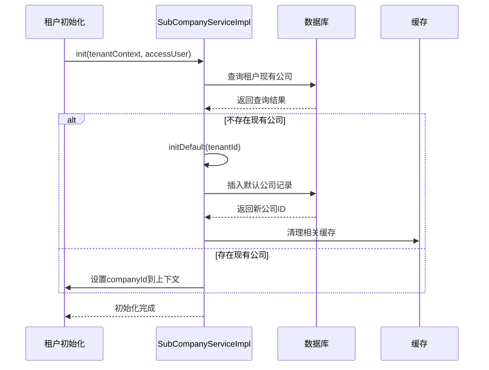
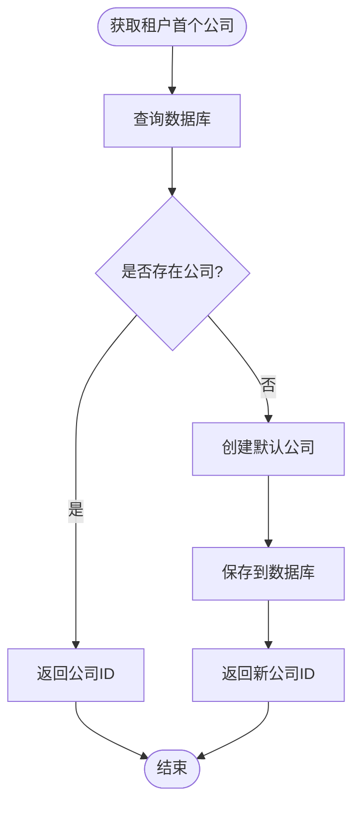
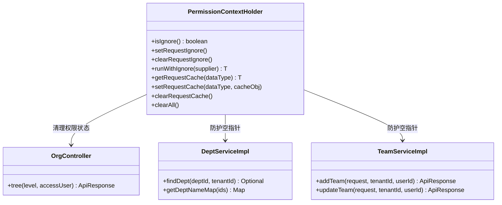
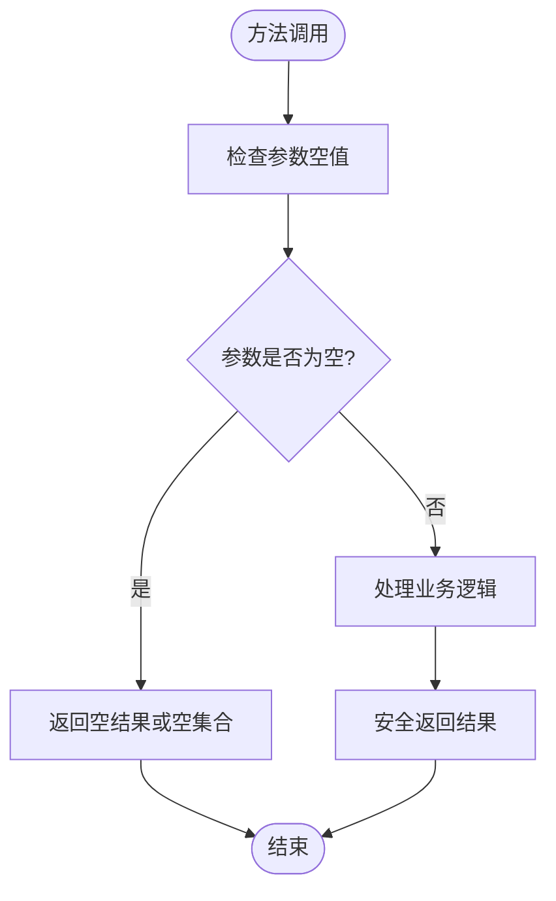

# 组织架构 API 文档

<cite>
**本文档引用的文件**
- [OrgController.java](file://src/main/java/com/jiuyu/governance/business/org/controller/OrgController.java)
- [SubCompanyServiceImpl.java](file://src/main/java/com/jiuyu/governance/business/org/service/impl/SubCompanyServiceImpl.java)
- [SubCompanyService.java](file://src/main/java/com/jiuyu/governance/business/org/service/SubCompanyService.java)
- [DeptServiceImpl.java](file://src/main/java/com/jiuyu/governance/business/org/service/impl/DeptServiceImpl.java)
- [TeamServiceImpl.java](file://src/main/java/com/jiuyu/governance/business/org/service/impl/TeamServiceImpl.java)
- [OrgTreeResponse.java](file://src/main/java/com/jiuyu/governance/business/org/pojo/response/OrgTreeResponse.java)
- [DeptSelectQueryRequest.java](file://src/main/java/com/jiuyu/governance/business/org/pojo/request/DeptSelectQueryRequest.java)
- [SubCompanySelectQueryRequest.java](file://src/main/java/com/jiuyu/governance/business/org/pojo/request/SubCompanySelectQueryRequest.java)
- [TeamSelectQueryRequest.java](file://src/main/java/com/jiuyu/governance/business/org/pojo/request/TeamSelectQueryRequest.java)
- [ManagerType.java](file://src/main/java/com/jiuyu/governance/business/org/pojo/constants/ManagerType.java)
- [InitializationTenant.java](file://src/main/java/com/jiuyu/governance/common/init/InitializationTenant.java)
- [TenantInitContext.java](file://src/main/java/com/jiuyu/governance/common/init/TenantInitContext.java)
- [EmployeeServiceImpl.java](file://src/main/java/com/jiuyu/governance/business/rbac/service/impl/EmployeeServiceImpl.java)
- [PermissionContextHolder.java](file://src/main/java/com/jiuyu/governance/plugins/oauth/data/supports/PermissionContextHolder.java)
</cite>

## 更新摘要
**变更内容**
- 新增默认公司初始化机制，包含`initDefault`方法和自动创建逻辑
- `getTenantFirst`方法增强，具备自动默认公司创建能力
- 实现`InitializationTenant`接口，提供租户初始化功能
- 改进系统稳定性，防止空指针异常
- 新增租户初始化上下文管理
- **新增** OrgController中的权限上下文清理机制
- **新增** DeptServiceImpl和TeamServiceImpl中的null检查增强
- **新增** 统一的空指针异常防护体系

## 目录
1. [简介](#简介)
2. [项目结构](#项目结构)
3. [核心组件](#核心组件)
4. [架构概览](#架构概览)
5. [详细组件分析](#详细组件分析)
6. [租户初始化机制](#租户初始化机制)
7. [稳定性保障机制](#稳定性保障机制)
8. [依赖关系分析](#依赖关系分析)
9. [性能考虑](#性能考虑)
10. [故障排除指南](#故障排除指南)
11. [结论](#结论)

## 简介

本项目是一个企业级组织架构管理系统，专注于提供完整的组织结构管理功能。系统采用三层组织架构设计，包括公司、部门和小组三个层级，为前端提供灵活的组织架构树形结构展示。

该系统的核心特色包括：
- 多层级组织架构管理（公司 → 部门 → 小组）
- 基于数据权限的访问控制
- 实时缓存管理机制
- 完整的 CRUD 操作支持
- 灵活的查询过滤功能
- **新增** 自动默认公司初始化机制
- **新增** 租户级组织架构管理
- **新增** 系统稳定性保障机制
- **新增** 统一的空指针异常防护体系

## 项目结构

组织架构模块采用标准的分层架构设计，主要包含以下层次：



**图表来源**
- [OrgController.java:1-149](file://src/main/java/com/jiuyu/governance/business/org/controller/OrgController.java#L1-L149)
- [SubCompanyServiceImpl.java:1-406](file://src/main/java/com/jiuyu/governance/business/org/service/impl/SubCompanyServiceImpl.java#L1-L406)
- [DeptServiceImpl.java:1-416](file://src/main/java/com/jiuyu/governance/business/org/service/impl/DeptServiceImpl.java#L1-L416)
- [TeamServiceImpl.java:1-355](file://src/main/java/com/jiuyu/governance/business/org/service/impl/TeamServiceImpl.java#L1-L355)
- [InitializationTenant.java:1-42](file://src/main/java/com/jiuyu/governance/common/init/InitializationTenant.java#L1-L42)
- [TenantInitContext.java:1-69](file://src/main/java/com/jiuyu/governance/common/init/TenantInitContext.java#L1-L69)
- [PermissionContextHolder.java:1-129](file://src/main/java/com/jiuyu/governance/plugins/oauth/data/supports/PermissionContextHolder.java#L1-L129)

**章节来源**
- [OrgController.java:30-40](file://src/main/java/com/jiuyu/governance/business/org/controller/OrgController.java#L30-L40)
- [SubCompanyServiceImpl.java:43-52](file://src/main/java/com/jiuyu/governance/business/org/service/impl/SubCompanyServiceImpl.java#L43-L52)
- [DeptServiceImpl.java:45-54](file://src/main/java/com/jiuyu/governance/business/org/service/impl/DeptServiceImpl.java#L45-L54)
- [TeamServiceImpl.java:44-53](file://src/main/java/com/jiuyu/governance/business/org/service/impl/TeamServiceImpl.java#L44-L53)

## 核心组件

### 组织架构控制器 (OrgController)

组织架构控制器是整个模块的入口点，负责处理组织架构树形结构的查询请求。该控制器提供了灵活的层级控制功能，可以根据需要返回不同层级的组织结构，并**新增了权限上下文清理机制**。

**主要功能特性：**
- 支持 1-3 级别的组织架构查询
- 自动应用数据权限过滤
- 智能排除重复数据逻辑
- 按 sort 字段升序排序
- 支持多层级嵌套结构
- **新增** 每次查询后自动清理权限上下文
- **新增** 防止权限状态污染和内存泄漏

**更新** 新增了在部门查询和公司查询后调用`PermissionContextHolder.clearAll()`的方法，确保权限上下文的正确清理。

**章节来源**
- [OrgController.java:49-145](file://src/main/java/com/jiuyu/governance/business/org/controller/OrgController.java#L49-L145)

### 子公司服务实现 (SubCompanyServiceImpl)

子公司服务实现了完整的子公司管理功能，包括新增、修改、删除和查询操作。该服务集成了数据权限控制、缓存管理和**新增的租户初始化机制**。

**核心功能：**
- 子公司数量限制管理（最大 300 个）
- 员工绑定检查防止误删
- 部门依赖检查
- 租户属性配额管理
- 管理员连接器集成
- **新增** 默认公司自动初始化
- **新增** 租户级组织架构管理
- **新增** 系统稳定性保障

**更新** 新增了`initDefault`私有方法用于提取默认公司初始化逻辑，并增强了`getTenantFirst`方法的自动创建能力。

**章节来源**
- [SubCompanyServiceImpl.java:94-140](file://src/main/java/com/jiuyu/governance/business/org/service/impl/SubCompanyServiceImpl.java#L94-L140)
- [SubCompanyServiceImpl.java:129-142](file://src/main/java/com/jiuyu/governance/business/org/service/impl/SubCompanyServiceImpl.java#L129-L142)
- [SubCompanyServiceImpl.java:151-163](file://src/main/java/com/jiuyu/governance/business/org/service/impl/SubCompanyServiceImpl.java#L151-L163)
- [SubCompanyServiceImpl.java:182-225](file://src/main/java/com/jiuyu/governance/business/org/service/impl/SubCompanyServiceImpl.java#L182-L225)
- [SubCompanyServiceImpl.java:227-252](file://src/main/java/com/jiuyu/governance/business/org/service/impl/SubCompanyServiceImpl.java#L227-L252)

### 部门服务实现 (DeptServiceImpl)

部门服务提供了全面的部门管理能力，支持复杂的查询过滤和权限控制。该服务特别注重数据完整性和业务规则的执行，并**增强了null检查以防止空指针异常**。

**关键特性：**
- 部门数量限制（最大 500 个）
- 员工绑定验证
- 跨公司权限检查
- 管理员连接器集成
- 多维度查询支持
- **新增** 统一的空指针异常防护
- **新增** 安全的Optional使用模式

**更新** 增强了多个方法中的空指针检查，包括`findDept`、`getDeptNameMap`、`options`等方法，确保在处理空值时不会抛出异常。

**章节来源**
- [DeptServiceImpl.java:84-135](file://src/main/java/com/jiuyu/governance/business/org/service/impl/DeptServiceImpl.java#L84-L135)
- [DeptServiceImpl.java:137-186](file://src/main/java/com/jiuyu/governance/business/org/service/impl/DeptServiceImpl.java#L137-L186)
- [DeptServiceImpl.java:228-260](file://src/main/java/com/jiuyu/governance/business/org/service/impl/DeptServiceImpl.java#L228-L260)

### 小组服务实现 (TeamServiceImpl)

小组服务实现了精细的小组管理功能，支持复杂的层级关系和权限控制。该服务特别关注小组与部门、公司的关联关系维护，并**增强了null检查以防止空指针异常**。

**主要功能：**
- 小组数量限制（最大 1000 个）
- 员工绑定检查
- 部门变更处理
- 公司层级同步
- 管理员权限管理
- **新增** 统一的空指针异常防护
- **新增** 安全的Optional使用模式

**更新** 增强了多个方法中的空指针检查，包括`addTeam`、`updateTeam`、`deleteTeam`、`getTeamList`等方法，确保在处理空值时不会抛出异常。

**章节来源**
- [TeamServiceImpl.java:80-133](file://src/main/java/com/jiuyu/governance/business/org/service/impl/TeamServiceImpl.java#L80-L133)
- [TeamServiceImpl.java:135-189](file://src/main/java/com/jiuyu/governance/business/org/service/impl/TeamServiceImpl.java#L135-L189)
- [TeamServiceImpl.java:224-265](file://src/main/java/com/jiuyu/governance/business/org/service/impl/TeamServiceImpl.java#L224-L265)

## 架构概览

系统采用经典的三层架构模式，结合了现代化的企业级开发实践和**新增的租户初始化机制**以及**统一的稳定性保障体系**：



**图表来源**
- [OrgController.java:36-46](file://src/main/java/com/jiuyu/governance/business/org/controller/OrgController.java#L36-L46)
- [SubCompanyServiceImpl.java:54-60](file://src/main/java/com/jiuyu/governance/business/org/service/impl/SubCompanyServiceImpl.java#L54-L60)
- [DeptServiceImpl.java:56-62](file://src/main/java/com/jiuyu/governance/business/org/service/impl/DeptServiceImpl.java#L56-L62)
- [TeamServiceImpl.java:55-61](file://src/main/java/com/jiuyu/governance/business/org/service/impl/TeamServiceImpl.java#L55-L61)
- [InitializationTenant.java:13-29](file://src/main/java/com/jiuyu/governance/common/init/InitializationTenant.java#L13-L29)
- [TenantInitContext.java:15-48](file://src/main/java/com/jiuyu/governance/common/init/TenantInitContext.java#L15-L48)
- [PermissionContextHolder.java:17-128](file://src/main/java/com/jiuyu/governance/plugins/oauth/data/supports/PermissionContextHolder.java#L17-L128)

## 详细组件分析

### 组织架构树形结构生成流程

组织架构树形结构的生成是一个复杂的数据处理过程，涉及多层级的数据查询和组装，并**新增了权限上下文清理机制**：



**图表来源**
- [OrgController.java:66-145](file://src/main/java/com/jiuyu/governance/business/org/controller/OrgController.java#L66-L145)
- [TeamServiceImpl.java:304-329](file://src/main/java/com/jiuyu/governance/business/org/service/impl/TeamServiceImpl.java#L304-L329)
- [DeptServiceImpl.java:356-382](file://src/main/java/com/jiuyu/governance/business/org/service/impl/DeptServiceImpl.java#L356-L382)
- [SubCompanyServiceImpl.java:299-313](file://src/main/java/com/jiuyu/governance/business/org/service/impl/SubCompanyServiceImpl.java#L299-L313)

### 数据权限控制机制

系统实现了基于角色的数据权限控制，确保用户只能访问其权限范围内的组织数据，并**新增了权限上下文清理机制**：



**图表来源**
- [DeptSelectQueryRequest.java:63-114](file://src/main/java/com/jiuyu/governance/business/org/pojo/request/DeptSelectQueryRequest.java#L63-L114)
- [SubCompanySelectQueryRequest.java:57-108](file://src/main/java/com/jiuyu/governance/business/org/pojo/request/SubCompanySelectQueryRequest.java#L57-L108)
- [TeamSelectQueryRequest.java:55-106](file://src/main/java/com/jiuyu/governance/business/org/pojo/request/TeamSelectQueryRequest.java#L55-L106)

### 管理员连接器处理流程

管理员连接器负责管理组织层级与用户之间的关联关系：



**图表来源**
- [ManagerType.java:19-49](file://src/main/java/com/jiuyu/governance/business/org/pojo/constants/ManagerType.java#L19-L49)
- [SubCompanyServiceImpl.java:134-137](file://src/main/java/com/jiuyu/governance/business/org/service/impl/SubCompanyServiceImpl.java#L134-L137)
- [DeptServiceImpl.java:129-133](file://src/main/java/com/jiuyu/governance/business/org/service/impl/DeptServiceImpl.java#L129-L133)
- [TeamServiceImpl.java:127-131](file://src/main/java/com/jiuyu/governance/business/org/service/impl/TeamServiceImpl.java#L127-L131)

**章节来源**
- [ManagerType.java:52-76](file://src/main/java/com/jiuyu/governance/business/org/pojo/constants/ManagerType.java#L52-L76)

## 租户初始化机制

**新增** 系统引入了完整的租户初始化机制，确保每个租户都有默认的组织架构基础。

### InitializationTenant 接口

`InitializationTenant`接口定义了租户初始化的标准流程：



**图表来源**
- [InitializationTenant.java:14-29](file://src/main/java/com/jiuyu/governance/common/init/InitializationTenant.java#L14-L29)
- [TenantInitContext.java:15-68](file://src/main/java/com/jiuyu/governance/common/init/TenantInitContext.java#L15-L68)
- [SubCompanyServiceImpl.java:112-120](file://src/main/java/com/jiuyu/governance/business/org/service/impl/SubCompanyServiceImpl.java#L112-L120)

### 默认公司初始化流程

系统实现了智能的默认公司初始化机制，确保租户首次使用时有可用的组织架构：



**图表来源**
- [SubCompanyServiceImpl.java:112-120](file://src/main/java/com/jiuyu/governance/business/org/service/impl/SubCompanyServiceImpl.java#L112-L120)
- [SubCompanyServiceImpl.java:129-142](file://src/main/java/com/jiuyu/governance/business/org/service/impl/SubCompanyServiceImpl.java#L129-L142)

### 自动默认公司创建机制

`getTenantFirst`方法现在具备自动创建默认公司的能力，防止系统空指针异常：



**图表来源**
- [SubCompanyServiceImpl.java:151-163](file://src/main/java/com/jiuyu/governance/business/org/service/impl/SubCompanyServiceImpl.java#L151-L163)
- [SubCompanyServiceImpl.java:129-142](file://src/main/java/com/jiuyu/governance/business/org/service/impl/SubCompanyServiceImpl.java#L129-L142)

**章节来源**
- [InitializationTenant.java:13-41](file://src/main/java/com/jiuyu/governance/common/init/InitializationTenant.java#L13-L41)
- [TenantInitContext.java:15-68](file://src/main/java/com/jiuyu/governance/common/init/TenantInitContext.java#L15-L68)
- [SubCompanyServiceImpl.java:112-163](file://src/main/java/com/jiuyu/governance/business/org/service/impl/SubCompanyServiceImpl.java#L112-L163)

## 稳定性保障机制

**新增** 系统引入了完整的稳定性保障机制，包括权限上下文清理和统一的空指针异常防护。

### 权限上下文清理机制

`PermissionContextHolder`类提供了统一的权限上下文管理，确保每次请求后的状态正确清理：



**图表来源**
- [PermissionContextHolder.java:17-128](file://src/main/java/com/jiuyu/governance/plugins/oauth/data/supports/PermissionContextHolder.java#L17-L128)
- [OrgController.java:79-92](file://src/main/java/com/jiuyu/governance/business/org/controller/OrgController.java#L79-L92)
- [DeptServiceImpl.java:288-316](file://src/main/java/com/jiuyu/governance/business/org/service/impl/DeptServiceImpl.java#L288-L316)
- [TeamServiceImpl.java:89-133](file://src/main/java/com/jiuyu/governance/business/org/service/impl/TeamServiceImpl.java#L89-L133)

### 统一空指针异常防护

系统实现了统一的空指针异常防护体系，确保所有服务层方法都能安全处理空值：



**图表来源**
- [DeptServiceImpl.java:305-316](file://src/main/java/com/jiuyu/governance/business/org/service/impl/DeptServiceImpl.java#L305-L316)
- [TeamServiceImpl.java:342-353](file://src/main/java/com/jiuyu/governance/business/org/service/impl/TeamServiceImpl.java#L342-L353)

### 空指针异常防护实现

系统在多个关键位置实现了空指针异常防护：

1. **部门服务防护**：
   - `findDept`方法：安全返回Optional
   - `getDeptNameMap`方法：空集合检查
   - `options`方法：空集合检查

2. **小组服务防护**：
   - `addTeam`方法：Optional检查
   - `updateTeam`方法：Optional检查
   - `getTeamList`方法：空集合检查

3. **控制器防护**：
   - `tree`方法：权限上下文清理
   - 多处空值检查和安全返回

**章节来源**
- [PermissionContextHolder.java:17-128](file://src/main/java/com/jiuyu/governance/plugins/oauth/data/supports/PermissionContextHolder.java#L17-L128)
- [OrgController.java:79-92](file://src/main/java/com/jiuyu/governance/business/org/controller/OrgController.java#L79-L92)
- [DeptServiceImpl.java:288-316](file://src/main/java/com/jiuyu/governance/business/org/service/impl/DeptServiceImpl.java#L288-L316)
- [TeamServiceImpl.java:342-353](file://src/main/java/com/jiuyu/governance/business/org/service/impl/TeamServiceImpl.java#L342-L353)

## 依赖关系分析

系统中的组件依赖关系清晰明确，遵循了良好的分层架构原则，并新增了租户初始化相关的依赖和稳定性保障依赖：

```mermaid
graph LR
subgraph "外部依赖"
MP[MyBatis Plus]
SLF4J[SLF4J 日志]
Hutool[Hutool 工具库]
EmptyUtil[EmptyUtil判空工具]
end
subgraph "内部模块"
Framework[框架基础]
RBAC[RBAC 权限]
Plugins[插件系统]
Init[初始化系统]
Stability[稳定性保障]
End
subgraph "业务模块"
Org[组织架构]
Performance[绩效管理]
Room[直播间管理]
Emp[员工管理]
end
subgraph "新增依赖"
IT[InitializationTenant]
TIC[TenantInitContext]
SCS[SubCompanyServiceImpl]
EMP[EmployeeServiceImpl]
PCH[PermissionContextHolder]
EUC[EmptyUtil检查]
end
MP --> Org
SLF4J --> Org
Hutool --> Org
Framework --> Org
RBAC --> Org
Plugins --> Org
Init --> IT
IT --> TIC
TIC --> SCS
SCS --> EMP
Org --> Performance
Org --> Room
Emp --> Org
Stability --> PCH
Stability --> EUC
PCH --> Org
EUC --> Org
```

**图表来源**
- [SubCompanyServiceImpl.java:15-16](file://src/main/java/com/jiuyu/governance/business/org/service/impl/SubCompanyServiceImpl.java#L15-L16)
- [EmployeeServiceImpl.java:492-496](file://src/main/java/com/jiuyu/governance/business/rbac/service/impl/EmployeeServiceImpl.java#L492-L496)
- [InitializationTenant.java:1-42](file://src/main/java/com/jiuyu/governance/common/init/InitializationTenant.java#L1-L42)
- [TenantInitContext.java:1-69](file://src/main/java/com/jiuyu/governance/common/init/TenantInitContext.java#L1-L69)
- [PermissionContextHolder.java:1-129](file://src/main/java/com/jiuyu/governance/plugins/oauth/data/supports/PermissionContextHolder.java#L1-L129)

**章节来源**
- [SubCompanyServiceImpl.java:14-31](file://src/main/java/com/jiuyu/governance/business/org/service/impl/SubCompanyServiceImpl.java#L14-L31)
- [DeptServiceImpl.java:13-33](file://src/main/java/com/jiuyu/governance/business/org/service/impl/DeptServiceImpl.java#L13-L33)
- [TeamServiceImpl.java:12-32](file://src/main/java/com/jiuyu/governance/business/org/service/impl/TeamServiceImpl.java#L12-L32)

## 性能考虑

系统在设计时充分考虑了性能优化，采用了多种策略来提升响应速度和资源利用率，并新增了租户初始化的性能考量和稳定性优化：

### 缓存策略
- **多级缓存架构**：结合本地缓存和分布式缓存
- **智能失效机制**：基于组织变更自动清理相关缓存
- **批量查询优化**：减少数据库查询次数
- **租户缓存隔离**：确保租户间数据隔离

### 查询优化
- **分页查询**：默认限制查询数量防止内存溢出
- **索引优化**：关键字段建立适当索引
- **懒加载机制**：按需加载子节点数据
- **默认公司缓存**：缓存租户默认公司信息

### 连接池管理
- **数据库连接池**：合理配置连接池大小
- **事务管理**：优化事务边界减少锁竞争

### 初始化性能优化
- **延迟初始化**：仅在需要时创建默认公司
- **并发安全**：确保多租户并发初始化的安全性
- **资源复用**：复用数据库连接和缓存资源

### 稳定性优化
- **权限上下文清理**：防止权限状态污染和内存泄漏
- **空指针异常防护**：统一的null检查机制
- **异常恢复机制**：确保系统在异常情况下仍能正常运行

## 故障排除指南

### 常见问题及解决方案

**1. 组织架构树查询异常**
- 检查数据权限配置
- 验证层级参数有效性
- 确认缓存状态正常
- **新增** 检查权限上下文清理是否正常执行

**2. 数据重复问题**
- 检查唯一性约束
- 验证业务规则执行
- 查看日志输出定位问题

**3. 权限访问失败**
- 确认用户权限配置
- 检查数据权限过滤
- 验证租户隔离设置
- **新增** 检查权限上下文状态

**4. 租户初始化失败**
- 检查数据库连接状态
- 验证租户ID有效性
- 确认默认公司创建权限
- 查看初始化日志输出

**5. 空指针异常**
- 确认`getTenantFirst`方法的空值处理
- 验证默认公司初始化逻辑
- 检查租户上下文数据完整性
- **新增** 检查Optional使用是否正确
- **新增** 验证空指针防护机制是否生效

**6. 权限状态污染**
- 检查`PermissionContextHolder.clearAll()`调用
- 验证权限上下文清理时机
- 确认请求生命周期内状态一致性

**章节来源**
- [OrgController.java:54-61](file://src/main/java/com/jiuyu/governance/business/org/controller/OrgController.java#L54-L61)
- [SubCompanyServiceImpl.java:107-110](file://src/main/java/com/jiuyu/governance/business/org/service/impl/SubCompanyServiceImpl.java#L107-L110)
- [DeptServiceImpl.java:105-108](file://src/main/java/com/jiuyu/governance/business/org/service/impl/DeptServiceImpl.java#L105-L108)
- [SubCompanyServiceImpl.java:151-163](file://src/main/java/com/jiuyu/governance/business/org/service/impl/SubCompanyServiceImpl.java#L151-L163)
- [PermissionContextHolder.java:123-128](file://src/main/java/com/jiuyu/governance/plugins/oauth/data/supports/PermissionContextHolder.java#L123-L128)

## 结论

本组织架构 API 系统提供了完整的企业级组织管理解决方案，具有以下优势：

**技术优势：**
- 清晰的分层架构设计
- 完善的数据权限控制
- 高效的缓存管理机制
- 灵活的查询过滤功能
- **新增** 自动默认公司初始化机制
- **新增** 租户级组织架构管理
- **新增** 系统稳定性保障机制
- **新增** 统一的空指针异常防护体系
- **新增** 权限上下文清理机制

**业务价值：**
- 支持多层级组织架构管理
- 提供实时数据同步能力
- 具备良好的扩展性
- 满足企业级应用需求
- **新增** 确保租户初始化的可靠性
- **新增** 防止系统空指针异常
- **新增** 提升系统整体稳定性

**技术亮点：**
- `initDefault`方法提取默认公司初始化逻辑，提高代码可维护性
- `getTenantFirst`方法包含自动默认公司创建机制，确保系统稳定性和防止空指针异常
- 实现`InitializationTenant`接口，提供标准化的租户初始化流程
- 新增`TenantInitContext`上下文管理，支持租户初始化数据传递
- **新增** `PermissionContextHolder`类提供统一的权限上下文管理
- **新增** 统一的空指针异常防护体系，确保所有服务层方法的安全性
- **新增** 每次查询后的权限上下文自动清理机制

该系统为企业提供了可靠的组织架构管理基础，为后续的功能扩展奠定了坚实的技术基础。新增的租户初始化机制、稳定性保障机制和空指针异常防护体系进一步提升了系统的健壮性和用户体验，确保每个租户都能获得一致且可靠的服务体验。

**更新总结：**
本次更新重点关注系统的稳定性改进，通过引入权限上下文清理机制和统一的空指针异常防护体系，显著提升了系统的可靠性和安全性。这些改进确保了系统在高并发和复杂业务场景下的稳定运行，为用户提供更加可靠的组织管理服务。