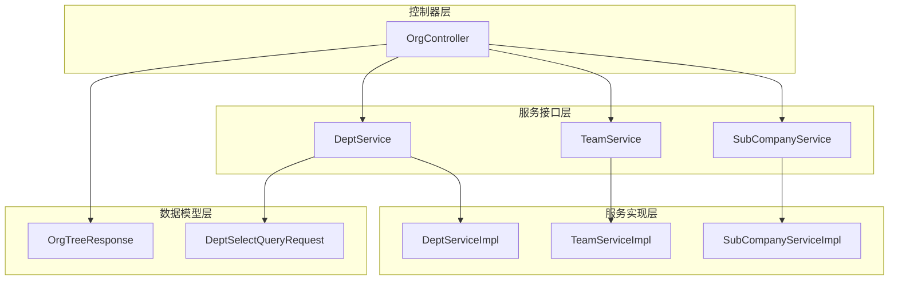
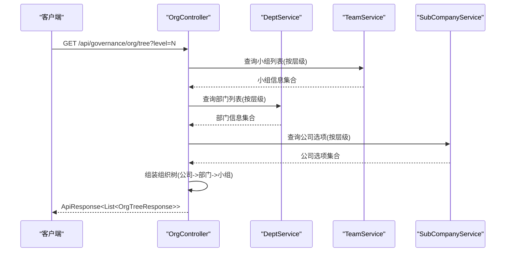
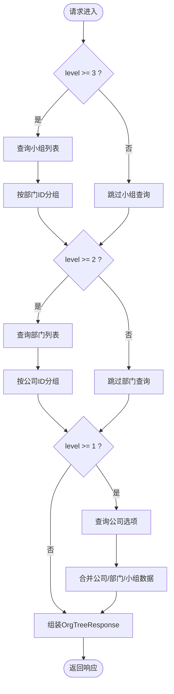
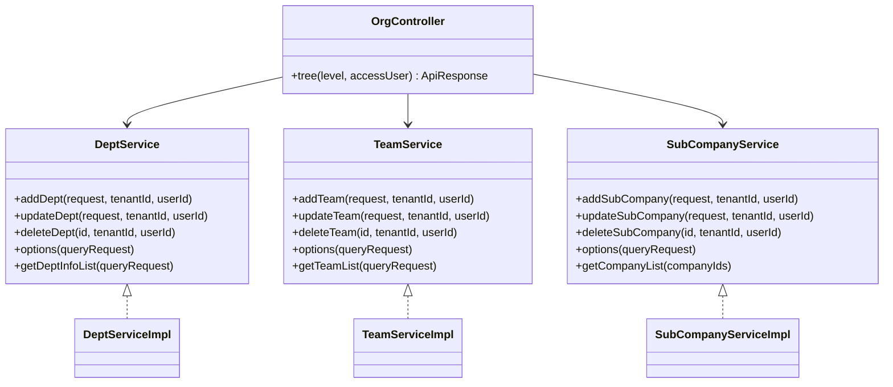
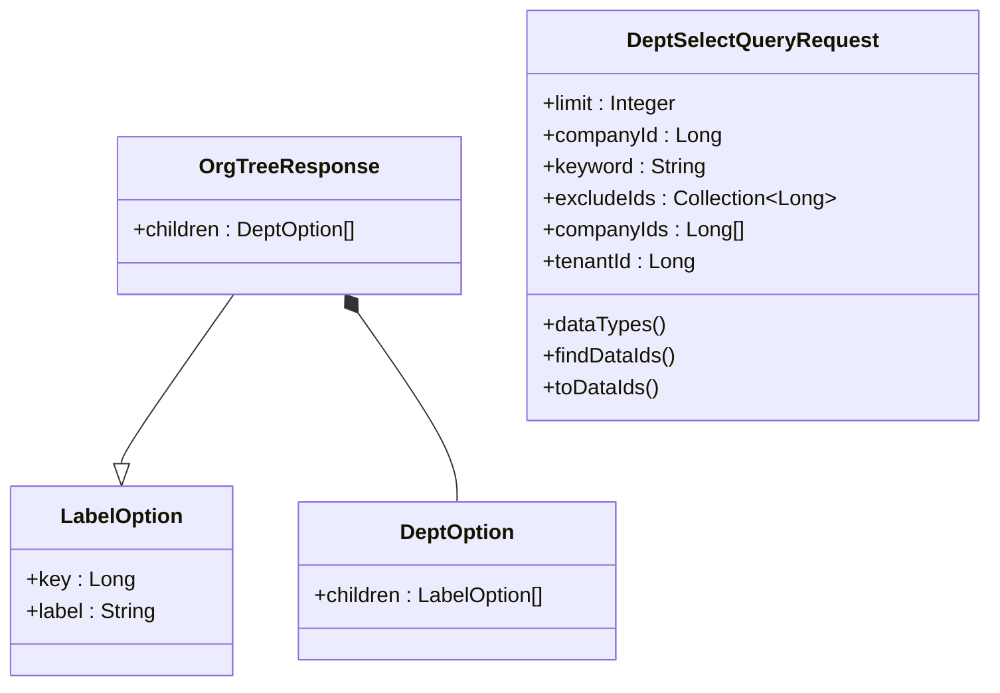
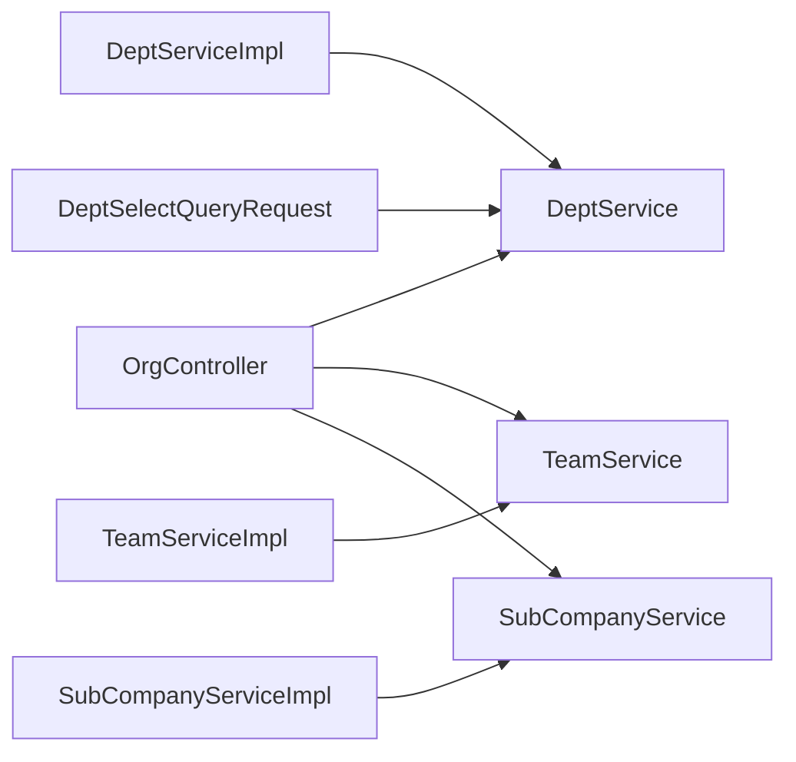

# PRD任务分解技能

<cite>
**本文档引用的文件**
- [OrgController.java](file://src/main/java/com/jiuyu/governance/business/org/controller/OrgController.java)
- [API_DATA_DICTIONARY.md](file://API_DATA_DICTIONARY.md)
- [原始需求文档.md](file://docs/原始需求文档.md)
- [DeptService.java](file://src/main/java/com/jiuyu/governance/business/org/service/DeptService.java)
- [SubCompanyService.java](file://src/main/java/com/jiuyu/governance/business/org/service/SubCompanyService.java)
- [TeamService.java](file://src/main/java/com/jiuyu/governance/business/org/service/TeamService.java)
- [DeptServiceImpl.java](file://src/main/java/com/jiuyu/governance/business/org/service/impl/DeptServiceImpl.java)
- [SubCompanyServiceImpl.java](file://src/main/java/com/jiuyu/governance/business/org/service/impl/SubCompanyServiceImpl.java)
- [TeamServiceImpl.java](file://src/main/java/com/jiuyu/governance/business/org/service/impl/TeamServiceImpl.java)
- [OrgTreeResponse.java](file://src/main/java/com/jiuyu/governance/business/org/pojo/response/OrgTreeResponse.java)
- [DeptSelectQueryRequest.java](file://src/main/java/com/jiuyu/governance/business/org/pojo/request/DeptSelectQueryRequest.java)
</cite>

## 目录
1. [简介](#简介)
2. [项目结构](#项目结构)
3. [核心组件](#核心组件)
4. [架构概览](#架构概览)
5. [详细组件分析](#详细组件分析)
6. [依赖分析](#依赖分析)
7. [性能考虑](#性能考虑)
8. [故障排查指南](#故障排查指南)
9. [结论](#结论)

## 简介
本文件围绕“PRD任务分解技能”主题，结合代码库中的组织架构管理模块，系统化梳理从PRD需求到代码实现的分解过程。通过对OrgController控制器、Dept/Team/SubCompany服务接口与实现、以及相关数据模型的深入分析，帮助读者理解如何将复杂的业务需求拆解为可执行的代码模块，并确保实现与PRD保持一致。

## 项目结构
组织架构模块位于business/org包下，采用典型的分层架构：
- 控制器层：OrgController提供组织树查询接口
- 服务接口层：DeptService、TeamService、SubCompanyService定义组织管理能力
- 服务实现层：DeptServiceImpl、TeamServiceImpl、SubCompanyServiceImpl实现具体业务逻辑
- 数据模型层：OrgTreeResponse、DeptSelectQueryRequest等承载请求/响应结构
- 权限与数据权限：通过注解与数据权限接口实现访问控制

**图表来源**
- [OrgController.java:40-147](file://src/main/java/com/jiuyu/governance/business/org/controller/OrgController.java#L40-L147)
- [DeptService.java:25-128](file://src/main/java/com/jiuyu/governance/business/org/service/DeptService.java#L25-L128)
- [TeamService.java:22-91](file://src/main/java/com/jiuyu/governance/business/org/service/TeamService.java#L22-L91)
- [SubCompanyService.java:23-98](file://src/main/java/com/jiuyu/governance/business/org/service/SubCompanyService.java#L23-L98)
- [DeptServiceImpl.java:54-414](file://src/main/java/com/jiuyu/governance/business/org/service/impl/DeptServiceImpl.java#L54-L414)
- [TeamServiceImpl.java:53-353](file://src/main/java/com/jiuyu/governance/business/org/service/impl/TeamServiceImpl.java#L53-L353)
- [SubCompanyServiceImpl.java:50-307](file://src/main/java/com/jiuyu/governance/business/org/service/impl/SubCompanyServiceImpl.java#L50-L307)
- [OrgTreeResponse.java:15-39](file://src/main/java/com/jiuyu/governance/business/org/pojo/response/OrgTreeResponse.java#L15-L39)
- [DeptSelectQueryRequest.java:20-116](file://src/main/java/com/jiuyu/governance/business/org/pojo/request/DeptSelectQueryRequest.java#L20-L116)

**章节来源**
- [OrgController.java:40-147](file://src/main/java/com/jiuyu/governance/business/org/controller/OrgController.java#L40-L147)
- [API_DATA_DICTIONARY.md:21-225](file://API_DATA_DICTIONARY.md#L21-L225)

## 核心组件
- 组织树控制器：提供组织架构树查询接口，支持按层级构建公司-部门-小组三层结构
- 服务接口：定义部门、小组、子公司的增删改查与下拉选择能力
- 服务实现：封装业务规则、数据权限、缓存清理与管理员连接处理
- 数据模型：组织树响应结构与查询请求结构

**章节来源**
- [OrgController.java:66-145](file://src/main/java/com/jiuyu/governance/business/org/controller/OrgController.java#L66-L145)
- [DeptService.java:25-128](file://src/main/java/com/jiuyu/governance/business/org/service/DeptService.java#L25-L128)
- [TeamService.java:22-91](file://src/main/java/com/jiuyu/governance/business/org/service/TeamService.java#L22-L91)
- [SubCompanyService.java:23-98](file://src/main/java/com/jiuyu/governance/business/org/service/SubCompanyService.java#L23-L98)
- [OrgTreeResponse.java:15-39](file://src/main/java/com/jiuyu/governance/business/org/pojo/response/OrgTreeResponse.java#L15-L39)
- [DeptSelectQueryRequest.java:20-116](file://src/main/java/com/jiuyu/governance/business/org/pojo/request/DeptSelectQueryRequest.java#L20-L116)

## 架构概览
组织架构模块遵循“控制器-服务-数据访问”的分层设计，通过注解实现权限拦截与数据权限注入，通过缓存清理保障组织树一致性。

**图表来源**
- [OrgController.java:66-145](file://src/main/java/com/jiuyu/governance/business/org/controller/OrgController.java#L66-L145)
- [TeamService.java:78-79](file://src/main/java/com/jiuyu/governance/business/org/service/TeamService.java#L78-L79)
- [DeptService.java:116-116](file://src/main/java/com/jiuyu/governance/business/org/service/DeptService.java#L116-L116)
- [SubCompanyService.java:88-88](file://src/main/java/com/jiuyu/governance/business/org/service/SubCompanyService.java#L88-L88)

## 详细组件分析

### 组织树控制器分析
- 职责：根据level参数动态构建组织树，支持公司、部门、小组三级联动查询
- 关键点：
  - 使用数据权限过滤，确保查询范围受限
  - 通过excludeIds避免重复数据
  - 按sort字段升序排序
  - 构建OrgTreeResponse树形结构

**图表来源**
- [OrgController.java:66-145](file://src/main/java/com/jiuyu/governance/business/org/controller/OrgController.java#L66-L145)

**章节来源**
- [OrgController.java:66-145](file://src/main/java/com/jiuyu/governance/business/org/controller/OrgController.java#L66-L145)
- [OrgTreeResponse.java:15-39](file://src/main/java/com/jiuyu/governance/business/org/pojo/response/OrgTreeResponse.java#L15-L39)

### 服务接口与实现分析
- 接口职责：
  - DeptService：部门增删改查、下拉选择、名称映射
  - TeamService：小组增删改查、下拉选择、名称映射
  - SubCompanyService：子公司增删改查、下拉选择、名称映射
- 实现要点：
  - 事务控制与异常处理
  - 数据权限注解@BeforePermission
  - 管理员连接处理器connectorProcessor
  - 缓存清理策略clearOrgCache/clearTenantCache
  - 依赖检查（员工绑定、子实体存在）

**图表来源**
- [OrgController.java:42-46](file://src/main/java/com/jiuyu/governance/business/org/controller/OrgController.java#L42-L46)
- [DeptService.java:25-128](file://src/main/java/com/jiuyu/governance/business/org/service/DeptService.java#L25-L128)
- [TeamService.java:22-91](file://src/main/java/com/jiuyu/governance/business/org/service/TeamService.java#L22-L91)
- [SubCompanyService.java:23-98](file://src/main/java/com/jiuyu/governance/business/org/service/SubCompanyService.java#L23-L98)
- [DeptServiceImpl.java:54-414](file://src/main/java/com/jiuyu/governance/business/org/service/impl/DeptServiceImpl.java#L54-L414)
- [TeamServiceImpl.java:53-353](file://src/main/java/com/jiuyu/governance/business/org/service/impl/TeamServiceImpl.java#L53-L353)
- [SubCompanyServiceImpl.java:50-307](file://src/main/java/com/jiuyu/governance/business/org/service/impl/SubCompanyServiceImpl.java#L50-L307)

**章节来源**
- [DeptServiceImpl.java:94-226](file://src/main/java/com/jiuyu/governance/business/org/service/impl/DeptServiceImpl.java#L94-L226)
- [TeamServiceImpl.java:90-222](file://src/main/java/com/jiuyu/governance/business/org/service/impl/TeamServiceImpl.java#L90-L222)
- [SubCompanyServiceImpl.java:84-197](file://src/main/java/com/jiuyu/governance/business/org/service/impl/SubCompanyServiceImpl.java#L84-L197)

### 数据模型与查询请求分析
- OrgTreeResponse：继承LabelOption，支持children字段表示部门/小组层级
- DeptSelectQueryRequest：实现DataPermissionsRequest，支持数据权限注入与租户隔离

**图表来源**
- [OrgTreeResponse.java:15-39](file://src/main/java/com/jiuyu/governance/business/org/pojo/response/OrgTreeResponse.java#L15-L39)
- [DeptSelectQueryRequest.java:20-116](file://src/main/java/com/jiuyu/governance/business/org/pojo/request/DeptSelectQueryRequest.java#L20-L116)

**章节来源**
- [OrgTreeResponse.java:15-39](file://src/main/java/com/jiuyu/governance/business/org/pojo/response/OrgTreeResponse.java#L15-L39)
- [DeptSelectQueryRequest.java:20-116](file://src/main/java/com/jiuyu/governance/business/org/pojo/request/DeptSelectQueryRequest.java#L20-L116)

## 依赖分析
- 控制器依赖服务接口，服务实现依赖数据访问层与权限处理器
- 服务实现之间存在相互依赖（如TeamServiceImpl依赖DeptService）
- 查询请求实现DataPermissionsRequest，确保数据权限注入

**图表来源**
- [OrgController.java:42-46](file://src/main/java/com/jiuyu/governance/business/org/controller/OrgController.java#L42-L46)
- [DeptServiceImpl.java:54-54](file://src/main/java/com/jiuyu/governance/business/org/service/impl/DeptServiceImpl.java#L54-L54)
- [TeamServiceImpl.java:53-53](file://src/main/java/com/jiuyu/governance/business/org/service/impl/TeamServiceImpl.java#L53-L53)
- [SubCompanyServiceImpl.java:50-50](file://src/main/java/com/jiuyu/governance/business/org/service/impl/SubCompanyServiceImpl.java#L50-L50)
- [DeptSelectQueryRequest.java:94-114](file://src/main/java/com/jiuyu/governance/business/org/pojo/request/DeptSelectQueryRequest.java#L94-L114)

**章节来源**
- [API_DATA_DICTIONARY.md:21-225](file://API_DATA_DICTIONARY.md#L21-L225)

## 性能考虑
- 分页与限制：查询请求包含limit参数，避免一次性返回大量数据
- 排序优化：按sort字段升序排序，减少前端处理成本
- 缓存策略：通过connectorProcessor清理组织缓存，确保数据一致性
- 依赖检查：在删除前检查员工与子实体绑定，避免复杂查询

## 故障排查指南
- 组织树为空：检查level参数与数据权限范围，确认excludeIds与companyIds配置
- 权限不足：确认@BeforePermission注解生效与数据权限注入
- 删除失败：检查是否存在员工绑定或子实体存在
- 缓存不一致：调用clearOrgCache/clearTenantCache清理相关缓存

**章节来源**
- [OrgController.java:66-145](file://src/main/java/com/jiuyu/governance/business/org/controller/OrgController.java#L66-L145)
- [DeptServiceImpl.java:197-226](file://src/main/java/com/jiuyu/governance/business/org/service/impl/DeptServiceImpl.java#L197-L226)
- [TeamServiceImpl.java:201-222](file://src/main/java/com/jiuyu/governance/business/org/service/impl/TeamServiceImpl.java#L201-L222)
- [SubCompanyServiceImpl.java:172-197](file://src/main/java/com/jiuyu/governance/business/org/service/impl/SubCompanyServiceImpl.java#L172-L197)

## 结论
通过将PRD需求分解为控制器、服务接口与实现、数据模型与权限控制，实现了组织架构树的高效查询与管理。该设计具备良好的扩展性与可维护性，能够支撑多租户、多层级的组织管理场景。