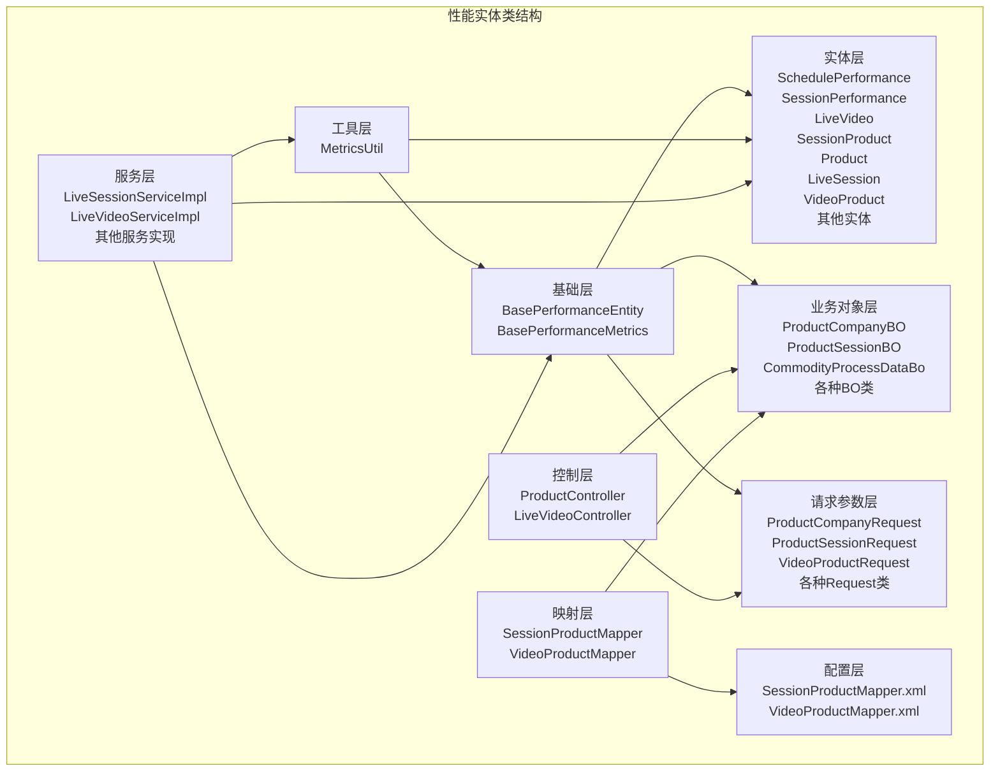
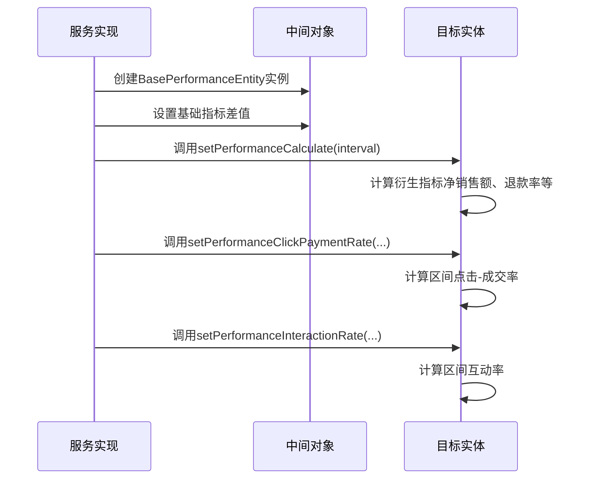
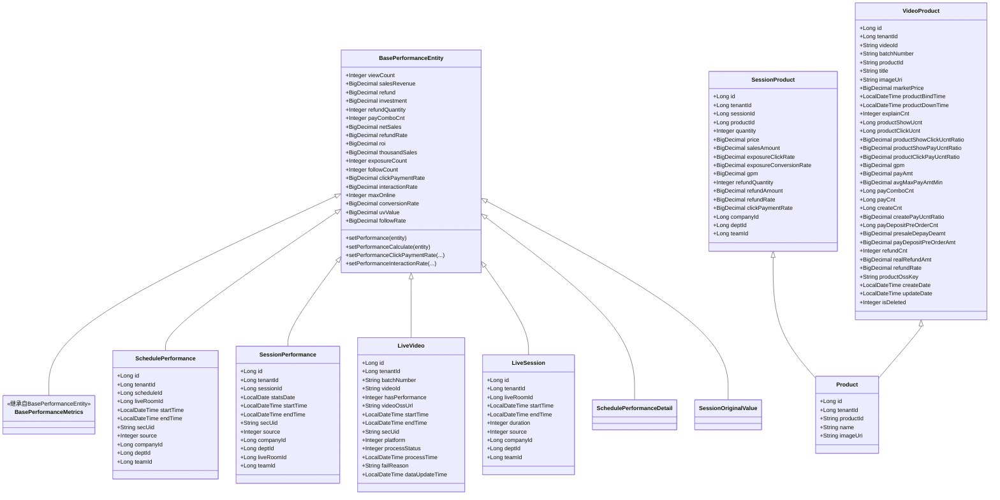
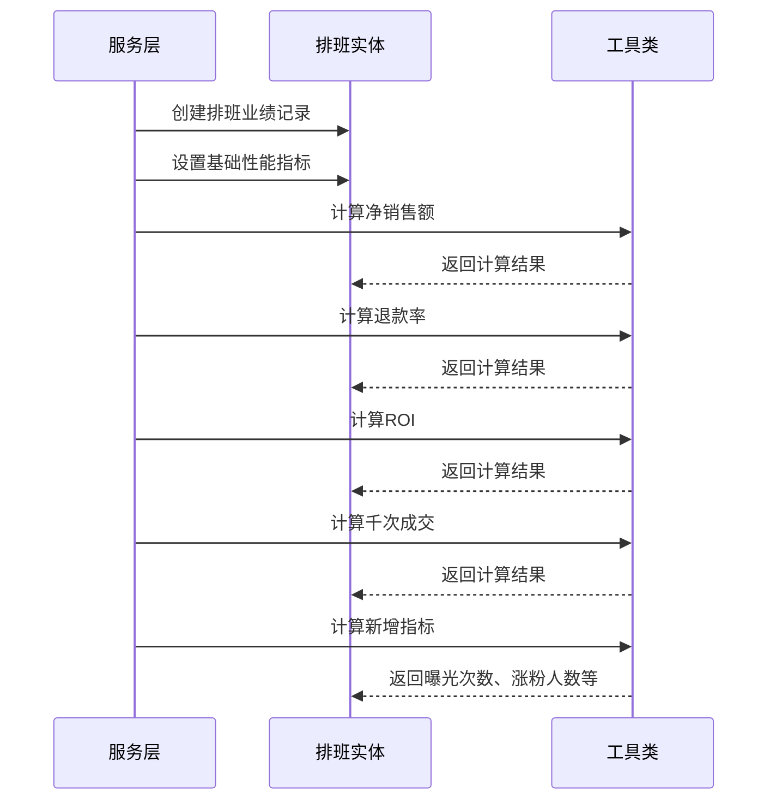
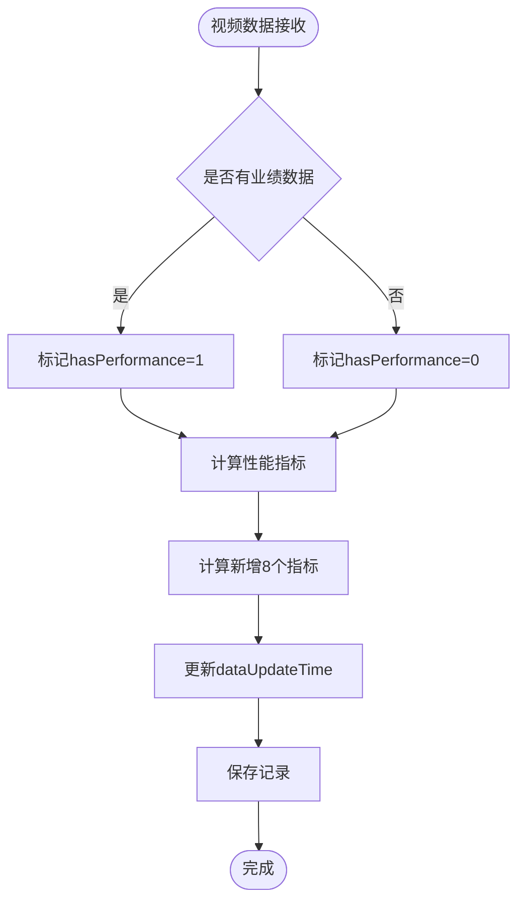
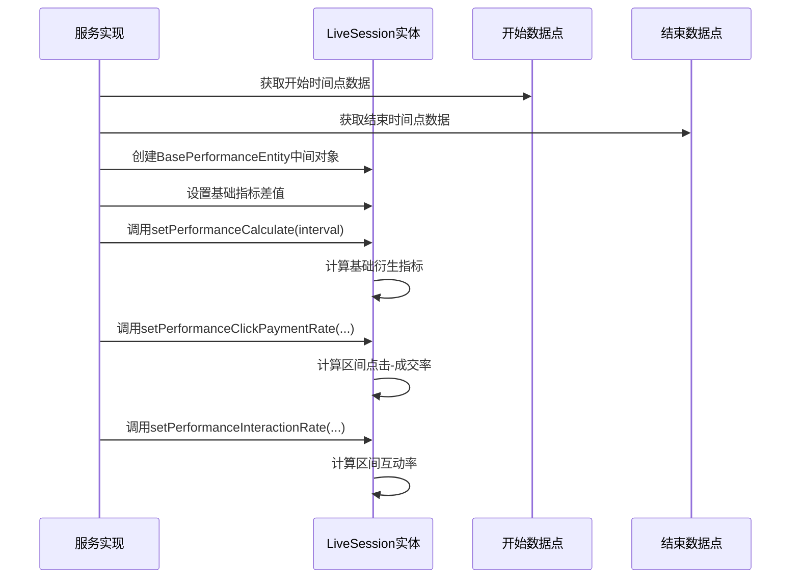
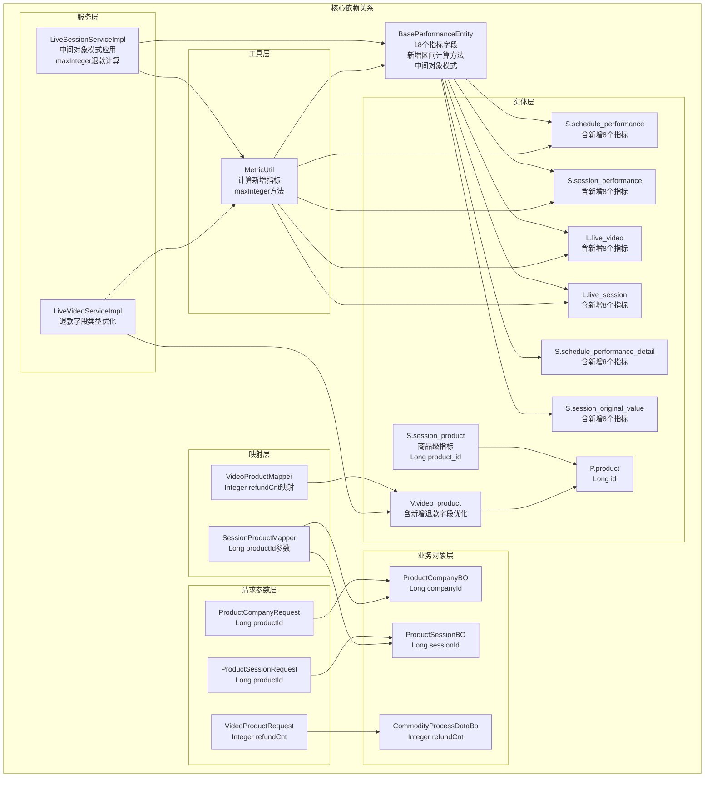

# 性能实体类

<cite>
**本文档引用的文件**
- [BasePerformanceEntity.java](file://src/main/java/com/jiuyu/governance/business/performance/pojo/base/BasePerformanceEntity.java)
- [BasePerformanceMetrics.java](file://src/main/java/com/jiuyu/governance/business/performance/pojo/base/BasePerformanceMetrics.java)
- [SchedulePerformance.java](file://src/main/java/com/jiuyu/governance/business/performance/pojo/entity/SchedulePerformance.java)
- [SessionPerformance.java](file://src/main/java/com/jiuyu/governance/business/performance/pojo/entity/SessionPerformance.java)
- [LiveVideo.java](file://src/main/java/com/jiuyu/governance/business/performance/pojo/entity/LiveVideo.java)
- [SchedulePerformanceDetail.java](file://src/main/java/com/jiuyu/governance/business/performance/pojo/entity/SchedulePerformanceDetail.java)
- [SessionOriginalValue.java](file://src/main/java/com/jiuyu/governance/business/performance/pojo/entity/SessionOriginalValue.java)
- [SessionProduct.java](file://src/main/java/com/jiuyu/governance/business/performance/pojo/entity/SessionProduct.java)
- [Product.java](file://src/main/java/com/jiuyu/governance/business/performance/pojo/entity/Product.java)
- [LiveSession.java](file://src/main/java/com/jiuyu/governance/business/performance/pojo/entity/LiveSession.java)
- [LiveSessionServiceImpl.java](file://src/main/java/com/jiuyu/governance/business/performance/service/impl/LiveSessionServiceImpl.java)
- [SessionProductMapper.java](file://src/main/java/com/jiuyu/governance/business/performance/mapper/SessionProductMapper.java)
- [SessionProductMapper.xml](file://src/main/resources/mapper/performance/SessionProductMapper.xml)
- [ProductCompanyRequest.java](file://src/main/java/com/jiuyu/governance/business/performance/pojo/request/ProductCompanyRequest.java)
- [ProductSessionRequest.java](file://src/main/java/com/jiuyu/governance/business/performance/pojo/request/ProductSessionRequest.java)
- [ProductCompanyBO.java](file://src/main/java/com/jiuyu/governance/business/performance/pojo/bo/ProductCompanyBO.java)
- [ProductSessionBO.java](file://src/main/java/com/jiuyu/governance/business/performance/pojo/bo/ProductSessionBO.java)
- [ProductController.java](file://src/main/java/com/jiuyu/governance/business/performance/controller/ProductController.java)
- [MetricsUtil.java](file://src/main/java/com/jiuyu/governance/business/performance/utils/MetricsUtil.java)
- [performance_tables.sql](file://src/main/resources/sql/performance_tables.sql)
- [SchedulePerformanceMapper.xml](file://src/main/resources/mapper/performance/SchedulePerformanceMapper.xml)
- [SessionPerformanceMapper.xml](file://src/main/resources/mapper/performance/SessionPerformanceMapper.xml)
- [CommodityProcessDataBo.java](file://src/main/java/com/jiuyu/governance/business/performance/pojo/bo/CommodityProcessDataBo.java)
- [VideoProduct.java](file://src/main/java/com/jiuyu/governance/business/performance/pojo/entity/VideoProduct.java)
- [VideoProductRequest.java](file://src/main/java/com/jiuyu/governance/business/performance/pojo/request/VideoProductRequest.java)
- [VideoProductMapper.java](file://src/main/java/com/jiuyu/governance/business/performance/mapper/VideoProductMapper.java)
- [VideoProductMapper.xml](file://src/main/resources/mapper/performance/VideoProductMapper.xml)
- [LiveVideoController.java](file://src/main/java/com/jiuyu/governance/business/performance/controller/LiveVideoController.java)
- [LiveVideoServiceImpl.java](file://src/main/java/com/jiuyu/governance/business/performance/service/impl/LiveVideoServiceImpl.java)
- [receiveVideo.md](file://docs/module_description/performance/receiveVideo.md)
</cite>

## 更新摘要
**变更内容**
- 新增8个关键业绩指标字段：曝光次数、涨粉人数、点击-成交率、互动率、最高在线、带货转化率、UV价值、涨粉率
- 更新BasePerformanceEntity基类以包含新增字段
- 新增setPerformanceClickPaymentRate和setPerformanceInteractionRate方法，实现区间指标计算
- 引入BasePerformanceEntity中间对象模式简化性能计算流程
- 更新数据库表结构以支持新字段
- 更新计算逻辑和数据库映射
- **类型优化**：统一使用Long类型的product ID，确保类型安全和一致性
- **退款字段类型优化**：CommodityProcessDataBo、VideoProduct、VideoProductRequest类中退款字段从Long优化为Integer，提升性能和内存效率
- **退款计算方法修正**：LiveSessionServiceImpl中退款计算方法使用maxInteger替代maxLong，确保类型一致性

## 目录
1. [简介](#简介)
2. [项目结构](#项目结构)
3. [核心组件](#核心组件)
4. [架构概览](#架构概览)
5. [详细组件分析](#详细组件分析)
6. [依赖关系分析](#依赖关系分析)
7. [性能考虑](#性能考虑)
8. [故障排除指南](#故障排除指南)
9. [结论](#结论)

## 简介

本文档深入分析了治理服务器中性能实体类的设计与实现。该模块采用统一的性能指标基类设计，通过继承机制实现了多个业务实体的性能数据标准化管理。系统涵盖了直播、排班、场次等多个维度的性能数据管理，包括实时监控、历史统计、商品分析等核心功能。

**更新** 新增了8个关键业绩指标字段，包括曝光次数、涨粉人数、点击-成交率、互动率、最高在线、带货转化率、UV价值、涨粉率，进一步完善了直播电商场景下的数据分析能力。**新增** 重大增强包括：新增setPerformanceClickPaymentRate和setPerformanceInteractionRate方法，实现区间指标计算；引入BasePerformanceEntity中间对象模式简化性能计算流程。**类型优化** 统一使用Long类型的product ID，确保类型安全和一致性。**退款字段优化** CommodityProcessDataBo、VideoProduct、VideoProductRequest类中退款字段从Long优化为Integer，提升性能和内存效率。

该设计的核心优势在于通过BasePerformanceEntity基类统一管理18个核心业绩指标字段（原有10个 + 新增8个），消除了跨表字段冗余，实现了代码的高内聚低耦合。同时，配合MetricsUtil工具类提供了完整的指标计算能力，确保了数据的一致性和准确性。

## 项目结构

性能实体类位于`src/main/java/com/jiuyu/governance/business/performance/pojo/`目录下，采用清晰的层次化组织结构：

**图表来源**
- [BasePerformanceEntity.java:1-261](file://src/main/java/com/jiuyu/governance/business/performance/pojo/base/BasePerformanceEntity.java#L1-L261)
- [SchedulePerformance.java:1-118](file://src/main/java/com/jiuyu/governance/business/performance/pojo/entity/SchedulePerformance.java#L1-L118)
- [SessionProduct.java:1-154](file://src/main/java/com/jiuyu/governance/business/performance/pojo/entity/SessionProduct.java#L1-L154)
- [Product.java:1-81](file://src/main/java/com/jiuyu/governance/business/performance/pojo/entity/Product.java#L1-L81)
- [LiveSession.java:1-133](file://src/main/java/com/jiuyu/governance/business/performance/pojo/entity/LiveSession.java#L1-L133)
- [LiveSessionServiceImpl.java:1-1241](file://src/main/java/com/jiuyu/governance/business/performance/service/impl/LiveSessionServiceImpl.java#L1-L1241)
- [MetricsUtil.java:1-290](file://src/main/java/com/jiuyu/governance/business/performance/utils/MetricsUtil.java#L1-L290)
- [CommodityProcessDataBo.java:1-44](file://src/main/java/com/jiuyu/governance/business/performance/pojo/bo/CommodityProcessDataBo.java#L1-L44)
- [VideoProduct.java:1-220](file://src/main/java/com/jiuyu/governance/business/performance/pojo/entity/VideoProduct.java#L1-L220)
- [VideoProductRequest.java:1-163](file://src/main/java/com/jiuyu/governance/business/performance/pojo/request/VideoProductRequest.java#L1-L163)

**章节来源**
- [BasePerformanceEntity.java:1-261](file://src/main/java/com/jiuyu/governance/business/performance/pojo/base/BasePerformanceEntity.java#L1-L261)
- [BasePerformanceMetrics.java:1-31](file://src/main/java/com/jiuyu/governance/business/performance/pojo/base/BasePerformanceMetrics.java#L1-L31)

## 核心组件

### 基础性能实体类

BasePerformanceEntity是整个性能实体体系的核心基类，定义了统一的18个核心业绩指标字段：

**原有10个核心指标**：
| 指标名称 | 字段名 | 数据类型 | 单位 | 描述 |
|---------|--------|----------|------|------|
| 总观看人次 | viewCount | Integer | 人次 | 直播或场次的总观看人数 |
| 销售额 | salesRevenue | BigDecimal | 元 | 累计销售金额 |
| 退款 | refund | BigDecimal | 元 | 累计退款金额 |
| 投放 | investment | BigDecimal | 元 | 累计广告投放金额 |
| 退款数量 | refundQuantity | Integer | 单 | 累计退款订单数 |
| 销售单量 | payComboCnt | Integer | 单 | 累计支付订单数 |
| 净销售额 | netSales | BigDecimal | 元 | 销售额-退款 |
| 退款率 | refundRate | BigDecimal | % | 退款数量/销售单量×100 |
| ROI | roi | BigDecimal | % | 销售额/投放×100 |
| 千次成交 | thousandSales | BigDecimal | 元 | 成交金额/场观×1000 |

**新增8个关键指标**：
| 指标名称 | 字段名 | 数据类型 | 单位 | 描述 |
|---------|--------|----------|------|------|
| 曝光次数 | exposureCount | Integer | 次 | 商品或内容的曝光总次数 |
| 涨粉人数 | followCount | Integer | 人 | 直播期间新增粉丝数量 |
| 点击-成交率 | clickPaymentRate | BigDecimal | % | 点击转化为购买的比例 |
| 互动率 | interactionRate | BigDecimal | % | 用户互动占观看人数的比例 |
| 最高在线 | maxOnline | Integer | 人 | 直播过程中的最高同时在线人数 |
| 带货转化率 | conversionRate | BigDecimal | % | 成交单量/观看人数×100% |
| UV价值 | uvValue | BigDecimal | 元 | 销售额/观看人数 |
| 涨粉率 | followRate | BigDecimal | % | 涨粉人数/观看人数×100% |

**新增功能**：BasePerformanceEntity现在包含两个重要的区间指标计算方法：

- **setPerformanceClickPaymentRate**：计算区间点击-成交率
  - 公式：点击-成交率 = 区间订单量 / 区间点击量
  - 其中：区间点击量 = (结束单量 / 结束点击成交率) - (开始单量 / 开始点击成交率)

- **setPerformanceInteractionRate**：计算区间互动率
  - 公式：互动率 = 区间互动次数 / 区间观看人数
  - 其中：区间互动次数 = (结束观看人数 × 结束互动率) - (开始观看人数 × 开始互动率)

**章节来源**
- [BasePerformanceEntity.java:36-173](file://src/main/java/com/jiuyu/governance/business/performance/pojo/base/BasePerformanceEntity.java#L36-L173)
- [BasePerformanceEntity.java:229-259](file://src/main/java/com/jiuyu/governance/business/performance/pojo/base/BasePerformanceEntity.java#L229-L259)

### 性能指标计算工具

MetricsUtil提供了完整的指标计算能力，包括基本运算、百分比转换、业务专用计算等功能：

- **基本运算**：加减乘除、最大值计算
- **百分比转换**：toPercentString、toPercentValue
- **业务计算**：ROI计算、投放产出计算
- **货币转换**：元分转换

**章节来源**
- [MetricsUtil.java:14-290](file://src/main/java/com/jiuyu/governance/business/performance/utils/MetricsUtil.java#L14-L290)

### 中间对象模式

**新增** BasePerformanceEntity引入了中间对象模式来简化性能计算流程：

**图表来源**
- [LiveSessionServiceImpl.java:706-747](file://src/main/java/com/jiuyu/governance/business/performance/service/impl/LiveSessionServiceImpl.java#L706-L747)
- [LiveSessionServiceImpl.java:915-956](file://src/main/java/com/jiuyu/governance/business/performance/service/impl/LiveSessionServiceImpl.java#L915-L956)

**章节来源**
- [LiveSessionServiceImpl.java:706-747](file://src/main/java/com/jiuyu/governance/business/performance/service/impl/LiveSessionServiceImpl.java#L706-L747)
- [LiveSessionServiceImpl.java:915-956](file://src/main/java/com/jiuyu/governance/business/performance/service/impl/LiveSessionServiceImpl.java#L915-L956)

### 类型优化 - 统一Long类型的Product ID

**更新** 本次更新重点优化了商品相关实体类的类型一致性，统一使用Long类型的product ID：

#### 实体类类型优化

| 实体类 | 字段名 | 优化前类型 | 优化后类型 | 说明 |
|--------|--------|------------|------------|------|
| SessionProduct | product_id | Long | Long | 场次商品关联表的商品ID |
| Product | id | Long | Long | 商品表的主键ID |
| ProductCompanyRequest | productId | Long | Long | 分公司查询请求参数 |
| ProductSessionRequest | productId | Long | Long | 场次查询请求参数 |

#### 映射器类型优化

| 映射器方法 | 参数类型 | 优化说明 |
|------------|----------|----------|
| queryProductRanking | Long productId | 统一使用Long类型 |
| queryProductSessions | Long productId | 统一使用Long类型 |
| queryProductCompanies | Long productId | 统一使用Long类型 |

#### BO类类型保持一致

| BO类 | 字段类型 | 说明 |
|------|----------|------|
| ProductCompanyBO | Long companyId | 分公司ID类型一致 |
| ProductSessionBO | Long sessionId | 场次ID类型一致 |

#### 退款字段类型优化

**更新** 退款字段类型从Long优化为Integer，提升性能和内存效率：

| 实体类 | 字段名 | 类型优化 | 优化说明 |
|--------|--------|----------|----------|
| CommodityProcessDataBo | refundCnt | Long → Integer | 商品过程数据中的退款订单数 |
| CommodityProcessDataBo | realRefundAmt | BigDecimal | 保持不变 |
| VideoProduct | refundCnt | Long → Integer | 视频商品表中的退款订单数 |
| VideoProduct | realRefundAmt | BigDecimal | 保持不变 |
| VideoProductRequest | refundCnt | Long → Integer | 视频商品请求中的退款订单数 |
| VideoProductRequest | realRefundAmt | BigDecimal | 保持不变 |

#### 退款计算方法修正

**更新** LiveSessionServiceImpl中退款计算方法使用maxInteger替代maxLong：

| 方法 | 优化前 | 优化后 | 说明 |
|------|--------|--------|------|
| 合并退款数据 | maxLong | maxInteger | 使用Integer类型处理退款订单数 |
| 合并退款金额 | maxBigDecimal | maxBigDecimal | 保持BigDecimal类型处理退款金额 |

**章节来源**
- [SessionProduct.java:40-43](file://src/main/java/com/jiuyu/governance/business/performance/pojo/entity/SessionProduct.java#L40-L43)
- [ProductCompanyRequest.java:27](file://src/main/java/com/jiuyu/governance/business/performance/pojo/request/ProductCompanyRequest.java#L27)
- [ProductSessionRequest.java:29](file://src/main/java/com/jiuyu/governance/business/performance/pojo/request/ProductSessionRequest.java#L29)
- [CommodityProcessDataBo.java:36-41](file://src/main/java/com/jiuyu/governance/business/performance/pojo/bo/CommodityProcessDataBo.java#L36-L41)
- [VideoProduct.java:181-187](file://src/main/java/com/jiuyu/governance/business/performance/pojo/entity/VideoProduct.java#L181-L187)
- [VideoProductRequest.java:145-150](file://src/main/java/com/jiuyu/governance/business/performance/pojo/request/VideoProductRequest.java#L145-L150)
- [LiveSessionServiceImpl.java:448-449](file://src/main/java/com/jiuyu/governance/business/performance/service/impl/LiveSessionServiceImpl.java#L448-L449)

## 架构概览

性能实体类采用分层架构设计，通过继承关系实现代码复用和扩展性：

**图表来源**
- [BasePerformanceEntity.java:34-261](file://src/main/java/com/jiuyu/governance/business/performance/pojo/base/BasePerformanceEntity.java#L34-L261)
- [SchedulePerformance.java:18-117](file://src/main/java/com/jiuyu/governance/business/performance/pojo/entity/SchedulePerformance.java#L18-L117)
- [SessionPerformance.java:18-124](file://src/main/java/com/jiuyu/governance/business/performance/pojo/entity/SessionPerformance.java#L18-L124)
- [LiveVideo.java:18-123](file://src/main/java/com/jiuyu/governance/business/performance/pojo/entity/LiveVideo.java#L18-L123)
- [LiveSession.java:17-133](file://src/main/java/com/jiuyu/governance/business/performance/pojo/entity/LiveSession.java#L17-L133)
- [SessionProduct.java:19-153](file://src/main/java/com/jiuyu/governance/business/performance/pojo/entity/SessionProduct.java#L19-L153)
- [Product.java:18-80](file://src/main/java/com/jiuyu/governance/business/performance/pojo/entity/Product.java#L18-L80)
- [VideoProduct.java:19-219](file://src/main/java/com/jiuyu/governance/business/performance/pojo/entity/VideoProduct.java#L19-L219)

## 详细组件分析

### 排班性能实体

SchedulePerformance用于管理排班维度的直播业绩数据，具有以下特点：

**图表来源**
- [SchedulePerformance.java:18-117](file://src/main/java/com/jiuyu/governance/business/performance/pojo/entity/SchedulePerformance.java#L18-L117)
- [BasePerformanceEntity.java:208-227](file://src/main/java/com/jiuyu/governance/business/performance/pojo/base/BasePerformanceEntity.java#L208-L227)

**章节来源**
- [SchedulePerformance.java:10-118](file://src/main/java/com/jiuyu/governance/business/performance/pojo/entity/SchedulePerformance.java#L10-L118)

### 场次性能实体

SessionPerformance以天为维度记录直播场次的业绩数据，支持历史统计分析：

- **统计维度**：按自然日进行数据聚合
- **时间字段**：包含开始时间、结束时间、统计日期
- **组织架构**：支持公司、部门、小组层级的数据归属
- **新增指标支持**：完整支持8个新增关键指标的存储和计算

**章节来源**
- [SessionPerformance.java:11-125](file://src/main/java/com/jiuyu/governance/business/performance/pojo/entity/SessionPerformance.java#L11-L125)

### 直播视频实体

LiveVideo专门管理直播视频相关的性能数据：

**图表来源**
- [LiveVideo.java:18-123](file://src/main/java/com/jiuyu/governance/business/performance/pojo/entity/LiveVideo.java#L18-L123)

**章节来源**
- [LiveVideo.java:10-124](file://src/main/java/com/jiuyu/governance/business/performance/pojo/entity/LiveVideo.java#L10-L124)

### 直播场次实体

**新增** LiveSession实体现在可以直接使用新增的区间指标计算方法：

**图表来源**
- [LiveSessionServiceImpl.java:706-747](file://src/main/java/com/jiuyu/governance/business/performance/service/impl/LiveSessionServiceImpl.java#L706-L747)

**章节来源**
- [LiveSession.java:10-133](file://src/main/java/com/jiuyu/governance/business/performance/pojo/entity/LiveSession.java#L10-L133)

### 性能明细实体

SchedulePerformanceDetail和SessionOriginalValue分别提供排班业绩贡献明细和原始值记录功能：

- **贡献明细**：记录每个场次对整体排班业绩的贡献度
- **原始值记录**：追踪业绩数据的变更历史，支持审计和回溯
- **完整指标支持**：所有明细表均包含新增的8个关键指标

**章节来源**
- [SchedulePerformanceDetail.java:10-76](file://src/main/java/com/jiuyu/governance/business/performance/pojo/entity/SchedulePerformanceDetail.java#L10-L76)
- [SessionOriginalValue.java:10-71](file://src/main/java/com/jiuyu/governance/business/performance/pojo/entity/SessionOriginalValue.java#L10-L71)

### 商品关联实体

**更新** 商品关联实体经过类型优化，统一使用Long类型的product ID：

#### SessionProduct实体类

SessionProduct管理直播场次与商品的关联关系，经过类型优化后：

- **主键ID**：Long类型，雪花ID生成
- **租户ID**：Long类型，支持多租户隔离
- **场次ID**：Long类型，关联直播场次
- **商品ID**：**Long类型**（优化后），统一使用Long类型确保类型安全
- **组织架构**：支持公司、部门、小组层级的数据归属
- **销售统计**：记录商品销量、单价、销售额等信息
- **转化率分析**：提供曝光点击率、曝光成交率等关键指标
- **退款管理**：跟踪商品的退单量和退款额

#### Product实体类

Product管理商品基础信息：

- **主键ID**：Long类型，雪花ID生成
- **租户ID**：Long类型，支持多租户隔离
- **商品ID**：String类型，外部系统商品标识
- **商品名称**：String类型，商品显示名称
- **商品图片**：String类型，商品图片URL

#### VideoProduct实体类

**更新** VideoProduct实体类经过退款字段类型优化：

- **主键ID**：Long类型，雪花ID生成
- **租户ID**：Long类型，支持多租户隔离
- **视频ID**：String类型，关联直播视频
- **批次号**：String类型，直播批次标识
- **商品ID**：String类型，关联商品标识
- **标题**：String类型，商品标题
- **图片URL**：String类型，商品图片地址
- **到手价**：BigDecimal类型，商品价格
- **上架时间**：LocalDateTime类型，商品上架时间
- **下架时间**：LocalDateTime类型，商品下架时间
- **讲解次数**：Integer类型，商品讲解次数
- **曝光人数**：Long类型，商品曝光人数
- **点击人数**：Long类型，商品点击人数
- **曝光-点击转化率**：BigDecimal类型，曝光到点击的转化率
- **曝光-成交转化率**：BigDecimal类型，曝光到成交的转化率
- **点击-成交转化率**：BigDecimal类型，点击到成交的转化率
- **千次曝光成交金额**：BigDecimal类型，GPM指标
- **累计成交金额**：BigDecimal类型，总成交金额
- **分钟最高成交金额**：BigDecimal类型，峰值成交金额
- **累计成交件数**：Long类型，总成交件数
- **累计成交订单数**：Long类型，总成交订单数
- **创建订单数**：Long类型，订单创建数量
- **订单支付率**：BigDecimal类型，订单支付比例
- **预售订单数**：Long类型，预售订单数量
- **预售定金金额**：BigDecimal类型，预售定金总额
- **预售全款金额**：BigDecimal类型，预售全款总额
- **退款订单数**：**Integer类型**（优化后），退款订单数量
- **退款金额**：BigDecimal类型，退款总金额
- **退款率**：BigDecimal类型，退款比例
- **商品过程数据OSS路径**：String类型，过程数据存储路径
- **创建时间**：LocalDateTime类型，记录创建时间
- **更新时间**：LocalDateTime类型，记录更新时间
- **逻辑删除标志**：Integer类型，软删除标记

**章节来源**
- [SessionProduct.java:10-154](file://src/main/java/com/jiuyu/governance/business/performance/pojo/entity/SessionProduct.java#L10-L154)
- [Product.java:9-81](file://src/main/java/com/jiuyu/governance/business/performance/pojo/entity/Product.java#L9-L81)
- [VideoProduct.java:10-219](file://src/main/java/com/jiuyu/governance/business/performance/pojo/entity/VideoProduct.java#L10-L219)

### 商品查询接口

**更新** 商品查询接口经过类型优化，统一使用Long类型的productId参数：

#### ProductCompanyRequest

用于查询商品关联分公司的请求参数：

- **productId**：**Long类型**（优化后），商品ID参数
- **startDate**：LocalDate类型，查询开始日期
- **endDate**：LocalDate类型，查询结束日期
- **sortBy**：String类型，排序字段
- **sortOrder**：String类型，排序方向
- **tenantId**：Long类型，租户ID（自动注入）

#### ProductSessionRequest

用于查询商品关联直播场次的分页请求参数：

- **productId**：**Long类型**（优化后），商品ID参数
- **startDate**：LocalDate类型，查询开始日期
- **endDate**：LocalDate类型，查询结束日期
- **sortBy**：String类型，排序字段
- **sortOrder**：String类型，排序方向
- **tenantId**：Long类型，租户ID（自动注入）

#### ProductController

商品业绩控制器，提供商品维度的业绩统计功能：

- **pageQueryProductRanking**：商品排行分页查询
- **pageQueryProductSessions**：商品关联直播场次分页查询
- **queryProductCompanies**：商品关联分公司列表查询

#### VideoProductRequest

**更新** VideoProductRequest类经过退款字段类型优化：

- **主键ID**：Long类型，商品ID（用于判断新增或更新）
- **商品ID**：String类型，爱复盘的商品ID
- **标题**：String类型，商品标题
- **图片URL**：String类型，商品图片地址
- **到手价**：BigDecimal类型，商品价格
- **上架时间**：LocalDateTime类型，商品上架时间
- **下架时间**：LocalDateTime类型，商品下架时间
- **讲解次数**：Integer类型，商品讲解次数
- **曝光人数**：Long类型，商品曝光人数
- **点击人数**：Long类型，商品点击人数
- **曝光-点击转化率**：BigDecimal类型，曝光到点击的转化率
- **曝光-成交转化率**：BigDecimal类型，曝光到成交的转化率
- **点击-成交转化率**：BigDecimal类型，点击到成交的转化率
- **千次曝光成交金额**：BigDecimal类型，GPM指标
- **累计成交金额**：BigDecimal类型，总成交金额
- **分钟最高成交金额**：BigDecimal类型，峰值成交金额
- **累计成交件数**：Long类型，总成交件数
- **累计成交订单数**：Long类型，总成交订单数
- **创建订单数**：Long类型，订单创建数量
- **订单支付率**：BigDecimal类型，订单支付比例
- **预售订单数**：Long类型，预售订单数量
- **预售定金金额**：BigDecimal类型，预售定金总额
- **预售全款金额**：BigDecimal类型，预售全款总额
- **退款订单数**：**Integer类型**（优化后），退款订单数量
- **退款金额**：BigDecimal类型，退款总金额
- **退款率**：BigDecimal类型，退款比例
- **商品过程数据**：List<CommodityProcessDataBo>类型，商品过程数据列表

#### CommodityProcessDataBo

**更新** CommodityProcessDataBo类新增退款字段：

- **时间**：LocalDateTime类型，数据采集时间
- **成交件数**：Integer类型，商品成交件数
- **成交金额**：BigDecimal类型，商品成交金额
- **退款订单数**：**Integer类型**（新增），退款订单数量
- **退款金额**：BigDecimal类型，退款总金额

**章节来源**
- [ProductCompanyRequest.java:17-58](file://src/main/java/com/jiuyu/governance/business/performance/pojo/request/ProductCompanyRequest.java#L17-L58)
- [ProductSessionRequest.java:20-59](file://src/main/java/com/jiuyu/governance/business/performance/pojo/request/ProductSessionRequest.java#L20-L59)
- [ProductController.java:37-92](file://src/main/java/com/jiuyu/governance/business/performance/controller/ProductController.java#L37-L92)
- [VideoProductRequest.java:1-163](file://src/main/java/com/jiuyu/governance/business/performance/pojo/request/VideoProductRequest.java#L1-L163)
- [CommodityProcessDataBo.java:1-44](file://src/main/java/com/jiuyu/governance/business/performance/pojo/bo/CommodityProcessDataBo.java#L1-L44)

### 视频数据接收接口

**更新** 视频数据接收接口文档更新以反映退款字段类型优化：

#### 接口文档更新

| 字段 | 类型 | 必填 | 说明 |
|-----|------|-----|------|
| id | Long | 是 | 商品ID（主键，用于判断新增或更新） |
| productId | String | 是 | 商品productId（爱复盘的商品ID） |
| title | String | 是 | 商品标题 |
| imageUri | String | 否 | 商品图片URL |
| marketPrice | BigDecimal | 否 | 到手价（元） |
| productBindTime | LocalDateTime | 否 | 直播间上架时间 |
| productDownTime | LocalDateTime | 否 | 直播间下架时间 |
| explainCnt | Integer | 否 | 讲解次数 |
| productShowUcnt | Long | 否 | 商品曝光人数 |
| productClickUcnt | Long | 否 | 商品点击人数 |
| productShowClickUcntRatio | BigDecimal | 否 | 曝光-点击转化率 |
| productShowPayUcntRatio | BigDecimal | 否 | 曝光-成交转化率 |
| productClickPayUcntRatio | BigDecimal | 否 | 点击-成交转化率 |
| gpm | BigDecimal | 否 | 商品千次曝光成交金额（元） |
| payAmt | BigDecimal | 否 | 累计成交金额（元） |
| avgMaxPayAmtMin | BigDecimal | 否 | 分钟最高成交金额（元） |
| payComboCnt | Long | 否 | 累计成交件数 |
| payCnt | Long | 否 | 累计成交订单数 |
| createCnt | Long | 否 | 创建订单数 |
| createPayUcntRatio | BigDecimal | 否 | 订单支付率 |
| payDepositPreOrderCnt | Long | 否 | 预售订单数 |
| presaleDepayDeamt | BigDecimal | 否 | 预售定金金额（元） |
| payDepositPreOrderAmt | BigDecimal | 否 | 预售全款金额（元） |
| refundCnt | **Integer** | 否 | 退款订单数（优化后） |
| realRefundAmt | BigDecimal | 否 | 退款金额（元） |
| refundRate | BigDecimal | 否 | 退款率 |

**章节来源**
- [receiveVideo.md:37-66](file://docs/module_description/performance/receiveVideo.md#L37-L66)

## 依赖关系分析

性能实体类之间的依赖关系体现了清晰的分层架构：

**图表来源**
- [BasePerformanceEntity.java:34-261](file://src/main/java/com/jiuyu/governance/business/performance/pojo/base/BasePerformanceEntity.java#L34-L261)
- [LiveSessionServiceImpl.java:706-747](file://src/main/java/com/jiuyu/governance/business/performance/service/impl/LiveSessionServiceImpl.java#L706-L747)
- [LiveSessionServiceImpl.java:915-956](file://src/main/java/com/jiuyu/governance/business/performance/service/impl/LiveSessionServiceImpl.java#L915-L956)
- [SessionProduct.java:19-153](file://src/main/java/com/jiuyu/governance/business/performance/pojo/entity/SessionProduct.java#L19-L153)
- [Product.java:18-80](file://src/main/java/com/jiuyu/governance/business/performance/pojo/entity/Product.java#L18-L80)
- [VideoProduct.java:19-219](file://src/main/java/com/jiuyu/governance/business/performance/pojo/entity/VideoProduct.java#L19-L219)
- [ProductCompanyRequest.java:27](file://src/main/java/com/jiuyu/governance/business/performance/pojo/request/ProductCompanyRequest.java#L27)
- [ProductSessionRequest.java:29](file://src/main/java/com/jiuyu/governance/business/performance/pojo/request/ProductSessionRequest.java#L29)
- [VideoProductRequest.java:145](file://src/main/java/com/jiuyu/governance/business/performance/pojo/request/VideoProductRequest.java#L145)
- [CommodityProcessDataBo.java:36](file://src/main/java/com/jiuyu/governance/business/performance/pojo/bo/CommodityProcessDataBo.java#L36)
- [ProductCompanyBO.java:28](file://src/main/java/com/jiuyu/governance/business/performance/pojo/bo/ProductCompanyBO.java#L28)
- [ProductSessionBO.java:29](file://src/main/java/com/jiuyu/governance/business/performance/pojo/bo/ProductSessionBO.java#L29)
- [SessionProductMapper.java:41-86](file://src/main/java/com/jiuyu/governance/business/performance/mapper/SessionProductMapper.java#L41-L86)
- [VideoProductMapper.java:1-200](file://src/main/java/com/jiuyu/governance/business/performance/mapper/VideoProductMapper.java#L1-L200)
- [MetricsUtil.java:14-290](file://src/main/java/com/jiuyu/governance/business/performance/utils/MetricsUtil.java#L14-L290)

**章节来源**
- [BasePerformanceEntity.java:12-25](file://src/main/java/com/jiuyu/governance/business/performance/pojo/base/BasePerformanceEntity.java#L12-L25)

## 性能考虑

### 数据一致性保证

系统通过以下机制确保数据的一致性和准确性：

1. **原子性操作**：所有性能指标计算都在同一事务中完成
2. **并发控制**：使用数据库层面的锁机制防止数据竞争
3. **数据验证**：在计算前进行空值检查和边界条件验证
4. **新增指标校验**：新增的8个指标同样遵循严格的数据验证流程
5. **区间计算校验**：**新增** 区间指标计算包含额外的空值和零值检查
6. **类型一致性**：**新增** Long类型product ID确保了跨表关联的类型安全
7. **退款字段优化**：**新增** Integer类型的退款订单数提升计算性能

### 计算效率优化

- **延迟计算**：只在需要时才进行复杂的指标计算
- **缓存策略**：对频繁访问的计算结果进行缓存
- **批量处理**：支持批量数据的高效处理
- **中间对象复用**：**新增** BasePerformanceEntity中间对象减少重复计算
- **索引优化**：数据库表结构针对新增字段建立了相应的索引
- **类型优化**：**新增** Long类型统一减少了类型转换开销
- **Integer退款字段**：**新增** Integer类型的退款订单数减少内存占用

### 内存使用优化

- **BigDecimal精度控制**：统一设置计算精度，避免内存浪费
- **空值处理**：合理处理null值，减少不必要的对象创建
- **流式处理**：对大数据集采用流式处理方式
- **字段压缩**：Integer类型的新增字段相比原有字段更加节省内存
- **中间对象内存管理**：**新增** BasePerformanceEntity中间对象生命周期管理
- **类型优化**：**新增** Long类型product ID相比String类型更加节省内存空间
- **退款字段优化**：**新增** Integer类型的退款订单数相比Long类型节省内存

### 区间计算优化

**新增** 区间指标计算的性能优化：

- **增量计算**：通过差值计算避免重复获取完整数据
- **边界值处理**：对开始和结束数据点进行边界检查
- **零值保护**：防止除零错误和无效计算
- **精度控制**：区间计算使用适当的精度设置
- **Integer类型优化**：**新增** 使用Integer类型处理退款订单数提升计算效率

### 退款计算优化

**更新** 退款计算方法的类型修正：

- **maxInteger方法**：**新增** 使用maxInteger替代maxLong处理Integer类型的退款订单数
- **类型一致性**：确保退款订单数的计算使用正确的数据类型
- **性能提升**：Integer类型相比Long类型具有更好的计算性能
- **内存节省**：Integer类型占用更少的内存空间

## 故障排除指南

### 常见问题及解决方案

**问题1：指标计算结果异常**
- 检查输入数据是否为空或为零
- 验证计算顺序是否正确
- 确认精度设置是否合适
- **新增**：检查新增8个指标的计算逻辑是否正确
- **新增**：验证区间指标计算的边界条件
- **新增**：检查Integer类型的退款订单数计算是否正确

**问题2：数据同步延迟**
- 检查异步任务执行状态
- 验证消息队列是否正常
- 确认数据库连接池配置
- **新增**：检查新增字段的数据库同步是否正常
- **新增**：验证中间对象模式的性能影响
- **新增**：检查Integer退款字段的数据库映射是否正确

**问题3：内存溢出**
- 检查大数据集的处理方式
- 优化批处理大小
- 增加JVM堆内存配置
- **新增**：监控新增字段对内存的影响
- **新增**：检查中间对象的内存使用情况
- **新增**：验证Integer退款字段的内存使用效率

**问题4：类型转换错误**
- **新增**：检查Long类型product ID的传递和转换
- 验证数据库查询参数的类型匹配
- 确认JSON序列化和反序列化的类型兼容性
- **新增**：验证区间指标计算中的类型转换
- **新增**：检查Integer退款字段的类型转换是否正确

**问题5：区间计算错误**
- **新增**：检查开始和结束数据点的有效性
- 验证区间指标计算的数学逻辑
- 确认零值和边界条件的处理
- **新增**：验证中间对象的区间数据完整性
- **新增**：检查maxInteger方法的使用是否正确

**问题6：退款计算异常**
- **新增**：检查Integer退款订单数的计算逻辑
- 验证maxInteger方法的边界条件
- 确认退款金额的BigDecimal计算精度
- **新增**：验证退款字段类型优化后的兼容性

### 调试建议

1. **启用详细日志**：记录关键计算步骤和中间结果
2. **单元测试覆盖**：为每个计算方法编写测试用例
3. **性能监控**：监控关键指标的计算耗时
4. **新增指标测试**：为8个新增指标编写专门的测试用例
5. **类型测试**：**新增** 为Long类型product ID编写专门的类型转换测试
6. **区间计算测试**：**新增** 为区间指标计算编写专门的测试用例
7. **中间对象测试**：**新增** 验证中间对象模式的正确性和性能
8. **退款字段测试**：**新增** 验证Integer退款字段的计算和存储正确性
9. **maxInteger方法测试**：**新增** 验证Integer类型退款订单数的计算逻辑

**章节来源**
- [MetricsUtil.java:49-54](file://src/main/java/com/jiuyu/governance/business/performance/utils/MetricsUtil.java#L49-L54)

## 结论

性能实体类设计展现了优秀的软件工程实践，通过统一的基类设计实现了代码的高度复用和维护性。**更新** 新增的8个关键业绩指标字段进一步完善了直播电商场景下的数据分析能力，使系统能够更全面地评估直播效果和运营表现。**新增重大增强** 包括：新增setPerformanceClickPaymentRate和setPerformanceInteractionRate方法，实现区间指标计算；引入BasePerformanceEntity中间对象模式简化性能计算流程。**类型优化** 统一使用Long类型的product ID，确保了类型安全和一致性。**退款字段优化** CommodityProcessDataBo、VideoProduct、VideoProductRequest类中退款字段从Long优化为Integer，提升性能和内存效率。

主要优势包括：
- **代码复用**：通过继承机制消除了重复代码
- **数据一致性**：统一的指标定义确保了数据的可比性
- **扩展性强**：新的业务实体可以快速集成到现有框架中
- **维护成本低**：集中式的指标计算逻辑便于维护和升级
- **指标完整性**：新增8个关键指标覆盖了直播电商的核心分析维度
- **区间计算能力**：**新增** 支持基于实时数据差值的区间指标计算
- **中间对象模式**：**新增** 简化了复杂的性能计算流程
- **类型安全**：**新增** Long类型product ID确保了跨表关联的类型安全
- **性能优化**：**新增** 中间对象模式和类型优化减少了计算开销和内存占用
- **退款字段优化**：**新增** Integer类型的退款订单数提升计算性能和内存效率
- **计算方法修正**：**新增** maxInteger方法确保退款计算的类型一致性

该设计为直播和电商领域的性能数据管理提供了完整的解决方案，具有良好的推广价值和应用前景。新增的关键指标字段、区间计算能力和中间对象模式使得系统能够更好地支持精细化运营和数据驱动决策，显著提升了系统的灵活性和可维护性。退款字段的类型优化进一步增强了系统的性能表现，为大规模数据处理提供了更好的支持。