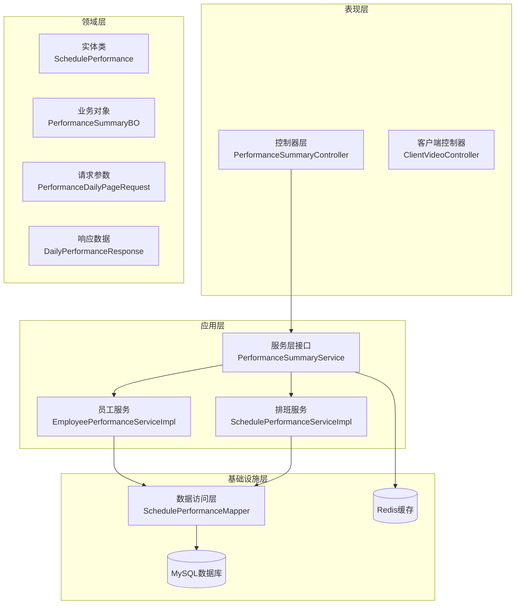
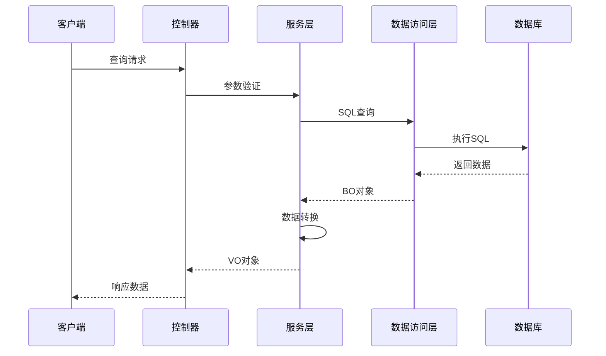
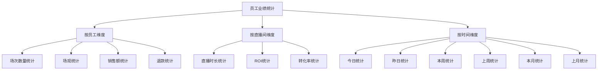
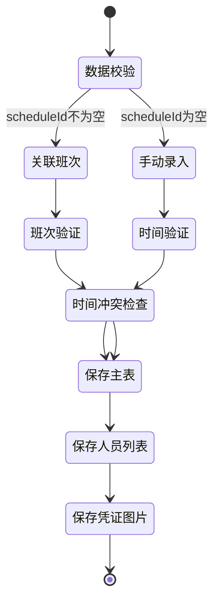
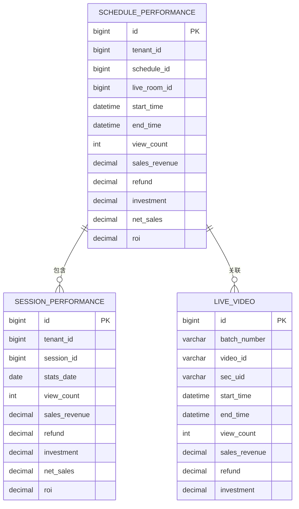
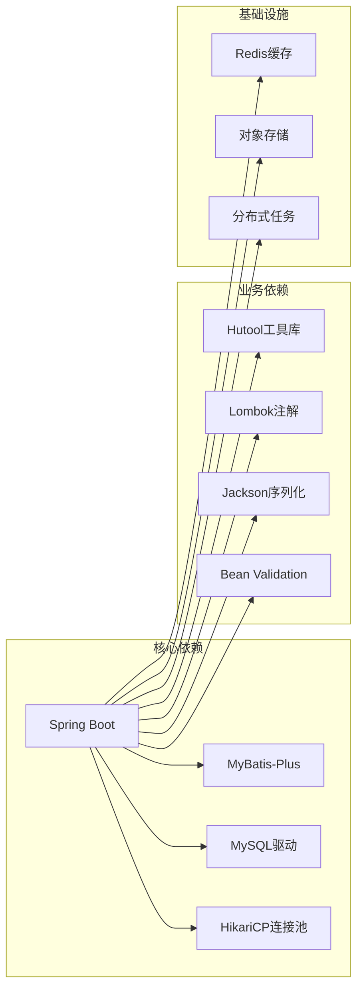
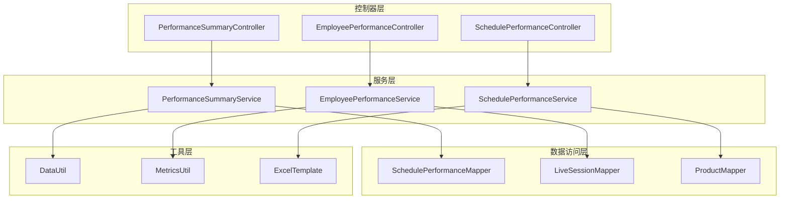
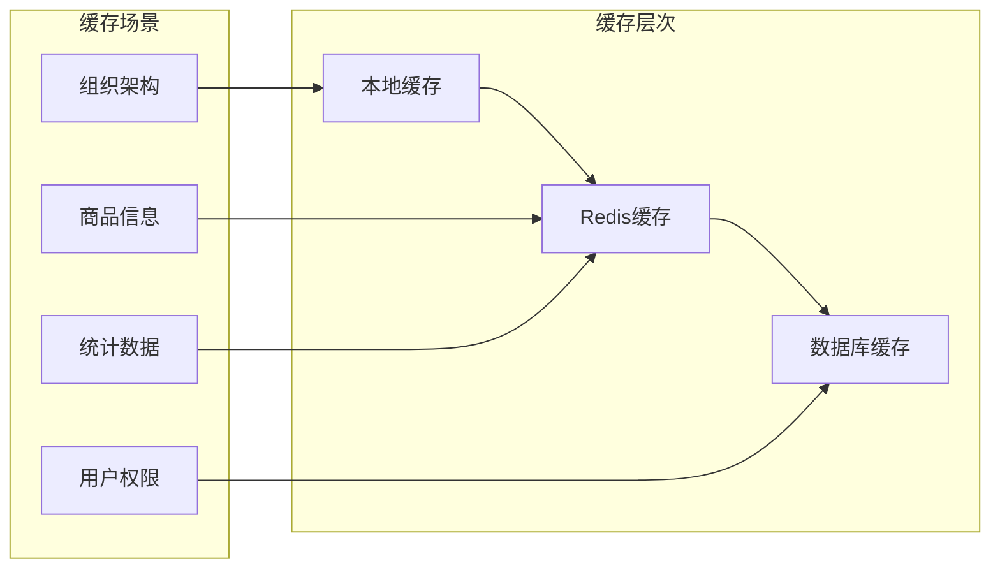
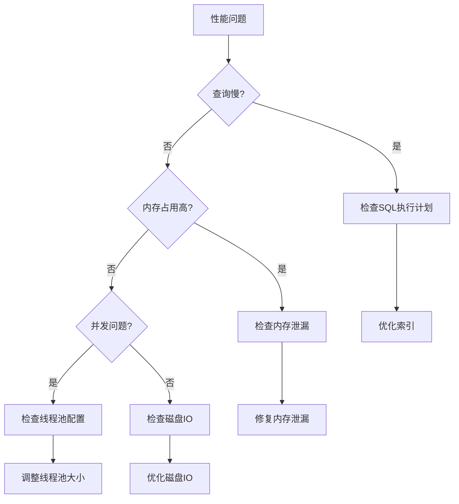
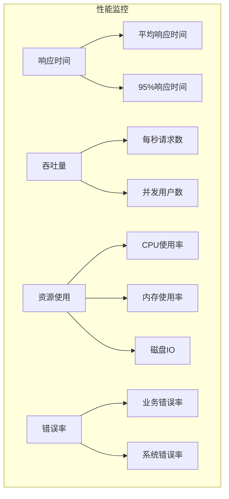

# 性能模块

<cite>
**本文档引用的文件**
- [PerformanceSummaryController.java](file://src/main/java/com/jiuyu/governance/business/performance/controller/PerformanceSummaryController.java)
- [EmployeePerformanceServiceImpl.java](file://src/main/java/com/jiuyu/governance/business/performance/service/impl/EmployeePerformanceServiceImpl.java)
- [BasePerformanceEntity.java](file://src/main/java/com/jiuyu/governance/business/performance/pojo/base/BasePerformanceEntity.java)
- [MetricsUtil.java](file://src/main/java/com/jiuyu/governance/business/performance/utils/MetricsUtil.java)
- [SchedulePerformanceServiceImpl.java](file://src/main/java/com/jiuyu/governance/business/performance/service/impl/SchedulePerformanceServiceImpl.java)
- [SchedulePerformance.java](file://src/main/java/com/jiuyu/governance/business/performance/pojo/entity/SchedulePerformance.java)
- [SchedulePerformanceMapper.java](file://src/main/java/com/jiuyu/governance/business/performance/mapper/SchedulePerformanceMapper.java)
- [performance_tables.sql](file://src/main/resources/sql/performance_tables.sql)
- [application.yml](file://src/main/resources/application.yml)
- [PerformanceSummaryService.java](file://src/main/java/com/jiuyu/governance/business/performance/service/PerformanceSummaryService.java)
- [PerformanceDailyPageRequest.java](file://src/main/java/com/jiuyu/governance/business/performance/pojo/request/PerformanceDailyPageRequest.java)
- [DailyPerformanceResponse.java](file://src/main/java/com/jiuyu/governance/business/performance/pojo/response/DailyPerformanceResponse.java)
- [DataUtil.java](file://src/main/java/com/jiuyu/governance/business/performance/utils/DataUtil.java)
</cite>

## 目录
1. [简介](#简介)
2. [项目结构](#项目结构)
3. [核心组件](#核心组件)
4. [架构概览](#架构概览)
5. [详细组件分析](#详细组件分析)
6. [依赖关系分析](#依赖关系分析)
7. [性能考虑](#性能考虑)
8. [故障排除指南](#故障排除指南)
9. [结论](#结论)

## 简介

性能模块是治理系统中的核心业务模块，负责直播电商场景下的业绩数据统计、分析和展示。该模块提供了完整的业绩管理体系，包括直播场次统计、排班业绩管理、人员业绩追踪、商品销售分析等功能。

模块采用分层架构设计，包含控制器层、服务层、数据访问层和工具层，支持多维度的数据聚合和复杂的业务计算。系统基于Spring Boot框架构建，使用MyBatis-Plus进行数据持久化，支持高性能的分页查询和批量操作。

## 项目结构

性能模块采用标准的Maven项目结构，主要目录组织如下：

```mermaid
graph TB
subgraph "性能模块结构"
A[controller/] -- 控制器层 -->
B[service/] -- 服务层 -->
C[pojo/] -- 数据模型层 -->
D[mapper/] -- 数据访问层 -->
E[utils/] -- 工具类层 -->
F[task/] -- 任务调度 -->
G[resources/sql/] -- 数据库脚本 -->
end
subgraph "POJO层次"
H[entity/] -- 实体类 -->
I[bo/] -- 业务对象 -->
J[request/] -- 请求参数 -->
K[response/] -- 响应数据 -->
L[constants/] -- 常量定义 -->
end
A --> H
B --> I
C --> J
D --> K
E --> L
```

**图表来源**
- [PerformanceSummaryController.java:1-364](file://src/main/java/com/jiuyu/governance/business/performance/controller/PerformanceSummaryController.java#L1-L364)
- [SchedulePerformanceServiceImpl.java:1-934](file://src/main/java/com/jiuyu/governance/business/performance/service/impl/SchedulePerformanceServiceImpl.java#L1-L934)

**章节来源**
- [PerformanceSummaryController.java:1-364](file://src/main/java/com/jiuyu/governance/business/performance/controller/PerformanceSummaryController.java#L1-L364)
- [SchedulePerformanceServiceImpl.java:1-934](file://src/main/java/com/jiuyu/governance/business/performance/service/impl/SchedulePerformanceServiceImpl.java#L1-L934)

## 核心组件

### 1. 业绩核心实体基类

BasePerformanceEntity提供统一的业绩指标字段定义，消除了跨表字段冗余问题：

| 指标类别 | 字段数量 | 作用 |
|---------|---------|------|
| 基础指标 | 4个 | 场观、销售额、退款、投放 |
| 派生指标 | 8个 | 净销售额、退款率、ROI、千次成交等 |
| 用户行为 | 4个 | 曝光次数、涨粉人数、互动率、点击-成交率 |
| 转化效率 | 3个 | 带货转化率、UV价值、涨粉率 |

### 2. 指标计算工具

MetricsUtil提供标准化的业务指标计算方法，确保数据一致性：

- **精度控制**：默认4位小数，支持自定义精度
- **异常处理**：空值安全，除零保护
- **格式转换**：百分比格式化，金额单位转换
- **复合计算**：支持复杂指标的组合计算

### 3. 数据处理工具

DataUtil负责时间维度处理和数据格式化：

- **时段计算**：智能计算今日、昨日、本周、上周、本月、上月
- **数据转换**：统一的BO到VO转换机制
- **格式化**：直播时段字符串格式化

**章节来源**
- [BasePerformanceEntity.java:1-261](file://src/main/java/com/jiuyu/governance/business/performance/pojo/base/BasePerformanceEntity.java#L1-L261)
- [MetricsUtil.java:1-290](file://src/main/java/com/jiuyu/governance/business/performance/utils/MetricsUtil.java#L1-L290)
- [DataUtil.java:1-192](file://src/main/java/com/jiuyu/governance/business/performance/utils/DataUtil.java#L1-L192)

## 架构概览

性能模块采用经典的三层架构模式，结合领域驱动设计原则：



**图表来源**
- [PerformanceSummaryController.java:61-364](file://src/main/java/com/jiuyu/governance/business/performance/controller/PerformanceSummaryController.java#L61-L364)
- [PerformanceSummaryService.java:29-220](file://src/main/java/com/jiuyu/governance/business/performance/service/PerformanceSummaryService.java#L29-L220)
- [SchedulePerformanceMapper.java:29-260](file://src/main/java/com/jiuyu/governance/business/performance/mapper/SchedulePerformanceMapper.java#L29-L260)

### 核心业务流程



**图表来源**
- [PerformanceSummaryController.java:79-85](file://src/main/java/com/jiuyu/governance/business/performance/controller/PerformanceSummaryController.java#L79-L85)
- [SchedulePerformanceServiceImpl.java:78-111](file://src/main/java/com/jiuyu/governance/business/performance/service/impl/SchedulePerformanceServiceImpl.java#L78-L111)

## 详细组件分析

### 1. 业绩汇总控制器

PerformanceSummaryController提供多维度的业绩数据查询功能：

#### 核心功能模块

| 功能模块 | 接口数量 | 支持维度 | 查询方式 |
|---------|---------|---------|---------|
| 分公司业绩 | 1个 | 企业级 | 分页查询 |
| 部门业绩 | 1个 | 组织级 | 分页查询 |
| 小组业绩 | 1个 | 团队级 | 分页查询 |
| 直播间业绩 | 1个 | 业务级 | 分页查询 |
| 组织统计 | 1个 | 多层级 | 统计查询 |
| 时段统计 | 1个 | 时间维 | 聚合查询 |
| 趋势分析 | 1个 | 时间序列 | 序列查询 |
| 日常详情 | 1个 | 细粒度 | 分页查询 |

#### 数据导出功能

支持Excel格式的数据导出，包括：
- 各分公司业绩数据导出
- 各部门业绩数据导出  
- 各小组业绩数据导出
- 各直播间业绩数据导出
- 每日业绩数据导出

**章节来源**
- [PerformanceSummaryController.java:69-364](file://src/main/java/com/jiuyu/governance/business/performance/controller/PerformanceSummaryController.java#L69-L364)

### 2. 员工业绩服务

EmployeePerformanceServiceImpl实现员工维度的业绩统计分析：

#### 核心统计维度



**图表来源**
- [EmployeePerformanceServiceImpl.java:68-182](file://src/main/java/com/jiuyu/governance/business/performance/service/impl/EmployeePerformanceServiceImpl.java#L68-L182)

#### 性能优化策略

- **批量查询**：使用MyBatis-Plus分页插件
- **批量映射**：使用Complete工具进行批量名称映射
- **缓存策略**：利用Redis缓存常用组织信息
- **延迟加载**：按需加载直播间名称和组织信息

**章节来源**
- [EmployeePerformanceServiceImpl.java:1-409](file://src/main/java/com/jiuyu/governance/business/performance/service/impl/EmployeePerformanceServiceImpl.java#L1-L409)

### 3. 排班业绩服务

SchedulePerformanceServiceImpl管理直播排班相关的业绩数据：

#### 核心业务流程



**图表来源**
- [SchedulePerformanceServiceImpl.java:390-438](file://src/main/java/com/jiuyu/governance/business/performance/service/impl/SchedulePerformanceServiceImpl.java#L390-L438)

#### 数据完整性保障

- **事务管理**：使用@Transactional注解确保数据一致性
- **时间约束**：防止直播时间重叠
- **来源追踪**：区分系统数据和手动录入数据
- **原始值记录**：记录手动修改前的原始数据

**章节来源**
- [SchedulePerformanceServiceImpl.java:1-934](file://src/main/java/com/jiuyu/governance/business/performance/service/impl/SchedulePerformanceServiceImpl.java#L1-L934)

### 4. 数据模型设计

#### 核心实体关系



**图表来源**
- [performance_tables.sql:367-408](file://src/main/java/com/jiuyu/governance/business/performance/pojo/entity/SchedulePerformance.java#L367-L408)

**章节来源**
- [performance_tables.sql:1-536](file://src/main/resources/sql/performance_tables.sql#L1-L536)

## 依赖关系分析

### 1. 外部依赖



**图表来源**
- [application.yml:1-151](file://src/main/resources/application.yml#L1-L151)

### 2. 内部模块依赖



**图表来源**
- [PerformanceSummaryController.java:61-364](file://src/main/java/com/jiuyu/governance/business/performance/controller/PerformanceSummaryController.java#L61-L364)
- [SchedulePerformanceMapper.java:29-260](file://src/main/java/com/jiuyu/governance/business/performance/mapper/SchedulePerformanceMapper.java#L29-L260)

**章节来源**
- [application.yml:1-151](file://src/main/resources/application.yml#L1-L151)

## 性能考虑

### 1. 数据库性能优化

#### 索引策略

| 表名 | 主键索引 | 常用查询索引 | 说明 |
|------|----------|-------------|------|
| schedule_performance | id | tenant_id, schedule_id | 排班业绩主表 |
| session_performance | id | tenant_id, session_id, stats_date | 场次业绩表 |
| live_session | id | tenant_id, batch_number | 直播场次表 |
| live_video | id | tenant_id, video_id, batch_number | 视频片段表 |
| schedule_session | id | tenant_id, schedule_id, session_id | 排班分摊表 |

#### 查询优化

- **分页查询**：使用MyBatis-Plus分页插件，避免全表扫描
- **批量操作**：支持批量插入和更新，减少数据库往返
- **延迟加载**：按需加载关联数据，避免N+1查询问题
- **缓存策略**：Redis缓存热点数据，降低数据库压力

### 2. 缓存策略



### 3. 异步处理

- **批量导入**：支持Excel批量导入，异步处理大数据量
- **定时任务**：XXL-Job分布式任务调度
- **消息队列**：异步处理非关键业务

## 故障排除指南

### 1. 常见问题诊断

#### 数据查询问题

| 问题类型 | 症状 | 解决方案 |
|---------|------|---------|
| 查询超时 | SQL执行时间过长 | 检查索引，优化查询条件 |
| 数据不一致 | 同一数据多次查询结果不同 | 检查事务隔离级别 |
| 内存溢出 | 大数据量查询导致内存不足 | 使用分页查询，限制查询范围 |
| 缓存失效 | 缓存数据过期 | 检查缓存配置，调整过期时间 |

#### 性能问题排查



### 2. 错误码对照表

| 错误码 | 类型 | 说明 | 处理建议 |
|--------|------|------|---------|
| 1001 | 参数错误 | 请求参数缺失或格式不正确 | 检查请求参数，参考接口文档 |
| 1002 | 权限不足 | 用户无访问权限 | 检查用户权限配置 |
| 1003 | 数据不存在 | 查询的数据不存在 | 检查数据状态，确认数据有效性 |
| 1004 | 业务异常 | 业务逻辑错误 | 查看具体异常信息，修正业务逻辑 |
| 1005 | 系统异常 | 系统内部错误 | 查看系统日志，重启服务 |

### 3. 监控指标



**章节来源**
- [application.yml:1-151](file://src/main/resources/application.yml#L1-L151)

## 结论

性能模块是一个设计完善的直播电商业绩管理系统，具有以下特点：

### 核心优势

1. **架构清晰**：采用分层架构，职责明确，易于维护和扩展
2. **功能完整**：覆盖直播电商全链路的业绩统计需求
3. **性能优秀**：通过索引优化、缓存策略、分页查询等手段保证高性能
4. **数据准确**：统一的指标计算规则，确保数据一致性
5. **扩展性强**：模块化设计，支持功能扩展和定制开发

### 技术亮点

- **统一指标体系**：BasePerformanceEntity提供标准化的指标定义
- **智能时间维度**：DataUtil自动处理复杂的日期计算逻辑
- **批量处理能力**：支持大规模数据的高效处理
- **事务安全保障**：严格的业务流程控制和数据一致性保证

### 发展建议

1. **监控完善**：增加更细粒度的性能监控和告警机制
2. **缓存优化**：进一步优化缓存策略，提升查询性能
3. **异步化**：对非关键操作进行异步化处理
4. **微服务化**：考虑将模块拆分为独立的服务，提升系统弹性

该模块为直播电商运营提供了强有力的技术支撑，能够满足企业级的业绩管理和分析需求。