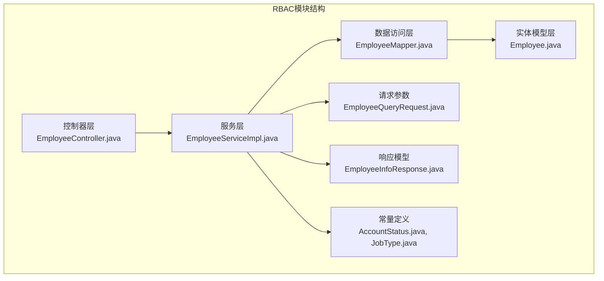
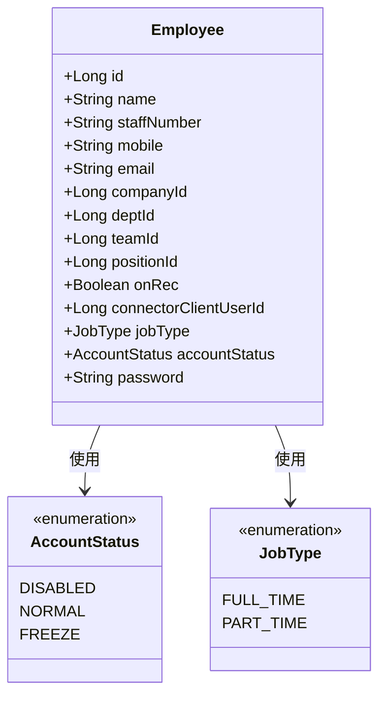
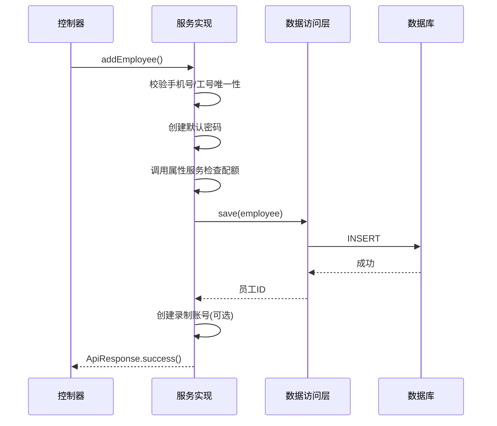
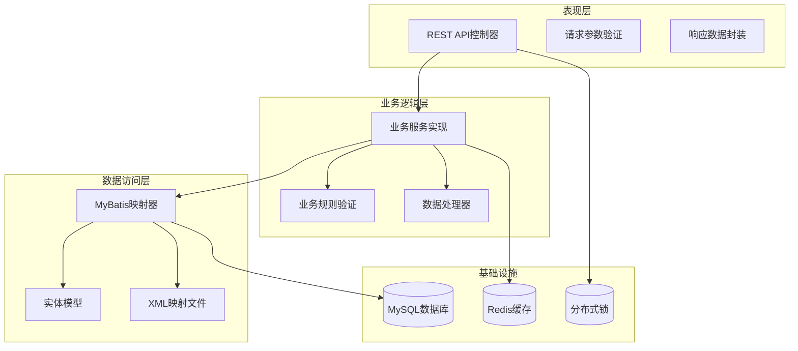
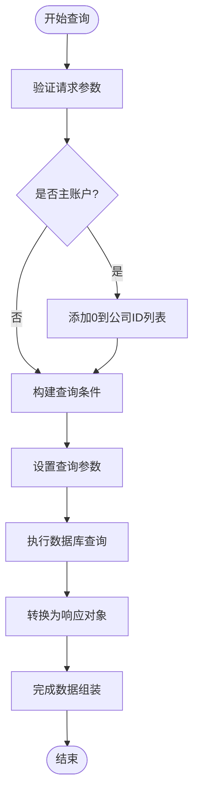
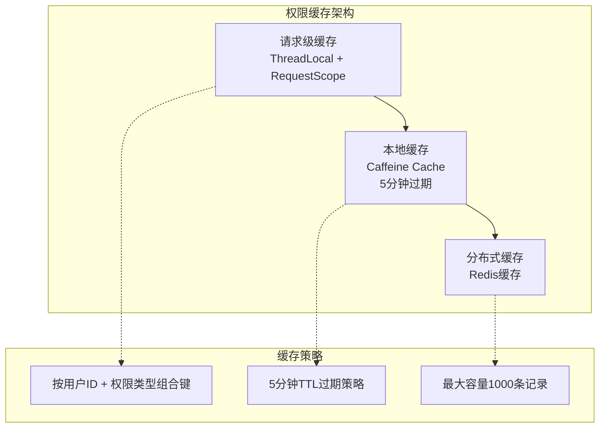
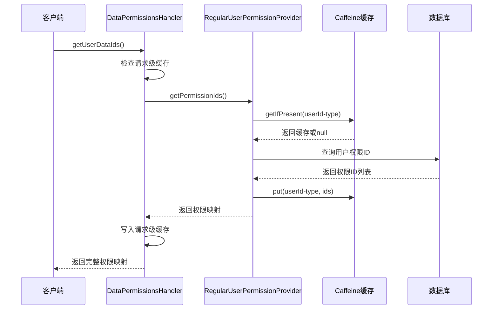
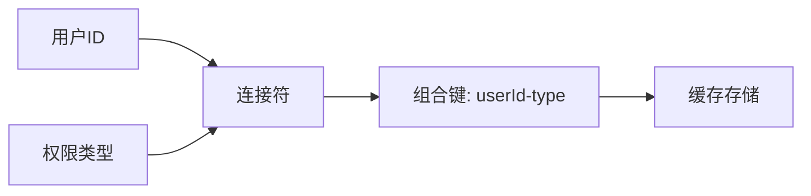
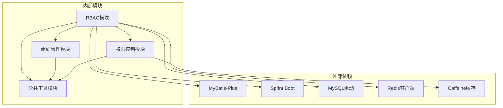

# RBAC员工映射器

<cite>
**本文档引用的文件**
- [EmployeeMapper.java](file://src/main/java/com/jiuyu/governance/business/rbac/mapper/EmployeeMapper.java)
- [EmployeeMapper.xml](file://src/main/resources/mapper/rbac/EmployeeMapper.xml)
- [EmployeeServiceImpl.java](file://src/main/java/com/jiuyu/governance/business/rbac/service/impl/EmployeeServiceImpl.java)
- [EmployeeController.java](file://src/main/java/com/jiuyu/governance/business/rbac/controller/EmployeeController.java)
- [Employee.java](file://src/main/java/com/jiuyu/governance/business/rbac/pojo/entity/Employee.java)
- [EmployeeQueryRequest.java](file://src/main/java/com/jiuyu/governance/business/rbac/pojo/request/EmployeeQueryRequest.java)
- [EmployeeInfoResponse.java](file://src/main/java/com/jiuyu/governance/business/rbac/pojo/response/EmployeeInfoResponse.java)
- [EmployeeService.java](file://src/main/java/com/jiuyu/governance/business/rbac/service/EmployeeService.java)
- [UserRoleMapper.java](file://src/main/java/com/jiuyu/governance/business/rbac/mapper/UserRoleMapper.java)
- [UserRoleMapper.xml](file://src/main/resources/mapper/rbac/UserRoleMapper.xml)
- [application.yml](file://src/main/resources/application.yml)
- [AccountStatus.java](file://src/main/java/com/jiuyu/governance/business/rbac/pojo/constants/AccountStatus.java)
- [JobType.java](file://src/main/java/com/jiuyu/governance/business/rbac/pojo/constants/JobType.java)
- [EmployeeAddRequest.java](file://src/main/java/com/jiuyu/governance/business/rbac/pojo/request/EmployeeAddRequest.java)
- [EmployeeUpdateRequest.java](file://src/main/java/com/jiuyu/governance/business/rbac/pojo/request/EmployeeUpdateRequest.java)
- [RegularUserPermissionProvider.java](file://src/main/java/com/jiuyu/governance/plugins/oauth/data/provider/RegularUserPermissionProvider.java)
- [DataPermissionsHandler.java](file://src/main/java/com/jiuyu/governance/plugins/oauth/data/supports/DataPermissionsHandler.java)
- [PermissionContextHolder.java](file://src/main/java/com/jiuyu/governance/plugins/oauth/data/supports/PermissionContextHolder.java)
- [DataPermissionsAuthConfiguration.java](file://src/main/java/com/jiuyu/governance/plugins/oauth/data/DataPermissionsAuthConfiguration.java)
- [DataPermissionsParameter.java](file://src/main/java/com/jiuyu/governance/plugins/oauth/data/supports/DataPermissionsParameter.java)
- [UserPermissionProvider.java](file://src/main/java/com/jiuyu/governance/plugins/oauth/data/provider/UserPermissionProvider.java)
</cite>

## 更新摘要
**所做更改**
- 新增权限缓存系统章节，详细介绍Caffeine本地缓存机制
- 更新权限管理系统部分，增加可配置缓存策略说明
- 新增缓存配置和管理章节，涵盖多级缓存架构
- 更新性能考虑部分，增加缓存优化策略

## 目录
1. [简介](#简介)
2. [项目结构](#项目结构)
3. [核心组件](#核心组件)
4. [架构概览](#架构概览)
5. [详细组件分析](#详细组件分析)
6. [权限缓存系统](#权限缓存系统)
7. [依赖关系分析](#依赖关系分析)
8. [性能考虑](#性能考虑)
9. [故障排除指南](#故障排除指南)
10. [结论](#结论)

## 简介

RBAC员工映射器是企业治理系统中的核心模块，负责员工信息的管理、权限控制和数据持久化。该模块基于MyBatis-Plus框架构建，实现了完整的RBAC（基于角色的访问控制）体系，支持多租户环境下的员工管理、角色分配和权限验证。

该系统采用分层架构设计，包括控制器层、服务层、数据访问层和实体模型层，确保了代码的可维护性和扩展性。通过XML映射文件和注解结合的方式，实现了灵活的数据查询和复杂的业务逻辑处理。

**更新** 系统现已集成完整的权限缓存系统，支持多级缓存架构，包括请求级缓存、本地Caffeine缓存和分布式缓存，显著提升了权限查询性能。

## 项目结构

RBAC员工映射器模块位于`src/main/java/com/jiuyu/governance/business/rbac/`目录下，按照功能域进行了清晰的组织：



**图表来源**
- [EmployeeController.java:1-224](file://src/main/java/com/jiuyu/governance/business/rbac/controller/EmployeeController.java#L1-L224)
- [EmployeeServiceImpl.java:1-800](file://src/main/java/com/jiuyu/governance/business/rbac/service/impl/EmployeeServiceImpl.java#L1-L800)
- [EmployeeMapper.java:1-45](file://src/main/java/com/jiuyu/governance/business/rbac/mapper/EmployeeMapper.java#L1-L45)

**章节来源**
- [EmployeeController.java:1-224](file://src/main/java/com/jiuyu/governance/business/rbac/controller/EmployeeController.java#L1-L224)
- [EmployeeServiceImpl.java:1-800](file://src/main/java/com/jiuyu/governance/business/rbac/service/impl/EmployeeServiceImpl.java#L1-L800)
- [EmployeeMapper.java:1-45](file://src/main/java/com/jiuyu/governance/business/rbac/mapper/EmployeeMapper.java#L1-L45)

## 核心组件

### 数据模型层

员工实体模型定义了完整的员工信息结构，包括基础信息、组织关联和权限状态：



**图表来源**
- [Employee.java:1-171](file://src/main/java/com/jiuyu/governance/business/rbac/pojo/entity/Employee.java#L1-L171)
- [AccountStatus.java:1-31](file://src/main/java/com/jiuyu/governance/business/rbac/pojo/constants/AccountStatus.java#L1-L31)
- [JobType.java:1-27](file://src/main/java/com/jiuyu/governance/business/rbac/pojo/constants/JobType.java#L1-L27)

### 数据访问层

EmployeeMapper接口提供了员工数据的CRUD操作和复杂查询能力：

| 方法 | 功能描述 | 参数 |
|------|----------|------|
| `countPositionEmployee` | 统计职位人员数量 | `List<Long> positionIds` |
| `pageQueryEmployee` | 分页查询员工信息 | `IPage<Employee>, EmployeeQueryRequest, Long tenantId, Boolean isMain` |

**章节来源**
- [EmployeeMapper.java:21-45](file://src/main/java/com/jiuyu/governance/business/rbac/mapper/EmployeeMapper.java#L21-L45)
- [EmployeeMapper.xml:34-130](file://src/main/resources/mapper/rbac/EmployeeMapper.xml#L34-L130)

### 服务层实现

EmployeeServiceImpl类实现了完整的业务逻辑，包括员工管理、权限控制和数据同步：



**图表来源**
- [EmployeeServiceImpl.java:357-425](file://src/main/java/com/jiuyu/governance/business/rbac/service/impl/EmployeeServiceImpl.java#L357-L425)
- [EmployeeMapper.java:43-43](file://src/main/java/com/jiuyu/governance/business/rbac/mapper/EmployeeMapper.java#L43-L43)

**章节来源**
- [EmployeeServiceImpl.java:357-425](file://src/main/java/com/jiuyu/governance/business/rbac/service/impl/EmployeeServiceImpl.java#L357-L425)

## 架构概览

系统采用经典的三层架构模式，实现了清晰的职责分离：



**图表来源**
- [EmployeeController.java:30-224](file://src/main/java/com/jiuyu/governance/business/rbac/controller/EmployeeController.java#L30-L224)
- [EmployeeServiceImpl.java:67-86](file://src/main/java/com/jiuyu/governance/business/rbac/service/impl/EmployeeServiceImpl.java#L67-L86)
- [application.yml:63-83](file://src/main/resources/application.yml#L63-L83)

## 详细组件分析

### 员工管理控制器

EmployeeController提供了完整的员工管理API接口，支持增删改查、权限管理和状态控制：

| 接口 | HTTP方法 | 权限标识 | 功能描述 |
|------|----------|----------|----------|
| `/api/governance/employee/add` | POST | `sys:employee:add` | 新增员工 |
| `/api/governance/employee/update` | POST | `sys:employee:update` | 更新员工信息 |
| `/api/governance/employee/detail` | GET | `sys:employee:list` | 获取员工详情 |
| `/api/governance/employee/page` | POST | `sys:employee:list` | 分页查询员工 |
| `/api/governance/employee/on-rec` | POST | `sys:employee:add` | 开启录制权限 |
| `/api/governance/employee/disable` | POST | `sys:employee:update` | 禁用员工账户 |

**章节来源**
- [EmployeeController.java:50-196](file://src/main/java/com/jiuyu/governance/business/rbac/controller/EmployeeController.java#L50-L196)

### 数据查询机制

系统实现了灵活的员工查询机制，支持多种筛选条件和权限控制：



**图表来源**
- [EmployeeServiceImpl.java:562-600](file://src/main/java/com/jiuyu/governance/business/rbac/service/impl/EmployeeServiceImpl.java#L562-L600)
- [EmployeeMapper.xml:46-130](file://src/main/resources/mapper/rbac/EmployeeMapper.xml#L46-L130)

**章节来源**
- [EmployeeServiceImpl.java:562-600](file://src/main/java/com/jiuyu/governance/business/rbac/service/impl/EmployeeServiceImpl.java#L562-L600)
- [EmployeeQueryRequest.java:23-247](file://src/main/java/com/jiuyu/governance/business/rbac/pojo/request/EmployeeQueryRequest.java#L23-L247)

### 权限管理系统

系统集成了完整的RBAC权限控制机制，支持角色分配和权限验证：

```mermaid
classDiagram
class Employee {
+Long id
+Long roleId
+Boolean onRec
+AccountStatus accountStatus
}
class UserRole {
+Long id
+Long userId
+Long roleId
}
class Role {
+Long id
+String roleName
+String roleCode
}
Employee --> UserRole : 1 : N
UserRole --> Role : N : 1
```

**图表来源**
- [Employee.java:148-169](file://src/main/java/com/jiuyu/governance/business/rbac/pojo/entity/Employee.java#L148-L169)
- [UserRoleMapper.java:17-36](file://src/main/java/com/jiuyu/governance/business/rbac/mapper/UserRoleMapper.java#L17-L36)

**章节来源**
- [UserRoleMapper.java:17-36](file://src/main/java/com/jiuyu/governance/business/rbac/mapper/UserRoleMapper.java#L17-L36)
- [UserRoleMapper.xml:19-33](file://src/main/resources/mapper/rbac/UserRoleMapper.xml#L19-L33)

### 多租户支持

系统支持多租户架构，每个租户拥有独立的员工数据和权限隔离：

| 租户特性 | 实现方式 | 安全保障 |
|----------|----------|----------|
| 数据隔离 | `tenant_id` 字段 | SQL层面过滤 |
| 权限控制 | `hold_tenant` 标识 | 业务逻辑验证 |
| 资源配额 | 属性服务集成 | 额度检查 |
| 缓存管理 | 组织缓存清理 | 变更时自动失效 |

**章节来源**
- [EmployeeServiceImpl.java:104-169](file://src/main/java/com/jiuyu/governance/business/rbac/service/impl/EmployeeServiceImpl.java#L104-L169)
- [EmployeeMapper.xml:62-64](file://src/main/resources/mapper/rbac/EmployeeMapper.xml#L62-L64)

## 权限缓存系统

**新增** 系统现已集成完整的权限缓存系统，提供多级缓存架构以提升权限查询性能。

### 缓存架构设计

系统采用三级缓存架构，从局部到全局逐层提升缓存命中率：



**图表来源**
- [RegularUserPermissionProvider.java:42-52](file://src/main/java/com/jiuyu/governance/plugins/oauth/data/provider/RegularUserPermissionProvider.java#L42-L52)
- [DataPermissionsHandler.java:508-544](file://src/main/java/com/jiuyu/governance/plugins/oauth/data/supports/DataPermissionsHandler.java#L508-L544)

### RegularUserPermissionProvider缓存实现

RegularUserPermissionProvider类实现了可配置的本地缓存机制：



**图表来源**
- [RegularUserPermissionProvider.java:69-101](file://src/main/java/com/jiuyu/governance/plugins/oauth/data/provider/RegularUserPermissionProvider.java#L69-L101)
- [DataPermissionsHandler.java:508-544](file://src/main/java/com/jiuyu/governance/plugins/oauth/data/supports/DataPermissionsHandler.java#L508-L544)

### 缓存配置与管理

系统提供了灵活的缓存配置选项：

| 配置项 | 默认值 | 描述 | 生效范围 |
|--------|--------|------|----------|
| `enableLocalCache` | false | 是否启用本地Caffeine缓存 | 单节点进程 |
| `cache.maximumSize` | 1000 | 缓存最大条目数 | 本地缓存 |
| `cache.expireAfterWrite` | 5分钟 | 写入后过期时间 | 本地缓存 |
| `enableQuery` | true | 是否启用查询权限处理 | 全局配置 |

**章节来源**
- [RegularUserPermissionProvider.java:42-52](file://src/main/java/com/jiuyu/governance/plugins/oauth/data/provider/RegularUserPermissionProvider.java#L42-L52)
- [DataPermissionsParameter.java:22-33](file://src/main/java/com/jiuyu/governance/plugins/oauth/data/supports/DataPermissionsParameter.java#L22-L33)

### 缓存键设计策略

缓存键采用用户ID与权限类型的组合策略，确保缓存的准确性和有效性：



**图表来源**
- [RegularUserPermissionProvider.java:78-98](file://src/main/java/com/jiuyu/governance/plugins/oauth/data/provider/RegularUserPermissionProvider.java#L78-L98)

**章节来源**
- [RegularUserPermissionProvider.java:78-98](file://src/main/java/com/jiuyu/governance/plugins/oauth/data/provider/RegularUserPermissionProvider.java#L78-L98)

## 依赖关系分析

系统依赖关系清晰，遵循单一职责原则：



**图表来源**
- [EmployeeServiceImpl.java:15-50](file://src/main/java/com/jiuyu/governance/business/rbac/service/impl/EmployeeServiceImpl.java#L15-L50)
- [application.yml:43-100](file://src/main/resources/application.yml#L43-L100)

**章节来源**
- [EmployeeServiceImpl.java:15-50](file://src/main/java/com/jiuyu/governance/business/rbac/service/impl/EmployeeServiceImpl.java#L15-L50)
- [application.yml:43-100](file://src/main/resources/application.yml#L43-L100)

## 性能考虑

系统在设计时充分考虑了性能优化，特别是权限查询的性能提升：

### 查询优化策略

1. **多级缓存架构**: 实现L1请求级缓存、L2本地Caffeine缓存和L3分布式缓存的三级缓存
2. **索引设计**: 在常用查询字段上建立适当索引
3. **分页查询**: 使用MyBatis-Plus分页插件避免全表扫描
4. **批量操作**: 支持批量插入和更新操作

### 缓存性能优化

**新增** 权限缓存系统提供了以下性能优化：

- **本地缓存**: 使用Caffeine实现高性能本地缓存，支持5分钟过期策略
- **缓存预热**: 系统启动时预热常用权限数据
- **缓存淘汰**: 基于LRU算法的智能缓存淘汰机制
- **并发安全**: 无锁设计确保高并发场景下的缓存性能

### 并发控制

1. **分布式锁**: 使用Redis实现分布式锁防止重复提交
2. **乐观锁**: 基于版本号的并发控制
3. **事务管理**: 合理的事务边界设计

## 故障排除指南

### 常见问题及解决方案

| 问题类型 | 症状 | 可能原因 | 解决方案 |
|----------|------|----------|----------|
| 数据库连接失败 | 连接超时 | 数据源配置错误 | 检查application.yml中的数据库配置 |
| 权限验证失败 | 403 Forbidden | 角色权限不足 | 确认用户角色和权限配置 |
| 查询结果为空 | 分页查询无数据 | 查询条件过于严格 | 检查EmployeeQueryRequest参数 |
| 并发冲突 | 重复提交 | 竞态条件 | 使用@ResourceLock注解 |
| 缓存失效 | 权限更新不及时 | 缓存过期策略 | 检查5分钟过期配置 |
| 缓存穿透 | 频繁查询数据库 | 缓存未命中 | 优化缓存键设计 |

**章节来源**
- [EmployeeServiceImpl.java:104-169](file://src/main/java/com/jiuyu/governance/business/rbac/service/impl/EmployeeServiceImpl.java#L104-L169)
- [EmployeeController.java:50-55](file://src/main/java/com/jiuyu/governance/business/rbac/controller/EmployeeController.java#L50-L55)

### 日志监控

系统提供了完善的日志记录机制，便于问题诊断：

- **业务日志**: 记录关键业务操作和状态变更
- **错误日志**: 捕获异常信息和堆栈跟踪
- **性能日志**: 监控查询耗时和系统负载
- **缓存日志**: 监控缓存命中率和性能指标

## 结论

RBAC员工映射器模块展现了现代企业级应用的设计理念，通过清晰的分层架构、完善的权限控制和灵活的数据查询机制，为企业治理提供了强大的技术支持。

**更新** 新增的权限缓存系统进一步提升了系统的性能和可扩展性，通过多级缓存架构和智能缓存策略，显著降低了权限查询的延迟和数据库压力。

该模块的主要优势包括：

1. **架构清晰**: 采用标准的三层架构，职责分离明确
2. **扩展性强**: 支持多租户和动态权限配置
3. **性能优化**: 多级缓存架构和智能缓存策略
4. **安全可靠**: 完善的权限验证和数据保护
5. **易于维护**: 清晰的代码结构和文档说明
6. **可配置性强**: 支持灵活的缓存配置和管理

通过持续的优化和改进，该模块能够满足企业不断发展的管理需求，为数字化转型提供坚实的技术基础。