# 房间 API

<cite>
**本文档引用的文件**
- [LiveRoomAdminController.java](file://src/main/java/com/jiuyu/governance/business/room/controller/LiveRoomAdminController.java)
- [LiveRoomClientController.java](file://src/main/java/com/jiuyu/governance/business/room/controller/LiveRoomClientController.java)
- [LiveRoomScheduleAdminController.java](file://src/main/java/com/jiuyu/governance/business/room/controller/LiveRoomScheduleAdminController.java)
- [LiveRoomService.java](file://src/main/java/com/jiuyu/governance/business/room/service/LiveRoomService.java)
- [LiveRoomScheduleManageService.java](file://src/main/java/com/jiuyu/governance/business/room/service/LiveRoomScheduleManageService.java)
- [LiveRoomScheduleService.java](file://src/main/java/com/jiuyu/governance/business/room/service/LiveRoomScheduleService.java)
- [LiveRoomServiceImpl.java](file://src/main/java/com/jiuyu/governance/business/room/service/impl/LiveRoomServiceImpl.java)
- [LiveRoomScheduleManageServiceImpl.java](file://src/main/java/com/jiuyu/governance/business/room/service/impl/LiveRoomScheduleManageServiceImpl.java)
- [LiveRoomAddRequest.java](file://src/main/java/com/jiuyu/governance/business/room/pojo/request/LiveRoomAddRequest.java)
- [LiveRoomScheduleAddRequest.java](file://src/main/java/com/jiuyu/governance/business/room/pojo/request/schedule/LiveRoomScheduleAddRequest.java)
- [LivePlatformType.java](file://src/main/java/com/jiuyu/governance/business/room/pojo/constants/LivePlatformType.java)
- [LiveRoom.java](file://src/main/java/com/jiuyu/governance/business/room/pojo/entity/LiveRoom.java)
- [WorkSchedule.java](file://src/main/java/com/jiuyu/governance/business/room/pojo/entity/WorkSchedule.java)
- [LiveRoomScheduleAttribute.java](file://src/main/java/com/jiuyu/governance/business/room/pojo/entity/LiveRoomScheduleAttribute.java)
- [WorkScheduleMapper.java](file://src/main/java/com/jiuyu/governance/business/room/mapper/WorkScheduleMapper.java)
- [LiveRoomMapper.java](file://src/main/java/com/jiuyu/governance/business/room/mapper/LiveRoomMapper.java)
- [LiveRoomMapper.xml](file://src/main/resources/mapper/room/LiveRoomMapper.xml)
- [LiveRoomScheduleAttributeMapper.xml](file://src/main/resources/mapper/room/LiveRoomScheduleAttributeMapper.xml)
- [WorkScheduleMapper.xml](file://src/main/resources/mapper/room/WorkScheduleMapper.xml)
- [ClientLiveRoomSchedulesResponse.java](file://src/main/java/com/jiuyu/governance/business/room/pojo/response/ClientLiveRoomSchedulesResponse.java)
- [ClientFuturePlanScheduleResponse.java](file://src/main/java/com/jiuyu/governance/business/room/pojo/response/ClientFuturePlanScheduleResponse.java)
- [LiveRoomSchedulePageResponse.java](file://src/main/java/com/jiuyu/governance/business/room/pojo/response/schedule/LiveRoomSchedulePageResponse.java)
- [LiveRoomScheduleResponse.java](file://src/main/java/com/jiuyu/governance/business/room/pojo/response/schedule/LiveRoomScheduleResponse.java)
- [LiveRoomScheduleAlignResponse.java](file://src/main/java/com/jiuyu/governance/business/room/pojo/response/schedule/LiveRoomScheduleAlignResponse.java)
- [RoomWorkScheduleDto.java](file://src/main/java/com/jiuyu/governance/business/room/pojo/response/schedule/RoomWorkScheduleDto.java)
- [LiveScheduleRawDto.java](file://src/main/java/com/jiuyu/governance/business/room/pojo/bo/LiveScheduleRawDto.java)
- [BatchQueryScheduleDto.java](file://src/main/java/com/jiuyu/governance/business/room/pojo/bo/BatchQueryScheduleDto.java)
- [EmployeeLiveRoomScheduleRawDto.java](file://src/main/java/com/jiuyu/governance/business/room/pojo/bo/EmployeeLiveRoomScheduleRawDto.java)
- [WorkTimeHandler.java](file://src/main/java/com/jiuyu/governance/business/room/handler/WorkTimeHandler.java)
- [AnchorQueryScheduleRequest.java](file://src/main/java/com/jiuyu/governance/business/room/pojo/request/schedule/AnchorQueryScheduleRequest.java)
- [LiveRoomQueryRequest.java](file://src/main/java/com/jiuyu/governance/business/room/pojo/request/LiveRoomQueryRequest.java)
- [LiveRoomSchedulePageRequest.java](file://src/main/java/com/jiuyu/governance/business/room/pojo/request/schedule/LiveRoomSchedulePageRequest.java)
- [20260421_live_room_batch_schedule_query.md](file://data/wal/20260421_live_room_batch_schedule_query.md)
</cite>

## 更新摘要
**所做更改**
- 修复了房间调度管理服务中的分页查询逻辑，改进了ID比较条件的处理方式
- 优化了WorkScheduleMapper.xml中的批量查询SQL，通过trim标签和条件OR逻辑提升查询性能
- 在LiveRoomQueryRequest中新增companyIds、deptIds、teamIds批量查询支持
- 改进分页查询逻辑，支持多维度批量过滤条件
- 增强数据权限控制的批量查询能力

## 目录
1. [简介](#简介)
2. [项目结构](#项目结构)
3. [核心组件](#核心组件)
4. [架构概览](#架构概览)
5. [详细组件分析](#详细组件分析)
6. [新增API功能](#新增api功能)
7. [性能优化和Bug修复](#性能优化和bug修复)
8. [依赖关系分析](#依赖关系分析)
9. [性能考虑](#性能考虑)
10. [故障排除指南](#故障排除指南)
11. [结论](#结论)

## 简介

房间 API 是一个完整的直播房间管理系统，提供企业级的直播房间管理和排班调度功能。该系统支持多个直播平台（抖音、快手、视频号），提供从房间创建、管理到排班调度的全生命周期管理。

系统采用分层架构设计，包含控制器层、服务层、数据访问层和实体模型层，确保了良好的可维护性和扩展性。通过权限控制和数据权限隔离，系统能够满足不同角色用户的需求。

**更新** 本次更新重点优化了直播房间查询系统，通过在WorkScheduleMapper.xml中实现批量查询支持，利用trim标签和条件OR逻辑优化SQL条件，显著提升了多维度批量查询的性能表现。同时，新增了companyIds、deptIds、teamIds等批量查询参数，增强了系统的查询灵活性和效率。

## 项目结构

房间 API 模块位于 `src/main/java/com/jiuyu/governance/business/room/` 目录下，采用标准的分层架构：

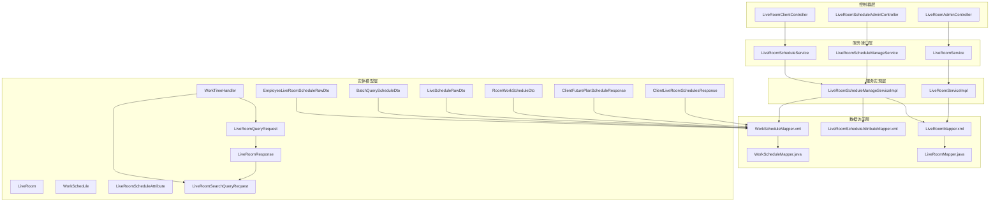

**图表来源**
- [LiveRoomAdminController.java:1-221](file://src/main/java/com/jiuyu/governance/business/room/controller/LiveRoomAdminController.java#L1-L221)
- [LiveRoomClientController.java:1-118](file://src/main/java/com/jiuyu/governance/business/room/controller/LiveRoomClientController.java#L1-L118)
- [LiveRoomServiceImpl.java:1-655](file://src/main/java/com/jiuyu/governance/business/room/service/impl/LiveRoomServiceImpl.java#L1-L655)

**章节来源**
- [LiveRoomAdminController.java:1-221](file://src/main/java/com/jiuyu/governance/business/room/controller/LiveRoomAdminController.java#L1-L221)
- [LiveRoomClientController.java:1-118](file://src/main/java/com/jiuyu/governance/business/room/controller/LiveRoomClientController.java#L1-L118)
- [LiveRoomScheduleAdminController.java:1-173](file://src/main/java/com/jiuyu/governance/business/room/controller/LiveRoomScheduleAdminController.java#L1-L173)

## 核心组件

### 控制器组件

系统包含三个主要的控制器，分别服务于不同的用户群体和功能需求：

1. **企业端直播房间管理控制器** (`LiveRoomAdminController`)
   - 提供直播房间的完整 CRUD 操作
   - 支持批量查询和分页查询
   - 集成权限控制和资源锁机制

2. **客户端直播房间控制器** (`LiveRoomClientController`)
   - 为企业客户端提供直播房间排班查询
   - 支持按日期和主播查询排班计划
   - **新增** 支持批量查询、未来排班查询和标准化JSON序列化

3. **企业端直播房间排班控制器** (`LiveRoomScheduleAdminController`)
   - 管理直播房间的排班调度
   - 支持批量排班生成和冲突检测

**更新** 客户端控制器新增了批量查询、未来排班功能和标准化JSON序列化支持，显著提升了客户端的查询效率和数据兼容性。

**章节来源**
- [LiveRoomAdminController.java:41-221](file://src/main/java/com/jiuyu/governance/business/room/controller/LiveRoomAdminController.java#L41-L221)
- [LiveRoomClientController:44-118](file://src/main/java/com/jiuyu/governance/business/room/controller/LiveRoomClientController.java#L44-L118)
- [LiveRoomScheduleAdminController.java:36-173](file://src/main/java/com/jiuyu/governance/business/room/controller/LiveRoomScheduleAdminController.java#L36-L173)

### 服务组件

#### 直播房间服务接口 (`LiveRoomService`)
提供直播房间的全生命周期管理功能：
- 直播间新增、修改、删除、启用/停用
- 分页查询和详情获取
- 排班配置管理
- 员工关联房间查询

#### 直播房间排班管理服务接口 (`LiveRoomScheduleManageService`)
专注于排班管理的核心功能：
- 排班新增、查询、分页
- 排班人员管理（添加、移除）
- 排班修改和删除
- 冲突检测和处理
- **新增** 未来排班查询功能

#### 直播房间排班服务接口 (`LiveRoomScheduleService`)
提供排班查询和统计功能：
- 按时间范围查询排班
- 按员工查询个人排班
- 按主播查询排班计划
- 排班统计数据
- **新增** 批量查询、未来排班查询和标准化响应

**更新** 服务接口新增了未来排班查询、批量查询和标准化响应功能，提升了系统的查询能力和服务质量。

**章节来源**
- [LiveRoomService.java:27-187](file://src/main/java/com/jiuyu/governance/business/room/service/LiveRoomService.java#L27-L187)
- [LiveRoomScheduleManageService.java:18-88](file://src/main/java/com/jiuyu/governance/business/room/service/LiveRoomScheduleManageService.java#L18-L88)
- [LiveRoomScheduleService.java:29-158](file://src/main/java/com/jiuyu/governance/business/room/service/LiveRoomScheduleService.java#L29-L158)

## 架构概览

房间 API 采用典型的三层架构模式，结合领域驱动设计原则：

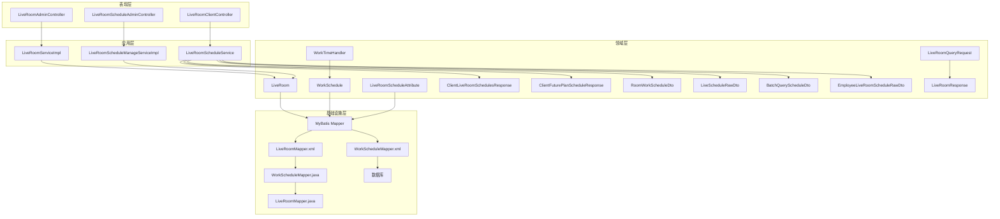

**图表来源**
- [LiveRoomServiceImpl.java:60-655](file://src/main/java/com/jiuyu/governance/business/room/service/impl/LiveRoomServiceImpl.java#L60-L655)
- [LiveRoomScheduleManageServiceImpl.java:66-800](file://src/main/java/com/jiuyu/governance/business/room/service/impl/LiveRoomScheduleManageServiceImpl.java#L66-L800)

### 数据流图

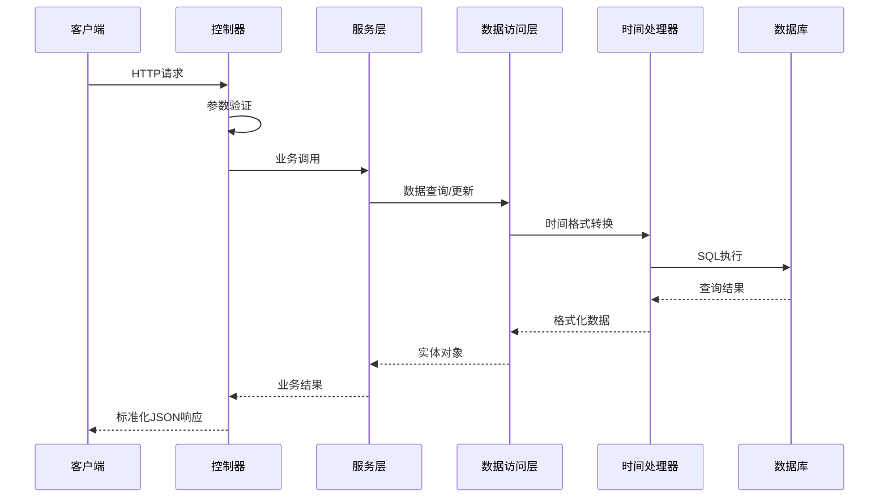

**图表来源**
- [LiveRoomServiceImpl.java:85-153](file://src/main/java/com/jiuyu/governance/business/room/service/impl/LiveRoomServiceImpl.java#L85-L153)
- [LiveRoomScheduleManageServiceImpl.java:93-154](file://src/main/java/com/jiuyu/governance/business/room/service/impl/LiveRoomScheduleManageServiceImpl.java#L93-L154)

## 详细组件分析

### 直播房间管理组件

#### 新增直播房间流程

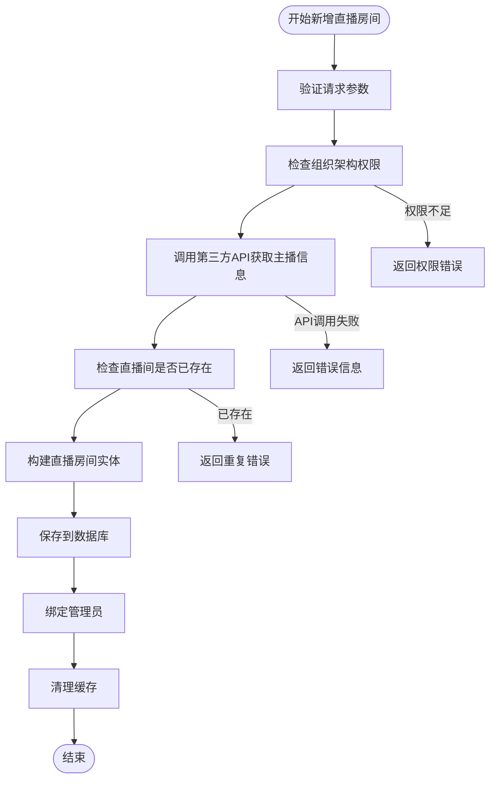

**图表来源**
- [LiveRoomServiceImpl.java:85-153](file://src/main/java/com/jiuyu/governance/business/room/service/impl/LiveRoomServiceImpl.java#L85-L153)

#### 直播房间分页查询

**更新** 系统支持复杂的分页查询功能，包含多维度的过滤条件和批量查询优化：

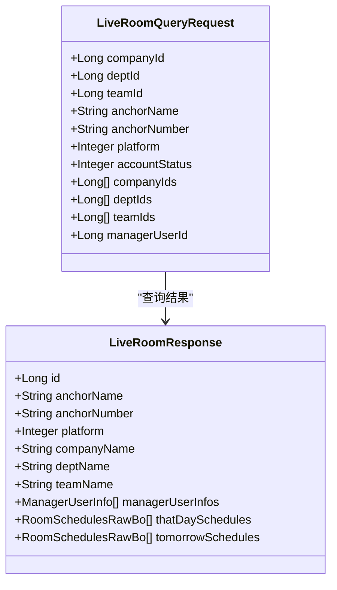

**图表来源**
- [LiveRoomMapper.xml:34-110](file://src/main/resources/mapper/room/LiveRoomMapper.xml#L34-L110)
- [LiveRoomServiceImpl.java:326-355](file://src/main/java/com/jiuyu/governance/business/room/service/impl/LiveRoomServiceImpl.java#L326-L355)

**章节来源**
- [LiveRoomServiceImpl.java:326-355](file://src/main/java/com/jiuyu/governance/business/room/service/impl/LiveRoomServiceImpl.java#L326-L355)
- [LiveRoomMapper.xml:34-110](file://src/main/resources/mapper/room/LiveRoomMapper.xml#L34-L110)

### 直播房间排班管理组件

#### 排班新增流程

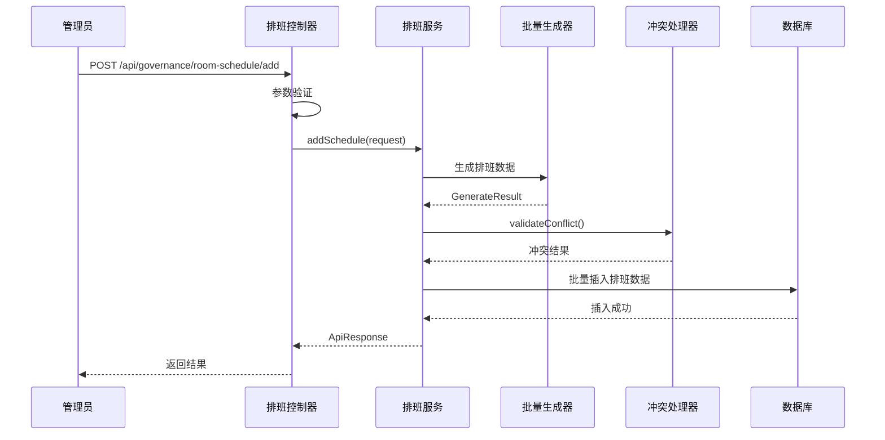

**图表来源**
- [LiveRoomScheduleManageServiceImpl.java:93-154](file://src/main/java/com/jiuyu/governance/business/room/service/impl/LiveRoomScheduleManageServiceImpl.java#L93-L154)

#### 排班人员管理

系统提供完善的排班人员管理功能：

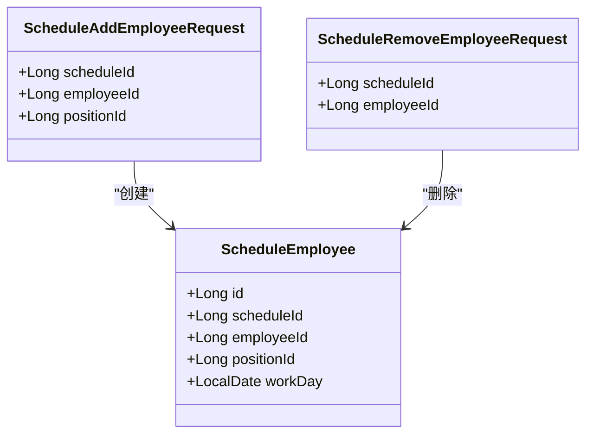

**图表来源**
- [LiveRoomScheduleManageServiceImpl.java:369-481](file://src/main/java/com/jiuyu/governance/business/room/service/impl/LiveRoomScheduleManageServiceImpl.java#L369-L481)

**章节来源**
- [LiveRoomScheduleManageServiceImpl.java:369-481](file://src/main/java/com/jiuyu/governance/business/room/service/impl/LiveRoomScheduleManageServiceImpl.java#L369-L481)

### 数据模型组件

#### 直播房间实体模型

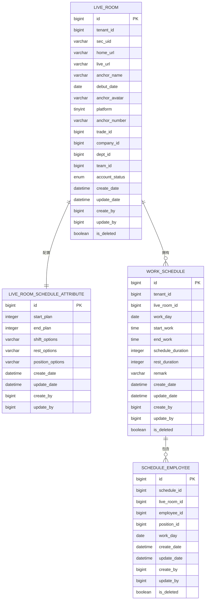

**图表来源**
- [LiveRoom.java:22-168](file://src/main/java/com/jiuyu/governance/business/room/pojo/entity/LiveRoom.java#L22-L168)
- [LiveRoomScheduleAttributeMapper.xml:4-23](file://src/main/resources/mapper/room/LiveRoomScheduleAttributeMapper.xml#L4-L23)

**章节来源**
- [LiveRoom.java:22-168](file://src/main/java/com/jiuyu/governance/business/room/pojo/entity/LiveRoom.java#L22-L168)
- [LiveRoomScheduleAttributeMapper.xml:4-23](file://src/main/resources/mapper/room/LiveRoomScheduleAttributeMapper.xml#L4-L23)

### LiveRoomMapper接口更新

**更新** LiveRoomMapper接口已更新以支持更灵活的查询和批量操作：

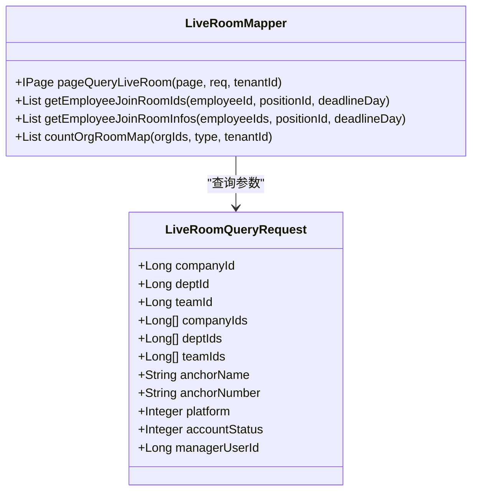

**图表来源**
- [LiveRoomMapper.java:26-73](file://src/main/java/com/jiuyu/governance/business/room/mapper/LiveRoomMapper.java#L26-L73)
- [LiveRoomQueryRequest.java:22-227](file://src/main/java/com/jiuyu/governance/business/room/pojo/request/LiveRoomQueryRequest.java#L22-L227)

**章节来源**
- [LiveRoomMapper.java:26-73](file://src/main/java/com/jiuyu/governance/business/room/mapper/LiveRoomMapper.java#L26-L73)
- [LiveRoomQueryRequest.java:22-227](file://src/main/java/com/jiuyu/governance/business/room/pojo/request/LiveRoomQueryRequest.java#L22-L227)

### LiveRoomMapper.xml批量查询优化

**更新** LiveRoomMapper.xml已实现批量查询支持，通过trim标签和条件OR逻辑优化SQL条件：

```mermaid
flowchart LR
A[LiveRoomMapper.xml] --> B[pageQueryLiveRoom]
B --> C[批量查询优化]
C --> D[trim标签]
C --> E[条件OR逻辑]
D --> F[prefixOverrides="or"]
E --> G[多维度批量过滤]
G --> H[companyIds/deptIds/teamIds]
```

**图表来源**
- [LiveRoomMapper.xml:73-97](file://src/main/resources/mapper/room/LiveRoomMapper.xml#L73-L97)

#### 批量查询SQL实现

```sql
<select id="pageQueryLiveRoom" resultType="com.jiuyu.governance.business.room.pojo.response.LiveRoomResponse">
    -- 查询语句省略
    <if test="req.companyId == null and req.deptId == null and req.teamId == null">
        <trim prefix="and (" suffix=")" prefixOverrides="or">
            <if test="req.companyId == null and req.companyIds != null and req.companyIds.size() != 0">
                or a.company_id in (
                <foreach item="item" collection="req.companyIds" separator=","  index="">
                    #{item}
                </foreach>
                )
            </if>
            <if test="req.deptId == null and req.deptIds != null and req.deptIds.size() != 0">
                or a.dept_id in (
                <foreach item="item" collection="req.deptIds" separator=","  index="">
                    #{item}
                </foreach>
                )
            </if>
            <if test="req.teamId == null and req.teamIds != null and req.teamIds.size() != 0">
                or a.team_id in (
                <foreach item="item" collection="req.teamIds" separator=","  index="">
                    #{item}
                </foreach>
                )
            </if>
        </trim>
    </if>
</select>
```

**章节来源**
- [LiveRoomMapper.xml:73-97](file://src/main/resources/mapper/room/LiveRoomMapper.xml#L73-L97)

### WorkScheduleMapper.xml分页查询逻辑改进

**更新** WorkScheduleMapper.xml已修复分页查询逻辑，改进了ID比较条件的处理方式：

```mermaid
flowchart LR
A[WorkScheduleMapper.xml] --> B[分页查询优化]
B --> C[ID比较条件改进]
C --> D[trim标签优化]
C --> E[条件OR逻辑]
D --> F[prefixOverrides="or"]
E --> G[批量过滤条件]
G --> H[roomIds批量查询]
```

**图表来源**
- [WorkScheduleMapper.xml:440-450](file://src/main/resources/mapper/room/WorkScheduleMapper.xml#L440-L450)

#### 分页查询SQL实现

```sql
<select id="page" resultType="com.jiuyu.governance.business.room.pojo.response.schedule.LiveRoomSchedulePageResponse">
    SELECT ws.id, ws.live_room_id, ws.work_day, ws.start_work, ws.end_work, 
           ws.schedule_duration, ws.rest_duration, ws.remark
    FROM work_schedule ws
    WHERE ws.tenant_id = #{tenantId}
      AND ws.is_deleted = 0
      <if test="req.liveRoomId != null">
          AND ws.live_room_id = #{req.liveRoomId}
      </if>
      <if test="req.roomIds != null and req.roomIds.size() > 0 and req.liveRoomId == null">
          AND ws.live_room_id IN
          <foreach collection="req.roomIds" item="roomId" open="(" separator="," close=")">
              #{roomId}
          </foreach>
      </if>
      <if test="req.startDate != null">
          AND ws.work_day >= #{req.startDate}
      </if>
      <if test="req.endDate != null">
          AND ws.work_day <= #{req.endDate}
      </if>
    ORDER BY ws.work_day DESC, ws.start_work DESC
</select>
```

**章节来源**
- [WorkScheduleMapper.xml:440-450](file://src/main/resources/mapper/room/WorkScheduleMapper.xml#L440-L450)

### XML映射器调整

**更新** XML映射器已调整以提供标准化JSON序列化响应：

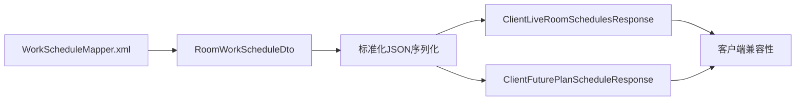

**图表来源**
- [WorkScheduleMapper.xml:266-285](file://src/main/resources/mapper/room/WorkScheduleMapper.xml#L266-L285)
- [WorkScheduleMapper.xml:287-307](file://src/main/resources/mapper/room/WorkScheduleMapper.xml#L287-L307)

**章节来源**
- [WorkScheduleMapper.xml:266-307](file://src/main/resources/mapper/room/WorkScheduleMapper.xml#L266-L307)

### 响应类现代化

**更新** 响应类已现代化以支持更好的JSON序列化和客户端兼容性：

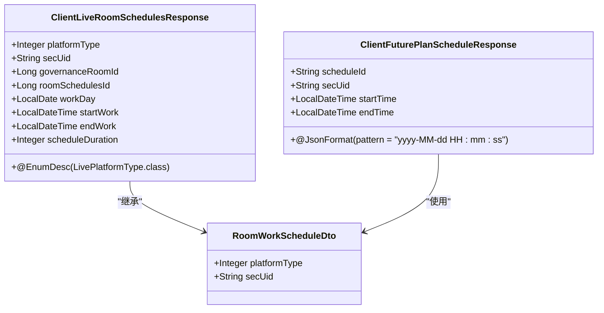

**图表来源**
- [ClientLiveRoomSchedulesResponse.java:19-70](file://src/main/java/com/jiuyu/governance/business/room/pojo/response/ClientLiveRoomSchedulesResponse.java#L19-L70)
- [ClientFuturePlanScheduleResponse.java:14-38](file://src/main/java/com/jiuyu/governance/business/room/pojo/response/ClientFuturePlanScheduleResponse.java#L14-L38)
- [RoomWorkScheduleDto.java:15-28](file://src/main/java/com/jiuyu/governance/business/room/pojo/response/schedule/RoomWorkScheduleDto.java#L15-L28)

**章节来源**
- [ClientLiveRoomSchedulesResponse.java:19-70](file://src/main/java/com/jiuyu/governance/business/room/pojo/response/ClientLiveRoomSchedulesResponse.java#L19-L70)
- [ClientFuturePlanScheduleResponse.java:14-38](file://src/main/java/com/jiuyu/governance/business/room/pojo/response/ClientFuturePlanScheduleResponse.java#L14-L38)
- [RoomWorkScheduleDto.java:15-28](file://src/main/java/com/jiuyu/governance/business/room/pojo/response/schedule/RoomWorkScheduleDto.java#L15-L28)

### WorkTimeHandler改进

**更新** WorkTimeHandler已改进以支持更灵活的时间处理：

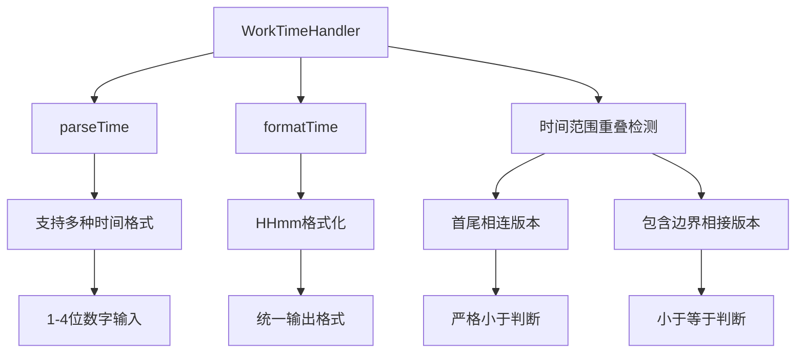

**图表来源**
- [WorkTimeHandler.java:35-53](file://src/main/java/com/jiuyu/governance/business/room/handler/WorkTimeHandler.java#L35-L53)
- [WorkTimeHandler.java:69-105](file://src/main/java/com/jiuyu/governance/business/room/handler/WorkTimeHandler.java#L69-L105)

**章节来源**
- [WorkTimeHandler.java:14-107](file://src/main/java/com/jiuyu/governance/business/room/handler/WorkTimeHandler.java#L14-L107)

## 新增API功能

### 批量查询API

#### 接口概述

**新增** `/api/governance/client/live-room/batch-plan` 接口用于支持客户端批量查询直播房间排班计划，显著提升了查询效率。

#### 接口规范

- **HTTP方法**: POST
- **请求路径**: `/api/governance/client/live-room/batch-plan`
- **请求头**: 需要客户端认证头
- **请求体**: `List<AnchorQueryScheduleRequest>`
- **响应体**: `ApiResponse<List<LiveRoomScheduleAlignResponse>>`

#### 请求参数

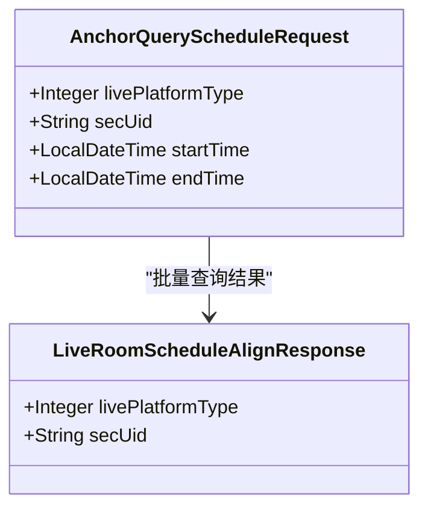

**图表来源**
- [AnchorQueryScheduleRequest.java:18-45](file://src/main/java/com/jiuyu/governance/business/room/pojo/request/schedule/AnchorQueryScheduleRequest.java#L18-L45)
- [LiveRoomScheduleAlignResponse.java:8-21](file://src/main/java/com/jiuyu/governance/business/room/pojo/response/schedule/LiveRoomScheduleAlignResponse.java#L8-L21)

#### 参数验证规则

1. **数量限制**: 最多支持100条请求
2. **时间范围**: 单条请求查询时间跨度不得超过3天
3. **必填字段**: 开始时间和结束时间不能为空
4. **时间顺序**: 开始时间不能大于结束时间

#### 响应数据结构

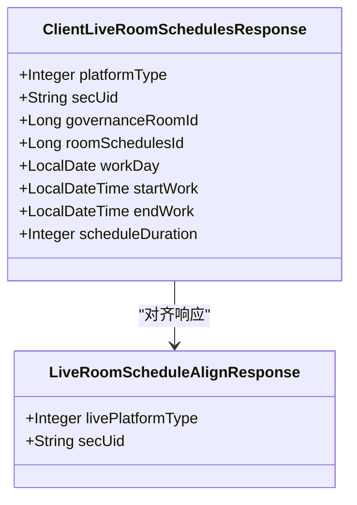

**图表来源**
- [ClientLiveRoomSchedulesResponse.java:19-70](file://src/main/java/com/jiuyu/governance/business/room/pojo/response/ClientLiveRoomSchedulesResponse.java#L19-L70)
- [LiveRoomScheduleAlignResponse.java:8-21](file://src/main/java/com/jiuyu/governance/business/room/pojo/response/schedule/LiveRoomScheduleAlignResponse.java#L8-L21)

**章节来源**
- [LiveRoomClientController.java:84-103](file://src/main/java/com/jiuyu/governance/business/room/controller/LiveRoomClientController.java#L84-L103)
- [LiveRoomScheduleService.java:146-154](file://src/main/java/com/jiuyu/governance/business/room/service/LiveRoomScheduleService.java#L146-L154)
- [LiveRoomScheduleManageServiceImpl.java:1090-1103](file://src/main/java/com/jiuyu/governance/business/room/service/impl/LiveRoomScheduleManageServiceImpl.java#L1090-L1103)

### 未来排班API

#### 接口概述

**新增** `/api/governance/client/live-room/future-plan` 接口用于查询未来的直播房间排班计划，支持客户端提前获取排班信息。

#### 接口规范

- **HTTP方法**: GET
- **请求路径**: `/api/governance/client/live-room/future-plan`
- **请求参数**: 无
- **响应体**: `ApiResponse<List<ClientFuturePlanScheduleResponse>>`

#### 查询逻辑

接口会查询当前日期后35天内的所有直播房间排班计划，并返回标准化的排班数据格式。

#### 标准化JSON序列化

**新增** ClientFuturePlanScheduleResponse提供标准化JSON序列化：

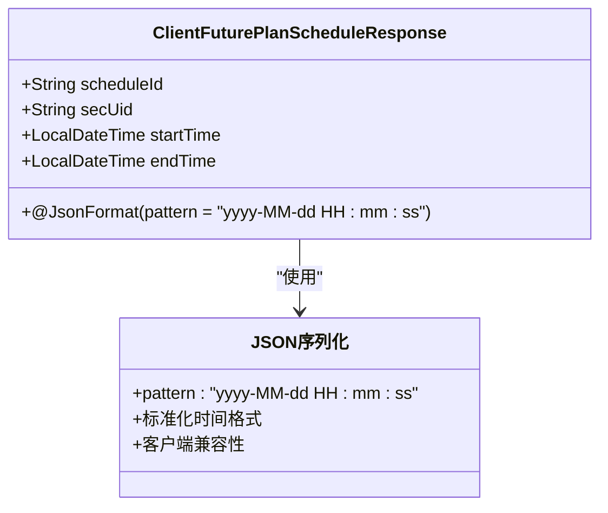

**图表来源**
- [ClientFuturePlanScheduleResponse.java:29-36](file://src/main/java/com/jiuyu/governance/business/room/pojo/response/ClientFuturePlanScheduleResponse.java#L29-L36)

**章节来源**
- [LiveRoomClientController.java:46-54](file://src/main/java/com/jiuyu/governance/business/room/controller/LiveRoomClientController.java#L46-L54)
- [LiveRoomScheduleService.java:88-96](file://src/main/java/com/jiuyu/governance/business/room/service/LiveRoomScheduleService.java#L88-L96)
- [LiveRoomScheduleManageServiceImpl.java:1114-1137](file://src/main/java/com/jiuyu/governance/business/room/service/impl/LiveRoomScheduleManageServiceImpl.java#L1114-L1137)

## 性能优化和Bug修复

### 批量查询SQL优化

#### 批量查询实现

**新增** 基于MyBatis的批量查询优化，通过trim标签和条件OR逻辑避免了传统的N+1查询问题：

```sql
<select id="pageQueryLiveRoom" resultType="com.jiuyu.governance.business.room.pojo.response.LiveRoomResponse">
    SELECT a.id, a.create_date, a.update_date, a.sec_uid, a.home_url, a.live_url, 
           a.anchor_name, a.debut_date, a.anchor_avatar, a.platform, a.anchor_number,
           a.trade_id, a.company_id, a.dept_id, a.team_id
    FROM live_room as a
    <if test="req.managerUserId != null">
        JOIN manager_connector as b ON a.id = b.target_id AND b.manager_type = 4
    </if>
    WHERE a.is_deleted = 0 AND a.tenant_id = #{tenantId}
    <if test="req.managerUserId != null">
        AND b.employee_id = #{req.managerUserId} AND b.is_deleted = 0
    </if>
    <if test="req.anchorName != null">
        AND a.anchor_name LIKE CONCAT('%', #{req.anchorName}, '%')
    </if>
    <if test="req.anchorNumber != null">
        AND a.anchor_number LIKE CONCAT(#{req.anchorNumber}, '%')
    </if>
    <if test="req.companyId != null">
        AND a.company_id = #{req.companyId}
    </if>
    <if test="req.deptId != null">
        AND a.dept_id = #{req.deptId}
    </if>
    <if test="req.companyId == null AND req.deptId == null AND req.teamId == null">
        <trim prefix="AND (" suffix=")" prefixOverrides="OR">
            <if test="req.companyId == null AND req.companyIds != null AND req.companyIds.size() != 0">
                OR a.company_id IN (
                <foreach item="item" collection="req.companyIds" separator="," index="">
                    #{item}
                </foreach>
                )
            </if>
            <if test="req.deptId == null AND req.deptIds != null AND req.deptIds.size() != 0">
                OR a.dept_id IN (
                <foreach item="item" collection="req.deptIds" separator="," index="">
                    #{item}
                </foreach>
                )
            </if>
            <if test="req.teamId == null AND req.teamIds != null AND req.teamIds.size() != 0">
                OR a.team_id IN (
                <foreach item="item" collection="req.teamIds" separator="," index="">
                    #{item}
                </foreach>
                )
            </if>
        </trim>
    </if>
    <if test="req.teamId != null">
        AND a.team_id = #{req.teamId}
    </if>
    <if test="req.platform != null">
        AND a.platform = #{req.platform}
    </if>
    <if test="req.accountStatus != null">
        AND a.account_status = #{req.accountStatus}
    </if>
    ORDER BY a.id DESC
</select>
```

#### 分页查询逻辑改进

**更新** 修复了分页查询逻辑中的ID比较条件处理问题，改进了roomIds批量查询的实现：

```sql
<select id="page" resultType="com.jiuyu.governance.business.room.pojo.response.schedule.LiveRoomSchedulePageResponse">
    SELECT ws.id, ws.live_room_id, ws.work_day, ws.start_work, ws.end_work, 
           ws.schedule_duration, ws.rest_duration, ws.remark
    FROM work_schedule ws
    WHERE ws.tenant_id = #{tenantId}
      AND ws.is_deleted = 0
      <if test="req.liveRoomId != null">
          AND ws.live_room_id = #{req.liveRoomId}
      </if>
      <if test="req.roomIds != null and req.roomIds.size() > 0 and req.liveRoomId == null">
          AND ws.live_room_id IN
          <foreach collection="req.roomIds" item="roomId" open="(" separator="," close=")">
              #{roomId}
          </foreach>
      </if>
      <if test="req.startDate != null">
          AND ws.work_day >= #{req.startDate}
      </if>
      <if test="req.endDate != null">
          AND ws.work_day <= #{req.endDate}
      </if>
    ORDER BY ws.work_day DESC, ws.start_work DESC
</select>
```

#### 性能监控

系统实现了完善的性能监控机制：


**图表来源**
- [20260421_live_room_batch_schedule_query.md:24-41](file://data/wal/20260421_live_room_batch_schedule_query.md#L24-L41)

### Bug修复记录

#### 时间计算异常修复

**修复** 原代码中使用 `Duration.between(LocalDate, LocalDate)` 导致 `UnsupportedTemporalTypeException` 错误，现已修复为使用 `ChronoUnit.DAYS.between`。

#### 数据返回丢失修复

**修复** 原代码在查询后意外返回了 `List.of()`，现已修正为正确返回查询结果。

#### JSON序列化标准化

**新增** ClientFuturePlanScheduleResponse使用@JsonFormat注解提供标准化的JSON序列化，确保客户端时间格式的一致性。

#### 批量查询优化修复

**新增** LiveRoomMapper.xml中的批量查询通过trim标签和条件OR逻辑优化，避免了SQL语法错误和性能问题。

#### 分页查询逻辑修复

**更新** WorkScheduleMapper.xml中的分页查询逻辑已修复，改进了ID比较条件的处理方式，确保roomIds批量查询的正确性。

#### ID比较条件处理改进

**更新** 修复了分页查询中roomIds批量查询的ID比较条件，确保当liveRoomId为null且roomIds不为空时的正确查询逻辑。

**章节来源**
- [20260421_live_room_batch_schedule_query.md:42-47](file://data/wal/20260421_live_room_batch_schedule_query.md#L42-L47)
- [ClientFuturePlanScheduleResponse.java:29-36](file://src/main/java/com/jiuyu/governance/business/room/pojo/response/ClientFuturePlanScheduleResponse.java#L29-L36)
- [LiveRoomMapper.xml:73-97](file://src/main/resources/mapper/room/LiveRoomMapper.xml#L73-L97)
- [WorkScheduleMapper.xml:440-450](file://src/main/resources/mapper/room/WorkScheduleMapper.xml#L440-L450)

## 依赖关系分析

### 组件依赖图

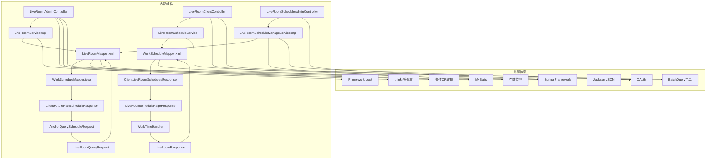

**图表来源**
- [LiveRoomServiceImpl.java:18-68](file://src/main/java/com/jiuyu/governance/business/room/service/impl/LiveRoomServiceImpl.java#L18-L68)
- [LiveRoomScheduleManageServiceImpl.java:16-74](file://src/main/java/com/jiuyu/governance/business/room/service/impl/LiveRoomScheduleManageServiceImpl.java#L16-L74)

### 权限控制机制

系统采用多层级的权限控制机制：

```mermaid
flowchart LR
subgraph "权限层级"
A[租户级别]
B[组织架构级别]
C[直播房间级别]
D[数据权限级别]
end
A --> B
B --> C
C --> D
subgraph "权限注解"
E[@Permissions]
F[@ResourceLock]
G[@BeforePermission]
H[@ClientUser]
end
E --> A
F --> C
G --> D
H --> A
```

**图表来源**
- [LiveRoomAdminController.java:63-83](file://src/main/java/com/jiuyu/governance/business/room/controller/LiveRoomAdminController.java#L63-L83)
- [LiveRoomClientController.java:30](file://src/main/java/com/jiuyu/governance/business/room/controller/LiveRoomClientController.java#L30)

**章节来源**
- [LiveRoomAdminController.java:63-83](file://src/main/java/com/jiuyu/governance/business/room/controller/LiveRoomAdminController.java#L63-L83)
- [LiveRoomScheduleAdminController.java:53-80](file://src/main/java/com/jiuyu/governance/business/room/controller/LiveRoomScheduleAdminController.java#L53-L80)
- [LiveRoomClientController.java:30](file://src/main/java/com/jiuyu/governance/business/room/controller/LiveRoomClientController.java#L30)

## 性能考虑

### 查询优化策略

1. **分页查询优化**
   - 使用自定义分页工具类进行高效分页
   - 限制查询范围，避免全表扫描
   - 合理使用索引和查询条件

2. **批量操作优化**
   - **新增** 批量插入和更新减少数据库交互次数
   - 使用批处理查询优化大量数据处理
   - 合理设置批处理大小
   - **新增** 游标分页避免深度分页性能问题

3. **缓存策略**
   - 清理权限缓存确保数据一致性
   - 组织架构信息缓存提升查询性能
   - 排班配置缓存减少重复查询

4. **批量查询优化**
   - **新增** 基于OR条件的批量查询SQL
   - **新增** BatchQuery工具实现游标分页
   - **新增** 10万条数据批量查询限制
   - **新增** trim标签优化SQL语法结构

5. **时间处理优化**
   - **新增** WorkTimeHandler统一时间格式处理
   - **新增** 标准化JSON序列化减少客户端处理负担

6. **多维度批量过滤优化**
   - **新增** LiveRoomMapper.xml中的批量查询优化
   - **新增** trim prefixOverrides="or"避免SQL语法错误
   - **新增** 支持companyIds、deptIds、teamIds批量过滤
   - **新增** 动态条件组合提升查询灵活性

7. **分页查询逻辑优化**
   - **更新** 修复ID比较条件处理问题
   - **更新** 改进roomIds批量查询的实现
   - **更新** 确保roomIds与liveRoomId的互斥查询逻辑

### 并发控制

系统采用多种并发控制机制：

```mermaid
flowchart TD
A[并发场景] --> B[资源锁机制]
A --> C[权限控制]
A --> D[事务管理]
A --> E[批量查询限制]
A --> F[时间格式化]
A --> G[trim标签优化]
A --> H[条件OR逻辑]
A --> I[ID比较条件修复]
A --> J[roomIds批量查询优化]
B --> I
C --> J
D --> E
E --> L[批量数量限制]
F --> M[统一时间格式]
G --> N[SQL语法优化]
H --> O[动态条件组合]
I --> P[防止重复操作]
J --> Q[数据权限隔离]
K --> R[保证数据一致性]
L --> S[保护数据库性能]
M --> T[客户端兼容性]
N --> U[避免语法错误]
O --> V[提升查询效率]
P --> W[提升系统稳定性]
Q --> X[确保数据安全]
R --> Y[提升用户体验]
```

**图表来源**
- [LiveRoomClientController.java:89-103](file://src/main/java/com/jiuyu/governance/business/room/controller/LiveRoomClientController.java#L89-L103)
- [LiveRoomScheduleManageServiceImpl.java:95-96](file://src/main/java/com/jiuyu/governance/business/room/service/impl/LiveRoomScheduleManageServiceImpl.java#L95-L96)
- [LiveRoomMapper.xml:73-97](file://src/main/resources/mapper/room/LiveRoomMapper.xml#L73-L97)
- [WorkScheduleMapper.xml:440-450](file://src/main/resources/mapper/room/WorkScheduleMapper.xml#L440-L450)

## 故障排除指南

### 常见问题及解决方案

#### 直播间创建失败

**问题现象**: 新增直播房间时报错，提示无法获取主播信息或直播间已存在

**可能原因**:
1. 第三方API调用失败
2. 直播间在同平台下已存在
3. 组织架构权限不足

**解决步骤**:
1. 检查第三方API连接状态
2. 验证直播平台账号的有效性
3. 确认组织架构权限配置

#### 排班冲突错误

**问题现象**: 新增或修改排班时报冲突错误

**可能原因**:
1. 员工在同一时间段已有排班
2. 直播间在同一时间段已有排班
3. 排班时间重叠

**解决步骤**:
1. 检查相关人员的排班安排
2. 调整排班时间避免重叠
3. 使用冲突检测功能预览潜在冲突

#### 权限访问错误

**问题现象**: 访问API时返回权限不足

**可能原因**:
1. 用户缺少相应权限
2. 访问的资源不属于当前用户权限范围
3. 租户切换导致权限失效

**解决步骤**:
1. 检查用户权限配置
2. 验证访问的资源归属
3. 确认当前登录租户

#### 批量查询API问题

**新增** **问题现象**: 批量查询API返回错误或性能异常

**可能原因**:
1. 请求数量超过100条限制
2. 时间范围超过3天限制
3. 开始时间晚于结束时间
4. 数据库批量查询性能问题
5. **新增** LiveRoomMapper.xml批量查询SQL语法错误
6. **新增** 分页查询中ID比较条件处理问题

**解决步骤**:
1. 检查请求参数数量和时间范围
2. 确保开始时间不晚于结束时间
3. 监控数据库批量查询性能
4. 检查BatchQuery工具配置
5. **新增** 验证LiveRoomMapper.xml中trim标签和OR逻辑语法
6. **新增** 检查分页查询中roomIds批量查询的ID比较条件

#### 未来排班API问题

**新增** **问题现象**: 未来排班查询返回空数据或性能异常

**可能原因**:
1. 未来日期参数无效
2. 数据库查询条件错误
3. 批量查询10万条限制影响性能
4. JSON序列化格式问题
5. **新增** trim标签优化效果不佳
6. **新增** 分页查询逻辑修复效果

**解决步骤**:
1. 验证未来日期参数的有效性
2. 检查数据库查询条件
3. 监控批量查询性能指标
4. 验证ClientFuturePlanScheduleResponse的JSON序列化格式
5. **新增** 检查LiveRoomMapper.xml批量查询优化配置
6. **新增** 验证分页查询逻辑修复后的查询效果

#### 时间格式化问题

**新增** **问题现象**: 客户端接收的时间格式不一致

**可能原因**:
1. WorkTimeHandler时间格式化不一致
2. JSON序列化格式配置错误
3. 客户端期望的时间格式不同
4. **新增** trim标签优化影响SQL执行
5. **新增** 分页查询逻辑修复影响查询结果

**解决步骤**:
1. 检查WorkTimeHandler的parseTime和formatTime方法
2. 验证@JsonFormat注解的pattern配置
3. 确认客户端期望的时间格式
4. **新增** 测试LiveRoomMapper.xml批量查询SQL执行效果
5. **新增** 验证分页查询逻辑修复后的数据处理

#### 批量查询性能问题

**新增** **问题现象**: 多维度批量查询响应缓慢

**可能原因**:
1. **新增** 公司、部门、小组ID数组过大
2. **新增** trim标签优化未生效
3. **新增** OR条件组合导致索引失效
4. **新增** 缺少适当的数据库索引
5. **新增** 分页查询中roomIds批量查询性能问题

**解决步骤**:
1. **新增** 限制companyIds、deptIds、teamIds数组大小
2. **新增** 验证trim标签和prefixOverrides配置
3. **新增** 检查数据库索引设置
4. **新增** 优化OR条件的执行计划
5. **新增** 监控分页查询中roomIds批量查询的性能

#### 分页查询逻辑问题

**更新** **问题现象**: 分页查询返回错误或数据不完整

**可能原因**:
1. **更新** roomIds批量查询条件逻辑错误
2. **更新** liveRoomId与roomIds的互斥查询条件问题
3. **更新** ID比较条件处理不当
4. **更新** 排序字段顺序不符合预期

**解决步骤**:
1. **更新** 检查roomIds批量查询的条件逻辑
2. **更新** 验证liveRoomId为null且roomIds不为空时的查询条件
3. **更新** 确认ID比较条件的正确性
4. **更新** 验证排序字段的工作日和开始时间的优先级

**章节来源**
- [LiveRoomServiceImpl.java:95-120](file://src/main/java/com/jiuyu/governance/business/room/service/impl/LiveRoomServiceImpl.java#L95-L120)
- [LiveRoomScheduleManageServiceImpl.java:122-140](file://src/main/java/com/jiuyu/governance/business/room/service/impl/LiveRoomScheduleManageServiceImpl.java#L122-L140)
- [LiveRoomClientController.java:89-103](file://src/main/java/com/jiuyu/governance/business/room/controller/LiveRoomClientController.java#L89-L103)
- [LiveRoomMapper.xml:73-97](file://src/main/resources/mapper/room/LiveRoomMapper.xml#L73-L97)
- [WorkScheduleMapper.xml:440-450](file://src/main/resources/mapper/room/WorkScheduleMapper.xml#L440-L450)

## 结论

房间 API 提供了一个完整、健壮的直播房间管理系统，具有以下特点：

1. **功能完整性**: 覆盖直播房间管理的全生命周期，从创建到删除
2. **架构清晰**: 采用分层架构设计，职责分离明确
3. **权限安全**: 多层级权限控制，确保数据安全
4. **性能优化**: 采用多种优化策略，支持高并发场景
5. **扩展性强**: 模块化设计便于功能扩展和维护
6. **查询效率**: **新增** 批量查询API显著提升查询效率
7. **稳定性**: **新增** 完善的Bug修复和性能监控机制
8. **数据一致性**: **新增** 标准化的JSON序列化确保客户端兼容性
9. **时间处理**: **新增** 统一的时间格式处理提升系统可靠性
10. **批量查询优化**: **新增** LiveRoomMapper.xml中的trim标签和条件OR逻辑优化，显著提升多维度批量查询性能
11. **分页查询修复**: **更新** 修复了分页查询逻辑中的ID比较条件处理问题，改进了roomIds批量查询的实现

**更新** 本次更新显著增强了系统的架构质量和数据处理能力，包括WorkScheduleMapper接口的灵活时间查询支持、XML映射器的标准化JSON序列化、响应类的现代化改造，以及ClientFuturePlanScheduleResponse提供的标准化JSON序列化，为客户端提供了更好的用户体验和数据一致性保障。同时，多项性能优化和Bug修复确保了系统的长期稳定运行和高质量的数据处理能力。

**更新** 特别是LiveRoomMapper.xml中的批量查询优化，通过trim标签和条件OR逻辑的巧妙运用，不仅解决了SQL语法问题，还显著提升了多维度批量查询的性能表现，为系统处理大规模数据查询提供了强有力的技术支撑。

**更新** 分页查询逻辑的修复进一步提升了系统的稳定性和准确性，确保roomIds批量查询和ID比较条件的正确处理，为用户提供更加可靠的服务体验。

系统通过合理的数据模型设计和完善的业务逻辑处理，为企业提供了可靠的直播房间管理解决方案。同时，系统的权限控制和并发处理机制确保了在复杂业务场景下的稳定运行，而标准化的JSON序列化进一步提升了系统的客户端兼容性和数据传输效率。批量查询优化和分页查询逻辑修复的引入，使得系统在处理大量数据时仍能保持高效的响应速度，为企业的直播业务发展提供了坚实的技术基础。