# 房间调度冲突检测处理器

<cite>
**本文档引用的文件**
- [EmployeeScheduleController.java](file://src/main/java/com/jiuyu/governance/business/room/controller/EmployeeScheduleController.java)
- [LiveRoomClientController.java](file://src/main/java/com/jiuyu/governance/business/room/controller/LiveRoomClientController.java)
- [LiveRoomScheduleService.java](file://src/main/java/com/jiuyu/governance/business/room/service/LiveRoomScheduleService.java)
- [LiveRoomScheduleManageService.java](file://src/main/java/com/jiuyu/governance/business/room/service/LiveRoomScheduleManageService.java)
- [LiveRoomScheduleManageServiceImpl.java](file://src/main/java/com/jiuyu/governance/business/room/service/impl/LiveRoomScheduleManageServiceImpl.java)
- [LiveRoomScheduleConflictHandler.java](file://src/main/java/com/jiuyu/governance/business/room/service/handler/LiveRoomScheduleConflictHandler.java)
- [LiveRoomScheduleBatchGenerator.java](file://src/main/java/com/jiuyu/governance/business/room/service/handler/LiveRoomScheduleBatchGenerator.java)
- [ScheduleConflictResult.java](file://src/main/java/com/jiuyu/governance/business/room/pojo/bo/ScheduleConflictResult.java)
- [ClientFuturePlanScheduleResponse.java](file://src/main/java/com/jiuyu/governance/business/room/pojo/response/ClientFuturePlanScheduleResponse.java)
- [LiveRoomScheduleAlignResponse.java](file://src/main/java/com/jiuyu/governance/business/room/pojo/response/schedule/LiveRoomScheduleAlignResponse.java)
- [EmployeeScheduleQueryRequest.java](file://src/main/java/com/jiuyu/governance/business/room/pojo/request/schedule/EmployeeScheduleQueryRequest.java)
- [RoomSchedulesRawBo.java](file://src/main/java/com/jiuyu/governance/business/room/pojo/bo/RoomSchedulesRawBo.java)
- [LivePlatformType.java](file://src/main/java/com/jiuyu/governance/business/room/pojo/constants/LivePlatformType.java)
- [WorkScheduleMapper.java](file://src/main/java/com/jiuyu/governance/business/room/mapper/WorkScheduleMapper.java)
</cite>

## 更新摘要
**所做更改**
- 新增needValidateConflict方法，实现智能冲突检测触发机制
- 扩大未来规划时间范围至35天，支持更长期的排班规划
- 新增ClientFuturePlanScheduleResponse和LiveRoomScheduleAlignResponse响应类
- 优化批量查询系统，支持POST /api/governance/client/live-room/batch-plan端点
- 增强冲突检测逻辑，包括新增方/修改方区分和内部冲突检测
- **新增** 实现更精确的冲突分离和成功数据过滤机制
- **新增** 增强的冲突检测处理器，支持复杂场景的冲突分析

## 目录
1. [简介](#简介)
2. [项目结构](#项目结构)
3. [核心组件](#核心组件)
4. [架构概览](#架构概览)
5. [详细组件分析](#详细组件分析)
6. [依赖关系分析](#依赖关系分析)
7. [性能考虑](#性能考虑)
8. [故障排除指南](#故障排除指南)
9. [结论](#结论)

## 简介

房间调度冲突检测处理器是直播运营管理系统中的关键组件，负责处理直播间排班调度中的冲突检测与验证。该系统通过多维度的冲突检测机制，确保直播间的人员安排不会发生时间重叠或其他业务规则冲突。

**更新** 系统现已实现智能化冲突检测触发机制，仅对即将开始或正在进行的排班进行冲突验证，显著提升了系统性能和用户体验。同时，冲突检测处理器经过增强，支持更精确的冲突分离和成功数据过滤，为复杂的排班场景提供更精准的冲突分析。

系统采用分层架构设计，包含控制器层、服务层、数据访问层和实体模型层，通过严格的业务规则验证和冲突检测算法，为直播运营提供可靠的调度保障。

## 项目结构

基于提供的代码库，房间调度系统主要位于 `src/main/java/com/jiuyu/governance/business/room/` 目录下，包含以下核心模块：

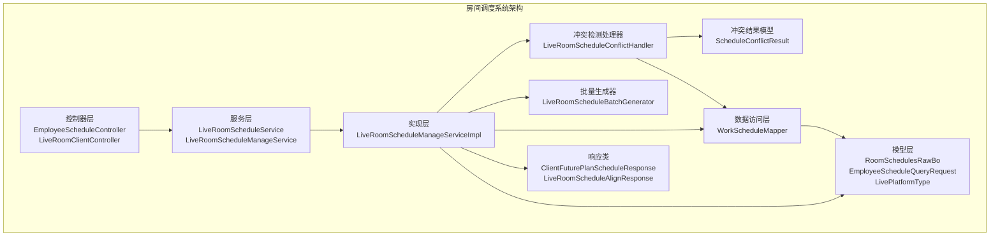

**图表来源**
- [EmployeeScheduleController.java:1-181](file://src/main/java/com/jiuyu/governance/business/room/controller/EmployeeScheduleController.java#L1-L181)
- [LiveRoomClientController.java:1-118](file://src/main/java/com/jiuyu/governance/business/room/controller/LiveRoomClientController.java#L1-L118)
- [LiveRoomScheduleService.java:1-160](file://src/main/java/com/jiuyu/governance/business/room/service/LiveRoomScheduleService.java#L1-L160)
- [LiveRoomScheduleManageServiceImpl.java:1-1243](file://src/main/java/com/jiuyu/governance/business/room/service/impl/LiveRoomScheduleManageServiceImpl.java#L1-L1243)

**章节来源**
- [EmployeeScheduleController.java:1-181](file://src/main/java/com/jiuyu/governance/business/room/controller/EmployeeScheduleController.java#L1-L181)
- [LiveRoomClientController.java:1-118](file://src/main/java/com/jiuyu/governance/business/room/controller/LiveRoomClientController.java#L1-L118)
- [LiveRoomScheduleService.java:1-160](file://src/main/java/com/jiuyu/governance/business/room/service/LiveRoomScheduleService.java#L1-L160)

## 核心组件

### 控制器层组件

**EmployeeScheduleController** 提供了员工排班查询和管理功能，包括个人排班列表查询和分页查询。

**LiveRoomClientController** 新增了客户端专用的直播间API，包括：
- 未来排班计划查询（支持35天规划范围）
- 直播间排班计划查询
- 主播排班计划查询
- 批量查询直播间排班（POST /api/governance/client/live-room/batch-plan）

### 服务层组件

**LiveRoomScheduleService** 定义了直播调度的核心接口，包括：
- 直播间排班查询方法
- 个人排班查询接口
- 主播排班查询功能
- **新增** 未来排班计划查询接口（支持35天范围）
- **新增** 批量查询主播排班接口

**LiveRoomScheduleManageService** 提供了排班管理的完整接口，包括新增、修改、删除、查询等操作。

### 实现层组件

**LiveRoomScheduleManageServiceImpl** 是核心实现类，包含了完整的冲突检测和处理逻辑，支持：
- 批量排班生成
- 多维度冲突检测
- 事务性操作保证
- 权限控制集成
- **新增** needValidateConflict智能冲突检测触发机制
- **新增** 增强的冲突检测和数据过滤功能

### 冲突检测处理器

**LiveRoomScheduleConflictHandler** 是专门负责冲突检测的核心组件，实现了：
- 直播间维度冲突检测
- 人员维度冲突检测
- 新提交排班内部冲突检测
- 修改场景排除自身冲突的智能逻辑
- **新增** 更精确的冲突分离机制
- **新增** 成功数据过滤和分离功能

### 批量生成器

**LiveRoomScheduleBatchGenerator** 负责批量生成排班数据，支持：
- 按周期批量生成多天排班
- 自动生成排班和人员关联数据
- 支持复杂的批量配置选项

### 冲突结果模型

**ScheduleConflictResult** 提供了详细的冲突检测结果，包括：
- 成功的排班ID列表
- 成功的人员排班ID列表
- 冲突的排班信息列表
- **新增** 成功数据过滤方法，支持精确的数据分离

### 响应类组件

**ClientFuturePlanScheduleResponse** 面向客户端的未来排班计划响应类，包含：
- 排班ID
- 主播SecUid
- 开始时间和结束时间

**LiveRoomScheduleAlignResponse** 直播间排班对齐响应类，继承自LiveRoomSchedulePageResponse，包含：
- 直播平台类型
- 主播ID

### 数据模型组件

**RoomSchedulesRawBo** 表示直播调度的原始数据结构，包含房间ID、排班ID、工作日期、开始时间、结束时间等关键字段。

## 架构概览

房间调度系统采用典型的三层架构模式，通过清晰的职责分离实现了高效的冲突检测机制：

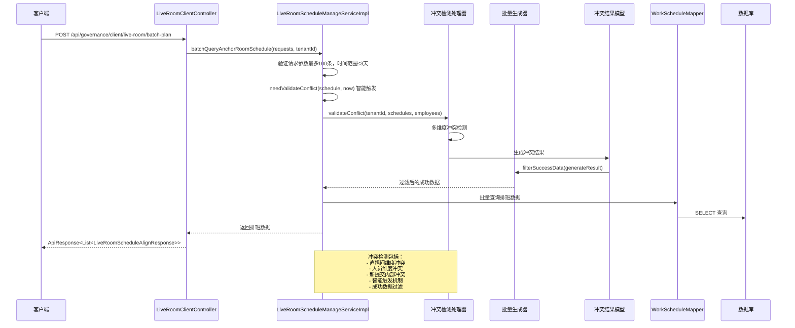

**图表来源**
- [LiveRoomClientController.java:91-103](file://src/main/java/com/jiuyu/governance/business/room/controller/LiveRoomClientController.java#L91-L103)
- [LiveRoomScheduleManageServiceImpl.java:316-412](file://src/main/java/com/jiuyu/governance/business/room/service/impl/LiveRoomScheduleManageServiceImpl.java#L316-L412)
- [LiveRoomScheduleManageServiceImpl.java:550-559](file://src/main/java/com/jiuyu/governance/business/room/service/impl/LiveRoomScheduleManageServiceImpl.java#L550-L559)

## 详细组件分析

### 智能冲突检测触发机制

系统实现了needValidateConflict方法，仅对即将开始或正在进行的排班进行冲突验证：

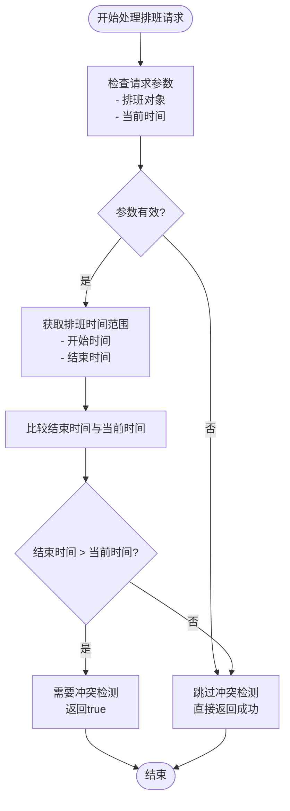

**图表来源**
- [LiveRoomScheduleManageServiceImpl.java:550-559](file://src/main/java/com/jiuyu/governance/business/room/service/impl/LiveRoomScheduleManageServiceImpl.java#L550-L559)

**更新** 智能冲突检测机制现在更加精确，仅对即将开始或正在进行的排班进行冲突验证，避免对已完成排班的无效验证。

### 更精确的冲突分离机制

冲突检测处理器现在支持更精确的冲突分离，区分新增方和修改方：

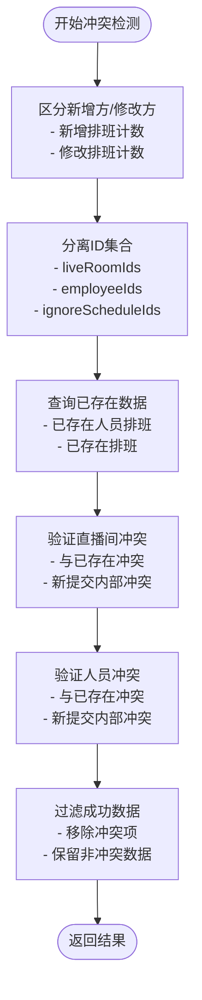

**图表来源**
- [LiveRoomScheduleConflictHandler.java:76-87](file://src/main/java/com/jiuyu/governance/business/room/service/handler/LiveRoomScheduleConflictHandler.java#L76-L87)
- [LiveRoomScheduleConflictHandler.java:120-132](file://src/main/java/com/jiuyu/governance/business/room/service/handler/LiveRoomScheduleConflictHandler.java#L120-L132)

**更新** 冲突分离机制现在更加精确，能够区分新增方和修改方，并支持内部冲突检测。

### 成功数据过滤机制

系统实现了精确的成功数据过滤，确保只有无冲突的数据被保留：

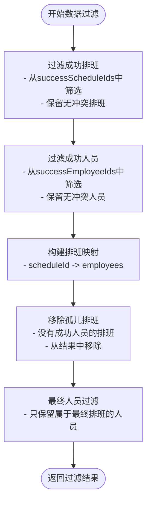

**图表来源**
- [ScheduleConflictResult.java:71-122](file://src/main/java/com/jiuyu/governance/business/room/pojo/bo/ScheduleConflictResult.java#L71-L122)

**更新** 成功数据过滤机制现在更加精确，能够处理复杂的排班和人员关联关系，确保数据完整性。

### 扩大未来规划时间范围

系统现已支持35天的未来排班规划：

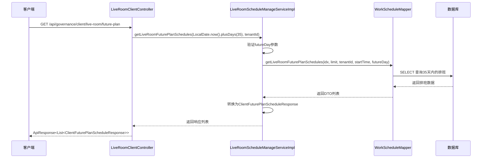

**图表来源**
- [LiveRoomClientController.java:51-54](file://src/main/java/com/jiuyu/governance/business/room/controller/LiveRoomClientController.java#L51-L54)
- [LiveRoomScheduleManageServiceImpl.java:1150-1170](file://src/main/java/com/jiuyu/governance/business/room/service/impl/LiveRoomScheduleManageServiceImpl.java#L1150-L1170)

### 批量查询系统优化

新增的批量查询端点支持最多100条请求，单次查询时间范围不超过3天：

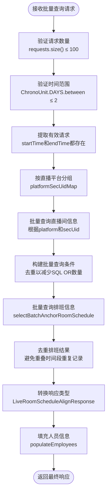

**图表来源**
- [LiveRoomClientController.java:91-103](file://src/main/java/com/jiuyu/governance/business/room/controller/LiveRoomClientController.java#L91-L103)
- [LiveRoomScheduleManageServiceImpl.java:316-412](file://src/main/java/com/jiuyu/governance/business/room/service/impl/LiveRoomScheduleManageServiceImpl.java#L316-L412)

### 增强的冲突检测处理器核心流程

系统实现了多层次的冲突检测机制，确保排班数据的准确性和完整性：

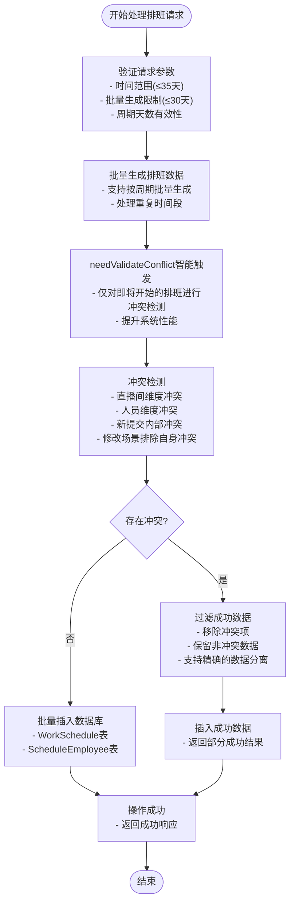

**图表来源**
- [LiveRoomScheduleManageServiceImpl.java:521-540](file://src/main/java/com/jiuyu/governance/business/room/service/impl/LiveRoomScheduleManageServiceImpl.java#L521-L540)
- [LiveRoomScheduleConflictHandler.java:63-140](file://src/main/java/com/jiuyu/governance/business/room/service/handler/LiveRoomScheduleConflictHandler.java#L63-L140)

**更新** 冲突检测处理器现在支持更复杂的冲突分离和成功数据过滤，能够处理新增方和修改方的不同场景。

### 数据模型设计

系统采用简洁而高效的数据模型设计，确保冲突检测的准确性：

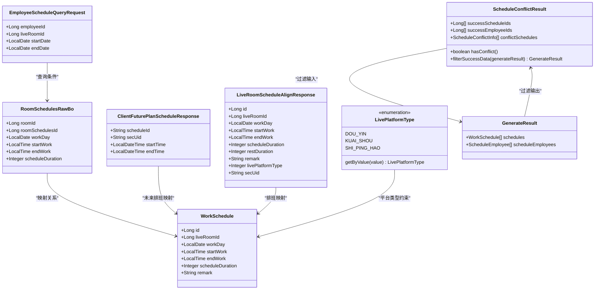

**图表来源**
- [RoomSchedulesRawBo.java:18-56](file://src/main/java/com/jiuyu/governance/business/room/pojo/bo/RoomSchedulesRawBo.java#L18-L56)
- [EmployeeScheduleQueryRequest.java:17-40](file://src/main/java/com/jiuyu/governance/business/room/pojo/request/schedule/EmployeeScheduleQueryRequest.java#L17-L40)
- [ClientFuturePlanScheduleResponse.java:14-38](file://src/main/java/com/jiuyu/governance/business/room/pojo/response/ClientFuturePlanScheduleResponse.java#L14-L38)
- [LiveRoomScheduleAlignResponse.java:8-20](file://src/main/java/com/jiuyu/governance/business/room/pojo/response/schedule/LiveRoomScheduleAlignResponse.java#L8-L20)
- [LivePlatformType.java:13-45](file://src/main/java/com/jiuyu/governance/business/room/pojo/constants/LivePlatformType.java#L13-L45)
- [ScheduleConflictResult.java:29-202](file://src/main/java/com/jiuyu/governance/business/room/pojo/bo/ScheduleConflictResult.java#L29-L202)

**章节来源**
- [RoomSchedulesRawBo.java:1-57](file://src/main/java/com/jiuyu/governance/business/room/pojo/bo/RoomSchedulesRawBo.java#L1-L57)
- [EmployeeScheduleQueryRequest.java:1-41](file://src/main/java/com/jiuyu/governance/business/room/pojo/request/schedule/EmployeeScheduleQueryRequest.java#L1-L41)
- [ClientFuturePlanScheduleResponse.java:1-39](file://src/main/java/com/jiuyu/governance/business/room/pojo/response/ClientFuturePlanScheduleResponse.java#L1-L39)
- [LiveRoomScheduleAlignResponse.java:1-22](file://src/main/java/com/jiuyu/governance/business/room/pojo/response/schedule/LiveRoomScheduleAlignResponse.java#L1-L22)

### 权限控制机制

系统集成了完善的权限控制机制，确保数据安全和操作合规：

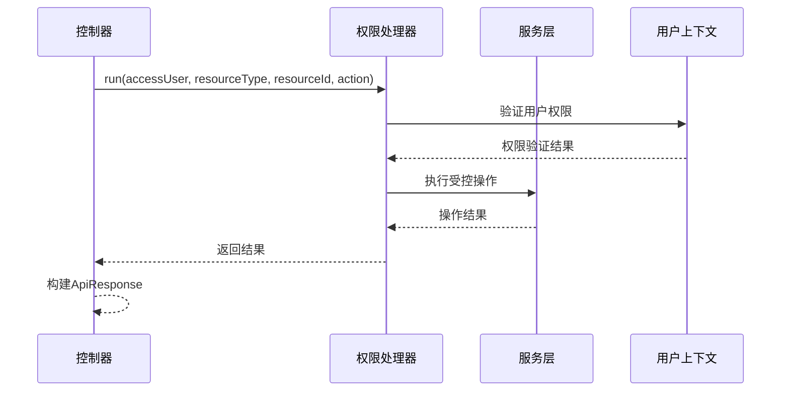

**图表来源**
- [EmployeeScheduleController.java:67-76](file://src/main/java/com/jiuyu/governance/business/room/controller/EmployeeScheduleController.java#L67-L76)

**章节来源**
- [EmployeeScheduleController.java:53-76](file://src/main/java/com/jiuyu/governance/business/room/controller/EmployeeScheduleController.java#L53-L76)

## 依赖关系分析

系统采用松耦合的设计原则，通过接口抽象实现了良好的可扩展性：

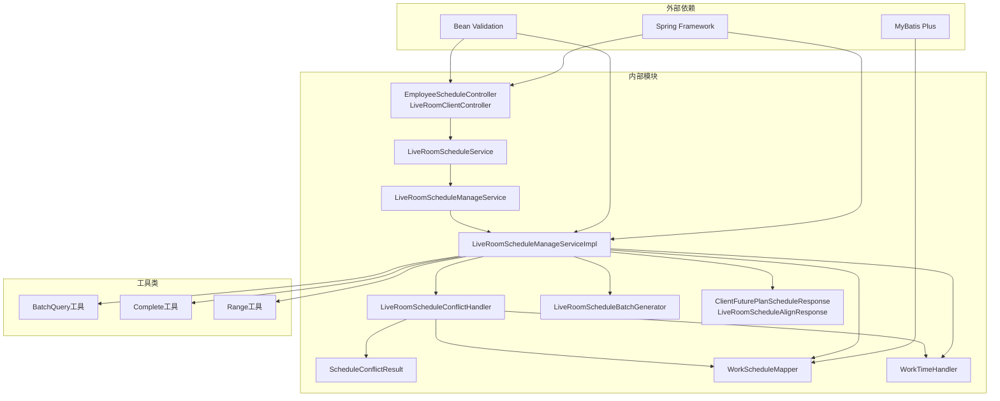

**图表来源**
- [LiveRoomScheduleManageServiceImpl.java:1-1243](file://src/main/java/com/jiuyu/governance/business/room/service/impl/LiveRoomScheduleManageServiceImpl.java#L1-L1243)

**章节来源**
- [LiveRoomScheduleManageServiceImpl.java:1-1243](file://src/main/java/com/jiuyu/governance/business/room/service/impl/LiveRoomScheduleManageServiceImpl.java#L1-L1243)

## 性能考虑

系统在设计时充分考虑了性能优化，采用了多种策略来提升响应速度和处理能力：

### 智能冲突检测优化
- **needValidateConflict方法**：仅对即将开始或正在进行的排班进行冲突检测，避免对已完成排班的无效验证
- **时间范围智能扩展**：冲突检测范围自动扩展1天（±1天）以确保准确性

### 批量操作优化
- 使用 `BatchQuery` 工具进行批量数据查询，减少数据库交互次数
- 采用 `Complete` 工具进行延迟加载，避免不必要的数据传输
- 实现了分页查询机制，支持大数据量场景

### 缓存策略
- 通过 `Range` 工具实现时间范围查询优化
- 使用 `Map` 结构进行数据缓存和快速查找
- 实现了批量插入机制，减少事务开销

### 并发控制
- 采用 `@Transactional` 注解确保数据一致性
- 实现了乐观锁机制，避免并发冲突
- 通过 `@Async` 注解支持异步处理

### 新增性能特性
- **35天未来规划**：支持更长期的排班规划，减少频繁查询
- **批量查询优化**：支持最多100条请求，单次查询时间范围不超过3天
- **智能触发机制**：needValidateConflict方法显著提升系统性能
- **精确数据过滤**：减少不必要的数据处理和存储

**更新** 新增的性能特性包括更精确的冲突分离和成功数据过滤，进一步提升了系统的处理效率。

## 故障排除指南

### 常见问题及解决方案

**1. 冲突检测失败**
- 检查时间范围是否超过限制（35天）
- 验证批量生成配置是否正确
- 确认人员和直播间的权限状态
- **新增** 检查needValidateConflict方法是否正确识别即将开始的排班
- **新增** 验证冲突分离机制是否正确区分新增方和修改方

**2. 数据插入异常**
- 检查数据库连接状态
- 验证实体对象的完整性
- 查看事务回滚日志

**3. 权限验证失败**
- 确认用户具有相应的操作权限
- 检查租户ID的有效性
- 验证资源ID的归属关系

**4. 批量查询异常**
- **新增** 检查请求数量是否超过100条限制
- **新增** 验证单次查询时间范围是否超过3天
- **新增** 确认请求参数中startTime和endTime都已提供

**5. 未来排班查询异常**
- **新增** 检查futureDay参数是否为null
- **新增** 验证35天范围内的数据是否存在

**6. 成功数据过滤异常**
- **新增** 检查冲突检测结果是否正确生成
- **新增** 验证成功数据过滤逻辑是否正确处理排班和人员关联
- **新增** 确认孤儿排班是否被正确移除

**章节来源**
- [LiveRoomScheduleManageServiceImpl.java:550-559](file://src/main/java/com/jiuyu/governance/business/room/service/impl/LiveRoomScheduleManageServiceImpl.java#L550-L559)
- [LiveRoomClientController.java:93-101](file://src/main/java/com/jiuyu/governance/business/room/controller/LiveRoomClientController.java#L93-L101)
- [LiveRoomScheduleManageServiceImpl.java:1150-1170](file://src/main/java/com/jiuyu/governance/business/room/service/impl/LiveRoomScheduleManageServiceImpl.java#L1150-L1170)

## 结论

房间调度冲突检测处理器是一个设计精良、功能完备的系统组件。通过多维度的冲突检测机制、完善的权限控制、高效的性能优化和智能化的冲突检测触发机制，为直播运营提供了可靠的技术支撑。

**更新** 系统的主要改进包括：
- **智能冲突检测触发**：needValidateConflict方法仅对即将开始的排班进行冲突验证，显著提升系统性能
- **扩大未来规划范围**：支持35天的未来排班规划，满足长期运营需求
- **增强批量查询能力**：支持最多100条请求的批量查询，单次查询时间范围不超过3天
- **新增响应类支持**：ClientFuturePlanScheduleResponse和LiveRoomScheduleAlignResponse提供更丰富的数据结构
- **优化API设计**：新增POST /api/governance/client/live-room/batch-plan端点，提升客户端体验
- **更精确的冲突分离**：支持新增方/修改方区分，提供更准确的冲突分析
- **成功数据过滤**：实现精确的成功数据分离和过滤，确保数据完整性

系统的主要优势包括：
- **全面的冲突检测**：涵盖直播间维度、人员维度和时间维度
- **灵活的配置选项**：支持批量生成和周期性排班
- **强大的权限控制**：确保数据安全和操作合规
- **优秀的性能表现**：通过智能触发机制和批量操作优化响应速度
- **智能化的用户体验**：仅对必要场景进行冲突检测，提升系统效率
- **精确的数据处理**：支持复杂的冲突分离和成功数据过滤

该系统为直播运营的数字化转型提供了坚实的技术基础，能够有效提升运营效率和管理水平。