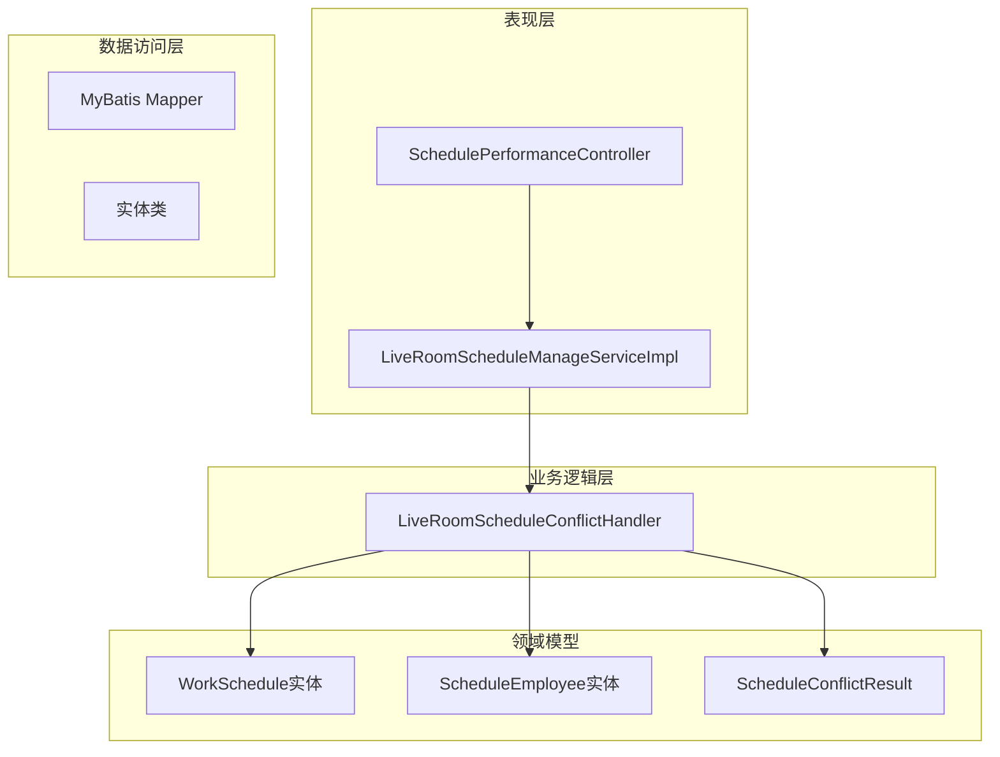
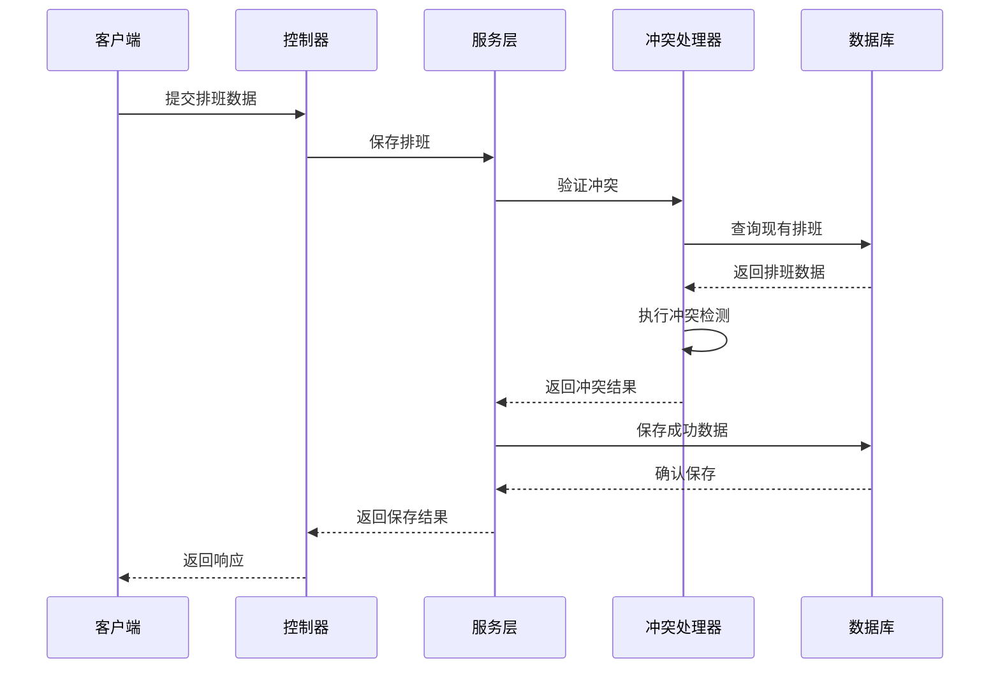
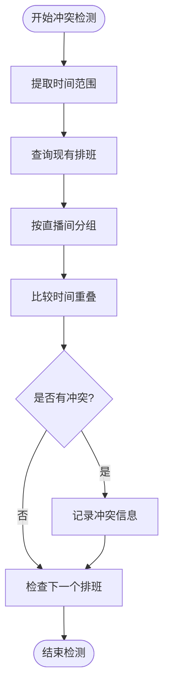
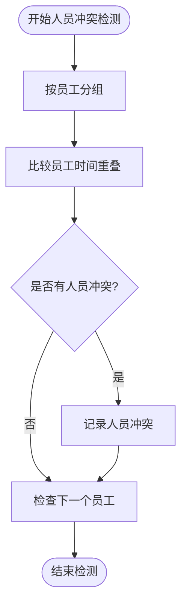
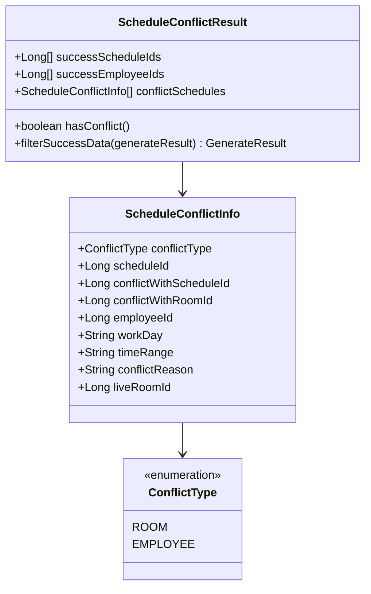
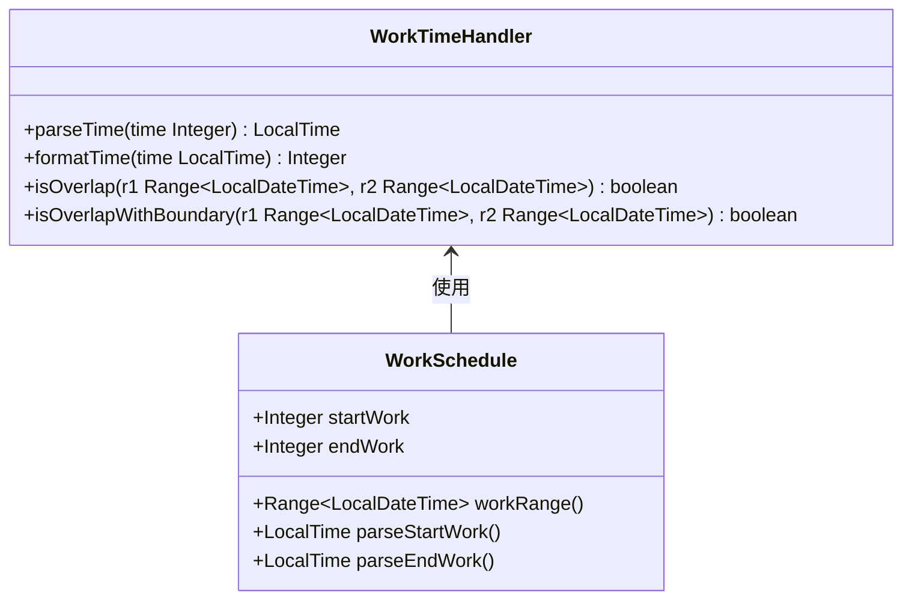
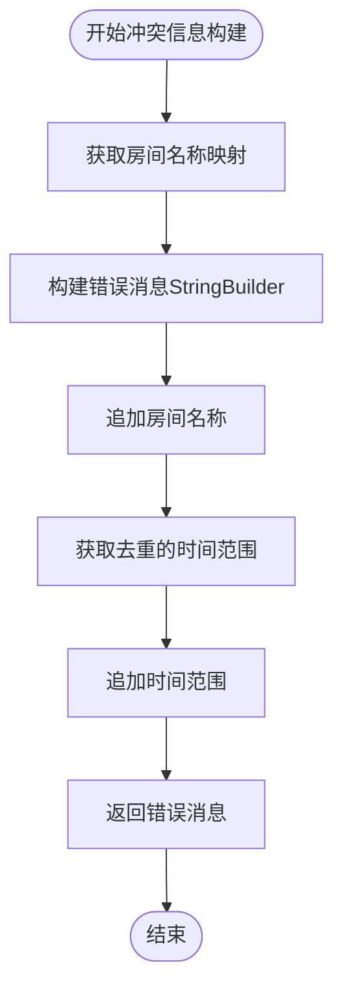
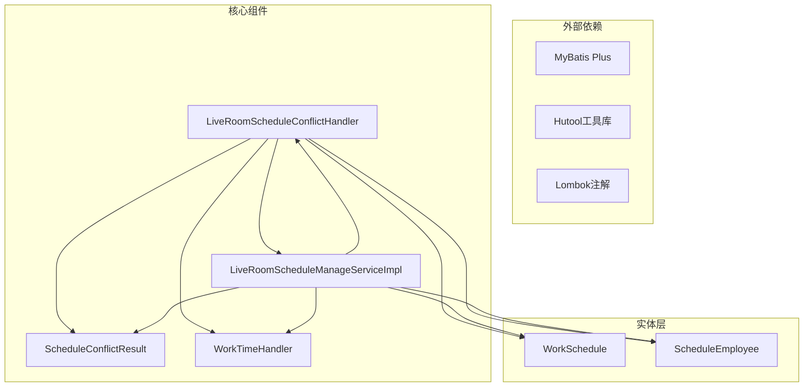

# 排班冲突结果封装

<cite>
**本文档引用的文件**
- [LiveRoomScheduleConflictHandler.java](file://src/main/java/com/jiuyu/governance/business/room/service/handler/LiveRoomScheduleConflictHandler.java)
- [LiveRoomScheduleManageServiceImpl.java](file://src/main/java/com/jiuyu/governance/business/room/service/impl/LiveRoomScheduleManageServiceImpl.java)
- [ScheduleConflictResult.java](file://src/main/java/com/jiuyu/governance/business/room/pojo/bo/ScheduleConflictResult.java)
- [WorkSchedule.java](file://src/main/java/com/jiuyu/governance/business/room/pojo/entity/WorkSchedule.java)
- [ScheduleEmployee.java](file://src/main/java/com/jiuyu/governance/business/room/pojo/entity/ScheduleEmployee.java)
- [WorkTimeHandler.java](file://src/main/java/com/jiuyu/governance/business/room/handler/WorkTimeHandler.java)
- [SchedulePerformanceController.java](file://src/main/java/com/jiuyu/governance/business/performance/controller/SchedulePerformanceController.java)
- [SchedulePerformanceServiceImpl.java](file://src/main/java/com/jiuyu/governance/business/performance/service/impl/SchedulePerformanceServiceImpl.java)
- [SchedulePerformanceResponse.java](file://src/main/java/com/jiuyu/governance/business/performance/pojo/response/SchedulePerformanceResponse.java)
- [SchedulePerformanceDetailResponse.java](file://src/main/java/com/jiuyu/governance/business/performance/pojo/response/SchedulePerformanceDetailResponse.java)
- [SchedulePerformanceSaveRequest.java](file://src/main/java/com/jiuyu/governance/business/performance/pojo/request/SchedulePerformanceSaveRequest.java)
</cite>

## 更新摘要
**变更内容**
- 更新了冲突信息构建逻辑的实现细节，从Stream-based处理改为StringBuilder拼接
- 新增了简化错误消息显示的相关章节
- 更新了冲突处理流程图以反映新的实现方式

## 目录
1. [简介](#简介)
2. [项目结构](#项目结构)
3. [核心组件](#核心组件)
4. [架构概览](#架构概览)
5. [详细组件分析](#详细组件分析)
6. [冲突信息构建逻辑重构](#冲突信息构建逻辑重构)
7. [依赖关系分析](#依赖关系分析)
8. [性能考虑](#性能考虑)
9. [故障排除指南](#故障排除指南)
10. [结论](#结论)

## 简介

本文档深入分析了该系统的排班冲突结果封装机制，这是一个关键的业务逻辑模块，负责检测和封装排班冲突信息。该系统实现了完整的排班冲突检测功能，包括直播间维度和人员维度的冲突检测，以及冲突结果的统一封装和管理。

系统采用分层架构设计，通过专门的冲突处理器来处理复杂的排班冲突检测逻辑，并提供统一的结果封装机制。这种设计确保了业务逻辑的清晰分离和代码的可维护性。

**更新** 系统最近进行了冲突信息构建逻辑的重构，从Stream-based处理改为StringBuilder拼接方式，以简化错误消息显示并提升性能。

## 项目结构

该项目采用典型的三层架构模式，主要分为以下层次：



**图表来源**
- [SchedulePerformanceController.java:53-57](file://src/main/java/com/jiuyu/governance/business/performance/controller/SchedulePerformanceController.java#L53-L57)
- [LiveRoomScheduleConflictHandler.java:35-38](file://src/main/java/com/jiuyu/governance/business/room/service/handler/LiveRoomScheduleConflictHandler.java#L35-L38)

**章节来源**
- [SchedulePerformanceController.java:1-250](file://src/main/java/com/jiuyu/governance/business/performance/controller/SchedulePerformanceController.java#L1-L250)
- [LiveRoomScheduleConflictHandler.java:1-539](file://src/main/java/com/jiuyu/governance/business/room/service/handler/LiveRoomScheduleConflictHandler.java#L1-L539)

## 核心组件

### 排班冲突处理器

`LiveRoomScheduleConflictHandler` 是整个冲突检测系统的核心组件，负责：

- **冲突检测**：检测直播间维度和人员维度的排班冲突
- **批量查询**：高效查询已存在的排班和人员信息
- **结果封装**：将冲突检测结果封装为统一的数据结构
- **时间范围管理**：智能扩展查询时间范围以确保完整性

### 冲突结果封装器

`ScheduleConflictResult` 提供了完整的冲突结果封装机制：

- **成功数据过滤**：根据冲突检测结果过滤成功数据
- **冲突信息管理**：统一管理各种类型的冲突信息
- **类型安全**：通过枚举确保冲突类型的正确性
- **链式操作**：支持流畅的API调用方式

### 实体模型

系统定义了三个核心实体：

- **WorkSchedule**：排班计划实体，包含时间范围和直播间信息
- **ScheduleEmployee**：人员排班实体，关联具体的排班和人员
- **ScheduleConflictInfo**：冲突信息实体，详细描述冲突情况

**章节来源**
- [LiveRoomScheduleConflictHandler.java:24-140](file://src/main/java/com/jiuyu/governance/business/room/service/handler/LiveRoomScheduleConflictHandler.java#L24-L140)
- [ScheduleConflictResult.java:14-202](file://src/main/java/com/jiuyu/governance/business/room/pojo/bo/ScheduleConflictResult.java#L14-L202)
- [WorkSchedule.java:19-167](file://src/main/java/com/jiuyu/governance/business/room/pojo/entity/WorkSchedule.java#L19-L167)
- [ScheduleEmployee.java:14-98](file://src/main/java/com/jiuyu/governance/business/room/pojo/entity/ScheduleEmployee.java#L14-L98)

## 架构概览

系统采用分层架构，通过专门的冲突检测处理器来处理复杂的业务逻辑：



**图表来源**
- [SchedulePerformanceController.java:147-152](file://src/main/java/com/jiuyu/governance/business/performance/controller/SchedulePerformanceController.java#L147-L152)
- [SchedulePerformanceServiceImpl.java:388-437](file://src/main/java/com/jiuyu/governance/business/performance/service/impl/SchedulePerformanceServiceImpl.java#L388-L437)
- [LiveRoomScheduleConflictHandler.java:63-140](file://src/main/java/com/jiuyu/governance/business/room/service/handler/LiveRoomScheduleConflictHandler.java#L63-L140)

## 详细组件分析

### 冲突检测算法

系统实现了高效的冲突检测算法，支持多种冲突场景：

#### 直播间维度冲突检测



**图表来源**
- [LiveRoomScheduleConflictHandler.java:228-277](file://src/main/java/com/jiuyu/governance/business/room/service/handler/LiveRoomScheduleConflictHandler.java#L228-L277)

#### 人员维度冲突检测



**图表来源**
- [LiveRoomScheduleConflictHandler.java:357-414](file://src/main/java/com/jiuyu/governance/business/room/service/handler/LiveRoomScheduleConflictHandler.java#L357-L414)

### 冲突结果封装机制

系统提供了完整的冲突结果封装机制：



**图表来源**
- [ScheduleConflictResult.java:25-202](file://src/main/java/com/jiuyu/governance/business/room/pojo/bo/ScheduleConflictResult.java#L25-L202)

**章节来源**
- [LiveRoomScheduleConflictHandler.java:120-140](file://src/main/java/com/jiuyu/governance/business/room/service/handler/LiveRoomScheduleConflictHandler.java#L120-L140)
- [ScheduleConflictResult.java:71-122](file://src/main/java/com/jiuyu/governance/business/room/pojo/bo/ScheduleConflictResult.java#L71-L122)

### 时间处理机制

系统使用专门的时间处理工具来确保时间计算的准确性：



**图表来源**
- [WorkTimeHandler.java:14-107](file://src/main/java/com/jiuyu/governance/business/room/handler/WorkTimeHandler.java#L14-L107)
- [WorkSchedule.java:129-166](file://src/main/java/com/jiuyu/governance/business/room/pojo/entity/WorkSchedule.java#L129-L166)

**章节来源**
- [WorkTimeHandler.java:21-105](file://src/main/java/com/jiuyu/governance/business/room/handler/WorkTimeHandler.java#L21-L105)
- [WorkSchedule.java:126-166](file://src/main/java/com/jiuyu/governance/business/room/pojo/entity/WorkSchedule.java#L126-L166)

## 冲突信息构建逻辑重构

**更新** 系统最近对冲突信息构建逻辑进行了重要重构，从Stream-based处理改为StringBuilder拼接方式，以简化错误消息显示并提升性能。

### 新的冲突信息构建方式

重构后的冲突信息构建采用了更直接的StringBuilder方式：



**图表来源**
- [LiveRoomScheduleManageServiceImpl.java:141-146](file://src/main/java/com/jiuyu/governance/business/room/service/impl/LiveRoomScheduleManageServiceImpl.java#L141-L146)
- [LiveRoomScheduleManageServiceImpl.java:533-538](file://src/main/java/com/jiuyu/governance/business/room/service/impl/LiveRoomScheduleManageServiceImpl.java#L533-L538)
- [LiveRoomScheduleManageServiceImpl.java:668-673](file://src/main/java/com/jiuyu/governance/business/room/service/impl/LiveRoomScheduleManageServiceImpl.java#L668-L673)

### 重构前的Stream-based处理

重构前的代码使用了Stream-based的方式构建冲突信息：

```java
// 重构前的Stream-based处理方式
String conflictMsg = conflictResult.getConflictSchedules().stream()
    .map(c -> roomNameMap.getOrDefault(c.getConflictWithRoomId(), c.getConflictWithRoomId().toString()) + " -> " + c.getConflictType().getDescription() + ": " + c.getConflictReason())
    .distinct()
    .limit(5) // 最多显示5条冲突信息
    .collect(Collectors.joining("; "));
```

### 重构后的StringBuilder方式

重构后的代码采用了更简洁的StringBuilder方式：

```java
// 重构后的StringBuilder处理方式
StringBuilder errorMsg = new StringBuilder();
roomNameMap.values().forEach(roomName -> errorMsg.append(roomName).append("; "));
conflictResult.getConflictSchedules().stream()
    .map(ScheduleConflictResult.ScheduleConflictInfo::getTimeRange).distinct()
    .forEach(timeRange -> errorMsg.append(timeRange).append("; "));
```

### 性能和可读性改进

**更新** 这种重构带来了以下改进：

- **性能提升**：StringBuilder方式避免了Stream的中间集合创建，减少了内存分配
- **简化逻辑**：直接使用时间范围而非复杂的冲突描述，使错误消息更直观
- **更好的可读性**：错误消息结构更加清晰，用户更容易理解冲突情况
- **减少复杂度**：移除了复杂的Stream链式操作，降低了代码复杂度

**章节来源**
- [LiveRoomScheduleManageServiceImpl.java:134-146](file://src/main/java/com/jiuyu/governance/business/room/service/impl/LiveRoomScheduleManageServiceImpl.java#L134-L146)
- [LiveRoomScheduleManageServiceImpl.java:528-539](file://src/main/java/com/jiuyu/governance/business/room/service/impl/LiveRoomScheduleManageServiceImpl.java#L528-L539)
- [LiveRoomScheduleManageServiceImpl.java:663-674](file://src/main/java/com/jiuyu/governance/business/room/service/impl/LiveRoomScheduleManageServiceImpl.java#L663-L674)

## 依赖关系分析

系统采用了清晰的依赖关系设计，确保各组件之间的松耦合：



**图表来源**
- [LiveRoomScheduleConflictHandler.java:3-22](file://src/main/java/com/jiuyu/governance/business/room/service/handler/LiveRoomScheduleConflictHandler.java#L3-L22)
- [ScheduleConflictResult.java:3-12](file://src/main/java/com/jiuyu/governance/business/room/pojo/bo/ScheduleConflictResult.java#L3-L12)

**章节来源**
- [LiveRoomScheduleConflictHandler.java:1-539](file://src/main/java/com/jiuyu/governance/business/room/service/handler/LiveRoomScheduleConflictHandler.java#L1-L539)
- [ScheduleConflictResult.java:1-202](file://src/main/java/com/jiuyu/governance/business/room/pojo/bo/ScheduleConflictResult.java#L1-L202)

## 性能考虑

系统在设计时充分考虑了性能优化：

### 批量查询优化
- 使用 `BatchQuery` 实现批量数据查询
- 通过 `ValidationRange` 扩展查询时间范围
- 使用 `Map` 结构进行快速数据检索

### 内存管理
- 使用 `Set` 进行去重操作
- 通过 `Record` 类型减少内存占用
- 智能的垃圾回收策略

### 并发处理
- 线程安全的集合操作
- 原子性的数据更新
- 乐观锁机制防止并发冲突

### 冲突信息构建优化
**更新** 冲突信息构建逻辑的重构进一步提升了性能：

- **减少Stream开销**：避免了Stream中间操作的内存分配
- **直接StringBuilder**：减少了字符串拼接的复杂度
- **去重优化**：使用distinct()方法确保时间范围的唯一性
- **简化错误消息**：直接使用时间范围而非复杂的冲突描述

## 故障排除指南

### 常见问题及解决方案

#### 冲突检测失败
**问题症状**：冲突检测结果不准确
**可能原因**：
- 时间范围计算错误
- 数据库查询条件不正确
- 冲突算法逻辑错误

**解决步骤**：
1. 检查 `ValidationRange` 的时间范围计算
2. 验证数据库查询条件
3. 确认冲突检测算法逻辑

#### 性能问题
**问题症状**：大量数据查询响应缓慢
**可能原因**：
- 缺少必要的数据库索引
- 查询条件过于复杂
- 内存使用不当

**解决步骤**：
1. 添加适当的数据库索引
2. 简化查询条件
3. 优化内存使用策略

#### 数据一致性问题
**问题症状**：数据在不同查询中不一致
**可能原因**：
- 事务管理不当
- 并发访问控制缺失
- 数据缓存不一致

**解决步骤**：
1. 检查事务配置
2. 实现适当的并发控制
3. 同步数据缓存

#### 冲突信息构建问题
**更新** 冲突信息构建逻辑重构后的问题排查：

**问题症状**：错误消息格式不符合预期
**可能原因**：
- StringBuilder拼接逻辑错误
- 时间范围去重不正确
- 房间名称映射缺失

**解决步骤**：
1. 检查StringBuilder的拼接逻辑
2. 验证时间范围去重操作
3. 确认房间名称映射的完整性

**章节来源**
- [LiveRoomScheduleConflictHandler.java:149-156](file://src/main/java/com/jiuyu/governance/business/room/service/handler/LiveRoomScheduleConflictHandler.java#L149-L156)
- [SchedulePerformanceServiceImpl.java:515-585](file://src/main/java/com/jiuyu/governance/business/performance/service/impl/SchedulePerformanceServiceImpl.java#L515-L585)

## 结论

该排班冲突结果封装系统展现了优秀的软件工程实践：

### 设计优势
- **模块化设计**：清晰的职责分离和模块划分
- **可扩展性**：灵活的架构支持未来功能扩展
- **性能优化**：高效的算法和数据结构设计
- **错误处理**：完善的异常处理和故障恢复机制
- **重构优化**：持续的性能和可读性改进

### 技术亮点
- **智能冲突检测**：支持复杂的多维度冲突检测
- **统一结果封装**：提供一致的数据结构和API
- **高性能实现**：优化的查询和处理算法
- **类型安全**：严格的类型检查和验证机制
- **简洁的错误消息**：重构后的StringBuilder方式提升了用户体验

### 应用价值
该系统为企业级应用提供了可靠的排班冲突检测能力，通过精确的冲突识别和统一的结果封装，显著提升了业务流程的可靠性和用户体验。其模块化的架构设计也为后续的功能扩展和技术升级奠定了坚实的基础。

**更新** 最近的冲突信息构建逻辑重构进一步提升了系统的性能和可读性，通过简化错误消息显示和优化StringBuilder拼接方式，为用户提供了更加直观和高效的冲突检测体验。