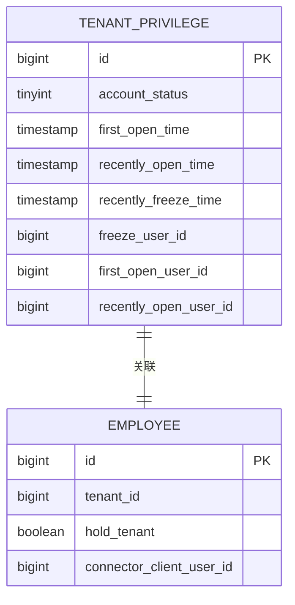
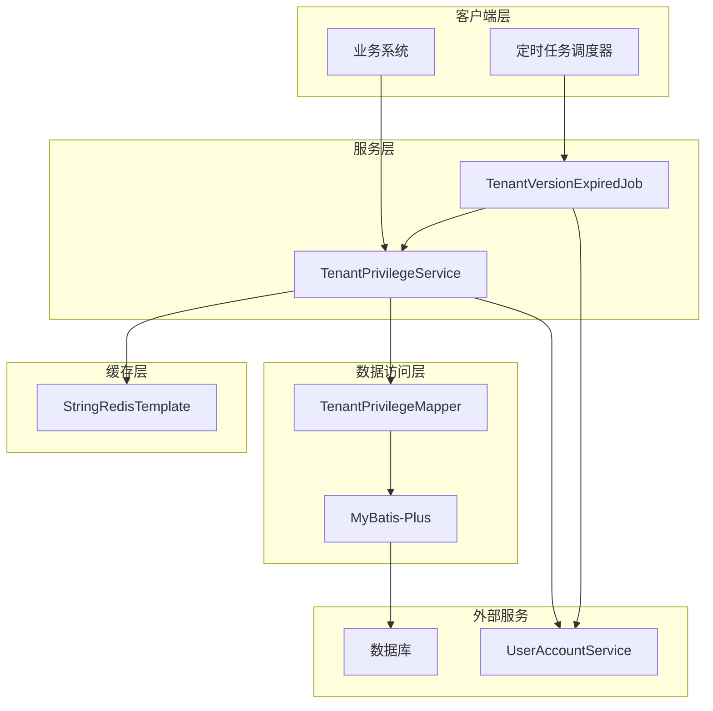
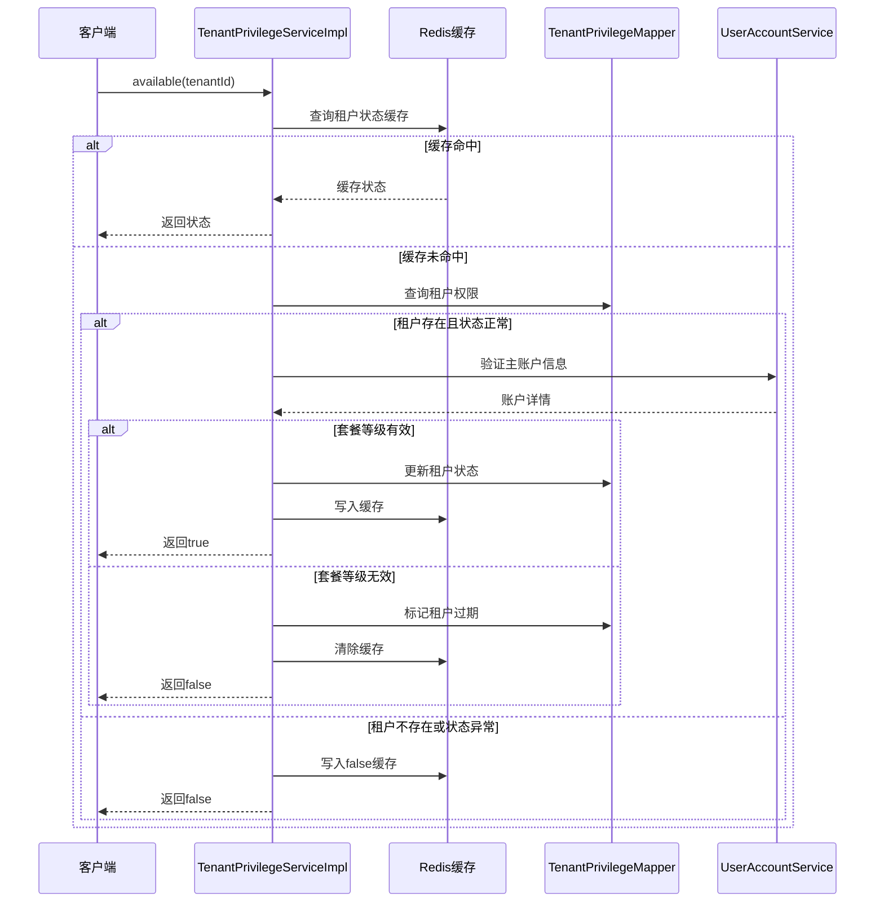
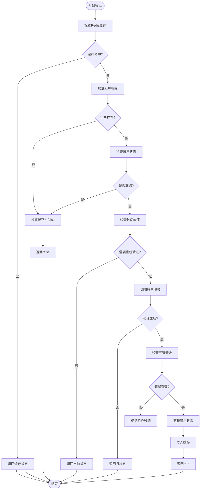
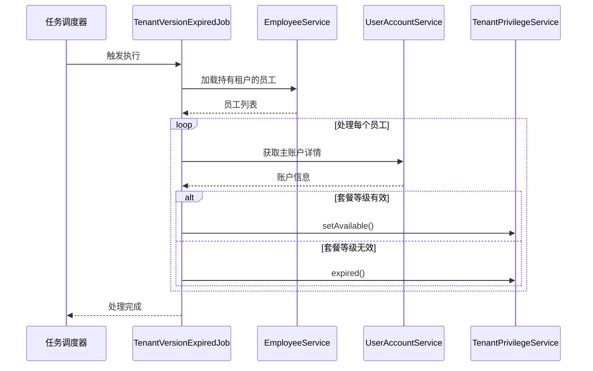
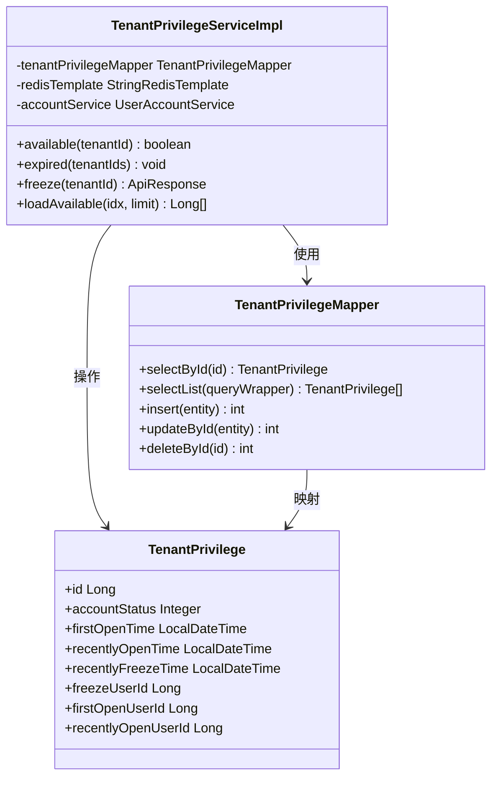
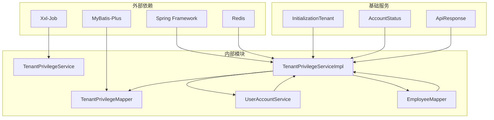

# 租户权限服务

<cite>
**本文档引用的文件**
- [TenantPrivilegeService.java](file://src/main/java/com/jiuyu/governance/business/rbac/service/TenantPrivilegeService.java)
- [TenantPrivilegeServiceImpl.java](file://src/main/java/com/jiuyu/governance/business/rbac/service/impl/TenantPrivilegeServiceImpl.java)
- [TenantPrivilegeMapper.java](file://src/main/java/com/jiuyu/governance/business/rbac/mapper/TenantPrivilegeMapper.java)
- [TenantPrivilegeMapper.xml](file://src/main/resources/mapper/rbac/TenantPrivilegeMapper.xml)
- [TenantPrivilege.java](file://src/main/java/com/jiuyu/governance/business/rbac/pojo/entity/TenantPrivilege.java)
- [TenantStatusResponse.java](file://src/main/java/com/jiuyu/governance/business/rbac/pojo/response/TenantStatusResponse.java)
- [AccountStatus.java](file://src/main/java/com/jiuyu/governance/business/rbac/pojo/constants/AccountStatus.java)
- [InitializationTenant.java](file://src/main/java/com/jiuyu/governance/common/init/InitializationTenant.java)
- [TenantVersionExpiredJob.java](file://src/main/java/com/jiuyu/governance/business/rbac/task/TenantVersionExpiredJob.java)
- [Employee.java](file://src/main/java/com/jiuyu/governance/business/rbac/pojo/entity/Employee.java)
</cite>

## 目录
1. [简介](#简介)
2. [项目结构](#项目结构)
3. [核心组件](#核心组件)
4. [架构概览](#架构概览)
5. [详细组件分析](#详细组件分析)
6. [依赖关系分析](#依赖关系分析)
7. [性能考虑](#性能考虑)
8. [故障排除指南](#故障排除指南)
9. [结论](#结论)

## 简介

租户权限服务是爱复盘治理平台的核心模块之一，负责管理租户的权限控制和状态监控。该服务通过Redis缓存机制提供高性能的租户状态查询，同时与外部账户服务集成来验证租户的套餐等级和有效性。

该服务主要功能包括：
- 租户状态实时查询和缓存
- 租户权限冻结和解冻
- 租户套餐过期检测和处理
- 租户初始化和状态维护
- 批量租户状态查询

## 项目结构

租户权限服务位于RBAC（基于角色的访问控制）模块中，采用标准的分层架构设计：

```mermaid
graph TB
subgraph "RBAC模块结构"
A[controller/] -- 控制器层 -->
B[service/] -- 业务逻辑层 -->
C[mapper/] -- 数据访问层 -->
D[pojo/] -- 数据模型层 -->
E[task/] -- 定时任务层 -->
end
subgraph "租户权限服务"
F[TenantPrivilegeService] -- 接口定义 -->
G[TenantPrivilegeServiceImpl] -- 业务实现 -->
H[TenantPrivilegeMapper] -- 数据映射 -->
I[TenantPrivilege实体] -- 数据模型 -->
end
A --> F
B --> G
C --> H
D --> I
G --> H
G --> I
```

**图表来源**
- [TenantPrivilegeService.java:1-81](file://src/main/java/com/jiuyu/governance/business/rbac/service/TenantPrivilegeService.java#L1-L81)
- [TenantPrivilegeServiceImpl.java:1-317](file://src/main/java/com/jiuyu/governance/business/rbac/service/impl/TenantPrivilegeServiceImpl.java#L1-L317)

**章节来源**
- [TenantPrivilegeService.java:1-81](file://src/main/java/com/jiuyu/governance/business/rbac/service/TenantPrivilegeService.java#L1-L81)
- [TenantPrivilegeServiceImpl.java:1-317](file://src/main/java/com/jiuyu/governance/business/rbac/service/impl/TenantPrivilegeServiceImpl.java#L1-L317)

## 核心组件

### 租户权限接口定义

租户权限服务的核心接口定义了完整的租户管理能力：

| 方法 | 功能描述 | 参数 | 返回值 |
|------|----------|------|--------|
| available | 判断租户是否可用 | tenantId: 租户ID | boolean: 可用状态 |
| setAvailable | 设置租户可用 | tenantId: 租户ID | void | 
| expired | 租户版本过期处理 | tenantIds: 租户ID列表 | void |
| loadAvailable | 加载可用租户 | idx: 索引, limit: 限制数量 | List<Long>: 租户ID列表 |
| freeze | 冻结租户 | tenantId: 租户ID | ApiResponse<Void>: 操作结果 |
| getTenantStatus | 获取租户状态 | tenantIds: 租户ID列表 | List<TenantStatusResponse>: 状态列表 |
| hasTenant | 判断租户是否存在 | tenantId: 租户ID | boolean: 存在状态 |

### 数据模型设计

租户权限实体包含完整的状态信息和操作记录：



**图表来源**
- [TenantPrivilege.java:18-72](file://src/main/java/com/jiuyu/governance/business/rbac/pojo/entity/TenantPrivilege.java#L18-L72)
- [Employee.java:64-149](file://src/main/java/com/jiuyu/governance/business/rbac/pojo/entity/Employee.java#L64-L149)

**章节来源**
- [TenantPrivilege.java:1-73](file://src/main/java/com/jiuyu/governance/business/rbac/pojo/entity/TenantPrivilege.java#L1-L73)
- [Employee.java:1-171](file://src/main/java/com/jiuyu/governance/business/rbac/pojo/entity/Employee.java#L1-L171)

## 架构概览

租户权限服务采用多层架构设计，结合缓存策略和定时任务来确保系统的高性能和可靠性：



**图表来源**
- [TenantPrivilegeServiceImpl.java:41-47](file://src/main/java/com/jiuyu/governance/business/rbac/service/impl/TenantPrivilegeServiceImpl.java#L41-L47)
- [TenantVersionExpiredJob.java:38-43](file://src/main/java/com/jiuyu/governance/business/rbac/task/TenantVersionExpiredJob.java#L38-L43)

## 详细组件分析

### 租户权限服务实现

租户权限服务实现了完整的租户生命周期管理功能：

#### 核心业务流程



**图表来源**
- [TenantPrivilegeServiceImpl.java:64-159](file://src/main/java/com/jiuyu/governance/business/rbac/service/impl/TenantPrivilegeServiceImpl.java#L64-L159)

#### 状态管理算法

租户状态验证采用智能缓存策略：



**图表来源**
- [TenantPrivilegeServiceImpl.java:88-159](file://src/main/java/com/jiuyu/governance/business/rbac/service/impl/TenantPrivilegeServiceImpl.java#L88-L159)

**章节来源**
- [TenantPrivilegeServiceImpl.java:1-317](file://src/main/java/com/jiuyu/governance/business/rbac/service/impl/TenantPrivilegeServiceImpl.java#L1-L317)

### 定时任务处理

租户版本过期任务负责定期检查和处理过期的租户权限：

#### 批量处理流程



**图表来源**
- [TenantVersionExpiredJob.java:48-94](file://src/main/java/com/jiuyu/governance/business/rbac/task/TenantVersionExpiredJob.java#L48-L94)

**章节来源**
- [TenantVersionExpiredJob.java:1-96](file://src/main/java/com/jiuyu/governance/business/rbac/task/TenantVersionExpiredJob.java#L1-L96)

### 数据访问层

租户权限数据访问层提供了完整的CRUD操作支持：

#### 数据访问模式



**图表来源**
- [TenantPrivilegeMapper.java:15-17](file://src/main/java/com/jiuyu/governance/business/rbac/mapper/TenantPrivilegeMapper.java#L15-L17)
- [TenantPrivilegeServiceImpl.java:41-47](file://src/main/java/com/jiuyu/governance/business/rbac/service/impl/TenantPrivilegeServiceImpl.java#L41-L47)

**章节来源**
- [TenantPrivilegeMapper.java:1-18](file://src/main/java/com/jiuyu/governance/business/rbac/mapper/TenantPrivilegeMapper.java#L1-L18)
- [TenantPrivilegeMapper.xml:1-21](file://src/main/resources/mapper/rbac/TenantPrivilegeMapper.xml#L1-L21)

## 依赖关系分析

租户权限服务的依赖关系体现了清晰的分层架构：



**图表来源**
- [TenantPrivilegeServiceImpl.java:3-24](file://src/main/java/com/jiuyu/governance/business/rbac/service/impl/TenantPrivilegeServiceImpl.java#L3-L24)
- [InitializationTenant.java:14-41](file://src/main/java/com/jiuyu/governance/common/init/InitializationTenant.java#L14-L41)

### 核心依赖说明

| 依赖组件 | 作用 | 版本/配置 |
|----------|------|-----------|
| Spring Framework | 依赖注入和事务管理 | 5.x |
| MyBatis-Plus | 数据持久化框架 | 3.x |
| Redis | 分布式缓存 | 6.x |
| Xxl-Job | 定时任务调度 | 2.x |
| UserAccountService | 外部账户信息服务 | 自定义 |
| ApiResponse | 统一响应封装 | 自定义 |

**章节来源**
- [TenantPrivilegeServiceImpl.java:1-317](file://src/main/java/com/jiuyu/governance/business/rbac/service/impl/TenantPrivilegeServiceImpl.java#L1-L317)
- [InitializationTenant.java:1-42](file://src/main/java/com/jiuyu/governance/common/init/InitializationTenant.java#L1-L42)

## 性能考虑

租户权限服务在设计时充分考虑了性能优化：

### 缓存策略

- **缓存键设计**: 使用统一前缀 `tenant:privilege:available` + 租户ID
- **缓存有效期**: 10分钟，平衡数据新鲜度和性能
- **缓存穿透防护**: 不存在的租户缓存值为false
- **热点数据处理**: 高频查询的租户状态优先缓存

### 数据库优化

- **索引设计**: 租户ID为主键索引，账户状态建立二级索引
- **批量操作**: 支持批量查询和批量更新
- **查询优化**: 使用条件查询减少数据传输
- **连接池**: 合理配置数据库连接池参数

### 异步处理

- **定时任务**: 异步检查租户套餐有效性
- **批量处理**: 支持大量租户的批量状态更新
- **降级策略**: 远程服务调用失败时使用缓存数据

## 故障排除指南

### 常见问题及解决方案

#### 缓存相关问题

| 问题类型 | 症状 | 解决方案 |
|----------|------|----------|
| 缓存失效 | 租户状态频繁变化 | 检查缓存过期时间配置 |
| 缓存雪崩 | 大量缓存同时过期 | 实施随机过期时间 |
| 缓存穿透 | 查询不存在租户导致数据库压力 | 在缓存中存储空值 |

#### 数据库连接问题

| 问题类型 | 症状 | 解决方案 |
|----------|------|----------|
| 连接超时 | 数据库操作超时 | 检查连接池配置和网络状况 |
| 连接泄漏 | 连接数持续增长 | 检查事务管理和资源释放 |
| 死锁 | 数据库死锁错误 | 优化SQL执行顺序 |

#### 外部服务集成问题

| 问题类型 | 症状 | 解决方案 |
|----------|------|----------|
| 服务不可用 | 远程调用失败 | 实施熔断和降级策略 |
| 响应超时 | 账户服务响应慢 | 增加超时时间和重试机制 |
| 数据不一致 | 账户状态与本地不一致 | 实施补偿机制和数据同步 |

**章节来源**
- [TenantPrivilegeServiceImpl.java:117-139](file://src/main/java/com/jiuyu/governance/business/rbac/service/impl/TenantPrivilegeServiceImpl.java#L117-L139)
- [TenantVersionExpiredJob.java:62-82](file://src/main/java/com/jiuyu/governance/business/rbac/task/TenantVersionExpiredJob.java#L62-L82)

## 结论

租户权限服务是一个设计精良的权限管理模块，具有以下特点：

### 技术优势

1. **高性能架构**: 通过Redis缓存和批量处理实现高并发访问
2. **可靠的数据一致性**: 结合本地状态和远程验证确保准确性
3. **灵活的扩展性**: 模块化设计便于功能扩展和维护
4. **完善的监控机制**: 提供详细的日志记录和状态跟踪

### 应用价值

- **提升用户体验**: 快速的租户状态查询响应
- **降低运营成本**: 自动化的租户状态管理和过期处理
- **增强系统稳定性**: 多层防护机制确保服务可靠性
- **支持业务发展**: 灵活的权限控制满足不同业务需求

该服务为整个治理平台提供了坚实的权限基础，是保障系统安全运行的重要组成部分。