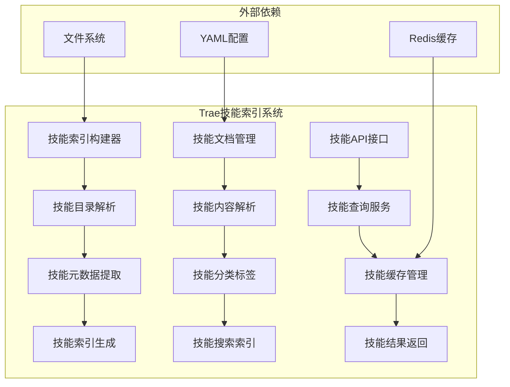
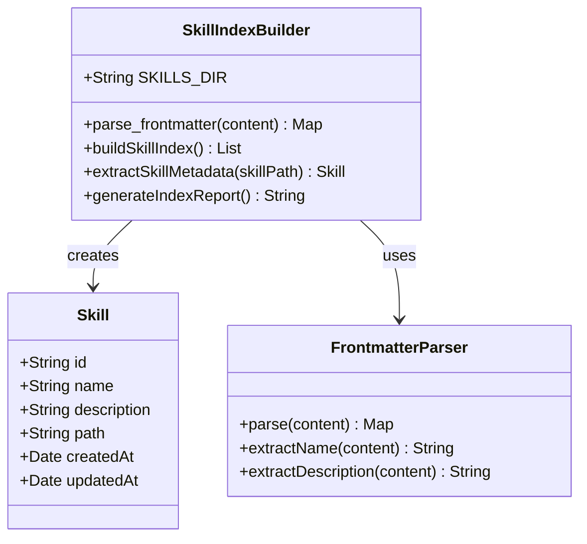
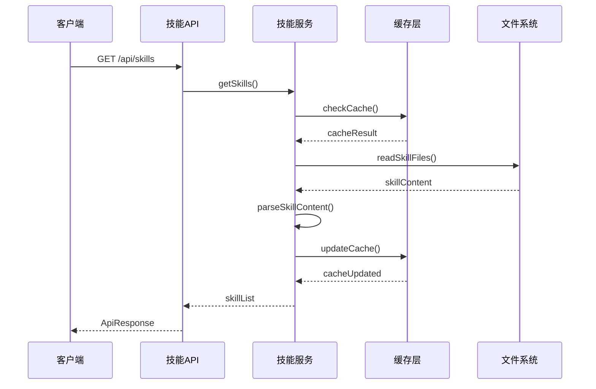
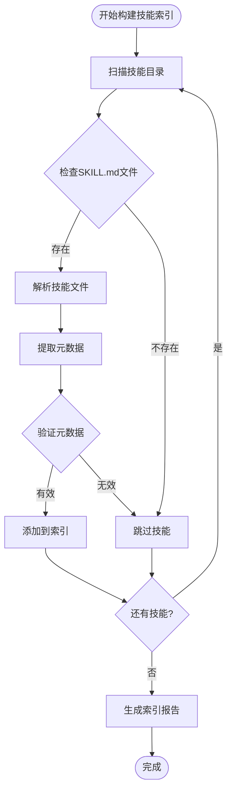
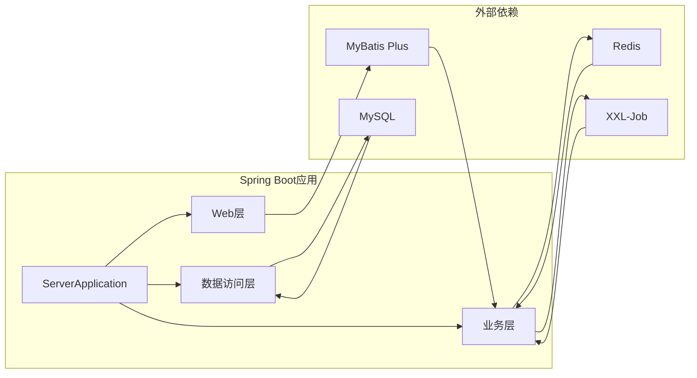

# Trae技能索引技能

<cite>
**本文档引用的文件**
- [pom.xml](file://pom.xml)
- [build_skill_index.py](file://.trae/build_skill_index.py)
- [ServerApplication.java](file://src/main/java/com/jiuyu/governance/ServerApplication.java)
- [application.yml](file://src/main/resources/application.yml)
- [OrgController.java](file://src/main/java/com/jiuyu/governance/business/org/controller/OrgController.java)
</cite>

## 目录
1. [项目概述](#项目概述)
2. [Trae技能索引系统架构](#trae技能索引系统架构)
3. [核心组件分析](#核心组件分析)
4. [技能索引构建流程](#技能索引构建流程)
5. [系统集成与依赖](#系统集成与依赖)
6. [性能考虑](#性能考虑)
7. [故障排除指南](#故障排除指南)
8. [总结](#总结)

## 项目概述

本项目是一个基于Spring Boot的企业治理平台，主要提供组织架构管理、绩效管理、RBAC权限控制等核心功能。项目采用模块化设计，包含业务层、服务层、数据访问层等完整的分层架构。

项目的核心特色包括：
- **多租户支持**：支持企业级多租户架构
- **权限控制**：基于RBAC的细粒度权限管理系统
- **组织架构管理**：完整的公司-部门-团队三层组织结构
- **绩效管理体系**：涵盖员工、直播、产品等多维度绩效统计
- **分布式任务调度**：集成XXL-Job实现分布式任务调度

## Trae技能索引系统架构

Trae技能索引系统是项目中的一个专门技能管理模块，负责技能的索引、分类和检索功能。

**图表来源**
- [build_skill_index.py:1-30](file://.trae/build_skill_index.py#L1-L30)

## 核心组件分析

### 技能索引构建器

技能索引构建器是整个系统的核心组件，负责从技能目录中提取技能信息并生成可搜索的索引。

**图表来源**
- [build_skill_index.py:6-15](file://.trae/build_skill_index.py#L6-L15)

### 技能文档管理系统

技能文档管理系统负责管理和组织技能相关的文档内容。

**图表来源**
- [OrgController.java:66-144](file://src/main/java/com/jiuyu/governance/business/org/controller/OrgController.java#L66-L144)

**章节来源**
- [build_skill_index.py:1-30](file://.trae/build_skill_index.py#L1-L30)

## 技能索引构建流程

技能索引的构建过程遵循以下标准化流程：

**图表来源**
- [build_skill_index.py:17-29](file://.trae/build_skill_index.py#L17-L29)

### 元数据提取机制

系统采用YAML frontmatter格式提取技能元数据，支持以下字段：

- **name**: 技能名称（必填）
- **description**: 技能描述（可选）
- **category**: 技能分类（可选）
- **tags**: 技能标签（可选）
- **version**: 技能版本（可选）

**章节来源**
- [build_skill_index.py:6-15](file://.trae/build_skill_index.py#L6-L15)

## 系统集成与依赖

### Spring Boot集成

项目采用Spring Boot作为基础框架，提供了自动配置和依赖管理功能。

**图表来源**
- [ServerApplication.java:12-18](file://src/main/java/com/jiuyu/governance/ServerApplication.java#L12-L18)
- [pom.xml:35-167](file://pom.xml#L35-L167)

### 核心依赖分析

项目的主要技术栈包括：

- **Spring Boot 3.3.0**: 应用框架
- **Spring Web MVC**: Web层框架
- **MyBatis Plus**: 数据持久化
- **Redis**: 缓存和分布式锁
- **Apache HttpClient 5**: HTTP客户端
- **XXL-Job**: 分布式任务调度

**章节来源**
- [pom.xml:18-32](file://pom.xml#L18-L32)
- [pom.xml:106-130](file://pom.xml#L106-L130)

## 性能考虑

### 缓存策略

系统采用多层缓存策略来提升性能：

1. **Redis缓存**: 存储热点数据和会话信息
2. **本地缓存**: 使用Caffeine实现本地缓存
3. **HTTP缓存**: 利用浏览器缓存减少请求

### 数据库优化

- **连接池配置**: HikariCP提供高性能数据库连接
- **分页查询**: 对大数据量采用分页策略
- **索引优化**: 合理的数据库索引设计

### 异步处理

系统支持异步任务处理，包括：
- **定时任务**: 基于XXL-Job的分布式调度
- **异步消息**: 支持异步事件处理
- **批量操作**: 提供批量数据处理能力

## 故障排除指南

### 常见问题诊断

1. **技能索引构建失败**
   - 检查技能目录结构是否正确
   - 验证SKILL.md文件格式是否符合要求
   - 确认文件编码为UTF-8

2. **API响应异常**
   - 检查服务端口配置
   - 验证数据库连接参数
   - 查看Redis连接状态

3. **权限认证问题**
   - 确认OAuth配置正确
   - 检查签名验证设置
   - 验证用户权限配置

### 日志分析

系统提供详细的日志记录，包括：
- **访问日志**: 记录API调用信息
- **错误日志**: 捕获异常和错误信息
- **性能日志**: 监控系统性能指标

**章节来源**
- [application.yml:5-148](file://src/main/resources/application.yml#L5-L148)

## 总结

Trae技能索引技能模块为整个治理平台提供了完整的技能管理解决方案。通过模块化的架构设计和标准化的开发流程，系统具备了良好的扩展性和维护性。

### 主要优势

1. **模块化设计**: 清晰的职责分离和依赖关系
2. **自动化构建**: 自动化的技能索引生成流程
3. **性能优化**: 多层次的性能优化策略
4. **易于维护**: 标准化的代码结构和配置管理

### 发展方向

未来可以考虑的功能增强：
- **智能推荐**: 基于机器学习的技能推荐算法
- **技能评估**: 内置技能水平评估和认证机制
- **移动端支持**: 开发移动端应用支持
- **多语言支持**: 国际化和多语言能力