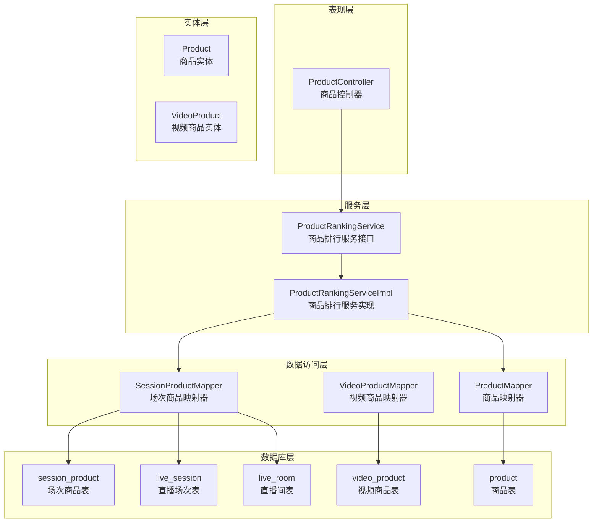
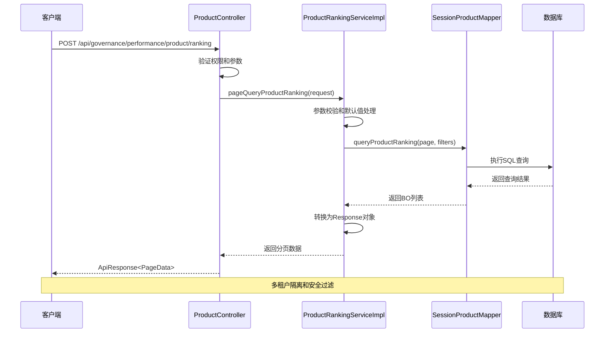
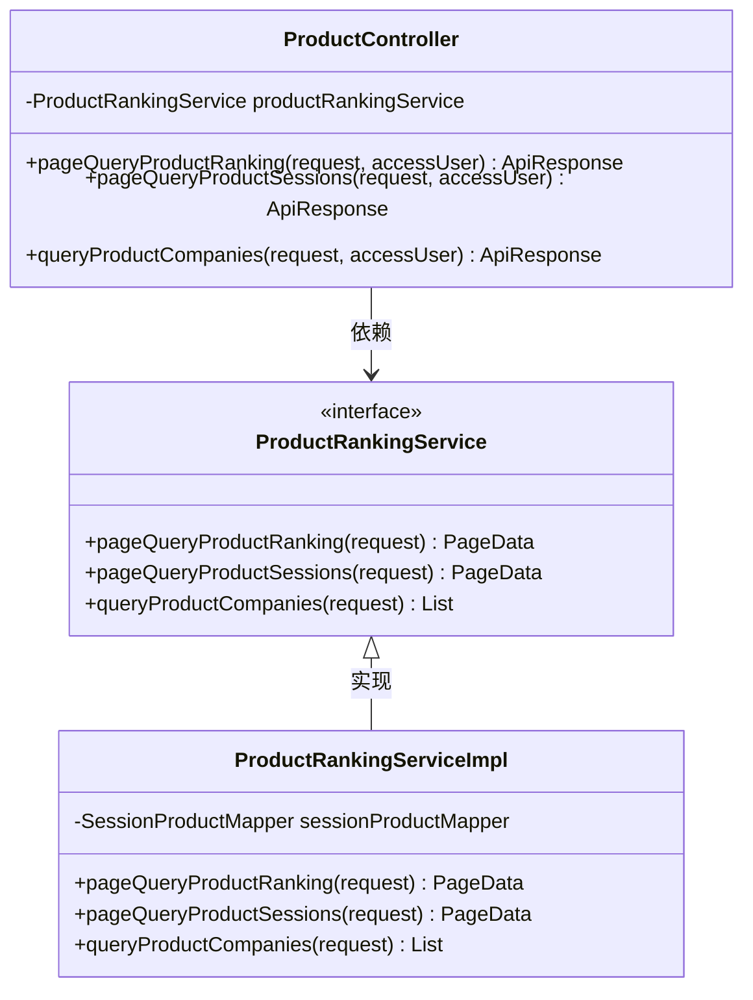
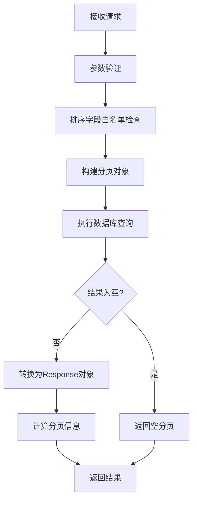
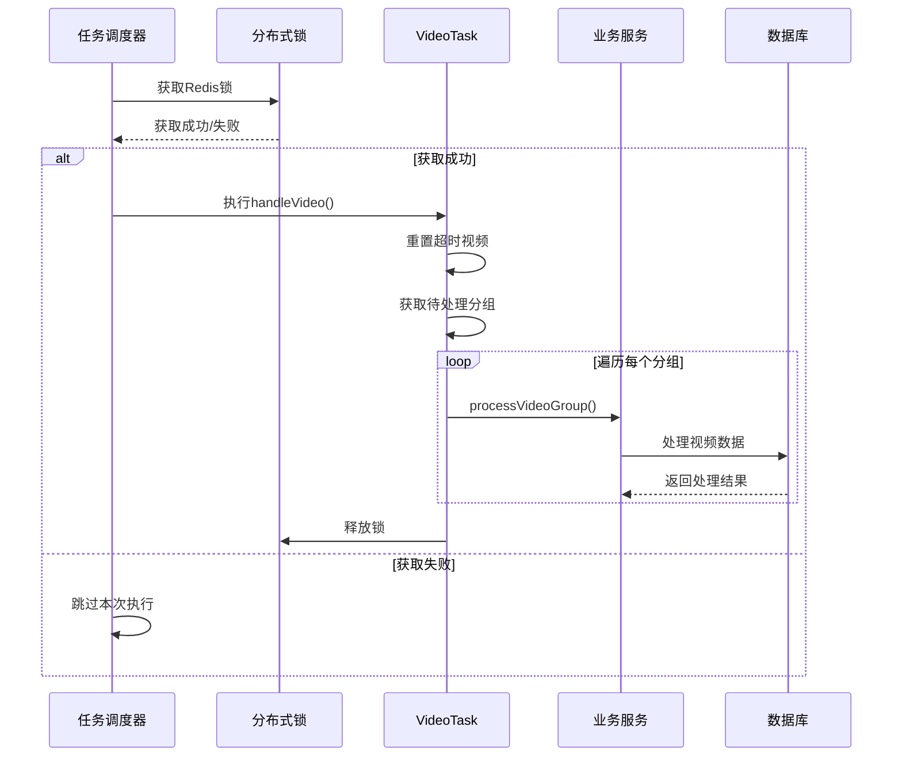
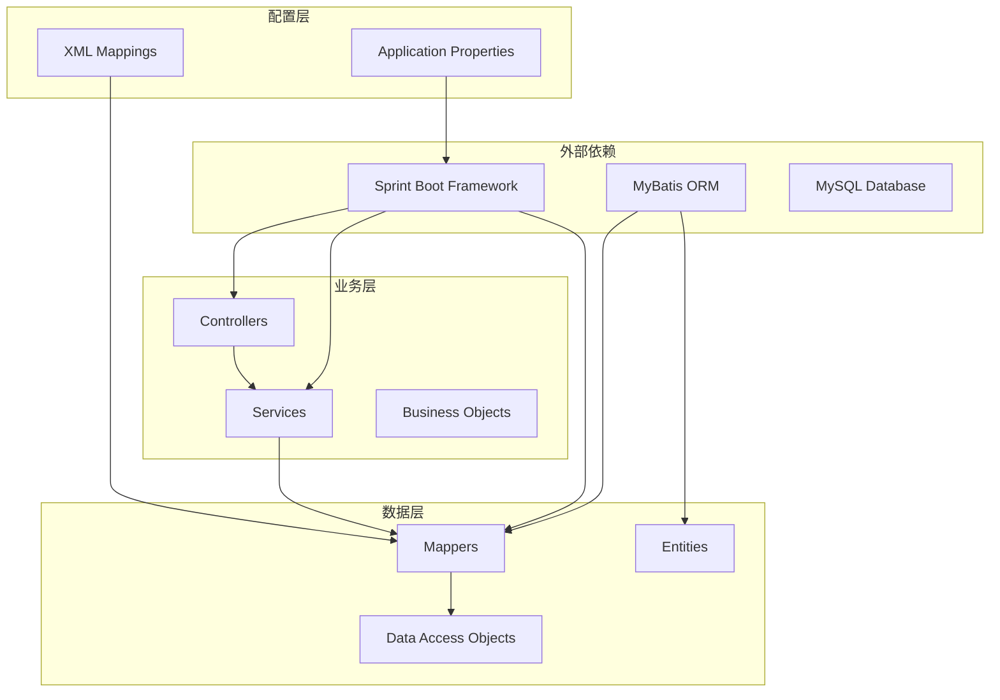

# 视频产品功能文档

<cite>
**本文档引用的文件**
- [video_product.md](file://docs/db/video_product.md)
- [ProductController.java](file://src/main/java/com/jiuyu/governance/business/performance/controller/ProductController.java)
- [ProductRankingService.java](file://src/main/java/com/jiuyu/governance/business/performance/service/ProductRankingService.java)
- [ProductRankingServiceImpl.java](file://src/main/java/com/jiuyu/governance/business/performance/service/impl/ProductRankingServiceImpl.java)
- [VideoProductMapper.java](file://src/main/java/com/jiuyu/governance/business/performance/mapper/VideoProductMapper.java)
- [VideoProductMapper.xml](file://src/main/resources/mapper/performance/VideoProductMapper.xml)
- [SessionProductMapper.xml](file://src/main/resources/mapper/performance/SessionProductMapper.xml)
- [Product.java](file://src/main/java/com/jiuyu/governance/business/performance/pojo/entity/Product.java)
- [VideoProduct.java](file://src/main/java/com/jiuyu/governance/business/performance/pojo/entity/VideoProduct.java)
- [ProductRankingRequest.java](file://src/main/java/com/jiuyu/governance/business/performance/pojo/request/ProductRankingRequest.java)
- [ProductRankingResponse.java](file://src/main/java/com/jiuyu/governance/business/performance/pojo/response/ProductRankingResponse.java)
- [handleVideo.md](file://docs/module_description/performance/handleVideo.md)
</cite>

## 目录
1. [简介](#简介)
2. [项目结构](#项目结构)
3. [核心组件](#核心组件)
4. [架构概览](#架构概览)
5. [详细组件分析](#详细组件分析)
6. [依赖关系分析](#依赖关系分析)
7. [性能考虑](#性能考虑)
8. [故障排除指南](#故障排除指南)
9. [结论](#结论)

## 简介

本文档详细介绍了视频产品功能模块，该模块基于爱复盘平台的视频数据，实现了商品维度的业绩统计分析功能。系统通过定时任务处理视频数据，将视频内容与商品销售数据进行关联分析，提供商品排行、场次查询和分公司统计等核心功能。

该功能模块采用分层架构设计，包括控制器层、服务层、数据访问层和数据库层，支持多租户隔离和分布式锁机制，确保数据处理的准确性和系统的稳定性。

## 项目结构

视频产品功能模块位于治理系统的性能管理子系统中，主要包含以下层次：



**图表来源**
- [ProductController.java:34-96](file://src/main/java/com/jiuyu/governance/business/performance/controller/ProductController.java#L34-L96)
- [ProductRankingServiceImpl.java:32-35](file://src/main/java/com/jiuyu/governance/business/performance/service/impl/ProductRankingServiceImpl.java#L32-L35)

**章节来源**
- [ProductController.java:1-97](file://src/main/java/com/jiuyu/governance/business/performance/controller/ProductController.java#L1-L97)
- [ProductRankingService.java:1-57](file://src/main/java/com/jiuyu/governance/business/performance/service/ProductRankingService.java#L1-L57)

## 核心组件

### 数据模型

系统采用双表结构存储视频商品数据：

1. **视频商品表 (video_product)**：存储视频与商品的关联关系和商品在视频中的表现数据
2. **商品表 (product)**：存储商品的基础信息
3. **场次商品关联表 (session_product)**：存储场次维度的商品销售数据

### 接口设计

系统提供三个核心API接口：

1. **商品排行查询**：支持按多种指标进行排序和筛选
2. **商品关联场次查询**：展示商品在各直播场次中的表现
3. **商品关联分公司查询**：按分公司维度统计商品销售情况

**章节来源**
- [video_product.md:1-126](file://docs/db/video_product.md#L1-L126)
- [ProductRankingResponse.java:17-90](file://src/main/java/com/jiuyu/governance/business/performance/pojo/response/ProductRankingResponse.java#L17-L90)

## 架构概览

视频产品功能采用典型的三层架构模式，结合定时任务和分布式锁机制：



**图表来源**
- [ProductController.java:53-59](file://src/main/java/com/jiuyu/governance/business/performance/controller/ProductController.java#L53-L59)
- [ProductRankingServiceImpl.java:67-102](file://src/main/java/com/jiuyu/governance/business/performance/service/impl/ProductRankingServiceImpl.java#L67-L102)

## 详细组件分析

### 商品控制器 (ProductController)

商品控制器负责处理外部请求，提供商品相关的API接口：



**图表来源**
- [ProductController.java:34-96](file://src/main/java/com/jiuyu/governance/business/performance/controller/ProductController.java#L34-L96)
- [ProductRankingService.java:19-56](file://src/main/java/com/jiuyu/governance/business/performance/service/ProductRankingService.java#L19-L56)

### 数据访问层

数据访问层通过MyBatis实现数据库操作，包含两个核心映射器：

#### SessionProductMapper (核心业务映射器)

负责商品排行、场次查询和分公司统计的复杂SQL查询：

```mermaid
flowchart TD
Start([查询开始]) --> ValidateParams[验证请求参数]
ValidateParams --> BuildSQL[构建SQL查询]
BuildSQL --> ApplyFilters[应用过滤条件]
ApplyFilters --> GroupBy[按维度分组聚合]
GroupBy --> OrderBy[排序处理]
OrderBy --> ExecuteQuery[执行数据库查询]
ExecuteQuery --> TransformResult[转换为BO对象]
TransformResult --> End([返回结果])
ApplyFilters --> |日期范围过滤| DateFilter[DATE(ls.start_time) BETWEEN startDate AND endDate]
ApplyFilters --> |组织过滤| OrgFilter[按companyId/deptId/teamId过滤]
ApplyFilters --> |租户隔离| TenantFilter[sp.tenant_id = #{tenantId}]
```

**图表来源**
- [SessionProductMapper.xml:6-63](file://src/main/resources/mapper/performance/SessionProductMapper.xml#L6-L63)
- [SessionProductMapper.xml:66-98](file://src/main/resources/mapper/performance/SessionProductMapper.xml#L66-L98)

#### VideoProductMapper (视频商品映射器)

负责视频商品数据的CRUD操作：

**章节来源**
- [ProductController.java:18-96](file://src/main/java/com/jiuyu/governance/business/performance/controller/ProductController.java#L18-L96)
- [ProductRankingServiceImpl.java:32-35](file://src/main/java/com/jiuyu/governance/business/performance/service/impl/ProductRankingServiceImpl.java#L32-L35)

### 实体模型

#### 商品实体 (Product)

商品基础信息实体，包含商品标识、名称、图片等基本信息：

| 字段名 | 类型 | 描述 | 用途 |
|--------|------|------|------|
| id | Long | 主键 | 商品唯一标识 |
| tenant_id | Long | 租户ID | 多租户隔离 |
| product_id | String | 商品ID | 来源于外部系统 |
| name | String | 商品名称 | 显示用名称 |
| image_uri | String | 图片URL | 商品图片地址 |

#### 视频商品实体 (VideoProduct)

视频与商品关联的详细数据实体：

| 字段类别 | 字段名 | 类型 | 描述 |
|----------|--------|------|------|
| 基础信息 | id, tenant_id, video_id, product_id | Long/String | 关联标识 |
| 商品信息 | title, image_uri, market_price | String/BigDecimal | 商品基本信息 |
| 时间信息 | product_bind_time, product_down_time | LocalDateTime | 商品上下架时间 |
| 销售指标 | quantity, sales_amount, refund_amount | Integer/BigDecimal | 销售数据 |
| 转化率指标 | exposure_conversion_rate, gpm, click_payment_rate | BigDecimal | 性能指标 |
| 退款指标 | refund_cnt, refund_amount, refund_rate | Integer/BigDecimal | 退款数据 |

**章节来源**
- [Product.java:15-80](file://src/main/java/com/jiuyu/governance/business/performance/pojo/entity/Product.java#L15-L80)
- [VideoProduct.java:16-220](file://src/main/java/com/jiuyu/governance/business/performance/pojo/entity/VideoProduct.java#L16-L220)

### 业务逻辑处理

#### 商品排行查询流程



**图表来源**
- [ProductRankingServiceImpl.java:67-102](file://src/main/java/com/jiuyu/governance/business/performance/service/impl/ProductRankingServiceImpl.java#L67-L102)

#### 数据处理定时任务

系统通过定时任务处理视频数据，实现数据的批量处理和聚合：



**图表来源**
- [handleVideo.md:18-52](file://docs/module_description/performance/handleVideo.md#L18-L52)

**章节来源**
- [ProductRankingServiceImpl.java:165-190](file://src/main/java/com/jiuyu/governance/business/performance/service/impl/ProductRankingServiceImpl.java#L165-L190)
- [handleVideo.md:14-52](file://docs/module_description/performance/handleVideo.md#L14-L52)

## 依赖关系分析

系统采用清晰的分层依赖关系：



**图表来源**
- [ProductController.java:1-24](file://src/main/java/com/jiuyu/governance/business/performance/controller/ProductController.java#L1-L24)
- [ProductRankingServiceImpl.java:1-25](file://src/main/java/com/jiuyu/governance/business/performance/service/impl/ProductRankingServiceImpl.java#L1-L25)

**章节来源**
- [ProductRankingService.java:1-12](file://src/main/java/com/jiuyu/governance/business/performance/service/ProductRankingService.java#L1-L12)
- [VideoProductMapper.java:1-16](file://src/main/java/com/jiuyu/governance/business/performance/mapper/VideoProductMapper.java#L1-L16)

## 性能考虑

### 查询优化策略

1. **索引优化**：视频商品表建立了多处复合索引，包括租户+视频ID、租户+批次号等，确保查询性能
2. **分页查询**：所有查询接口都支持分页，避免大数据量查询导致的性能问题
3. **白名单校验**：排序字段和排序方向都经过白名单校验，防止SQL注入和无效查询

### 缓存策略

系统采用Redis分布式锁机制，确保任务执行的互斥性，避免重复处理相同的数据。

### 异步处理

对于耗时的数据处理操作，系统采用异步线程池处理，提高系统的并发处理能力。

## 故障排除指南

### 常见问题及解决方案

1. **查询结果为空**
   - 检查时间范围是否正确设置
   - 确认租户ID是否正确传递
   - 验证组织筛选条件是否过于严格

2. **排序异常**
   - 确认排序字段是否在白名单内
   - 检查排序方向是否为asc或desc

3. **数据不一致**
   - 检查定时任务是否正常运行
   - 验证分布式锁是否正确释放

### 监控指标

系统提供了完善的监控指标，包括：
- 查询响应时间
- 数据处理成功率
- 分布式锁获取成功率
- 数据库连接池使用情况

**章节来源**
- [ProductRankingServiceImpl.java:173-190](file://src/main/java/com/jiuyu/governance/business/performance/service/impl/ProductRankingServiceImpl.java#L173-L190)

## 结论

视频产品功能模块通过合理的架构设计和完善的业务逻辑，实现了视频数据与商品销售数据的有效关联分析。系统具备良好的扩展性和稳定性，能够满足大规模数据处理的需求。

模块的主要优势包括：
1. 清晰的分层架构，便于维护和扩展
2. 完善的参数校验和安全控制
3. 高效的数据库查询和索引优化
4. 稳定的定时任务和分布式锁机制
5. 多维度的数据分析能力

未来可以考虑的功能增强包括：
1. 添加更多维度的分析指标
2. 优化大数据量场景下的查询性能
3. 增强实时数据处理能力
4. 扩展更多的可视化展示功能