# 业务模块

<cite>
**本文引用的文件**
- [OrgController.java](file://src/main/java/com/jiuyu/governance/business/org/controller/OrgController.java)
- [SubCompanyServiceImpl.java](file://src/main/java/com/jiuyu/governance/business/org/service/impl/SubCompanyServiceImpl.java)
- [SubCompany.java](file://src/main/java/com/jiuyu/governance/business/org/pojo/entity/SubCompany.java)
- [EmployeeController.java](file://src/main/java/com/jiuyu/governance/business/rbac/controller/EmployeeController.java)
- [EmployeeServiceImpl.java](file://src/main/java/com/jiuyu/governance/business/rbac/service/impl/EmployeeServiceImpl.java)
- [Employee.java](file://src/main/java/com/jiuyu/governance/business/rbac/pojo/entity/Employee.java)
- [EmployeeQueryRequest.java](file://src/main/java/com/jiuyu/governance/business/rbac/pojo/request/EmployeeQueryRequest.java)
- [EmployeeOptionSearchRequest.java](file://src/main/java/com/jiuyu/governance/business/rbac/pojo/request/EmployeeOptionSearchRequest.java)
- [EmployeeInfoResponse.java](file://src/main/java/com/jiuyu/governance/business/rbac/pojo/response/EmployeeInfoResponse.java)
- [EmployeeMapper.xml](file://src/main/resources/mapper/rbac/EmployeeMapper.xml)
- [EmployeePerformanceController.java](file://src/main/java/com/jiuyu/governance/business/performance/controller/EmployeePerformanceController.java)
- [EmployeePerformanceServiceImpl.java](file://src/main/java/com/jiuyu/governance/business/performance/service/impl/EmployeePerformanceServiceImpl.java)
- [SchedulePerformance.java](file://src/main/java/com/jiuyu/governance/business/performance/pojo/entity/SchedulePerformance.java)
- [SchedulePerformanceMapper.java](file://src/main/java/com/jiuyu/governance/business/performance/mapper/SchedulePerformanceMapper.java)
- [LiveRoomClientController.java](file://src/main/java/com/jiuyu/governance/business/room/controller/LiveRoomClientController.java)
- [LiveRoomServiceImpl.java](file://src/main/java/com/jiuyu/governance/business/room/service/impl/LiveRoomServiceImpl.java)
- [LiveRoom.java](file://src/main/java/com/jiuyu/governance/business/room/pojo/entity/LiveRoom.java)
- [LiveRoomMapper.java](file://src/main/java/com/jiuyu/governance/business/room/mapper/LiveRoomMapper.java)
- [PropertyService.java](file://src/main/java/com/jiuyu/governance/openfeign/replay/PropertyService.java)
- [PropertyServiceImpl.java](file://src/main/java/com/jiuyu/governance/openfeign/replay/impl/PropertyServiceImpl.java)
- [TenantPropertyQuotaResponse.java](file://src/main/java/com/jiuyu/governance/openfeign/replay/response/TenantPropertyQuotaResponse.java)
- [PropertyType.java](file://src/main/java/com/jiuyu/governance/openfeign/replay/consts/PropertyType.java)
- [TenantPropertyQuotaEditRequest.java](file://src/main/java/com/jiuyu/governance/openfeign/replay/request/TenantPropertyQuotaEditRequest.java)
- [ReplayApiResponseType.java](file://src/main/java/com/jiuyu/governance/openfeign/replay/consts/ReplayApiResponseType.java)
- [ManagerConnectorProcessor.java](file://src/main/java/com/jiuyu/governance/business/org/service/impl/ManagerConnectorProcessor.java)
- [UserAccountService.java](file://src/main/java/com/jiuyu/governance/openfeign/replay/UserAccountService.java)
</cite>

## 目录
1. [引言](#引言)
2. [项目结构](#项目结构)
3. [核心组件](#核心组件)
4. [架构总览](#架构总览)
5. [详细组件分析](#详细组件分析)
6. [依赖分析](#依赖分析)
7. [性能考虑](#性能考虑)
8. [故障排查指南](#故障排查指南)
9. [结论](#结论)
10. [附录](#附录)

## 引言
本文件面向业务分析师与产品经理，系统化梳理 fupan-governance-server 的四大核心业务模块：组织架构管理（org）、人员权限管理（rbac）、直播业绩管理（performance）、直播房间管理（room）以及新增的资产配额管理系统。文档从模块定位、业务价值、内部职责边界、模块间依赖与数据流、关键流程与场景、扩展与定制能力等维度展开，帮助读者建立统一的业务理解框架，并指导后续的业务演进与技术落地。

**更新** 本次更新重点增加了子账号同步功能、Redis缓存机制和员工角色管理增强的相关内容，完善了模块化设计的技术实现细节。

## 项目结构
- 四大业务域采用"按域分包"的模块化组织方式，分别位于：
  - org：组织架构管理（公司、部门、小组、岗位、管理者连接）
  - rbac：人员权限管理（员工、角色、菜单、数据权限）
  - performance：直播业绩管理（员工业绩、班次业绩、产品维度、趋势与汇总）
  - room：直播房间管理（直播间、排班属性、客户端排班查询）
  - **资产配额管理：租户资源限额控制（员工数、子公司数等）**

- 控制器层（Controller）负责对外暴露REST API；服务层（Service）封装业务规则；数据访问层（Mapper/Entity）承载持久化与查询；POJO层（BO/Request/Response）定义跨层传输对象。

- 模块间通过服务接口耦合，遵循"数据权限前置校验""职责单一""可替换的Mapper/Service实现"的设计原则。

```mermaid
graph TB
subgraph "组织架构管理(org)"
ORG_C["OrgController"]
ORG_S["SubCompanyServiceImpl"]
ORG_E["SubCompany(实体)"]
end
subgraph "人员权限管理(rbac)"
RBAC_C["EmployeeController"]
RBAC_S["EmployeeServiceImpl"]
RBAC_E["Employee(实体)"]
RBAC_Q["EmployeeQueryRequest"]
RBAC_O["EmployeeOptionSearchRequest"]
RBAC_R["EmployeeInfoResponse"]
end
subgraph "直播业绩管理(performance)"
PERF_C["EmployeePerformanceController"]
PERF_S["EmployeePerformanceServiceImpl"]
PERF_M["SchedulePerformanceMapper"]
PERF_E["SchedulePerformance(实体)"]
end
subgraph "直播房间管理(room)"
ROOM_C["LiveRoomClientController"]
ROOM_S["LiveRoomServiceImpl"]
ROOM_M["LiveRoomMapper"]
ROOM_E["LiveRoom(实体)"]
end
subgraph "资产配额管理(Property)"
PROP_S["PropertyServiceImpl"]
PROP_I["PropertyService(接口)"]
PROP_R["TenantPropertyQuotaResponse"]
end
subgraph "子账号同步与缓存管理"
SYNC_S["EmployeeServiceImpl.syncSubAccount"]
CACHE_P["ManagerConnectorProcessor"]
USER_A["UserAccountService"]
end
ORG_C --> ORG_S
ORG_S --> ORG_E
ORG_S --> PROP_S
ORG_S --> CACHE_P
RBAC_C --> RBAC_S
RBAC_S --> RBAC_E
RBAC_S --> RBAC_Q
RBAC_S --> RBAC_O
RBAC_S --> RBAC_R
RBAC_S --> PROP_S
RBAC_S --> USER_A
RBAC_S --> CACHE_P
PERF_C --> PERF_S
PERF_S --> PERF_M
PERF_S --> PERF_E
PERF_S --> CACHE_P
ROOM_C --> ROOM_S
ROOM_S --> ROOM_M
ROOM_S --> ROOM_E
ROOM_S --> CACHE_P
PROP_S --> PROP_I
PROP_S --> PROP_R
SYNC_S --> USER_A
SYNC_S --> CACHE_P
```

**图表来源**
- [OrgController.java:40-139](file://src/main/java/com/jiuyu/governance/business/org/controller/OrgController.java#L40-L139)
- [SubCompanyServiceImpl.java:50-307](file://src/main/java/com/jiuyu/governance/business/org/service/impl/SubCompanyServiceImpl.java#L50-L307)
- [SubCompany.java:20-85](file://src/main/java/com/jiuyu/governance/business/org/pojo/entity/SubCompany.java#L20-L85)
- [EmployeeController.java:31-186](file://src/main/java/com/jiuyu/governance/business/rbac/controller/EmployeeController.java#L31-L186)
- [EmployeeServiceImpl.java:537-750](file://src/main/java/com/jiuyu/governance/business/rbac/service/impl/EmployeeServiceImpl.java#L537-L750)
- [EmployeeQueryRequest.java:21-248](file://src/main/java/com/jiuyu/governance/business/rbac/pojo/request/EmployeeQueryRequest.java#L21-L248)
- [EmployeeOptionSearchRequest.java:19-208](file://src/main/java/com/jiuyu/governance/business/rbac/pojo/request/EmployeeOptionSearchRequest.java#L19-L208)
- [EmployeeInfoResponse.java:15-122](file://src/main/java/com/jiuyu/governance/business/rbac/pojo/response/EmployeeInfoResponse.java#L15-L122)
- [Employee.java:24-171](file://src/main/java/com/jiuyu/governance/business/rbac/pojo/entity/Employee.java#L24-L171)
- [EmployeePerformanceController.java:42-152](file://src/main/java/com/jiuyu/governance/business/performance/controller/EmployeePerformanceController.java#L42-L152)
- [EmployeePerformanceServiceImpl.java:58-409](file://src/main/java/com/jiuyu/governance/business/performance/service/impl/EmployeePerformanceServiceImpl.java#L58-L409)
- [SchedulePerformance.java:18-160](file://src/main/java/com/jiuyu/governance/business/performance/pojo/entity/SchedulePerformance.java#L18-L160)
- [SchedulePerformanceMapper.java:30-260](file://src/main/java/com/jiuyu/governance/business/performance/mapper/SchedulePerformanceMapper.java#L30-L260)
- [LiveRoomClientController.java:26-45](file://src/main/java/com/jiuyu/governance/business/room/controller/LiveRoomClientController.java#L26-L45)
- [LiveRoomServiceImpl.java:59-530](file://src/main/java/com/jiuyu/governance/business/room/service/impl/LiveRoomServiceImpl.java#L59-L530)
- [LiveRoom.java:21-168](file://src/main/java/com/jiuyu/governance/business/room/pojo/entity/LiveRoom.java#L21-L168)
- [LiveRoomMapper.java:21-47](file://src/main/java/com/jiuyu/governance/business/room/mapper/LiveRoomMapper.java#L21-L47)
- [PropertyService.java:17-50](file://src/main/java/com/jiuyu/governance/openfeign/replay/PropertyService.java#L17-L50)
- [PropertyServiceImpl.java:28-135](file://src/main/java/com/jiuyu/governance/openfeign/replay/impl/PropertyServiceImpl.java#L28-L135)
- [TenantPropertyQuotaResponse.java:14-451](file://src/main/java/com/jiuyu/governance/openfeign/replay/response/TenantPropertyQuotaResponse.java#L14-L451)
- [ManagerConnectorProcessor.java:1-694](file://src/main/java/com/jiuyu/governance/business/org/service/impl/ManagerConnectorProcessor.java#L1-L694)
- [UserAccountService.java:1-113](file://src/main/java/com/jiuyu/governance/openfeign/replay/UserAccountService.java#L1-L113)

**章节来源**
- [OrgController.java:40-139](file://src/main/java/com/jiuyu/governance/business/org/controller/OrgController.java#L40-L139)
- [EmployeeController.java:31-186](file://src/main/java/com/jiuyu/governance/business/rbac/controller/EmployeeController.java#L31-L186)
- [EmployeePerformanceController.java:42-152](file://src/main/java/com/jiuyu/governance/business/performance/controller/EmployeePerformanceController.java#L42-L152)
- [LiveRoomClientController.java:26-45](file://src/main/java/com/jiuyu/governance/business/room/controller/LiveRoomClientController.java#L26-L45)
- [PropertyService.java:17-50](file://src/main/java/com/jiuyu/governance/openfeign/replay/PropertyService.java#L17-L50)

## 核心组件
- 组织架构管理（org）
  - 职责：维护公司、部门、小组、岗位等组织实体，提供组织树构建、下拉选项、名称映射等能力。
  - 关键接口：SubCompanyService、DeptService、TeamService、PositionService；控制器 OrgController 提供组织树查询。
  - 实体：SubCompany、Dept、Team、Position 等。
  - **新增**：集成资产配额管理，支持子公司数量限额控制；集成Redis缓存管理，提供组织权限缓存机制。
- 人员权限管理（rbac）
  - 职责：员工全生命周期管理（新增/更新/详情/分页/启用/禁用/删除/搜索）、角色与菜单授权、数据权限前置校验、与外部录制账号打通。
  - 关键接口：EmployeeService、RoleService、MenuService；控制器 EmployeeController 提供员工管理API。
  - 实体：Employee、UserRole、Menu、Role 等。
  - **新增**：集成资产配额管理，支持员工数量限额控制。
  - **新增**：pageQueryEmployee方法支持复杂的过滤组合（公司ID、部门ID、团队ID、职位ID、账户状态、雇佣类型），同时增强了搜索功能和数据权限过滤。
  - **新增**：子账号同步功能，支持批量同步租户子账户到本地员工系统。
  - **新增**：Redis缓存管理，提供员工角色信息缓存和权限缓存机制。
- 直播业绩管理（performance）
  - 职责：员工业绩分页、时段统计、汇总、趋势、按日/班次维度分页；聚合直播间的场观、销售额、ROI等指标。
  - 关键接口：EmployeePerformanceService、SchedulePerformanceMapper；控制器 EmployeePerformanceController 提供员工业绩API。
  - 实体：SchedulePerformance 等。
  - **新增**：集成Redis缓存管理，提供数据权限缓存优化。
- 直播房间管理（room）
  - 职责：直播间新增/修改/删除/启用/停用、分页查询、详情、搜索、排班属性设置与查询；客户端侧查询排班计划。
  - 关键接口：LiveRoomService、LiveRoomMapper；控制器 LiveRoomClientController 提供客户端API。
  - 实体：LiveRoom、LiveRoomScheduleAttribute 等。
  - **新增**：集成Redis缓存管理，提供组织权限缓存机制。
- **资产配额管理（property）**
  - 职责：提供租户资源限额控制能力，支持员工数量、子公司数量等资产类型的配额管理。
  - 关键接口：PropertyService（接口）、PropertyServiceImpl（实现）。
  - 实体：TenantPropertyQuotaResponse（配额响应）、TenantPropertyQuotaEditRequest（配额编辑请求）、PropertyType（资产类型枚举）。
- **子账号同步与缓存管理**
  - 职责：实现租户子账号与本地员工系统的双向同步，提供Redis分布式缓存管理。
  - 关键组件：EmployeeServiceImpl.syncSubAccount（子账号同步）、ManagerConnectorProcessor（缓存处理器）、UserAccountService（外部账户服务）。

**章节来源**
- [SubCompanyServiceImpl.java:50-307](file://src/main/java/com/jiuyu/governance/business/org/service/impl/SubCompanyServiceImpl.java#L50-L307)
- [SubCompany.java:20-85](file://src/main/java/com/jiuyu/governance/business/org/pojo/entity/SubCompany.java#L20-L85)
- [EmployeeServiceImpl.java:537-750](file://src/main/java/com/jiuyu/governance/business/rbac/service/impl/EmployeeServiceImpl.java#L537-L750)
- [EmployeeServiceImpl.java:244-292](file://src/main/java/com/jiuyu/governance/business/rbac/service/impl/EmployeeServiceImpl.java#L244-L292)
- [EmployeeQueryRequest.java:21-248](file://src/main/java/com/jiuyu/governance/business/rbac/pojo/request/EmployeeQueryRequest.java#L21-L248)
- [EmployeeOptionSearchRequest.java:19-208](file://src/main/java/com/jiuyu/governance/business/rbac/pojo/request/EmployeeOptionSearchRequest.java#L19-L208)
- [EmployeeInfoResponse.java:15-122](file://src/main/java/com/jiuyu/governance/business/rbac/pojo/response/EmployeeInfoResponse.java#L15-L122)
- [Employee.java:24-171](file://src/main/java/com/jiuyu/governance/business/rbac/pojo/entity/Employee.java#L24-L171)
- [EmployeePerformanceServiceImpl.java:58-409](file://src/main/java/com/jiuyu/governance/business/performance/service/impl/EmployeePerformanceServiceImpl.java#L58-L409)
- [SchedulePerformance.java:18-160](file://src/main/java/com/jiuyu/governance/business/performance/pojo/entity/SchedulePerformance.java#L18-L160)
- [LiveRoomServiceImpl.java:59-530](file://src/main/java/com/jiuyu/governance/business/room/service/impl/LiveRoomServiceImpl.java#L59-L530)
- [LiveRoom.java:21-168](file://src/main/java/com/jiuyu/governance/business/room/pojo/entity/LiveRoom.java#L21-L168)
- [PropertyService.java:17-50](file://src/main/java/com/jiuyu/governance/openfeign/replay/PropertyService.java#L17-L50)
- [PropertyServiceImpl.java:28-135](file://src/main/java/com/jiuyu/governance/openfeign/replay/impl/PropertyServiceImpl.java#L28-L135)
- [TenantPropertyQuotaResponse.java:14-451](file://src/main/java/com/jiuyu/governance/openfeign/replay/response/TenantPropertyQuotaResponse.java#L14-L451)
- [ManagerConnectorProcessor.java:1-694](file://src/main/java/com/jiuyu/governance/business/org/service/impl/ManagerConnectorProcessor.java#L1-L694)
- [UserAccountService.java:1-113](file://src/main/java/com/jiuyu/governance/openfeign/replay/UserAccountService.java#L1-L113)

## 架构总览
- 控制器层：面向前端/客户端暴露REST API，统一鉴权注解与参数校验。
- 服务层：封装业务规则、数据权限校验、跨模块协作（如员工与组织、房间与组织、业绩与房间）。
- 数据访问层：MyBatis-Plus Mapper + XML SQL，提供高性能分页与聚合查询。
- 实体层：MyBatis-Plus 注解映射，统一逻辑删除、自动填充等。
- 外部集成：与第三方直播平台开放能力对接（如抖音主播信息），与录制账号服务打通，**新增**：与资产配额服务对接，**新增**：与子账号同步服务集成。
- **新增**：Redis缓存层：提供分布式缓存管理，支持数据权限缓存、角色信息缓存、组织权限缓存等。

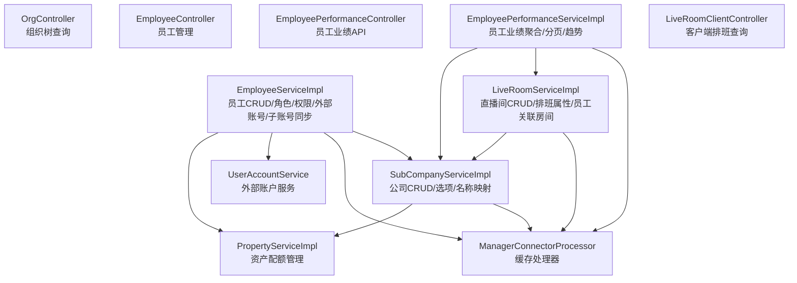

**图表来源**
- [OrgController.java:66-139](file://src/main/java/com/jiuyu/governance/business/org/controller/OrgController.java#L66-L139)
- [SubCompanyServiceImpl.java:208-307](file://src/main/java/com/jiuyu/governance/business/org/service/impl/SubCompanyServiceImpl.java#L208-L307)
- [EmployeeController.java:48-184](file://src/main/java/com/jiuyu/governance/business/rbac/controller/EmployeeController.java#L48-L184)
- [EmployeeServiceImpl.java:537-750](file://src/main/java/com/jiuyu/governance/business/rbac/service/impl/EmployeeServiceImpl.java#L537-L750)
- [EmployeePerformanceController.java:57-150](file://src/main/java/com/jiuyu/governance/business/performance/controller/EmployeePerformanceController.java#L57-L150)
- [EmployeePerformanceServiceImpl.java:68-182](file://src/main/java/com/jiuyu/governance/business/performance/service/impl/EmployeePerformanceServiceImpl.java#L68-L182)
- [LiveRoomClientController.java:40-43](file://src/main/java/com/jiuyu/governance/business/room/controller/LiveRoomClientController.java#L40-L43)
- [LiveRoomServiceImpl.java:266-390](file://src/main/java/com/jiuyu/governance/business/room/service/impl/LiveRoomServiceImpl.java#L266-L390)
- [PropertyServiceImpl.java:28-135](file://src/main/java/com/jiuyu/governance/openfeign/replay/impl/PropertyServiceImpl.java#L28-L135)
- [ManagerConnectorProcessor.java:1-694](file://src/main/java/com/jiuyu/governance/business/org/service/impl/ManagerConnectorProcessor.java#L1-L694)
- [UserAccountService.java:1-113](file://src/main/java/com/jiuyu/governance/openfeign/replay/UserAccountService.java#L1-L113)

## 详细组件分析

### 组织架构管理（org）
- 功能定位
  - 提供公司、部门、小组的增删改查与联动查询，支撑 rbac 与 room 的数据权限与组织关联。
  - 提供组织树构建，支持按层级裁剪，满足前端展示需求。
  - **新增**：集成资产配额管理，支持子公司数量限额控制。
  - **新增**：集成Redis缓存管理，提供组织权限缓存机制，支持租户级和组织级缓存。
- 关键流程
  - 组织树构建：按 level 参数动态加载公司/部门/小组，应用数据权限过滤，避免越权。
  - 公司管理：新增/修改/删除，名称去重、依赖校验（员工/部门）、负责人连接。
  - **新增**：子公司新增时检查配额，新增成功后更新剩余额度；子公司删除时验证最低数量要求并更新配额。
  - **新增**：Redis缓存管理：提供租户级组织ID缓存、组织层级关系缓存、用户权限缓存等功能。
- 业务价值
  - 为人员与直播间的归属提供稳定、可审计的组织基座。
  - **新增**：通过配额控制确保租户资源使用的合规性。
  - **新增**：通过Redis缓存提升数据权限查询性能，降低数据库压力。
- 依赖关系
  - 依赖 Team/Dept/SubCompany 的查询与名称映射；与 ManagerConnectorProcessor 协作维护负责人关系。
  - **新增**：依赖 PropertyService 进行资产配额校验与更新。
  - **新增**：依赖 Redis 缓存进行权限数据缓存。

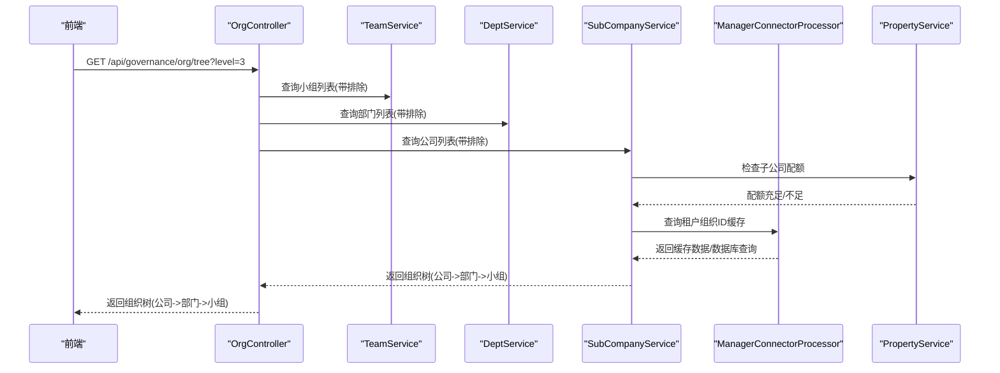

**图表来源**
- [OrgController.java:66-139](file://src/main/java/com/jiuyu/governance/business/org/controller/OrgController.java#L66-L139)
- [SubCompanyServiceImpl.java:208-307](file://src/main/java/com/jiuyu/governance/business/org/service/impl/SubCompanyServiceImpl.java#L208-L307)
- [PropertyServiceImpl.java:66-133](file://src/main/java/com/jiuyu/governance/openfeign/replay/impl/PropertyServiceImpl.java#L66-L133)
- [ManagerConnectorProcessor.java:158-213](file://src/main/java/com/jiuyu/governance/business/org/service/impl/ManagerConnectorProcessor.java#L158-L213)

**章节来源**
- [OrgController.java:49-139](file://src/main/java/com/jiuyu/governance/business/org/controller/OrgController.java#L49-L139)
- [SubCompanyServiceImpl.java:84-197](file://src/main/java/com/jiuyu/governance/business/org/service/impl/SubCompanyServiceImpl.java#L84-L197)
- [SubCompanyServiceImpl.java:127-139](file://src/main/java/com/jiuyu/governance/business/org/service/impl/SubCompanyServiceImpl.java#L127-L139)
- [SubCompanyServiceImpl.java:217-223](file://src/main/java/com/jiuyu/governance/business/org/service/impl/SubCompanyServiceImpl.java#L217-L223)
- [ManagerConnectorProcessor.java:140-213](file://src/main/java/com/jiuyu/governance/business/org/service/impl/ManagerConnectorProcessor.java#L140-L213)

### 人员权限管理（rbac）
- 功能定位
  - 员工全生命周期管理，角色与菜单授权，数据权限前置校验，与外部录制账号打通。
  - **新增**：集成资产配额管理，支持员工数量限额控制。
  - **新增**：pageQueryEmployee方法支持复杂的过滤组合（公司ID、部门ID、团队ID、职位ID、账户状态、雇佣类型），同时增强了搜索功能和数据权限过滤。
  - **新增**：子账号同步功能，支持批量同步租户子账户到本地员工系统。
  - **新增**：Redis缓存管理，提供员工角色信息缓存和权限缓存机制。
- 关键流程
  - 新增员工：手机号/工号去重校验、默认密码生成、角色绑定、录制账号创建。
  - 更新员工：变更校验、手机号占用检查、角色变更、外部账号手机号同步。
  - 启用/禁用/删除：状态一致性、权限回收、强制下线。
  - **新增**：员工新增时检查配额，新增成功后更新剩余额度；员工删除时验证最低数量要求并更新配额。
  - **新增**：子账号同步：定期同步租户所有子账户，自动创建或更新本地员工记录，解绑不再存在的子账户。
  - **新增**：Redis缓存：缓存员工角色信息、用户权限连接、组织权限关系等，提升查询性能。
  - **新增**：pageQueryEmployee支持多维过滤：公司ID、部门ID、团队ID、职位ID、账户状态、雇佣类型、手机号、工号、姓名等。
  - **新增**：search方法支持复杂的过滤组合，包括职位编码列表、关键词、手机号码、公司、部门、团队等条件。
- 业务价值
  - 保障组织内人员与权限的合规、可追溯与可审计。
  - **新增**：通过配额控制确保租户员工数量使用的合规性。
  - **新增**：通过Redis缓存提升数据权限查询性能，支持高并发场景。
  - **新增**：通过子账号同步功能实现多系统间的数据一致性。
  - **新增**：提供灵活的员工查询能力，支持复杂的业务场景。
- 依赖关系
  - 与 org 模块协作（公司/部门/小组名称映射），与 openfeign 录制账号服务交互。
  - **新增**：与 PropertyService 协作进行员工数量配额管理。
  - **新增**：与 UserAccountService 协作进行子账号同步。
  - **新增**：与 ManagerConnectorProcessor 协作进行Redis缓存管理。
  - **新增**：EmployeeQueryRequest和EmployeeOptionSearchRequest提供丰富的查询参数。

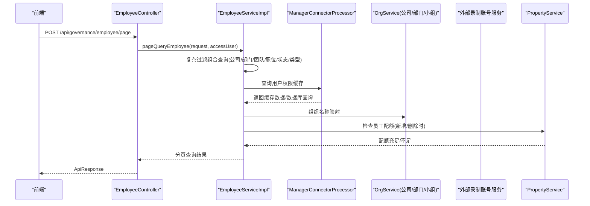

**图表来源**
- [EmployeeController.java:115-119](file://src/main/java/com/jiuyu/governance/business/rbac/controller/EmployeeController.java#L115-L119)
- [EmployeeServiceImpl.java:561-600](file://src/main/java/com/jiuyu/governance/business/rbac/service/impl/EmployeeServiceImpl.java#L561-L600)
- [EmployeeQueryRequest.java:21-248](file://src/main/java/com/jiuyu/governance/business/rbac/pojo/request/EmployeeQueryRequest.java#L21-L248)
- [PropertyServiceImpl.java:66-133](file://src/main/java/com/jiuyu/governance/openfeign/replay/impl/PropertyServiceImpl.java#L66-L133)
- [ManagerConnectorProcessor.java:250-280](file://src/main/java/com/jiuyu/governance/business/org/service/impl/ManagerConnectorProcessor.java#L250-L280)

**章节来源**
- [EmployeeController.java:37-184](file://src/main/java/com/jiuyu/governance/business/rbac/controller/EmployeeController.java#L37-L184)
- [EmployeeServiceImpl.java:537-750](file://src/main/java/com/jiuyu/governance/business/rbac/service/impl/EmployeeServiceImpl.java#L537-L750)
- [EmployeeServiceImpl.java:244-292](file://src/main/java/com/jiuyu/governance/business/rbac/service/impl/EmployeeServiceImpl.java#L244-L292)
- [EmployeeServiceImpl.java:561-600](file://src/main/java/com/jiuyu/governance/business/rbac/service/impl/EmployeeServiceImpl.java#L561-L600)
- [EmployeeServiceImpl.java:337-669](file://src/main/java/com/jiuyu/governance/business/rbac/service/impl/EmployeeServiceImpl.java#L337-L669)
- [EmployeeServiceImpl.java:394-415](file://src/main/java/com/jiuyu/governance/business/rbac/service/impl/EmployeeServiceImpl.java#L394-L415)
- [EmployeeServiceImpl.java:962-974](file://src/main/java/com/jiuyu/governance/business/rbac/service/impl/EmployeeServiceImpl.java#L962-L974)
- [EmployeeQueryRequest.java:21-248](file://src/main/java/com/jiuyu/governance/business/rbac/pojo/request/EmployeeQueryRequest.java#L21-L248)
- [EmployeeOptionSearchRequest.java:19-208](file://src/main/java/com/jiuyu/governance/business/rbac/pojo/request/EmployeeOptionSearchRequest.java#L19-L208)

### 子账号同步功能（新增）
- 功能定位
  - 实现租户子账号与本地员工系统的双向同步，确保多系统间的数据一致性。
  - 支持批量同步、增量更新、差异处理等高级功能。
- 关键流程
  - 子账号同步：获取租户所有用户列表，过滤子账户，批量创建或更新本地员工记录。
  - 差异处理：处理手机号冲突、子账户绑定关系变化、不再存在的子账户解绑。
  - 缓存清理：同步完成后清理相关缓存，保证数据一致性。
- 业务价值
  - 确保子账号与本地员工数据的一致性，避免重复数据和数据不一致问题。
  - 提升用户体验，减少手动维护成本。
  - 支持高并发场景下的数据同步。
- 依赖关系
  - 依赖 UserAccountService 获取租户用户列表。
  - 依赖 EmployeeServiceImpl 进行员工数据操作。
  - 依赖 ManagerConnectorProcessor 进行缓存清理。

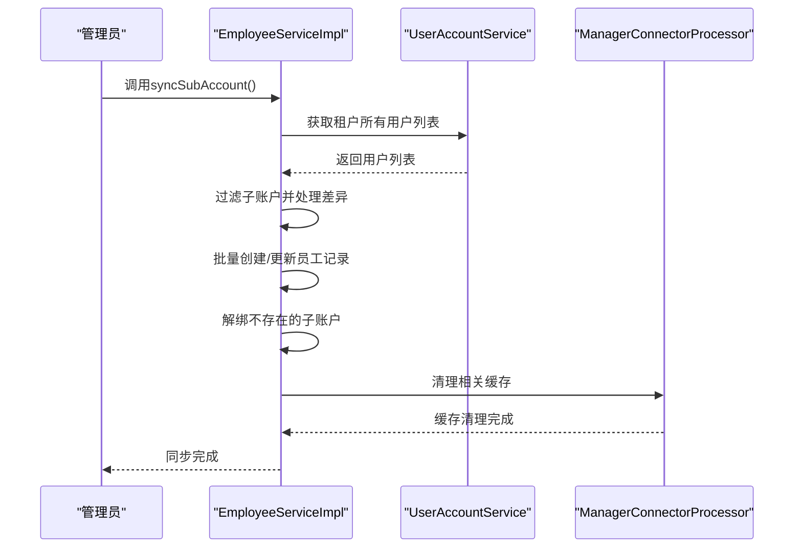

**图表来源**
- [EmployeeServiceImpl.java:537-750](file://src/main/java/com/jiuyu/governance/business/rbac/service/impl/EmployeeServiceImpl.java#L537-L750)
- [UserAccountService.java:74-80](file://src/main/java/com/jiuyu/governance/openfeign/replay/UserAccountService.java#L74-L80)
- [ManagerConnectorProcessor.java:544-596](file://src/main/java/com/jiuyu/governance/business/org/service/impl/ManagerConnectorProcessor.java#L544-L596)

**章节来源**
- [EmployeeServiceImpl.java:537-750](file://src/main/java/com/jiuyu/governance/business/rbac/service/impl/EmployeeServiceImpl.java#L537-L750)
- [UserAccountService.java:74-80](file://src/main/java/com/jiuyu/governance/openfeign/replay/UserAccountService.java#L74-L80)
- [ManagerConnectorProcessor.java:544-596](file://src/main/java/com/jiuyu/governance/business/org/service/impl/ManagerConnectorProcessor.java#L544-L596)

### Redis缓存机制（新增）
- 功能定位
  - 提供分布式缓存管理，支持数据权限缓存、角色信息缓存、组织权限缓存等。
  - 通过缓存优化提升系统性能，降低数据库压力。
- 关键组件
  - ManagerConnectorProcessor：核心缓存处理器，提供多种缓存操作。
  - 缓存类型：用户权限缓存、租户组织ID缓存、组织层级关系缓存、角色信息缓存。
  - 缓存策略：不同类型的缓存具有不同的过期时间，优化存储空间和查询性能。
- 关键流程
  - 缓存查询：优先从Redis缓存获取数据，未命中时从数据库查询并更新缓存。
  - 缓存更新：数据变更时自动清理相关缓存，保证数据一致性。
  - 缓存清理：支持按租户、按组织类型、按用户等多种清理策略。
- 业务价值
  - 显著提升数据权限查询性能，支持高并发场景。
  - 降低数据库查询压力，提升系统整体性能。
  - 通过合理的缓存策略平衡内存使用和查询性能。
- 依赖关系
  - 依赖 Spring StringRedisTemplate 进行Redis操作。
  - 与各业务模块紧密集成，提供统一的缓存服务。

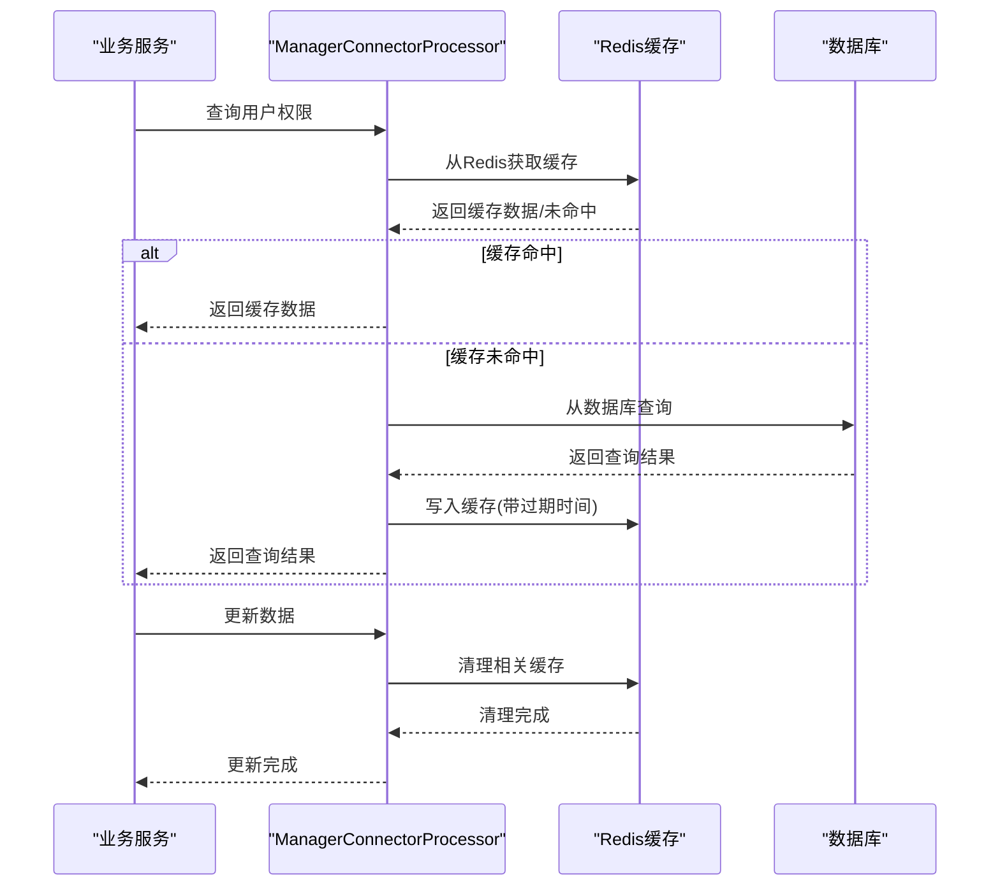

**图表来源**
- [ManagerConnectorProcessor.java:158-213](file://src/main/java/com/jiuyu/governance/business/org/service/impl/ManagerConnectorProcessor.java#L158-L213)
- [ManagerConnectorProcessor.java:250-280](file://src/main/java/com/jiuyu/governance/business/org/service/impl/ManagerConnectorProcessor.java#L250-L280)
- [ManagerConnectorProcessor.java:544-596](file://src/main/java/com/jiuyu/governance/business/org/service/impl/ManagerConnectorProcessor.java#L544-L596)

**章节来源**
- [ManagerConnectorProcessor.java:1-694](file://src/main/java/com/jiuyu/governance/business/org/service/impl/ManagerConnectorProcessor.java#L1-L694)

### 直播业绩管理（performance）
- 功能定位
  - 以员工为中心的直播业绩统计，支持按日、周、月等多时段聚合，支持按直播间的趋势与班次维度分页。
  - **新增**：集成Redis缓存管理，提供数据权限缓存优化。
- 关键流程
  - 员工业绩分页：按组织/岗位/账号状态筛选，聚合直播间ID，填充组织名称与房间名称。
  - 六时段统计：今日/昨日/本周/上周/本月/上月，按员工维度聚合。
  - 汇总统计：总场观、总销售额等。
  - 趋势与班次：按天/班次维度输出明细。
  - **新增**：Redis缓存优化：缓存数据权限信息，提升查询性能。
- 业务价值
  - 为运营与管理者提供精细化的员工业绩视图，支撑激励与复盘。
  - **新增**：通过Redis缓存提升数据权限查询性能。
- 依赖关系
  - 依赖 org 模块的名称映射，依赖 room 模块的房间名称映射。
  - **新增**：依赖 ManagerConnectorProcessor 进行数据权限缓存管理。

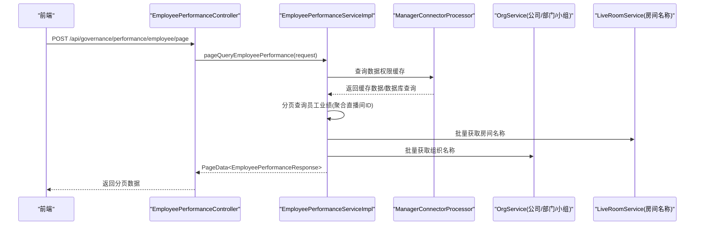

**图表来源**
- [EmployeePerformanceController.java:57-63](file://src/main/java/com/jiuyu/governance/business/performance/controller/EmployeePerformanceController.java#L57-L63)
- [EmployeePerformanceServiceImpl.java:68-182](file://src/main/java/com/jiuyu/governance/business/performance/service/impl/EmployeePerformanceServiceImpl.java#L68-L182)
- [ManagerConnectorProcessor.java:250-280](file://src/main/java/com/jiuyu/governance/business/org/service/impl/ManagerConnectorProcessor.java#L250-L280)

**章节来源**
- [EmployeePerformanceController.java:46-150](file://src/main/java/com/jiuyu/governance/business/performance/controller/EmployeePerformanceController.java#L46-L150)
- [EmployeePerformanceServiceImpl.java:68-407](file://src/main/java/com/jiuyu/governance/business/performance/service/impl/EmployeePerformanceServiceImpl.java#L68-L407)

### 直播房间管理（room）
- 功能定位
  - 直播间基础信息与状态管理，排班属性配置，客户端侧排班计划查询。
  - **新增**：集成Redis缓存管理，提供组织权限缓存机制。
- 关键流程
  - 新增直播间：第三方平台主播信息校验、secUid 唯一性校验、负责人绑定、缓存清理。
  - 分页查询与详情：应用数据权限过滤，装配组织名称与负责人信息。
  - 客户端排班查询：按日期查询排班计划。
  - **新增**：Redis缓存管理：提供组织权限缓存，提升权限查询性能。
- 业务价值
  - 为直播运营提供稳定的直播间资产与排班依据。
  - **新增**：通过Redis缓存提升数据权限查询性能。
- 依赖关系
  - 与 org 模块协作（公司/部门/小组名称映射），与 openfeign 直播平台服务对接。
  - **新增**：与 ManagerConnectorProcessor 协作进行Redis缓存管理。

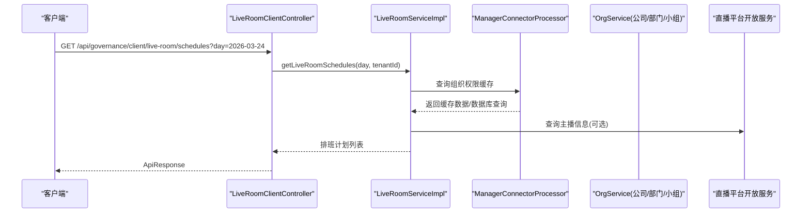

**图表来源**
- [LiveRoomClientController.java:40-43](file://src/main/java/com/jiuyu/governance/business/room/controller/LiveRoomClientController.java#L40-L43)
- [LiveRoomServiceImpl.java:266-390](file://src/main/java/com/jiuyu/governance/business/room/service/impl/LiveRoomServiceImpl.java#L266-L390)
- [ManagerConnectorProcessor.java:250-280](file://src/main/java/com/jiuyu/governance/business/org/service/impl/ManagerConnectorProcessor.java#L250-L280)

**章节来源**
- [LiveRoomClientController.java:34-43](file://src/main/java/com/jiuyu/governance/business/room/controller/LiveRoomClientController.java#L34-L43)
- [LiveRoomServiceImpl.java:84-252](file://src/main/java/com/jiuyu/governance/business/room/service/impl/LiveRoomServiceImpl.java#L84-L252)

### 资产配额管理（property）
- 功能定位
  - 提供租户资源限额控制能力，支持多种资产类型的配额管理，包括员工数量、子公司数量等。
- 关键接口
  - PropertyService：定义资产配额管理的核心接口，包括获取配额和编辑配额两个主要方法。
  - PropertyServiceImpl：基于远程调用的实现，提供完整的配额校验、业务逻辑执行和配额更新流程。
- 关键实体
  - TenantPropertyQuotaResponse：租户资产配额响应对象，包含各种资产类型的总数、已使用量和剩余量。
  - PropertyType：资产类型枚举，定义支持的资产类型及其对应的获取方法。
  - TenantPropertyQuotaEditRequest：资产配额编辑请求对象，用于更新租户的剩余额度。
- 关键流程
  - 获取配额：通过远程调用获取指定租户的当前资产配额信息。
  - 编辑配额：采用模板方法模式，通过回调函数实现资产额度的扣减操作，执行流程包括参数校验、获取当前额度、额度校验、执行业务回调、更新剩余额度。
- 业务价值
  - 为租户提供资源使用的统一管控，确保业务在合规的范围内运行。
  - 支持灵活的资产类型扩展，便于未来添加新的配额控制需求。
- 依赖关系
  - 依赖 ReplayHttpServer 进行远程HTTP调用。
  - 依赖 ResourceLock 进行并发控制，防止频繁操作。
  - 与各业务模块集成，提供统一的配额校验服务。

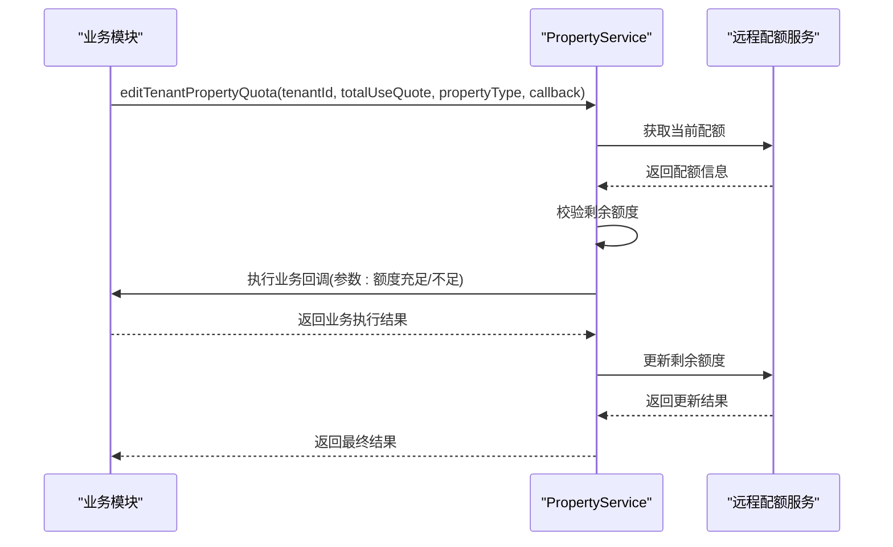

**图表来源**
- [PropertyService.java:30-49](file://src/main/java/com/jiuyu/governance/openfeign/replay/PropertyService.java#L30-L49)
- [PropertyServiceImpl.java:66-133](file://src/main/java/com/jiuyu/governance/openfeign/replay/impl/PropertyServiceImpl.java#L66-L133)

**章节来源**
- [PropertyService.java:17-50](file://src/main/java/com/jiuyu/governance/openfeign/replay/PropertyService.java#L17-L50)
- [PropertyServiceImpl.java:28-135](file://src/main/java/com/jiuyu/governance/openfeign/replay/impl/PropertyServiceImpl.java#L28-L135)
- [TenantPropertyQuotaResponse.java:14-451](file://src/main/java/com/jiuyu/governance/openfeign/replay/response/TenantPropertyQuotaResponse.java#L14-L451)
- [PropertyType.java:15-30](file://src/main/java/com/jiuyu/governance/openfeign/replay/consts/PropertyType.java#L15-L30)
- [TenantPropertyQuotaEditRequest.java:16-35](file://src/main/java/com/jiuyu/governance/openfeign/replay/request/TenantPropertyQuotaEditRequest.java#L16-L35)

## 依赖分析
- 模块内聚与耦合
  - org：以 SubCompanyServiceImpl 为核心，围绕公司实体提供 CRUD、选项、名称映射与依赖校验，**新增**：集成 PropertyService 进行子公司数量配额管理，**新增**：集成 ManagerConnectorProcessor 进行Redis缓存管理。
  - rbac：EmployeeServiceImpl 与 org、role、menu 等模块强耦合，承担大量跨模块数据装配与外部服务交互，**新增**：集成 PropertyService 进行员工数量配额管理，**新增**：集成 UserAccountService 进行子账号同步，**新增**：集成 ManagerConnectorProcessor 进行Redis缓存管理，**新增**：pageQueryEmployee方法支持复杂的过滤组合查询。
  - performance：EmployeePerformanceServiceImpl 依赖 org 与 room 的名称映射，Mapper 负责复杂聚合查询，**新增**：集成 ManagerConnectorProcessor 进行Redis缓存管理。
  - room：LiveRoomServiceImpl 依赖 org 与 openfeign 平台服务，负责直播间与组织/负责人的关系维护，**新增**：集成 ManagerConnectorProcessor 进行Redis缓存管理。
  - **新增**：PropertyService 作为独立的服务模块，被各业务模块调用，提供统一的配额管理能力。
  - **新增**：ManagerConnectorProcessor 作为缓存管理核心，被所有涉及数据权限的模块调用。
- 外部依赖
  - 第三方直播平台开放能力（如抖音主播信息）
  - 录制账号服务（绑定/解绑/更新手机号）
  - **新增**：远程配额服务（用于获取和更新租户资产配额）
  - **新增**：Redis缓存服务（用于分布式缓存管理）
- 循环依赖
  - 代码层面未见循环依赖；服务间通过接口调用，避免直接互相引用。

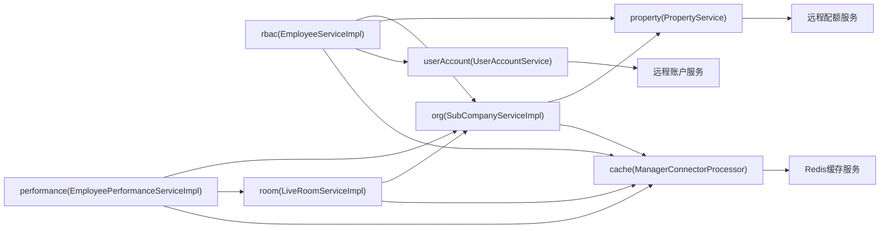

**图表来源**
- [EmployeeServiceImpl.java:60-1080](file://src/main/java/com/jiuyu/governance/business/rbac/service/impl/EmployeeServiceImpl.java#L60-L1080)
- [EmployeePerformanceServiceImpl.java:58-409](file://src/main/java/com/jiuyu/governance/business/performance/service/impl/EmployeePerformanceServiceImpl.java#L58-L409)
- [LiveRoomServiceImpl.java:59-530](file://src/main/java/com/jiuyu/governance/business/room/service/impl/LiveRoomServiceImpl.java#L59-L530)
- [SubCompanyServiceImpl.java:50-307](file://src/main/java/com/jiuyu/governance/business/org/service/impl/SubCompanyServiceImpl.java#L50-L307)
- [PropertyServiceImpl.java:28-135](file://src/main/java/com/jiuyu/governance/openfeign/replay/impl/PropertyServiceImpl.java#L28-L135)
- [ManagerConnectorProcessor.java:1-694](file://src/main/java/com/jiuyu/governance/business/org/service/impl/ManagerConnectorProcessor.java#L1-L694)
- [UserAccountService.java:1-113](file://src/main/java/com/jiuyu/governance/openfeign/replay/UserAccountService.java#L1-L113)

**章节来源**
- [EmployeeServiceImpl.java:60-1080](file://src/main/java/com/jiuyu/governance/business/rbac/service/impl/EmployeeServiceImpl.java#L60-L1080)
- [EmployeePerformanceServiceImpl.java:58-409](file://src/main/java/com/jiuyu/governance/business/performance/service/impl/EmployeePerformanceServiceImpl.java#L58-L409)
- [LiveRoomServiceImpl.java:59-530](file://src/main/java/com/jiuyu/governance/business/room/service/impl/LiveRoomServiceImpl.java#L59-L530)
- [SubCompanyServiceImpl.java:50-307](file://src/main/java/com/jiuyu/governance/business/org/service/impl/SubCompanyServiceImpl.java#L50-L307)
- [PropertyServiceImpl.java:28-135](file://src/main/java/com/jiuyu/governance/openfeign/replay/impl/PropertyServiceImpl.java#L28-L135)
- [ManagerConnectorProcessor.java:1-694](file://src/main/java/com/jiuyu/governance/business/org/service/impl/ManagerConnectorProcessor.java#L1-L694)
- [UserAccountService.java:1-113](file://src/main/java/com/jiuyu/governance/openfeign/replay/UserAccountService.java#L1-L113)

## 性能考虑
- 分页与批量装配
  - 使用自定义分页工具与批量名称映射，减少 N+1 查询，提升分页查询效率。
- 聚合查询
  - performance 模块通过 Mapper 聚合查询与内存分组，降低多次往返数据库的成本。
- 缓存与清理
  - 在组织/房间/负责人关系变更后，主动清理缓存，保证数据一致性与查询性能。
  - **新增**：Redis缓存机制显著提升数据权限查询性能，支持高并发场景。
  - **新增**：不同类型的缓存具有不同的过期时间，优化存储空间和查询性能。
- 外部服务
  - 对第三方平台开放服务调用进行必要校验与失败兜底，避免阻塞主流程。
- **新增**：配额管理的性能优化
  - 使用 ResourceLock 防止频繁操作导致的并发问题。
  - 通过模板方法模式减少重复代码，提高配额校验的效率。
  - 远程调用采用统一的响应类型引用，减少类型转换开销。
- **新增**：复杂查询的性能优化
  - pageQueryEmployee方法支持多维过滤，通过EmployeeMapper.xml的动态SQL实现高效查询。
  - EmployeeOptionSearchRequest提供灵活的搜索参数，支持职位编码列表转换和数据权限过滤。
- **新增**：子账号同步的性能优化
  - 使用批量操作减少数据库往返次数。
  - 通过差异处理避免不必要的更新操作。
  - 使用Redis缓存减少重复查询。

## 故障排查指南
- 员工管理
  - 手机号/工号重复：检查唯一性约束与租户内占用。
  - 录制账号异常：核对外部服务返回与本地状态一致性。
  - 状态变更失败：确认当前状态与目标状态、权限校验。
  - **新增**：员工配额不足：检查员工数量配额是否充足，确认远程配额服务是否正常。
  - **新增**：pageQueryEmployee查询异常：检查过滤参数的有效性，确认数据权限配置。
  - **新增**：search方法过滤失败：检查职位编码列表的有效性，确认数据权限过滤逻辑。
  - **新增**：子账号同步失败：检查外部账户服务连接，确认租户ID有效性，查看同步日志。
  - **新增**：Redis缓存异常：检查Redis连接状态，确认缓存键格式正确，查看缓存清理策略。
- 直播间管理
  - 新增失败：检查第三方主播信息获取、secUid 唯一性、负责人绑定。
  - 删除失败：确认逻辑删除与负责人解绑流程。
  - **新增**：子公司配额不足：检查子公司数量配额是否充足，确认最低数量要求。
  - **新增**：权限缓存异常：检查用户权限缓存是否正确更新，确认缓存清理时机。
- 业绩查询
  - 无数据：确认数据权限过滤条件、日期范围、直播间ID集合。
  - 名称缺失：检查 org/room 的名称映射是否为空或缓存未刷新。
  - **新增**：权限查询异常：检查数据权限缓存是否正确，确认用户权限连接。
- **新增**：配额管理故障
  - 远程服务调用失败：检查网络连接、服务可用性和认证信息。
  - 配额校验异常：确认资产类型枚举是否正确，配额计算逻辑是否符合预期。
  - 并发控制问题：检查 ResourceLock 是否正常工作，避免重复操作。
- **新增**：子账号同步故障
  - 外部服务调用失败：检查UserAccountService连接状态，确认租户ID有效性。
  - 数据同步异常：检查手机号冲突处理，确认子账户绑定关系。
  - 缓存清理失败：检查Redis连接，确认缓存键格式正确。
- **新增**：Redis缓存故障
  - 缓存连接失败：检查Redis服务器状态，确认连接配置正确。
  - 缓存数据异常：检查缓存键命名规则，确认数据序列化格式。
  - 缓存清理异常：检查缓存清理策略，确认清理时机正确。

**章节来源**
- [EmployeeServiceImpl.java:337-669](file://src/main/java/com/jiuyu/governance/business/rbac/service/impl/EmployeeServiceImpl.java#L337-L669)
- [EmployeeServiceImpl.java:537-750](file://src/main/java/com/jiuyu/governance/business/rbac/service/impl/EmployeeServiceImpl.java#L537-L750)
- [EmployeeServiceImpl.java:753-821](file://src/main/java/com/jiuyu/governance/business/rbac/service/impl/EmployeeServiceImpl.java#L753-L821)
- [LiveRoomServiceImpl.java:84-252](file://src/main/java/com/jiuyu/governance/business/room/service/impl/LiveRoomServiceImpl.java#L84-L252)
- [EmployeePerformanceServiceImpl.java:68-182](file://src/main/java/com/jiuyu/governance/business/performance/service/impl/EmployeePerformanceServiceImpl.java#L68-L182)
- [PropertyServiceImpl.java:66-133](file://src/main/java/com/jiuyu/governance/openfeign/replay/impl/PropertyServiceImpl.java#L66-L133)
- [ManagerConnectorProcessor.java:544-596](file://src/main/java/com/jiuyu/governance/business/org/service/impl/ManagerConnectorProcessor.java#L544-L596)

## 结论
四大模块在 fupan-governance-server 中形成"组织—人员—房间—业绩"的闭环：org 提供组织基座，rbac 确保人员与权限合规，room 提供直播资产与排班依据，performance 将人员与房间的运营数据沉淀为可洞察的业绩视图。**新增的资产配额管理系统**为整个平台提供了统一的资源限额控制能力，通过 PropertyService 为各业务模块提供配额校验和更新服务，确保租户资源使用的合规性和安全性。**新增的子账号同步功能**实现了多系统间的数据一致性，通过 UserAccountService 与本地员工系统的双向同步，减少了手动维护成本。**新增的Redis缓存机制**通过 ManagerConnectorProcessor 提供了强大的缓存管理能力，显著提升了数据权限查询性能，支持高并发场景。**新增的复杂查询功能**进一步增强了员工管理的灵活性，通过pageQueryEmployee方法支持多维过滤组合，满足复杂的业务场景需求。模块化设计使职责清晰、扩展性强，可通过接口替换与Mapper扩展满足不同业务场景的定制化需求。

## 附录
- 关键实体关系（简化）
  - org：SubCompany（公司）与 Dept/Team/Position 通过外键关联。
  - rbac：Employee 与 Org 实体关联，UserRole 与 Role/Menu 关联。
  - room：LiveRoom 与 Org 实体关联，LiveRoomScheduleAttribute 与 LiveRoom 关联。
  - performance：SchedulePerformance 聚合直播间的场观、销售额、ROI 等指标。
  - **新增**：PropertyService 与各业务模块关联，提供配额管理服务。
  - **新增**：UserAccountService 与 EmployeeServiceImpl 关联，提供子账号同步服务。
  - **新增**：ManagerConnectorProcessor 与各业务模块关联，提供Redis缓存服务。
  - **新增**：EmployeeQueryRequest和EmployeeOptionSearchRequest提供丰富的查询参数。

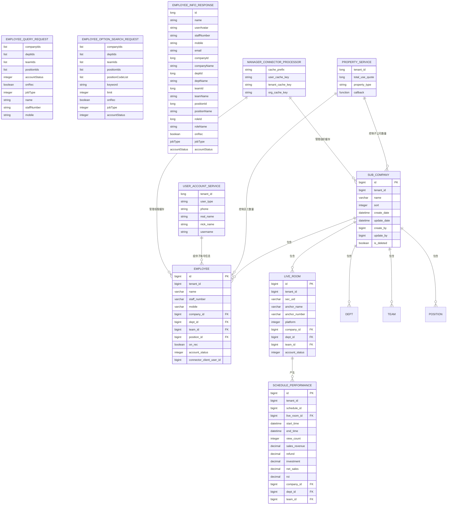

**图表来源**
- [SubCompany.java:20-85](file://src/main/java/com/jiuyu/governance/business/org/pojo/entity/SubCompany.java#L20-L85)
- [Employee.java:24-171](file://src/main/java/com/jiuyu/governance/business/rbac/pojo/entity/Employee.java#L24-L171)
- [LiveRoom.java:21-168](file://src/main/java/com/jiuyu/governance/business/room/pojo/entity/LiveRoom.java#L21-L168)
- [SchedulePerformance.java:18-160](file://src/main/java/com/jiuyu/governance/business/performance/pojo/entity/SchedulePerformance.java#L18-L160)
- [EmployeeQueryRequest.java:21-248](file://src/main/java/com/jiuyu/governance/business/rbac/pojo/request/EmployeeQueryRequest.java#L21-L248)
- [EmployeeOptionSearchRequest.java:19-208](file://src/main/java/com/jiuyu/governance/business/rbac/pojo/request/EmployeeOptionSearchRequest.java#L19-L208)
- [EmployeeInfoResponse.java:15-122](file://src/main/java/com/jiuyu/governance/business/rbac/pojo/response/EmployeeInfoResponse.java#L15-L122)
- [PropertyService.java:17-50](file://src/main/java/com/jiuyu/governance/openfeign/replay/PropertyService.java#L17-L50)
- [UserAccountService.java:1-113](file://src/main/java/com/jiuyu/governance/openfeign/replay/UserAccountService.java#L1-L113)
- [ManagerConnectorProcessor.java:1-694](file://src/main/java/com/jiuyu/governance/business/org/service/impl/ManagerConnectorProcessor.java#L1-L694)