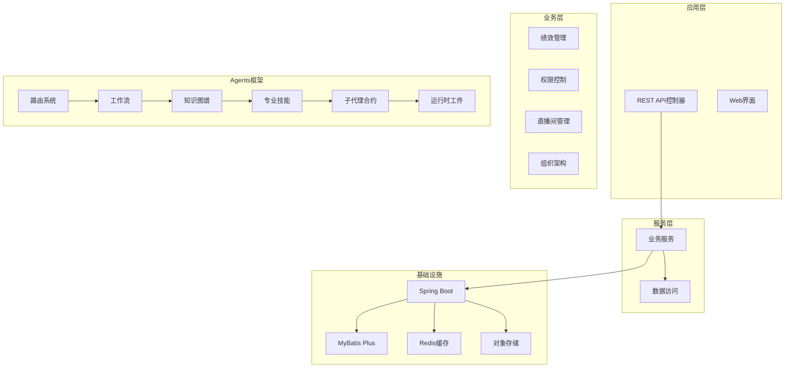
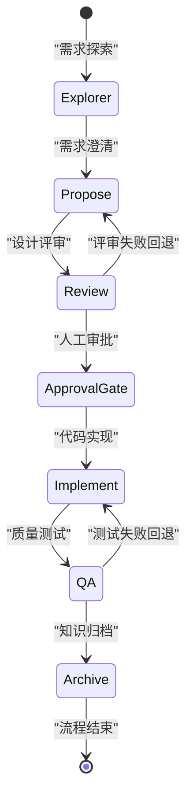
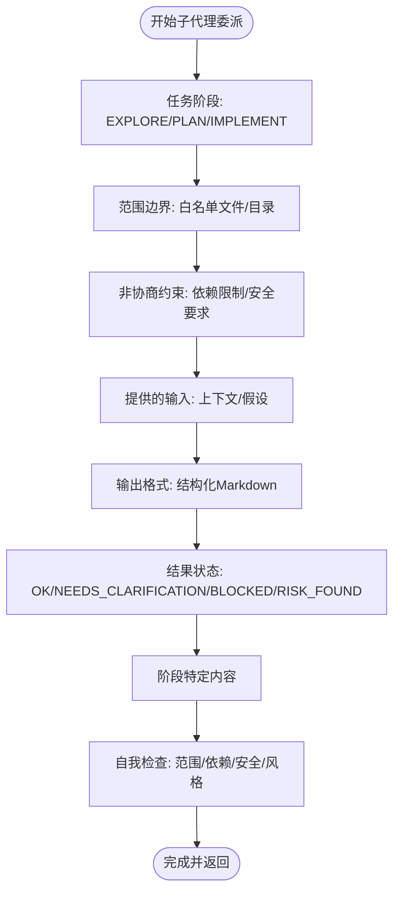
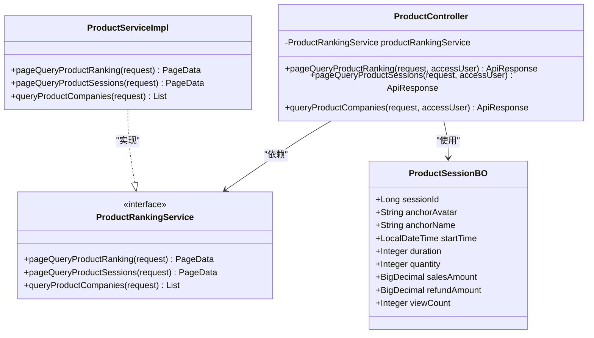
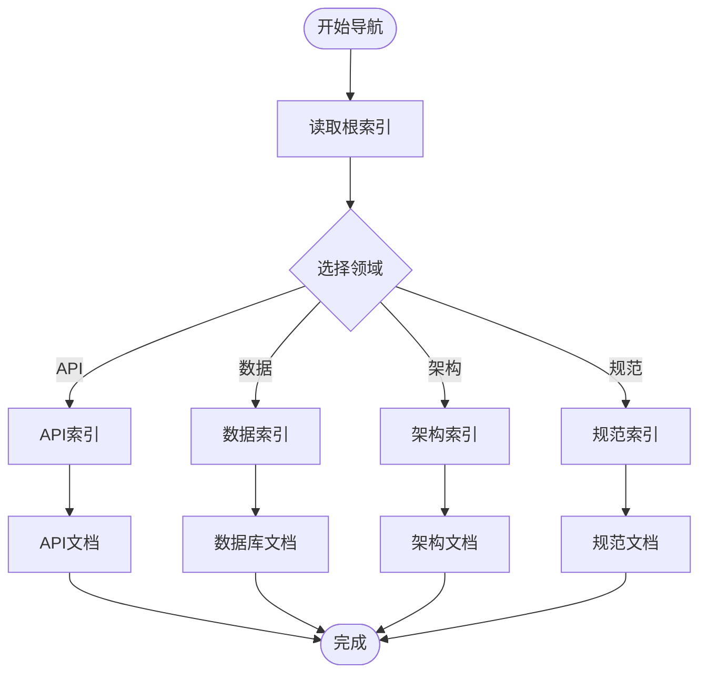
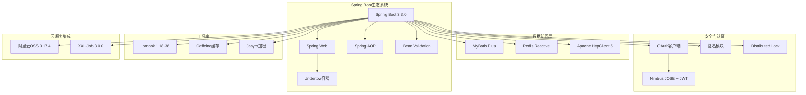

# Agents框架

<cite>
**本文档引用的文件**
- [AGENTS.md](file://AGENTS.md)
- [ROUTER.md](file://.agents/router/ROUTER.md)
- [CONTEXT_FUNNEL.md](file://.agents/router/CONTEXT_FUNNEL.md)
- [LIFECYCLE.md](file://.agents/workflow/LIFECYCLE.md)
- [HOOKS.md](file://.agents/workflow/HOOKS.md)
- [subagent_contract_schema.md](file://.agents/llm_wiki/schema/subagent_contract_schema.md)
- [index.md](file://.agents/llm_wiki/schema/index.md)
- [ServerApplication.java](file://src/main/java/com/jiuyu/governance/ServerApplication.java)
- [pom.xml](file://pom.xml)
- [ProductController.java](file://src/main/java/com/jiuyu/governance/business/performance/controller/ProductController.java)
- [ProductServiceImpl.java](file://src/main/java/com/jiuyu/governance/business/performance/service/impl/ProductServiceImpl.java)
- [ProductSessionBO.java](file://src/main/java/com/jiuyu/governance/business/performance/pojo/bo/ProductSessionBO.java)
</cite>

## 更新摘要
**所做更改**
- 新增子代理合约模式章节，详细介绍强制性的代理契约Envelope
- 更新路由系统说明，增加子代理调度的标准化流程
- 完善工作流引擎描述，强化微任务委派和质量控制机制
- 增强钩子拦截器说明，突出子代理约束和范围边界控制
- 更新工作流路径标准化，规范.artifacts/workflow/runs/目录结构

## 目录
1. [简介](#简介)
2. [项目结构](#项目结构)
3. [核心组件](#核心组件)
4. [架构概览](#架构概览)
5. [详细组件分析](#详细组件分析)
6. [依赖分析](#依赖分析)
7. [性能考虑](#性能考虑)
8. [故障排除指南](#故障排除指南)
9. [结论](#结论)

## 简介

Agents框架是一个基于Spring Boot的企业级治理系统，采用AI驱动的智能代理架构来管理代码开发流程。该框架通过意图路由、生命周期管理和钩子机制，实现了从需求分析到代码实现的完整自动化流程。

**最新更新** 新增子代理合约模式，建立标准化的AI代理工作流程，定义强制性的代理契约Envelope，包括任务阶段、范围边界、约束条件和输出格式。工作流路径已标准化至.artifacts/workflow/runs/目录，确保运行时工件的一致性和可追溯性。

系统的核心特点包括：
- **多层路由机制**：支持显式快捷方式和自动路由两种模式
- **生命周期管理**：完整的六阶段开发流程，包含审批门禁
- **知识图谱导航**：基于Wiki的知识管理体系
- **钩子拦截器**：严格的规范守卫和质量控制
- **子代理合约模式**：标准化的微任务委派和质量保证机制
- **工作流路径标准化**：统一的运行时工件管理

## 项目结构

项目采用分层架构设计，主要分为以下几个层次：



**图表来源**
- [ServerApplication.java:1-19](file://src/main/java/com/jiuyu/governance/ServerApplication.java#L1-L19)
- [pom.xml:1-226](file://pom.xml#L1-L226)
- [subagent_contract_schema.md:1-81](file://.agents/llm_wiki/schema/subagent_contract_schema.md#L1-L81)

**章节来源**
- [ServerApplication.java:1-19](file://src/main/java/com/jiuyu/governance/ServerApplication.java#L1-L19)
- [pom.xml:1-226](file://pom.xml#L1-L226)

## 核心组件

### 路由系统（Router）

路由系统是Agents框架的入口点，负责将用户意图转换为具体的操作流程。

#### 快捷方式DSL
- `@learn/@learn`：强制学习模式（只读）
- `@patch/@quickfix`：强制补丁模式（小变更/缺陷修复）
- `@standard`：强制标准模式（完整交付生命周期）

#### 执行模式
- **LEARN模式**：只读解释，无生命周期
- **PATCH模式**：小变更/缺陷修复，最少工件
- **STANDARD模式**：完整交付生命周期

**章节来源**
- [ROUTER.md:14-62](file://.agents/router/ROUTER.md#L14-L62)
- [ROUTER.md:72-92](file://.agents/router/ROUTER.md#L72-L92)

### 工作流引擎（Workflow）

工作流引擎定义了完整的开发生命周期，包含六个阶段：



**图表来源**
- [LIFECYCLE.md:11-77](file://.agents/workflow/LIFECYCLE.md#L11-L77)

**章节来源**
- [LIFECYCLE.md:1-77](file://.agents/workflow/LIFECYCLE.md#L1-L77)

### 钩子拦截器（Hooks）

钩子系统提供了严格的质量控制和规范守卫：

#### 预处理钩子（pre_hook）
- 加载后端开发标准
- 装载特定规则集

#### 守卫钩子（guard_hook）
- Checkstyle规范检查
- Java Javadoc标准
- 数据权限过滤

#### 失败钩子（fail_hook）
- 最大重试次数：3次
- 自动状态降级
- 失败原因记录

**章节来源**
- [HOOKS.md:12-64](file://.agents/workflow/HOOKS.md#L12-L64)

### 子代理合约模式（Sub-Agent Contracts）

**新增功能** 子代理合约模式是Agents框架的核心创新，建立了标准化的AI代理工作流程。

#### 强制性代理契约Envelope

每当主代理委派任务给子代理时，必须使用以下Envelope格式：



**图表来源**
- [subagent_contract_schema.md:9-48](file://.agents/llm_wiki/schema/subagent_contract_schema.md#L9-L48)

#### 阶段特定附录

根据任务阶段，主代理必须在Envelope指令的`## Details`部分追加相应的块：

##### A. EXPLORE/SEARCH阶段
- 搜索发现：相关文件/符号列表
- 上下文总结：发现如何与目标相关联的简要说明

##### B. PLAN阶段  
- 提议方法：描述实现计划
- 将要修改的文件：确切的文件列表
- 权衡：优缺点分析

##### C. IMPLEMENT阶段
- 文件变更：路径和意图
- 补丁：完整的文件内容或最小差异
- 边界情况：2-4个要点考虑

**章节来源**
- [subagent_contract_schema.md:50-81](file://.agents/llm_wiki/schema/subagent_contract_schema.md#L50-L81)

### 工作流路径标准化

**更新** 工作流路径已标准化至.artifacts/workflow/runs/目录，确保运行时工件的一致性和可追溯性。

#### 路径规范
- **运行时工件目录**：.artifacts/workflow/runs/
- **规格文件**：openspec.md
- **焦点卡片**：focus_card.md
- **任务跟踪**：current_task.md
- **启动规范**：router/runs/launch_spec_*.md

#### 工件管理
- 所有运行时生成的工件必须位于.artifacts/workflow/runs/目录
- 归档后的规格文件移动到.llm_wiki/archive/目录
- 事件驱动的漂移队列：.events/drift_queue/

**章节来源**
- [AGENTS.md:17-18](file://AGENTS.md#L17-L18)
- [ROUTER.md:185-189](file://.agents/router/ROUTER.md#L185-L189)

## 架构概览

Agents框架采用分层架构，结合AI代理技术和传统企业级应用架构：

```mermaid
graph TB
subgraph "用户交互层"
User[用户]
Chat[聊天界面]
CLI[命令行接口]
end
subgraph "AI代理层"
Agent[智能代理]
Router[路由引擎]
Planner[规划器]
Executor[执行器]
Contracts[子代理合约]
Artifacts[运行时工件]
end
subgraph "知识管理层"
Wiki[知识图谱]
Docs[文档系统]
Archive[归档系统]
Schema[合约模板]
End
subgraph "业务应用层"
Controllers[控制器]
Services[服务层]
DAO[数据访问]
Database[(数据库)]
end
subgraph "基础设施层"
Spring[Spring Boot]
Cache[缓存]
MQ[消息队列]
Storage[存储]
end
User --> Chat
Chat --> Agent
CLI --> Agent
Agent --> Router
Router --> Planner
Planner --> Executor
Executor --> Contracts
Contracts --> Artifacts
Artifacts --> Wiki
Executor --> Controllers
Controllers --> Services
Services --> DAO
DAO --> Database
Wiki --> Docs
Wiki --> Archive
Schema --> Contracts
Spring --> Cache
Spring --> MQ
Spring --> Storage
```

**图表来源**
- [ROUTER.md:1-165](file://.agents/router/ROUTER.md#L1-L165)
- [LIFECYCLE.md:1-77](file://.agents/workflow/LIFECYCLE.md#L1-L77)
- [subagent_contract_schema.md:1-81](file://.agents/llm_wiki/schema/subagent_contract_schema.md#L1-L81)

## 详细组件分析

### 商品绩效控制器（ProductController）

商品绩效控制器是业务层的核心组件，提供商品维度的业绩统计功能：



**图表来源**
- [ProductController.java:1-93](file://src/main/java/com/jiuyu/governance/business/performance/controller/ProductController.java#L1-L93)
- [ProductServiceImpl.java:1-18](file://src/main/java/com/jiuyu/governance/business/performance/service/impl/ProductServiceImpl.java#L1-L18)
- [ProductSessionBO.java:1-71](file://src/main/java/com/jiuyu/governance/business/performance/pojo/bo/ProductSessionBO.java#L1-L71)

#### 核心功能特性

1. **商品排行分页查询**
   - 支持时间范围筛选
   - 组织层级筛选
   - 多字段排序支持

2. **直播场次关联查询**
   - 弹窗展示功能
   - 主播信息展示
   - 销售数据统计

3. **分公司关联查询**
   - 关联公司列表
   - 汇总数据分析
   - 多字段排序

**章节来源**
- [ProductController.java:24-93](file://src/main/java/com/jiuyu/governance/business/performance/controller/ProductController.java#L24-L93)

### 知识图谱导航系统

知识图谱系统提供了完整的文档导航和写回机制：



**图表来源**
- [index.md:10-23](file://.agents/llm_wiki/schema/index.md#L10-L23)
- [CONTEXT_FUNNEL.md:15-27](file://.agents/router/CONTEXT_FUNNEL.md#L15-L27)

**章节来源**
- [index.md:1-23](file://.agents/llm_wiki/schema/index.md#L1-L23)
- [CONTEXT_FUNNEL.md:1-41](file://.agents/router/CONTEXT_FUNNEL.md#L1-L41)

## 依赖分析

系统采用现代化的企业级技术栈，主要依赖关系如下：



**图表来源**
- [pom.xml:35-167](file://pom.xml#L35-L167)

**章节来源**
- [pom.xml:18-167](file://pom.xml#L18-L167)

## 性能考虑

### 缓存策略
- **Caffeine本地缓存**：用于热点数据缓存
- **Redis分布式缓存**：用于会话和共享数据
- **HTTP客户端连接池**：优化外部服务调用

### 并发控制
- **分布式锁**：防止竞态条件
- **线程池配置**：合理配置异步任务
- **连接池管理**：数据库和HTTP连接池

### 监控与追踪
- **SkyWalking Agent**：全链路性能监控
- **日志聚合**：统一的日志管理
- **指标收集**：关键业务指标监控

## 故障排除指南

### 常见问题诊断

#### 启动问题
1. **端口冲突**：检查8080端口占用情况
2. **依赖缺失**：确认所有Maven依赖正确下载
3. **JDK版本**：确保使用Java 17+

#### 运行时错误
1. **数据库连接**：检查数据库配置和连接状态
2. **缓存异常**：验证Redis连接和配置
3. **权限问题**：检查OAuth配置和令牌有效性

#### 性能问题
1. **内存溢出**：检查JVM参数配置
2. **连接超时**：优化连接池设置
3. **慢查询**：分析数据库查询性能

#### 工作流路径问题
1. **工件路径错误**：确认所有工件生成在.artifacts/workflow/runs/目录
2. **归档路径问题**：检查规格文件是否正确移动到.llm_wiki/archive/目录
3. **事件队列异常**：验证.drift_queue/目录中的事件处理

**章节来源**
- [HOOKS.md:56-64](file://.agents/workflow/HOOKS.md#L56-L64)

## 结论

Agents框架代表了企业级应用开发的新范式，通过AI代理技术实现了开发流程的智能化和自动化。该框架的主要优势包括：

1. **标准化流程**：通过严格的生命周期管理确保代码质量
2. **知识管理**：基于Wiki的知识图谱系统促进知识传承
3. **质量保证**：多层次的钩子系统提供全面的质量控制
4. **可扩展性**：模块化的架构设计支持功能扩展
5. **子代理协作**：标准化的微任务委派机制提升开发效率
6. **工作流路径标准化**：统一的工件管理确保可追溯性和一致性

**最新增强** 新增的子代理合约模式进一步强化了框架的协作能力和质量控制，通过强制性的代理契约Envelope确保子代理在明确的范围边界内执行任务，防止上下文膨胀、范围漂移和幻觉问题。工作流路径标准化确保了所有运行时工件的统一管理，为后续的审计和追溯提供了坚实基础。

该框架适用于大型企业级应用开发，能够有效提升开发效率和代码质量，同时降低维护成本。通过持续的迭代和优化，Agents框架将继续为企业数字化转型提供强有力的技术支撑。