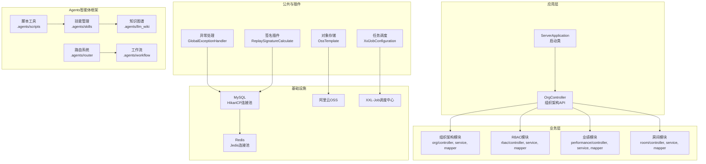
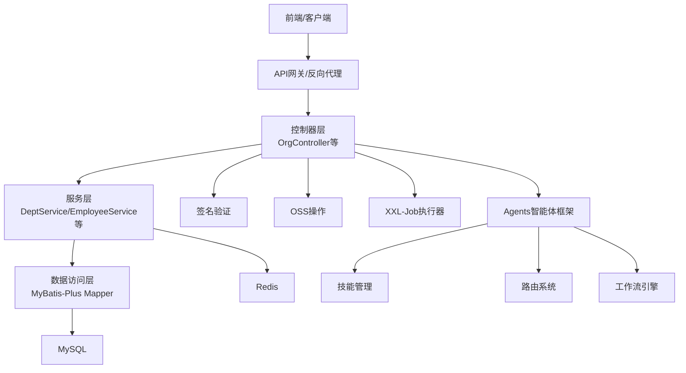
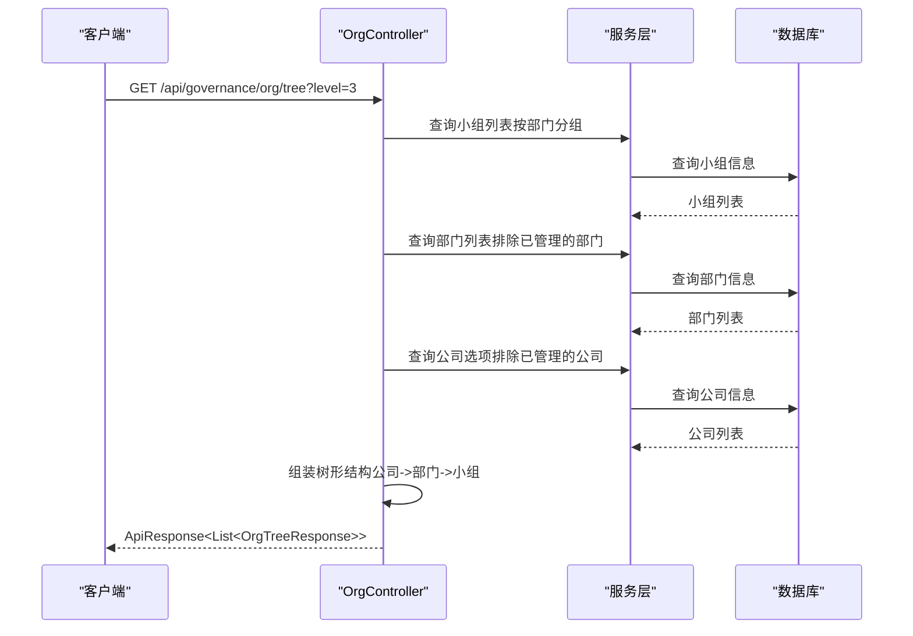
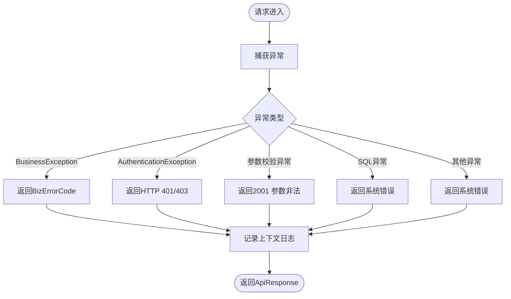
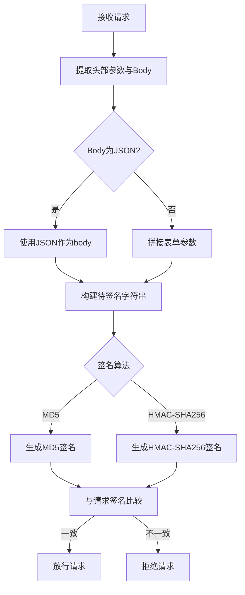
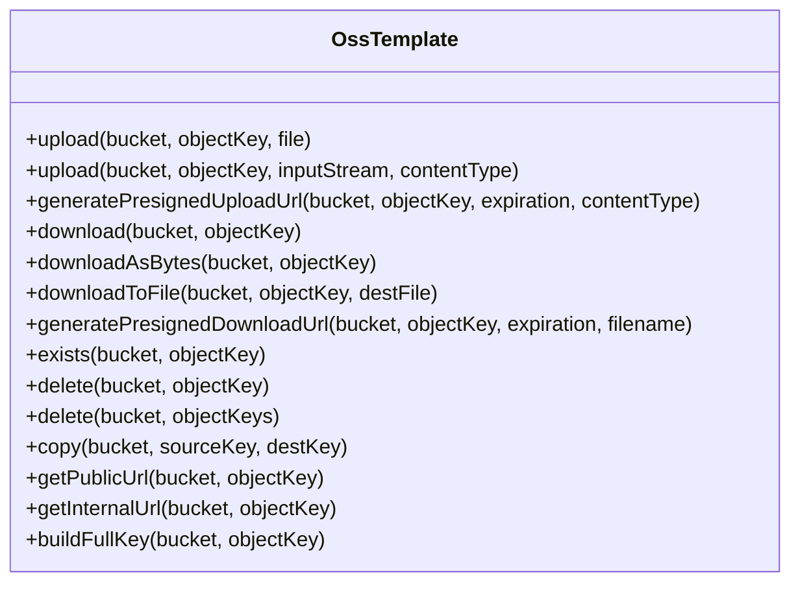
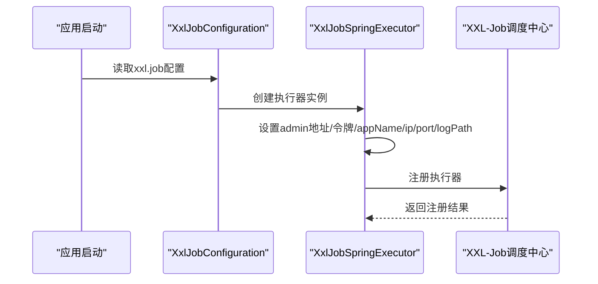
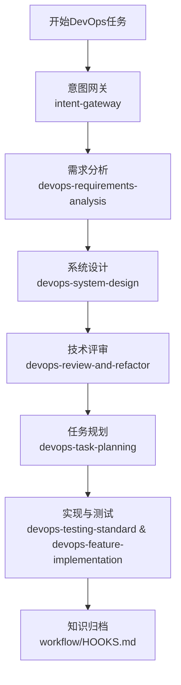
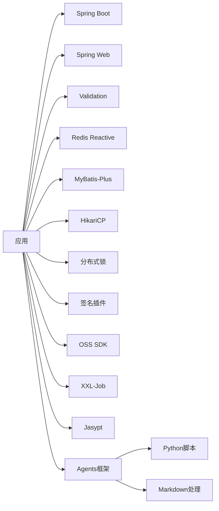

# DevOps技能文档

<cite>
**本文档引用的文件**
- [pom.xml](file://pom.xml)
- [ServerApplication.java](file://src/main/java/com/jiuyu/governance/ServerApplication.java)
- [application.yml](file://src/main/resources/application.yml)
- [AGENTS.md](file://AGENTS.md)
- [build_skill_index.py](file://.agents/scripts/build_skill_index.py)
- [devops-lifecycle-master SKILL.md](file://.agents/skills/devops-lifecycle-master/SKILL.md)
- [trae-skill-index SKILL.md](file://.agents/skills/trae-skill-index/SKILL.md)
- [skill-graph-manager SKILL.md](file://.agents/skills/skill-graph-manager/SKILL.md)
- [API数据字典.md](file://API_DATA_DICTIONARY.md)
- [错误码字典.md](file://ERROR_CODE_DICT.md)
- [OrgController.java](file://src/main/java/com/jiuyu/governance/business/org/controller/OrgController.java)
- [BusinessException.java](file://src/main/java/com/jiuyu/governance/common/exceptions/BusinessException.java)
- [GlobalExceptionHandler.java](file://src/main/java/com/jiuyu/governance/plugins/webmvc/GlobalExceptionHandler.java)
- [ReplaySignatureCalculate.java](file://src/main/java/com/jiuyu/governance/plugins/sign/ReplaySignatureCalculate.java)
- [OssTemplate.java](file://src/main/java/com/jiuyu/governance/plugins/oss/core/OssTemplate.java)
- [XxlJobConfiguration.java](file://src/main/java/com/jiuyu/governance/plugins/xxljob/XxlJobConfiguration.java)
- [performance_tables.sql](file://src/main/resources/sql/performance_tables.sql)
</cite>

## 更新摘要
**所做更改**
- 新增Agents框架相关内容章节，介绍智能体技能管理系统
- 添加DevOps生命周期管理技能文档
- 新增技能图谱管理机制说明
- 更新项目结构图以包含Agents框架目录
- 新增技能索引构建脚本说明

## 目录
1. [简介](#简介)
2. [项目结构](#项目结构)
3. [核心组件](#核心组件)
4. [架构概览](#架构概览)
5. [详细组件分析](#详细组件分析)
6. [Agents智能体框架](#agents智能体框架)
7. [依赖分析](#依赖分析)
8. [性能考虑](#性能考虑)
9. [故障排查指南](#故障排查指南)
10. [结论](#结论)
11. [附录](#附录)

## 简介
本项目是一个基于Spring Boot的企业治理服务，提供组织架构管理（公司、部门、小组）、RBAC权限管理（员工、角色、菜单）、直播与业绩数据处理、分布式任务调度、文件存储与签名验证等能力。文档面向DevOps工程师，重点阐述系统架构、部署要点、监控与运维实践以及常见问题排查方法。

**更新** 新增Agents智能体框架相关内容，该框架提供完整的DevOps技能管理系统，包括技能知识图谱、生命周期管理和自动化工作流。

## 项目结构
项目采用标准的Maven多模块结构，核心模块包括：
- 业务模块：组织架构、RBAC、直播与业绩
- 公共模块：异常处理、工具类、插件扩展
- 资源配置：数据库连接、Redis、签名、xxl-job等
- 测试与接口文档：API数据字典、错误码字典、HTTP测试脚本
- **新增** Agents智能体框架：技能管理系统、工作流引擎、知识图谱

**图表来源**
- [ServerApplication.java:1-19](file://src/main/java/com/jiuyu/governance/ServerApplication.java#L1-L19)
- [OrgController.java:1-147](file://src/main/java/com/jiuyu/governance/business/org/controller/OrgController.java#L1-L147)
- [AGENTS.md:1-19](file://AGENTS.md#L1-L19)
- [devops-lifecycle-master SKILL.md:1-70](file://.agents/skills/devops-lifecycle-master/SKILL.md#L1-L70)

**章节来源**
- [pom.xml:1-226](file://pom.xml#L1-L226)
- [application.yml:1-148](file://src/main/resources/application.yml#L1-L148)
- [AGENTS.md:1-19](file://AGENTS.md#L1-L19)

## 核心组件
- 启动类：负责应用引导与容器启动
- 控制器：提供组织架构树、RBAC权限、业绩统计等API
- 异常处理：统一捕获业务异常与系统异常，标准化返回格式
- 签名插件：提供请求签名验证，保障接口安全
- 对象存储：封装OSS上传、下载、预签名链接生成等能力
- 任务调度：集成XXL-Job，支持分布式任务执行
- 数据库与缓存：MyBatis-Plus + HikariCP + Redis
- **新增** Agents框架：技能管理系统、路由引擎、工作流管理、知识图谱

**章节来源**
- [ServerApplication.java:1-19](file://src/main/java/com/jiuyu/governance/ServerApplication.java#L1-L19)
- [OrgController.java:1-147](file://src/main/java/com/jiuyu/governance/business/org/controller/OrgController.java#L1-L147)
- [AGENTS.md:1-19](file://AGENTS.md#L1-L19)

## 架构概览
系统采用分层架构：
- 表现层：RESTful API控制器
- 业务层：服务接口与实现，数据权限过滤
- 数据访问层：MyBatis-Plus Mapper与XML映射
- 基础设施：MySQL、Redis、OSS、XXL-Job
- **新增** 智能体层：Agents框架提供智能化的DevOps工作流管理

**图表来源**
- [OrgController.java:1-147](file://src/main/java/com/jiuyu/governance/business/org/controller/OrgController.java#L1-L147)
- [application.yml:42-148](file://src/main/resources/application.yml#L42-L148)
- [AGENTS.md:1-19](file://AGENTS.md#L1-L19)

## 详细组件分析

### 组织架构树接口（OrgController）
- 功能：按层级构建公司-部门-小组树形结构，支持数据权限过滤
- 关键点：
  - 自动应用数据权限（AccessUser）
  - 支持按level参数控制返回层级
  - 对部门与小组按sort字段排序
  - 前端需处理children可能为null的情况

**图表来源**
- [OrgController.java:66-144](file://src/main/java/com/jiuyu/governance/business/org/controller/OrgController.java#L66-L144)

**章节来源**
- [OrgController.java:1-147](file://src/main/java/com/jiuyu/governance/business/org/controller/OrgController.java#L1-L147)

### 异常处理机制（GlobalExceptionHandler）
- 统一捕获业务异常与系统异常，返回标准化的ApiResponse
- 区分系统错误码与业务错误码，便于前端差异化处理
- 记录请求上下文（URI、参数、Body），便于定位问题

**图表来源**
- [GlobalExceptionHandler.java:94-374](file://src/main/java/com/jiuyu/governance/plugins/webmvc/GlobalExceptionHandler.java#L94-L374)

**章节来源**
- [GlobalExceptionHandler.java:1-377](file://src/main/java/com/jiuyu/governance/plugins/webmvc/GlobalExceptionHandler.java#L1-L377)
- [BusinessException.java:1-49](file://src/main/java/com/jiuyu/governance/common/exceptions/BusinessException.java#L1-L49)
- [ERROR_CODE_DICT.md:1-160](file://ERROR_CODE_DICT.md#L1-L160)

### 签名验证（ReplaySignatureCalculate）
- 支持MD5与HMAC-SHA256两种签名算法
- 自动构建待签名字符串，按ASCII排序
- 验证通过后才允许继续处理请求

**图表来源**
- [ReplaySignatureCalculate.java:49-163](file://src/main/java/com/jiuyu/governance/plugins/sign/ReplaySignatureCalculate.java#L49-L163)

**章节来源**
- [ReplaySignatureCalculate.java:1-199](file://src/main/java/com/jiuyu/governance/plugins/sign/ReplaySignatureCalculate.java#L1-L199)

### 对象存储（OssTemplate）
- 封装上传、下载、预签名链接生成、文件存在性检查、删除、复制等操作
- 自动处理路径前缀与内外网访问
- 统一异常处理，便于上层业务感知

**图表来源**
- [OssTemplate.java:1-358](file://src/main/java/com/jiuyu/governance/plugins/oss/core/OssTemplate.java#L1-L358)

**章节来源**
- [OssTemplate.java:1-358](file://src/main/java/com/jiuyu/governance/plugins/oss/core/OssTemplate.java#L1-L358)

### 任务调度（XxlJobConfiguration）
- 条件加载：根据配置开关启用
- 动态设置调度中心地址、访问令牌、应用名称、IP/端口、日志路径与保留天数
- 与XXL-Job调度中心通信，执行分布式任务

**图表来源**
- [XxlJobConfiguration.java:30-76](file://src/main/java/com/jiuyu/governance/plugins/xxljob/XxlJobConfiguration.java#L30-L76)

**章节来源**
- [XxlJobConfiguration.java:1-78](file://src/main/java/com/jiuyu/governance/plugins/xxljob/XxlJobConfiguration.java#L1-L78)
- [application.yml:124-148](file://src/main/resources/application.yml#L124-L148)

### 数据模型与表结构（业绩模块）
- 包含直播场次、视频片段、排班与场次分摊、人员业绩、每日统计、商品与商品关联、视频商品、场次业绩、原始值、排班业绩图片等表
- 主键策略：雪花ID或业务ID（如直播场次使用session_id）
- 逻辑删除：统一使用is_deleted字段
- 索引设计：针对tenant_id、维度组合、时间维度建立索引，支撑高效查询

```mermaid
erDiagram
LIVE_SESSION {
bigint id PK
bigint tenant_id
bigint live_room_id
varchar batch_number
datetime start_time
datetime end_time
int duration
int view_count
decimal sales_revenue
decimal refund
decimal investment
decimal net_sales
decimal roi
varchar oss_url
bigint company_id
bigint dept_id
bigint team_id
tinyint source
int version
datetime create_date
datetime update_date
bigint create_by
bigint update_by
tinyint is_deleted
}
LIVE_VIDEO {
bigint id PK
bigint tenant_id
varchar batch_number
varchar video_id
tinyint has_performance
varchar video_oss_url
datetime start_time
datetime end_time
int cumulative_view
decimal sales_revenue
decimal cumulative_refund
decimal investment
varchar sec_uid
tinyint process_status
datetime process_time
varchar fail_reason
datetime create_date
datetime update_date
tinyint is_deleted
}
SCHEDULE_SESSION {
bigint id PK
bigint tenant_id
bigint schedule_id
bigint session_id
int view_count
decimal sales_revenue
decimal refund
decimal investment
decimal net_sales
decimal roi
int duration
tinyint source
bigint company_id
bigint dept_id
bigint team_id
datetime create_date
datetime update_date
bigint create_by
bigint update_by
tinyint is_deleted
}
STAFF_PERFORMANCE {
bigint id PK
bigint tenant_id
bigint user_id
bigint schedule_id
date stats_date
int view_count
decimal sales_revenue
decimal refund
decimal investment
decimal net_sales
decimal roi
bigint company_id
bigint dept_id
bigint team_id
datetime create_date
datetime update_date
bigint create_by
bigint update_by
tinyint is_deleted
}
DAILY_STATS {
bigint id PK
bigint tenant_id
date stats_date
tinyint dimension
bigint company_id
bigint dept_id
bigint team_id
bigint room_id
int view_count
decimal sales_revenue
decimal refund
decimal investment
decimal net_sales
decimal roi
int session_count
int duration
datetime create_date
datetime update_date
bigint create_by
bigint update_by
tinyint is_deleted
}
PRODUCT {
bigint id PK
bigint tenant_id
varchar name
decimal price
datetime create_date
datetime update_date
bigint create_by
bigint update_by
tinyint is_deleted
}
SESSION_PRODUCT {
bigint id PK
bigint tenant_id
bigint session_id
bigint product_id
int quantity
decimal sales_amount
decimal exposure_click_rate
decimal exposure_conversion_rate
decimal gpm
int refund_quantity
decimal refund_amount
decimal refund_rate
decimal click_payment_rate
bigint company_id
bigint dept_id
bigint team_id
datetime create_date
datetime update_date
bigint create_by
bigint update_by
tinyint is_deleted
}
VIDEO_PRODUCT {
bigint id PK
bigint tenant_id
varchar video_id
varchar batch_number
varchar product_id
varchar title
varchar image_uri
decimal market_price
datetime product_bind_time
datetime product_down_time
int explain_cnt
bigint product_show_ucnt
bigint product_click_ucnt
decimal product_show_click_ucnt_ratio
decimal product_show_pay_ucnt_ratio
decimal product_click_pay_ucnt_ratio
decimal gpm
decimal pay_amt
decimal avg_max_pay_amt_min
bigint pay_combo_cnt
bigint pay_cnt
bigint create_cnt
decimal create_pay_ucnt_ratio
bigint pay_deposit_pre_order_cnt
decimal presale_depay_deamt
decimal pay_deposit_pre_order_amt
bigint refund_cnt
decimal real_refund_amt
decimal refund_rate
datetime create_date
datetime update_date
bigint create_by
bigint update_by
tinyint is_deleted
}
SESSION_PERFORMANCE {
bigint id PK
bigint tenant_id
bigint session_id
date stats_date
datetime start_time
datetime end_time
varchar sec_uid
tinyint source
int view_count
decimal sales_revenue
decimal refund
decimal investment
decimal net_sales
decimal roi
decimal ad_output
bigint live_room_id
bigint company_id
bigint dept_id
bigint team_id
datetime create_date
datetime update_date
bigint create_by
bigint update_by
tinyint is_deleted
}
SESSION_ORIGINAL_VALUE {
bigint id PK
bigint tenant_id
bigint session_id
int view_count
decimal sales_revenue
decimal refund
decimal investment
decimal net_sales
decimal roi
bigint create_by
datetime create_date
}
SCHEDULE_PERFORMANCE_IMAGE {
bigint id PK
bigint tenant_id
varchar view_count_image_url
varchar sales_revenue_image_url
varchar refund_image_url
varchar investment_image_url
varchar net_sales_image_url
varchar roi_image_url
datetime create_date
datetime update_date
bigint create_by
bigint update_by
tinyint is_deleted
}
```

**图表来源**
- [performance_tables.sql:7-311](file://src/main/resources/sql/performance_tables.sql#L7-L311)

**章节来源**
- [performance_tables.sql:1-311](file://src/main/resources/sql/performance_tables.sql#L1-L311)

## Agents智能体框架

### 框架概述
Agents智能体框架是一个基于技能的知识管理系统，提供完整的DevOps自动化工作流程。该框架包含技能管理、路由系统、工作流引擎和知识图谱等核心组件。

### 技能管理系统
框架的核心是技能管理系统，每个技能都是一个独立的功能模块，具有明确的职责和边界：

#### 技能分类架构
- **入口与路由**：intent-gateway（意图网关）
- **业务与产品**：product-manager-expert、prd-task-splitter
- **业务域**：business-org、business-rbac、business-room、business-schedule
- **DevOps生命周期**：devops-lifecycle-master、devops-requirements-analysis、devops-system-design、devops-task-planning、devops-testing-standard、devops-feature-implementation、devops-review-and-refactor、devops-bug-fix
- **Java后端规范**：global-backend-standards、java-engineering-standards、java-backend-api-standard、java-backend-guidelines、java-data-permissions、annotation-usage-standard、utils-usage-standard、error-code-standard、mybatis-sql-standard、java-javadoc-standard、checkstyle
- **工具与检查单**：code-review-checklist、api-documentation-rules、database-documentation-sync、linter-severity-standard、oss-module、support-name-map
- **元技能**：skill-graph-manager（技能图谱管理器）

#### DevOps生命周期管理
**devops-lifecycle-master** 是框架的核心协调技能，提供完整的DevOps自动化方法论：

**图表来源**
- [devops-lifecycle-master SKILL.md:18-70](file://.agents/skills/devops-lifecycle-master/SKILL.md#L18-L70)

#### 技能图谱管理
**skill-graph-manager** 是强制性的元技能，负责维护双向技能知识图谱：

- **双向链接**：确保技能之间的相互关联
- **技能索引维护**：自动更新中央索引文件
- **上下文联想**：支持大模型的技能关联推荐

#### 路由系统
Agents框架包含完整的路由系统，支持多种快捷方式：
- `@read` / `@learn`：只读学习模式
- `@patch` / `@quickfix`：小规模修改和缺陷修复
- `@standard`：完整交付生命周期

#### 工作流引擎
框架提供生命周期阶段和钩子机制：
- 生命周期阶段：从需求到评审的完整流程
- 钩子协议：标准化的工作流事件处理

#### 知识图谱
LLM知识图谱提供技能间的智能关联，支持自然语言驱动的技能发现和导航。

**章节来源**
- [AGENTS.md:1-19](file://AGENTS.md#L1-L19)
- [devops-lifecycle-master SKILL.md:1-70](file://.agents/skills/devops-lifecycle-master/SKILL.md#L1-L70)
- [trae-skill-index SKILL.md:1-65](file://.agents/skills/trae-skill-index/SKILL.md#L1-L65)
- [skill-graph-manager SKILL.md:1-52](file://.agents/skills/skill-graph-manager/SKILL.md#L1-L52)

### 技能索引构建
框架提供Python脚本自动构建技能索引：

**图表来源**
- [build_skill_index.py:1-30](file://.agents/scripts/build_skill_index.py#L1-L30)

**章节来源**
- [build_skill_index.py:1-30](file://.agents/scripts/build_skill_index.py#L1-L30)

## 依赖分析
- 核心框架：Spring Boot 3.3.0、Spring Web、Undertow、Validation、Redis Reactive
- ORM与连接池：MyBatis-Plus、HikariCP
- 安全与签名：OAuth客户端、签名插件、分布式锁
- 缓存：Caffeine + Redis
- 对象存储：阿里云OSS SDK
- 任务调度：XXL-Job
- 配置加密：Jasypt
- 工具库：Hutool、BrowserCap、Nimbus JOSE + JWT
- **新增** Agents框架：Python脚本工具、Markdown文档处理

**图表来源**
- [pom.xml:35-167](file://pom.xml#L35-L167)
- [AGENTS.md:1-19](file://AGENTS.md#L1-L19)

**章节来源**
- [pom.xml:1-226](file://pom.xml#L1-L226)
- [AGENTS.md:1-19](file://AGENTS.md#L1-L19)

## 性能考虑
- 连接池配置：HikariCP最小空闲、最大连接、连接超时、空闲超时、生命周期等参数需结合QPS与事务时长调优
- Redis连接池：最大活跃、最大等待、最大空闲、最小空闲、空闲回收间隔
- MyBatis-Plus：开启驼峰映射、二级缓存、默认批大小，合理使用分页与索引
- Undertow：高并发场景建议使用Undertow替代Tomcat
- 签名与OSS：签名计算与预签名URL生成应避免重复计算，必要时引入缓存
- 任务调度：XXL-Job执行器线程池与日志路径需合理配置，避免磁盘IO瓶颈
- **新增** Agents框架：技能索引构建脚本的性能优化，避免频繁扫描技能目录

## 故障排查指南
- 异常码对照：参考错误码字典，区分系统错误码（0-999）、通用类（1000-1999）、规则类（2000-2999）、业务类（3000-3999）、交互类（4000-4999）
- 日志定位：全局异常处理器会记录请求上下文（URI、参数、Body），优先查看对应异常码的错误日志
- 参数校验：前端统一拦截2001参数非法，后端可通过MethodArgumentNotValidException、BindException、ConstraintViolationException等捕获
- SQL异常：MyBatis持久化异常与数据完整性异常会映射为系统错误或通用错误，检查SQL与索引
- 签名失败：核对请求头（App-Id、Timestamp、Nonce、Fingerprint、Request-Id）与签名算法，确保时间戳未过期
- OSS异常：检查桶配置、路径前缀、网络访问（内网/外网）、预签名URL有效期
- 任务调度：确认XXL-Job调度中心地址、访问令牌、执行器注册状态与日志路径
- **新增** Agents框架：技能索引构建失败时检查技能目录结构和Frontmatter格式，验证Python环境配置

**章节来源**
- [ERROR_CODE_DICT.md:1-160](file://ERROR_CODE_DICT.md#L1-L160)
- [GlobalExceptionHandler.java:94-374](file://src/main/java/com/jiuyu/governance/plugins/webmvc/GlobalExceptionHandler.java#L94-L374)
- [ReplaySignatureCalculate.java:49-163](file://src/main/java/com/jiuyu/governance/plugins/sign/ReplaySignatureCalculate.java#L49-L163)
- [OssTemplate.java:47-121](file://src/main/java/com/jiuyu/governance/plugins/oss/core/OssTemplate.java#L47-L121)
- [XxlJobConfiguration.java:30-76](file://src/main/java/com/jiuyu/governance/plugins/xxljob/XxlJobConfiguration.java#L30-L76)
- [AGENTS.md:1-19](file://AGENTS.md#L1-L19)

## 结论
本项目提供了完善的企业治理服务能力，涵盖组织架构、权限管理、直播与业绩、文件存储与签名、分布式任务调度等关键领域。**新增的Agents智能体框架进一步增强了系统的自动化能力**，通过技能管理系统、DevOps生命周期管理和知识图谱实现了智能化的开发工作流。

DevOps团队应重点关注配置管理、连接池与缓存优化、异常与日志治理、安全签名与OSS访问控制、以及XXL-Job的调度与监控。**同时需要掌握Agents框架的技能管理方法**，包括技能创建、知识图谱维护和工作流自动化。通过合理的架构设计与运维实践，可确保系统在高并发与复杂业务场景下的稳定性与可扩展性。

## 附录
- API数据字典：包含组织架构与RBAC模块的接口定义与字段说明，便于前后端协作与接口测试
- 错误码字典：定义了四段式错误码体系与前端交互约定，便于统一错误处理与用户体验一致性
- **新增** Agents技能文档：提供完整的DevOps技能管理指南，包括技能创建、维护和使用的最佳实践

**章节来源**
- [API数据字典.md:1-415](file://API_DATA_DICTIONARY.md#L1-L415)
- [ERROR_CODE_DICT.md:1-160](file://ERROR_CODE_DICT.md#L1-L160)
- [AGENTS.md:1-19](file://AGENTS.md#L1-L19)