# 技能管理系统

<cite>
**本文档引用的文件**
- [ServerApplication.java](file://src/main/java/com/jiuyu/governance/ServerApplication.java)
- [pom.xml](file://pom.xml)
- [application.yml](file://src/main/resources/application.yml)
- [OrgController.java](file://src/main/java/com/jiuyu/governance/business/org/controller/OrgController.java)
- [DeptService.java](file://src/main/java/com/jiuyu/governance/business/org/service/DeptService.java)
- [SubCompanyService.java](file://src/main/java/com/jiuyu/governance/business/org/service/SubCompanyService.java)
- [TeamServiceImpl.java](file://src/main/java/com/jiuyu/governance/business/org/service/impl/TeamServiceImpl.java)
- [SubCompanyMapper.java](file://src/main/java/com/jiuyu/governance/business/org/mapper/SubCompanyMapper.java)
- [DeptServiceImpl.java](file://src/main/java/com/jiuyu/governance/business/org/service/impl/DeptServiceImpl.java)
- [TeamServiceTest.java](file://src/test/java/com/jiuyu/governance/business/org/service/TeamServiceTest.java)
- [SubCompanyServiceTest.java](file://src/test/java/com/jiuyu/governance/business/org/service/SubCompanyServiceTest.java)
- [DeptServiceTest.java](file://src/test/java/com/jiuyu/governance/business/org/service/DeptServiceTest.java)
- [AGENTS.md](file://AGENTS.md)
- [ROUTER.md](file://.agents/router/ROUTER.md)
- [CONTEXT_FUNNEL.md](file://.agents/router/CONTEXT_FUNNEL.md)
- [LIFECYCLE.md](file://.agents/workflow/LIFECYCLE.md)
- [intent-gateway SKILL.md](file://.agents/skills/intent-gateway/SKILL.md)
</cite>

## 更新摘要
**所做更改**
- 新增智能代理技能管理系统的整体架构说明
- 添加意图网关(intent-gateway)技能的详细文档
- 更新路由系统和生命周期管理的架构描述
- 新增LLM Wiki知识图谱和上下文漏斗机制
- 扩展技能管理系统的文档结构和导航体系

## 目录
1. [项目概述](#项目概述)
2. [项目结构](#项目结构)
3. [核心组件](#核心组件)
4. [架构概览](#架构概览)
5. [详细组件分析](#详细组件分析)
6. [智能代理技能系统](#智能代理技能系统)
7. [意图网关与路由机制](#意图网关与路由机制)
8. [生命周期管理](#生命周期管理)
9. [LLM Wiki知识管理](#llm-wiki知识管理)
10. [依赖关系分析](#依赖关系分析)
11. [性能考虑](#性能考虑)
12. [故障排除指南](#故障排除指南)
13. [结论](#结论)

## 项目概述

技能管理系统是一个基于Spring Boot的企业级治理平台，专注于组织架构管理和员工技能管理。该系统采用现代化的微服务架构设计，集成了RBAC权限控制、分布式锁、缓存机制等企业级特性。

**重要更新**：系统现已集成智能代理技能管理功能，采用.agents目录结构替代原有的.trae命名，提供完整的意图识别、路由决策和生命周期管理能力。

### 主要特性

- **三层架构设计**：采用经典的Controller-Service-Mapper分层架构
- **多租户支持**：支持企业级多租户环境下的数据隔离
- **权限控制**：集成RBAC权限模型，支持细粒度的访问控制
- **分布式能力**：内置分布式锁和缓存机制
- **数据持久化**：基于MyBatis-Plus的ORM框架
- **监控追踪**：集成SkyWalking分布式追踪
- **智能代理**：集成意图识别和自动化工作流管理
- **知识管理**：基于LLM Wiki的知识图谱和文档同步

## 项目结构

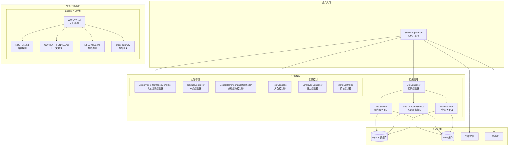

**图表来源**
- [ServerApplication.java:1-19](file://src/main/java/com/jiuyu/governance/ServerApplication.java#L1-L19)
- [OrgController.java:1-147](file://src/main/java/com/jiuyu/governance/business/org/controller/OrgController.java#L1-L147)
- [AGENTS.md:1-19](file://AGENTS.md#L1-L19)

**章节来源**
- [ServerApplication.java:1-19](file://src/main/java/com/jiuyu/governance/ServerApplication.java#L1-L19)
- [pom.xml:1-226](file://pom.xml#L1-L226)
- [AGENTS.md:1-19](file://AGENTS.md#L1-L19)

## 核心组件

### 应用启动类

应用采用Spring Boot自动配置，启动类位于`com.jiuyu.governance.ServerApplication`，使用Undertow作为Web服务器，提供更好的性能表现。

### 配置管理

系统采用YAML配置文件，支持多环境配置（dev、local、prod）。主要配置包括：

- **数据库连接**：HikariCP连接池配置
- **Redis缓存**：连接池和超时设置
- **MyBatis-Plus**：实体扫描和逻辑删除配置
- **签名验证**：API接口签名配置

### 依赖管理

项目使用Maven管理依赖，核心依赖包括：

- **Spring Boot Starter**：Web、AOP、Validation、Redis等
- **MyBatis-Plus**：增强的ORM框架
- **分布式组件**：OAuth客户端、签名验证、分布式锁
- **工具库**：Apache HttpClient、Caffeine缓存、Jasypt加密

**章节来源**
- [application.yml:1-148](file://src/main/resources/application.yml#L1-L148)
- [pom.xml:35-167](file://pom.xml#L35-L167)

## 架构概览

```mermaid
graph TB
subgraph "表现层"
API[RESTful API]
UI[前端界面]
end
subgraph "控制层"
ORG[组织控制器]
PERF[绩效控制器]
RBAC[权限控制器]
end
subgraph "服务层"
ORGSVC[组织服务层]
PERFSVC[绩效服务层]
RBACSVC[权限服务层]
end
subgraph "智能代理层"
INTENT[意图识别]
ROUTER[路由决策]
LIFECYCLE[生命周期管理]
WIKI[知识管理]
end
subgraph "数据访问层"
ORGMAPPER[组织Mapper]
PERFMAPPER[绩效Mapper]
RBACMAPPER[权限Mapper]
end
subgraph "数据存储"
MYSQL[MySQL数据库]
REDIS[Redis缓存]
end
subgraph "基础设施"
LOCK[分布式锁]
SIGN[签名验证]
CACHE[Caffeine缓存]
AGENT[智能代理引擎]
END
UI --> API
API --> ORG
API --> PERF
API --> RBAC
ORG --> ORGSVC
PERF --> PERFSVC
RBAC --> RBACSVC
ORGSVC --> ORGMAPPER
PERFSVC --> PERFMAPPER
RBACSVC --> RBACMAPPER
ORGMAPPER --> MYSQL
PERFMAPPER --> MYSQL
RBACMAPPER --> MYSQL
ORGSVC --> REDIS
PERFSVC --> REDIS
RBACSVC --> REDIS
ORGSVC --> LOCK
PERFSVC --> LOCK
RBACSVC --> LOCK
ORGSVC --> SIGN
PERFSVC --> SIGN
RBACSVC --> SIGN
ORGSVC --> CACHE
PERFSVC --> CACHE
RBACSVC --> CACHE
INTENT --> ROUTER
ROUTER --> LIFECYCLE
LIFECYCLE --> WIKI
WIKI --> AGENT
```

**图表来源**
- [OrgController.java:36-46](file://src/main/java/com/jiuyu/governance/business/org/controller/OrgController.java#L36-L46)
- [DeptService.java:25-127](file://src/main/java/com/jiuyu/governance/business/org/service/DeptService.java#L25-L127)
- [SubCompanyService.java:23-97](file://src/main/java/com/jiuyu/governance/business/org/service/SubCompanyService.java#L23-L97)
- [ROUTER.md:1-165](file://.agents/router/ROUTER.md#L1-L165)

## 详细组件分析

### 组织管理模块

#### 组织控制器 (OrgController)

组织控制器负责提供组织架构树的查询接口，支持公司、部门、小组的三级联动查询。

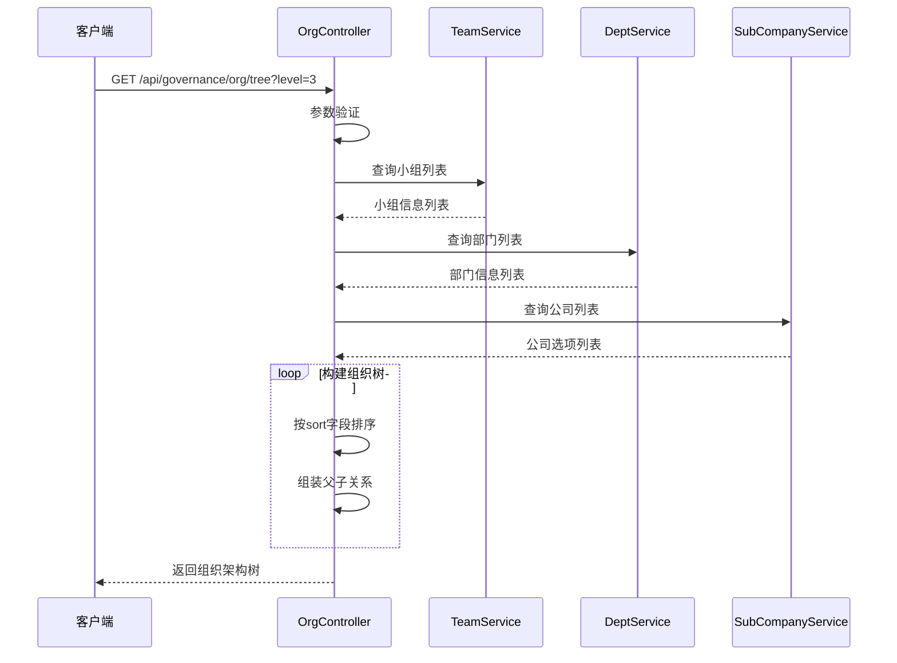

**图表来源**
- [OrgController.java:66-144](file://src/main/java/com/jiuyu/governance/business/org/controller/OrgController.java#L66-L144)

#### 部门服务接口 (DeptService)

部门服务接口定义了完整的部门管理功能，包括增删改查、分页查询、下拉选择等操作。

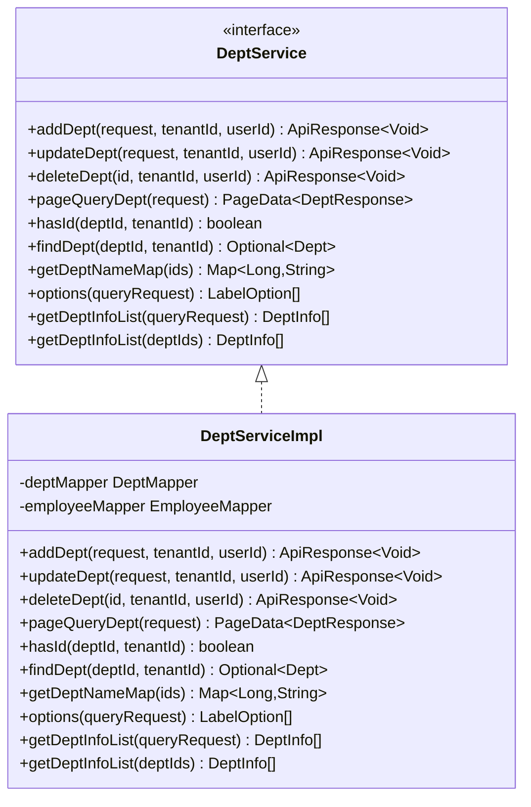

**图表来源**
- [DeptService.java:25-127](file://src/main/java/com/jiuyu/governance/business/org/service/DeptService.java#L25-L127)
- [DeptServiceImpl.java:1-25](file://src/main/java/com/jiuyu/governance/business/org/service/impl/DeptServiceImpl.java#L1-L25)

#### 子公司服务接口 (SubCompanyService)

子公司服务接口提供了完整的子公司管理功能，支持复杂的业务场景。

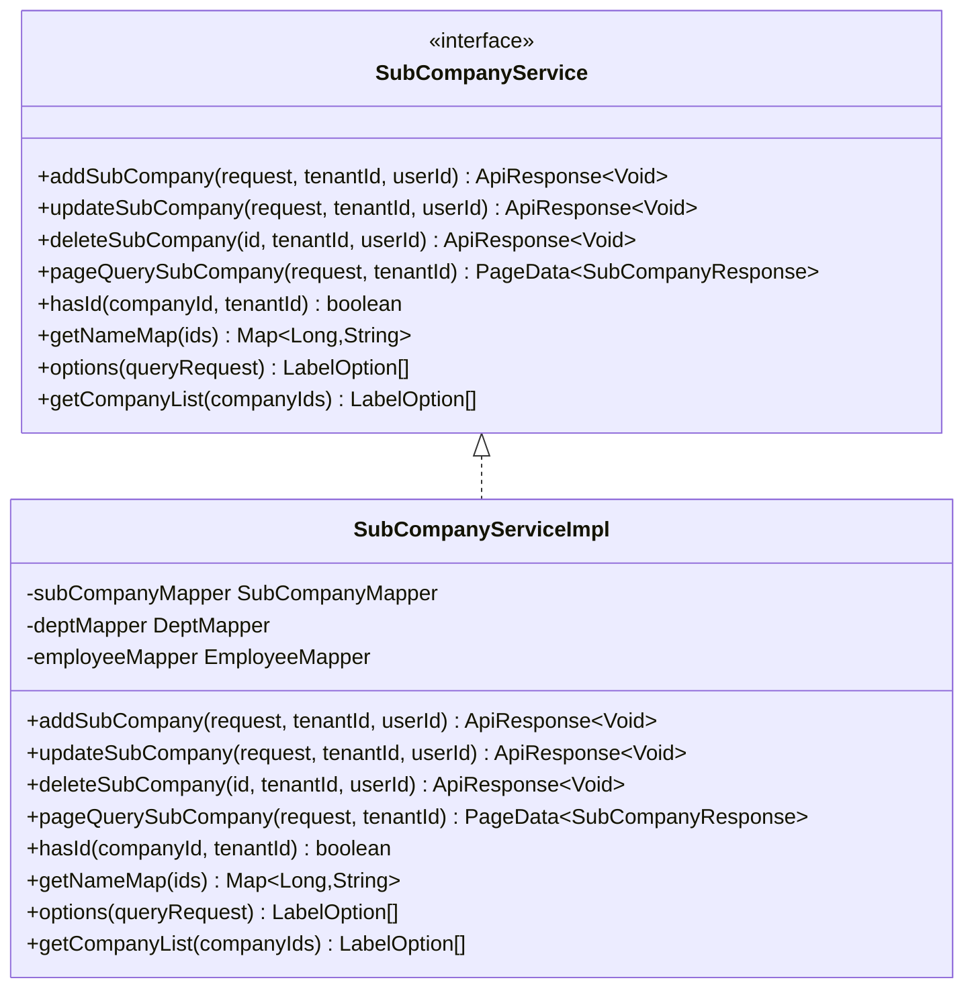

**图表来源**
- [SubCompanyService.java:23-97](file://src/main/java/com/jiuyu/governance/business/org/service/SubCompanyService.java#L23-L97)
- [SubCompanyServiceImpl.java:1-25](file://src/main/java/com/jiuyu/governance/business/org/service/impl/SubCompanyServiceImpl.java#L1-L25)

#### 小组服务实现 (TeamServiceImpl)

小组服务实现了复杂的业务逻辑，包括员工绑定、权限验证、事务管理等功能。

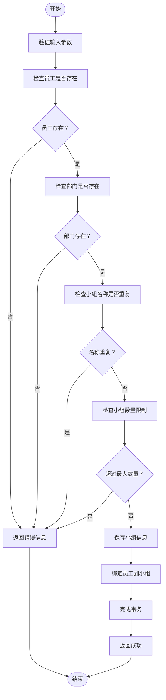

**图表来源**
- [TeamServiceImpl.java:50-67](file://src/main/java/com/jiuyu/governance/business/org/service/impl/TeamServiceImpl.java#L50-L67)

**章节来源**
- [OrgController.java:30-147](file://src/main/java/com/jiuyu/governance/business/org/controller/OrgController.java#L30-L147)
- [DeptService.java:19-128](file://src/main/java/com/jiuyu/governance/business/org/service/DeptService.java#L19-L128)
- [SubCompanyService.java:17-98](file://src/main/java/com/jiuyu/governance/business/org/service/SubCompanyService.java#L17-L98)
- [TeamServiceImpl.java:44-67](file://src/main/java/com/jiuyu/governance/business/org/service/impl/TeamServiceImpl.java#L44-L67)

### 权限控制系统

系统集成了完整的RBAC权限控制体系，包括角色管理、菜单权限、员工权限等。

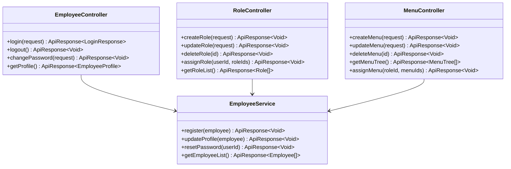

**图表来源**
- [EmployeeController.java](file://src/main/java/com/jiuyu/governance/business/rbac/controller/EmployeeController.java)
- [RoleController.java](file://src/main/java/com/jiuyu/governance/business/rbac/controller/RoleController.java)
- [MenuController.java](file://src/main/java/com/jiuyu/governance/business/rbac/controller/MenuController.java)

### 绩效管理系统

系统提供了完善的员工绩效管理功能，支持直播、产品、排班等多种绩效统计方式。

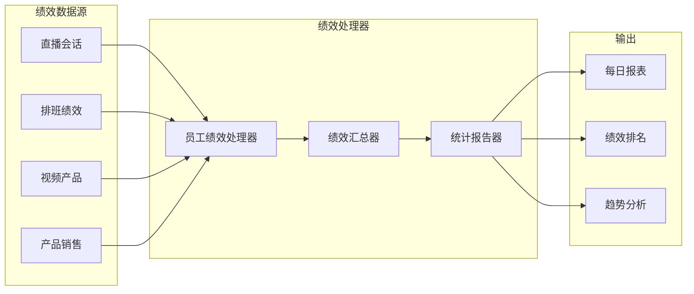

**图表来源**
- [EmployeePerformanceController.java](file://src/main/java/com/jiuyu/governance/business/performance/controller/EmployeePerformanceController.java)
- [PerformanceSummaryController.java](file://src/main/java/com/jiuyu/governance/business/performance/controller/PerformanceSummaryController.java)

## 智能代理技能系统

### AGENTS目录结构

系统现已集成完整的智能代理技能管理框架，采用.agents目录结构替代原有的.trae命名，提供统一的技能管理和工作流执行能力。

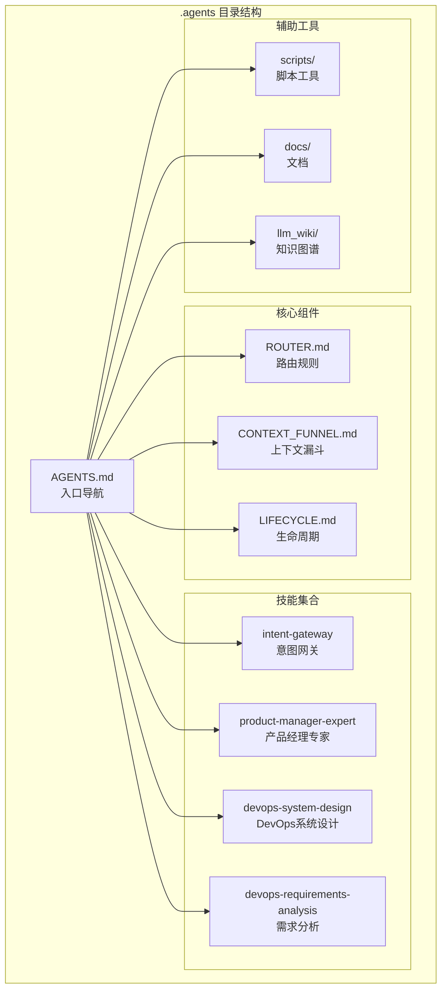

**图表来源**
- [AGENTS.md:1-19](file://AGENTS.md#L1-L19)
- [ROUTER.md:1-165](file://.agents/router/ROUTER.md#L1-L165)
- [LIFECYCLE.md:1-77](file://.agents/workflow/LIFECYCLE.md#L1-L77)

**章节来源**
- [AGENTS.md:1-19](file://AGENTS.md#L1-L19)

## 意图网关与路由机制

### 意图网关技能

intent-gateway是智能代理系统的核心路由器，负责将请求路由到适当的执行配置，并在必要时启动生命周期队列。

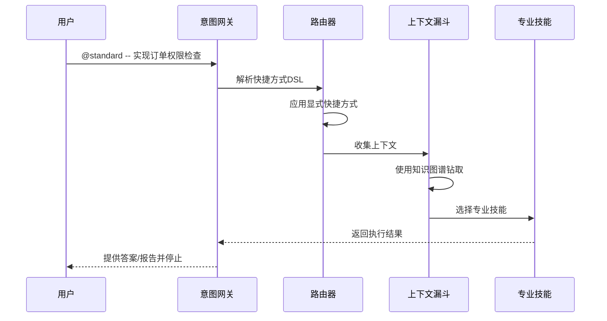

**图表来源**
- [intent-gateway SKILL.md:14-30](file://.agents/skills/intent-gateway/SKILL.md#L14-L30)

### 快捷方式DSL

系统支持灵活的快捷方式DSL语法，允许用户组合不同的执行参数：

- `@learn`：强制学习模式（只读）
- `@patch`：强制小变更/修复模式
- `@standard`：强制完整交付生命周期模式

快捷方式可以组合标志来表达常见工作流：
- `--scope <路径>`：显式作用域
- `--risk <low|medium|high>`：风险级别
- `--launch`：强制启动生命周期
- `--writeback`：允许维基写回

**章节来源**
- [intent-gateway SKILL.md:17-30](file://.agents/skills/intent-gateway/SKILL.md#L17-L30)
- [ROUTER.md:22-70](file://.agents/router/ROUTER.md#L22-L70)

## 生命周期管理

### 六阶段生命周期

智能代理系统采用标准化的六阶段生命周期管理模式，确保复杂变更的可控执行：

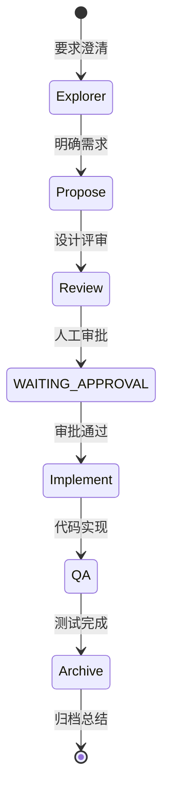

**图表来源**
- [LIFECYCLE.md:23-77](file://.agents/workflow/LIFECYCLE.md#L23-L77)

### 阶段详解

1. **Explorer（探索）**：澄清需求和范围
2. **Propose（提议）**：制定设计方案
3. **Review（评审）**：工程标准审查
4. **Implement（实施）**：代码实现
5. **QA（质量保证）**：测试验证
6. **Archive（归档）**：知识同步和总结

每个阶段都有特定的技能组合和约束条件，确保变更质量和可追溯性。

**章节来源**
- [LIFECYCLE.md:11-77](file://.agents/workflow/LIFECYCLE.md#L11-L77)

## LLM Wiki知识管理

### 知识图谱架构

系统集成了基于LLM的Wiki知识管理体系，提供结构化的知识组织和智能检索能力。

```mermaid
graph TB
subgraph "知识图谱根"
KG[KNOWLEDGE_GRAPH.md<br/>知识图谱根索引]
end
subgraph "领域索引"
API[api/index.md<br/>API规范]
DB[database/index.md<br/>数据库设计]
SPEC[specs/index.md<br/>规格文档]
END
subgraph "写入机制"
WAL[WAL目录<br/>写入待合并]
MERGE[合并流程<br/>低冲突窗口]
END
KG --> API
KG --> DB
KG --> SPEC
WAL --> MERGE
```

**图表来源**
- [CONTEXT_FUNNEL.md:15-41](file://.agents/router/CONTEXT_FUNNEL.md#L15-L41)

### 上下文收集与写回

系统采用对称的上下文收集和写回机制：

**前向漏斗（收集）**：
1. 直接读取显式作用域（当用户提供明确范围时）
2. 从知识图谱根开始钻取
3. 通过索引树定位具体文档
4. 最后才使用关键词搜索

**反向漏斗（写回）**：
1. 在归档阶段将稳定知识写回Wiki
2. 使用WAL（Write-Ahead Log）片段形式
3. 避免直接编辑共享索引文件
4. 在低冲突窗口进行合并

**章节来源**
- [CONTEXT_FUNNEL.md:1-41](file://.agents/router/CONTEXT_FUNNEL.md#L1-L41)

## 依赖关系分析

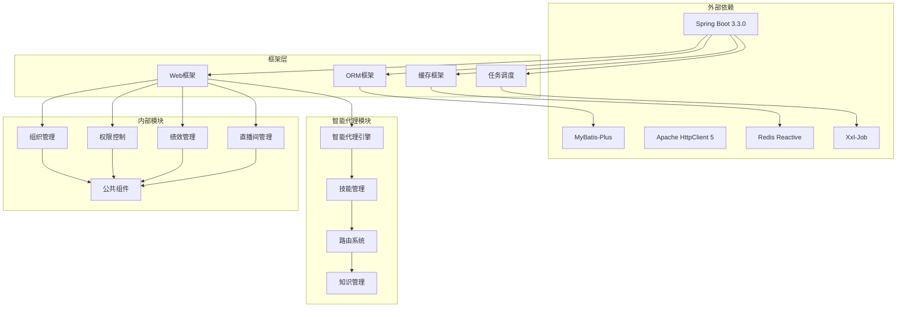

**图表来源**
- [pom.xml:35-167](file://pom.xml#L35-L167)
- [ServerApplication.java:12-18](file://src/main/java/com/jiuyu/governance/ServerApplication.java#L12-L18)
- [AGENTS.md:5-9](file://AGENTS.md#L5-L9)

**章节来源**
- [pom.xml:18-32](file://pom.xml#L18-L32)
- [pom.xml:106-130](file://pom.xml#L106-L130)
- [AGENTS.md:1-19](file://AGENTS.md#L1-L19)

## 性能考虑

### 缓存策略

系统采用了多层次的缓存策略：

1. **Redis缓存**：用于热点数据的快速访问
2. **Caffeine本地缓存**：减少数据库访问压力
3. **HTTP缓存**：利用浏览器和CDN缓存静态资源
4. **智能代理缓存**：缓存常见的意图识别和路由结果

### 数据库优化

1. **连接池配置**：HikariCP提供高性能的数据库连接管理
2. **分页查询**：避免全表扫描，提高查询效率
3. **索引优化**：针对常用查询条件建立合适的索引

### 异步处理

系统支持异步任务处理，包括：

1. **定时任务**：使用Xxl-Job进行分布式任务调度
2. **异步通知**：通过消息队列实现异步通知
3. **批量操作**：支持批量数据处理，提高吞吐量
4. **智能代理异步执行**：技能执行和生命周期管理的异步化

## 故障排除指南

### 常见问题

#### 启动失败

**症状**：应用无法正常启动
**可能原因**：
- 数据库连接配置错误
- Redis连接失败
- 端口被占用
- 智能代理配置错误

**解决方案**：
1. 检查数据库连接参数
2. 验证Redis服务状态
3. 确认端口可用性
4. 检查.agents目录结构完整性

#### 权限问题

**症状**：用户无法访问某些功能
**可能原因**：
- 用户角色配置错误
- 菜单权限未分配
- Token过期

**解决方案**：
1. 检查用户角色映射
2. 验证菜单权限分配
3. 重新登录获取新Token

#### 智能代理问题

**症状**：意图识别或路由失败
**可能原因**：
- 路由规则配置错误
- 知识图谱索引损坏
- 技能文件缺失
- 写回机制冲突

**解决方案**：
1. 检查ROUTER.md配置
2. 验证CONTEXT_FUNNEL.md路径
3. 确认技能文件完整性
4. 清理WAL缓存并重新合并

#### 性能问题

**症状**：系统响应缓慢
**可能原因**：
- 数据库查询慢
- 缓存命中率低
- 并发过高
- 智能代理执行开销大

**解决方案**：
1. 分析慢查询日志
2. 优化缓存策略
3. 调整线程池配置
4. 监控智能代理执行时间

**章节来源**
- [TeamServiceTest.java:191-210](file://src/test/java/com/jiuyu/governance/business/org/service/TeamServiceTest.java#L191-L210)
- [SubCompanyServiceTest.java:133-180](file://src/test/java/com/jiuyu/governance/business/org/service/SubCompanyServiceTest.java#L133-L180)
- [DeptServiceTest.java:196-227](file://src/test/java/com/jiuyu/governance/business/org/service/DeptServiceTest.java#L196-L227)

## 结论

技能管理系统经过重大升级，现已发展为一个功能完整、架构清晰的企业级智能代理治理平台。系统采用现代化的技术栈，具备良好的扩展性和维护性。

### 主要优势

1. **架构清晰**：采用标准的分层架构，职责分离明确
2. **功能完善**：涵盖组织管理、权限控制、绩效管理等核心功能
3. **技术先进**：使用Spring Boot 3.3.0等最新技术
4. **性能优秀**：集成多种性能优化策略
5. **安全可靠**：完整的权限控制和数据保护机制
6. **智能化**：集成意图识别、路由决策和生命周期管理
7. **知识化**：基于LLM Wiki的知识图谱和文档同步

### 智能代理特色

1. **意图识别**：通过intent-gateway实现智能请求分类
2. **路由决策**：基于ROUTER.md的规则化路由系统
3. **生命周期管理**：标准化的六阶段变更管理模式
4. **知识管理**：结构化的LLM Wiki知识图谱体系
5. **自动化执行**：从需求澄清到归档总结的全流程自动化

### 发展建议

1. **监控完善**：建议增加智能代理执行指标和性能监控
2. **文档补充**：完善智能代理API文档和使用指南
3. **测试覆盖**：提高智能代理相关测试的覆盖率
4. **性能调优**：持续优化智能代理的执行效率和响应速度
5. **技能扩展**：根据业务需求持续添加新的专业技能

该系统为企业数字化转型提供了坚实的技术基础，能够有效支撑企业的组织管理和人才发展需求，同时通过智能代理能力显著提升开发效率和变更质量控制水平。