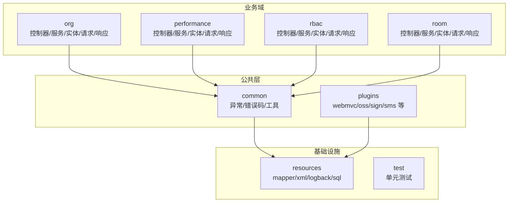
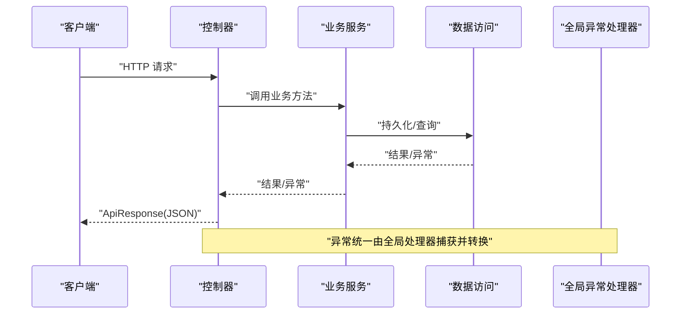
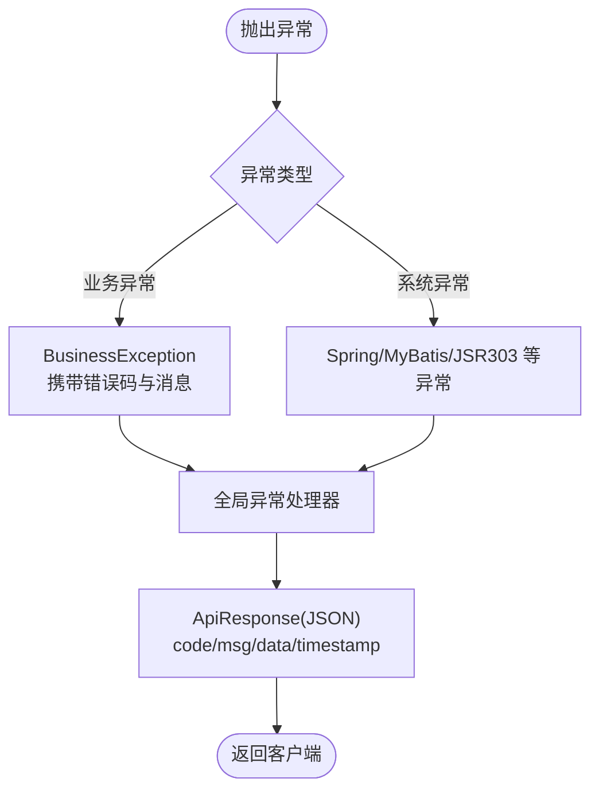
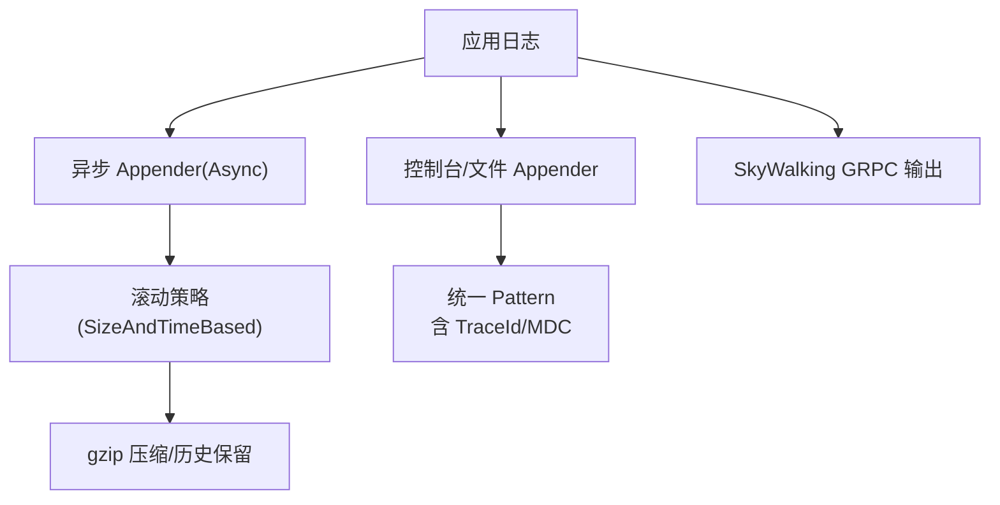
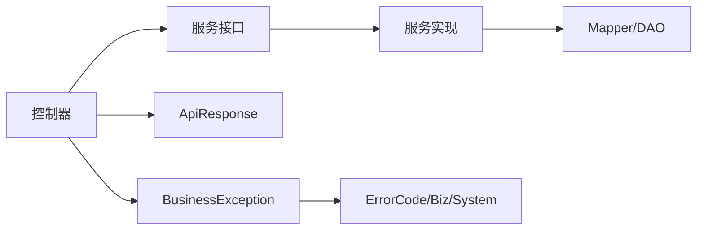

# 代码规范

<cite>
**本文引用的文件**
- [BusinessException.java](file://src/main/java/com/jiuyu/governance/common/exceptions/BusinessException.java)
- [ErrorCode.java](file://src/main/java/com/jiuyu/governance/common/pojo/ErrorCode.java)
- [SystemErrorCode.java](file://src/main/java/com/jiuyu/governance/common/pojo/SystemErrorCode.java)
- [BizErrorCode.java](file://src/main/java/com/jiuyu/governance/common/pojo/BizErrorCode.java)
- [GlobalExceptionHandler.java](file://src/main/java/com/jiuyu/governance/plugins/webmvc/GlobalExceptionHandler.java)
- [logback-spring.xml](file://src/main/resources/logback-spring.xml)
- [OrgController.java](file://src/main/java/com/jiuyu/governance/business/org/controller/OrgController.java)
- [DeptAddRequest.java](file://src/main/java/com/jiuyu/governance/business/org/pojo/request/DeptAddRequest.java)
- [Dept.java](file://src/main/java/com/jiuyu/governance/business/org/pojo/entity/Dept.java)
- [BaseEnumSerializer.java](file://src/main/java/com/jiuyu/governance/plugins/webmvc/serializer/BaseEnumSerializer.java)
- [pom.xml](file://pom.xml)
- [API_DESIGN_STANDARD.md](file://API_DESIGN_STANDARD.md)
- [ERROR_CODE_DICT.md](file://ERROR_CODE_DICT.md)
- [.trae/skills/checkstyle/SKILL.md](file://.trae/skills/checkstyle/SKILL.md)
- [.trae/skills/code-review-checklist/SKILL.md](file://.trae/skills/code-review-checklist/SKILL.md)
</cite>

## 更新摘要
**变更内容**
- 新增严格的Java Checkstyle编码规范标准
- 建立完整的代码审查检查清单和自纠错协议
- 整合Google Java Style和Sun代码约定
- 强化Lombok使用和构造器注入最佳实践
- 增加数据库性能和安全检查标准

## 目录
1. [简介](#简介)
2. [项目结构](#项目结构)
3. [核心组件](#核心组件)
4. [架构总览](#架构总览)
5. [详细组件分析](#详细组件分析)
6. [依赖分析](#依赖分析)
7. [性能考虑](#性能考虑)
8. [故障排查指南](#故障排查指南)
9. [结论](#结论)
10. [附录](#附录)

## 简介
本文件面向 fupan-governance-server 的 Java 开发者，系统化梳理并制定统一的代码规范，涵盖命名约定、包结构与文件命名、注释规范、异常处理最佳实践、日志记录规范、代码格式化工具配置与使用、代码审查清单与质量检查标准，并结合仓库现有实现提供可落地的示例路径，帮助团队达成一致的工程实践。

**重要更新**：本规范现已整合最新的Checkstyle标准和代码审查检查清单，建立从编码到审查的全流程质量保障体系。

## 项目结构
项目采用按领域分层的包组织方式，典型模块包括 business、performance、rbac、room、common、plugins 等，控制器位于各模块的 controller 包，服务接口与实现分别位于 service 与 service/impl，数据模型分为 entity、bo、request、response、constants 等子包，MyBatis Mapper XML 位于 resources/mapper 下。

**图表来源**
- [OrgController.java:1-139](file://src/main/java/com/jiuyu/governance/business/org/controller/OrgController.java#L1-L139)
- [BusinessException.java:1-49](file://src/main/java/com/jiuyu/governance/common/exceptions/BusinessException.java#L1-L49)
- [logback-spring.xml:1-120](file://src/main/resources/logback-spring.xml#L1-L120)

**章节来源**
- [pom.xml:1-226](file://pom.xml#L1-L226)

## 核心组件
- 错误码体系：ErrorCode 接口定义统一能力；SystemErrorCode 与 BizErrorCode 分别承载系统底层与业务抽象错误码。
- 业务异常：BusinessException 提供多构造函数，支持携带错误码与动态消息。
- 全局异常处理：GlobalExceptionHandler 将各类异常映射为统一 ApiResponse 响应。
- 日志：logback-spring.xml 定义控制台与滚动文件输出、异步 Appender、SkyWalking MDC 输出与不同 profile 的根日志级别。
- 接口设计：API_DESIGN_STANDARD.md 明确路径命名、响应格式与分页规范。
- 错误码字典：ERROR_CODE_DICT.md 提供错误码分段与行为约定，指导前后端交互。
- **新增**：Checkstyle编码规范确保代码格式一致性。
- **新增**：代码审查检查清单建立质量门禁。

**章节来源**
- [ErrorCode.java:1-25](file://src/main/java/com/jiuyu/governance/common/pojo/ErrorCode.java#L1-L25)
- [SystemErrorCode.java:1-38](file://src/main/java/com/jiuyu/governance/common/pojo/SystemErrorCode.java#L1-L38)
- [BizErrorCode.java:1-55](file://src/main/java/com/jiuyu/governance/common/pojo/BizErrorCode.java#L1-L55)
- [BusinessException.java:1-49](file://src/main/java/com/jiuyu/governance/common/exceptions/BusinessException.java#L1-L49)
- [GlobalExceptionHandler.java:1-377](file://src/main/java/com/jiuyu/governance/plugins/webmvc/GlobalExceptionHandler.java#L1-L377)
- [logback-spring.xml:1-120](file://src/main/resources/logback-spring.xml#L1-L120)
- [API_DESIGN_STANDARD.md:1-103](file://API_DESIGN_STANDARD.md#L1-L103)
- [ERROR_CODE_DICT.md:1-160](file://ERROR_CODE_DICT.md#L1-L160)
- [.trae/skills/checkstyle/SKILL.md:1-72](file://.trae/skills/checkstyle/SKILL.md#L1-L72)
- [.trae/skills/code-review-checklist/SKILL.md:1-64](file://.trae/skills/code-review-checklist/SKILL.md#L1-L64)

## 架构总览
从请求到响应的关键链路：客户端 → 控制器 → 业务服务 → 数据访问 → 统一响应；异常在全局处理器中捕获并转换为 ApiResponse。

**图表来源**
- [OrgController.java:1-139](file://src/main/java/com/jiuyu/governance/business/org/controller/OrgController.java#L1-L139)
- [GlobalExceptionHandler.java:1-377](file://src/main/java/com/jiuyu/governance/plugins/webmvc/GlobalExceptionHandler.java#L1-L377)

## 详细组件分析

### 命名约定与包结构
- 包命名
  - 采用反向域名 + 功能域分层，如 com.jiuyu.governance.business.org、com.jiuyu.governance.performance 等。
  - 控制器包名为 controller，服务接口为 service，实现为 service/impl，实体/请求/响应/常量等按职责细分。
- 类名
  - 使用名词或复合名词，首字母大写；领域实体与请求/响应类以实体名+后缀区分（如 Dept、DeptAddRequest、DeptResponse）。
- 方法名
  - 使用动词短语，体现动作意图；控制器方法遵循"动词后缀"规范（如 add/update/delete/detail/list）。
- 变量名
  - 使用小驼峰，简洁明确；避免缩写，必要时使用领域内广泛认可的缩略词。
- 文件命名
  - 类文件与类名一致；MyBatis Mapper XML 与 Mapper 接口同名且位于 resources/mapper 下对应模块目录。

**章节来源**
- [API_DESIGN_STANDARD.md:7-32](file://API_DESIGN_STANDARD.md#L7-L32)
- [OrgController.java:1-139](file://src/main/java/com/jiuyu/governance/business/org/controller/OrgController.java#L1-L139)
- [DeptAddRequest.java:1-46](file://src/main/java/com/jiuyu/governance/business/org/pojo/request/DeptAddRequest.java#L1-L46)
- [Dept.java:1-92](file://src/main/java/com/jiuyu/governance/business/org/pojo/entity/Dept.java#L1-L92)

### 注释规范
- 类注释
  - 类顶部提供简要说明与作者、日期信息，便于追溯。
- 方法注释
  - 说明意图、参数含义、返回值与异常；复杂流程建议补充"注意事项/要点"。
- 字段注释
  - 对关键字段（如数据库映射字段、业务含义字段）给出注释，必要时标注校验约束。
- 示例参考
  - 控制器类与方法注释、实体字段注释、请求对象注释均可作为模板。

**章节来源**
- [OrgController.java:30-65](file://src/main/java/com/jiuyu/governance/business/org/controller/OrgController.java#L30-L65)
- [Dept.java:14-91](file://src/main/java/com/jiuyu/governance/business/org/pojo/entity/Dept.java#L14-L91)
- [DeptAddRequest.java:11-45](file://src/main/java/com/jiuyu/governance/business/org/pojo/request/DeptAddRequest.java#L11-L45)

### 异常处理最佳实践
- 自定义异常
  - 使用 BusinessException，优先传入 BizErrorCode 或 SystemErrorCode，支持动态消息覆盖。
- 全局异常映射
  - GlobalExceptionHandler 将常见异常（参数校验、SQL、鉴权、签名等）映射为统一 ApiResponse。
- 前后端协同
  - 错误码字典定义了 0~999（底层保留）、1000~1999（通用类）、2000~2999（规则类）、3000~3999（业务类）、4000~4999（交互类）的行为约定，前端据此做 UI 分支。

**图表来源**
- [BusinessException.java:1-49](file://src/main/java/com/jiuyu/governance/common/exceptions/BusinessException.java#L1-L49)
- [GlobalExceptionHandler.java:1-377](file://src/main/java/com/jiuyu/governance/plugins/webmvc/GlobalExceptionHandler.java#L1-L377)
- [ERROR_CODE_DICT.md:1-160](file://ERROR_CODE_DICT.md#L1-L160)

**章节来源**
- [BusinessException.java:1-49](file://src/main/java/com/jiuyu/governance/common/exceptions/BusinessException.java#L1-L49)
- [SystemErrorCode.java:1-38](file://src/main/java/com/jiuyu/governance/common/pojo/SystemErrorCode.java#L1-L38)
- [BizErrorCode.java:1-55](file://src/main/java/com/jiuyu/governance/common/pojo/BizErrorCode.java#L1-L55)
- [GlobalExceptionHandler.java:1-377](file://src/main/java/com/jiuyu/governance/plugins/webmvc/GlobalExceptionHandler.java#L1-L377)
- [ERROR_CODE_DICT.md:88-116](file://ERROR_CODE_DICT.md#L88-L116)

### 日志记录规范
- 日志级别
  - INFO/WARN/ERROR 分级记录；ERROR 级别单独落盘并异步处理，INFO 级别滚动归档。
- 日志格式
  - 控制台与文件统一 pattern，包含时间、线程、级别、TraceId、Logger 名称与消息；文件输出包含 TraceId/MDC 字段。
- 异步与滚动
  - 使用 AsyncAppender 提升吞吐；按天/按大小滚动压缩，保留合理历史。
- SkyWalking 集成
  - 通过 GRPCLog 输出，结合 MDC 注入 traceId/ip/user 等上下文。

**图表来源**
- [logback-spring.xml:1-120](file://src/main/resources/logback-spring.xml#L1-L120)

**章节来源**
- [logback-spring.xml:1-120](file://src/main/resources/logback-spring.xml#L1-L120)

### 代码格式化工具与配置
- 编译与注解处理器
  - Maven 编译插件指定 Java 版本与注解处理器路径（如 Lombok）。
- 资源打包
  - MyBatis Mapper XML 通过资源过滤包含在最终包中。
- 建议
  - 团队统一 IDE 格式化模板（Google Java Style 或阿里巴巴 Java 编码规范），配合 Maven 插件在 CI 中校验格式一致性。

**章节来源**
- [pom.xml:186-223](file://pom.xml#L186-L223)

### 接口设计与数据交互规范
- 路径命名
  - 全部小写，单词用连字符分隔；禁止 Path 变量传参，参数通过 Query 或 Body 传递；资源操作以动词后缀区分。
- 响应格式
  - 统一 ApiResponse，包含 code/msg/data/exception/timestamp/extend 等字段。
- 分页规范
  - PageRequest/page/limit；响应为 PageData，包含 currPage/pageSize/totalCount/totalPage/list。

**章节来源**
- [API_DESIGN_STANDARD.md:7-32](file://API_DESIGN_STANDARD.md#L7-L32)
- [API_DESIGN_STANDARD.md:34-103](file://API_DESIGN_STANDARD.md#L34-L103)

### Java Checkstyle编码规范
**新增**：严格遵循Google Java Style和Sun代码约定的Checkstyle标准

#### 1. 格式化与缩进
- **缩进**：始终使用4个空格，严禁使用制表符
- **换行**：保持每行不超过120个字符。对于链式方法调用（如MyBatis Plus的LambdaQueryWrapper或Stream API），在点号前换行，缩进4或8个空格
- **大括号(K&R风格)**：
  - 开始大括号{与声明在同一行
  - 结束大括号}独占一行
  - 即使是单行也要使用大括号
- **空白**：
  - 在左大括号前添加空格（如if (condition) {）
  - 在关键字if、for、while、catch后的括号前添加空格
  - 在二元运算符（=、+、&&、==等）周围添加空格

#### 2. 命名规范
- **包名**：全部小写，点分隔（如com.jiuyu.governance.business.org）
- **类/接口**：UpperCamelCase
  - 接口应使用形容词或名词
  - 实现类必须使用Impl后缀（如DeptServiceImpl）
- **方法/变量**：lowerCamelCase
- **常量**：CONSTANT_CASE（全部大写，下划线分隔）
- **POJO后缀**：
  - 请求：XxxRequest（如DeptAddRequest）
  - 响应：XxxResponse（如DeptResponse）
  - 实体：无后缀，纯名词（如Dept、Employee）

#### 3. 导包规范
- **禁止通配符导入**：严禁使用import java.util.*;，必须显式导入类
- **分组顺序**：
  1. 标准Java（java.*、javax.*）
  2. Spring/Jakarta（org.springframework.*、jakarta.*）
  3. 第三方库（cn.hutool.*、com.baomidou.*）
  4. 内部框架（com.jiuyu.framework.*）
  5. 当前项目（com.jiuyu.governance.*）
- 每个分组之间用单个空行分隔

#### 4. 注释规范
- **类注释**：每个类和接口都必须有类级Javadoc，包括描述、@author和@date（格式：yyyy-MM-dd或yyyy-MM-dd HH:mm）
- **方法注释**：所有公共方法（特别是在Controllers和Services中）都必须有Javadoc，说明目的、@param和@return
- **行内注释**：使用//进行单行注释。将注释放置在描述代码的独立行上方，而不是行尾

#### 5. 面向对象与最佳实践
- **Lombok**：大量使用Lombok减少样板代码。使用@Getter、@Setter（或适当情况下使用@Data，尽管显式的Getter/Setter对实体更安全）、@RequiredArgsConstructor进行依赖注入，以及@Slf4j进行日志记录
- **依赖注入**：始终使用Lombok的@RequiredArgsConstructor进行构造器注入。严禁在字段上使用@Autowired
- **验证**：在控制器方法参数上使用@Valid或@Validated
- **魔法数字**：避免魔法数字或字符串。将它们提取到private static final常量或Enum中

#### 6. 强制检查清单
在输出代码之前，验证：
- [ ] 无制表符（仅使用4个空格）
- [ ] 无通配符导入（.*）
- [ ] 正确使用K&R大括号
- [ ] 类和公共方法都有Javadoc
- [ ] 使用@RequiredArgsConstructor进行构造器注入而非字段注入

**章节来源**
- [.trae/skills/checkstyle/SKILL.md:1-72](file://.trae/skills/checkstyle/SKILL.md#L1-L72)

### 代码审查检查清单
**新增**：建立完整的代码审查检查清单和自纠错协议

#### 🔄 自纠错循环协议
1. **评估**：完成编辑后立即根据以下检查清单运行代码
2. **修复**：如果任何规则被违反（例如使用@Autowired而不是@RequiredArgsConstructor），立即使用编辑工具修复
3. **重新评估**：在修复后的代码上再次运行检查清单
4. **通过**：只有当所有检查都通过100%时才结束。在响应末尾输出简短的"CR检查清单报告"，确认合规或详细说明自动修复的内容

#### 📋 最终CR检查清单

##### 1. API与控制器设计（java-backend-api-standard）
- [ ] **禁止@PathVariable**：所有参数必须使用@RequestBody或@RequestParam
- [ ] **URL动词**：端点URL必须以操作动词结尾（如/add、/update、/delete、/page、/list）
- [ ] **资源锁定**：写操作（add/update/delete）必须有@ResourceLock
- [ ] **验证**：DTO必须使用@Validated或@Valid
- [ ] **返回类型**：控制器必须直接返回服务的ApiResponse用于写操作，或返回ApiResponse.success(data)用于读操作

##### 2. Checkstyle与格式化（checkstyle）
- [ ] **缩进**：使用4个空格？（无制表符）
- [ ] **大括号**：使用K&R风格？（开始大括号在同一行，结束大括号在新行）
- [ ] **导入**：无通配符导入（.*）？使用正确的分组顺序？
- [ ] **注释**：所有新建/修改的类和公共方法都有注释（@author、@date为yyyy-MM-dd、@param、@return）？
- [ ] **注入**：使用@RequiredArgsConstructor进行构造器注入？（无@Autowired字段注入）
- [ ] **命名**：类使用UpperCamelCase，方法/变量使用lowerCamelCase，POJO后缀正确（Request、Response）

##### 3. 服务逻辑与数据组装（java-backend-guidelines）
- [ ] **反JOIN组装**：是否使用Complete.start()获取名称/字典而不是SQL JOIN？
- [ ] **分页**：是否使用CustomPage.execute()进行分页？
- [ ] **空值检查**：是否使用EmptyUtil.isEmpty()或EmptyUtil.isNotEmpty()而不是obj == null？
- [ ] **Bean复制**：是否使用cn.hutool.core.bean.BeanUtil进行对象映射？

##### 4. 阿里巴巴代码规范与业务逻辑
- [ ] **循环中无DB**：循环中是否有任何数据库操作（CRUD）？（强制修复：重构为批量查询in()和内存映射）
- [ ] **循环中无RPC**：循环中是否有任何Feign或外部API调用？（强制修复：重构为批量API调用）
- [ ] **业务边界**：逻辑是否尊重领域边界？（如UserService不应直接修改Order表；它应该调用OrderService）
- [ ] **事务范围**：@Transactional是否仅包装必要的数据库操作？（保持重型计算或RPC调用在事务外部）
- [ ] **魔法数字**：代码中是否有任何未解释的魔法数字/字符串？（替换为Enum或Constants）

##### 5. 数据库与SQL性能（mybatis-sql-standard & java-data-permissions）
- [ ] **租户隔离**：查询中的第一个条件是否为.eq(Entity::getTenantId, tenantId)？（强制）
- [ ] **逻辑删除**：是否包含.eq(Entity::getIsDeleted, false)？
- [ ] **无SELECT ***：XML中是否查询特定列而不是*？
- [ ] **索引友好**：WHERE子句中是否在=左侧没有函数？（如无DATE(create_time) = ?）
- [ ] **类型匹配**：Java参数类型是否与DB列类型完美匹配以防止隐式转换？

##### 6. 错误处理（error-code-standard）
- [ ] **抽象错误码**：是否复用抽象码（如BizErrorCode.PARAM_INVALID、DATA_DUPLICATED、HAS_DEPENDENCY）而不是创建新码？
- [ ] **动态消息**：是否覆盖了消息？（如new BusinessException(BizErrorCode.DATA_DUPLICATED, "角色名称已存在")）
- [ ] **无通用失败**：是否避免了new BusinessException("Some error")如果存在更具体的抽象码？

#### 📝 输出格式要求
在任务结束时追加简短的检查清单摘要。示例：
> **✅ CR检查清单报告:**
> - 已根据checkstyle、错误码和API标准评估代码
> - *自纠错*: 发现通配符导入（import java.util.*;）并替换为显式导入
> - 所有检查通过

**章节来源**
- [.trae/skills/code-review-checklist/SKILL.md:1-64](file://.trae/skills/code-review-checklist/SKILL.md#L1-L64)

### 实际代码示例（示例路径）
- 控制器示例：组织树接口，展示注释、参数与返回结构
  - [OrgController.java:49-137](file://src/main/java/com/jiuyu/governance/business/org/controller/OrgController.java#L49-L137)
- 请求对象校验：新增部门请求，字段带JSR303注解
  - [DeptAddRequest.java:11-45](file://src/main/java/com/jiuyu/governance/business/org/pojo/request/DeptAddRequest.java#L11-L45)
- 实体映射：部门实体，字段映射与校验
  - [Dept.java:14-91](file://src/main/java/com/jiuyu/governance/business/org/pojo/entity/Dept.java#L14-L91)
- 枚举序列化：统一输出枚举值
  - [BaseEnumSerializer.java:11-25](file://src/main/java/com/jiuyu/governance/plugins/webmvc/serializer/BaseEnumSerializer.java#L11-L25)

## 依赖分析
- 组件耦合
  - 控制器依赖服务接口；服务实现依赖 Mapper/DTO；异常与错误码为横切关注点。
- 外部依赖
  - Spring Boot/Web、MyBatis Plus、Undertow、分布式锁、签名、缓存、OSS、SMS、XXL-Job 等。
- 循环依赖
  - 模块间通过接口与 DTO 解耦，避免循环依赖。

**图表来源**
- [OrgController.java:1-139](file://src/main/java/com/jiuyu/governance/business/org/controller/OrgController.java#L1-L139)
- [BusinessException.java:1-49](file://src/main/java/com/jiuyu/governance/common/exceptions/BusinessException.java#L1-L49)
- [ErrorCode.java:1-25](file://src/main/java/com/jiuyu/governance/common/pojo/ErrorCode.java#L1-L25)
- [SystemErrorCode.java:1-38](file://src/main/java/com/jiuyu/governance/common/pojo/SystemErrorCode.java#L1-L38)
- [BizErrorCode.java:1-55](file://src/main/java/com/jiuyu/governance/common/pojo/BizErrorCode.java#L1-L55)

**章节来源**
- [pom.xml:35-167](file://pom.xml#L35-L167)

## 性能考虑
- 异步日志
  - 使用 AsyncAppender 降低日志 I/O 对主流程的影响。
- 连接池与序列化
  - 合理配置 HTTP 客户端连接池与 Jackson 序列化策略，避免大对象反复序列化。
- SQL 与缓存
  - 使用 MyBatis Plus 与缓存组件，避免 N+1 查询；对热点数据加缓存。
- 并发与锁
  - 使用分布式锁保护关键资源，避免超卖与竞态。

## 故障排查指南
- 常见异常定位
  - 参数校验失败：查看 BindException/MethodArgumentNotValidException/ConstraintViolationException 的映射。
  - SQL 异常：关注 PersistenceException/MyBatisSystemException/SQLException 的处理分支。
  - 鉴权与签名：AuthenticationException 与 SignatureException 的处理。
- 日志检索
  - 结合 TraceId/MDC 字段快速定位请求链路；生产环境优先查看 ERROR 日志。
- 错误码对照
  - 参考错误码字典，确认前端交互行为与后端返回码的一致性。

**章节来源**
- [GlobalExceptionHandler.java:94-374](file://src/main/java/com/jiuyu/governance/plugins/webmvc/GlobalExceptionHandler.java#L94-L374)
- [ERROR_CODE_DICT.md:1-160](file://ERROR_CODE_DICT.md#L1-L160)
- [logback-spring.xml:1-120](file://src/main/resources/logback-spring.xml#L1-L120)

## 结论
通过统一的命名与包结构、清晰的注释规范、严谨的异常与日志处理、规范化的接口设计与错误码体系，以及可落地的代码示例与质量检查标准，团队可在保证一致性的同时提升开发效率与系统稳定性。

**重要更新**：新增的Checkstyle编码规范和完整的代码审查检查清单建立了从编码到审查的全流程质量保障体系，确保代码质量和一致性得到持续维护。建议在团队内推广并持续演进本规范，确保新成员快速上手与长期维护成本可控。

## 附录

### 代码审查清单（完整版）
- 命名与结构
  - 包/类/方法/变量命名是否符合约定？
  - 控制器方法是否遵循"动词后缀"与参数传递规范？
- 注释与文档
  - 类/方法/字段注释是否完整？复杂逻辑是否有"注意事项/要点"？
- 异常与错误码
  - 是否使用 BusinessException 并传入合适的错误码？
  - 是否覆盖了必要的异常分支并在全局处理器中统一处理？
- 日志
  - 是否使用统一 pattern 与级别？是否包含 TraceId/MDC？
- 接口与响应
  - 是否遵循 API 设计规范？响应结构是否符合 ApiResponse？
- 测试与质量
  - 是否有单元测试覆盖关键路径？是否通过格式化与静态检查？

### 质量检查标准（完整版）
- 代码风格
  - 统一使用 Google Java Style 或阿里巴巴 Java 编码规范；IDE 配置与 Maven 插件校验。
- 构建与资源
  - MyBatis Mapper XML 是否被打包；资源过滤是否开启。
- 依赖与版本
  - 关键依赖版本是否明确；是否避免重复与冲突。
- **新增**：Checkstyle强制检查
  - 4个空格缩进、K&R大括号、无通配符导入、类和公共方法注释、构造器注入
- **新增**：代码审查强制检查
  - API设计规范、数据库性能、业务逻辑边界、错误码使用

### 自纠错协议执行流程
1. **编写代码**：按照Checkstyle标准编写代码
2. **自我检查**：运行代码审查检查清单
3. **自动修复**：发现违规立即修复
4. **重新评估**：修复后再次检查
5. **最终确认**：所有检查通过后提交代码