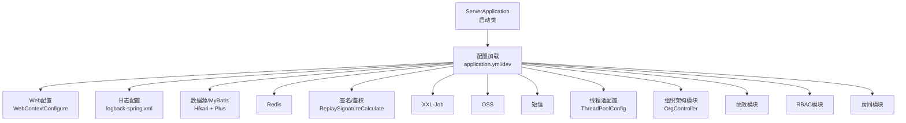
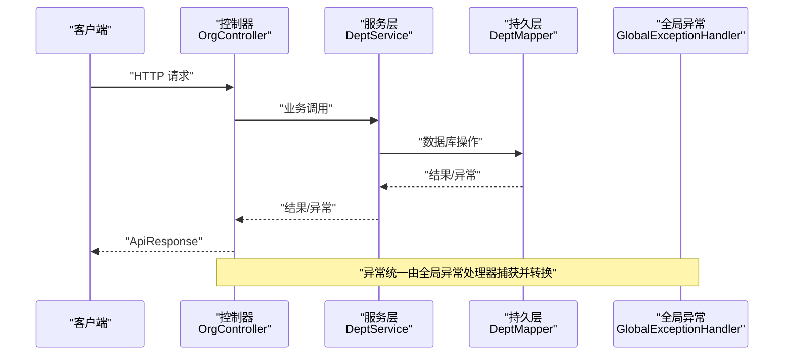
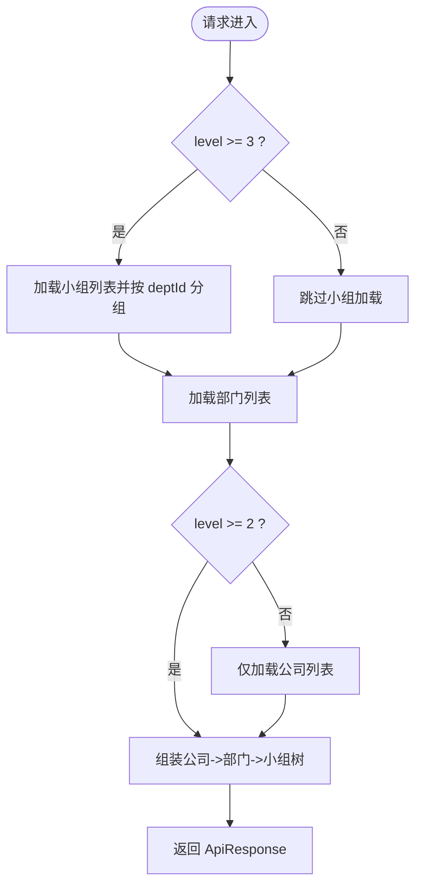
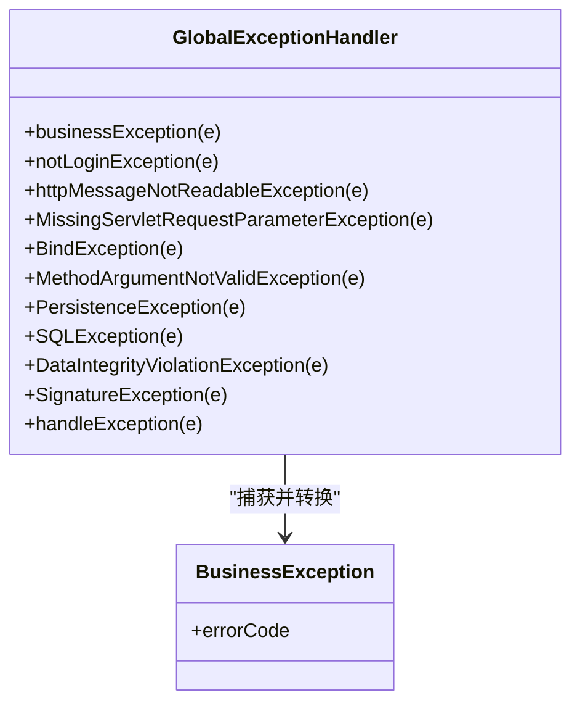
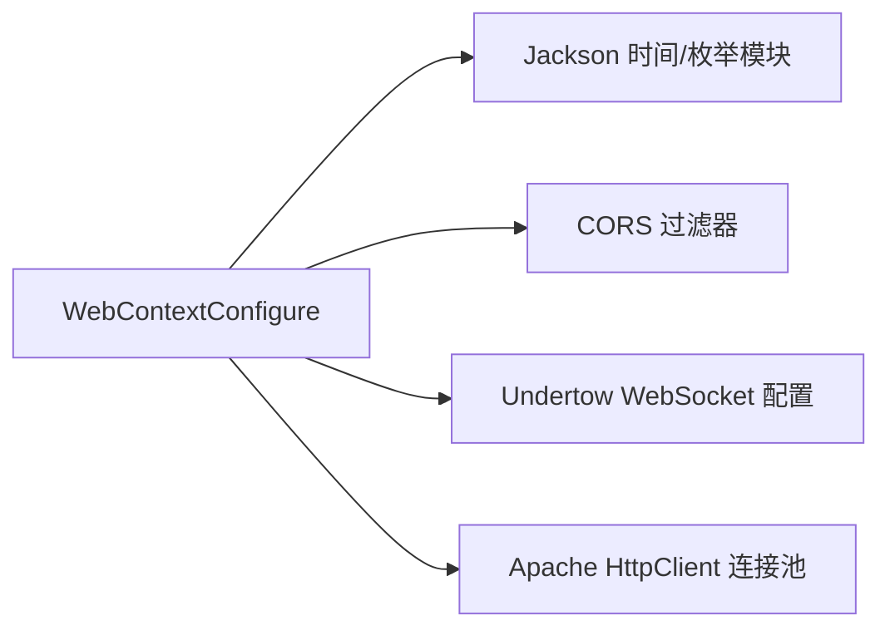
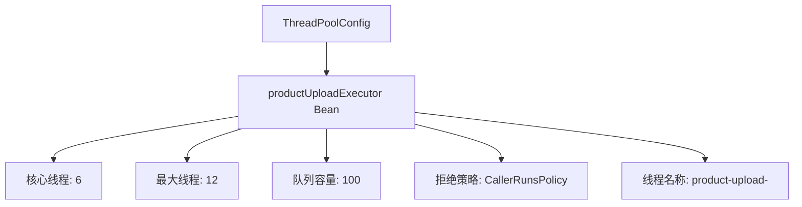
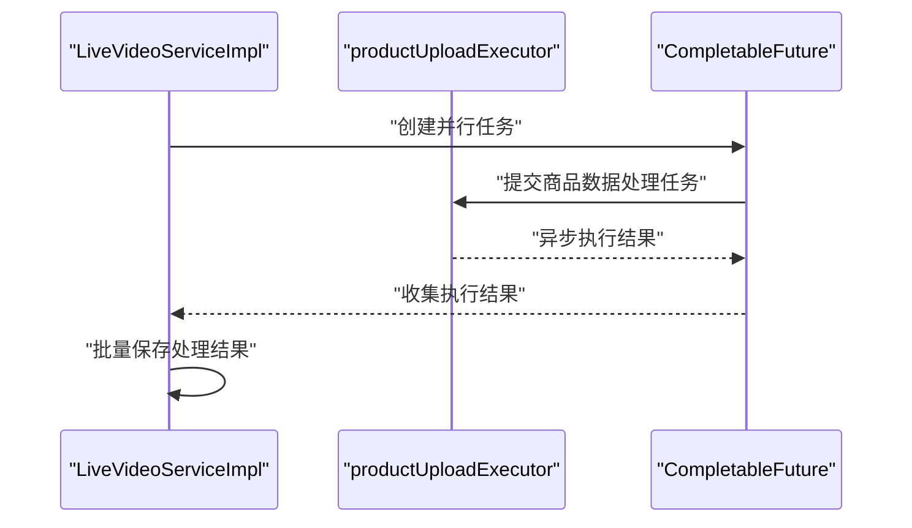
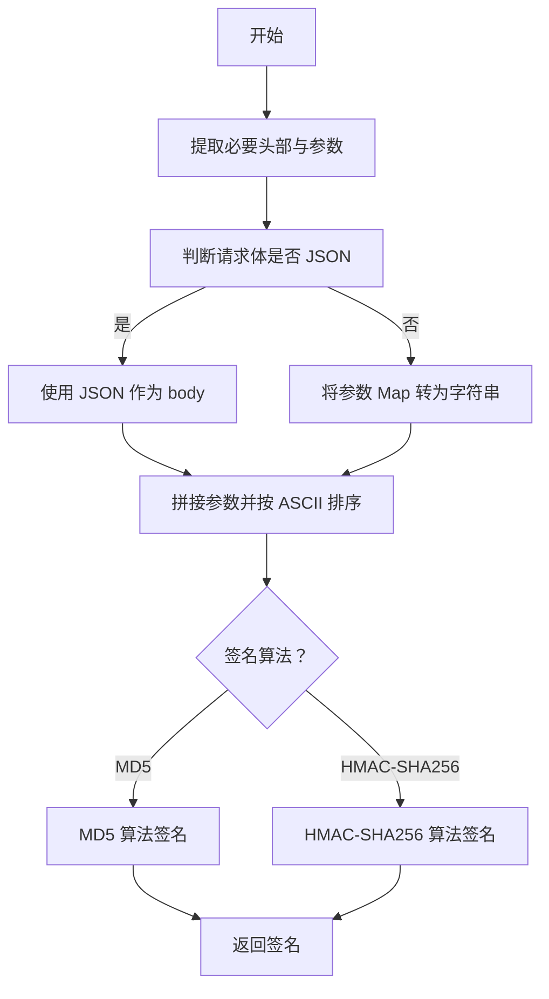
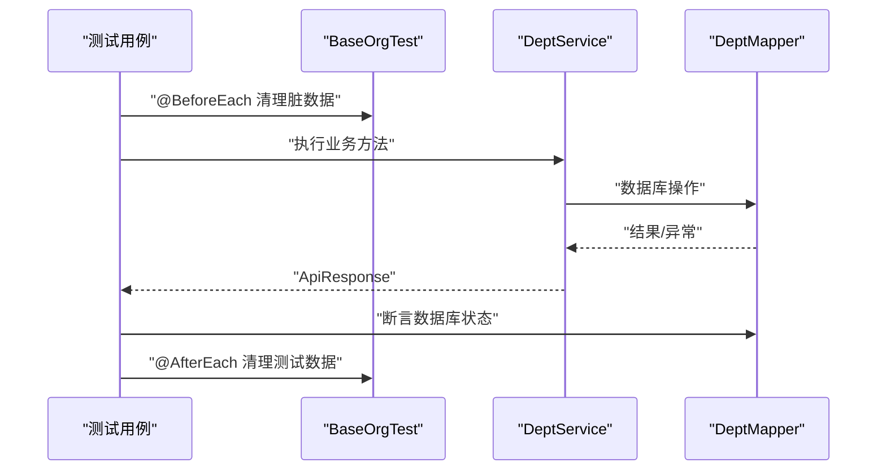
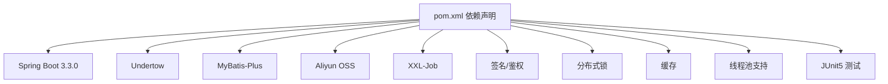

# 开发指南

<cite>
**本文引用的文件**   
- [pom.xml](file://pom.xml)
- [ServerApplication.java](file://src/main/java/com/jiuyu/governance/ServerApplication.java)
- [application.yml](file://src/main/resources/application.yml)
- [application-dev.yml](file://src/main/resources/application-dev.yml)
- [logback-spring.xml](file://src/main/resources/logback-spring.xml)
- [OrgController.java](file://src/main/java/com/jiuyu/governance/business/org/controller/OrgController.java)
- [BusinessException.java](file://src/main/java/com/jiuyu/governance/common/exceptions/BusinessException.java)
- [GlobalExceptionHandler.java](file://src/main/java/com/jiuyu/governance/plugins/webmvc/GlobalExceptionHandler.java)
- [WebContextConfigure.java](file://src/main/java/com/jiuyu/governance/plugins/webmvc/WebContextConfigure.java)
- [ReplaySignatureCalculate.java](file://src/main/java/com/jiuyu/governance/plugins/sign/ReplaySignatureCalculate.java)
- [ThreadPoolConfig.java](file://src/main/java/com/jiuyu/governance/plugins/config/ThreadPoolConfig.java)
- [LiveVideoServiceImpl.java](file://src/main/java/com/jiuyu/governance/business/performance/service/impl/LiveVideoServiceImpl.java)
- [DeptServiceTest.java](file://src/test/java/com/jiuyu/governance/business/org/service/DeptServiceTest.java)
- [BaseOrgTest.java](file://src/test/java/com/jiuyu/governance/business/org/base/BaseOrgTest.java)
- [.gitignore](file://.gitignore)
- [spy.properties](file://src/main/resources/spy.properties)
- [API_DATA_DICTIONARY.md](file://API_DATA_DICTIONARY.md)
- [ERROR_CODE_DICT.md](file://ERROR_CODE_DICT.md)
</cite>

## 更新摘要
**所做更改**   
- 新增线程池配置章节，详细介绍 ThreadPoolConfig.java 中的 productUploadExecutor 线程池配置
- 更新性能考虑章节，增加线程池使用场景和配置建议
- 新增线程池使用示例，展示在 LiveVideoServiceImpl 中的应用
- 更新代码规范章节，增加线程池命名和配置的最佳实践

## 目录
1. [简介](#简介)
2. [项目结构](#项目结构)
3. [核心组件](#核心组件)
4. [架构总览](#架构总览)
5. [详细组件分析](#详细组件分析)
6. [依赖分析](#依赖分析)
7. [性能考虑](#性能考虑)
8. [故障排查指南](#故障排查指南)
9. [结论](#结论)
10. [附录](#附录)

## 简介
本开发指南面向新加入团队的开发者，提供从环境搭建、IDE配置、代码规范、测试与质量检查、开发流程到性能优化的全流程技术指导。项目基于 Spring Boot 3.3.0 + Undertow + MyBatis-Plus，采用统一异常与响应模型、签名与鉴权插件、分布式锁与缓存、OSS、短信、XXL-Job 等能力，覆盖组织架构、绩效、RBAC、房间等模块。

## 项目结构
项目采用按领域分包的结构，主要模块包括：
- business：组织架构（org）、绩效（performance）、房间（room）
- common：公共异常、错误码、工具、回放服务配置
- plugins：签名、Web MVC、OAuth、HTTP客户端、OSS、SMS、用户代理、XXL-Job、**线程池配置**
- openfeign：对外开放服务集成
- resources：配置文件、MyBatis Mapper XML、日志配置、P6Spy SQL日志

**图示来源**
- [ServerApplication.java:1-19](file://src/main/java/com/jiuyu/governance/ServerApplication.java#L1-L19)
- [application.yml:1-148](file://src/main/resources/application.yml#L1-L148)
- [WebContextConfigure.java:1-249](file://src/main/java/com/jiuyu/governance/plugins/webmvc/WebContextConfigure.java#L1-L249)
- [logback-spring.xml:1-120](file://src/main/resources/logback-spring.xml#L1-L120)
- [ThreadPoolConfig.java:1-33](file://src/main/java/com/jiuyu/governance/plugins/config/ThreadPoolConfig.java#L1-L33)

**章节来源**
- [pom.xml:1-226](file://pom.xml#L1-L226)
- [application.yml:1-148](file://src/main/resources/application.yml#L1-L148)
- [application-dev.yml:1-109](file://src/main/resources/application-dev.yml#L1-L109)
- [logback-spring.xml:1-120](file://src/main/resources/logback-spring.xml#L1-L120)

## 核心组件
- 启动类与容器：Spring Boot 启动类，使用 Undertow 作为嵌入式 Web 容器。
- 配置体系：application.yml 为主配置，application-dev.yml 为开发环境覆盖；支持 Jasypt 加密、P6Spy SQL 日志。
- 异常与响应：统一 ApiResponse 包裹，全局异常 GlobalExceptionHandler 将异常映射为业务/系统错误码。
- 签名与鉴权：ReplaySignatureCalculate 提供签名生成与校验，支持 MD5/HMAC-SHA256。
- Web 上下文：Jackson 时间与枚举序列化、CORS、Undertow WebSocket、HTTP 客户端连接池。
- 日志：Console/异步滚动文件，结合 SkyWalking MDC 输出 TraceId。
- **线程池配置：ThreadPoolConfig 提供专用的 productUploadExecutor 线程池，用于产品OSS上传任务，支持6个核心线程、12个最大线程、100个队列容量和CallerRunsPolicy拒绝策略。**

**章节来源**
- [ServerApplication.java:1-19](file://src/main/java/com/jiuyu/governance/ServerApplication.java#L1-L19)
- [WebContextConfigure.java:1-249](file://src/main/java/com/jiuyu/governance/plugins/webmvc/WebContextConfigure.java#L1-L249)
- [GlobalExceptionHandler.java:1-377](file://src/main/java/com/jiuyu/governance/plugins/webmvc/GlobalExceptionHandler.java#L1-L377)
- [ReplaySignatureCalculate.java:1-199](file://src/main/java/com/jiuyu/governance/plugins/sign/ReplaySignatureCalculate.java#L1-L199)
- [ThreadPoolConfig.java:1-33](file://src/main/java/com/jiuyu/governance/plugins/config/ThreadPoolConfig.java#L1-L33)
- [logback-spring.xml:1-120](file://src/main/resources/logback-spring.xml#L1-L120)

## 架构总览
系统采用分层架构：Controller → Service → Mapper，配合插件层（签名、Web、HTTP、OSS、SMS、XXL-Job、**线程池**）与公共模块（异常、错误码、工具）。请求链路通过全局异常处理器统一收敛，响应体遵循 ApiResponse 标准。

**图示来源**
- [OrgController.java:1-139](file://src/main/java/com/jiuyu/governance/business/org/controller/OrgController.java#L1-L139)
- [GlobalExceptionHandler.java:1-377](file://src/main/java/com/jiuyu/governance/plugins/webmvc/GlobalExceptionHandler.java#L1-L377)

## 详细组件分析

### 组织架构控制器（OrgController）
- 功能：提供组织树查询接口，按公司/部门/小组三级结构返回，自动应用数据权限过滤。
- 关键点：根据 level 参数动态聚合数据；使用 Stream/Collectors 进行分组与排序；返回 ApiResponse 标准结构。
- 注意事项：前端需处理 children 可能为 null 的场景；注意排序字段升序。

**图示来源**
- [OrgController.java:66-137](file://src/main/java/com/jiuyu/governance/business/org/controller/OrgController.java#L66-L137)

**章节来源**
- [OrgController.java:1-139](file://src/main/java/com/jiuyu/governance/business/org/controller/OrgController.java#L1-L139)

### 全局异常处理（GlobalExceptionHandler）
- 职责：集中捕获各类异常（参数校验、SQL、鉴权、签名、业务异常等），统一输出 ApiResponse。
- 错误码映射：依据系统/业务/交互类错误码字典，确保前后端一致的错误语义。
- 上下文采集：记录访问用户、URI、查询参数、请求体摘要，便于定位问题。

**图示来源**
- [GlobalExceptionHandler.java:94-374](file://src/main/java/com/jiuyu/governance/plugins/webmvc/GlobalExceptionHandler.java#L94-L374)
- [BusinessException.java:1-49](file://src/main/java/com/jiuyu/governance/common/exceptions/BusinessException.java#L1-L49)

**章节来源**
- [GlobalExceptionHandler.java:1-377](file://src/main/java/com/jiuyu/governance/plugins/webmvc/GlobalExceptionHandler.java#L1-L377)
- [BusinessException.java:1-49](file://src/main/java/com/jiuyu/governance/common/exceptions/BusinessException.java#L1-L49)
- [ERROR_CODE_DICT.md:1-160](file://ERROR_CODE_DICT.md#L1-L160)

### Web 上下文配置（WebContextConfigure）
- Jackson 时间与枚举序列化：统一时间格式、枚举序列化策略。
- CORS：允许任意来源、方法、头部，支持凭据与暴露头部。
- Undertow：配置 WebSocket 缓冲池与部署信息。
- HTTP 客户端连接池：基于 Apache HttpClient5 的连接池、超时、存活策略。

**图示来源**
- [WebContextConfigure.java:70-246](file://src/main/java/com/jiuyu/governance/plugins/webmvc/WebContextConfigure.java#L70-L246)

**章节来源**
- [WebContextConfigure.java:1-249](file://src/main/java/com/jiuyu/governance/plugins/webmvc/WebContextConfigure.java#L1-L249)

### 线程池配置（ThreadPoolConfig）
- **新增功能**：提供专用的 productUploadExecutor 线程池，专门用于产品OSS上传任务。
- **配置详情**：
  - 核心线程数：6个
  - 最大线程数：12个
  - 队列容量：100个任务
  - 线程名称前缀：product-upload-
  - 拒绝策略：CallerRunsPolicy（饱和时由调用线程直接执行）
- **使用场景**：在直播视频处理过程中，用于并行处理商品数据的OSS上传任务，提高处理效率。

**图示来源**
- [ThreadPoolConfig.java:18-31](file://src/main/java/com/jiuyu/governance/plugins/config/ThreadPoolConfig.java#L18-L31)

**章节来源**
- [ThreadPoolConfig.java:1-33](file://src/main/java/com/jiuyu/governance/plugins/config/ThreadPoolConfig.java#L1-L33)

### 线程池使用示例（LiveVideoServiceImpl）
- **应用场景**：在直播视频处理流程中，使用 productUploadExecutor 线程池并行处理商品数据的OSS上传。
- **实现方式**：通过 CompletableFuture.supplyAsync 方法，将商品数据处理任务提交到专用线程池执行。
- **性能优势**：避免阻塞主线程，提高批量商品数据处理的吞吐量。

**图示来源**
- [LiveVideoServiceImpl.java:739-740](file://src/main/java/com/jiuyu/governance/business/performance/service/impl/LiveVideoServiceImpl.java#L739-L740)

**章节来源**
- [LiveVideoServiceImpl.java:40-239](file://src/main/java/com/jiuyu/governance/business/performance/service/impl/LiveVideoServiceImpl.java#L40-L239)
- [LiveVideoServiceImpl.java:730-766](file://src/main/java/com/jiuyu/governance/business/performance/service/impl/LiveVideoServiceImpl.java#L730-L766)

### 签名计算（ReplaySignatureCalculate）
- 能力：支持 MD5/HMAC-SHA256 两种签名算法；自动根据请求体类型选择 body 或参数串。
- 关键流程：appId、timestamp、nonce、fingerprint、requestId、body 按 ASCII 排序拼接，生成签名并比对。
- 安全：当 appSecret 为空时拒绝签名生成并记录告警。

**图示来源**
- [ReplaySignatureCalculate.java:49-163](file://src/main/java/com/jiuyu/governance/plugins/sign/ReplaySignatureCalculate.java#L49-L163)

**章节来源**
- [ReplaySignatureCalculate.java:1-199](file://src/main/java/com/jiuyu/governance/plugins/sign/ReplaySignatureCalculate.java#L1-L199)

### 单元测试（DeptServiceTest）
- 测试基类：BaseOrgTest 提供 Spring Boot 测试环境与默认租户/用户常量。
- 覆盖场景：新增/修改/删除/分页/存在性/查询/下拉选择；异常场景（不存在、重复、参数非法）。
- 数据准备：测试前清理、测试后清理，使用雪花 ID 保证隔离。
- 断言：基于 ApiResponse/code 与数据库实际数据一致性校验。

**图示来源**
- [DeptServiceTest.java:62-81](file://src/test/java/com/jiuyu/governance/business/org/service/DeptServiceTest.java#L62-L81)
- [BaseOrgTest.java:20-47](file://src/test/java/com/jiuyu/governance/business/org/base/BaseOrgTest.java#L20-L47)

**章节来源**
- [DeptServiceTest.java:1-482](file://src/test/java/com/jiuyu/governance/business/org/service/DeptServiceTest.java#L1-L482)
- [BaseOrgTest.java:1-48](file://src/test/java/com/jiuyu/governance/business/org/base/BaseOrgTest.java#L1-L48)

## 依赖分析
- 核心框架：Spring Boot 3.3.0、Undertow、Validation、Redis Reactive、MyBatis-Plus。
- 安全与签名：oauth-client-starter、signature-spring-boot-starter、JWT。
- 分布式能力：distributed-starter-lock、spring-boot-cache-starter、Caffeine。
- 基础设施：Aliyun OSS SDK、XXL-Job、Jasypt、Fesod Sheet。
- 测试：Spring Boot Starter Test。
- **线程池支持：Spring Framework 提供 ThreadPoolTaskExecutor 支持。**

**图示来源**
- [pom.xml:35-167](file://pom.xml#L35-L167)

**章节来源**
- [pom.xml:1-226](file://pom.xml#L1-L226)

## 性能考虑
- Web 容器：Undertow 替代 Tomcat，具备更好的非阻塞与高并发特性。
- 连接池：Apache HttpClient5 连接池参数可调，建议结合压测优化 maxTotal/defaultMaxPerRoute、socket/connect 超时与 TTL。
- Redis：合理设置连接池大小、超时与空闲回收策略，避免阻塞。
- 日志：异步 Appender 与滚动策略降低 IO 压力；生产环境建议按环境 profile 控制级别。
- SQL：MyBatis-Plus 分页与默认 fetch-size 设置有助于大批量查询性能。
- 签名：HMAC-SHA256 相对 MD5 更安全，CPU 开销略高，建议在高并发场景评估。
- **线程池：专用线程池避免与其他任务竞争资源，CallerRunsPolicy 在高负载时能保证任务不丢失，但会增加调用线程的负担。**

**章节来源**
- [WebContextConfigure.java:172-216](file://src/main/java/com/jiuyu/governance/plugins/webmvc/WebContextConfigure.java#L172-L216)
- [logback-spring.xml:40-73](file://src/main/resources/logback-spring.xml#L40-L73)
- [application.yml:64-82](file://src/main/resources/application.yml#L64-L82)
- [ThreadPoolConfig.java:22-28](file://src/main/java/com/jiuyu/governance/plugins/config/ThreadPoolConfig.java#L22-L28)

## 故障排查指南
- 异常定位：查看全局异常处理器日志，关注 traceId 与请求上下文（用户、URI、参数、Body 摘要）。
- SQL 排查：开发环境启用 P6Spy，spy.properties 已配置；生产环境可通过日志与慢查询监控定位。
- 签名问题：确认请求头包含 appId、timestamp、nonce、fingerprint、requestId，签名算法与密钥一致。
- 跨域问题：检查 CORS 配置是否允许来源、方法、头部与凭据。
- 配置生效：确认 active profile 与环境变量覆盖是否正确，敏感配置通过 Jasypt 解密。
- **线程池问题**：监控线程池拒绝率、队列长度和任务执行时间；当 CallerRunsPolicy 被触发时，检查调用线程的响应时间是否过长。

**章节来源**
- [GlobalExceptionHandler.java:58-91](file://src/main/java/com/jiuyu/governance/plugins/webmvc/GlobalExceptionHandler.java#L58-L91)
- [spy.properties:1-14](file://src/main/resources/spy.properties#L1-L14)
- [ReplaySignatureCalculate.java:50-59](file://src/main/java/com/jiuyu/governance/plugins/sign/ReplaySignatureCalculate.java#L50-L59)
- [WebContextConfigure.java:226-246](file://src/main/java/com/jiuyu/governance/plugins/webmvc/WebContextConfigure.java#L226-L246)
- [application-dev.yml:1-109](file://src/main/resources/application-dev.yml#L1-L109)

## 结论
本项目提供了清晰的分层架构、完善的异常与响应体系、可扩展的插件机制以及规范的测试与配置管理。新增的线程池配置进一步增强了系统的并发处理能力，特别是在产品OSS上传等关键业务场景中。遵循本文档的开发与质量标准，可高效推进功能迭代与稳定性保障。

## 附录

### 开发环境搭建与 IDE 配置
- JDK 17、Maven、IntelliJ IDEA
- Maven 插件：spring-boot-maven-plugin、maven-compiler-plugin
- IDE 建议：启用 Lombok 注解处理；设置代码风格与检查（见下一节）

**章节来源**
- [pom.xml:18-202](file://pom.xml#L18-L202)
- [.gitignore:6-16](file://.gitignore#L6-L16)

### 代码规范与最佳实践
- 命名约定
  - 包名：全小写 com.jiuyu.governance.{模块}.{子域}
  - 类名：UpperCamelCase；Controller/Service/Impl/DTO/Request/Response 明确后缀
  - 方法：lowerCamelCase；私有字段前加下划线（如 _field）
  - **线程池：使用专用线程池名称，如 productUploadExecutor，避免使用默认线程池**
- 注释规范
  - 类/方法：使用 JavaDoc，说明职责、参数、返回、异常与注意事项
  - 关键流程：在复杂分支处添加注释说明
  - **线程池：在配置类中详细说明线程池用途、参数含义和适用场景**
- 异常处理
  - 业务异常统一抛出 BusinessException，使用 BizErrorCode；系统异常交由 GlobalExceptionHandler 统一处理
- 日志记录
  - 使用 SLF4J，结合 logback-spring.xml 输出；生产环境按级别与异步策略配置
- 配置管理
  - application.yml 为主配置；application-{env}.yml 覆盖；敏感信息通过 Jasypt 加密
- 接口文档
  - API_DATA_DICTIONARY.md 提供字段级数据字典；ERROR_CODE_DICT.md 提供错误码与交互语义

**章节来源**
- [ERROR_CODE_DICT.md:1-160](file://ERROR_CODE_DICT.md#L1-L160)
- [API_DATA_DICTIONARY.md:1-415](file://API_DATA_DICTIONARY.md#L1-L415)
- [logback-spring.xml:1-120](file://src/main/resources/logback-spring.xml#L1-L120)
- [ThreadPoolConfig.java:18-31](file://src/main/java/com/jiuyu/governance/plugins/config/ThreadPoolConfig.java#L18-L31)

### 单元测试与集成测试
- 测试框架：JUnit 5 + Spring Boot Test
- 基类：BaseOrgTest 提供测试环境与默认租户/用户常量
- 覆盖维度：正常流程、异常场景、非法参数；使用 ApiResponse.code 与数据库一致性断言
- Mock 数据：使用雪花 ID 生成器与临时数据清理，避免交叉污染
- 测试覆盖率：建议关键业务路径达到 80%+，异常路径 100%

**章节来源**
- [DeptServiceTest.java:1-482](file://src/test/java/com/jiuyu/governance/business/org/service/DeptServiceTest.java#L1-L482)
- [BaseOrgTest.java:1-48](file://src/test/java/com/jiuyu/governance/business/org/base/BaseOrgTest.java#L1-L48)

### 代码审查清单与质量检查
- 代码结构
  - 分层清晰、职责单一；DTO/Request/Response 明确边界
  - Mapper/Service/Controller 三层职责分离
- 异常与日志
  - BusinessException 使用 BizErrorCode；全局异常覆盖常见异常类型
  - 日志包含 traceId、用户、URI、参数摘要
- 安全与签名
  - 签名算法与密钥一致；MD5/HMAC-SHA256 选择合理
- 性能与资源
  - 连接池参数合理；Redis/HTTP 客户端配置符合场景
  - SQL 分页与 fetch-size 合理
  - **线程池配置合理：核心线程数、最大线程数、队列容量匹配业务负载**
- 配置与环境
  - profile 切换正确；敏感配置加密；P6Spy 开启仅限开发环境
- 测试
  - 单测覆盖正常/异常/非法参数；测试数据隔离与清理

**章节来源**
- [GlobalExceptionHandler.java:94-374](file://src/main/java/com/jiuyu/governance/plugins/webmvc/GlobalExceptionHandler.java#L94-L374)
- [ReplaySignatureCalculate.java:107-163](file://src/main/java/com/jiuyu/governance/plugins/sign/ReplaySignatureCalculate.java#L107-L163)
- [WebContextConfigure.java:172-216](file://src/main/java/com/jiuyu/governance/plugins/webmvc/WebContextConfigure.java#L172-L216)
- [application-dev.yml:13-14](file://src/main/resources/application-dev.yml#L13-L14)

### 开发流程、分支管理与版本发布
- 分支策略
  - develop：日常开发；feature/*：功能开发；hotfix/*：紧急修复；release/*：预发布
- 提交规范
  - 语义化提交：feat/fix/docs/chore/refactor
- 代码评审
  - PR 必须通过 CI 与代码审查；关键模块至少一名 reviewer
- 发布策略
  - 版本号：主版本.次版本.修订号；发布前完成回归测试与配置校验
- 配置与密钥
  - 生产密钥通过 Jasypt 加密；敏感参数禁止提交到仓库

**章节来源**
- [pom.xml:9-32](file://pom.xml#L9-L32)
- [application.yml:119-123](file://src/main/resources/application.yml#L119-L123)

### 常见问题与性能优化技巧
- 常见问题
  - 参数校验失败：检查 BindException/MethodArgumentNotValidException 的字段错误
  - 签名失败：核对 appId、timestamp、nonce、fingerprint、requestId、body 与算法
  - SQL 异常：查看 P6Spy 日志与全局异常堆栈
  - 跨域失败：确认 CORS 配置允许来源与凭据
  - **线程池问题**：线程池拒绝率过高时，检查队列容量和拒绝策略配置
- 性能优化
  - 合理设置 HTTP 连接池与超时；Redis 连接池与空闲回收
  - MyBatis-Plus 分页与默认 fetch-size；避免 N+1 查询
  - 日志异步与滚动策略；生产环境降低 DEBUG 级别
  - **线程池优化**：根据业务负载调整核心线程数和队列容量，监控拒绝率和任务执行时间**

**章节来源**
- [GlobalExceptionHandler.java:287-347](file://src/main/java/com/jiuyu/governance/plugins/webmvc/GlobalExceptionHandler.java#L287-L347)
- [spy.properties:1-14](file://src/main/resources/spy.properties#L1-L14)
- [WebContextConfigure.java:226-246](file://src/main/java/com/jiuyu/governance/plugins/webmvc/WebContextConfigure.java#L226-L246)
- [ThreadPoolConfig.java:22-28](file://src/main/java/com/jiuyu/governance/plugins/config/ThreadPoolConfig.java#L22-L28)