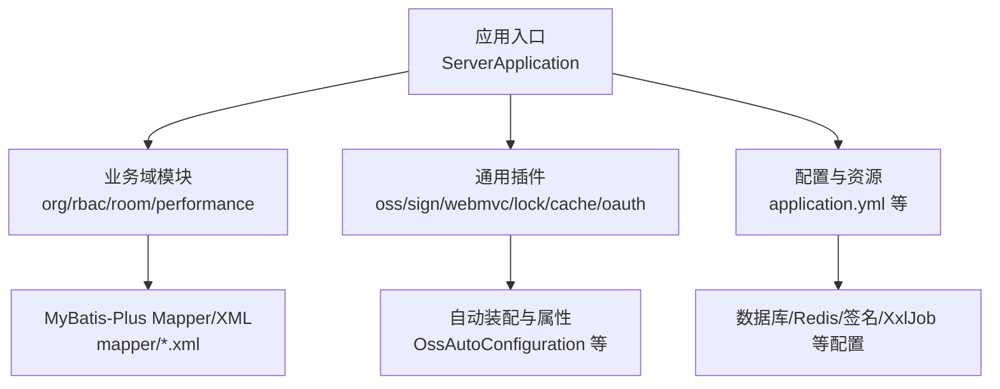
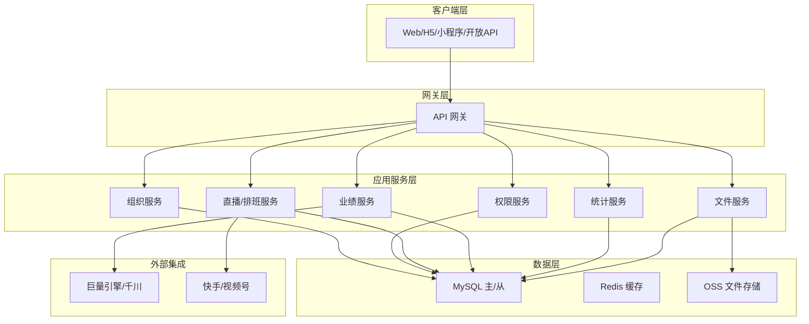
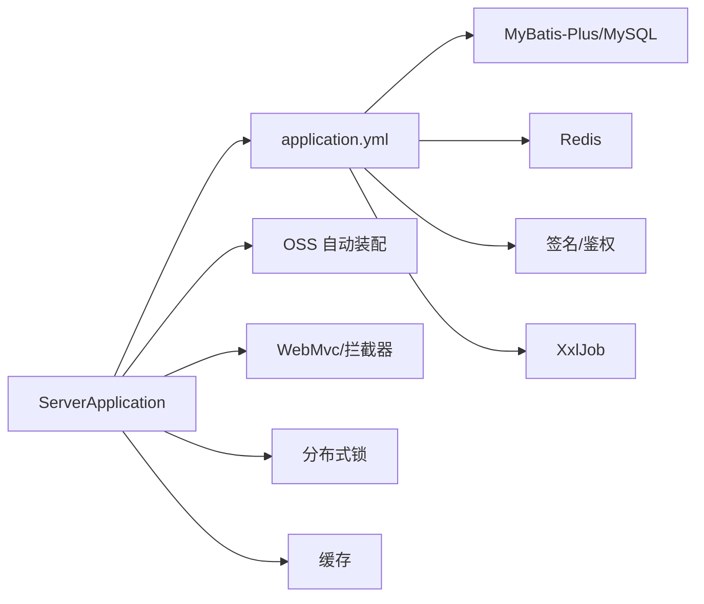

# 开发流程

<cite>
**本文引用的文件**
- [pom.xml](file://pom.xml)
- [application.yml](file://src/main/resources/application.yml)
- [ServerApplication.java](file://src/main/java/com/jiuyu/governance/ServerApplication.java)
- [.gitignore](file://.gitignore)
- [API_DESIGN_STANDARD.md](file://API_DESIGN_STANDARD.md)
- [原始需求文档.md](file://docs/原始需求文档.md)
- [爱复盘企业管理后台 - 人员、排班与业绩需求文档.md](file://docs/爱复盘企业管理后台 - 人员、排班与业绩需求需求文档.md)
- [Org 模块单元测试架构说明](file://src/test/java/com/jiuyu/governance/business/org/README.md)
- [Room 模块单元测试说明](file://src/test/java/com/jiuyu/governance/business/room/README.md)
- [OssAutoConfiguration.java](file://src/main/java/com/jiuyu/governance/plugins/oss/config/OssAutoConfiguration.java)
- [OssProperties.java](file://src/main/java/com/jiuyu/governance/plugins/oss/config/OssProperties.java)
- [OssBucketProperties.java](file://src/main/java/com/jiuyu/governance/plugins/oss/config/OssBucketProperties.java)
- [AbstractStorageService.java](file://src/main/java/com/jiuyu/governance/plugins/oss/storage/AbstractStorageService.java)
- [LiveSessionServiceImpl.java](file://src/main/java/com/jiuyu/governance/business/performance/service/impl/LiveSessionServiceImpl.java)
- [SKILL.md](file://.trae/skills/business-org/SKILL.md)
</cite>

## 目录
1. [简介](#简介)
2. [项目结构](#项目结构)
3. [核心组件](#核心组件)
4. [架构总览](#架构总览)
5. [详细组件分析](#详细组件分析)
6. [依赖分析](#依赖分析)
7. [性能考虑](#性能考虑)
8. [故障排查指南](#故障排查指南)
9. [结论](#结论)
10. [附录](#附录)

## 简介
本开发流程文档面向 fupan-governance-server 项目，覆盖从需求分析到代码提交的全流程，包括分支管理策略、代码评审流程、版本发布流程、CI/CD 配置与使用、开发工具链（Maven 构建、测试执行、打包发布）、以及协作规范与沟通机制。文档以仓库现有配置与代码为依据，结合接口设计规范、测试架构说明与业务技能说明，帮助团队高效协作、稳定交付。

## 项目结构
项目采用 Spring Boot 3.3.0 + Java 17 的标准工程结构，核心模块按业务域划分，包含组织架构、权限与账号、直播间与排班、业绩核算、商品分析、通用插件（OSS、签名、WebMvc、分布式锁、缓存、XxlJob 等）与测试用例。Maven 顶层 POM 管理依赖与构建插件，资源配置位于 resources 目录，测试资源位于 src/test/resources。

图表来源
- [ServerApplication.java:1-19](file://src/main/java/com/jiuyu/governance/ServerApplication.java#L1-L19)
- [pom.xml:1-226](file://pom.xml#L1-L226)
- [application.yml:1-148](file://src/main/resources/application.yml#L1-L148)

章节来源
- [pom.xml:1-226](file://pom.xml#L1-L226)
- [application.yml:1-148](file://src/main/resources/application.yml#L1-L148)
- [ServerApplication.java:1-19](file://src/main/java/com/jiuyu/governance/ServerApplication.java#L1-L19)

## 核心组件
- 应用入口与启动
  - 应用入口类位于 com.jiuyu.governance.ServerApplication，使用 Spring Boot 启动。
- 配置与环境
  - application.yml 定义了服务器端口、优雅停机、Jackson 时区与格式、多环境配置分隔、数据库连接池、MyBatis-Plus、Redis、签名、Jasypt 加密、XxlJob 等。
- 通用插件
  - OSS 自动装配与模板：OssAutoConfiguration、OssProperties、OssBucketProperties、AbstractStorageService。
- 业务服务
  - 以 org/rbac/room/performance 等包为核心，提供组织、权限、直播与排班、业绩核算等服务。
- 测试架构
  - Org 与 Room 模块分别提供测试基类与测试用例，覆盖正常、异常、非法参数场景，强调测试数据隔离与清理。

章节来源
- [ServerApplication.java:1-19](file://src/main/java/com/jiuyu/governance/ServerApplication.java#L1-L19)
- [application.yml:1-148](file://src/main/resources/application.yml#L1-L148)
- [OssAutoConfiguration.java:1-39](file://src/main/java/com/jiuyu/governance/plugins/oss/config/OssAutoConfiguration.java#L1-L39)
- [OssProperties.java:1-60](file://src/main/java/com/jiuyu/governance/plugins/oss/config/OssProperties.java#L1-L60)
- [OssBucketProperties.java:1-62](file://src/main/java/com/jiuyu/governance/plugins/oss/config/OssBucketProperties.java#L1-L62)
- [AbstractStorageService.java:1-53](file://src/main/java/com/jiuyu/governance/plugins/oss/storage/AbstractStorageService.java#L1-L53)
- [Org 模块单元测试架构说明:1-265](file://src/test/java/com/jiuyu/governance/business/org/README.md#L1-L265)
- [Room 模块单元测试说明:1-196](file://src/test/java/com/jiuyu/governance/business/room/README.md#L1-L196)

## 架构总览
系统采用多租户共享数据库架构，业务层按模块划分，通用插件提供基础设施能力，配置集中管理。接口设计遵循统一的 kebab-case 路径、禁止 Path 变量传参、统一 ApiResponse 包装与分页规范。

图表来源
- [application.yml:241-288](file://src/main/resources/application.yml#L241-L288)
- [API_DESIGN_STANDARD.md:7-32](file://API_DESIGN_STANDARD.md#L7-L32)

章节来源
- [application.yml:241-288](file://src/main/resources/application.yml#L241-L288)
- [API_DESIGN_STANDARD.md:1-103](file://API_DESIGN_STANDARD.md#L1-L103)

## 详细组件分析

### 分支管理策略
- 主分支保护
  - master/main 作为受保护主分支，禁止直接推送，必须通过 Pull Request 合并。
  - 合并前要求 CI 通过、代码评审通过、无冲突。
- 功能分支
  - 命名规范：feature/模块名/简述，如 feature/org/add-dept。
  - 分支从 develop 拉取，完成开发后向 develop 提 PR。
- 预发布与热修复
  - release/* 用于预发布版本，hotfix/* 用于紧急修复，均从 main 拉取并在完成后回并到 main 与 develop。

章节来源
- [.gitignore:1-42](file://.gitignore#L1-L42)

### 代码评审流程与标准
- PR 创建
  - 选择合适的目标分支（develop/main），填写标题与描述，关联 Issue。
- 评审要点
  - 接口设计：遵循 API_DESIGN_STANDARD.md 的路径命名、响应格式与分页规范。
  - 业务规则：符合原始需求文档与业务技能说明（如组织架构的级联阻断与名称唯一）。
  - 测试覆盖：新增/修改功能需配套单元测试，参照 Org/Room 模块测试架构。
  - 配置与安全：数据库连接、Redis、签名、加密配置正确，敏感信息使用 Jasypt。
- 合并要求
  - 通过 CI，至少一名 reviewer 同意，修复所有评论，保持提交简洁清晰。

章节来源
- [API_DESIGN_STANDARD.md:1-103](file://API_DESIGN_STANDARD.md#L1-L103)
- [原始需求文档.md:1-800](file://docs/原始需求文档.md#L1-L800)
- [SKILL.md:1-26](file://.trae/skills/business-org/SKILL.md#L1-L26)
- [Org 模块单元测试架构说明:1-265](file://src/test/java/com/jiuyu/governance/business/org/README.md#L1-L265)
- [Room 模块单元测试说明:1-196](file://src/test/java/com/jiuyu/governance/business/room/README.md#L1-L196)

### 版本发布流程
- 版本号管理
  - 使用语义化版本：主版本.次版本.修订号（如 1.0.0）。
  - SNAPSHOT 用于开发版本，稳定发布前清理 SNAPSHOT。
- 发布准备
  - 更新 CHANGELOG，核对依赖版本与许可证。
  - 在 release/* 分支执行构建与集成测试。
- 部署流程
  - 本地构建：mvn clean package（跳过测试可按需开启）。
  - 部署：将生成的可执行包部署至目标环境，配合配置文件切换环境。
- 回滚策略
  - 记录部署版本与配置，出现问题立即回滚至上一稳定版本。

章节来源
- [pom.xml:1-226](file://pom.xml#L1-L226)
- [application.yml:1-148](file://src/main/resources/application.yml#L1-L148)

### 持续集成与持续部署
- CI 配置
  - 使用 Maven 构建与测试（可配置跳过测试标志），生成报告与制品。
- CD 部署
  - 通过流水线将制品部署到测试/预生产/生产环境，结合环境配置文件与密钥管理。
- 监控与日志
  - 启用优雅停机与日志路径配置，便于问题定位与审计。

章节来源
- [pom.xml:170-223](file://pom.xml#L170-L223)
- [application.yml:1-148](file://src/main/resources/application.yml#L1-L148)

### 开发工具链使用指南
- Maven 构建
  - 常用命令：clean、compile、test、package、install、deploy。
  - 跳过测试：mvn -DskipTests 或在 POM 中设置跳过标志。
- 测试执行
  - 单模块测试：mvn test -Dtest="**/business/org/**/*Test"。
  - 指定类/方法：mvn test -Dtest=SubCompanyServiceTest 或 mvn test -Dtest=SubCompanyServiceTest#testAddSubCompany_Success。
  - 测试报告：target/surefire-reports/index.html。
- 打包发布
  - spring-boot-maven-plugin 提供 repackage，生成可执行 jar。
  - 资源包含：Mapper XML 与 YAML/其他资源均纳入打包。

章节来源
- [pom.xml:170-223](file://pom.xml#L170-L223)
- [Org 模块单元测试架构说明:220-236](file://src/test/java/com/jiuyu/governance/business/org/README.md#L220-L236)
- [Room 模块单元测试说明:109-122](file://src/test/java/com/jiuyu/governance/business/room/README.md#L109-L122)

### 协作规范与沟通机制
- 代码规范
  - 接口命名与响应格式：统一 kebab-case、禁止 Path 变量、统一 ApiResponse 包装与分页。
  - 业务规则：严格遵循需求文档与技能说明，避免破坏级联阻断与名称唯一等约束。
- 沟通机制
  - 日常站会、评审会议、Issue 跟踪、PR 评论与审阅。
  - 重大变更需在评审前形成方案文档并达成共识。

章节来源
- [API_DESIGN_STANDARD.md:1-103](file://API_DESIGN_STANDARD.md#L1-L103)
- [原始需求文档.md:1-800](file://docs/原始需求文档.md#L1-L800)
- [SKILL.md:1-26](file://.trae/skills/business-org/SKILL.md#L1-L26)

## 依赖分析
- 模块耦合
  - 业务服务通过 MyBatis-Plus 访问数据库，通用插件提供 OSS、签名、WebMvc、分布式锁、缓存、XxlJob 等能力。
- 外部依赖
  - Spring Boot、Spring Cloud、Spring Cloud Alibaba、MyBatis-Plus、Redis、Apache HttpClient5、Jasypt、阿里云 OSS SDK、XxlJob 等。
- 配置依赖
  - application.yml 中的数据库、Redis、签名、Jasypt、XxlJob 等配置项直接影响运行时行为。

图表来源
- [ServerApplication.java:1-19](file://src/main/java/com/jiuyu/governance/ServerApplication.java#L1-L19)
- [application.yml:1-148](file://src/main/resources/application.yml#L1-L148)
- [OssAutoConfiguration.java:1-39](file://src/main/java/com/jiuyu/governance/plugins/oss/config/OssAutoConfiguration.java#L1-L39)

章节来源
- [pom.xml:35-167](file://pom.xml#L35-L167)
- [application.yml:1-148](file://src/main/resources/application.yml#L1-L148)

## 性能考虑
- 数据库
  - HikariCP 连接池参数、MyBatis-Plus 配置、逻辑删除与索引设计需结合业务热点表优化。
- 缓存
  - Redis 缓存配置与分布式锁策略，减少热点数据竞争与数据库压力。
- 并发与异步
  - XxlJob 任务调度与异步处理，避免阻塞主线程。
- 接口与序列化
  - Jackson 时区与格式、路径匹配策略、分页大小控制，降低网络与解析开销。

章节来源
- [application.yml:42-148](file://src/main/resources/application.yml#L42-L148)
- [pom.xml:35-167](file://pom.xml#L35-L167)

## 故障排查指南
- 启动与配置
  - 检查 application.yml 的 profile、数据库连接、Redis、签名与 XxlJob 配置。
- 接口问题
  - 核对 API_DESIGN_STANDARD.md 的路径命名与响应格式，确认请求参数是否通过 Query/Body 传递。
- 测试与回归
  - 使用 Org/Room 模块测试基类与测试用例，定位 Service 层与 Mapper 层问题。
- 业务规则
  - 遵循 SKILL.md 的组织架构规则，检查是否存在级联阻断导致的删除失败或名称重复校验失败。
- 业务流程
  - 参考原始需求文档的时序图与流程图，定位权限验证、排班冲突、业绩分摊等关键环节。

章节来源
- [API_DESIGN_STANDARD.md:1-103](file://API_DESIGN_STANDARD.md#L1-L103)
- [Org 模块单元测试架构说明:1-265](file://src/test/java/com/jiuyu/governance/business/org/README.md#L1-L265)
- [Room 模块单元测试说明:1-196](file://src/test/java/com/jiuyu/governance/business/room/README.md#L1-L196)
- [SKILL.md:1-26](file://.trae/skills/business-org/SKILL.md#L1-L26)
- [原始需求文档.md:1-800](file://docs/原始需求文档.md#L1-L800)

## 结论
本流程文档以仓库现有配置与代码为基础，明确了从需求到发布的完整开发流程、分支与评审规范、版本与部署策略、工具链使用与协作机制。建议在实际执行中持续完善 CI/CD 与测试覆盖率，强化业务规则与接口规范的自动化校验，确保高质量交付。

## 附录
- 关键流程图与时序图可参考需求文档与接口规范中的图示，结合本文件的架构图与依赖图理解系统整体运行逻辑。