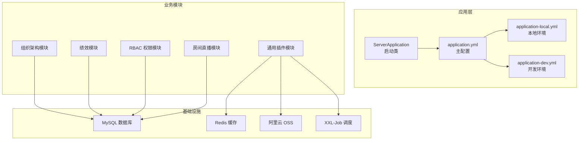
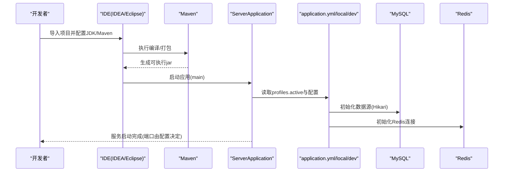
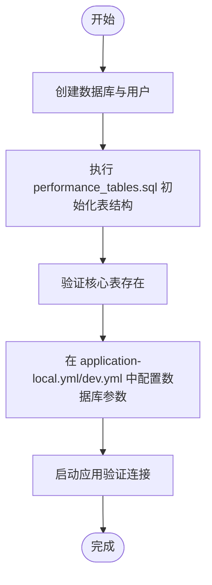
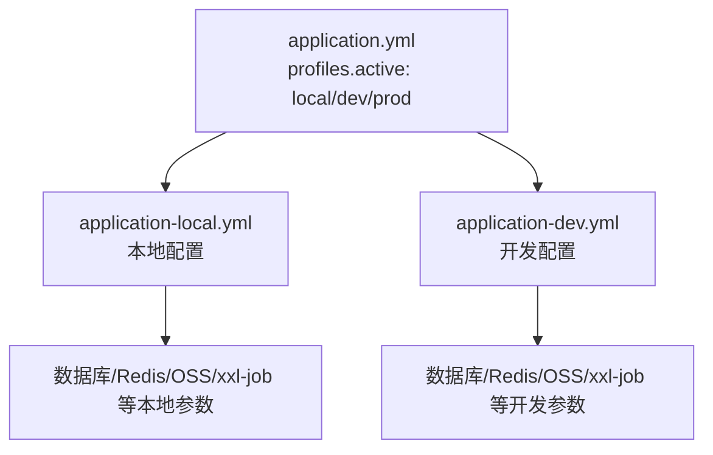
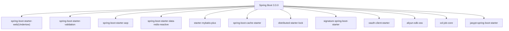

# 开发环境搭建

<cite>
**本文引用的文件**
- [pom.xml](file://pom.xml)
- [application.yml](file://src/main/resources/application.yml)
- [application-local.yml](file://src/main/resources/application-local.yml)
- [application-dev.yml](file://src/main/resources/application-dev.yml)
- [performance_tables.sql](file://src/main/resources/sql/performance_tables.sql)
- [.gitignore](file://.gitignore)
- [ServerApplication.java](file://src/main/java/com/jiuyu/governance/ServerApplication.java)
- [OssProperties.java](file://src/main/java/com/jiuyu/governance/plugins/oss/config/OssProperties.java)
- [XxlJobProperties.java](file://src/main/java/com/jiuyu/governance/plugins/xxljob/XxlJobProperties.java)
- [XxlJobConfiguration.java](file://src/main/java/com/jiuyu/governance/plugins/xxljob/XxlJobConfiguration.java)
- [API_DATA_DICTIONARY.md](file://API_DATA_DICTIONARY.md)
</cite>

## 目录
1. [简介](#简介)
2. [项目结构](#项目结构)
3. [核心组件](#核心组件)
4. [架构概览](#架构概览)
5. [详细组件分析](#详细组件分析)
6. [依赖分析](#依赖分析)
7. [性能考虑](#性能考虑)
8. [故障排查指南](#故障排查指南)
9. [结论](#结论)
10. [附录](#附录)

## 简介
本指南面向 fupan-governance-server 的开发者，提供从零搭建开发环境的完整流程，涵盖硬件与软件要求、JDK 17、MySQL、Redis、Maven 的安装与配置；IDE（IntelliJ IDEA/Eclipse）项目导入步骤、插件配置与调试环境设置；多环境配置文件（local/dev）的使用方法；数据库初始化脚本执行步骤与 Redis 缓存配置；Git 工作流与分支管理策略；以及常见环境问题的排查与解决方案。

## 项目结构
项目采用 Spring Boot 3.3.0 + Maven 构建，核心模块包括组织架构、绩效、RBAC 权限、房间直播、通用插件（签名、OAuth、OSS、短信、WebMvc、xxl-job）等。资源配置通过 application.yml 及其多环境配置文件实现，数据库初始化脚本位于 resources/sql。

图表来源
- [ServerApplication.java:1-19](file://src/main/java/com/jiuyu/governance/ServerApplication.java#L1-L19)
- [application.yml:1-148](file://src/main/resources/application.yml#L1-L148)
- [application-local.yml:1-101](file://src/main/resources/application-local.yml#L1-L101)
- [application-dev.yml:1-109](file://src/main/resources/application-dev.yml#L1-L109)

章节来源
- [pom.xml:1-226](file://pom.xml#L1-L226)
- [application.yml:1-148](file://src/main/resources/application.yml#L1-L148)
- [application-local.yml:1-101](file://src/main/resources/application-local.yml#L1-L101)
- [application-dev.yml:1-109](file://src/main/resources/application-dev.yml#L1-L109)

## 核心组件
- JDK 17：项目使用 Java 17 作为编译与运行版本，确保本地与 CI 环境一致。
- Spring Boot 3.3.0：提供 Web、AOP、Undertow、MyBatis Plus、Redis Reactive、分布式锁、签名、OAuth 客户端、缓存、OSS、xxl-job 等能力。
- Maven：统一依赖管理与打包，支持资源过滤与 MyBatis Mapper XML 打包。
- 多环境配置：通过 application.yml 的 profiles.active 切换 local/dev/prod，各环境独立配置数据库、Redis、线程池、OSS、xxl-job 等。
- 数据库初始化：performance_tables.sql 提供完整的表结构定义，含直播场次、视频、商品、人员业绩、每日统计等核心表。
- Redis：用于分布式锁、缓存、连接池配置，支持密码认证与多数据库选择。
- OSS：阿里云 OSS 配置，支持多桶、内外网 Endpoint、路径前缀、预签名 URL 等。
- xxl-job：分布式任务调度，支持启用开关、管理端地址、执行器端口与日志路径。

章节来源
- [pom.xml:18-32](file://pom.xml#L18-L32)
- [application.yml:13-148](file://src/main/resources/application.yml#L13-L148)
- [application-local.yml:1-101](file://src/main/resources/application-local.yml#L1-L101)
- [application-dev.yml:1-109](file://src/main/resources/application-dev.yml#L1-L109)
- [performance_tables.sql:1-311](file://src/main/resources/sql/performance_tables.sql#L1-L311)
- [OssProperties.java:1-60](file://src/main/java/com/jiuyu/governance/plugins/oss/config/OssProperties.java#L1-L60)
- [XxlJobProperties.java:1-70](file://src/main/java/com/jiuyu/governance/plugins/xxljob/XxlJobProperties.java#L1-L70)
- [XxlJobConfiguration.java:1-37](file://src/main/java/com/jiuyu/governance/plugins/xxljob/XxlJobConfiguration.java#L1-L37)

## 架构概览
应用启动后，根据 profiles.active 读取对应环境配置，连接 MySQL 与 Redis，加载 MyBatis Plus 映射，初始化 OSS 与 xxl-job 组件。业务控制器通过服务层调用 Mapper 访问数据库，插件模块提供签名、OAuth、缓存、短信等横切能力。

图表来源
- [ServerApplication.java:15-17](file://src/main/java/com/jiuyu/governance/ServerApplication.java#L15-L17)
- [application.yml:13-148](file://src/main/resources/application.yml#L13-L148)
- [pom.xml:170-223](file://pom.xml#L170-L223)

## 详细组件分析

### JDK 17 与 Maven 环境准备
- JDK 17：确保 JAVA_HOME 指向 JDK 17，PATH 包含 java/javac。
- Maven：建议使用 3.8+，确保能正确解析 Spring Boot 3.3.0 依赖。
- IDE：推荐 IntelliJ IDEA 或 Eclipse，需安装 Lombok 插件以支持注解处理器。

章节来源
- [pom.xml:18-32](file://pom.xml#L18-L32)

### MySQL 数据库安装与初始化
- 安装 MySQL（版本建议 8.0+），创建数据库与用户，授予必要权限。
- 使用 performance_tables.sql 初始化数据库表结构，包含直播场次、视频、商品、人员业绩、每日统计等核心表。
- 在 application-local.yml 与 application-dev.yml 中配置数据库连接参数（主机、端口、用户名、密码、数据库名、驱动、连接池参数）。

图表来源
- [performance_tables.sql:1-311](file://src/main/resources/sql/performance_tables.sql#L1-L311)
- [application-local.yml:3-14](file://src/main/resources/application-local.yml#L3-L14)
- [application-dev.yml:3-14](file://src/main/resources/application-dev.yml#L3-L14)

章节来源
- [performance_tables.sql:1-311](file://src/main/resources/sql/performance_tables.sql#L1-L311)
- [application-local.yml:3-14](file://src/main/resources/application-local.yml#L3-L14)
- [application-dev.yml:3-14](file://src/main/resources/application-dev.yml#L3-L14)

### Redis 缓存安装与配置
- 安装 Redis（建议 6.0+），配置密码与数据库索引。
- 在 application.yml 中配置 Redis 主机、端口、密码、数据库索引与连接池参数。
- 在 application-local.yml 与 application-dev.yml 中可覆盖 Redis 参数，确保与实际环境一致。

章节来源
- [application.yml:85-100](file://src/main/resources/application.yml#L85-L100)
- [application-local.yml:17-21](file://src/main/resources/application-local.yml#L17-L21)
- [application-dev.yml:17-21](file://src/main/resources/application-dev.yml#L17-L21)

### 多环境配置文件使用
- application.yml 定义了 profiles.active，默认为 local；可切换为 dev/prod。
- application-local.yml：本地开发环境，包含数据库、Redis、线程池、签名、OAuth、OSS、xxl-job 等配置示例。
- application-dev.yml：开发测试环境，包含日志路径、线程池、OSS 网络策略、短信模拟等配置示例。

图表来源
- [application.yml:13-15](file://src/main/resources/application.yml#L13-L15)
- [application-local.yml:1-101](file://src/main/resources/application-local.yml#L1-L101)
- [application-dev.yml:1-109](file://src/main/resources/application-dev.yml#L1-L109)

章节来源
- [application.yml:13-15](file://src/main/resources/application.yml#L13-L15)
- [application-local.yml:1-101](file://src/main/resources/application-local.yml#L1-L101)
- [application-dev.yml:1-109](file://src/main/resources/application-dev.yml#L1-L109)

### IDE（IntelliJ IDEA/Eclipse）项目导入与调试
- IntelliJ IDEA
  - 导入：File → Open → 选择 pom.xml → 选择 Open as Project
  - JDK：Project Settings → Project SDK 设置为 JDK 17
  - Lombok 插件：Enable annotation processing
  - 运行：右键 ServerApplication → Run
- Eclipse
  - 导入：Import → Maven → Existing Maven Projects → 选择项目根目录
  - JDK：Project Properties → Java Build Path → Libraries → Add Library → JRE System Library → JDK 17
  - Lombok 插件：安装 Lombok 并确保注解处理已启用
  - 运行：右键 ServerApplication → Run As → Java Application

章节来源
- [.gitignore:6-25](file://.gitignore#L6-L25)
- [ServerApplication.java:1-19](file://src/main/java/com/jiuyu/governance/ServerApplication.java#L1-L19)

### Git 工作流与分支管理策略
- 分支策略：采用 feature/bugfix/release 分支模型，主分支保持稳定，发布版本打 tag。
- 提交规范：遵循 Conventional Commits，例如 feat: 新增功能，fix: 修复缺陷，docs: 文档更新，chore: 构建脚本等。
- 合并与冲突：优先使用 rebase 合并 feature 分支到 develop，避免产生 merge commit。
- 本地与远程同步：定期 pull --rebase origin develop，push 时使用 --set-upstream。

章节来源
- [.gitignore:1-42](file://.gitignore#L1-L42)

### OSS 配置与使用
- 全局配置：accessKeyId/accessKeySecret/defaultBucket/pathPrefix/network 策略（server-operation/presigned-url）。
- 桶级配置：支持为不同桶设置 bucketName、endpoint、internalEndpoint、region、accessUrl、domain、pathPrefix、useInternal。
- 环境前缀：pathPrefix 默认使用环境名（local/dev），便于区分不同环境的数据路径。

章节来源
- [OssProperties.java:1-60](file://src/main/java/com/jiuyu/governance/plugins/oss/config/OssProperties.java#L1-L60)
- [application-local.yml:61-88](file://src/main/resources/application-local.yml#L61-L88)
- [application-dev.yml:62-88](file://src/main/resources/application-dev.yml#L62-L88)

### xxl-job 配置与启用
- 启用开关：xxl.job.enable 控制是否启用调度器。
- 管理端：addresses、access-token、timeout。
- 执行器：app-name、address/ip/port、日志路径与保留天数。
- 配置类与条件装配：XxlJobProperties 与 XxlJobConfiguration 在 enable=true 时初始化执行器。

章节来源
- [application.yml:124-148](file://src/main/resources/application.yml#L124-L148)
- [application-local.yml:89-101](file://src/main/resources/application-local.yml#L89-L101)
- [application-dev.yml:90-102](file://src/main/resources/application-dev.yml#L90-L102)
- [XxlJobProperties.java:1-70](file://src/main/java/com/jiuyu/governance/plugins/xxljob/XxlJobProperties.java#L1-L70)
- [XxlJobConfiguration.java:1-37](file://src/main/java/com/jiuyu/governance/plugins/xxljob/XxlJobConfiguration.java#L1-L37)

## 依赖分析
项目基于 Spring Boot 3.3.0，核心依赖包括 Undertow Web 服务器、MyBatis Plus、Redis Reactive、分布式锁、签名、OAuth 客户端、缓存、OSS、xxl-job、Jasypt 加密等。Maven 插件负责主类配置与资源打包，确保 Mapper XML 与 YAML 资源被正确打包。

图表来源
- [pom.xml:35-167](file://pom.xml#L35-L167)

章节来源
- [pom.xml:35-167](file://pom.xml#L35-L167)

## 性能考虑
- 连接池：HikariCP 最大连接数与空闲超时、心跳检测参数需结合业务并发调整。
- Redis：连接池大小、阻塞等待时间、空闲连接数应与请求峰值匹配。
- 线程池：根据任务类型（IO 密集/计算密集）合理配置核心线程数、最大线程数与队列容量。
- 日志：生产环境建议落盘至外部目录，避免磁盘 IO 抖动。
- 缓存：热点数据使用 Redis 缓存，注意过期策略与内存淘汰。

## 故障排查指南
- 启动失败（端口占用）
  - 检查 application.yml 中 server.port 配置，确保未被占用。
  - 若端口冲突，临时修改为其他可用端口。
- 数据库连接异常
  - 核对 application-local.yml/dev.yml 中 db.host/db.name/db.username/db.password。
  - 确认 MySQL 服务运行与网络可达，防火墙放行端口。
- Redis 连接异常
  - 核对 application.yml 中 redis.ip/redis.port/redis.password/redis.database。
  - 确认 Redis 服务运行与密码正确。
- MyBatis Plus 映射错误
  - 确认 Mapper XML 路径与命名空间一致，资源打包包含 XML。
- OSS 上传失败
  - 核对 accessKeyId/accessKeySecret/defaultBucket/pathPrefix。
  - 检查桶权限与跨域配置，确认 Endpoint 与 Region 正确。
- xxl-job 启动失败
  - 检查 xxl.job.enable、admin.addresses、executor.port 与日志路径。
- 端到端测试
  - 使用 API_DATA_DICTIONARY.md 中的接口文档进行功能验证，定位问题范围。

章节来源
- [application.yml:1-148](file://src/main/resources/application.yml#L1-L148)
- [application-local.yml:1-101](file://src/main/resources/application-local.yml#L1-L101)
- [application-dev.yml:1-109](file://src/main/resources/application-dev.yml#L1-L109)
- [API_DATA_DICTIONARY.md:1-415](file://API_DATA_DICTIONARY.md#L1-L415)

## 结论
通过本指南，开发者可在本地快速搭建 fupan-governance-server 的开发环境，掌握多环境配置、数据库初始化、Redis 缓存、OSS 与 xxl-job 的配置要点，并建立规范的 Git 工作流与调试流程。遇到问题时，可依据故障排查指南逐项定位并解决。

## 附录
- 快速检查清单
  - JDK 17 已安装并配置 JAVA_HOME
  - Maven 已安装并可正常构建
  - MySQL 已安装并执行 performance_tables.sql
  - Redis 已安装并可连接
  - application.yml 中 profiles.active 设置正确
  - application-local.yml/dev.yml 中数据库/Redis/OSS/xxl-job 参数已填写
  - IDE 已启用 Lombok 注解处理
  - 启动 ServerApplication 成功