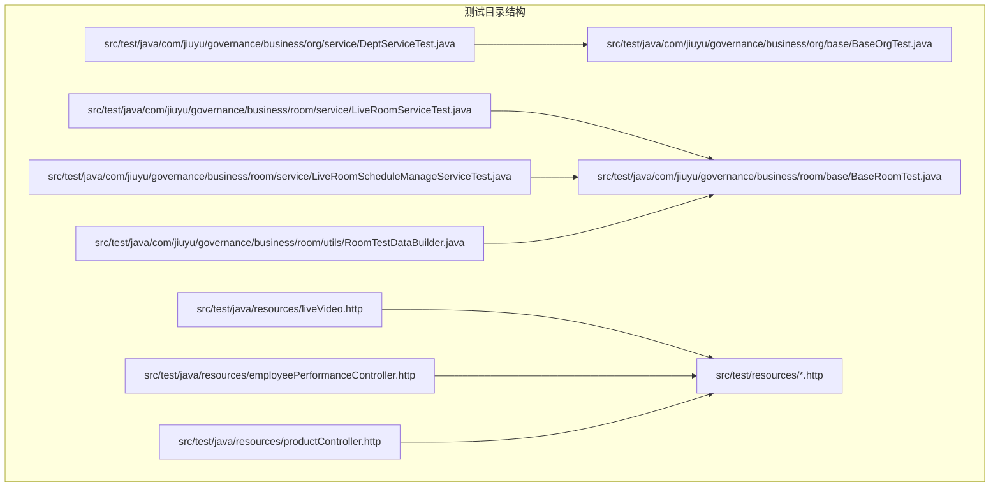
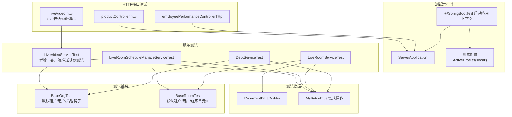
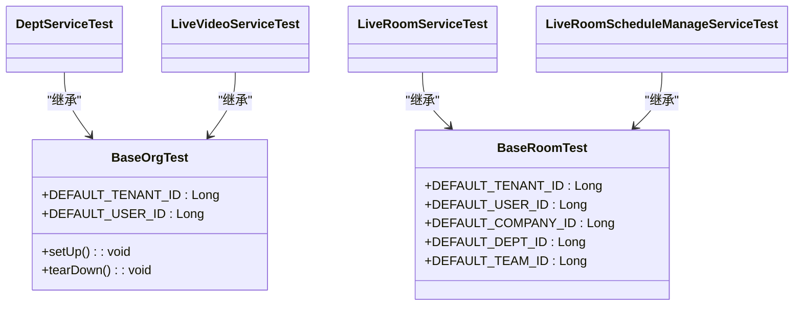
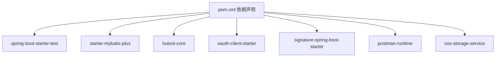

# 测试指南

<cite>
**本文引用的文件**
- [BaseOrgTest.java](file://src/test/java/com/jiuyu/governance/business/org/base/BaseOrgTest.java)
- [BaseRoomTest.java](file://src/test/java/com/jiuyu/governance/business/room/base/BaseRoomTest.java)
- [DeptServiceTest.java](file://src/test/java/com/jiuyu/governance/business/org/service/DeptServiceTest.java)
- [LiveRoomServiceTest.java](file://src/test/java/com/jiuyu/governance/business/room/service/LiveRoomServiceTest.java)
- [LiveRoomScheduleManageServiceTest.java](file://src/test/java/com/jiuyu/governance/business/room/service/LiveRoomScheduleManageServiceTest.java)
- [RoomTestDataBuilder.java](file://src/test/java/com/jiuyu/governance/business/room/utils/RoomTestDataBuilder.java)
- [LiveVideoController.java](file://src/main/java/com/jiuyu/governance/business/performance/controller/LiveVideoController.java)
- [LiveVideoService.java](file://src/main/java/com/jiuyu/governance/business/performance/service/LiveVideoService.java)
- [LiveVideoServiceImpl.java](file://src/main/java/com/jiuyu/governance/business/performance/service/impl/LiveVideoServiceImpl.java)
- [ClientPushVideoRequest.java](file://src/main/java/com/jiuyu/governance/business/performance/pojo/request/ClientPushVideoRequest.java)
- [liveVideo.http](file://src/test/java/resources/liveVideo.http)
- [employeePerformanceController.http](file://src/test/java/resources/employeePerformanceController.http)
- [productController.http](file://src/test/java/resources/productController.http)
- [pom.xml](file://pom.xml)
</cite>

## 目录
1. [简介](#简介)
2. [项目结构](#项目结构)
3. [核心组件](#核心组件)
4. [架构总览](#架构总览)
5. [详细组件分析](#详细组件分析)
6. [依赖分析](#依赖分析)
7. [性能考虑](#性能考虑)
8. [故障排查指南](#故障排查指南)
9. [结论](#结论)
10. [附录](#附录)

## 简介
本测试指南面向 fupan-governance-server 的测试实践，聚焦单元测试与集成测试的编写方法，涵盖 JUnit 5 使用、测试用例设计原则、测试基类设计与继承关系、Mock 数据准备与测试数据管理策略、HTTP 接口测试（RESTful API）以及测试覆盖率要求与提升建议。文档同时提供测试环境配置与测试数据库使用方法，并总结常见问题与调试技巧，帮助开发者高效构建高质量的测试体系。

**更新** 新增了客户端推送视频功能的HTTP测试资源，包含570行结构化HTTP请求，用于验证直播视频数据推送的完整流程。

## 项目结构
测试代码位于 src/test 下，按业务模块划分：
- org 模块测试基类与服务测试
- room 模块测试基类、服务测试与测试数据构建工具
- performance 模块新增视频推送测试
- HTTP 接口测试脚本资源

**图表来源**
- [BaseOrgTest.java:1-48](file://src/test/java/com/jiuyu/governance/business/org/base/BaseOrgTest.java#L1-L48)
- [DeptServiceTest.java:1-482](file://src/test/java/com/jiuyu/governance/business/org/service/DeptServiceTest.java#L1-L482)
- [BaseRoomTest.java](file://src/test/java/com/jiuyu/governance/business/room/base/BaseRoomTest.java)
- [LiveRoomServiceTest.java:1-382](file://src/test/java/com/jiuyu/governance/business/room/service/LiveRoomServiceTest.java#L1-L382)
- [LiveRoomScheduleManageServiceTest.java:1-461](file://src/test/java/com/jiuyu/governance/business/room/service/LiveRoomScheduleManageServiceTest.java#L1-L461)
- [RoomTestDataBuilder.java](file://src/test/java/com/jiuyu/governance/business/room/utils/RoomTestDataBuilder.java)
- [liveVideo.http:1-570](file://src/test/java/resources/liveVideo.http#L1-L570)

**章节来源**
- [BaseOrgTest.java:1-48](file://src/test/java/com/jiuyu/governance/business/org/base/BaseOrgTest.java#L1-L48)
- [BaseRoomTest.java](file://src/test/java/com/jiuyu/governance/business/room/base/BaseRoomTest.java)
- [DeptServiceTest.java:1-482](file://src/test/java/com/jiuyu/governance/business/org/service/DeptServiceTest.java#L1-L482)
- [LiveRoomServiceTest.java:1-382](file://src/test/java/com/jiuyu/governance/business/room/service/LiveRoomServiceTest.java#L1-L382)
- [LiveRoomScheduleManageServiceTest.java:1-461](file://src/test/java/com/jiuyu/governance/business/room/service/LiveRoomScheduleManageServiceTest.java#L1-L461)
- [RoomTestDataBuilder.java](file://src/test/java/com/jiuyu/governance/business/room/utils/RoomTestDataBuilder.java)
- [liveVideo.http:1-570](file://src/test/java/resources/liveVideo.http#L1-L570)

## 核心组件
- 测试基类
  - org 模块基类：提供 Spring Boot 测试环境、默认租户与用户标识、测试前后清理钩子等能力
  - room 模块基类：提供房间域测试通用能力（如默认租户、默认用户、默认组织单元 ID 等）
- 服务层测试
  - 部门服务测试：覆盖新增/修改/删除/查询、异常与非法参数校验、辅助数据构造
  - 直播间服务测试：覆盖直播间 CRUD、状态变更、分页与搜索、排班属性设置与查询
  - 直播间排班管理服务测试：覆盖排班新增/批量生成、查询（范围/分页）、人员添加/移除、修改/删除、冲突检测
- HTTP 接口测试
  - 新增客户端推送视频测试：包含570行结构化HTTP请求，覆盖初始数据推送、后续更新和进程数据更新等场景
  - 其他业务模块HTTP测试：员工绩效、商品排行等接口测试
- 测试数据构建工具
  - 房间域测试数据构建器：封装常用测试数据构造方法，便于复用

**章节来源**
- [BaseOrgTest.java:1-48](file://src/test/java/com/jiuyu/governance/business/org/base/BaseOrgTest.java#L1-L48)
- [BaseRoomTest.java](file://src/test/java/com/jiuyu/governance/business/room/base/BaseRoomTest.java)
- [DeptServiceTest.java:1-482](file://src/test/java/com/jiuyu/governance/business/org/service/DeptServiceTest.java#L1-L482)
- [LiveRoomServiceTest.java:1-382](file://src/test/java/com/jiuyu/governance/business/room/service/LiveRoomServiceTest.java#L1-L382)
- [LiveRoomScheduleManageServiceTest.java:1-461](file://src/test/java/com/jiuyu/governance/business/room/service/LiveRoomScheduleManageServiceTest.java#L1-L461)
- [RoomTestDataBuilder.java](file://src/test/java/com/jiuyu/governance/business/room/utils/RoomTestDataBuilder.java)
- [liveVideo.http:1-570](file://src/test/java/resources/liveVideo.http#L1-L570)

## 架构总览
测试架构围绕"测试基类 + 业务服务测试 + 测试数据构建 + HTTP接口测试"的模式展开，通过 Spring Boot 测试注解加载应用上下文，结合 MyBatis-Plus 链式操作进行数据库断言，确保测试隔离与可重复性。

**图表来源**
- [BaseOrgTest.java:1-48](file://src/test/java/com/jiuyu/governance/business/org/base/BaseOrgTest.java#L1-L48)
- [BaseRoomTest.java](file://src/test/java/com/jiuyu/governance/business/room/base/BaseRoomTest.java)
- [DeptServiceTest.java:1-482](file://src/test/java/com/jiuyu/governance/business/org/service/DeptServiceTest.java#L1-L482)
- [LiveRoomServiceTest.java:1-382](file://src/test/java/com/jiuyu/governance/business/room/service/LiveRoomServiceTest.java#L1-L382)
- [LiveRoomScheduleManageServiceTest.java:1-461](file://src/test/java/com/jiuyu/governance/business/room/service/LiveRoomScheduleManageServiceTest.java#L1-L461)
- [RoomTestDataBuilder.java](file://src/test/java/com/jiuyu/governance/business/room/utils/RoomTestDataBuilder.java)
- [LiveVideoController.java:1-69](file://src/main/java/com/jiuyu/governance/business/performance/controller/LiveVideoController.java#L1-L69)
- [LiveVideoService.java:1-94](file://src/main/java/com/jiuyu/governance/business/performance/service/LiveVideoService.java#L1-L94)
- [LiveVideoServiceImpl.java:1-766](file://src/main/java/com/jiuyu/governance/business/performance/service/impl/LiveVideoServiceImpl.java#L1-L766)
- [ClientPushVideoRequest.java:1-84](file://src/main/java/com/jiuyu/governance/business/performance/pojo/request/ClientPushVideoRequest.java#L1-L84)
- [liveVideo.http:1-570](file://src/test/java/resources/liveVideo.http#L1-L570)

## 详细组件分析

### 测试基类设计与使用
- BaseOrgTest（org 模块）
  - 作用：提供 Spring Boot 测试环境、默认租户与用户标识、测试前后清理钩子；子类可重写 setUp/tearDown 完成具体初始化与收尾
  - 关键点：通过 @SpringBootTest 加载 ServerApplication，@ActiveProfiles("local") 指定测试环境
- BaseRoomTest（room 模块）
  - 作用：提供房间域测试通用常量（默认租户、默认用户、默认公司/部门/团队 ID），作为房间域测试的父类

**图表来源**
- [BaseOrgTest.java:1-48](file://src/test/java/com/jiuyu/governance/business/org/base/BaseOrgTest.java#L1-L48)
- [BaseRoomTest.java](file://src/test/java/com/jiuyu/governance/business/room/base/BaseRoomTest.java)
- [DeptServiceTest.java:1-482](file://src/test/java/com/jiuyu/governance/business/org/service/DeptServiceTest.java#L1-L482)
- [LiveRoomServiceTest.java:1-382](file://src/test/java/com/jiuyu/governance/business/room/service/LiveRoomServiceTest.java#L1-L382)
- [LiveRoomScheduleManageServiceTest.java:1-461](file://src/test/java/com/jiuyu/governance/business/room/service/LiveRoomScheduleManageServiceTest.java#L1-L461)

**章节来源**
- [BaseOrgTest.java:1-48](file://src/test/java/com/jiuyu/governance/business/org/base/BaseOrgTest.java#L1-L48)
- [BaseRoomTest.java](file://src/test/java/com/jiuyu/governance/business/room/base/BaseRoomTest.java)

### 单元测试与集成测试编写方法
- JUnit 5 使用
  - 使用 @Test、@BeforeEach、@AfterEach 组织测试生命周期
  - 使用断言（如 assertEquals、assertTrue、assertFalse、assertNotNull、assertThrows）进行结果验证
- 测试用例设计原则
  - 正常场景：覆盖新增/修改/删除/查询主流程
  - 异常场景：数据不存在、名称重复、关联数据检查等
  - 非法参数：null、空字符串、超长文本等边界条件
- 示例参考
  - 部门服务测试：覆盖新增/修改/删除/分页/存在性/查询/名称映射/下拉选项等，并包含异常与非法参数测试
  - 直播间服务测试：覆盖新增/修改/删除/启用/停用/分页/详情/搜索/排班属性设置与查询
  - 直播间排班管理测试：覆盖排班新增/批量生成、范围/分页查询、人员添加/移除、修改/删除、冲突检测

**章节来源**
- [DeptServiceTest.java:1-482](file://src/test/java/com/jiuyu/governance/business/org/service/DeptServiceTest.java#L1-L482)
- [LiveRoomServiceTest.java:1-382](file://src/test/java/com/jiuyu/governance/business/room/service/LiveRoomServiceTest.java#L1-L382)
- [LiveRoomScheduleManageServiceTest.java:1-461](file://src/test/java/com/jiuyu/governance/business/room/service/LiveRoomScheduleManageServiceTest.java#L1-L461)

### 测试数据准备与管理策略
- 测试前清理
  - 在 @BeforeEach 中清理以默认租户 ID 和命名规则开头的脏数据，避免跨用例污染
- 测试后清理
  - 在 @AfterEach 中清理测试创建的数据，保证测试环境干净
- 辅助数据构造
  - 部门服务测试中提供 createTestCompany 与 createTestDept 方法，统一构造测试实体并插入数据库
  - 直播间服务测试中提供 buildLiveRoomAddRequest 与 createTestLiveRoom，统一构造直播间请求与实体
  - 直播间排班管理测试中提供 buildScheduleAddRequest、getOrCreateTestLiveRoom、createTestSchedule 等方法
- 测试数据构建工具
  - RoomTestDataBuilder 提供房间域测试常用数据构造方法，便于复用

**章节来源**
- [DeptServiceTest.java:62-81](file://src/test/java/com/jiuyu/governance/business/org/service/DeptServiceTest.java#L62-L81)
- [DeptServiceTest.java:436-480](file://src/test/java/com/jiuyu/governance/business/org/service/DeptServiceTest.java#L436-L480)
- [LiveRoomServiceTest.java:338-380](file://src/test/java/com/jiuyu/governance/business/room/service/LiveRoomServiceTest.java#L338-L380)
- [LiveRoomScheduleManageServiceTest.java:335-460](file://src/test/java/com/jiuyu/governance/business/room/service/LiveRoomScheduleManageServiceTest.java#L335-L460)
- [RoomTestDataBuilder.java](file://src/test/java/com/jiuyu/governance/business/room/utils/RoomTestDataBuilder.java)

### HTTP 接口测试（RESTful API）
- 测试脚本
  - 项目在 src/test/resources 下提供 HTTP 测试脚本（如 employeePerformanceController.http、productController.http、liveVideo.http），可用于手动或 IDE 插件驱动的 REST API 测试
  - **新增** liveVideo.http 包含570行结构化HTTP请求，专门用于测试客户端推送视频功能
- 编写要点
  - 明确请求方法、URL、请求头与请求体
  - 验证响应状态码、响应头与响应体结构
  - 使用测试数据准备接口前后的数据一致性进行断言
  - 结合测试基类提供的默认租户与用户标识，确保请求上下文正确
- **新增** 客户端推送视频测试场景
  - 场景1：首次推送 - 新增记录，包含直播过程数据和商品列表
  - 场景2：后续推送 - 数据有变化，更新现有记录
  - 场景3：进程数据更新 - 数据无变化，仅更新过程数据

**章节来源**
- [liveVideo.http:1-570](file://src/test/java/resources/liveVideo.http#L1-L570)
- [employeePerformanceController.http:1-284](file://src/test/java/resources/employeePerformanceController.http#L1-L284)
- [productController.http:1-276](file://src/test/java/resources/productController.http#L1-L276)
- [pom.xml:153-155](file://pom.xml#L153-L155)

### 测试覆盖率要求与提升建议
- 覆盖率目标
  - 建议关键业务模块（org/room/performance/rbac）达到行覆盖率与分支覆盖率均不低于 80%
  - **新增** 视频推送模块建议达到70%以上覆盖率
- 提升策略
  - 补充边界与异常场景用例（空值、超长、非法格式、并发冲突）
  - 对复杂流程（如排班生成、状态切换、视频数据合并）增加组合场景测试
  - 使用测试数据构建工具统一构造多组输入，扩大测试矩阵
  - 对外部依赖（如签名、缓存、分布式锁、OSS存储）采用桩/替身或本地化配置降低耦合
  - **新增** 利用HTTP测试脚本覆盖完整的端到端流程

**章节来源**
- [LiveVideoController.java:1-69](file://src/main/java/com/jiuyu/governance/business/performance/controller/LiveVideoController.java#L1-L69)
- [LiveVideoService.java:1-94](file://src/main/java/com/jiuyu/governance/business/performance/service/LiveVideoService.java#L1-L94)
- [LiveVideoServiceImpl.java:1-766](file://src/main/java/com/jiuyu/governance/business/performance/service/impl/LiveVideoServiceImpl.java#L1-L766)
- [ClientPushVideoRequest.java:1-84](file://src/main/java/com/jiuyu/governance/business/performance/pojo/request/ClientPushVideoRequest.java#L1-L84)

## 依赖分析
- 测试框架与工具
  - JUnit 5：测试生命周期与断言
  - Spring Boot Test：加载应用上下文与自动配置
  - MyBatis-Plus 链式操作：简化数据库断言与查询
  - Hutool：随机数与 ID 工具
  - **新增** Postman Collection：支持HTTP接口测试
- 外部依赖
  - OAuth、签名、分布式锁等插件在测试中可通过本地化配置或桩对象处理
  - **新增** OSS存储服务：用于视频过程数据的存储与检索

**图表来源**
- [pom.xml:1-226](file://pom.xml#L1-L226)

**章节来源**
- [pom.xml:1-226](file://pom.xml#L1-L226)

## 性能考虑
- 测试隔离与速度
  - 使用 @BeforeEach/@AfterEach 清理测试数据，避免跨用例累积导致性能退化
  - 尽量减少对真实外部系统的调用，必要时使用本地化配置或桩对象
  - **新增** HTTP测试中避免频繁调用真实API，使用本地化配置
- 并发与事务
  - 避免在单测中模拟真实高并发，优先通过合理用例设计覆盖边界条件
  - 对数据库写操作进行最小化与可预测性控制
  - **新增** 视频数据推送涉及OSS存储，注意控制并发度避免限流

**章节来源**
- [LiveVideoServiceImpl.java:410-458](file://src/main/java/com/jiuyu/governance/business/performance/service/impl/LiveVideoServiceImpl.java#L410-L458)

## 故障排查指南
- 常见问题
  - 测试数据未清理导致后续用例失败：检查 @BeforeEach/@AfterEach 的清理逻辑是否覆盖了所有相关表
  - 租户/用户上下文缺失：确认测试基类是否正确设置默认租户与用户标识
  - 外部依赖异常：检查相关 starter 是否在测试配置中启用或替换为本地化实现
  - **新增** HTTP测试失败：检查token配置、baseUrl设置、请求格式是否正确
  - **新增** 视频数据推送失败：检查OSS存储配置、数据合并逻辑、过程数据去重算法
- 调试技巧
  - 使用日志输出关键步骤与中间结果（如创建的实体 ID、查询条件）
  - 逐步缩小断言范围，定位失败点
  - 对复杂流程绘制顺序图，明确各阶段输入输出
  - **新增** 利用HTTP测试脚本的分步执行，定位具体的失败环节

**章节来源**
- [LiveVideoServiceImpl.java:463-542](file://src/main/java/com/jiuyu/governance/business/performance/service/impl/LiveVideoServiceImpl.java#L463-L542)
- [liveVideo.http:1-570](file://src/test/java/resources/liveVideo.http#L1-L570)

## 结论
通过规范的测试基类设计、完善的测试用例覆盖、严谨的测试数据管理与合理的 HTTP 接口测试，可以有效保障 fupan-governance-server 的质量与稳定性。新增的客户端推送视频功能测试进一步完善了测试体系，建议持续完善覆盖率与边界场景，优化测试执行效率，并建立标准化的测试流程与规范。

**更新** 新增的570行HTTP测试脚本为视频推送功能提供了全面的端到端测试覆盖，确保了直播数据推送流程的可靠性。

## 附录
- 测试基类与服务测试文件清单
  - org 模块：BaseOrgTest、DeptServiceTest
  - room 模块：BaseRoomTest、LiveRoomServiceTest、LiveRoomScheduleManageServiceTest、RoomTestDataBuilder
  - **新增** performance 模块：LiveVideoController、LiveVideoService、LiveVideoServiceImpl
- HTTP测试文件清单
  - **新增** liveVideo.http：570行结构化请求，覆盖视频推送完整流程
  - employeePerformanceController.http：员工绩效相关接口测试
  - productController.http：商品排行相关接口测试
- 参考路径
  - [BaseOrgTest.java:1-48](file://src/test/java/com/jiuyu/governance/business/org/base/BaseOrgTest.java#L1-L48)
  - [BaseRoomTest.java](file://src/test/java/com/jiuyu/governance/business/room/base/BaseRoomTest.java)
  - [DeptServiceTest.java:1-482](file://src/test/java/com/jiuyu/governance/business/org/service/DeptServiceTest.java#L1-L482)
  - [LiveRoomServiceTest.java:1-382](file://src/test/java/com/jiuyu/governance/business/room/service/LiveRoomServiceTest.java#L1-L382)
  - [LiveRoomScheduleManageServiceTest.java:1-461](file://src/test/java/com/jiuyu/governance/business/room/service/LiveRoomScheduleManageServiceTest.java#L1-L461)
  - [RoomTestDataBuilder.java](file://src/test/java/com/jiuyu/governance/business/room/utils/RoomTestDataBuilder.java)
  - [LiveVideoController.java:1-69](file://src/main/java/com/jiuyu/governance/business/performance/controller/LiveVideoController.java#L1-L69)
  - [LiveVideoService.java:1-94](file://src/main/java/com/jiuyu/governance/business/performance/service/LiveVideoService.java#L1-L94)
  - [LiveVideoServiceImpl.java:1-766](file://src/main/java/com/jiuyu/governance/business/performance/service/impl/LiveVideoServiceImpl.java#L1-L766)
  - [ClientPushVideoRequest.java:1-84](file://src/main/java/com/jiuyu/governance/business/performance/pojo/request/ClientPushVideoRequest.java#L1-L84)
  - [liveVideo.http:1-570](file://src/test/java/resources/liveVideo.http#L1-L570)
  - [employeePerformanceController.http:1-284](file://src/test/java/resources/employeePerformanceController.http#L1-L284)
  - [productController.http:1-276](file://src/test/java/resources/productController.http#L1-L276)
  - [pom.xml:1-226](file://pom.xml#L1-L226)