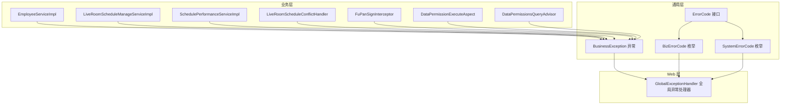
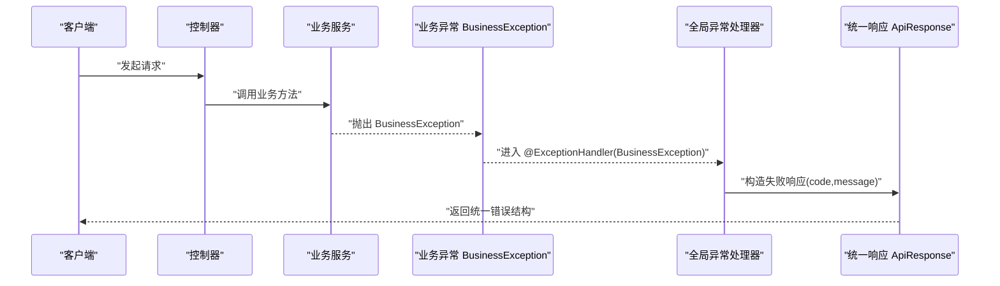
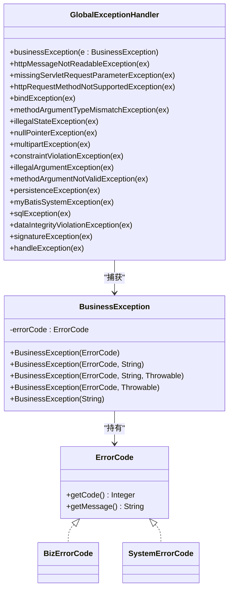

# 异常处理

<cite>
**本文引用的文件**
- [BusinessException.java](file://src/main/java/com/jiuyu/governance/common/exceptions/BusinessException.java)
- [ErrorCode.java](file://src/main/java/com/jiuyu/governance/common/pojo/ErrorCode.java)
- [BizErrorCode.java](file://src/main/java/com/jiuyu/governance/common/pojo/BizErrorCode.java)
- [SystemErrorCode.java](file://src/main/java/com/jiuyu/governance/common/pojo/SystemErrorCode.java)
- [GlobalExceptionHandler.java](file://src/main/java/com/jiuyu/governance/plugins/webmvc/GlobalExceptionHandler.java)
- [ERROR_CODE_DICT.md](file://ERROR_CODE_DICT.md)
- [EmployeeServiceImpl.java](file://src/main/java/com/jiuyu/governance/business/rbac/service/impl/EmployeeServiceImpl.java)
- [LiveRoomScheduleManageServiceImpl.java](file://src/main/java/com/jiuyu/governance/business/room/service/impl/LiveRoomScheduleManageServiceImpl.java)
- [SchedulePerformanceServiceImpl.java](file://src/main/java/com/jiuyu/governance/business/performance/service/impl/SchedulePerformanceServiceImpl.java)
- [LiveRoomScheduleConflictHandler.java](file://src/main/java/com/jiuyu/governance/business/room/service/handler/LiveRoomScheduleConflictHandler.java)
- [FuPanSignInterceptor.java](file://src/main/java/com/jiuyu/governance/plugins/http/FuPanSignInterceptor.java)
- [DataPermissionExecuteAspect.java](file://src/main/java/com/jiuyu/governance/plugins/oauth/data/aop/DataPermissionExecuteAspect.java)
- [DataPermissionsQueryAdvisor.java](file://src/main/java/com/jiuyu/governance/plugins/oauth/data/aop/DataPermissionsQueryAdvisor.java)
</cite>

## 目录
1. [简介](#简介)
2. [项目结构](#项目结构)
3. [核心组件](#核心组件)
4. [架构总览](#架构总览)
5. [详细组件分析](#详细组件分析)
6. [依赖分析](#依赖分析)
7. [性能考量](#性能考量)
8. [故障排查指南](#故障排查指南)
9. [结论](#结论)
10. [附录](#附录)

## 简介
本文件系统化梳理 fupan-governance-server 的异常处理机制，涵盖全局异常处理框架的设计与实现、BusinessException 自定义异常类的使用方式、错误码体系（业务错误码与系统错误码）的分类与编号规则、完整的错误码字典、最佳实践（异常捕获、日志记录、用户提示与系统恢复）、以及与国际化、日志系统和监控系统的集成建议。同时提供常见异常场景的处理示例与排查方法，帮助开发者建立统一的异常处理规范与调试指南。

## 项目结构
异常处理相关的核心代码集中在以下模块：
- 通用异常与错误码定义：common.exceptions、common.pojo
- 全局异常处理器：plugins.webmvc.GlobalExceptionHandler
- 业务侧异常抛出与使用：各业务 service 实现类
- 错误码字典与设计规范：ERROR_CODE_DICT.md

图表来源
- [BusinessException.java:1-49](file://src/main/java/com/jiuyu/governance/common/exceptions/BusinessException.java#L1-L49)
- [ErrorCode.java:1-25](file://src/main/java/com/jiuyu/governance/common/pojo/ErrorCode.java#L1-L25)
- [BizErrorCode.java:1-55](file://src/main/java/com/jiuyu/governance/common/pojo/BizErrorCode.java#L1-L55)
- [SystemErrorCode.java:1-38](file://src/main/java/com/jiuyu/governance/common/pojo/SystemErrorCode.java#L1-L38)
- [GlobalExceptionHandler.java:1-377](file://src/main/java/com/jiuyu/governance/plugins/webmvc/GlobalExceptionHandler.java#L1-L377)
- [EmployeeServiceImpl.java:90-289](file://src/main/java/com/jiuyu/governance/business/rbac/service/impl/EmployeeServiceImpl.java#L90-L289)
- [LiveRoomScheduleManageServiceImpl.java:100-299](file://src/main/java/com/jiuyu/governance/business/room/service/impl/LiveRoomScheduleManageServiceImpl.java#L100-L299)
- [SchedulePerformanceServiceImpl.java:532-581](file://src/main/java/com/jiuyu/governance/business/performance/service/impl/SchedulePerformanceServiceImpl.java#L532-L581)
- [LiveRoomScheduleConflictHandler.java:166-242](file://src/main/java/com/jiuyu/governance/business/room/service/handler/LiveRoomScheduleConflictHandler.java#L166-L242)
- [FuPanSignInterceptor.java:103-103](file://src/main/java/com/jiuyu/governance/plugins/http/FuPanSignInterceptor.java#L103-L103)
- [DataPermissionExecuteAspect.java:290-290](file://src/main/java/com/jiuyu/governance/plugins/oauth/data/aop/DataPermissionExecuteAspect.java#L290-L290)
- [DataPermissionsQueryAdvisor.java:164-164](file://src/main/java/com/jiuyu/governance/plugins/oauth/data/aop/DataPermissionsQueryAdvisor.java#L164-L164)

章节来源
- [BusinessException.java:1-49](file://src/main/java/com/jiuyu/governance/common/exceptions/BusinessException.java#L1-L49)
- [ErrorCode.java:1-25](file://src/main/java/com/jiuyu/governance/common/pojo/ErrorCode.java#L1-L25)
- [BizErrorCode.java:1-55](file://src/main/java/com/jiuyu/governance/common/pojo/BizErrorCode.java#L1-L55)
- [SystemErrorCode.java:1-38](file://src/main/java/com/jiuyu/governance/common/pojo/SystemErrorCode.java#L1-L38)
- [GlobalExceptionHandler.java:1-377](file://src/main/java/com/jiuyu/governance/plugins/webmvc/GlobalExceptionHandler.java#L1-L377)
- [ERROR_CODE_DICT.md:1-160](file://ERROR_CODE_DICT.md#L1-L160)

## 核心组件
- 错误码接口与实现
  - ErrorCode：统一的错误码契约，提供 getCode() 与 getMessage()。
  - BizErrorCode：业务错误码枚举，覆盖通用类（1xxx）、规则类（2xxx）、业务类（3xxx）、交互类（4xxx）。
  - SystemErrorCode：系统底层错误码，映射 HTTP 状态码与基础框架语义。
- 自定义异常
  - BusinessException：继承 RuntimeException，封装 ErrorCode 与可选 message/cause，支持多种构造方式。
- 全局异常处理器
  - GlobalExceptionHandler：基于@RestControllerAdvice，集中捕获各类异常并输出统一 ApiResponse 结构；对业务异常、参数校验、SQL、鉴权、签名等进行分类处理。

章节来源
- [ErrorCode.java:1-25](file://src/main/java/com/jiuyu/governance/common/pojo/ErrorCode.java#L1-L25)
- [BizErrorCode.java:1-55](file://src/main/java/com/jiuyu/governance/common/pojo/BizErrorCode.java#L1-L55)
- [SystemErrorCode.java:1-38](file://src/main/java/com/jiuyu/governance/common/pojo/SystemErrorCode.java#L1-L38)
- [BusinessException.java:1-49](file://src/main/java/com/jiuyu/governance/common/exceptions/BusinessException.java#L1-L49)
- [GlobalExceptionHandler.java:1-377](file://src/main/java/com/jiuyu/governance/plugins/webmvc/GlobalExceptionHandler.java#L1-L377)

## 架构总览
全局异常处理以 Spring MVC 的 @RestControllerAdvice 为核心，围绕 BusinessException 与 ErrorCode 生态构建统一的错误输出与前端交互语义。

图表来源
- [GlobalExceptionHandler.java:94-98](file://src/main/java/com/jiuyu/governance/plugins/webmvc/GlobalExceptionHandler.java#L94-L98)
- [BusinessException.java:24-45](file://src/main/java/com/jiuyu/governance/common/exceptions/BusinessException.java#L24-L45)

## 详细组件分析

### BusinessException 自定义异常类
- 设计要点
  - 封装 ErrorCode，便于统一错误码管理与前端行为控制。
  - 支持动态 message 覆盖，保持错误码抽象，提升可维护性。
  - 支持带 cause 的构造，便于链路追踪与根因定位。
- 使用建议
  - 优先使用带 ErrorCode 的构造，结合动态 message 提供具体提示。
  - 对无法归类的通用错误，使用默认通用业务错误码，避免新增枚举。

章节来源
- [BusinessException.java:1-49](file://src/main/java/com/jiuyu/governance/common/exceptions/BusinessException.java#L1-L49)

### 错误码体系与编号规则
- 业务错误码（BizErrorCode）
  - 1xxx：通用类（第三方服务失败、IO异常、可容忍未知异常等）
  - 2xxx：规则类（参数校验、格式错误、重复、限流等）
  - 3xxx：业务类（资源配额、状态不支持、存在依赖、时效冲突等）
  - 4xxx：交互类（未授权、无权限、套餐失效、账户禁用、二次确认等）
- 系统错误码（SystemErrorCode）
  - 映射 HTTP 状态码与底层框架语义，如 400、401、403、404、409、429、500 等。
- 字典与设计规范
  - 采用 4 位数字错误码（0~9999），行为驱动与高度抽象，前端以 Code 判定 UI 行为。
  - 通过动态 message 提供具体提示，避免枚举无限膨胀。

章节来源
- [BizErrorCode.java:1-55](file://src/main/java/com/jiuyu/governance/common/pojo/BizErrorCode.java#L1-L55)
- [SystemErrorCode.java:1-38](file://src/main/java/com/jiuyu/governance/common/pojo/SystemErrorCode.java#L1-L38)
- [ERROR_CODE_DICT.md:1-160](file://ERROR_CODE_DICT.md#L1-L160)

### 全局异常处理器（GlobalExceptionHandler）
- 覆盖范围
  - 业务异常 BusinessException
  - 参数校验异常（BindException、MethodArgumentNotValidException、ConstraintViolationException、MethodArgumentTypeMismatchException）
  - 请求体解析异常 HttpMessageNotReadableException、缺少参数 MissingServletRequestParameterException、方法不支持 HttpRequestMethodNotSupportedException
  - 数据持久化异常（PersistenceException、MyBatisSystemException、SQLException、DataIntegrityViolationException）
  - 签名异常 SignatureException
  - 默认兜底 Exception.class
- 日志上下文
  - 自动采集访问用户、URI、查询参数、JSON 请求体等，便于问题定位。
- 输出格式
  - 统一 ApiResponse 失败结构，包含 code 与 message；必要时返回 HTTP 状态码语义。

章节来源
- [GlobalExceptionHandler.java:1-377](file://src/main/java/com/jiuyu/governance/plugins/webmvc/GlobalExceptionHandler.java#L1-L377)

### 业务侧异常抛出与使用示例
- 业务服务层
  - 员工业务：账户套餐、主账户校验、重复性检查等场景抛出 BusinessException。
  - 直播间排班：批量生成、时间范围校验、冲突检测等场景抛出 BusinessException。
  - 绩效业务：依赖缺失、重复添加、时间冲突等场景抛出 BusinessException。
  - 权限与拦截：数据权限校验、签名拦截等场景抛出 BusinessException。
- 控制器层
  - 对于非异常路径，可直接返回 ApiResponse.failed(...)，保持与异常路径一致的响应结构。

章节来源
- [EmployeeServiceImpl.java:90-289](file://src/main/java/com/jiuyu/governance/business/rbac/service/impl/EmployeeServiceImpl.java#L90-L289)
- [LiveRoomScheduleManageServiceImpl.java:100-299](file://src/main/java/com/jiuyu/governance/business/room/service/impl/LiveRoomScheduleManageServiceImpl.java#L100-L299)
- [SchedulePerformanceServiceImpl.java:532-581](file://src/main/java/com/jiuyu/governance/business/performance/service/impl/SchedulePerformanceServiceImpl.java#L532-L581)
- [LiveRoomScheduleConflictHandler.java:166-242](file://src/main/java/com/jiuyu/governance/business/room/service/handler/LiveRoomScheduleConflictHandler.java#L166-L242)
- [FuPanSignInterceptor.java:103-103](file://src/main/java/com/jiuyu/governance/plugins/http/FuPanSignInterceptor.java#L103-L103)
- [DataPermissionExecuteAspect.java:290-290](file://src/main/java/com/jiuyu/governance/plugins/oauth/data/aop/DataPermissionExecuteAspect.java#L290-L290)
- [DataPermissionsQueryAdvisor.java:164-164](file://src/main/java/com/jiuyu/governance/plugins/oauth/data/aop/DataPermissionsQueryAdvisor.java#L164-L164)

### 错误码字典（摘要）
- 底层与保留类（0~999）：映射系统与 HTTP 语义，如 0、400、401、403、404、409、429、500。
- 通用类（1000~1999）：第三方服务失败、IO异常、可容忍未知异常等。
- 规则类（2000~2999）：参数校验、格式错误、重复、限流等。
- 业务类（3000~3999）：资源配额、状态不支持、存在依赖、时效冲突等。
- 交互类（4000~4999）：未授权、无权限、套餐失效、账户禁用、二次确认等。

章节来源
- [ERROR_CODE_DICT.md:21-86](file://ERROR_CODE_DICT.md#L21-L86)

## 依赖分析
- 组件耦合
  - BusinessException 依赖 ErrorCode 接口与 BizErrorCode/ SystemErrorCode 枚举。
  - GlobalExceptionHandler 依赖 BusinessException、各类 Spring/MyBatis/HTTP 异常与 ApiResponse。
  - 业务实现类在不同领域内抛出 BusinessException，形成统一的错误出口。
- 外部依赖
  - Spring MVC/WebFlux、MyBatis、Hutool、Slf4j 等。

图表来源
- [ErrorCode.java:1-25](file://src/main/java/com/jiuyu/governance/common/pojo/ErrorCode.java#L1-L25)
- [BizErrorCode.java:1-55](file://src/main/java/com/jiuyu/governance/common/pojo/BizErrorCode.java#L1-L55)
- [SystemErrorCode.java:1-38](file://src/main/java/com/jiuyu/governance/common/pojo/SystemErrorCode.java#L1-L38)
- [BusinessException.java:1-49](file://src/main/java/com/jiuyu/governance/common/exceptions/BusinessException.java#L1-L49)
- [GlobalExceptionHandler.java:1-377](file://src/main/java/com/jiuyu/governance/plugins/webmvc/GlobalExceptionHandler.java#L1-L377)

## 性能考量
- 全局异常处理应避免在高频路径中产生大量日志与字符串拼接，建议：
  - 仅在异常分支记录上下文，必要时延迟拼接。
  - 对 JSON 请求体读取加条件判断，避免非必要 IO。
  - 对重复性错误码使用统一 message，减少响应体大小。
- 对于 SQL/IO 类异常，建议配合连接池与超时配置优化，降低异常发生概率。

## 故障排查指南
- 常见异常场景与处理建议
  - 参数校验失败：使用 BizErrorCode.PARAM_INVALID，message 动态覆盖具体字段与原因。
  - 数据重复：使用 BizErrorCode.DATA_DUPLICATED，message 指明重复对象与去重建议。
  - 依赖存在导致拒绝操作：使用 BizErrorCode.HAS_DEPENDENCY，message 说明关联对象。
  - 时间冲突：使用 BizErrorCode.TIME_CONFLICT，message 包含冲突时段。
  - 未授权/登录过期：使用 BizErrorCode.HTTP_UNAUTHORIZED 或系统错误码 401，前端跳转登录。
  - 签名失败：使用 BizErrorCode.GENERAL_FAILED 或系统错误码 403，检查签名算法与参数。
  - 数据权限不足：使用 BizErrorCode.NO_POWER，message 指明无权访问的数据范围。
- 排查步骤
  - 查看全局异常日志上下文（用户、URI、参数、请求体）。
  - 根据错误码定位业务域与处理分支。
  - 对 SQL/IO 异常检查连接、事务与超时设置。
  - 对鉴权/签名异常核对 Token、时间戳与签名参数。

章节来源
- [GlobalExceptionHandler.java:58-91](file://src/main/java/com/jiuyu/governance/plugins/webmvc/GlobalExceptionHandler.java#L58-L91)
- [ERROR_CODE_DICT.md:117-160](file://ERROR_CODE_DICT.md#L117-L160)

## 结论
本项目通过 BusinessException 与 ErrorCode 生态，结合 GlobalExceptionHandler 的集中处理，实现了统一、可扩展且面向前端交互的异常处理方案。配合明确的错误码分段与字典规范，开发者可在保证一致性的同时快速定位问题并给出恰当的用户提示。建议在后续迭代中持续完善错误码覆盖与日志上下文，强化监控告警与自动化诊断能力。

## 附录
- 开发者规范摘要
  - 抛出业务异常：优先使用 BusinessException(BizErrorCode, 动态 message)。
  - 控制器返回：可直接使用 ApiResponse.failed(code, message)。
  - 避免新增枚举：尽量复用现有 BizErrorCode，通过 message 提升可读性。
  - 前端交互：依据 code 执行默认或特定 UI 行为（跳转、弹窗、二次确认等）。

章节来源
- [ERROR_CODE_DICT.md:88-160](file://ERROR_CODE_DICT.md#L88-L160)