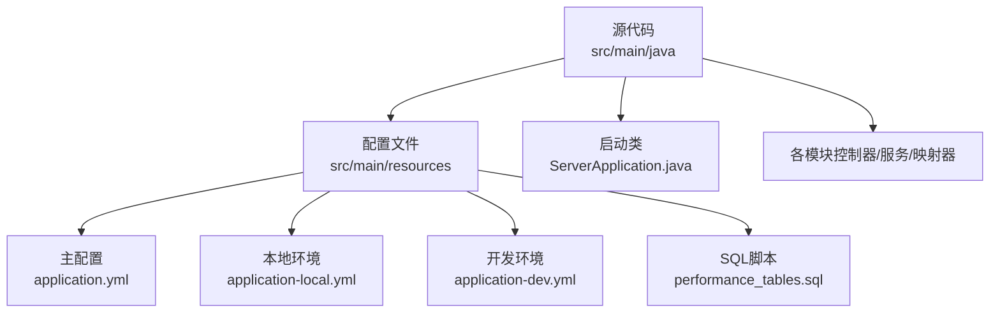
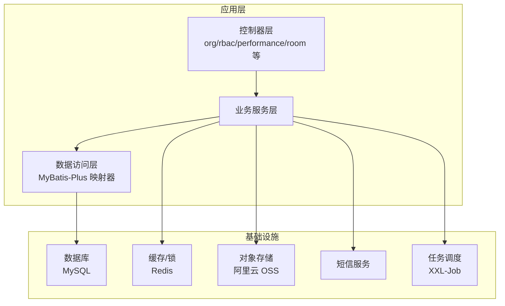
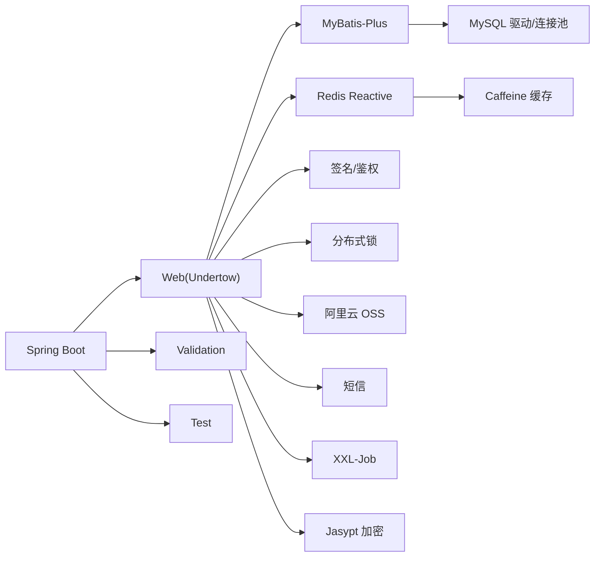

# 快速开始

<cite>
**本文引用的文件**
- [pom.xml](file://pom.xml)
- [application.yml](file://src/main/resources/application.yml)
- [application-local.yml](file://src/main/resources/application-local.yml)
- [application-dev.yml](file://src/main/resources/application-dev.yml)
- [ServerApplication.java](file://src/main/java/com/jiuyu/governance/ServerApplication.java)
- [performance_tables.sql](file://src/main/resources/sql/performance_tables.sql)
- [API_DATA_DICTIONARY.md](file://API_DATA_DICTIONARY.md)
- [接口权限列表.md](file://docs/接口权限列表.md)
- [ERROR_CODE_DICT.md](file://ERROR_CODE_DICT.md)
- [employeePerformanceController.http](file://src/test/java/resources/employeePerformanceController.http)
- [test.http](file://src/test/java/resources/test.http)
</cite>

## 目录
1. [简介](#简介)
2. [项目结构](#项目结构)
3. [核心组件](#核心组件)
4. [架构总览](#架构总览)
5. [详细组件分析](#详细组件分析)
6. [依赖分析](#依赖分析)
7. [性能考虑](#性能考虑)
8. [故障排查指南](#故障排查指南)
9. [结论](#结论)
10. [附录](#附录)

## 简介
本指南面向新开发者，帮助你在最短时间内完成开发环境准备、项目克隆、依赖安装、数据库与中间件初始化、应用启动与验证，以及常见问题排查。项目基于 Spring Boot 3.3.0，使用 Undertow 作为 Web 服务器，集成 MyBatis-Plus、Redis、分布式锁、签名与鉴权、OSS、短信、XXL-Job 等能力。

## 项目结构
- 代码主体位于 src/main/java，按领域划分模块：org（组织）、rbac（权限）、performance（业绩）、room（直播间）等。
- 配置文件位于 src/main/resources，包含多环境配置（application.yml、application-local.yml、application-dev.yml）。
- SQL 初始化脚本位于 src/main/resources/sql/performance_tables.sql。
- 测试资源包含 HTTP 示例请求，便于快速验证接口。

**图表来源**
- [ServerApplication.java](file://src/main/java/com/jiuyu/governance/ServerApplication.java)
- [application.yml](file://src/main/resources/application.yml)
- [application-local.yml](file://src/main/resources/application-local.yml)
- [application-dev.yml](file://src/main/resources/application-dev.yml)
- [performance_tables.sql](file://src/main/resources/sql/performance_tables.sql)

**章节来源**
- [ServerApplication.java](file://src/main/java/com/jiuyu/governance/ServerApplication.java)
- [pom.xml](file://pom.xml)

## 核心组件
- 启动类：负责引导 Spring Boot 应用，指定主启动类为 com.jiuyu.governance.ServerApplication。
- 多环境配置：通过 application.yml 激活 profiles，application-local.yml 与 application-dev.yml 提供不同环境下的数据库、Redis、OSS、XXL-Job 等差异化配置。
- 数据源与 ORM：MyBatis-Plus 配置在 application.yml 中，使用 Hikari 连接池，支持 P6Spy 驱动（本地/开发环境）。
- 缓存与分布式锁：Redis 配置在 application.yml，分布式锁类型通过 jiuyu.lock.type 指定。
- Web 服务器：使用 Undertow，默认端口由环境配置决定（local 默认 6626）。
- 任务调度：XXL-Job 在 application.yml 中启用并配置执行器端口、日志路径等。

**章节来源**
- [ServerApplication.java](file://src/main/java/com/jiuyu/governance/ServerApplication.java)
- [application.yml](file://src/main/resources/application.yml)
- [application-local.yml](file://src/main/resources/application-local.yml)
- [application-dev.yml](file://src/main/resources/application-dev.yml)

## 架构总览
应用采用分层架构：Web 控制器层 → 业务服务层 → 数据访问层（MyBatis-Plus）；通过 Redis 提供缓存与分布式锁；通过签名与鉴权模块保障接口安全；通过 OSS 与短信模块对接外部能力；XXL-Job 负责分布式任务调度。

**图表来源**
- [application.yml](file://src/main/resources/application.yml)
- [application-local.yml](file://src/main/resources/application-local.yml)
- [application-dev.yml](file://src/main/resources/application-dev.yml)

## 详细组件分析

### 开发环境准备与安装
- JDK 17
  - 版本要求：Java 17（项目属性中明确指定）。
  - Maven 编译版本：maven.compiler.source/target 与 java.version 均为 17。
- Maven
  - 项目使用 Spring Boot 3.3.0 的父工程，确保使用与之兼容的 Maven 版本。
- MySQL
  - 数据库连接参数在 application.yml 中通过占位符注入，本地/开发环境在各自 yml 中给出示例。
  - 初始化数据库表结构：使用 performance_tables.sql。
- Redis
  - Redis 主机、密码、端口、数据库索引在 application.yml 中配置，本地/开发环境在各自 yml 中给出示例。

**章节来源**
- [pom.xml](file://pom.xml)
- [application.yml](file://src/main/resources/application.yml)
- [performance_tables.sql](file://src/main/resources/sql/performance_tables.sql)

### 多环境配置与差异
- 激活环境
  - application.yml 中通过 spring.profiles.active 指定当前激活的环境（默认 local）。
- 本地环境（application-local.yml）
  - 端口：6626
  - 数据库：使用 P6Spy 驱动（jdbc:p6spy），连接池大小、心跳、超时等参数示例化。
  - Redis：主机、密码、数据库索引示例化。
  - Jasypt 密码：从环境变量读取，若未提供则使用默认值。
  - OAuth/OSS/XXL-Job：示例化客户端配置与执行器端口。
- 开发环境（application-dev.yml）
  - 端口：6626
  - 数据库：连接池参数与心跳间隔更宽松，日志输出路径指向容器内目录。
  - Redis：与本地一致。
  - 日志：文件路径指向 /myApps/governance-server。
  - OSS：网络策略设为 external，预签名链接也使用外网。
  - XXL-Job：示例化 admin 地址与执行器端口。
  - SMS：开启 mock，固定验证码便于测试。

**章节来源**
- [application.yml](file://src/main/resources/application.yml)
- [application-local.yml](file://src/main/resources/application-local.yml)
- [application-dev.yml](file://src/main/resources/application-dev.yml)

### 项目克隆、依赖安装与启动
- 克隆仓库至本地后，使用 Maven 安装依赖（建议使用本地已配置好的 Maven）。
- 启动方式
  - 方式一：IDE 直接运行主类 ServerApplication.main
  - 方式二：命令行打包并运行
    - mvn clean package
    - java -jar target/fupan-governance-server-1.0-SNAPSHOT.jar
- 端口与日志
  - 本地默认端口 6626；日志路径可在 application.yml 中配置。
- 启动后验证
  - 访问健康检查端点（如 /actuator/health 或 / 或 Swagger/文档页面，视具体暴露情况而定）。
  - 查看控制台日志，确认数据库连接、Redis 连接、XXL-Job 初始化等关键模块加载成功。

**章节来源**
- [ServerApplication.java](file://src/main/java/com/jiuyu/governance/ServerApplication.java)
- [pom.xml](file://pom.xml)
- [application.yml](file://src/main/resources/application.yml)

### 数据库与中间件初始化
- MySQL
  - 使用 performance_tables.sql 初始化表结构。
  - 在 application.yml 中配置数据库 URL、用户名、密码等占位符，本地/开发环境在对应 yml 中给出示例。
- Redis
  - 在 application.yml 中配置 host/password/port/database，本地/开发环境在对应 yml 中给出示例。
- Jasypt 加密
  - 在 application-local.yml 中通过 JASYPT_PASSWORD 环境变量提供解密密钥，用于解密数据库凭据（ENC(...)）。

**章节来源**
- [performance_tables.sql](file://src/main/resources/sql/performance_tables.sql)
- [application.yml](file://src/main/resources/application.yml)
- [application-local.yml](file://src/main/resources/application-local.yml)

### 基本功能测试与验证
- 接口文档与权限
  - API 文档与数据字典：参考 API_DATA_DICTIONARY.md，涵盖组织架构与 RBAC 模块的接口说明与字段字典。
  - 权限接口列表：docs/接口权限列表.md，列出带权限标识的接口总数、模块分布与权限标识。
- 错误码规范
  - ERROR_CODE_DICT.md 提供 4 位数字错误码分段与使用规范，前端据此进行交互处理。
- HTTP 示例
  - employeePerformanceController.http 与 test.http 提供示例请求，可直接在 IDE 的 REST 客户端中导入并执行，验证接口可用性与鉴权流程。

**章节来源**
- [API_DATA_DICTIONARY.md](file://API_DATA_DICTIONARY.md)
- [接口权限列表.md](file://docs/接口权限列表.md)
- [ERROR_CODE_DICT.md](file://ERROR_CODE_DICT.md)
- [employeePerformanceController.http](file://src/test/java/resources/employeePerformanceController.http)
- [test.http](file://src/test/java/resources/test.http)

## 依赖分析
- 核心框架
  - Spring Boot Starter Web（Undertow）、Validation、AOP、Test。
- 数据访问
  - MyBatis-Plus Starter、Redis Reactive、Caffeine。
- 安全与签名
  - OAuth 客户端 Starter、签名模块、分布式锁 Starter。
- 外部集成
  - 阿里云 OSS SDK、XXL-Job Core、Jasypt 加密。
- 构建与资源
  - Maven 插件配置主类、资源过滤包含 XML 与 YAML。

**图表来源**
- [pom.xml](file://pom.xml)
- [application.yml](file://src/main/resources/application.yml)

**章节来源**
- [pom.xml](file://pom.xml)
- [application.yml](file://src/main/resources/application.yml)

## 性能考虑
- 连接池与线程池
  - Hikari 连接池参数在 application.yml 中集中配置，本地/开发环境在各自 yml 中给出示例。
  - 线程池参数在 application.yml 中配置，本地/开发环境在各自 yml 中给出示例。
- 缓存策略
  - Redis 作为缓存与分布式锁后端，结合 Caffeine 本地缓存提升读性能。
- 日志与监控
  - 日志路径与级别在 application.yml 中配置，便于生产环境定位问题。
- Web 服务器
  - Undertow 默认启用，具备较好的并发性能与 WebSocket 支持。

**章节来源**
- [application.yml](file://src/main/resources/application.yml)
- [application-local.yml](file://src/main/resources/application-local.yml)
- [application-dev.yml](file://src/main/resources/application-dev.yml)

## 故障排查指南
- 启动失败（端口占用）
  - 检查 application.yml 中 server.port，本地默认 6626；若被占用，修改为其他端口或释放占用进程。
- 数据库连接失败
  - 核对 application.yml 中 db.* 占位符与 application-local.yml/application-dev.yml 中的实际值。
  - 确认数据库服务可达、账号密码正确、驱动类名与 URL 前缀（含 P6Spy）正确。
- Redis 连接失败
  - 核对 application.yml 中 redis.ip、password、port、database 与 application-local.yml/application-dev.yml 中的实际值。
- Jasypt 解密失败
  - 确保 JASYPT_PASSWORD 环境变量已设置，且与 application-local.yml 中的 ENC(...) 内容匹配。
- XXL-Job 启动异常
  - 核对 xxl.job.admin.addresses 与 application-local.yml/application-dev.yml 中的示例地址。
  - 确认执行器端口（默认 9998/9999）未被占用。
- 接口鉴权失败
  - 确认请求头中携带正确的 Token（示例见 employeePerformanceController.http）。
  - 检查签名/鉴权模块配置与客户端密钥（application-local.yml/application-dev.yml）。
- 日志定位
  - 查看控制台日志与 application.yml 中 logging.file.path 指向的日志文件。

**章节来源**
- [application.yml](file://src/main/resources/application.yml)
- [application-local.yml](file://src/main/resources/application-local.yml)
- [application-dev.yml](file://src/main/resources/application-dev.yml)
- [employeePerformanceController.http](file://src/test/java/resources/employeePerformanceController.http)

## 结论
按照本指南完成环境准备、配置与初始化后，你可以在本地快速启动并验证核心接口。建议优先使用本地环境（local）进行开发调试，再切换到开发环境（dev）进行联调与测试。遇到问题时，优先检查数据库与 Redis 连通性、Jasypt 密钥、XXL-Job 配置与接口鉴权头信息。

## 附录

### 快速启动清单
- 安装 JDK 17、Maven、MySQL、Redis。
- 准备 application-local.yml/application-dev.yml 中的数据库与 Redis 连接参数。
- 执行 performance_tables.sql 初始化表结构。
- 设置 JASYPT_PASSWORD 环境变量（若使用 ENC(...)）。
- 启动应用，访问示例接口验证功能。

### 常用端点与文件
- 启动类：ServerApplication.main
- 配置文件：application.yml、application-local.yml、application-dev.yml
- SQL 脚本：performance_tables.sql
- 接口文档：API_DATA_DICTIONARY.md
- 权限列表：docs/接口权限列表.md
- 错误码字典：ERROR_CODE_DICT.md
- HTTP 示例：employeePerformanceController.http、test.http