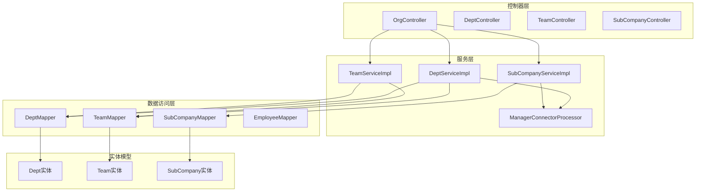
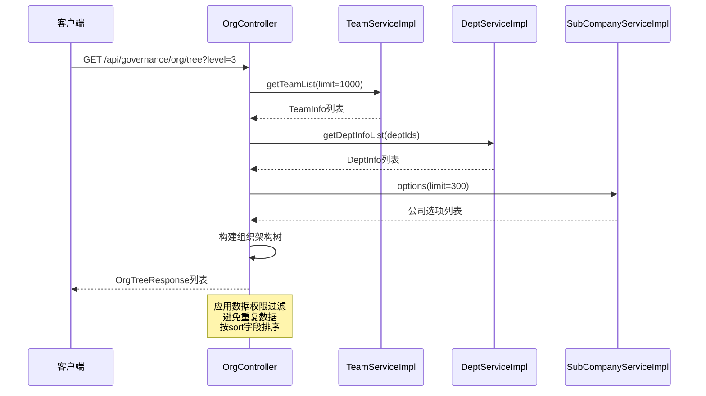
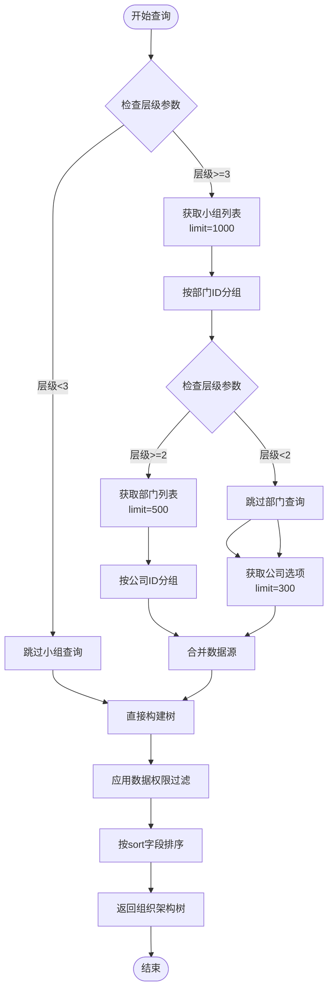
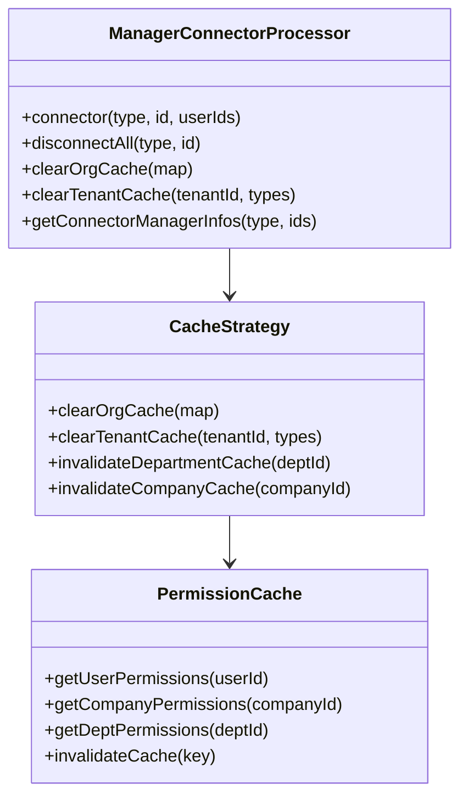
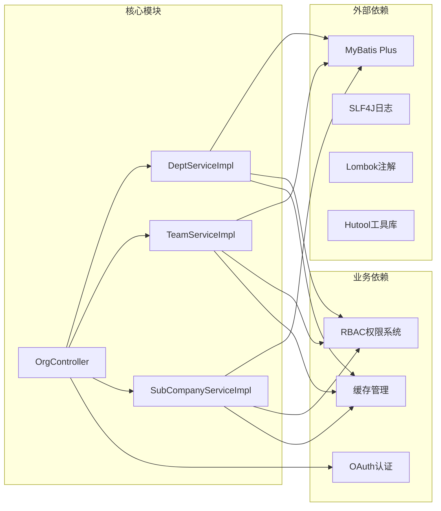

# 技能图管理器技能

<cite>
**本文档引用的文件**
- [OrgController.java](file://src/main/java/com/jiuyu/governance/business/org/controller/OrgController.java)
- [DeptServiceImpl.java](file://src/main/java/com/jiuyu/governance/business/org/service/impl/DeptServiceImpl.java)
- [SubCompanyServiceImpl.java](file://src/main/java/com/jiuyu/governance/business/org/service/impl/SubCompanyServiceImpl.java)
- [TeamServiceImpl.java](file://src/main/java/com/jiuyu/governance/business/org/service/impl/TeamServiceImpl.java)
- [Dept.java](file://src/main/java/com/jiuyu/governance/business/org/pojo/entity/Dept.java)
- [SubCompany.java](file://src/main/java/com/jiuyu/governance/business/org/pojo/entity/SubCompany.java)
- [Team.java](file://src/main/java/com/jiuyu/governance/business/org/pojo/entity/Team.java)
- [DeptInfo.java](file://src/main/java/com/jiuyu/governance/business/org/pojo/bo/DeptInfo.java)
- [TeamInfo.java](file://src/main/java/com/jiuyu/governance/business/org/pojo/bo/TeamInfo.java)
- [DeptSelectQueryRequest.java](file://src/main/java/com/jiuyu/governance/business/org/pojo/request/DeptSelectQueryRequest.java)
- [SubCompanySelectQueryRequest.java](file://src/main/java/com/jiuyu/governance/business/org/pojo/request/SubCompanySelectQueryRequest.java)
- [TeamSelectQueryRequest.java](file://src/main/java/com/jiuyu/governance/business/org/pojo/request/TeamSelectQueryRequest.java)
- [OrgTreeResponse.java](file://src/main/java/com/jiuyu/governance/business/org/pojo/response/OrgTreeResponse.java)
</cite>

## 目录
1. [简介](#简介)
2. [项目结构](#项目结构)
3. [核心组件](#核心组件)
4. [架构概览](#架构概览)
5. [详细组件分析](#详细组件分析)
6. [依赖分析](#依赖分析)
7. [性能考虑](#性能考虑)
8. [故障排除指南](#故障排除指南)
9. [结论](#结论)

## 简介

技能图管理器是一个基于Spring Boot的企业级组织管理解决方案，专注于构建和维护企业内部的技能图谱。该系统实现了完整的组织架构管理功能，包括公司、部门和小组的三层组织结构，支持权限控制、数据验证和缓存管理。

系统采用分层架构设计，通过控制器层、服务层、数据访问层的清晰分离，提供了可扩展的企业级组织管理能力。核心功能涵盖组织架构树的动态构建、权限数据的自动过滤、以及多层级数据的关联查询。

## 项目结构

该项目采用标准的Maven多模块结构，主要业务逻辑集中在`business/org`包下，实现了完整的组织管理功能：

**图表来源**
- [OrgController.java:1-147](file://src/main/java/com/jiuyu/governance/business/org/controller/OrgController.java#L1-L147)
- [DeptServiceImpl.java:1-414](file://src/main/java/com/jiuyu/governance/business/org/service/impl/DeptServiceImpl.java#L1-L414)
- [TeamServiceImpl.java:1-353](file://src/main/java/com/jiuyu/governance/business/org/service/impl/TeamServiceImpl.java#L1-L353)
- [SubCompanyServiceImpl.java:1-307](file://src/main/java/com/jiuyu/governance/business/org/service/impl/SubCompanyServiceImpl.java#L1-L307)

**章节来源**
- [OrgController.java:1-147](file://src/main/java/com/jiuyu/governance/business/org/controller/OrgController.java#L1-L147)
- [DeptServiceImpl.java:1-414](file://src/main/java/com/jiuyu/governance/business/org/service/impl/DeptServiceImpl.java#L1-L414)
- [TeamServiceImpl.java:1-353](file://src/main/java/com/jiuyu/governance/business/org/service/impl/TeamServiceImpl.java#L1-L353)
- [SubCompanyServiceImpl.java:1-307](file://src/main/java/com/jiuyu/governance/business/org/service/impl/SubCompanyServiceImpl.java#L1-L307)

## 核心组件

### 组织架构控制器

OrgController是整个组织管理系统的入口点，负责处理组织架构树的构建和查询请求。该控制器实现了三个核心功能：

1. **组织架构树构建**：根据指定层级动态构建公司-部门-小组的三层树形结构
2. **权限数据过滤**：自动应用数据权限过滤，确保用户只能访问其权限范围内的组织数据
3. **智能查询优化**：通过排除逻辑避免重复数据，优化查询性能

### 服务层实现

系统提供了三个核心服务实现类，每个都实现了相应的接口并提供了完整的业务逻辑：

1. **部门服务实现**：处理部门的CRUD操作，包含员工绑定检查、权限验证和缓存管理
2. **小组服务实现**：管理小组的完整生命周期，支持跨部门迁移和权限控制
3. **子公司服务实现**：提供公司级别的组织管理功能，包含数量限制和依赖检查

### 实体模型设计

系统采用简洁而强大的实体模型设计，三个核心实体类都遵循统一的规范：

- **通用字段**：包含租户ID、创建时间、更新时间、创建人、修改人、排序和删除标记
- **验证约束**：通过注解确保数据的完整性和有效性
- **类型安全**：使用Long类型的ID和严格的类型定义

**章节来源**
- [OrgController.java:49-145](file://src/main/java/com/jiuyu/governance/business/org/controller/OrgController.java#L49-L145)
- [DeptServiceImpl.java:54-414](file://src/main/java/com/jiuyu/governance/business/org/service/impl/DeptServiceImpl.java#L54-L414)
- [TeamServiceImpl.java:53-353](file://src/main/java/com/jiuyu/governance/business/org/service/impl/TeamServiceImpl.java#L53-L353)
- [SubCompanyServiceImpl.java:50-307](file://src/main/java/com/jiuyu/governance/business/org/service/impl/SubCompanyServiceImpl.java#L50-L307)

## 架构概览

系统采用经典的三层架构模式，通过清晰的职责分离实现了高内聚低耦合的设计：

**图表来源**
- [OrgController.java:66-145](file://src/main/java/com/jiuyu/governance/business/org/controller/OrgController.java#L66-L145)
- [TeamServiceImpl.java:305-330](file://src/main/java/com/jiuyu/governance/business/org/service/impl/TeamServiceImpl.java#L305-L330)
- [DeptServiceImpl.java:357-383](file://src/main/java/com/jiuyu/governance/business/org/service/impl/DeptServiceImpl.java#L357-L383)
- [SubCompanyServiceImpl.java:271-285](file://src/main/java/com/jiuyu/governance/business/org/service/impl/SubCompanyServiceImpl.java#L271-L285)

系统的核心优势在于其智能的数据权限管理和查询优化机制。通过在查询阶段就应用权限过滤，避免了后续处理中的数据泄露风险。同时，通过排除逻辑和批量查询优化，显著提升了系统的响应性能。

## 详细组件分析

### 组织架构树构建流程

组织架构树的构建是一个复杂的多步骤过程，需要协调多个服务和数据源：

**图表来源**
- [OrgController.java:66-145](file://src/main/java/com/jiuyu/governance/business/org/controller/OrgController.java#L66-L145)

该流程展示了系统如何根据用户需求动态调整查询策略，既保证了功能的完整性，又优化了性能表现。

### 权限控制机制

系统实现了细粒度的权限控制机制，通过多种方式确保数据安全：

1. **注解驱动的权限验证**：使用`@BeforePermission`注解在方法执行前进行权限检查
2. **数据权限过滤**：通过`DataPermissionsRequest`接口实现按用户权限范围的数据过滤
3. **动态权限组合**：支持同时基于公司和部门维度的权限控制

### 缓存管理策略

系统采用了多层次的缓存管理策略来提升性能：

**图表来源**
- [DeptServiceImpl.java:129-134](file://src/main/java/com/jiuyu/governance/business/org/service/impl/DeptServiceImpl.java#L129-L134)
- [TeamServiceImpl.java:127-132](file://src/main/java/com/jiuyu/governance/business/org/service/impl/TeamServiceImpl.java#L127-L132)
- [SubCompanyServiceImpl.java:115-120](file://src/main/java/com/jiuyu/governance/business/org/service/impl/SubCompanyServiceImpl.java#L115-L120)

**章节来源**
- [OrgController.java:66-145](file://src/main/java/com/jiuyu/governance/business/org/controller/OrgController.java#L66-L145)
- [DeptServiceImpl.java:95-135](file://src/main/java/com/jiuyu/governance/business/org/service/impl/DeptServiceImpl.java#L95-L135)
- [TeamServiceImpl.java:91-133](file://src/main/java/com/jiuyu/governance/business/org/service/impl/TeamServiceImpl.java#L91-L133)
- [SubCompanyServiceImpl.java:85-120](file://src/main/java/com/jiuyu/governance/business/org/service/impl/SubCompanyServiceImpl.java#L85-L120)

## 依赖分析

系统的核心依赖关系体现了清晰的分层架构：

**图表来源**
- [DeptServiceImpl.java:1-44](file://src/main/java/com/jiuyu/governance/business/org/service/impl/DeptServiceImpl.java#L1-L44)
- [TeamServiceImpl.java:1-42](file://src/main/java/com/jiuyu/governance/business/org/service/impl/TeamServiceImpl.java#L1-L42)
- [SubCompanyServiceImpl.java:1-40](file://src/main/java/com/jiuyu/governance/business/org/service/impl/SubCompanyServiceImpl.java#L1-L40)

系统通过引入MyBatis Plus简化了数据库操作，通过Lombok减少了样板代码，通过Hutool提供了丰富的工具方法。这些依赖的选择体现了对开发效率和代码质量的重视。

**章节来源**
- [DeptServiceImpl.java:1-44](file://src/main/java/com/jiuyu/governance/business/org/service/impl/DeptServiceImpl.java#L1-L44)
- [TeamServiceImpl.java:1-42](file://src/main/java/com/jiuyu/governance/business/org/service/impl/TeamServiceImpl.java#L1-L42)
- [SubCompanyServiceImpl.java:1-40](file://src/main/java/com/jiuyu/governance/business/org/service/impl/SubCompanyServiceImpl.java#L1-L40)

## 性能考虑

系统在设计时充分考虑了性能优化，采用了多种策略来提升响应速度和资源利用率：

### 查询优化策略

1. **分层查询限制**：通过合理的limit值限制单次查询的数据量
2. **排除逻辑优化**：避免重复数据查询，减少不必要的数据库访问
3. **批量操作**：使用批量查询和批量更新提升效率

### 缓存策略

1. **多级缓存**：结合本地缓存和分布式缓存提升访问速度
2. **智能失效**：在数据变更时及时清除相关缓存
3. **预热机制**：在系统启动时预加载常用数据

### 内存管理

1. **流式处理**：使用Stream API进行内存友好的数据处理
2. **延迟加载**：只在需要时加载相关数据
3. **对象复用**：重用常用对象减少GC压力

## 故障排除指南

### 常见问题诊断

1. **权限相关错误**
   - 检查用户权限配置是否正确
   - 验证数据权限过滤逻辑
   - 确认租户隔离设置

2. **数据一致性问题**
   - 检查事务边界设置
   - 验证并发访问控制
   - 确认缓存同步机制

3. **性能问题**
   - 分析慢查询日志
   - 检查索引使用情况
   - 监控数据库连接池

### 调试建议

1. **启用详细日志**：在开发环境中启用DEBUG级别日志
2. **监控指标收集**：收集关键性能指标进行分析
3. **单元测试覆盖**：编写全面的单元测试确保代码质量

**章节来源**
- [DeptServiceImpl.java:197-226](file://src/main/java/com/jiuyu/governance/business/org/service/impl/DeptServiceImpl.java#L197-L226)
- [TeamServiceImpl.java:200-222](file://src/main/java/com/jiuyu/governance/business/org/service/impl/TeamServiceImpl.java#L200-L222)
- [SubCompanyServiceImpl.java:172-197](file://src/main/java/com/jiuyu/governance/business/org/service/impl/SubCompanyServiceImpl.java#L172-L197)

## 结论

技能图管理器技能系统展现了现代企业级应用的最佳实践，通过精心设计的架构和完善的业务逻辑，为企业提供了强大而灵活的组织管理能力。

系统的主要优势包括：

1. **架构清晰**：分层设计使得代码易于理解和维护
2. **功能完整**：涵盖了组织管理的所有核心需求
3. **性能优秀**：通过多种优化策略确保良好的用户体验
4. **安全可靠**：完善的权限控制和数据验证机制
5. **扩展性强**：模块化设计便于功能扩展和定制

该系统为企业数字化转型提供了坚实的技术基础，能够有效支撑企业的组织管理和技能图谱建设需求。通过持续的优化和完善，系统将在未来发挥更大的价值。