# 技能索引构建脚本

<cite>
**本文档引用的文件**
- [build_skill_index.py](file://.trae/build_skill_index.py)
- [SKILL.md](file://.trae/skills/trae-skill-index/SKILL.md)
- [SKILL.md](file://.trae/skills/business-org/SKILL.md)
- [SKILL.md](file://.trae/skills/business-rbac/SKILL.md)
- [SKILL.md](file://.trae/skills/skill-graph-manager/SKILL.md)
- [API_DATA_DICTIONARY.md](file://API_DATA_DICTIONARY.md)
- [ERROR_CODE_DICT.md](file://ERROR_CODE_DICT.md)
- [ServerApplication.java](file://src/main/java/com/jiuyu/governance/ServerApplication.java)
- [OrgController.java](file://src/main/java/com/jiuyu/governance/business/org/controller/OrgController.java)
- [EmployeeController.java](file://src/main/java/com/jiuyu/governance/business/rbac/controller/EmployeeController.java)
- [pom.xml](file://pom.xml)
</cite>

## 目录
1. [简介](#简介)
2. [项目结构](#项目结构)
3. [核心组件](#核心组件)
4. [架构概览](#架构概览)
5. [详细组件分析](#详细组件分析)
6. [依赖分析](#依赖分析)
7. [性能考虑](#性能考虑)
8. [故障排除指南](#故障排除指南)
9. [结论](#结论)

## 简介

技能索引构建脚本是复盘治理服务项目中的一个重要工具，用于自动化构建和维护技能知识图谱的中央索引。该项目采用Spring Boot框架开发，主要服务于直播电商行业的组织管理和权限控制需求。

该系统的核心特色包括：
- **技能知识图谱管理**：通过`.trae/skills`目录结构化管理各类业务技能
- **自动化索引构建**：使用Python脚本自动扫描和解析技能文件
- **多模块业务架构**：涵盖组织架构、RBAC权限管理、直播业务等多个核心模块
- **统一异常处理**：采用4位数字状态码体系进行异常管理

## 项目结构

项目采用标准的Maven多模块架构，主要分为以下几个核心部分：

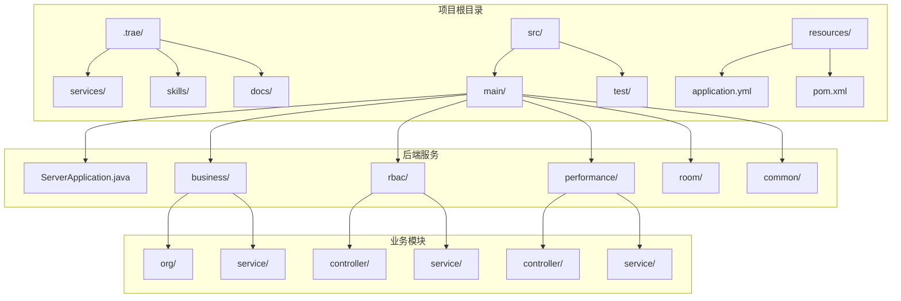

**图表来源**
- [ServerApplication.java:1-19](file://src/main/java/com/jiuyu/governance/ServerApplication.java#L1-L19)
- [pom.xml:1-226](file://pom.xml#L1-L226)

**章节来源**
- [ServerApplication.java:1-19](file://src/main/java/com/jiuyu/governance/ServerApplication.java#L1-L19)
- [pom.xml:1-226](file://pom.xml#L1-L226)

## 核心组件

### 技能索引构建器

技能索引构建器是`.trae/build_skill_index.py`文件的核心功能模块，负责自动化构建技能知识图谱索引。

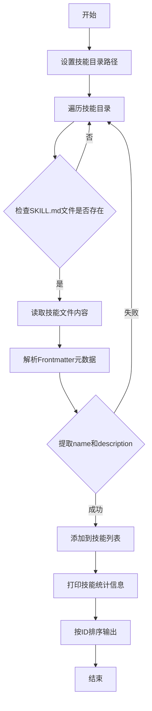

**图表来源**
- [build_skill_index.py:17-29](file://.trae/build_skill_index.py#L17-L29)

### 技能知识图谱结构

系统采用中心辐射式的技能知识图谱结构：

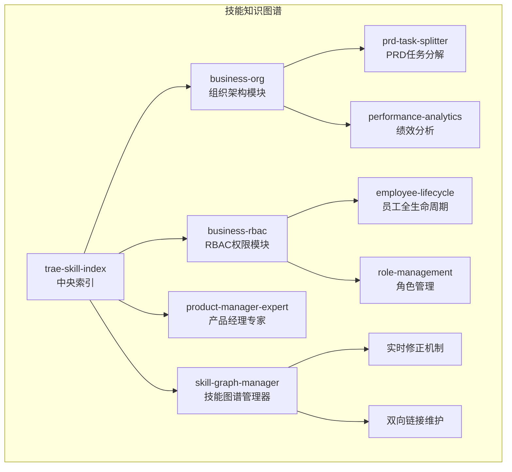

**图表来源**
- [SKILL.md:1-54](file://.trae/skills/trae-skill-index/SKILL.md#L1-L54)
- [SKILL.md:1-52](file://.trae/skills/skill-graph-manager/SKILL.md#L1-L52)

**章节来源**
- [build_skill_index.py:1-30](file://.trae/build_skill_index.py#L1-L30)
- [SKILL.md:1-54](file://.trae/skills/trae-skill-index/SKILL.md#L1-L54)

## 架构概览

系统采用分层架构设计，结合微服务思想实现业务模块的松耦合：

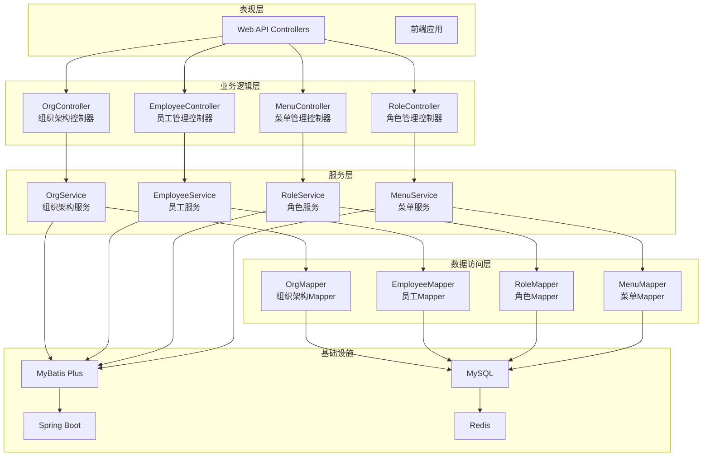

**图表来源**
- [OrgController.java:40-147](file://src/main/java/com/jiuyu/governance/business/org/controller/OrgController.java#L40-L147)
- [EmployeeController.java:31-186](file://src/main/java/com/jiuyu/governance/business/rbac/controller/EmployeeController.java#L31-L186)

**章节来源**
- [OrgController.java:1-147](file://src/main/java/com/jiuyu/governance/business/org/controller/OrgController.java#L1-L147)
- [EmployeeController.java:1-186](file://src/main/java/com/jiuyu/governance/business/rbac/controller/EmployeeController.java#L1-L186)

## 详细组件分析

### 技能索引构建器组件

技能索引构建器是一个专门的Python脚本，具有以下核心特性：

#### 数据结构设计

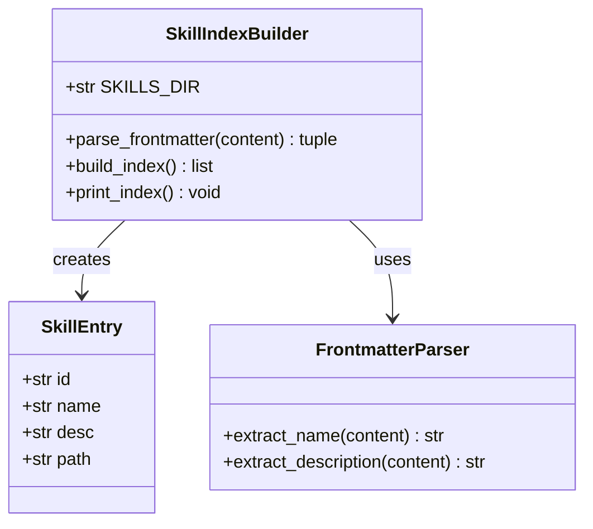

**图表来源**
- [build_skill_index.py:6-25](file://.trae/build_skill_index.py#L6-L25)

#### 处理流程

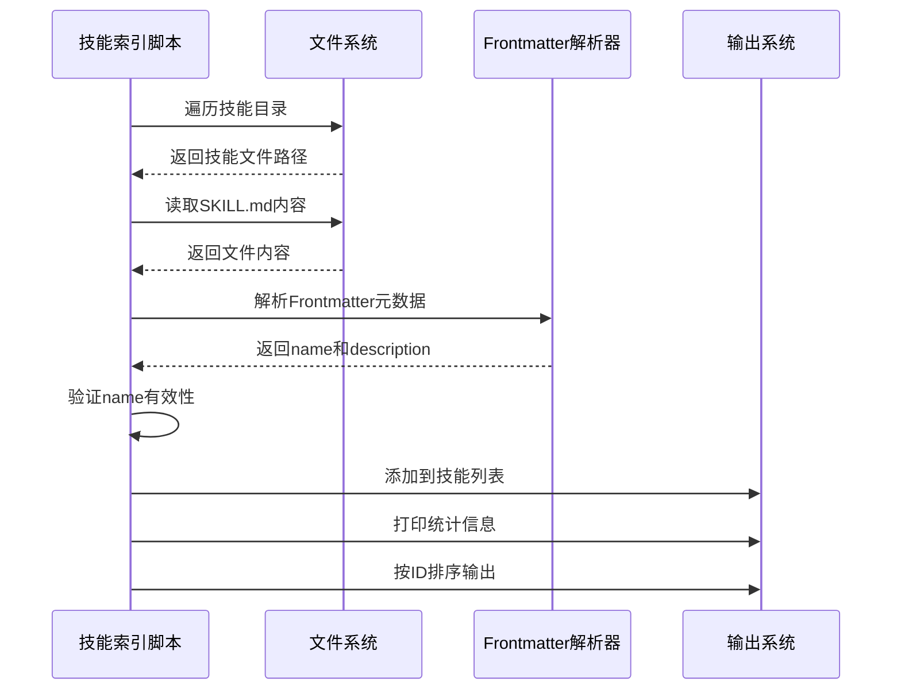

**图表来源**
- [build_skill_index.py:17-29](file://.trae/build_skill_index.py#L17-L29)

**章节来源**
- [build_skill_index.py:1-30](file://.trae/build_skill_index.py#L1-L30)

### 组织架构模块

组织架构模块是系统的核心业务模块之一，负责管理企业内部的组织结构：

#### 核心实体关系

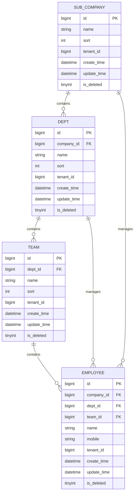

**图表来源**
- [business-org/SKILL.md:10-39](file://.trae/skills/business-org/SKILL.md#L10-L39)

#### 控制器设计模式

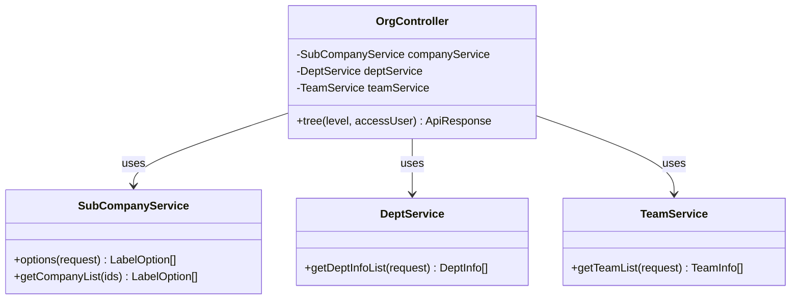

**图表来源**
- [OrgController.java:40-147](file://src/main/java/com/jiuyu/governance/business/org/controller/OrgController.java#L40-L147)

**章节来源**
- [business-org/SKILL.md:1-39](file://.trae/skills/business-org/SKILL.md#L1-L39)
- [OrgController.java:1-147](file://src/main/java/com/jiuyu/governance/business/org/controller/OrgController.java#L1-L147)

### RBAC权限管理模块

RBAC权限管理模块实现了基于角色的访问控制系统：

#### 权限模型设计

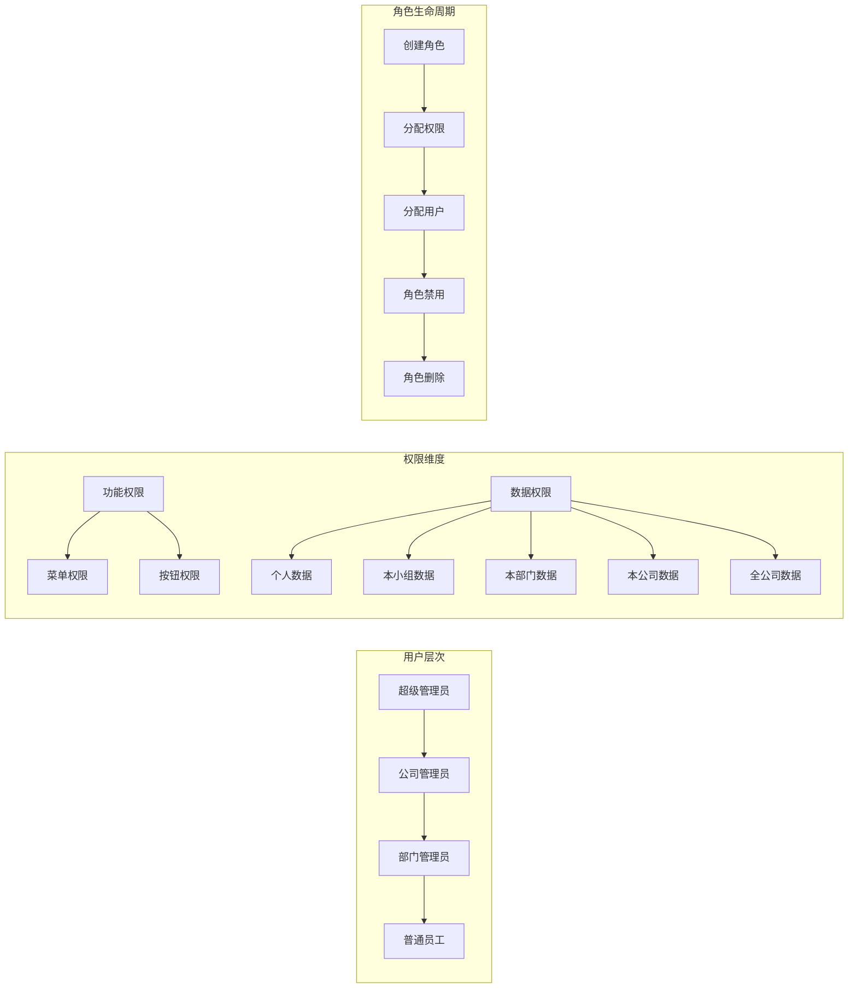

**图表来源**
- [business-rbac/SKILL.md:10-41](file://.trae/skills/business-rbac/SKILL.md#L10-L41)

#### 员工生命周期管理

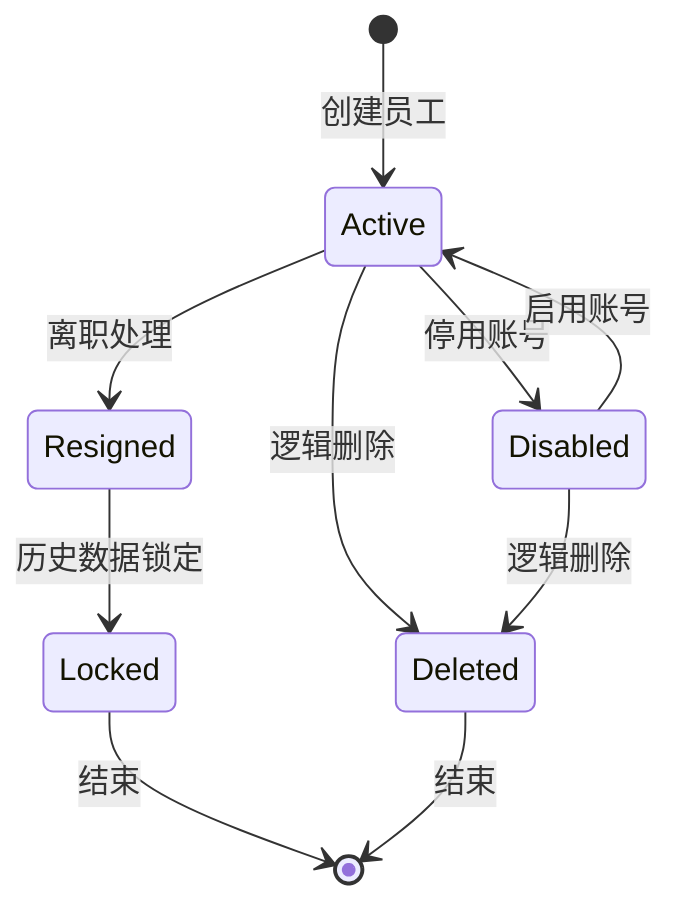

**图表来源**
- [business-rbac/SKILL.md:24-41](file://.trae/skills/business-rbac/SKILL.md#L24-L41)

**章节来源**
- [business-rbac/SKILL.md:1-41](file://.trae/skills/business-rbac/SKILL.md#L1-L41)
- [EmployeeController.java:1-186](file://src/main/java/com/jiuyu/governance/business/rbac/controller/EmployeeController.java#L1-L186)

## 依赖分析

系统采用Spring Boot 3.3.0和Java 17作为核心技术栈，依赖管理通过Maven实现：

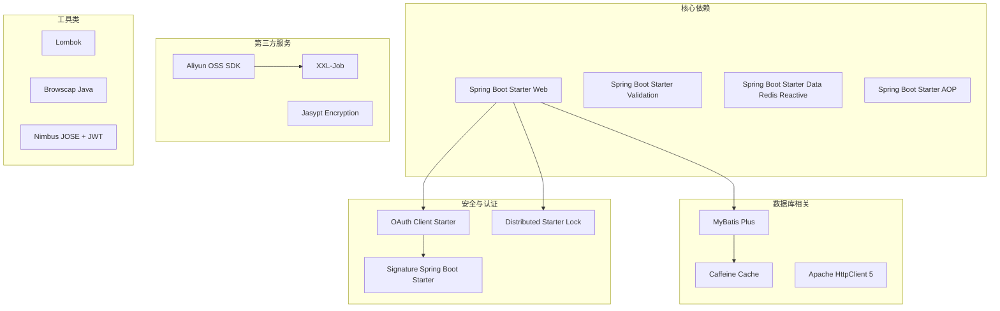

**图表来源**
- [pom.xml:35-167](file://pom.xml#L35-L167)

**章节来源**
- [pom.xml:1-226](file://pom.xml#L1-L226)

## 性能考虑

系统在设计时充分考虑了性能优化和扩展性：

### 缓存策略
- **多级缓存架构**：结合Caffeine本地缓存和Redis分布式缓存
- **智能缓存失效**：基于业务规则的缓存更新策略
- **热点数据预加载**：常用组织架构数据的预加载机制

### 数据访问优化
- **分页查询**：大量数据采用分页查询避免内存溢出
- **批量操作**：支持批量数据处理减少数据库往返
- **连接池优化**：合理配置数据库连接池参数

### 并发控制
- **分布式锁**：使用分布式锁防止并发冲突
- **限流保护**：关键接口实施限流保护机制
- **异步处理**：耗时操作采用异步处理方式

## 故障排除指南

### 常见问题诊断

#### 技能索引构建失败
1. **检查文件权限**：确保脚本对`.trae/skills`目录有读取权限
2. **验证Frontmatter格式**：确认SKILL.md文件包含正确的name和description字段
3. **检查编码格式**：确保文件使用UTF-8编码

#### API接口异常
1. **状态码分析**：根据ERROR_CODE_DICT.md中的状态码含义进行排查
2. **日志查看**：检查后端服务日志定位具体错误
3. **参数验证**：确认请求参数符合API_DATA_DICTIONARY.md中的规范

#### 性能问题
1. **数据库监控**：检查慢查询日志和数据库连接状态
2. **缓存命中率**：监控缓存使用情况和命中率
3. **内存使用**：监控JVM内存使用情况避免内存泄漏

**章节来源**
- [ERROR_CODE_DICT.md:1-160](file://ERROR_CODE_DICT.md#L1-L160)
- [API_DATA_DICTIONARY.md:1-415](file://API_DATA_DICTIONARY.md#L1-L415)

## 结论

技能索引构建脚本代表了现代企业级应用中知识管理和自动化运维的重要实践。通过将技能知识图谱的构建过程自动化，该系统显著提升了开发效率和知识管理质量。

### 主要优势
- **自动化程度高**：减少人工维护成本，提升准确性
- **结构化管理**：清晰的技能分类和关联关系
- **可扩展性强**：支持新技能的快速集成和管理
- **可视化友好**：提供直观的技能索引展示

### 发展建议
1. **智能化推荐**：基于技能关联关系实现智能技能推荐
2. **版本管理**：引入技能版本控制机制
3. **权限控制**：细化技能访问权限管理
4. **数据分析**：统计技能使用情况和学习路径

该技能索引构建系统为复盘治理服务提供了强大的知识管理基础，有助于提升团队协作效率和知识传承质量。