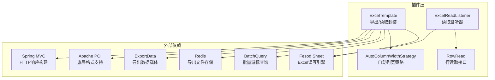
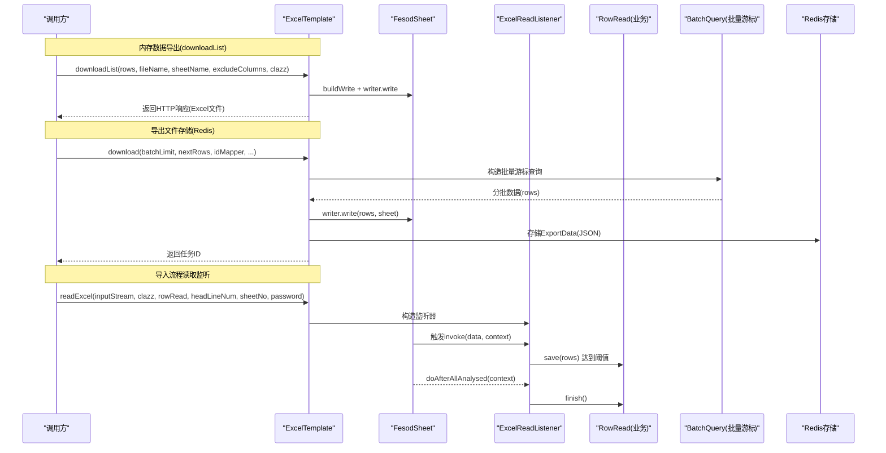
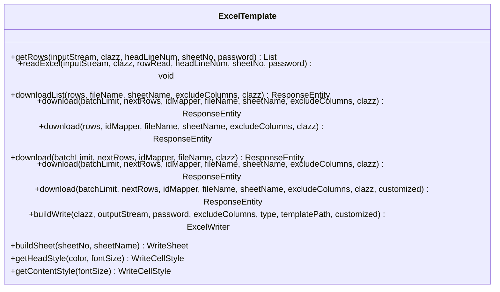
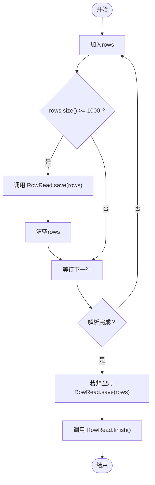
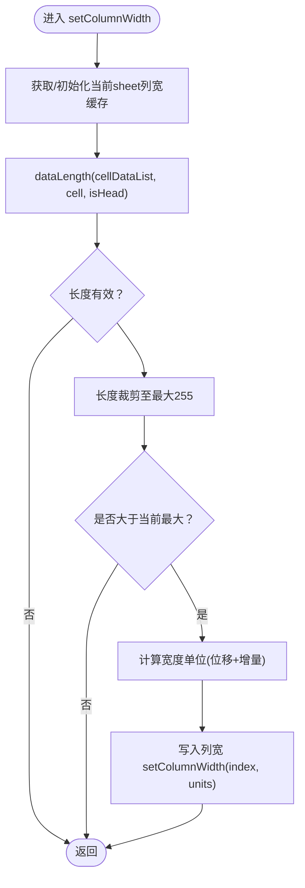
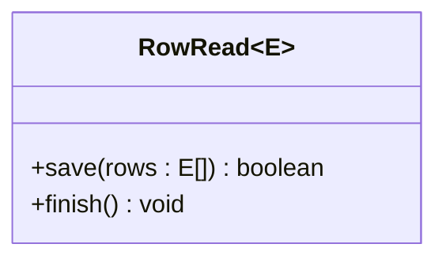
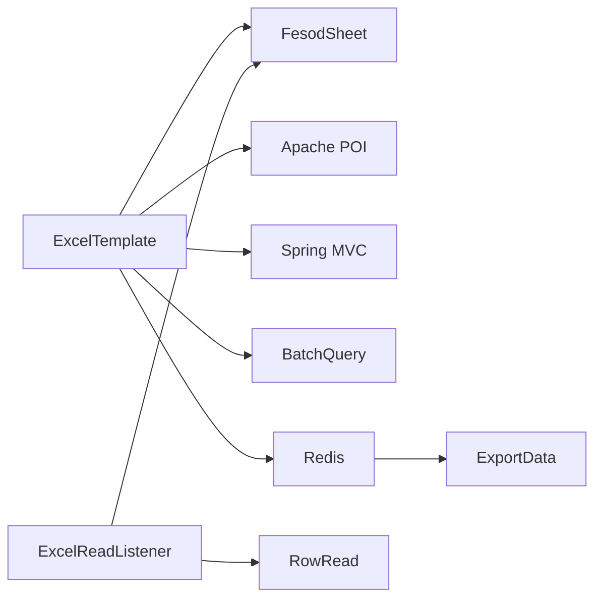

# Excel处理插件

<cite>
**本文引用的文件**
- [ExcelTemplate.java](file://src/main/java/com/jiuyu/governance/plugins/excel/ExcelTemplate.java)
- [ExcelReadListener.java](file://src/main/java/com/jiuyu/governance/plugins/excel/ExcelReadListener.java)
- [AutoColumnWidthStrategy.java](file://src/main/java/com/jiuyu/governance/plugins/excel/AutoColumnWidthStrategy.java)
- [RowRead.java](file://src/main/java/com/jiuyu/governance/plugins/excel/RowRead.java)
- [pom.xml](file://pom.xml)
- [SystemCommonController.java](file://src/main/java/com/jiuyu/governance/business/SystemCommonController.java)
</cite>

## 更新摘要
**变更内容**
- 新增downloadList方法的详细说明和使用示例
- 增强导出功能的架构描述，包括内存数据直接导出能力
- 补充浏览器下载和Redis存储导出文件的最佳实践
- 更新性能考量部分，涵盖内存导出与批量导出的对比

## 目录
1. [简介](#简介)
2. [项目结构](#项目结构)
3. [核心组件](#核心组件)
4. [架构总览](#架构总览)
5. [详细组件分析](#详细组件分析)
6. [依赖关系分析](#依赖关系分析)
7. [性能考量](#性能考量)
8. [故障排查指南](#故障排查指南)
9. [结论](#结论)
10. [附录](#附录)

## 简介
本技术文档面向"Excel处理插件"的使用者与维护者，系统阐述基于Fesod Sheet的Excel数据导入与导出能力，包括：
- ExcelTemplate模板引擎的封装与使用
- ExcelReadListener读取监听器的工作机制
- AutoColumnWidthStrategy自动列宽策略
- RowRead行读取接口的设计
- Excel文件解析流程、数据验证规则、批量处理优化与错误处理机制
- 配置参数、扩展接口与最佳实践
- 完整使用示例（模板文件创建、数据导入配置、批量写入操作、性能优化技巧）

**更新** 新增了downloadList方法，支持直接从内存数据生成Excel文件的能力，为小规模数据导出提供了更高效的解决方案。

## 项目结构
Excel处理插件位于模块的插件层，核心文件集中在plugins/excel包内，配合Spring MVC与Fesod Sheet库完成读写操作。

**图表来源**
- [ExcelTemplate.java:1-370](file://src/main/java/com/jiuyu/governance/plugins/excel/ExcelTemplate.java#L1-L370)
- [ExcelReadListener.java:1-58](file://src/main/java/com/jiuyu/governance/plugins/excel/ExcelReadListener.java#L1-L58)
- [AutoColumnWidthStrategy.java:1-142](file://src/main/java/com/jiuyu/governance/plugins/excel/AutoColumnWidthStrategy.java#L1-L142)
- [RowRead.java:1-33](file://src/main/java/com/jiuyu/governance/plugins/excel/RowRead.java#L1-L33)
- [SystemCommonController.java:1-89](file://src/main/java/com/jiuyu/governance/business/SystemCommonController.java#L1-L89)

**章节来源**
- [ExcelTemplate.java:1-370](file://src/main/java/com/jiuyu/governance/plugins/excel/ExcelTemplate.java#L1-L370)
- [pom.xml:163-166](file://pom.xml#L163-L166)

## 核心组件
- ExcelTemplate：导出与读取的统一入口，封装Fesod Sheet的写入器构建、样式策略注册、批量下载与同步读取等能力。**新增** downloadList方法支持直接从内存数据生成Excel文件。
- ExcelReadListener：基于Fesod Sheet的AnalysisEventListener实现，负责逐行解析与批量回调RowRead接口。
- AutoColumnWidthStrategy：自定义列宽策略，依据单元格数据长度与中文字体特性动态计算列宽。
- RowRead：行读取回调接口，定义save与finish两个生命周期钩子，便于业务侧实现批量持久化与收尾逻辑。

**章节来源**
- [ExcelTemplate.java:35-370](file://src/main/java/com/jiuyu/governance/plugins/excel/ExcelTemplate.java#L35-L370)
- [ExcelReadListener.java:16-57](file://src/main/java/com/jiuyu/governance/plugins/excel/ExcelReadListener.java#L16-L57)
- [AutoColumnWidthStrategy.java:24-142](file://src/main/java/com/jiuyu/governance/plugins/excel/AutoColumnWidthStrategy.java#L24-L142)
- [RowRead.java:11-33](file://src/main/java/com/jiuyu/governance/plugins/excel/RowRead.java#L11-L33)

## 架构总览
Excel处理插件采用"模板引擎 + 监听器 + 策略 + 回调"的分层设计：
- 模板引擎（ExcelTemplate）负责构建写入器、注册样式与列宽策略、组织批量下载流程。**新增** downloadList方法提供内存数据直接导出能力。
- 读取监听器（ExcelReadListener）在解析过程中收集行数据，达到阈值后回调RowRead.save，结束时调用finish。
- 自动列宽策略（AutoColumnWidthStrategy）在写入阶段动态调整列宽，提升可读性。
- RowRead接口抽象业务侧的批量保存与收尾逻辑，降低耦合。

**图表来源**
- [ExcelTemplate.java:96-116](file://src/main/java/com/jiuyu/governance/plugins/excel/ExcelTemplate.java#L96-L116)
- [ExcelTemplate.java:151-182](file://src/main/java/com/jiuyu/governance/plugins/excel/ExcelTemplate.java#L151-L182)
- [ExcelReadListener.java:34-56](file://src/main/java/com/jiuyu/governance/plugins/excel/ExcelReadListener.java#L34-L56)
- [RowRead.java:22-29](file://src/main/java/com/jiuyu/governance/plugins/excel/RowRead.java#L22-L29)
- [SystemCommonController.java:47-86](file://src/main/java/com/jiuyu/governance/business/SystemCommonController.java#L47-L86)

## 详细组件分析

### ExcelTemplate：模板引擎与导出/读取封装
- 同步读取：getRows支持指定标题行、工作表与密码，直接返回完整列表。
- 流式读取：readExcel通过监听器与RowRead回调，实现边读边存的批量处理。
- **新增** 内存数据导出：downloadList将内存中数据直接写入Excel并返回HTTP响应，适用于小规模数据导出场景。
- 批量导出：download支持以batchLimit与nextRows函数进行游标分批，结合BatchQuery避免内存峰值。
- 写入器构建：buildWrite注册AutoColumnWidthStrategy与HorizontalCellStyleStrategy，支持密码、类型、排除列与模板路径。
- 样式工具：提供表头与内容样式工厂方法，统一导出视觉风格。

**更新** downloadList方法提供了直接从内存数据生成Excel文件的能力，特别适合小规模数据的快速导出需求。

**图表来源**
- [ExcelTemplate.java:52-60](file://src/main/java/com/jiuyu/governance/plugins/excel/ExcelTemplate.java#L52-L60)
- [ExcelTemplate.java:72-82](file://src/main/java/com/jiuyu/governance/plugins/excel/ExcelTemplate.java#L72-L82)
- [ExcelTemplate.java:96-116](file://src/main/java/com/jiuyu/governance/plugins/excel/ExcelTemplate.java#L96-L116)
- [ExcelTemplate.java:130-137](file://src/main/java/com/jiuyu/governance/plugins/excel/ExcelTemplate.java#L130-L137)
- [ExcelTemplate.java:151-182](file://src/main/java/com/jiuyu/governance/plugins/excel/ExcelTemplate.java#L151-L182)
- [ExcelTemplate.java:245-265](file://src/main/java/com/jiuyu/governance/plugins/excel/ExcelTemplate.java#L245-L265)
- [ExcelTemplate.java:275-280](file://src/main/java/com/jiuyu/governance/plugins/excel/ExcelTemplate.java#L275-L280)
- [ExcelTemplate.java:288-338](file://src/main/java/com/jiuyu/governance/plugins/excel/ExcelTemplate.java#L288-L338)

**章节来源**
- [ExcelTemplate.java:41-60](file://src/main/java/com/jiuyu/governance/plugins/excel/ExcelTemplate.java#L41-L60)
- [ExcelTemplate.java:62-82](file://src/main/java/com/jiuyu/governance/plugins/excel/ExcelTemplate.java#L62-L82)
- [ExcelTemplate.java:85-116](file://src/main/java/com/jiuyu/governance/plugins/excel/ExcelTemplate.java#L85-L116)
- [ExcelTemplate.java:140-182](file://src/main/java/com/jiuyu/governance/plugins/excel/ExcelTemplate.java#L140-L182)
- [ExcelTemplate.java:233-265](file://src/main/java/com/jiuyu/governance/plugins/excel/ExcelTemplate.java#L233-L265)
- [ExcelTemplate.java:283-338](file://src/main/java/com/jiuyu/governance/plugins/excel/ExcelTemplate.java#L283-L338)

### ExcelReadListener：读取监听器工作机制
- 维护内部rows缓冲区，默认容量1024，批量阈值为1000。
- invoke(data, context)：加入rows，达到阈值即回调RowRead.save并清空缓冲。
- doAfterAllAnalysed(context)：确保剩余数据一次性提交，并调用RowRead.finish。

**图表来源**
- [ExcelReadListener.java:34-56](file://src/main/java/com/jiuyu/governance/plugins/excel/ExcelReadListener.java#L34-L56)

**章节来源**
- [ExcelReadListener.java:16-57](file://src/main/java/com/jiuyu/governance/plugins/excel/ExcelReadListener.java#L16-L57)

### AutoColumnWidthStrategy：自动列宽策略
- 缓存策略：按sheetNo与列索引维护最大宽度映射，避免重复计算。
- 数据长度计算：区分表头与内容，字符串按字节长度计算，布尔/数值按字符串表示长度。
- 中文优化：检测包含中文字符时采用整数比例缩放，兼顾渲染效率与可读性。
- 上限控制：列宽上限为255，防止极端情况导致性能问题。
- 动态扩容：根据最小宽度与差异因子进行适度扩容，平衡视觉与内存占用。

**图表来源**
- [AutoColumnWidthStrategy.java:34-64](file://src/main/java/com/jiuyu/governance/plugins/excel/AutoColumnWidthStrategy.java#L34-L64)
- [AutoColumnWidthStrategy.java:75-110](file://src/main/java/com/jiuyu/governance/plugins/excel/AutoColumnWidthStrategy.java#L75-L110)
- [AutoColumnWidthStrategy.java:121-126](file://src/main/java/com/jiuyu/governance/plugins/excel/AutoColumnWidthStrategy.java#L121-L126)
- [AutoColumnWidthStrategy.java:135-138](file://src/main/java/com/jiuyu/governance/plugins/excel/AutoColumnWidthStrategy.java#L135-L138)

**章节来源**
- [AutoColumnWidthStrategy.java:17-142](file://src/main/java/com/jiuyu/governance/plugins/excel/AutoColumnWidthStrategy.java#L17-L142)

### RowRead：行读取接口设计
- save(List<E> rows)：批量保存，返回boolean以指示是否继续后续处理。
- finish()：默认空实现，可在业务侧做事务提交、资源释放等收尾工作。

**图表来源**
- [RowRead.java:11-33](file://src/main/java/com/jiuyu/governance/plugins/excel/RowRead.java#L11-L33)

**章节来源**
- [RowRead.java:11-33](file://src/main/java/com/jiuyu/governance/plugins/excel/RowRead.java#L11-L33)

## 依赖关系分析
- Fesod Sheet：提供Excel读写核心能力，包括读取监听、写入器构建、样式策略与模板支持。
- Apache POI：底层格式支持，与Fesod Sheet协同完成单元格与样式渲染。
- Spring MVC：用于构造HTTP响应头（Content-Disposition、Content-Type）与文件下载。
- BatchQuery：提供游标分批查询能力，支撑大规模数据导出的内存友好实现。
- **新增** Redis：用于存储导出的Excel文件，支持异步导出和文件下载。

**更新** 新增了Redis依赖，用于支持异步导出和文件存储功能。

**图表来源**
- [pom.xml:163-166](file://pom.xml#L163-L166)
- [ExcelTemplate.java:245-265](file://src/main/java/com/jiuyu/governance/plugins/excel/ExcelTemplate.java#L245-L265)
- [SystemCommonController.java:35-86](file://src/main/java/com/jiuyu/governance/business/SystemCommonController.java#L35-L86)

**章节来源**
- [pom.xml:163-166](file://pom.xml#L163-L166)
- [ExcelTemplate.java:245-265](file://src/main/java/com/jiuyu/governance/plugins/excel/ExcelTemplate.java#L245-L265)

## 性能考量
- **新增** 内存导出优化：downloadList方法适用于小规模数据（通常少于10000行），避免了批量查询的开销，响应速度更快。
- 批量读取与写入：通过ExcelReadListener的1000条阈值与ExcelTemplate的批量下载，避免一次性加载全量数据到内存。
- 列宽动态计算：AutoColumnWidthStrategy使用缓存与整数位运算优化，减少重复计算与GC压力。
- 样式策略：注册HorizontalCellStyleStrategy与AutoColumnWidthStrategy，统一风格的同时提升渲染效率。
- **新增** 异步导出：对于大规模数据导出，建议使用download方法配合Redis存储，避免长时间阻塞请求。
- **新增** 文件存储：导出完成后将文件存储到Redis，通过任务ID异步下载，提升用户体验。
- 游标分批：download系列方法结合BatchQuery，按批次拉取与写入，适合百万级数据导出。
- IO与响应：使用ByteArrayOutputStream与Spring的ContentDisposition，减少磁盘IO与网络传输开销。

**更新** 新增了内存导出、异步导出和文件存储的性能考量。

## 故障排查指南
- **新增** 内存导出失败：检查downloadList方法的参数配置，确认数据量在合理范围内，避免内存溢出。
- 导出失败：检查ExcelTemplate的buildWrite与writer.finish调用链，确认异常被捕获并抛出运行时异常。
- 读取异常：确认headLineNum、sheetNo与password参数正确，确保监听器回调未被提前中断。
- 列宽异常：检查AutoColumnWidthStrategy的dataLength分支与中文检测逻辑，确保字符串长度计算与缓存命中。
- 内存溢出：优先使用download的批量游标模式，避免一次性传入全量List到downloadList。
- 文件下载乱码：确认ContentDisposition的文件名编码与浏览器兼容性。
- **新增** Redis存储异常：检查Redis连接配置，确认ExportData序列化和反序列化正常工作。

**更新** 新增了内存导出和Redis存储相关的故障排查指南。

**章节来源**
- [ExcelTemplate.java:113-115](file://src/main/java/com/jiuyu/governance/plugins/excel/ExcelTemplate.java#L113-L115)
- [ExcelTemplate.java:259-264](file://src/main/java/com/jiuyu/governance/plugins/excel/ExcelTemplate.java#L259-L264)
- [ExcelReadListener.java:37-41](file://src/main/java/com/jiuyu/governance/plugins/excel/ExcelReadListener.java#L37-L41)

## 结论
Excel处理插件通过模板引擎、监听器、策略与回调接口的组合，提供了高性能、可扩展的Excel导入导出能力。**新增** 的downloadList方法为小规模数据导出提供了更高效的解决方案，而**增强** 的批量导出与Redis存储功能则支持了大规模数据的异步处理。其批量处理与列宽自适应设计，能够满足从万级到百万级数据的导出需求；同时，清晰的扩展点与默认样式策略降低了接入成本。建议在生产环境中优先采用批量游标导出与监听器读取模式，并结合业务RowRead实现进行事务与幂等控制。

## 附录

### 使用示例（步骤说明）
- **新增** 内存数据导出（downloadList）
  - 适用于小规模数据（通常少于10000行）的快速导出
  - 直接传入内存中的List数据，无需批量查询
  - 自动注册样式策略和列宽计算
  - 返回完整的HTTP响应，支持浏览器直接下载
- 模板文件创建
  - 使用ExcelTemplate.buildWrite时，可通过templatePath参数传入模板路径，实现样式与格式复用。
  - 若无需模板，直接使用默认样式策略即可。
- 数据导入配置
  - 使用ExcelTemplate.readExcel，传入InputStream、目标类、RowRead实现、标题行、工作表编号与密码（如有）。
  - 在RowRead.save中实现批量入库逻辑，在finish中进行事务提交或资源清理。
- **新增** 大规模数据导出（批量模式）
  - 使用ExcelTemplate.download，设置batchLimit与nextRows函数，实现游标分批拉取与写入。
  - 适用于百万级数据导出，避免内存峰值。
  - 支持自定义ExcelWriterBuilder进行高级配置。
- **新增** 异步导出与下载
  - 对于超大规模数据导出，建议使用download方法配合Redis存储
  - 导出完成后返回任务ID，用户通过任务ID异步下载文件
  - SystemCommonController提供文件下载接口，支持中文文件名处理

**章节来源**
- [ExcelTemplate.java:96-116](file://src/main/java/com/jiuyu/governance/plugins/excel/ExcelTemplate.java#L96-L116)
- [ExcelTemplate.java:151-182](file://src/main/java/com/jiuyu/governance/plugins/excel/ExcelTemplate.java#L151-L182)
- [ExcelTemplate.java:245-265](file://src/main/java/com/jiuyu/governance/plugins/excel/ExcelTemplate.java#L245-L265)
- [ExcelReadListener.java:34-56](file://src/main/java/com/jiuyu/governance/plugins/excel/ExcelReadListener.java#L34-L56)
- [RowRead.java:22-29](file://src/main/java/com/jiuyu/governance/plugins/excel/RowRead.java#L22-L29)
- [SystemCommonController.java:47-86](file://src/main/java/com/jiuyu/governance/business/SystemCommonController.java#L47-L86)

### 配置参数与扩展接口清单
- ExcelTemplate
  - **新增** downloadList参数：rows、fileName、sheetName、excludeColumnFieldNames、clazz
  - **新增** 异步导出参数：customized（ExcelWriterBuilder自定义函数）
  - 方法：getRows、readExcel、downloadList、download（多种重载）、buildWrite、buildSheet、getHeadStyle、getContentStyle
- ExcelReadListener
  - 参数：RowRead实现
  - 方法：invoke、doAfterAllAnalysed
- AutoColumnWidthStrategy
  - 策略：列宽缓存、数据长度计算、中文检测、上限控制、动态扩容
- RowRead
  - 方法：save、finish
- **新增** ExportData
  - 字段：data（byte[]）、filename（String）、contentType（String）、createTime（Long）
  - 用途：Redis存储导出文件的二进制数据和元信息

**章节来源**
- [ExcelTemplate.java:41-265](file://src/main/java/com/jiuyu/governance/plugins/excel/ExcelTemplate.java#L41-L265)
- [ExcelReadListener.java:16-57](file://src/main/java/com/jiuyu/governance/plugins/excel/ExcelReadListener.java#L16-L57)
- [AutoColumnWidthStrategy.java:24-142](file://src/main/java/com/jiuyu/governance/plugins/excel/AutoColumnWidthStrategy.java#L24-L142)
- [RowRead.java:11-33](file://src/main/java/com/jiuyu/governance/plugins/excel/RowRead.java#L11-L33)
- [SystemCommonController.java:21-89](file://src/main/java/com/jiuyu/governance/business/SystemCommonController.java#L21-L89)