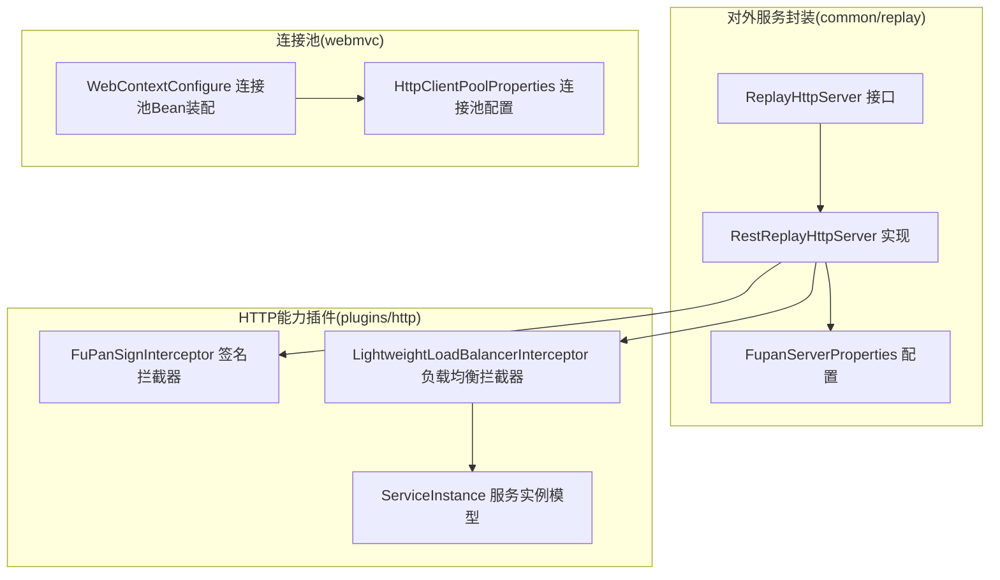
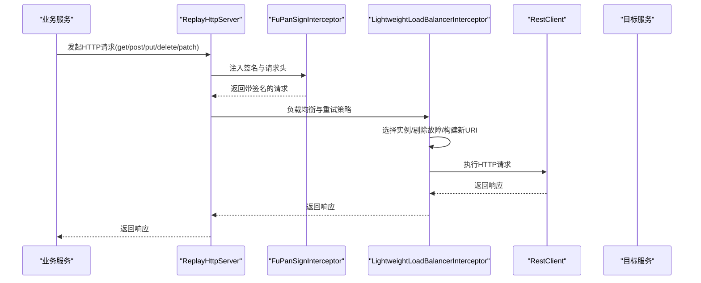
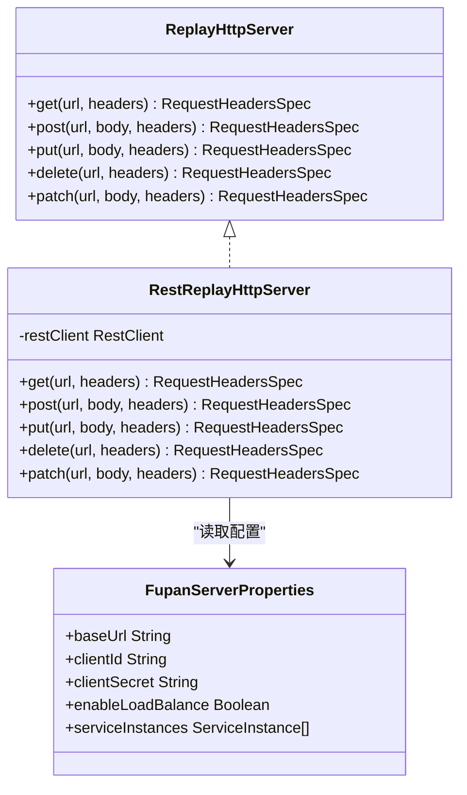
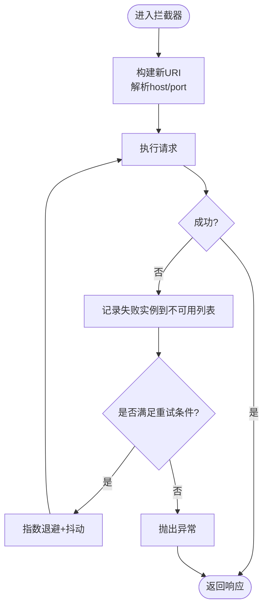
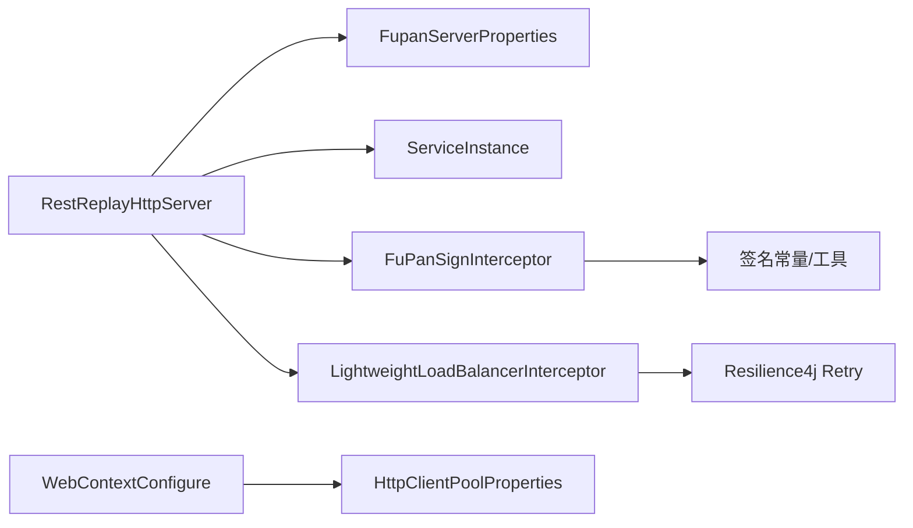

# HTTP客户端插件

<cite>
**本文引用的文件**
- [RestReplayHttpServer.java](file://src/main/java/com/jiuyu/governance/common/replay/RestReplayHttpServer.java)
- [ReplayHttpServer.java](file://src/main/java/com/jiuyu/governance/common/replay/ReplayHttpServer.java)
- [FupanServerProperties.java](file://src/main/java/com/jiuyu/governance/common/replay/FupanServerProperties.java)
- [LightweightLoadBalancerInterceptor.java](file://src/main/java/com/jiuyu/governance/plugins/http/LightweightLoadBalancerInterceptor.java)
- [ServiceInstance.java](file://src/main/java/com/jiuyu/governance/plugins/http/ServiceInstance.java)
- [FuPanSignInterceptor.java](file://src/main/java/com/jiuyu/governance/plugins/http/FuPanSignInterceptor.java)
- [HttpClientPoolProperties.java](file://src/main/java/com/jiuyu/governance/plugins/webmvc/HttpClientPoolProperties.java)
- [WebContextConfigure.java](file://src/main/java/com/jiuyu/governance/plugins/webmvc/WebContextConfigure.java)
- [application.yml](file://src/main/resources/application.yml)
- [UserAccountServiceImpl.java](file://src/main/java/com/jiuyu/governance/openfeign/replay/impl/UserAccountServiceImpl.java)
</cite>

## 目录
1. [简介](#简介)
2. [项目结构](#项目结构)
3. [核心组件](#核心组件)
4. [架构总览](#架构总览)
5. [详细组件分析](#详细组件分析)
6. [依赖关系分析](#依赖关系分析)
7. [性能与可靠性](#性能与可靠性)
8. [故障排查指南](#故障排查指南)
9. [结论](#结论)
10. [附录](#附录)

## 简介
本技术文档围绕HTTP客户端插件展开，重点解释以下内容：
- RESTful服务封装：RestReplayHttpServer如何基于Spring WebClient的RestClient提供统一的HTTP访问入口。
- 轻量级负载均衡：LightweightLoadBalancerInterceptor如何在拦截器层实现加权轮询、故障实例剔除与自动重试。
- 服务实例管理：ServiceInstance的数据结构与权重配置。
- 安全签名：FuPanSignInterceptor如何生成并注入请求签名。
- 配置体系：FupanServerProperties与Web MVC连接池配置的要点。
- 异步与监控：如何通过拦截器与响应式模型实现异步请求与可观测性。
- 扩展与自定义：如何开发自定义拦截器与扩展点。

## 项目结构
HTTP客户端插件位于common与plugins两个包中，分别负责对外服务封装与内部HTTP能力：
- common/replay：对外暴露ReplayHttpServer接口及其实现RestReplayHttpServer；配合FupanServerProperties完成基础URL、签名与负载均衡开关配置。
- plugins/http：提供签名拦截器FuPanSignInterceptor与负载均衡拦截器LightweightLoadBalancerInterceptor，以及服务实例模型ServiceInstance。
- plugins/webmvc：提供Apache HttpClient连接池配置与工厂Bean，用于传统同步HTTP场景（与RestClient互补）。

**图表来源**
- [RestReplayHttpServer.java:1-118](file://src/main/java/com/jiuyu/governance/common/replay/RestReplayHttpServer.java#L1-L118)
- [ReplayHttpServer.java:1-72](file://src/main/java/com/jiuyu/governance/common/replay/ReplayHttpServer.java#L1-L72)
- [FupanServerProperties.java:1-48](file://src/main/java/com/jiuyu/governance/common/replay/FupanServerProperties.java#L1-L48)
- [FuPanSignInterceptor.java:1-111](file://src/main/java/com/jiuyu/governance/plugins/http/FuPanSignInterceptor.java#L1-L111)
- [LightweightLoadBalancerInterceptor.java:1-190](file://src/main/java/com/jiuyu/governance/plugins/http/LightweightLoadBalancerInterceptor.java#L1-L190)
- [ServiceInstance.java:1-36](file://src/main/java/com/jiuyu/governance/plugins/http/ServiceInstance.java#L1-L36)
- [HttpClientPoolProperties.java:1-46](file://src/main/java/com/jiuyu/governance/plugins/webmvc/HttpClientPoolProperties.java#L1-L46)
- [WebContextConfigure.java:172-216](file://src/main/java/com/jiuyu/governance/plugins/webmvc/WebContextConfigure.java#L172-L216)

**章节来源**
- [RestReplayHttpServer.java:1-118](file://src/main/java/com/jiuyu/governance/common/replay/RestReplayHttpServer.java#L1-L118)
- [ReplayHttpServer.java:1-72](file://src/main/java/com/jiuyu/governance/common/replay/ReplayHttpServer.java#L1-L72)
- [FupanServerProperties.java:1-48](file://src/main/java/com/jiuyu/governance/common/replay/FupanServerProperties.java#L1-L48)
- [FuPanSignInterceptor.java:1-111](file://src/main/java/com/jiuyu/governance/plugins/http/FuPanSignInterceptor.java#L1-L111)
- [LightweightLoadBalancerInterceptor.java:1-190](file://src/main/java/com/jiuyu/governance/plugins/http/LightweightLoadBalancerInterceptor.java#L1-L190)
- [ServiceInstance.java:1-36](file://src/main/java/com/jiuyu/governance/plugins/http/ServiceInstance.java#L1-L36)
- [HttpClientPoolProperties.java:1-46](file://src/main/java/com/jiuyu/governance/plugins/webmvc/HttpClientPoolProperties.java#L1-L46)
- [WebContextConfigure.java:172-216](file://src/main/java/com/jiuyu/governance/plugins/webmvc/WebContextConfigure.java#L172-L216)

## 核心组件
- ReplayHttpServer接口：定义GET/POST/PUT/DELETE/PATCH等HTTP方法的请求入口，返回RestClient.RequestHeadersSpec，便于后续retrieve/body等收尾操作。
- RestReplayHttpServer实现：基于RestClient.Builder装配baseUrl、签名拦截器与可选的负载均衡拦截器，形成统一的HTTP客户端。
- FupanServerProperties配置：提供基础URL、clientId/clientSecret、enableLoadBalance开关与serviceInstances列表。
- FuPanSignInterceptor：在请求头中注入签名、时间戳、请求ID与签名类型，确保服务端鉴权与防重放。
- LightweightLoadBalancerInterceptor：在拦截器层实现加权轮询、故障实例剔除与自动重试，提升可用性与稳定性。
- ServiceInstance：承载实例ID与权重，作为负载均衡的基础数据结构。
- HttpClientPoolProperties与WebContextConfigure：提供基于Apache HttpClient 5的连接池配置与工厂Bean，适用于需要同步HTTP场景。

**章节来源**
- [ReplayHttpServer.java:15-71](file://src/main/java/com/jiuyu/governance/common/replay/ReplayHttpServer.java#L15-L71)
- [RestReplayHttpServer.java:21-117](file://src/main/java/com/jiuyu/governance/common/replay/RestReplayHttpServer.java#L21-L117)
- [FupanServerProperties.java:20-47](file://src/main/java/com/jiuyu/governance/common/replay/FupanServerProperties.java#L20-L47)
- [FuPanSignInterceptor.java:33-110](file://src/main/java/com/jiuyu/governance/plugins/http/FuPanSignInterceptor.java#L33-L110)
- [LightweightLoadBalancerInterceptor.java:31-189](file://src/main/java/com/jiuyu/governance/plugins/http/LightweightLoadBalancerInterceptor.java#L31-L189)
- [ServiceInstance.java:12-35](file://src/main/java/com/jiuyu/governance/plugins/http/ServiceInstance.java#L12-L35)
- [HttpClientPoolProperties.java:17-46](file://src/main/java/com/jiuyu/governance/plugins/webmvc/HttpClientPoolProperties.java#L17-L46)
- [WebContextConfigure.java:172-216](file://src/main/java/com/jiuyu/governance/plugins/webmvc/WebContextConfigure.java#L172-L216)

## 架构总览
下图展示了HTTP客户端插件的整体交互：业务通过ReplayHttpServer发起REST请求，请求依次经过签名拦截器与负载均衡拦截器，最终由RestClient执行网络调用。

**图表来源**
- [RestReplayHttpServer.java:26-33](file://src/main/java/com/jiuyu/governance/common/replay/RestReplayHttpServer.java#L26-L33)
- [FuPanSignInterceptor.java:58-86](file://src/main/java/com/jiuyu/governance/plugins/http/FuPanSignInterceptor.java#L58-L86)
- [LightweightLoadBalancerInterceptor.java:108-126](file://src/main/java/com/jiuyu/governance/plugins/http/LightweightLoadBalancerInterceptor.java#L108-L126)

## 详细组件分析

### RestReplayHttpServer：RESTful服务实现
- 功能职责
  - 基于RestClient.Builder设置baseUrl与拦截器链。
  - 提供get/post/put/delete/patch方法，统一返回RestClient.RequestHeadersSpec，便于后续retrieve/body等收尾。
  - 条件装配：当enableLoadBalance为true时，追加LightweightLoadBalancerInterceptor。
- 关键点
  - 使用@EnableConfigurationProperties加载FupanServerProperties。
  - headers方法统一注入请求头，避免重复逻辑。

**图表来源**
- [ReplayHttpServer.java:15-71](file://src/main/java/com/jiuyu/governance/common/replay/ReplayHttpServer.java#L15-L71)
- [RestReplayHttpServer.java:21-117](file://src/main/java/com/jiuyu/governance/common/replay/RestReplayHttpServer.java#L21-L117)
- [FupanServerProperties.java:20-47](file://src/main/java/com/jiuyu/governance/common/replay/FupanServerProperties.java#L20-L47)

**章节来源**
- [RestReplayHttpServer.java:21-117](file://src/main/java/com/jiuyu/governance/common/replay/RestReplayHttpServer.java#L21-L117)
- [ReplayHttpServer.java:15-71](file://src/main/java/com/jiuyu/governance/common/replay/ReplayHttpServer.java#L15-L71)
- [FupanServerProperties.java:20-47](file://src/main/java/com/jiuyu/governance/common/replay/FupanServerProperties.java#L20-L47)

### LightweightLoadBalancerInterceptor：轻量级负载均衡拦截器
- 工作原理
  - 加权轮询：维护原子计数器与总权重，按权重区间选择实例。
  - 故障剔除：每次IO异常将失败实例加入不可用列表，在后续重试中跳过。
  - 自动重试：基于Resilience4j Retry，过滤连接异常、超时与5xx错误，指数退避+抖动。
  - 响应式执行：使用Mono.fromCallable + retryWhen + subscribeOn(boundedElastic)，保证非阻塞。
  - URI重写：根据实例ID解析host/port，动态替换请求URI。
- 关键点
  - 仅在多实例时启用加权轮询，单实例直接返回。
  - 默认重试次数与抖动因子与实例数量相关，避免雪崩。
  - 不可用实例列表在每次重试时更新，提升恢复能力。

**图表来源**
- [LightweightLoadBalancerInterceptor.java:108-126](file://src/main/java/com/jiuyu/governance/plugins/http/LightweightLoadBalancerInterceptor.java#L108-L126)
- [LightweightLoadBalancerInterceptor.java:140-159](file://src/main/java/com/jiuyu/governance/plugins/http/LightweightLoadBalancerInterceptor.java#L140-L159)
- [LightweightLoadBalancerInterceptor.java:74-87](file://src/main/java/com/jiuyu/governance/plugins/http/LightweightLoadBalancerInterceptor.java#L74-L87)

**章节来源**
- [LightweightLoadBalancerInterceptor.java:31-189](file://src/main/java/com/jiuyu/governance/plugins/http/LightweightLoadBalancerInterceptor.java#L31-L189)
- [ServiceInstance.java:12-35](file://src/main/java/com/jiuyu/governance/plugins/http/ServiceInstance.java#L12-L35)

### ServiceInstance：服务实例管理
- 字段
  - instanceId：实例标识（支持host:port或scheme://host:port格式）。
  - weight：实例权重，默认1。
- 作用
  - 作为负载均衡选择的基础数据结构，参与加权轮询与权重统计。

**章节来源**
- [ServiceInstance.java:12-35](file://src/main/java/com/jiuyu/governance/plugins/http/ServiceInstance.java#L12-L35)

### FuPanSignInterceptor：请求签名拦截器
- 功能
  - 生成请求ID、时间戳与随机数nonce。
  - 按ASCII排序拼接待签名串，使用HMAC-SHA256签名并Base64编码。
  - 注入X-Signature、X-Timestamp、X-Nonce、X-App-Id、X-Sign-Type等头部。
- 关键点
  - 支持携带请求体的签名（body参数），便于服务端校验。
  - 头部名称与签名模型来自SignatureConstants与SignGenerate工具。

**章节来源**
- [FuPanSignInterceptor.java:33-110](file://src/main/java/com/jiuyu/governance/plugins/http/FuPanSignInterceptor.java#L33-L110)

### 连接池与超时配置：Web MVC集成
- HttpClientPoolProperties
  - 支持启用开关、最大连接数、每路由最大并发、连接超时、读超时、连接请求超时、TTL、空闲清理等。
- WebContextConfigure
  - 条件装配：当配置开启时，创建CloseableHttpClient Bean。
  - 配置项：SocketConfig、ConnectionConfig、PoolingHttpClientConnectionManager、RequestConfig。
  - 清理策略：定期驱逐空闲与过期连接，避免资源泄漏。
- 适用场景
  - 与RestClient互补，用于需要同步HTTP调用或兼容旧框架的场景。

**章节来源**
- [HttpClientPoolProperties.java:17-46](file://src/main/java/com/jiuyu/governance/plugins/webmvc/HttpClientPoolProperties.java#L17-L46)
- [WebContextConfigure.java:172-216](file://src/main/java/com/jiuyu/governance/plugins/webmvc/WebContextConfigure.java#L172-L216)

## 依赖关系分析
- 组件耦合
  - RestReplayHttpServer依赖FupanServerProperties与拦截器链。
  - 负载均衡拦截器依赖ServiceInstance列表与Resilience4j Retry。
  - 签名拦截器依赖签名常量与签名生成工具。
- 外部依赖
  - Spring WebClient RestClient（响应式HTTP客户端）。
  - Resilience4j Retry（重试策略）。
  - Apache HttpClient 5（可选连接池）。

**图表来源**
- [RestReplayHttpServer.java:26-33](file://src/main/java/com/jiuyu/governance/common/replay/RestReplayHttpServer.java#L26-L33)
- [FupanServerProperties.java:40-47](file://src/main/java/com/jiuyu/governance/common/replay/FupanServerProperties.java#L40-L47)
- [LightweightLoadBalancerInterceptor.java:74-87](file://src/main/java/com/jiuyu/governance/plugins/http/LightweightLoadBalancerInterceptor.java#L74-L87)
- [FuPanSignInterceptor.java:95-107](file://src/main/java/com/jiuyu/governance/plugins/http/FuPanSignInterceptor.java#L95-L107)
- [WebContextConfigure.java:172-216](file://src/main/java/com/jiuyu/governance/plugins/webmvc/WebContextConfigure.java#L172-L216)
- [HttpClientPoolProperties.java:17-46](file://src/main/java/com/jiuyu/governance/plugins/webmvc/HttpClientPoolProperties.java#L17-L46)

**章节来源**
- [RestReplayHttpServer.java:26-33](file://src/main/java/com/jiuyu/governance/common/replay/RestReplayHttpServer.java#L26-L33)
- [LightweightLoadBalancerInterceptor.java:74-87](file://src/main/java/com/jiuyu/governance/plugins/http/LightweightLoadBalancerInterceptor.java#L74-L87)
- [FuPanSignInterceptor.java:95-107](file://src/main/java/com/jiuyu/governance/plugins/http/FuPanSignInterceptor.java#L95-L107)
- [WebContextConfigure.java:172-216](file://src/main/java/com/jiuyu/governance/plugins/webmvc/WebContextConfigure.java#L172-L216)

## 性能与可靠性
- 响应式执行
  - 负载均衡拦截器使用Mono.fromCallable + retryWhen + boundedElastic，避免阻塞主线程。
- 超时与重试
  - 默认重试策略针对连接异常、超时与5xx错误，采用指数退避+抖动，降低风暴效应。
  - 可根据实例数量调整重试次数，实例越多重试越谨慎。
- 连接池优化
  - 合理设置maxTotal、defaultMaxPerRoute、connectTimeout、socketTimeout、timeToLive与maxIdleTime。
  - 定期清理空闲与过期连接，避免资源泄露。
- 可观测性
  - 建议在拦截器链中增加监控埋点（如耗时、状态码、重试次数），结合日志输出定位问题。

[本节为通用指导，无需列出具体文件来源]

## 故障排查指南
- 签名失败
  - 检查clientSecret是否正确配置，确认签名算法与头部名称一致。
  - 关注签名生成过程中的异常并查看对应错误码。
- 无可用实例
  - 当所有实例均不可用时会抛出“没有可用实例”异常，检查ServiceInstance列表与网络连通性。
- 连接超时/读超时
  - 调整HttpClientPoolProperties中的connectTimeout、socketTimeout与connectionRequestTimeout。
- 重试耗尽
  - 观察重试策略过滤条件与最大重试次数，必要时放宽阈值或优化上游服务。
- 负载均衡不生效
  - 确认enableLoadBalance为true且serviceInstances非空，检查实例权重与host:port格式。

**章节来源**
- [FuPanSignInterceptor.java:103-105](file://src/main/java/com/jiuyu/governance/plugins/http/FuPanSignInterceptor.java#L103-L105)
- [LightweightLoadBalancerInterceptor.java:115-117](file://src/main/java/com/jiuyu/governance/plugins/http/LightweightLoadBalancerInterceptor.java#L115-L117)
- [HttpClientPoolProperties.java:34-43](file://src/main/java/com/jiuyu/governance/plugins/webmvc/HttpClientPoolProperties.java#L34-L43)

## 结论
本HTTP客户端插件通过RestClient与拦截器链实现统一、安全、可靠的HTTP访问：
- 签名拦截器保障请求安全与防重放。
- 负载均衡拦截器在拦截器层实现加权轮询与故障转移，提升可用性。
- 配置驱动的RestReplayHttpServer简化了业务接入成本。
- 可选的Apache HttpClient连接池满足同步场景需求。
建议在生产环境中结合监控与日志，持续优化超时与重试策略，确保系统稳定与性能平衡。

[本节为总结性内容，无需列出具体文件来源]

## 附录

### 配置示例与最佳实践
- application.yml中与HTTP相关的配置片段
  - jiuyu.http.client.*：连接池参数（启用开关、最大连接数、超时等）。
  - jiuyu.signature.*：签名头部名称与过期时间等。
- FupanServerProperties
  - jiuyu.fupan-server.base-url：基础URL。
  - jiuyu.fupan-server.enable-load-balance：是否启用负载均衡。
  - jiuyu.fupan-server.service-instances：实例列表（instanceId、weight）。

**章节来源**
- [application.yml:106-116](file://src/main/resources/application.yml#L106-L116)
- [FupanServerProperties.java:24-47](file://src/main/java/com/jiuyu/governance/common/replay/FupanServerProperties.java#L24-L47)

### 使用示例（路径参考）
- 通过ReplayHttpServer发起GET请求
  - [RestReplayHttpServer.get(...):52-56](file://src/main/java/com/jiuyu/governance/common/replay/RestReplayHttpServer.java#L52-L56)
- 通过ReplayHttpServer发起POST请求
  - [RestReplayHttpServer.post(...):67-71](file://src/main/java/com/jiuyu/governance/common/replay/RestReplayHttpServer.java#L67-L71)
- 业务服务中使用ReplayHttpServer
  - [UserAccountServiceImpl.bind(...) 与 getMainAccountDetail(...):48-122](file://src/main/java/com/jiuyu/governance/openfeign/replay/impl/UserAccountServiceImpl.java#L48-L122)

**章节来源**
- [RestReplayHttpServer.java:52-116](file://src/main/java/com/jiuyu/governance/common/replay/RestReplayHttpServer.java#L52-L116)
- [UserAccountServiceImpl.java:25-135](file://src/main/java/com/jiuyu/governance/openfeign/replay/impl/UserAccountServiceImpl.java#L25-L135)

### 扩展与自定义拦截器
- 开发步骤
  - 实现ClientHttpRequestInterceptor接口，覆盖intercept方法。
  - 在RestReplayHttpServer.Builder阶段追加自定义拦截器，确保顺序符合业务需求。
  - 如需响应式重试或异步处理，可参考LightweightLoadBalancerInterceptor的Mono.fromCallable + retryWhen模式。
- 注意事项
  - 保持线程安全与幂等性。
  - 明确异常类型与重试条件，避免无限循环。
  - 与签名拦截器的顺序：通常签名在前，再进行负载均衡与重试。

**章节来源**
- [LightweightLoadBalancerInterceptor.java:108-126](file://src/main/java/com/jiuyu/governance/plugins/http/LightweightLoadBalancerInterceptor.java#L108-L126)
- [RestReplayHttpServer.java:26-33](file://src/main/java/com/jiuyu/governance/common/replay/RestReplayHttpServer.java#L26-L33)