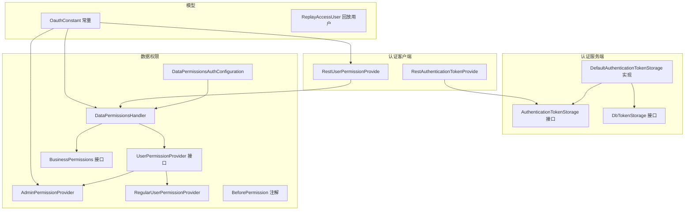
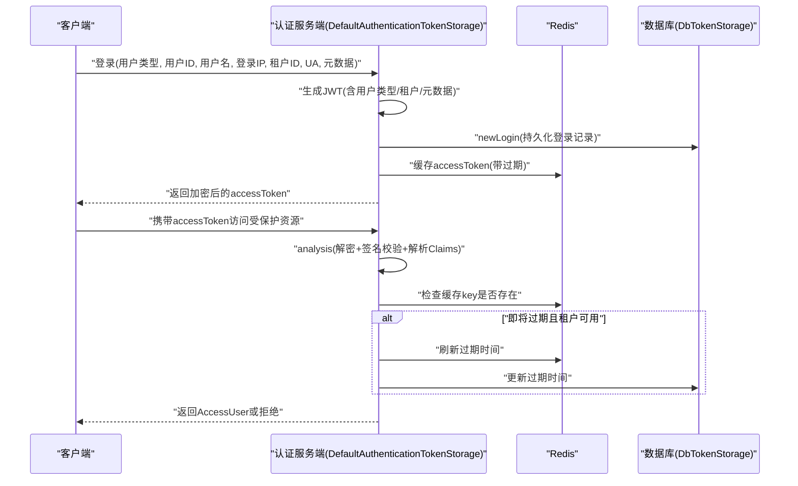
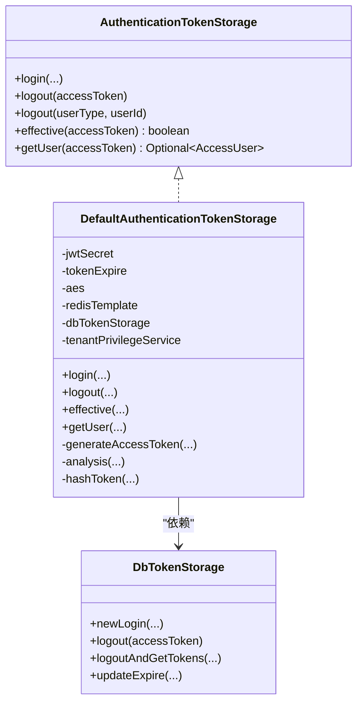
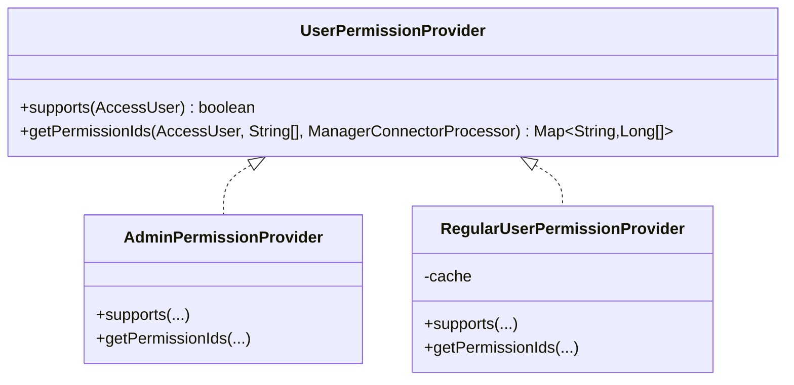
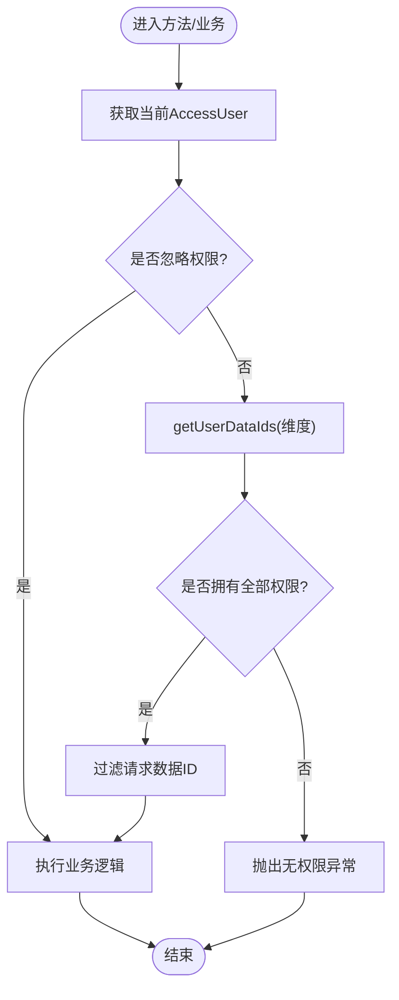
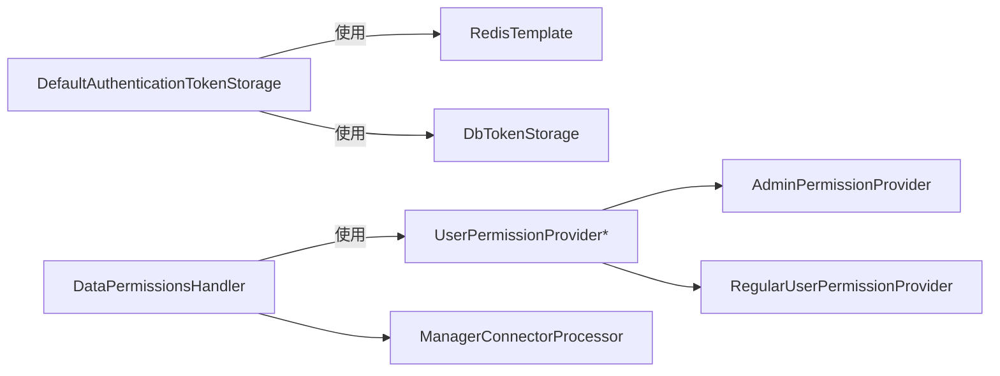

# OAuth认证插件

<cite>
**本文引用的文件**
- [GovernanceUser.java](file://src/main/java/com/jiuyu/governance/plugins/oauth/GovernanceUser.java)
- [SystemUser.java](file://src/main/java/com/jiuyu/governance/plugins/oauth/SystemUser.java)
- [ClientUser.java](file://src/main/java/com/jiuyu/governance/plugins/oauth/ClientUser.java)
- [OauthConstant.java](file://src/main/java/com/jiuyu/governance/plugins/oauth/pojo/OauthConstant.java)
- [ReplayAccessUser.java](file://src/main/java/com/jiuyu/governance/plugins/oauth/pojo/ReplayAccessUser.java)
- [AuthenticationTokenStorage.java](file://src/main/java/com/jiuyu/governance/plugins/oauth/server/AuthenticationTokenStorage.java)
- [DbTokenStorage.java](file://src/main/java/com/jiuyu/governance/plugins/oauth/server/DbTokenStorage.java)
- [DefaultAuthenticationTokenStorage.java](file://src/main/java/com/jiuyu/governance/plugins/oauth/server/DefaultAuthenticationTokenStorage.java)
- [RestAuthenticationTokenProvide.java](file://src/main/java/com/jiuyu/governance/plugins/oauth/client/RestAuthenticationTokenProvide.java)
- [RestUserPermissionProvide.java](file://src/main/java/com/jiuyu/governance/plugins/oauth/client/RestUserPermissionProvide.java)
- [DataPermissionsAuthConfiguration.java](file://src/main/java/com/jiuyu/governance/plugins/oauth/data/DataPermissionsAuthConfiguration.java)
- [DataPermissionsHandler.java](file://src/main/java/com/jiuyu/governance/plugins/oauth/data/supports/DataPermissionsHandler.java)
- [UserPermissionProvider.java](file://src/main/java/com/jiuyu/governance/plugins/oauth/data/provider/UserPermissionProvider.java)
- [AdminPermissionProvider.java](file://src/main/java/com/jiuyu/governance/plugins/oauth/data/provider/AdminPermissionProvider.java)
- [RegularUserPermissionProvider.java](file://src/main/java/com/jiuyu/governance/plugins/oauth/data/provider/RegularUserPermissionProvider.java)
- [BusinessPermissions.java](file://src/main/java/com/jiuyu/governance/plugins/oauth/data/BusinessPermissions.java)
- [BeforePermission.java](file://src/main/java/com/jiuyu/governance/plugins/oauth/data/BeforePermission.java)
- [DataPermissionExecuteAspect.java](file://src/main/java/com/jiuyu/governance/plugins/oauth/data/aop/DataPermissionExecuteAspect.java)
- [DataPermissionsQueryPredicate.java](file://src/main/java/com/jiuyu/governance/plugins/oauth/data/aop/DataPermissionsQueryPredicate.java)
- [application.yml](file://src/main/resources/application.yml)
- [application-dev.yml](file://src/main/resources/application-dev.yml)
- [application-local.yml](file://src/main/resources/application-local.yml)
</cite>

## 更新摘要
**变更内容**
- 更新OAuth认证插件配置参数，包括客户端ID和客户端密钥的安全增强
- 新增API Key Secret配置支持多应用ID和密钥管理
- 优化OAuth配置结构，确保与环境配置保持一致

## 目录
1. [简介](#简介)
2. [项目结构](#项目结构)
3. [核心组件](#核心组件)
4. [架构总览](#架构总览)
5. [组件详解](#组件详解)
6. [依赖关系分析](#依赖关系分析)
7. [性能考量](#性能考量)
8. [故障排查指南](#故障排查指南)
9. [结论](#结论)
10. [附录](#附录)

## 简介
本文件为OAuth认证插件的技术文档，聚焦基于JWT的认证授权机制与数据权限控制。内容涵盖三类用户类型（GovernanceUser、SystemUser、ClientUser）的权限模型、DbTokenStorage令牌存储实现、权限提供者（AdminPermissionProvider、RegularUserPermissionProvider）的实现原理、数据权限配置与处理器（DataPermissionsAuthConfiguration、DataPermissionsHandler）的工作流程，并提供完整的认证流程示例、配置参数说明、扩展接口与安全最佳实践。

**重要更新**：DataPermissionsHandler中的权限检查逻辑已从使用`anyMatch`改进为使用`allMatch`，提升了组织架构权限验证的完整性约束。

## 项目结构
OAuth相关代码集中在plugins/oauth目录，按职责划分为：
- server：认证令牌存储与生成（JWT、Redis、数据库）
- client：远程鉴权与权限提供
- data：数据权限自动装配、处理器与权限提供者
- pojo：常量与回放用户信息模型

**图表来源**
- [DefaultAuthenticationTokenStorage.java:45-127](file://src/main/java/com/jiuyu/governance/plugins/oauth/server/DefaultAuthenticationTokenStorage.java#L45-L127)
- [DbTokenStorage.java:14-70](file://src/main/java/com/jiuyu/governance/plugins/oauth/server/DbTokenStorage.java#L14-L70)
- [DataPermissionsAuthConfiguration.java:29-77](file://src/main/java/com/jiuyu/governance/plugins/oauth/data/DataPermissionsAuthConfiguration.java#L29-L77)
- [DataPermissionsHandler.java:102-120](file://src/main/java/com/jiuyu/governance/plugins/oauth/data/supports/DataPermissionsHandler.java#L102-L120)
- [UserPermissionProvider.java:16-38](file://src/main/java/com/jiuyu/governance/plugins/oauth/data/provider/UserPermissionProvider.java#L16-L38)
- [AdminPermissionProvider.java:29-99](file://src/main/java/com/jiuyu/governance/plugins/oauth/data/provider/AdminPermissionProvider.java#L29-L99)
- [RegularUserPermissionProvider.java:26-80](file://src/main/java/com/jiuyu/governance/plugins/oauth/data/provider/RegularUserPermissionProvider.java#L26-L80)
- [BusinessPermissions.java:13-36](file://src/main/java/com/jiuyu/governance/plugins/oauth/data/BusinessPermissions.java#L13-L36)
- [BeforePermission.java:17-79](file://src/main/java/com/jiuyu/governance/plugins/oauth/data/BeforePermission.java#L17-L79)
- [OauthConstant.java:9-80](file://src/main/java/com/jiuyu/governance/plugins/oauth/pojo/OauthConstant.java#L9-L80)
- [ReplayAccessUser.java:22-79](file://src/main/java/com/jiuyu/governance/plugins/oauth/pojo/ReplayAccessUser.java#L22-L79)

**章节来源**
- [DefaultAuthenticationTokenStorage.java:45-127](file://src/main/java/com/jiuyu/governance/plugins/oauth/server/DefaultAuthenticationTokenStorage.java#L45-L127)
- [DataPermissionsAuthConfiguration.java:29-77](file://src/main/java/com/jiuyu/governance/plugins/oauth/data/DataPermissionsAuthConfiguration.java#L29-L77)

## 核心组件
- 三类用户注解与常量
  - GovernanceUser：限定企业后台管理用户访问
  - SystemUser：限定爱复盘后台管理用户访问
  - ClientUser：限定客户端用户访问
  - 常量定义：用户类型标识、数据权限类型及级别映射
- 令牌存储与生成
  - AuthenticationTokenStorage：登录、登出、有效性检查、解析用户
  - DefaultAuthenticationTokenStorage：JWT签名、Redis缓存、数据库持久化
  - DbTokenStorage：数据库侧登录记录、登出、批量踢人
- 权限提供者
  - UserPermissionProvider：统一接口，支持管理员与普通用户策略
  - AdminPermissionProvider：系统/租户管理员全量权限
  - RegularUserPermissionProvider：常规用户按连接器拉取具体权限ID
- 数据权限
  - DataPermissionsAuthConfiguration：装配处理器、切面与参数
  - DataPermissionsHandler：权限校验、批量校验、请求级缓存、忽略权限执行
  - BusinessPermissions：业务维度权限扩展点
  - BeforePermission：方法级权限注解，支持多组与层级校验

**章节来源**
- [GovernanceUser.java:14-19](file://src/main/java/com/jiuyu/governance/plugins/oauth/GovernanceUser.java#L14-L19)
- [SystemUser.java:14-19](file://src/main/java/com/jiuyu/governance/plugins/oauth/SystemUser.java#L14-L19)
- [ClientUser.java:14-19](file://src/main/java/com/jiuyu/governance/plugins/oauth/ClientUser.java#L14-L19)
- [OauthConstant.java:9-80](file://src/main/java/com/jiuyu/governance/plugins/oauth/pojo/OauthConstant.java#L9-L80)
- [AuthenticationTokenStorage.java:16-60](file://src/main/java/com/jiuyu/governance/plugins/oauth/server/AuthenticationTokenStorage.java#L16-L60)
- [DefaultAuthenticationTokenStorage.java:86-127](file://src/main/java/com/jiuyu/governance/plugins/oauth/server/DefaultAuthenticationTokenStorage.java#L86-L127)
- [DbTokenStorage.java:14-70](file://src/main/java/com/jiuyu/governance/plugins/oauth/server/DbTokenStorage.java#L14-L70)
- [UserPermissionProvider.java:16-38](file://src/main/java/com/jiuyu/governance/plugins/oauth/data/provider/UserPermissionProvider.java#L16-L38)
- [AdminPermissionProvider.java:29-99](file://src/main/java/com/jiuyu/governance/plugins/oauth/data/provider/AdminPermissionProvider.java#L29-L99)
- [RegularUserPermissionProvider.java:26-80](file://src/main/java/com/jiuyu/governance/plugins/oauth/data/provider/RegularUserPermissionProvider.java#L26-L80)
- [DataPermissionsAuthConfiguration.java:29-77](file://src/main/java/com/jiuyu/governance/plugins/oauth/data/DataPermissionsAuthConfiguration.java#L29-L77)
- [DataPermissionsHandler.java:102-120](file://src/main/java/com/jiuyu/governance/plugins/oauth/data/supports/DataPermissionsHandler.java#L102-L120)
- [BusinessPermissions.java:13-36](file://src/main/java/com/jiuyu/governance/plugins/oauth/data/BusinessPermissions.java#L13-L36)
- [BeforePermission.java:17-79](file://src/main/java/com/jiuyu/governance/plugins/oauth/data/BeforePermission.java#L17-L79)

## 架构总览
整体采用"服务端JWT + Redis缓存 + 可选数据库持久化"的令牌存储方案；数据权限通过AOP切面与处理器在方法执行前后进行校验与过滤。

**图表来源**
- [DefaultAuthenticationTokenStorage.java:144-156](file://src/main/java/com/jiuyu/governance/plugins/oauth/server/DefaultAuthenticationTokenStorage.java#L144-L156)
- [DefaultAuthenticationTokenStorage.java:231-255](file://src/main/java/com/jiuyu/governance/plugins/oauth/server/DefaultAuthenticationTokenStorage.java#L231-L255)
- [DbTokenStorage.java:28-36](file://src/main/java/com/jiuyu/governance/plugins/oauth/server/DbTokenStorage.java#L28-L36)

## 组件详解

### 用户类型与权限模型
- GovernanceUser/SystemUser/ClientUser注解通过RequiredLogin绑定到OauthConstant中的用户类型标识，控制器层通过注解实现方法级访问控制。
- OauthConstant提供：
  - 用户类型常量：GOVERNANCE_USER、SYSTEM_USER、CLIENT_USER
  - 数据权限类型常量：COMPANY、DEPT、TEAM、LIVE_ROOM等
  - 数据权限级别映射：根据类型返回整数级别，用于层级校验

**章节来源**
- [GovernanceUser.java:14-19](file://src/main/java/com/jiuyu/governance/plugins/oauth/GovernanceUser.java#L14-L19)
- [SystemUser.java:14-19](file://src/main/java/com/jiuyu/governance/plugins/oauth/SystemUser.java#L14-L19)
- [ClientUser.java:14-19](file://src/main/java/com/jiuyu/governance/plugins/oauth/ClientUser.java#L14-L19)
- [OauthConstant.java:9-80](file://src/main/java/com/jiuyu/governance/plugins/oauth/pojo/OauthConstant.java#L9-L80)

### 令牌存储与JWT生成（DefaultAuthenticationTokenStorage）
- 关键能力
  - login：生成JWT，持久化登录记录，写入Redis缓存，返回客户端可见的加密token
  - logout/logout(userType, userId)：登出或强制踢人，删除Redis缓存并更新DB
  - effective/getUser：有效性检查与用户解析，内置滑动过期与租户可用性校验
  - generateAccessToken/analysis：JWT签发与验证，AES对称加密token传输
  - hashToken：基于payload计算哈希，作为Redis key的一部分
- 依赖
  - RedisTemplate：缓存访问令牌
  - DbTokenStorage：数据库侧登录记录
  - TenantPrivilegeService：租户可用性校验
  - 客户端密钥：用于AES加解密

**图表来源**
- [AuthenticationTokenStorage.java:16-60](file://src/main/java/com/jiuyu/governance/plugins/oauth/server/AuthenticationTokenStorage.java#L16-L60)
- [DefaultAuthenticationTokenStorage.java:45-127](file://src/main/java/com/jiuyu/governance/plugins/oauth/server/DefaultAuthenticationTokenStorage.java#L45-L127)
- [DbTokenStorage.java:14-70](file://src/main/java/com/jiuyu/governance/plugins/oauth/server/DbTokenStorage.java#L14-L70)

**章节来源**
- [DefaultAuthenticationTokenStorage.java:86-127](file://src/main/java/com/jiuyu/governance/plugins/oauth/server/DefaultAuthenticationTokenStorage.java#L86-L127)
- [DefaultAuthenticationTokenStorage.java:144-156](file://src/main/java/com/jiuyu/governance/plugins/oauth/server/DefaultAuthenticationTokenStorage.java#L144-L156)
- [DefaultAuthenticationTokenStorage.java:231-255](file://src/main/java/com/jiuyu/governance/plugins/oauth/server/DefaultAuthenticationTokenStorage.java#L231-L255)
- [DefaultAuthenticationTokenStorage.java:322-346](file://src/main/java/com/jiuyu/governance/plugins/oauth/server/DefaultAuthenticationTokenStorage.java#L322-L346)
- [DefaultAuthenticationTokenStorage.java:360-385](file://src/main/java/com/jiuyu/governance/plugins/oauth/server/DefaultAuthenticationTokenStorage.java#L360-L385)

### 权限提供者（UserPermissionProvider）
- 接口职责
  - supports：判断是否支持当前用户类型
  - getPermissionIds：按维度返回用户可访问的数据ID集合
- 策略实现
  - AdminPermissionProvider：系统/租户管理员拥有全量权限或通过连接器查询租户全量ID
  - RegularUserPermissionProvider：常规用户按维度从连接器处理器拉取具体ID，并使用本地缓存提升性能

**图表来源**
- [UserPermissionProvider.java:16-38](file://src/main/java/com/jiuyu/governance/plugins/oauth/data/provider/UserPermissionProvider.java#L16-L38)
- [AdminPermissionProvider.java:29-99](file://src/main/java/com/jiuyu/governance/plugins/oauth/data/provider/AdminPermissionProvider.java#L29-L99)
- [RegularUserPermissionProvider.java:26-80](file://src/main/java/com/jiuyu/governance/plugins/oauth/data/provider/RegularUserPermissionProvider.java#L26-L80)

**章节来源**
- [AdminPermissionProvider.java:44-58](file://src/main/java/com/jiuyu/governance/plugins/oauth/data/provider/AdminPermissionProvider.java#L44-L58)
- [AdminPermissionProvider.java:74-98](file://src/main/java/com/jiuyu/governance/plugins/oauth/data/provider/AdminPermissionProvider.java#L74-L98)
- [RegularUserPermissionProvider.java:39-41](file://src/main/java/com/jiuyu/governance/plugins/oauth/data/provider/RegularUserPermissionProvider.java#L39-L41)
- [RegularUserPermissionProvider.java:52-78](file://src/main/java/com/jiuyu/governance/plugins/oauth/data/provider/RegularUserPermissionProvider.java#L52-L78)

### 数据权限配置与处理器（DataPermissionsAuthConfiguration、DataPermissionsHandler）
- 自动装配
  - DataPermissionsAuthConfiguration：装配DataPermissionsHandler、执行切面、查询切面（受配置开关控制）
- 处理器能力
  - afterCheck/run/runBatch/apply：支持单/批量/请求对象的权限校验与过滤
  - getUserDataIds：按用户类型与维度获取权限ID，带请求级缓存与策略选择
  - ignore：临时忽略权限检查执行某段逻辑
  - isAll：判断是否拥有全部数据权限
- 注解驱动
  - BeforePermission：方法级权限注解，支持单组或多组、集合校验、层级校验

**重要更新**：DataPermissionsHandler中的权限检查逻辑已从使用`anyMatch`改进为使用`allMatch`，提升了组织架构权限验证的完整性约束。

**图表来源**
- [DataPermissionsHandler.java:507-543](file://src/main/java/com/jiuyu/governance/plugins/oauth/data/supports/DataPermissionsHandler.java#L507-L543)
- [DataPermissionsHandler.java:299-351](file://src/main/java/com/jiuyu/governance/plugins/oauth/data/supports/DataPermissionsHandler.java#L299-L351)
- [BeforePermission.java:17-79](file://src/main/java/com/jiuyu/governance/plugins/oauth/data/BeforePermission.java#L17-L79)

**章节来源**
- [DataPermissionsAuthConfiguration.java:29-77](file://src/main/java/com/jiuyu/governance/plugins/oauth/data/DataPermissionsAuthConfiguration.java#L29-L77)
- [DataPermissionsHandler.java:102-120](file://src/main/java/com/jiuyu/governance/plugins/oauth/data/supports/DataPermissionsHandler.java#L102-L120)
- [DataPermissionsHandler.java:507-543](file://src/main/java/com/jiuyu/governance/plugins/oauth/data/supports/DataPermissionsHandler.java#L507-L543)
- [BeforePermission.java:17-79](file://src/main/java/com/jiuyu/governance/plugins/oauth/data/BeforePermission.java#L17-L79)

### 客户端集成（RestAuthenticationTokenProvide、RestUserPermissionProvide）
- RestAuthenticationTokenProvide
  - 优先从本地存储获取用户，若命中回放场景则通过ReplayHttpServer远程查询
  - 将回放用户信息映射为metadata，供后续权限判定使用
- RestUserPermissionProvide
  - 系统用户始终有权限
  - 客户端用户无权限
  - 租户管理员通过metadata判断

**章节来源**
- [RestAuthenticationTokenProvide.java:31-83](file://src/main/java/com/jiuyu/governance/plugins/oauth/client/RestAuthenticationTokenProvide.java#L31-L83)
- [RestUserPermissionProvide.java:26-41](file://src/main/java/com/jiuyu/governance/plugins/oauth/client/RestUserPermissionProvide.java#L26-L41)
- [ReplayAccessUser.java:22-79](file://src/main/java/com/jiuyu/governance/plugins/oauth/pojo/ReplayAccessUser.java#L22-L79)

## 依赖关系分析
- 组件耦合
  - DefaultAuthenticationTokenStorage依赖DbTokenStorage与RedisTemplate，形成"内存+持久化"双层保障
  - DataPermissionsHandler依赖UserPermissionProvider策略链与ManagerConnectorProcessor，具备良好的扩展性
- 外部依赖
  - Redis：令牌缓存与过期续期
  - 数据库：登录记录与踢人
  - Nimbus JOSE + JWT：JWT签发与校验
  - Caffeine：常规用户权限ID本地缓存

**图表来源**
- [DefaultAuthenticationTokenStorage.java:86-127](file://src/main/java/com/jiuyu/governance/plugins/oauth/server/DefaultAuthenticationTokenStorage.java#L86-L127)
- [DataPermissionsHandler.java:113-120](file://src/main/java/com/jiuyu/governance/plugins/oauth/data/supports/DataPermissionsHandler.java#L113-L120)
- [AdminPermissionProvider.java:29-99](file://src/main/java/com/jiuyu/governance/plugins/oauth/data/provider/AdminPermissionProvider.java#L29-L99)
- [RegularUserPermissionProvider.java:26-80](file://src/main/java/com/jiuyu/governance/plugins/oauth/data/provider/RegularUserPermissionProvider.java#L26-L80)

**章节来源**
- [DefaultAuthenticationTokenStorage.java:86-127](file://src/main/java/com/jiuyu/governance/plugins/oauth/server/DefaultAuthenticationTokenStorage.java#L86-L127)
- [DataPermissionsHandler.java:113-120](file://src/main/java/com/jiuyu/governance/plugins/oauth/data/supports/DataPermissionsHandler.java#L113-L120)

## 性能考量
- 令牌滑动过期：当剩余有效期低于阈值时刷新Redis过期时间并同步DB，减少频繁校验成本
- 本地缓存：常规用户权限ID使用Caffeine缓存，默认5分钟过期，降低连接器查询压力
- 请求级缓存：DataPermissionsHandler在一次请求内缓存已计算的权限ID，避免重复计算
- 令牌哈希：基于payload哈希构建Redis key，便于快速定位与续期

**章节来源**
- [DefaultAuthenticationTokenStorage.java:238-247](file://src/main/java/com/jiuyu/governance/plugins/oauth/server/DefaultAuthenticationTokenStorage.java#L238-L247)
- [RegularUserPermissionProvider.java:30-35](file://src/main/java/com/jiuyu/governance/plugins/oauth/data/provider/RegularUserPermissionProvider.java#L30-L35)
- [DataPermissionsHandler.java:513-542](file://src/main/java/com/jiuyu/governance/plugins/oauth/data/supports/DataPermissionsHandler.java#L513-L542)

## 故障排查指南
- 登录失败
  - 检查JWT密钥与客户端密钥配置是否正确
  - 查看Redis连接与DB持久化是否可用
- 令牌无效
  - 确认签名密钥一致、未被篡改
  - 检查Redis缓存key是否存在与过期时间
- 权限不足
  - 确认用户类型与metadata（如租户管理员标识）是否正确
  - 检查UserPermissionProvider策略是否匹配
  - 若使用BusinessPermissions，请确认业务维度支持与校验逻辑
- 踢人无效
  - 确认DbTokenStorage实现已启用，且能正确返回用户有效token列表

**章节来源**
- [DefaultAuthenticationTokenStorage.java:153-155](file://src/main/java/com/jiuyu/governance/plugins/oauth/server/DefaultAuthenticationTokenStorage.java#L153-L155)
- [DefaultAuthenticationTokenStorage.java:167-179](file://src/main/java/com/jiuyu/governance/plugins/oauth/server/DefaultAuthenticationTokenStorage.java#L167-L179)
- [AdminPermissionProvider.java:78-84](file://src/main/java/com/jiuyu/governance/plugins/oauth/data/provider/AdminPermissionProvider.java#L78-L84)
- [DataPermissionsHandler.java:307-315](file://src/main/java/com/jiuyu/governance/plugins/oauth/data/supports/DataPermissionsHandler.java#L307-L315)

## 结论
该OAuth认证插件以JWT为核心，结合Redis与数据库实现高可用的令牌存储与续期；通过策略化的权限提供者与AOP驱动的数据权限处理器，实现了灵活而高效的企业级权限控制。注解与自动装配降低了接入成本，同时保持了良好的扩展性与性能表现。

**重要更新**：DataPermissionsHandler中权限检查逻辑的改进显著提升了组织架构权限验证的完整性约束，确保用户必须具备所有请求维度的完整权限才能执行操作，从而增强了系统的安全性。

## 附录

### 配置参数与环境变量
**更新** OAuth认证插件配置参数已进行安全增强，确保与环境配置保持一致：

- **服务器端配置**
  - `jiuyu.oauth.server.secret`：JWT签名密钥
  - `jiuyu.oauth.server.token-expire-hour`：令牌有效期（小时）

- **客户端配置**
  - `jiuyu.oauth.client.secret`：客户端AES密钥（用于传输加密）
  - `jiuyu.oauth.client.header-name`：令牌头部名称（默认token）

- **API Key配置**（新增功能）
  - `jiuyu.oauth.client.api-key-secret`：支持多应用ID和密钥配置
  - 支持多应用ID配置，每个应用包含app-id和secret字段

- **Fupan服务器配置**
  - `jiuyu.fupan-server.client-id`：客户端ID
  - `jiuyu.fupan-server.client-secret`：客户端密钥
  - `jiuyu.fupan-server.enable-load-balance`：是否开启负载均衡
  - `jiuyu.fupan-server.service-instances`：服务实例列表

- **Redis配置**
  - `spring.data.redis.*`：主机、密码、端口、数据库、超时等

- **应用基础配置**
  - `server.port`、`spring.profiles.active`、`logging.file.path`等

**章节来源**
- [DefaultAuthenticationTokenStorage.java:86-94](file://src/main/java/com/jiuyu/governance/plugins/oauth/server/DefaultAuthenticationTokenStorage.java#L86-L94)
- [application.yml:85-100](file://src/main/resources/application.yml#L85-L100)
- [application.yml:1-148](file://src/main/resources/application.yml#L1-L148)
- [application-dev.yml:41-54](file://src/main/resources/application-dev.yml#L41-L54)
- [application-local.yml:41-56](file://src/main/resources/application-local.yml#L41-L56)

### 扩展接口与最佳实践
- **扩展接口**
  - DbTokenStorage：自定义数据库存储策略（如MySQL/ClickHouse）
  - UserPermissionProvider：新增用户类型或维度的权限策略
  - BusinessPermissions：扩展业务维度的细粒度权限校验

- **最佳实践**
  - 严格区分用户类型与权限边界，避免越权
  - 合理设置令牌有效期与滑动阈值，平衡安全与体验
  - 对高频权限ID使用本地缓存，降低上游依赖压力
  - 使用BeforePermission注解在方法入口进行前置校验，保证一致性
  - 对敏感操作使用忽略权限执行的场景需谨慎评估风险

**重要更新**：由于权限检查逻辑的改进，建议在设计API时充分考虑`allMatch`带来的更严格权限验证要求，确保用户能够获得所有必需维度的完整权限。

**章节来源**
- [DbTokenStorage.java:14-70](file://src/main/java/com/jiuyu/governance/plugins/oauth/server/DbTokenStorage.java#L14-L70)
- [UserPermissionProvider.java:16-38](file://src/main/java/com/jiuyu/governance/plugins/oauth/data/provider/UserPermissionProvider.java#L16-L38)
- [BusinessPermissions.java:13-36](file://src/main/java/com/jiuyu/governance/plugins/oauth/data/BusinessPermissions.java#L13-L36)
- [BeforePermission.java:17-79](file://src/main/java/com/jiuyu/governance/plugins/oauth/data/BeforePermission.java#L17-L79)

### 安全配置增强
**新增功能** API Key Secret配置支持多应用ID和密钥管理：

- **多应用ID支持**
  - 支持为不同应用配置独立的API密钥
  - 每个应用包含app-id和secret字段
  - 适用于多租户或多服务场景

- **客户端ID和密钥管理**
  - `jiuyu.fupan-server.client-id`：客户端ID，用于标识不同的客户端应用
  - `jiuyu.fupan-server.client-secret`：客户端密钥，用于API调用的身份验证
  - 支持环境变量注入，提高安全性

- **配置结构优化**
  - OAuth配置进行了更好的层次化组织
  - 确保与环境配置保持一致
  - 提供了清晰的配置层次结构

**章节来源**
- [application-dev.yml:41-54](file://src/main/resources/application-dev.yml#L41-L54)
- [application-local.yml:41-56](file://src/main/resources/application-local.yml#L41-L56)