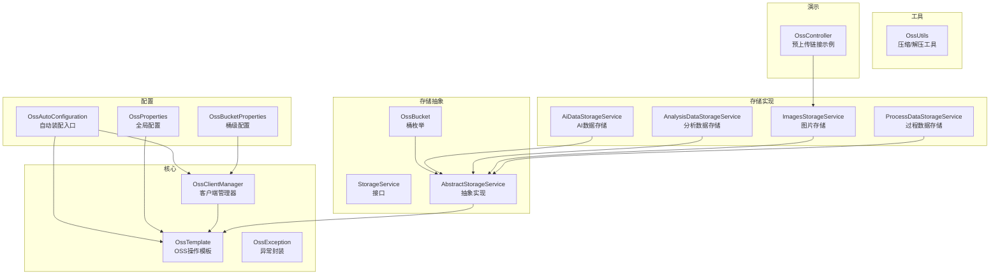
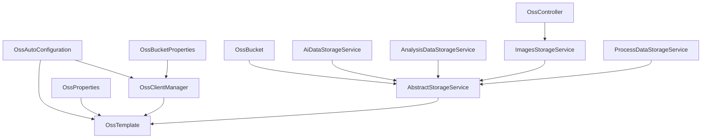
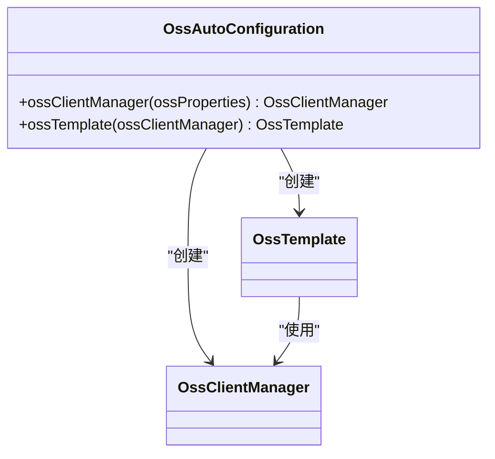
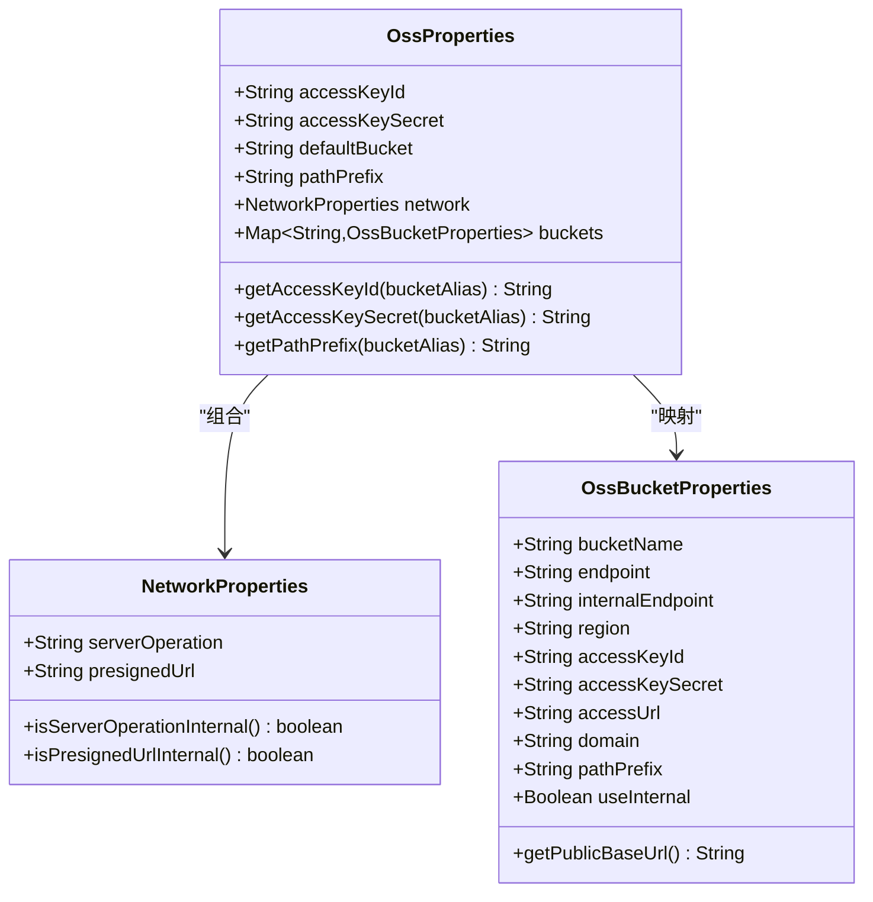
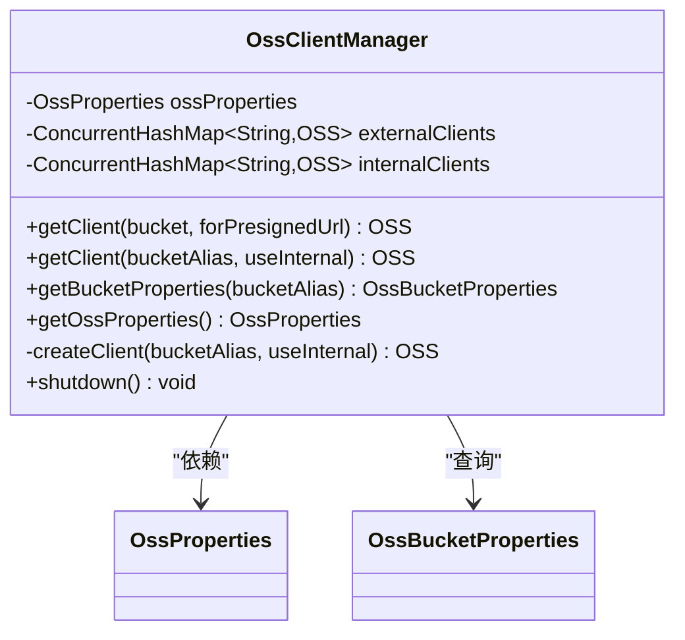
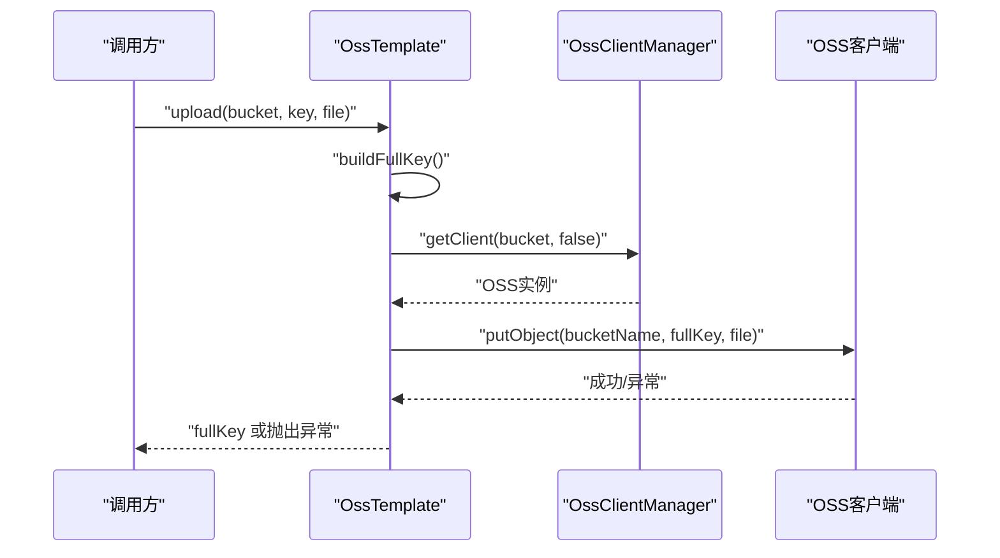
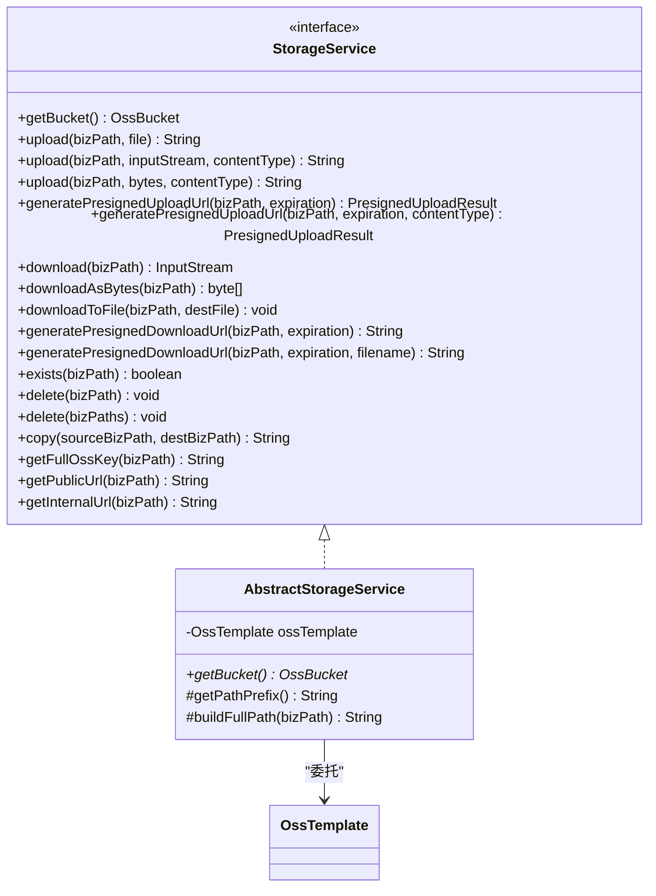
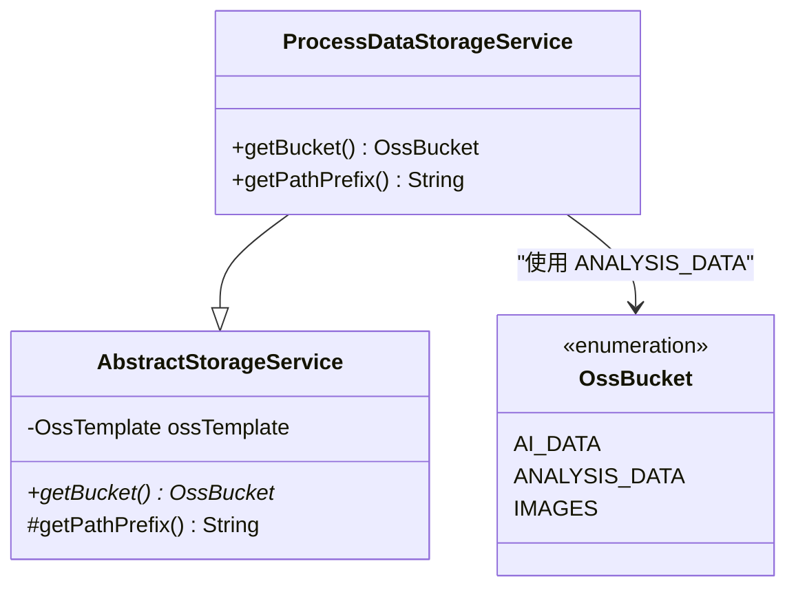
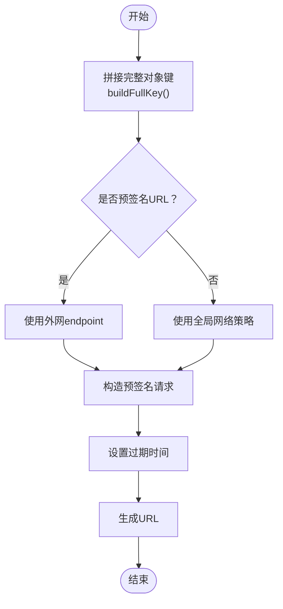
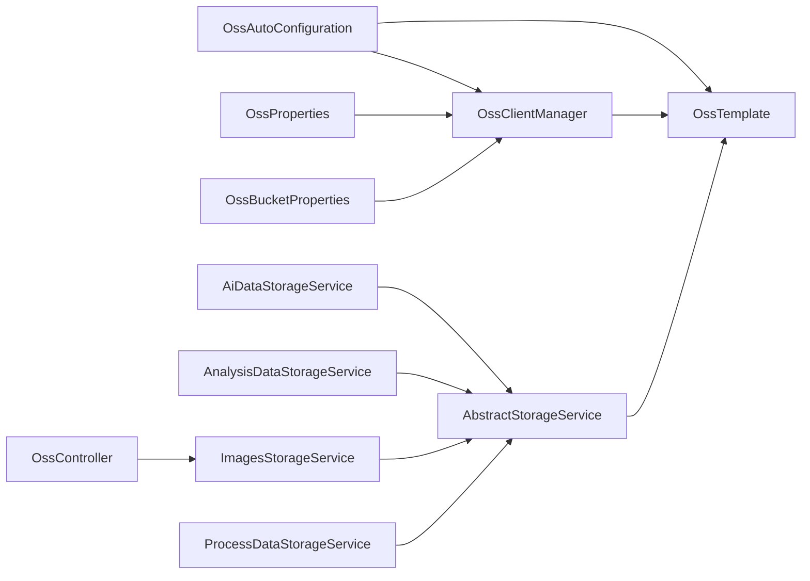

# OSS存储插件

<cite>
**本文引用的文件**
- [OssAutoConfiguration.java](file://src/main/java/com/jiuyu/governance/plugins/oss/config/OssAutoConfiguration.java)
- [OssProperties.java](file://src/main/java/com/jiuyu/governance/plugins/oss/config/OssProperties.java)
- [OssBucketProperties.java](file://src/main/java/com/jiuyu/governance/plugins/oss/config/OssBucketProperties.java)
- [OssTemplate.java](file://src/main/java/com/jiuyu/governance/plugins/oss/core/OssTemplate.java)
- [OssClientManager.java](file://src/main/java/com/jiuyu/governance/plugins/oss/core/OssClientManager.java)
- [OssException.java](file://src/main/java/com/jiuyu/governance/plugins/oss/core/OssException.java)
- [OssBucket.java](file://src/main/java/com/jiuyu/governance/plugins/oss/enums/OssBucket.java)
- [StorageService.java](file://src/main/java/com/jiuyu/governance/plugins/oss/storage/StorageService.java)
- [AbstractStorageService.java](file://src/main/java/com/jiuyu/governance/plugins/oss/storage/AbstractStorageService.java)
- [OssUtils.java](file://src/main/java/com/jiuyu/governance/plugins/oss/utils/OssUtils.java)
- [OssController.java](file://src/main/java/com/jiuyu/governance/common/controller/OssController.java)
- [ProcessDataStorageService.java](file://src/main/java/com/jiuyu/governance/plugins/oss/storage/impl/ProcessDataStorageService.java)
- [AnalysisDataStorageService.java](file://src/main/java/com/jiuyu/governance/plugins/oss/storage/impl/AnalysisDataStorageService.java)
- [ImagesStorageService.java](file://src/main/java/com/jiuyu/governance/plugins/oss/storage/impl/ImagesStorageService.java)
- [AiDataStorageService.java](file://src/main/java/com/jiuyu/governance/plugins/oss/storage/impl/AiDataStorageService.java)
- [application-dev.yml](file://src/main/resources/application-dev.yml)
- [application-local.yml](file://src/main/resources/application-local.yml)
</cite>

## 目录
1. [简介](#简介)
2. [项目结构](#项目结构)
3. [核心组件](#核心组件)
4. [架构总览](#架构总览)
5. [详细组件分析](#详细组件分析)
6. [依赖分析](#依赖分析)
7. [性能考虑](#性能考虑)
8. [故障排查指南](#故障排查指南)
9. [结论](#结论)
10. [附录](#附录)

## 简介
本技术文档面向OSS存储插件，系统性阐述阿里云OSS集成的实现原理与使用方式，涵盖自动配置机制、客户端管理器、模板类、配置参数、存储服务抽象与多种存储实现、预签名URL生成、文件上传下载与批量处理、存储桶管理以及插件的配置方法、性能优化与成本控制策略。文档同时提供基于现有代码的完整操作示例与最佳实践建议。

**更新** 新增了ProcessDataStorageService存储服务实现，专门用于存储直播流和产品分析过程数据，扩展了AbstractStorageService并针对ANALYSIS_DATA桶和governance-process路径前缀进行了配置。

## 项目结构
OSS插件位于 plugins/oss 目录下，按职责划分为配置、核心、存储抽象、工具与枚举等模块，并通过Spring Boot自动装配机制对外暴露能力。公共控制器演示了如何通过图片存储服务生成预上传链接。

**图表来源**
- [OssAutoConfiguration.java:1-40](file://src/main/java/com/jiuyu/governance/plugins/oss/config/OssAutoConfiguration.java#L1-L40)
- [OssProperties.java:1-140](file://src/main/java/com/jiuyu/governance/plugins/oss/config/OssProperties.java#L1-L140)
- [OssBucketProperties.java:1-77](file://src/main/java/com/jiuyu/governance/plugins/oss/config/OssBucketProperties.java#L1-L77)
- [OssClientManager.java:1-154](file://src/main/java/com/jiuyu/governance/plugins/oss/core/OssClientManager.java#L1-L154)
- [OssTemplate.java:1-358](file://src/main/java/com/jiuyu/governance/plugins/oss/core/OssTemplate.java#L1-L358)
- [StorageService.java:1-184](file://src/main/java/com/jiuyu/governance/plugins/oss/storage/StorageService.java#L1-L184)
- [AbstractStorageService.java:1-187](file://src/main/java/com/jiuyu/governance/plugins/oss/storage/AbstractStorageService.java#L1-L187)
- [OssBucket.java:1-61](file://src/main/java/com/jiuyu/governance/plugins/oss/enums/OssBucket.java#L1-L61)
- [OssUtils.java:1-88](file://src/main/java/com/jiuyu/governance/plugins/oss/utils/OssUtils.java#L1-L88)
- [OssController.java:1-62](file://src/main/java/com/jiuyu/governance/common/controller/OssController.java#L1-L62)
- [ProcessDataStorageService.java:1-33](file://src/main/java/com/jiuyu/governance/plugins/oss/storage/impl/ProcessDataStorageService.java#L1-L33)
- [AnalysisDataStorageService.java:1-28](file://src/main/java/com/jiuyu/governance/plugins/oss/storage/impl/AnalysisDataStorageService.java#L1-L28)
- [ImagesStorageService.java:1-28](file://src/main/java/com/jiuyu/governance/plugins/oss/storage/impl/ImagesStorageService.java#L1-L28)
- [AiDataStorageService.java:1-43](file://src/main/java/com/jiuyu/governance/plugins/oss/storage/impl/AiDataStorageService.java#L1-L43)

**章节来源**
- [OssAutoConfiguration.java:1-40](file://src/main/java/com/jiuyu/governance/plugins/oss/config/OssAutoConfiguration.java#L1-L40)
- [OssProperties.java:1-140](file://src/main/java/com/jiuyu/governance/plugins/oss/config/OssProperties.java#L1-L140)
- [OssBucketProperties.java:1-77](file://src/main/java/com/jiuyu/governance/plugins/oss/config/OssBucketProperties.java#L1-L77)
- [OssClientManager.java:1-154](file://src/main/java/com/jiuyu/governance/plugins/oss/core/OssClientManager.java#L1-L154)
- [OssTemplate.java:1-358](file://src/main/java/com/jiuyu/governance/plugins/oss/core/OssTemplate.java#L1-L358)
- [StorageService.java:1-184](file://src/main/java/com/jiuyu/governance/plugins/oss/storage/StorageService.java#L1-L184)
- [AbstractStorageService.java:1-187](file://src/main/java/com/jiuyu/governance/plugins/oss/storage/AbstractStorageService.java#L1-L187)
- [OssBucket.java:1-61](file://src/main/java/com/jiuyu/governance/plugins/oss/enums/OssBucket.java#L1-L61)
- [OssUtils.java:1-88](file://src/main/java/com/jiuyu/governance/plugins/oss/utils/OssUtils.java#L1-L88)
- [OssController.java:1-62](file://src/main/java/com/jiuyu/governance/common/controller/OssController.java#L1-L62)
- [ProcessDataStorageService.java:1-33](file://src/main/java/com/jiuyu/governance/plugins/oss/storage/impl/ProcessDataStorageService.java#L1-L33)
- [AnalysisDataStorageService.java:1-28](file://src/main/java/com/jiuyu/governance/plugins/oss/storage/impl/AnalysisDataStorageService.java#L1-L28)
- [ImagesStorageService.java:1-28](file://src/main/java/com/jiuyu/governance/plugins/oss/storage/impl/ImagesStorageService.java#L1-L28)
- [AiDataStorageService.java:1-43](file://src/main/java/com/jiuyu/governance/plugins/oss/storage/impl/AiDataStorageService.java#L1-L43)

## 核心组件
- 自动配置与装配
  - OssAutoConfiguration：当配置项 jiuyu.oss.access-key-id 存在时，自动装配 OssClientManager 与 OssTemplate Bean。
- 配置参数
  - OssProperties：全局配置，包含 accessKeyId/accessKeySecret、defaultBucket、pathPrefix、network（serverOperation/presignedUrl）及 buckets 映射。
  - OssBucketProperties：桶级配置，包含 bucketName、endpoint/internalEndpoint、region、accessUrl/domain、桶级 pathPrefix/useInternal 等。
- 客户端管理
  - OssClientManager：按桶别名与内/外网策略缓存 OSS 客户端实例，支持懒加载与优雅关闭。
- 模板类
  - OssTemplate：封装上传、下载、管理与URL生成等操作，自动处理路径前缀与网络选择。
- 存储抽象
  - StorageService/AbstractStorageService：定义统一的存储接口与通用实现，子类只需指定桶与可选的服务前缀。
  - OssBucket：定义业务可用的桶别名与描述（AI_DATA、ANALYSIS_DATA、IMAGES）。
- 存储服务实现
  - **新增** ProcessDataStorageService：专门用于存储直播流和产品分析过程数据，继承自AbstractStorageService，针对ANALYSIS_DATA桶和governance-process路径前缀进行配置。
  - AnalysisDataStorageService：分析数据存储服务，对应replay-analysis-data桶。
  - ImagesStorageService：图片存储服务，对应replay-images桶。
  - AiDataStorageService：AI数据存储服务，对应replay-ai-data桶。
- 工具与异常
  - OssUtils：提供文本压缩/解压辅助方法。
  - OssException：统一的OSS异常封装，便于定位桶与对象键。

**章节来源**
- [OssAutoConfiguration.java:1-40](file://src/main/java/com/jiuyu/governance/plugins/oss/config/OssAutoConfiguration.java#L1-L40)
- [OssProperties.java:1-140](file://src/main/java/com/jiuyu/governance/plugins/oss/config/OssProperties.java#L1-L140)
- [OssBucketProperties.java:1-77](file://src/main/java/com/jiuyu/governance/plugins/oss/config/OssBucketProperties.java#L1-L77)
- [OssClientManager.java:1-154](file://src/main/java/com/jiuyu/governance/plugins/oss/core/OssClientManager.java#L1-L154)
- [OssTemplate.java:1-358](file://src/main/java/com/jiuyu/governance/plugins/oss/core/OssTemplate.java#L1-L358)
- [StorageService.java:1-184](file://src/main/java/com/jiuyu/governance/plugins/oss/storage/StorageService.java#L1-L184)
- [AbstractStorageService.java:1-187](file://src/main/java/com/jiuyu/governance/plugins/oss/storage/AbstractStorageService.java#L1-L187)
- [OssBucket.java:1-61](file://src/main/java/com/jiuyu/governance/plugins/oss/enums/OssBucket.java#L1-L61)
- [OssUtils.java:1-88](file://src/main/java/com/jiuyu/governance/plugins/oss/utils/OssUtils.java#L1-L88)
- [OssException.java:1-45](file://src/main/java/com/jiuyu/governance/plugins/oss/core/OssException.java#L1-L45)
- [ProcessDataStorageService.java:1-33](file://src/main/java/com/jiuyu/governance/plugins/oss/storage/impl/ProcessDataStorageService.java#L1-L33)

## 架构总览
OSS插件采用"自动配置 + 客户端管理 + 模板 + 抽象服务"的分层架构。自动配置根据配置项决定是否启用插件；客户端管理器按桶与网络策略缓存OSS客户端；模板类统一封装OSS底层操作；抽象存储服务面向业务提供一致的API。

**图表来源**
- [OssAutoConfiguration.java:1-40](file://src/main/java/com/jiuyu/governance/plugins/oss/config/OssAutoConfiguration.java#L1-L40)
- [OssClientManager.java:1-154](file://src/main/java/com/jiuyu/governance/plugins/oss/core/OssClientManager.java#L1-L154)
- [OssTemplate.java:1-358](file://src/main/java/com/jiuyu/governance/plugins/oss/core/OssTemplate.java#L1-L358)
- [OssProperties.java:1-140](file://src/main/java/com/jiuyu/governance/plugins/oss/config/OssProperties.java#L1-L140)
- [OssBucketProperties.java:1-77](file://src/main/java/com/jiuyu/governance/plugins/oss/config/OssBucketProperties.java#L1-L77)
- [AbstractStorageService.java:1-187](file://src/main/java/com/jiuyu/governance/plugins/oss/storage/AbstractStorageService.java#L1-L187)
- [OssBucket.java:1-61](file://src/main/java/com/jiuyu/governance/plugins/oss/enums/OssBucket.java#L1-L61)
- [AiDataStorageService.java:1-43](file://src/main/java/com/jiuyu/governance/plugins/oss/storage/impl/AiDataStorageService.java#L1-L43)
- [AnalysisDataStorageService.java:1-28](file://src/main/java/com/jiuyu/governance/plugins/oss/storage/impl/AnalysisDataStorageService.java#L1-L28)
- [ImagesStorageService.java:1-28](file://src/main/java/com/jiuyu/governance/plugins/oss/storage/impl/ImagesStorageService.java#L1-L28)
- [ProcessDataStorageService.java:1-33](file://src/main/java/com/jiuyu/governance/plugins/oss/storage/impl/ProcessDataStorageService.java#L1-L33)
- [OssController.java:1-62](file://src/main/java/com/jiuyu/governance/common/controller/OssController.java#L1-L62)

## 详细组件分析

### 自动配置机制（OssAutoConfiguration）
- 条件装配：当配置项 jiuyu.oss.access-key-id 存在时启用。
- Bean创建：注册 OssClientManager 与 OssTemplate，日志记录初始化过程。
- 依赖注入：OssTemplate依赖 OssClientManager，OssClientManager依赖 OssProperties。

**图表来源**
- [OssAutoConfiguration.java:1-40](file://src/main/java/com/jiuyu/governance/plugins/oss/config/OssAutoConfiguration.java#L1-L40)
- [OssClientManager.java:1-154](file://src/main/java/com/jiuyu/governance/plugins/oss/core/OssClientManager.java#L1-L154)
- [OssTemplate.java:1-358](file://src/main/java/com/jiuyu/governance/plugins/oss/core/OssTemplate.java#L1-L358)

**章节来源**
- [OssAutoConfiguration.java:1-40](file://src/main/java/com/jiuyu/governance/plugins/oss/config/OssAutoConfiguration.java#L1-L40)

### 配置参数（OssProperties 与 OssBucketProperties）
- 全局配置（OssProperties）
  - 访问凭证：accessKeyId/accessKeySecret
  - 默认桶与路径前缀：defaultBucket/pathPrefix
  - 网络策略：network.serverOperation（默认internal）、network.presignedUrl（默认external）
  - 桶映射：buckets（key为桶别名）
  - 桶级优先：提供 getAccessKeyId/getAccessKeySecret/getPathPrefix 方法，桶级配置优先于全局。
- 桶级配置（OssBucketProperties）
  - 基础信息：bucketName、endpoint/internalEndpoint、region
  - 访问URL：accessUrl、domain（优先级高于accessUrl）
  - 路径前缀与内网开关：pathPrefix、useInternal
  - 公开访问基础URL：getPublicBaseUrl

**图表来源**
- [OssProperties.java:1-140](file://src/main/java/com/jiuyu/governance/plugins/oss/config/OssProperties.java#L1-L140)
- [OssBucketProperties.java:1-77](file://src/main/java/com/jiuyu/governance/plugins/oss/config/OssBucketProperties.java#L1-L77)

**章节来源**
- [OssProperties.java:1-140](file://src/main/java/com/jiuyu/governance/plugins/oss/config/OssProperties.java#L1-L140)
- [OssBucketProperties.java:1-77](file://src/main/java/com/jiuyu/governance/plugins/oss/config/OssBucketProperties.java#L1-L77)

### 客户端管理器（OssClientManager）
- 缓存策略：分别维护 internalClients 与 externalClients，按桶别名缓存客户端。
- 网络策略：优先使用桶级 useInternal 覆盖，否则使用全局 network.serverOperation。
- 客户端创建：依据 endpoint 与凭证构建 OSSClient，并记录日志。
- 销毁：应用关闭时优雅关闭所有客户端并清空缓存。

**图表来源**
- [OssClientManager.java:1-154](file://src/main/java/com/jiuyu/governance/plugins/oss/core/OssClientManager.java#L1-L154)
- [OssProperties.java:1-140](file://src/main/java/com/jiuyu/governance/plugins/oss/config/OssProperties.java#L1-L140)
- [OssBucketProperties.java:1-77](file://src/main/java/com/jiuyu/governance/plugins/oss/config/OssBucketProperties.java#L1-L77)

**章节来源**
- [OssClientManager.java:1-154](file://src/main/java/com/jiuyu/governance/plugins/oss/core/OssClientManager.java#L1-L154)

### 模板类（OssTemplate）
- 上传：支持File/InputStream/byte[]三种形式，自动拼接路径前缀。
- 预签名URL：生成PUT（预上传）与GET（预下载）链接，预签名默认使用外网endpoint。
- 下载：支持InputStream/byte[]/本地文件下载。
- 管理：exists/delete/copy，支持批量删除。
- URL生成：getPublicUrl/getInternalUrl，优先使用桶级domain或accessUrl，否则回退至默认OSS域名。
- 路径处理：buildFullKey自动清理多余斜杠并拼接pathPrefix。

**图表来源**
- [OssTemplate.java:1-358](file://src/main/java/com/jiuyu/governance/plugins/oss/core/OssTemplate.java#L1-L358)
- [OssClientManager.java:1-154](file://src/main/java/com/jiuyu/governance/plugins/oss/core/OssClientManager.java#L1-L154)

**章节来源**
- [OssTemplate.java:1-358](file://src/main/java/com/jiuyu/governance/plugins/oss/core/OssTemplate.java#L1-L358)

### 存储服务抽象（StorageService 与 AbstractStorageService）
- 接口定义：统一的上传、下载、管理与URL生成方法族，面向业务路径（不含环境前缀）。
- 抽象实现：子类只需实现 getBucket 并可重写 getPathPrefix，即可获得完整的OSS操作能力。
- 业务前缀：buildFullPath 支持服务级前缀拼接，避免跨业务冲突。

**图表来源**
- [StorageService.java:1-184](file://src/main/java/com/jiuyu/governance/plugins/oss/storage/StorageService.java#L1-L184)
- [AbstractStorageService.java:1-187](file://src/main/java/com/jiuyu/governance/plugins/oss/storage/AbstractStorageService.java#L1-L187)
- [OssTemplate.java:1-358](file://src/main/java/com/jiuyu/governance/plugins/oss/core/OssTemplate.java#L1-L358)

**章节来源**
- [StorageService.java:1-184](file://src/main/java/com/jiuyu/governance/plugins/oss/storage/StorageService.java#L1-L184)
- [AbstractStorageService.java:1-187](file://src/main/java/com/jiuyu/governance/plugins/oss/storage/AbstractStorageService.java#L1-L187)

### 存储服务实现详解

#### ProcessDataStorageService（新增）
- 功能定位：专门用于存储直播流和产品分析过程数据。
- 继承关系：继承自AbstractStorageService，复用其所有OSS操作能力。
- 桶配置：使用OssBucket.ANALYSIS_DATA桶（对应replay-analysis-data）。
- 路径前缀：重写getPathPrefix()方法，设置为"governance-process"，用于区分不同业务类型的数据存储。
- 应用场景：适用于直播过程数据、商品分析过程数据等需要长期保存的过程性数据。

**图表来源**
- [ProcessDataStorageService.java:1-33](file://src/main/java/com/jiuyu/governance/plugins/oss/storage/impl/ProcessDataStorageService.java#L1-L33)
- [AbstractStorageService.java:1-187](file://src/main/java/com/jiuyu/governance/plugins/oss/storage/AbstractStorageService.java#L1-L187)
- [OssBucket.java:1-61](file://src/main/java/com/jiuyu/governance/plugins/oss/enums/OssBucket.java#L1-L61)

**章节来源**
- [ProcessDataStorageService.java:1-33](file://src/main/java/com/jiuyu/governance/plugins/oss/storage/impl/ProcessDataStorageService.java#L1-L33)

#### AnalysisDataStorageService
- 功能定位：分析数据存储服务。
- 桶配置：使用OssBucket.ANALYSIS_DATA桶（对应replay-analysis-data）。
- 特点：无特殊路径前缀，直接使用桶级默认前缀。

**章节来源**
- [AnalysisDataStorageService.java:1-28](file://src/main/java/com/jiuyu/governance/plugins/oss/storage/impl/AnalysisDataStorageService.java#L1-L28)

#### ImagesStorageService
- 功能定位：图片存储服务。
- 桶配置：使用OssBucket.IMAGES桶（对应replay-images）。
- 特点：无特殊路径前缀，直接使用桶级默认前缀。

**章节来源**
- [ImagesStorageService.java:1-28](file://src/main/java/com/jiuyu/governance/plugins/oss/storage/impl/ImagesStorageService.java#L1-L28)

#### AiDataStorageService
- 功能定位：AI数据存储服务。
- 桶配置：使用OssBucket.AI_DATA桶（对应replay-ai-data）。
- 特点：无特殊路径前缀，直接使用桶级默认前缀。
- 额外功能：提供getStringToZipPath()方法，用于从ZIP格式的AI数据文件中提取文本内容。

**章节来源**
- [AiDataStorageService.java:1-43](file://src/main/java/com/jiuyu/governance/plugins/oss/storage/impl/AiDataStorageService.java#L1-L43)

### 桶枚举与工具
- 桶枚举（OssBucket）：定义 AI_DATA、ANALYSIS_DATA、IMAGES 三类业务桶别名，便于强类型引用。
- 工具（OssUtils）：提供文本压缩为zip字节数组与从zip字节数组提取文本内容的便捷方法。

**章节来源**
- [OssBucket.java:1-61](file://src/main/java/com/jiuyu/governance/plugins/oss/enums/OssBucket.java#L1-L61)
- [OssUtils.java:1-88](file://src/main/java/com/jiuyu/governance/plugins/oss/utils/OssUtils.java#L1-L88)

### 预签名URL生成流程
- 预上传（PUT）：生成带过期时间的上传链接，适合前端直传或临时授权上传。
- 预下载（GET）：生成带过期时间的下载链接，可设置Content-Disposition以指定下载文件名。
- 网络策略：预签名默认使用外网endpoint，保证外部可访问。

**图表来源**
- [OssTemplate.java:90-211](file://src/main/java/com/jiuyu/governance/plugins/oss/core/OssTemplate.java#L90-L211)
- [OssClientManager.java:48-75](file://src/main/java/com/jiuyu/governance/plugins/oss/core/OssClientManager.java#L48-L75)

**章节来源**
- [OssTemplate.java:90-211](file://src/main/java/com/jiuyu/governance/plugins/oss/core/OssTemplate.java#L90-L211)
- [OssClientManager.java:48-75](file://src/main/java/com/jiuyu/governance/plugins/oss/core/OssClientManager.java#L48-L75)

### 文件上传下载与批量处理
- 上传：支持本地文件、输入流与字节数组，自动设置Content-Type元数据。
- 下载：支持流式下载、字节数组与本地文件落盘。
- 批量删除：传入业务路径列表，自动转换为完整对象键并批量删除。
- 复制：在同一存储桶内进行对象复制。

**章节来源**
- [OssTemplate.java:37-287](file://src/main/java/com/jiuyu/governance/plugins/oss/core/OssTemplate.java#L37-L287)

### 存储桶管理与URL生成
- 公开访问URL：优先使用桶级domain或accessUrl，否则回退默认OSS域名。
- 内网访问URL：基于internalEndpoint或endpoint生成内网URL。
- 路径前缀：支持全局与桶级pathPrefix，自动清理多余斜杠。

**章节来源**
- [OssTemplate.java:289-326](file://src/main/java/com/jiuyu/governance/plugins/oss/core/OssTemplate.java#L289-L326)
- [OssBucketProperties.java:64-75](file://src/main/java/com/jiuyu/governance/plugins/oss/config/OssBucketProperties.java#L64-L75)

### 插件使用示例（基于现有控制器）
- 预上传链接（图片）：OssController演示了如何生成图片预上传链接，路径按日期与UUID组织，有效期30分钟。
- 业务路径：示例中使用 img/yyyy/MM/dd/uuid.suffix 组织业务路径。
- 返回结果：包含上传URL、完整OSS Key与过期时间。

**章节来源**
- [OssController.java:1-62](file://src/main/java/com/jiuyu/governance/common/controller/OssController.java#L1-L62)

## 依赖分析
- 组件耦合
  - OssAutoConfiguration 依赖 OssProperties 与 OssClientManager/OssTemplate。
  - OssClientManager 依赖 OssProperties 与 OssBucketProperties。
  - OssTemplate 依赖 OssClientManager。
  - AbstractStorageService 依赖 OssTemplate。
  - **新增** ProcessDataStorageService 依赖 AbstractStorageService 和 OssTemplate。
  - 控制器依赖具体存储服务实现（如 ImagesStorageService）。
- 外部依赖
  - 阿里云OSS SDK（OSS、GeneratePresignedUrlRequest、GetObjectRequest等）。
- 循环依赖
  - 未发现循环依赖，各层职责清晰。

**图表来源**
- [OssAutoConfiguration.java:1-40](file://src/main/java/com/jiuyu/governance/plugins/oss/config/OssAutoConfiguration.java#L1-L40)
- [OssClientManager.java:1-154](file://src/main/java/com/jiuyu/governance/plugins/oss/core/OssClientManager.java#L1-L154)
- [OssTemplate.java:1-358](file://src/main/java/com/jiuyu/governance/plugins/oss/core/OssTemplate.java#L1-L358)
- [OssProperties.java:1-140](file://src/main/java/com/jiuyu/governance/plugins/oss/config/OssProperties.java#L1-L140)
- [OssBucketProperties.java:1-77](file://src/main/java/com/jiuyu/governance/plugins/oss/config/OssBucketProperties.java#L1-L77)
- [AbstractStorageService.java:1-187](file://src/main/java/com/jiuyu/governance/plugins/oss/storage/AbstractStorageService.java#L1-L187)
- [AiDataStorageService.java:1-43](file://src/main/java/com/jiuyu/governance/plugins/oss/storage/impl/AiDataStorageService.java#L1-L43)
- [AnalysisDataStorageService.java:1-28](file://src/main/java/com/jiuyu/governance/plugins/oss/storage/impl/AnalysisDataStorageService.java#L1-L28)
- [ImagesStorageService.java:1-28](file://src/main/java/com/jiuyu/governance/plugins/oss/storage/impl/ImagesStorageService.java#L1-L28)
- [ProcessDataStorageService.java:1-33](file://src/main/java/com/jiuyu/governance/plugins/oss/storage/impl/ProcessDataStorageService.java#L1-L33)
- [OssController.java:1-62](file://src/main/java/com/jiuyu/governance/common/controller/OssController.java#L1-L62)

**章节来源**
- [OssAutoConfiguration.java:1-40](file://src/main/java/com/jiuyu/governance/plugins/oss/config/OssAutoConfiguration.java#L1-L40)
- [OssClientManager.java:1-154](file://src/main/java/com/jiuyu/governance/plugins/oss/core/OssClientManager.java#L1-L154)
- [OssTemplate.java:1-358](file://src/main/java/com/jiuyu/governance/plugins/oss/core/OssTemplate.java#L1-L358)
- [OssProperties.java:1-140](file://src/main/java/com/jiuyu/governance/plugins/oss/config/OssProperties.java#L1-L140)
- [OssBucketProperties.java:1-77](file://src/main/java/com/jiuyu/governance/plugins/oss/config/OssBucketProperties.java#L1-L77)
- [AbstractStorageService.java:1-187](file://src/main/java/com/jiuyu/governance/plugins/oss/storage/AbstractStorageService.java#L1-L187)
- [OssController.java:1-62](file://src/main/java/com/jiuyu/governance/common/controller/OssController.java#L1-L62)
- [ProcessDataStorageService.java:1-33](file://src/main/java/com/jiuyu/governance/plugins/oss/storage/impl/ProcessDataStorageService.java#L1-L33)

## 性能考虑
- 客户端复用
  - OssClientManager 使用ConcurrentHashMap缓存客户端，避免频繁创建销毁带来的性能损耗。
- 网络策略
  - 服务端操作默认使用内网endpoint，降低公网流量成本；预签名URL默认使用外网endpoint，确保外部可访问。
- 路径前缀
  - 合理设置 pathPrefix 与桶级 pathPrefix，有助于对象分布均匀，提升列举与管理效率。
- 批量操作
  - 使用批量删除减少网络往返次数，提高吞吐。
- IO优化
  - 下载时使用流式处理，避免一次性加载大文件到内存；必要时结合压缩工具减少传输体积。
- **新增** 存储服务分离
  - 不同类型的业务数据分离存储（AI数据、分析数据、图片、过程数据），有利于优化存储成本和访问性能。

## 故障排查指南
- 常见异常
  - OssException：封装桶别名与对象键，便于快速定位问题。
- 常见问题与对策
  - 未找到桶配置：检查配置文件中 buckets 是否包含目标桶别名。
  - Endpoint未配置：确认桶级 endpoint/internalEndpoint 是否填写。
  - 凭证缺失：确认全局或桶级 accessKeyId/accessKeySecret 是否正确。
  - 预签名URL不可访问：确认预签名URL使用外网endpoint且未过期。
  - **新增** 路径前缀问题：确认ProcessDataStorageService的governance-process前缀是否正确配置。
- 日志与监控
  - 自动配置与客户端创建均输出日志，便于排障。
  - 建议在生产环境开启更详细的OSS SDK日志以便追踪。

**章节来源**
- [OssException.java:1-45](file://src/main/java/com/jiuyu/governance/plugins/oss/core/OssException.java#L1-L45)
- [OssClientManager.java:111-128](file://src/main/java/com/jiuyu/governance/plugins/oss/core/OssClientManager.java#L111-L128)
- [OssTemplate.java:56-58](file://src/main/java/com/jiuyu/governance/plugins/oss/core/OssTemplate.java#L56-L58)

## 结论
该OSS存储插件通过自动配置、客户端管理与模板类实现了对阿里云OSS的统一接入，配合存储服务抽象与工具类，满足多业务场景下的文件上传、下载、预签名URL生成与批量处理需求。**新增的ProcessDataStorageService存储服务进一步完善了存储体系，专门用于处理直播流和产品分析过程数据，通过路径前缀分离实现了不同类型数据的有序管理。**合理的网络策略与路径前缀配置有助于在性能与成本之间取得平衡。

## 附录

### 配置方法与示例
- 启用条件：配置 jiuyu.oss.access-key-id 即可触发自动装配。
- 全局配置要点：设置 accessKeyId/accessKeySecret、defaultBucket、pathPrefix、network.serverOperation 与 network.presignedUrl。
- 桶级配置要点：为每个业务桶配置 bucketName、endpoint/internalEndpoint、region、accessUrl/domain、useInternal 等。
- **新增** 存储服务配置：ProcessDataStorageService继承自AbstractStorageService，无需额外配置即可使用ANALYSIS_DATA桶和governance-process路径前缀。
- 示例参考：application-dev.yml 中的全局配置片段可作为基础模板。

**章节来源**
- [OssAutoConfiguration.java:23](file://src/main/java/com/jiuyu/governance/plugins/oss/config/OssAutoConfiguration.java#L23)
- [OssProperties.java:39-103](file://src/main/java/com/jiuyu/governance/plugins/oss/config/OssProperties.java#L39-L103)
- [OssBucketProperties.java:13-61](file://src/main/java/com/jiuyu/governance/plugins/oss/config/OssBucketProperties.java#L13-L61)
- [application-dev.yml:60-109](file://src/main/resources/application-dev.yml#L60-L109)
- [ProcessDataStorageService.java:23-31](file://src/main/java/com/jiuyu/governance/plugins/oss/storage/impl/ProcessDataStorageService.java#L23-L31)

### 操作示例清单
- 上传文件
  - 使用 AbstractStorageService.upload(...) 或 OssTemplate.upload(...)
  - **新增** ProcessDataStorageService可用于存储直播/商品过程数据
- 生成预上传链接
  - 使用 AbstractStorageService.generatePresignedUploadUrl(...) 或 OssTemplate.generatePresignedUploadUrl(...)
- 生成预下载链接
  - 使用 AbstractStorageService.generatePresignedDownloadUrl(...) 或 OssTemplate.generatePresignedDownloadUrl(...)
- 下载文件
  - 使用 AbstractStorageService.download(...) / downloadAsBytes(...) / downloadToFile(...)
- 批量删除
  - 使用 AbstractStorageService.delete(List) 或 OssTemplate.delete(bucket, keys)
- 复制文件
  - 使用 AbstractStorageService.copy(...) 或 OssTemplate.copy(...)
- 获取公开/内网URL
  - 使用 AbstractStorageService.getPublicUrl(...) / getInternalUrl(...) 或 OssTemplate.getPublicUrl(...) / getInternalUrl(...)

**章节来源**
- [AbstractStorageService.java:72-185](file://src/main/java/com/jiuyu/governance/plugins/oss/storage/AbstractStorageService.java#L72-L185)
- [OssTemplate.java:39-326](file://src/main/java/com/jiuyu/governance/plugins/oss/core/OssTemplate.java#L39-L326)
- [ProcessDataStorageService.java:17-32](file://src/main/java/com/jiuyu/governance/plugins/oss/storage/impl/ProcessDataStorageService.java#L17-L32)

### 存储服务对比表

| 存储服务 | 桶类型 | 路径前缀 | 主要用途 | 特殊功能 |
|---------|--------|----------|----------|----------|
| AiDataStorageService | AI_DATA | 无 | AI模型和数据 | getStringToZipPath() |
| AnalysisDataStorageService | ANALYSIS_DATA | 无 | 分析数据 | 标准存储服务 |
| ImagesStorageService | IMAGES | 无 | 图片资源 | 标准存储服务 |
| **ProcessDataStorageService** | **ANALYSIS_DATA** | **governance-process** | **直播/商品过程数据** | **路径前缀分离** |

**章节来源**
- [AiDataStorageService.java:18-42](file://src/main/java/com/jiuyu/governance/plugins/oss/storage/impl/AiDataStorageService.java#L18-L42)
- [AnalysisDataStorageService.java:17-27](file://src/main/java/com/jiuyu/governance/plugins/oss/storage/impl/AnalysisDataStorageService.java#L17-L27)
- [ImagesStorageService.java:17-27](file://src/main/java/com/jiuyu/governance/plugins/oss/storage/impl/ImagesStorageService.java#L17-L27)
- [ProcessDataStorageService.java:17-32](file://src/main/java/com/jiuyu/governance/plugins/oss/storage/impl/ProcessDataStorageService.java#L17-L32)