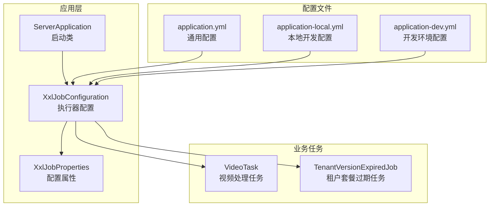
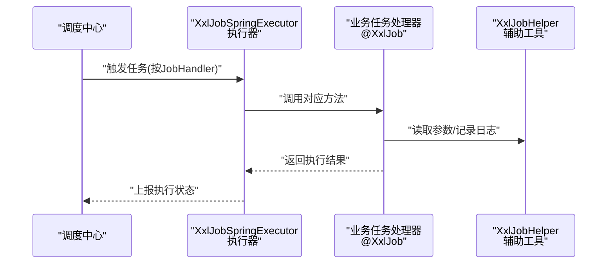
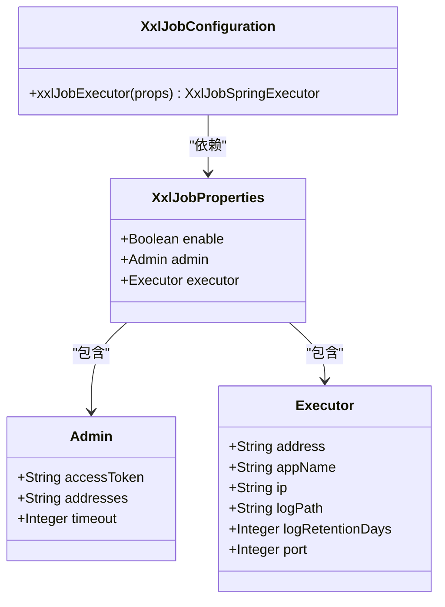
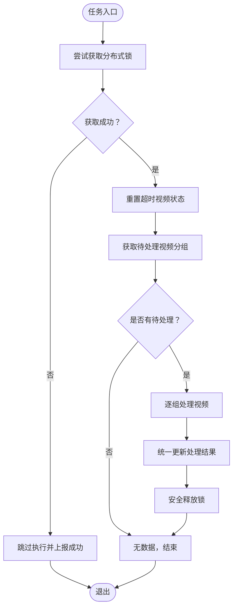
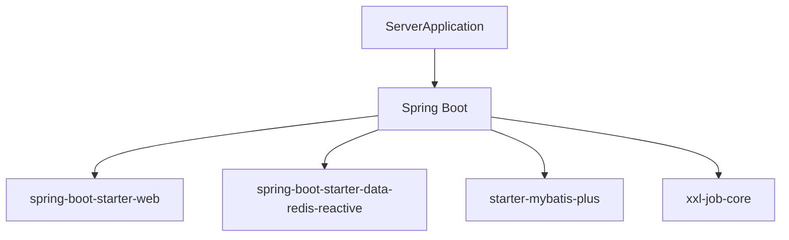

# XXL-Job集成

<cite>
**本文档引用的文件**
- [XxlJobConfiguration.java](file://src/main/java/com/jiuyu/governance/plugins/xxljob/XxlJobConfiguration.java)
- [XxlJobProperties.java](file://src/main/java/com/jiuyu/governance/plugins/xxljob/XxlJobProperties.java)
- [application.yml](file://src/main/resources/application.yml)
- [application-local.yml](file://src/main/resources/application-local.yml)
- [application-dev.yml](file://src/main/resources/application-dev.yml)
- [VideoTask.java](file://src/main/java/com/jiuyu/governance/business/performance/task/VideoTask.java)
- [TenantVersionExpiredJob.java](file://src/main/java/com/jiuyu/governance/business/rbac/task/TenantVersionExpiredJob.java)
- [pom.xml](file://pom.xml)
- [ServerApplication.java](file://src/main/java/com/jiuyu/governance/ServerApplication.java)
</cite>

## 目录
1. [简介](#简介)
2. [项目结构](#项目结构)
3. [核心组件](#核心组件)
4. [架构总览](#架构总览)
5. [详细组件分析](#详细组件分析)
6. [依赖分析](#依赖分析)
7. [性能考虑](#性能考虑)
8. [故障排查指南](#故障排查指南)
9. [结论](#结论)
10. [附录](#附录)

## 简介
本文件面向XXL-Job集成插件的技术文档，围绕分布式任务调度系统的集成实现展开，重点解释以下内容：
- XxlJobConfiguration配置类与XxlJobProperties属性配置的使用方式
- 任务执行器的注册机制、任务调度策略与集群部署配置
- 任务生命周期管理、失败重试机制与监控告警能力
- 完整的任务配置示例（任务定义、执行器配置、调度参数与性能调优）
- 插件部署要求、集群管理与服务发现机制
- 任务监控、日志管理与故障排查最佳实践

## 项目结构
本项目采用Spring Boot标准目录结构，XXL-Job集成位于plugins模块下，业务任务位于各自功能域的task包中。配置文件通过多环境YAML文件实现不同环境下的差异化配置。

图表来源
- [ServerApplication.java:12-17](file://src/main/java/com/jiuyu/governance/ServerApplication.java#L12-L17)
- [XxlJobConfiguration.java:18-76](file://src/main/java/com/jiuyu/governance/plugins/xxljob/XxlJobConfiguration.java#L18-L76)
- [XxlJobProperties.java:13-91](file://src/main/java/com/jiuyu/governance/plugins/xxljob/XxlJobProperties.java#L13-L91)
- [VideoTask.java:31-98](file://src/main/java/com/jiuyu/governance/business/performance/task/VideoTask.java#L31-L98)
- [TenantVersionExpiredJob.java:26-94](file://src/main/java/com/jiuyu/governance/business/rbac/task/TenantVersionExpiredJob.java#L26-L94)
- [application.yml:124-147](file://src/main/resources/application.yml#L124-L147)
- [application-local.yml:89-100](file://src/main/resources/application-local.yml#L89-L100)
- [application-dev.yml:90-102](file://src/main/resources/application-dev.yml#L90-L102)

章节来源
- [ServerApplication.java:12-17](file://src/main/java/com/jiuyu/governance/ServerApplication.java#L12-L17)
- [XxlJobConfiguration.java:18-76](file://src/main/java/com/jiuyu/governance/plugins/xxljob/XxlJobConfiguration.java#L18-L76)
- [XxlJobProperties.java:13-91](file://src/main/java/com/jiuyu/governance/plugins/xxljob/XxlJobProperties.java#L13-L91)
- [application.yml:124-147](file://src/main/resources/application.yml#L124-L147)

## 核心组件
- XxlJobConfiguration：基于Spring条件注解按需加载，将XxlJobProperties映射为XxlJobSpringExecutor，完成执行器初始化与注册。
- XxlJobProperties：以@ConfigurationProperties绑定xxl.job前缀配置，包含admin与executor两部分，支持动态注入。
- 业务任务：通过@XxlJob注解声明任务处理器，结合XxlJobHelper进行日志、参数与执行结果管理。

章节来源
- [XxlJobConfiguration.java:18-76](file://src/main/java/com/jiuyu/governance/plugins/xxljob/XxlJobConfiguration.java#L18-L76)
- [XxlJobProperties.java:13-91](file://src/main/java/com/jiuyu/governance/plugins/xxljob/XxlJobProperties.java#L13-L91)
- [VideoTask.java:52-98](file://src/main/java/com/jiuyu/governance/business/performance/task/VideoTask.java#L52-L98)
- [TenantVersionExpiredJob.java:48-94](file://src/main/java/com/jiuyu/governance/business/rbac/task/TenantVersionExpiredJob.java#L48-L94)

## 架构总览
XXL-Job集成遵循“配置驱动 + 注解任务”的模式：应用启动时根据配置加载执行器，业务任务通过注解注册到执行器，调度中心下发任务后由执行器回调对应处理器。

图表来源
- [XxlJobConfiguration.java:30-76](file://src/main/java/com/jiuyu/governance/plugins/xxljob/XxlJobConfiguration.java#L30-L76)
- [VideoTask.java:52-98](file://src/main/java/com/jiuyu/governance/business/performance/task/VideoTask.java#L52-L98)
- [TenantVersionExpiredJob.java:48-94](file://src/main/java/com/jiuyu/governance/business/rbac/task/TenantVersionExpiredJob.java#L48-L94)

## 详细组件分析

### 配置类与属性绑定
- 条件加载：仅当xxl.job.enable为true时创建执行器Bean，避免未启用时的资源浪费。
- 属性映射：将admin与executor子对象映射到执行器，支持动态覆盖地址、令牌、应用名、日志路径等。
- 环境差异：通过多环境配置文件实现不同环境下的调度中心地址与执行器端口等差异化。

图表来源
- [XxlJobConfiguration.java:18-76](file://src/main/java/com/jiuyu/governance/plugins/xxljob/XxlJobConfiguration.java#L18-L76)
- [XxlJobProperties.java:13-91](file://src/main/java/com/jiuyu/governance/plugins/xxljob/XxlJobProperties.java#L13-L91)

章节来源
- [XxlJobConfiguration.java:18-76](file://src/main/java/com/jiuyu/governance/plugins/xxljob/XxlJobConfiguration.java#L18-L76)
- [XxlJobProperties.java:13-91](file://src/main/java/com/jiuyu/governance/plugins/xxljob/XxlJobProperties.java#L13-L91)
- [application.yml:124-147](file://src/main/resources/application.yml#L124-L147)
- [application-local.yml:89-100](file://src/main/resources/application-local.yml#L89-L100)
- [application-dev.yml:90-102](file://src/main/resources/application-dev.yml#L90-L102)

### 任务执行器注册机制
- Bean条件：基于xxl.job.enable控制执行器Bean创建。
- 地址与令牌：从admin配置注入调度中心地址与访问令牌。
- 应用名与端口：从executor配置注入app-name与port，用于执行器注册与通信。
- 日志配置：可选的日志路径与保留天数，便于运维定位问题。

章节来源
- [XxlJobConfiguration.java:30-76](file://src/main/java/com/jiuyu/governance/plugins/xxljob/XxlJobConfiguration.java#L30-L76)

### 任务调度策略
- 任务定义：业务任务通过@XxlJob("handlerName")声明，handlerName需与调度中心配置一致。
- 参数与日志：使用XxlJobHelper.getJobParam()获取参数，使用XxlJobHelper.log()记录日志。
- 成功/失败上报：通过XxlJobHelper.handleSuccess()/handleFail()上报执行结果，便于调度中心统计与告警。

章节来源
- [VideoTask.java:52-98](file://src/main/java/com/jiuyu/governance/business/performance/task/VideoTask.java#L52-L98)
- [TenantVersionExpiredJob.java:48-94](file://src/main/java/com/jiuyu/governance/business/rbac/task/TenantVersionExpiredJob.java#L48-L94)

### 任务生命周期管理
- 分布式锁：视频处理任务使用Redis分布式锁避免并发重复执行，提升稳定性。
- 超时处理：对“处理中但超时”的视频进行重置，保障任务健康度。
- 批量处理：按批次分组处理视频，减少单次任务压力。
- 结果统一更新：无论成功或失败，均统一更新处理结果，确保数据一致性。

图表来源
- [VideoTask.java:52-198](file://src/main/java/com/jiuyu/governance/business/performance/task/VideoTask.java#L52-L198)

章节来源
- [VideoTask.java:52-198](file://src/main/java/com/jiuyu/governance/business/performance/task/VideoTask.java#L52-L198)

### 失败重试机制与监控告警
- 失败上报：业务任务捕获异常后通过XxlJobHelper.handleFail()上报失败原因。
- 超时重置：对长时间处于“处理中”的视频进行重置，避免僵尸任务。
- 日志记录：使用XxlJobHelper.log()记录关键步骤与异常信息，便于排查。
- 建议：结合调度中心的失败重试策略与告警规则，实现自动化恢复与通知。

章节来源
- [VideoTask.java:93-98](file://src/main/java/com/jiuyu/governance/business/performance/task/VideoTask.java#L93-L98)
- [TenantVersionExpiredJob.java:72-94](file://src/main/java/com/jiuyu/governance/business/rbac/task/TenantVersionExpiredJob.java#L72-L94)

### 集群部署配置
- 多环境配置：通过application.yml与application-local.yml/application-dev.yml分别定义通用与环境特定配置。
- 执行器端口：不同环境可配置不同端口，避免冲突。
- 日志路径：可配置不同日志路径，便于多实例日志分离与清理。

章节来源
- [application.yml:124-147](file://src/main/resources/application.yml#L124-L147)
- [application-local.yml:89-100](file://src/main/resources/application-local.yml#L89-L100)
- [application-dev.yml:90-102](file://src/main/resources/application-dev.yml#L90-L102)

## 依赖分析
- Spring Boot Starter：提供Web容器、配置、日志等基础能力。
- XXL-Job Core：提供执行器与任务处理器的核心能力。
- 其他依赖：Redis、MyBatis Plus、HTTP客户端等，支撑业务任务的执行与数据访问。

图表来源
- [pom.xml:35-167](file://pom.xml#L35-L167)

章节来源
- [pom.xml:35-167](file://pom.xml#L35-L167)

## 性能考虑
- 线程池配置：通过spring.task.execution.pool调整线程池容量与队列长度，平衡吞吐与延迟。
- 批量处理：业务任务按批次处理，降低单次任务耗时与数据库压力。
- 日志优化：合理设置日志保留天数，避免磁盘占用过高。
- 并发控制：使用分布式锁避免重复执行，减少无效开销。

章节来源
- [application-dev.yml:27-33](file://src/main/resources/application-dev.yml#L27-L33)
- [VideoTask.java:129-198](file://src/main/java/com/jiuyu/governance/business/performance/task/VideoTask.java#L129-L198)
- [XxlJobProperties.java:78-84](file://src/main/java/com/jiuyu/governance/plugins/xxljob/XxlJobProperties.java#L78-L84)

## 故障排查指南
- 执行器未注册：检查xxl.job.enable是否为true，确认admin地址与令牌正确。
- 任务无法执行：核对@XxlJob的handlerName与调度中心配置一致；查看XxlJobHelper日志输出。
- 并发冲突：关注分布式锁获取失败日志，检查锁过期时间与任务执行时长。
- 超时问题：确认PROCESS_TIMEOUT_MINUTES与实际任务耗时匹配，必要时调整。
- 日志定位：检查executor.logPath与logRetentionDays配置，确保日志可读且未被清理。

章节来源
- [XxlJobConfiguration.java:30-76](file://src/main/java/com/jiuyu/governance/plugins/xxljob/XxlJobConfiguration.java#L30-L76)
- [VideoTask.java:52-98](file://src/main/java/com/jiuyu/governance/business/performance/task/VideoTask.java#L52-L98)
- [XxlJobProperties.java:78-84](file://src/main/java/com/jiuyu/governance/plugins/xxljob/XxlJobProperties.java#L78-L84)

## 结论
本集成方案通过配置驱动与注解任务相结合，实现了XXL-Job在Spring Boot环境中的无缝集成。配合分布式锁、超时重置与统一结果更新，有效提升了任务的稳定性与可观测性。建议在生产环境中结合调度中心的重试与告警策略，进一步完善任务治理能力。

## 附录

### 任务配置示例（步骤说明）
- 在application.yml中启用XXL-Job并配置admin地址、令牌与executor端口、日志路径等。
- 在业务类中使用@XxlJob("yourHandlerName")声明任务处理器。
- 使用XxlJobHelper读取参数、记录日志与上报执行结果。
- 如需集群部署，为不同环境配置不同的executor端口与日志路径。

章节来源
- [application.yml:124-147](file://src/main/resources/application.yml#L124-L147)
- [VideoTask.java:52-98](file://src/main/java/com/jiuyu/governance/business/performance/task/VideoTask.java#L52-L98)
- [TenantVersionExpiredJob.java:48-94](file://src/main/java/com/jiuyu/governance/business/rbac/task/TenantVersionExpiredJob.java#L48-L94)