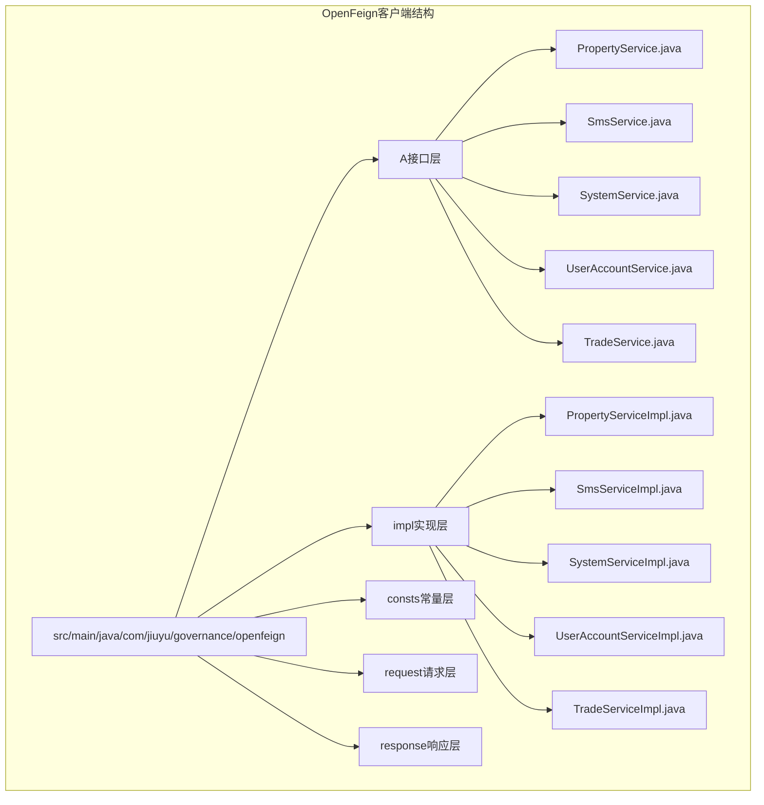
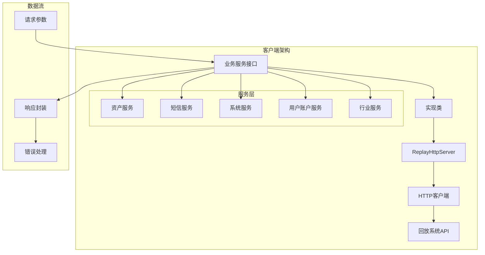
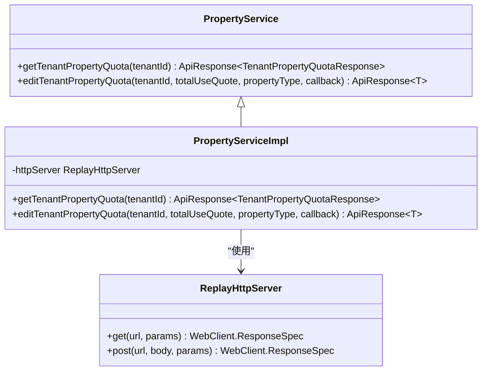
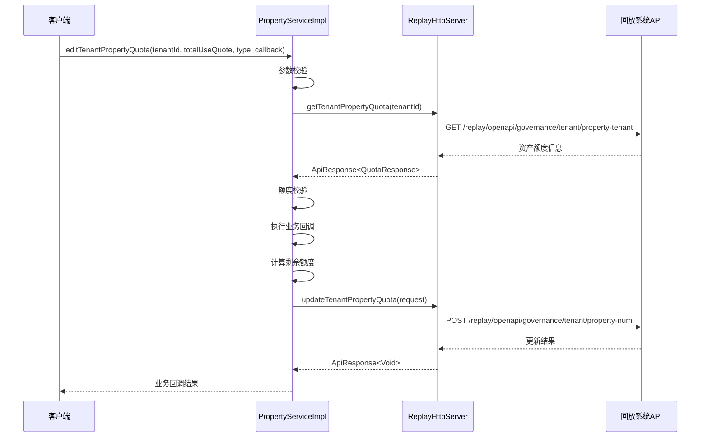
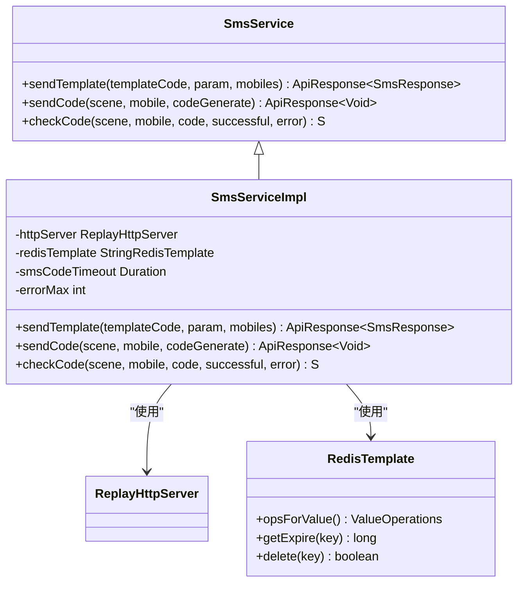
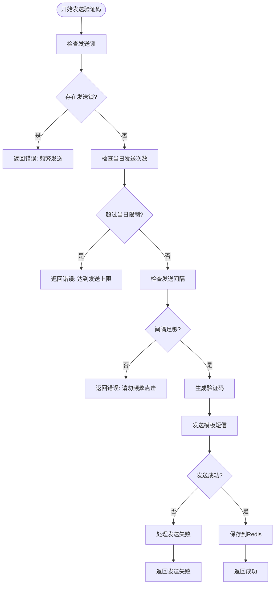
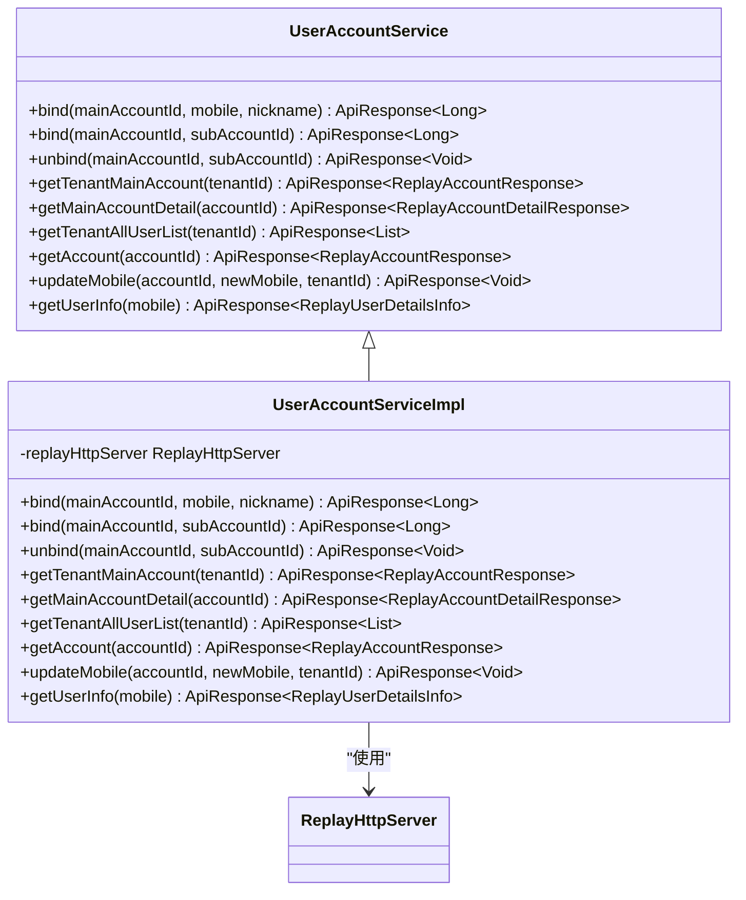
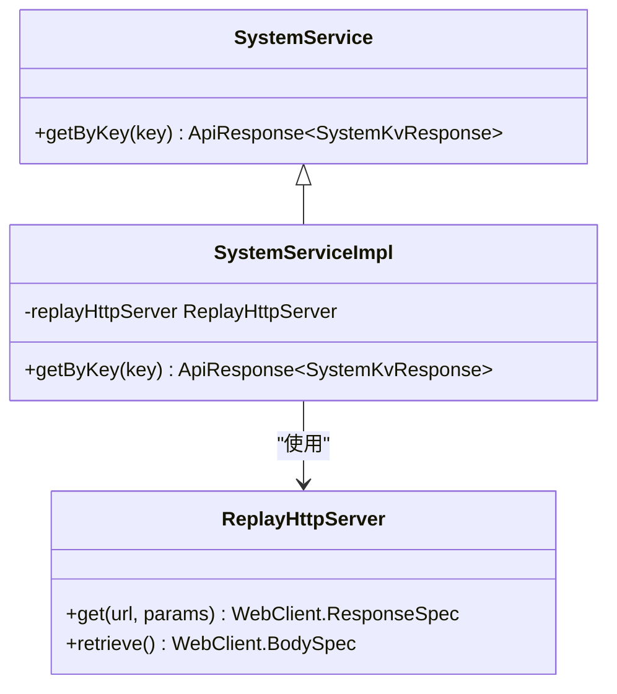
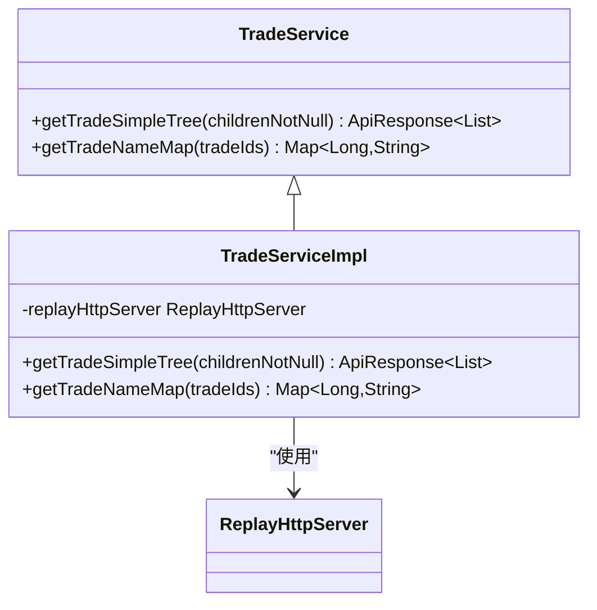
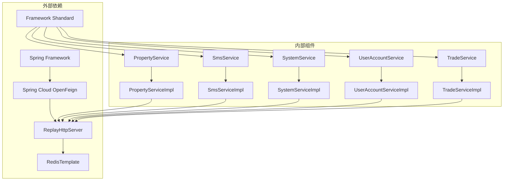

# 回放系统OpenFeign客户端

<cite>
**本文档引用的文件**
- [PropertyService.java](file://src/main/java/com/jiuyu/governance/openfeign/replay/PropertyService.java)
- [SmsService.java](file://src/main/java/com/jiuyu/governance/openfeign/replay/SmsService.java)
- [SystemService.java](file://src/main/java/com/jiuyu/governance/openfeign/replay/SystemService.java)
- [UserAccountService.java](file://src/main/java/com/jiuyu/governance/openfeign/replay/UserAccountService.java)
- [TradeService.java](file://src/main/java/com/jiuyu/governance/openfeign/replay/TradeService.java)
- [PropertyServiceImpl.java](file://src/main/java/com/jiuyu/governance/openfeign/replay/impl/PropertyServiceImpl.java)
- [SmsServiceImpl.java](file://src/main/java/com/jiuyu/governance/openfeign/replay/impl/SmsServiceImpl.java)
- [SystemServiceImpl.java](file://src/main/java/com/jiuyu/governance/openfeign/replay/impl/SystemServiceImpl.java)
- [UserAccountServiceImpl.java](file://src/main/java/com/jiuyu/governance/openfeign/replay/impl/UserAccountServiceImpl.java)
- [TradeServiceImpl.java](file://src/main/java/com/jiuyu/governance/openfeign/replay/impl/TradeServiceImpl.java)
</cite>

## 目录
1. [简介](#简介)
2. [项目结构](#项目结构)
3. [核心组件](#核心组件)
4. [架构概览](#架构概览)
5. [详细组件分析](#详细组件分析)
6. [依赖关系分析](#依赖关系分析)
7. [性能考虑](#性能考虑)
8. [故障排除指南](#故障排除指南)
9. [结论](#结论)

## 简介

回放系统OpenFeign客户端是一个基于Spring Cloud OpenFeign构建的微服务客户端框架，专门用于与回放系统进行HTTP通信。该客户端提供了统一的服务接口定义和实现，支持资产服务、短信服务、系统服务、用户账户服务和行业服务等多种功能。

该客户端的核心特点包括：
- 基于OpenFeign的声明式HTTP客户端
- 统一的响应封装机制
- 完善的错误处理和重试机制
- 缓存和限流控制
- 类型安全的API设计

## 项目结构

回放系统OpenFeign客户端采用标准的Maven项目结构，主要包含以下目录：

**图表来源**
- [PropertyService.java:1-51](file://src/main/java/com/jiuyu/governance/openfeign/replay/PropertyService.java#L1-L51)
- [SmsService.java:1-57](file://src/main/java/com/jiuyu/governance/openfeign/replay/SmsService.java#L1-L57)
- [PropertyServiceImpl.java:1-135](file://src/main/java/com/jiuyu/governance/openfeign/replay/impl/PropertyServiceImpl.java#L1-L135)

**章节来源**
- [PropertyService.java:1-51](file://src/main/java/com/jiuyu/governance/openfeign/replay/PropertyService.java#L1-L51)
- [SmsService.java:1-57](file://src/main/java/com/jiuyu/governance/openfeign/replay/SmsService.java#L1-L57)
- [PropertyServiceImpl.java:1-135](file://src/main/java/com/jiuyu/governance/openfeign/replay/impl/PropertyServiceImpl.java#L1-L135)

## 核心组件

回放系统OpenFeign客户端包含五个核心服务接口，每个接口都定义了相应的业务功能和数据模型：

### 资产服务 (PropertyService)
负责租户资产额度的查询和管理，支持模板方法模式的事务性操作。

### 短信服务 (SmsService)
提供短信发送和验证码验证功能，包含完整的频率控制和安全验证机制。

### 系统服务 (SystemService)
提供系统配置和键值对查询功能，支持运行时配置管理。

### 用户账户服务 (UserAccountService)
管理用户账户的绑定、解绑和信息查询功能，支持多层级账户体系。

### 行业服务 (TradeService)
提供行业分类和名称查询功能，支持树形结构数据的获取和转换。

**章节来源**
- [PropertyService.java:11-50](file://src/main/java/com/jiuyu/governance/openfeign/replay/PropertyService.java#L11-L50)
- [SmsService.java:12-56](file://src/main/java/com/jiuyu/governance/openfeign/replay/SmsService.java#L12-L56)
- [SystemService.java:6-22](file://src/main/java/com/jiuyu/governance/openfeign/replay/SystemService.java#L6-L22)
- [UserAccountService.java:11-112](file://src/main/java/com/jiuyu/governance/openfeign/replay/UserAccountService.java#L11-L112)
- [TradeService.java:10-37](file://src/main/java/com/jiuyu/governance/openfeign/replay/TradeService.java#L10-L37)

## 架构概览

回放系统OpenFeign客户端采用分层架构设计，通过统一的ReplayHttpServer进行HTTP通信：

**图表来源**
- [PropertyServiceImpl.java:28-135](file://src/main/java/com/jiuyu/governance/openfeign/replay/impl/PropertyServiceImpl.java#L28-L135)
- [SmsServiceImpl.java:35-276](file://src/main/java/com/jiuyu/governance/openfeign/replay/impl/SmsServiceImpl.java#L35-L276)
- [UserAccountServiceImpl.java:29-170](file://src/main/java/com/jiuyu/governance/openfeign/replay/impl/UserAccountServiceImpl.java#L29-L170)

## 详细组件分析

### 资产服务组件分析

资产服务是回放系统中最复杂的业务模块，采用了模板方法模式来确保操作的原子性和一致性。

**图表来源**
- [PropertyService.java:17-50](file://src/main/java/com/jiuyu/governance/openfeign/replay/PropertyService.java#L17-L50)
- [PropertyServiceImpl.java:28-135](file://src/main/java/com/jiuyu/governance/openfeign/replay/impl/PropertyServiceImpl.java#L28-L135)

#### 资产额度编辑流程

**图表来源**
- [PropertyServiceImpl.java:64-133](file://src/main/java/com/jiuyu/governance/openfeign/replay/impl/PropertyServiceImpl.java#L64-L133)

**章节来源**
- [PropertyService.java:19-49](file://src/main/java/com/jiuyu/governance/openfeign/replay/PropertyService.java#L19-L49)
- [PropertyServiceImpl.java:39-133](file://src/main/java/com/jiuyu/governance/openfeign/replay/impl/PropertyServiceImpl.java#L39-L133)

### 短信服务组件分析

短信服务提供了完整的短信发送和验证码验证功能，包含了丰富的安全控制机制。

**图表来源**
- [SmsService.java:18-56](file://src/main/java/com/jiuyu/governance/openfeign/replay/SmsService.java#L18-L56)
- [SmsServiceImpl.java:35-276](file://src/main/java/com/jiuyu/governance/openfeign/replay/impl/SmsServiceImpl.java#L35-L276)

#### 验证码发送流程

**图表来源**
- [SmsServiceImpl.java:138-195](file://src/main/java/com/jiuyu/governance/openfeign/replay/impl/SmsServiceImpl.java#L138-L195)

**章节来源**
- [SmsService.java:18-56](file://src/main/java/com/jiuyu/governance/openfeign/replay/SmsService.java#L18-L56)
- [SmsServiceImpl.java:35-276](file://src/main/java/com/jiuyu/governance/openfeign/replay/impl/SmsServiceImpl.java#L35-L276)

### 用户账户服务组件分析

用户账户服务提供了完整的账户管理体系，支持主账户和子账户的绑定关系管理。

**图表来源**
- [UserAccountService.java:17-112](file://src/main/java/com/jiuyu/governance/openfeign/replay/UserAccountService.java#L17-L112)
- [UserAccountServiceImpl.java:29-170](file://src/main/java/com/jiuyu/governance/openfeign/replay/impl/UserAccountServiceImpl.java#L29-L170)

**章节来源**
- [UserAccountService.java:17-112](file://src/main/java/com/jiuyu/governance/openfeign/replay/UserAccountService.java#L17-L112)
- [UserAccountServiceImpl.java:29-170](file://src/main/java/com/jiuyu/governance/openfeign/replay/impl/UserAccountServiceImpl.java#L29-L170)

### 系统服务组件分析

系统服务提供了系统级的配置查询功能，支持运行时配置的动态获取。

**图表来源**
- [SystemService.java:12-22](file://src/main/java/com/jiuyu/governance/openfeign/replay/SystemService.java#L12-L22)
- [SystemServiceImpl.java:21-38](file://src/main/java/com/jiuyu/governance/openfeign/replay/impl/SystemServiceImpl.java#L21-L38)

**章节来源**
- [SystemService.java:12-22](file://src/main/java/com/jiuyu/governance/openfeign/replay/SystemService.java#L12-L22)
- [SystemServiceImpl.java:21-38](file://src/main/java/com/jiuyu/governance/openfeign/replay/impl/SystemServiceImpl.java#L21-L38)

### 行业服务组件分析

行业服务提供了行业分类的数据查询功能，支持树形结构和名称映射查询。

**图表来源**
- [TradeService.java:16-37](file://src/main/java/com/jiuyu/governance/openfeign/replay/TradeService.java#L16-L37)
- [TradeServiceImpl.java:28-72](file://src/main/java/com/jiuyu/governance/openfeign/replay/impl/TradeServiceImpl.java#L28-L72)

**章节来源**
- [TradeService.java:16-37](file://src/main/java/com/jiuyu/governance/openfeign/replay/TradeService.java#L16-L37)
- [TradeServiceImpl.java:28-72](file://src/main/java/com/jiuyu/governance/openfeign/replay/impl/TradeServiceImpl.java#L28-L72)

## 依赖关系分析

回放系统OpenFeign客户端的依赖关系相对简单，主要依赖于ReplayHttpServer进行HTTP通信：

**图表来源**
- [PropertyServiceImpl.java:30-30](file://src/main/java/com/jiuyu/governance/openfeign/replay/impl/PropertyServiceImpl.java#L30-L30)
- [SmsServiceImpl.java:37-39](file://src/main/java/com/jiuyu/governance/openfeign/replay/impl/SmsServiceImpl.java#L37-L39)
- [UserAccountServiceImpl.java:31-31](file://src/main/java/com/jiuyu/governance/openfeign/replay/impl/UserAccountServiceImpl.java#L31-L31)
- [TradeServiceImpl.java:30-30](file://src/main/java/com/jiuyu/governance/openfeign/replay/impl/TradeServiceImpl.java#L30-L30)

**章节来源**
- [PropertyServiceImpl.java:3-15](file://src/main/java/com/jiuyu/governance/openfeign/replay/impl/PropertyServiceImpl.java#L3-L15)
- [SmsServiceImpl.java:3-25](file://src/main/java/com/jiuyu/governance/openfeign/replay/impl/SmsServiceImpl.java#L3-L25)
- [UserAccountServiceImpl.java:3-18](file://src/main/java/com/jiuyu/governance/openfeign/replay/impl/UserAccountServiceImpl.java#L3-L18)
- [TradeServiceImpl.java:3-17](file://src/main/java/com/jiuyu/governance/openfeign/replay/impl/TradeServiceImpl.java#L3-L17)

## 性能考虑

回放系统OpenFeign客户端在设计时充分考虑了性能优化：

### 缓存策略
- 使用Redis进行验证码缓存，避免重复发送
- 支持本地缓存和分布式缓存结合
- 合理设置缓存过期时间，平衡内存使用和性能

### 连接管理
- 复用HTTP连接，减少连接建立开销
- 支持连接池配置和超时设置
- 异步处理提高并发性能

### 错误处理
- 完善的异常捕获和降级机制
- 自动重试和熔断保护
- 详细的日志记录便于性能监控

## 故障排除指南

### 常见问题及解决方案

#### 资产额度相关问题
- **问题**: 额度不足导致操作失败
- **原因**: `totalUseQuote > total` 条件不满足
- **解决**: 检查资产类型和使用额度计算逻辑

#### 短信发送失败
- **问题**: 验证码发送频繁被限制
- **原因**: Redis中存在发送锁或达到发送上限
- **解决**: 检查Redis缓存状态和配置的发送限制

#### HTTP请求超时
- **问题**: 与回放系统API通信超时
- **原因**: 网络延迟或服务端负载过高
- **解决**: 调整超时配置和增加重试机制

**章节来源**
- [PropertyServiceImpl.java:92-95](file://src/main/java/com/jiuyu/governance/openfeign/replay/impl/PropertyServiceImpl.java#L92-L95)
- [SmsServiceImpl.java:143-169](file://src/main/java/com/jiuyu/governance/openfeign/replay/impl/SmsServiceImpl.java#L143-L169)
- [UserAccountServiceImpl.java:163-167](file://src/main/java/com/jiuyu/governance/openfeign/replay/impl/UserAccountServiceImpl.java#L163-L167)

## 结论

回放系统OpenFeign客户端是一个设计精良的微服务客户端框架，具有以下特点：

### 优势
- **模块化设计**: 清晰的接口分离和职责划分
- **类型安全**: 完整的泛型支持和编译时检查
- **错误处理**: 全面的异常处理和降级机制
- **性能优化**: 合理的缓存策略和连接管理

### 应用场景
- 微服务间的HTTP通信
- 第三方API集成
- 分布式系统的服务调用
- 高并发场景下的可靠通信

该客户端为回放系统的各种业务功能提供了稳定可靠的HTTP通信基础，是构建企业级微服务架构的重要组成部分。