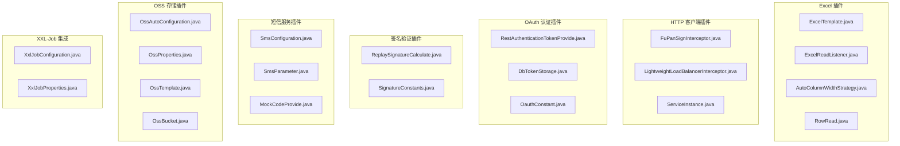
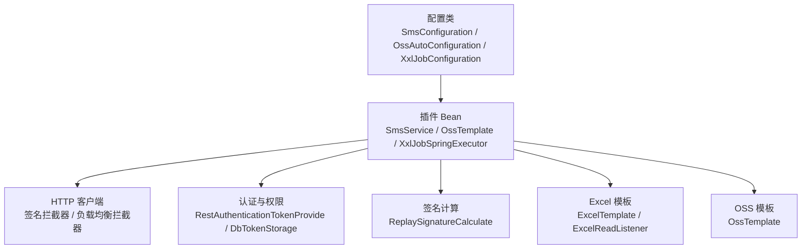
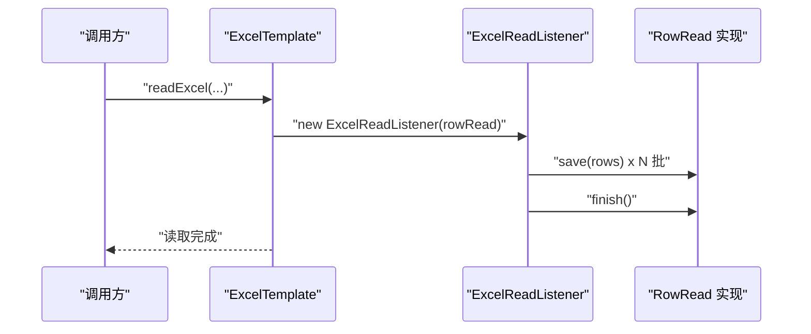
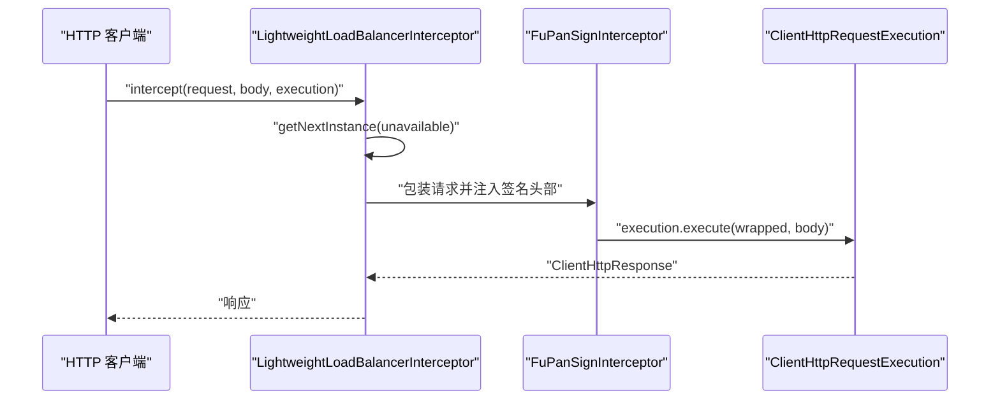
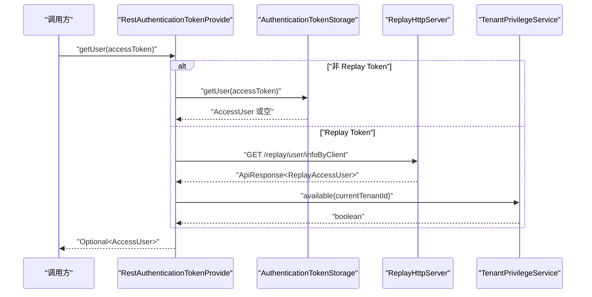
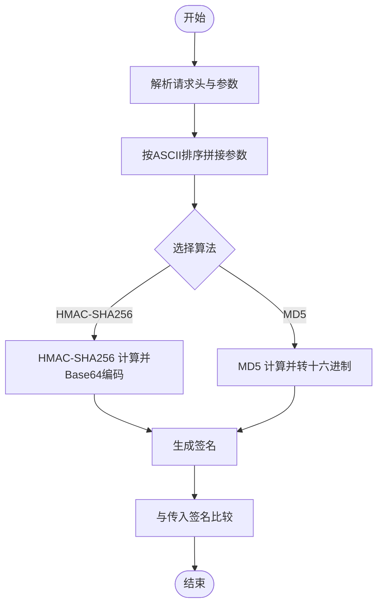
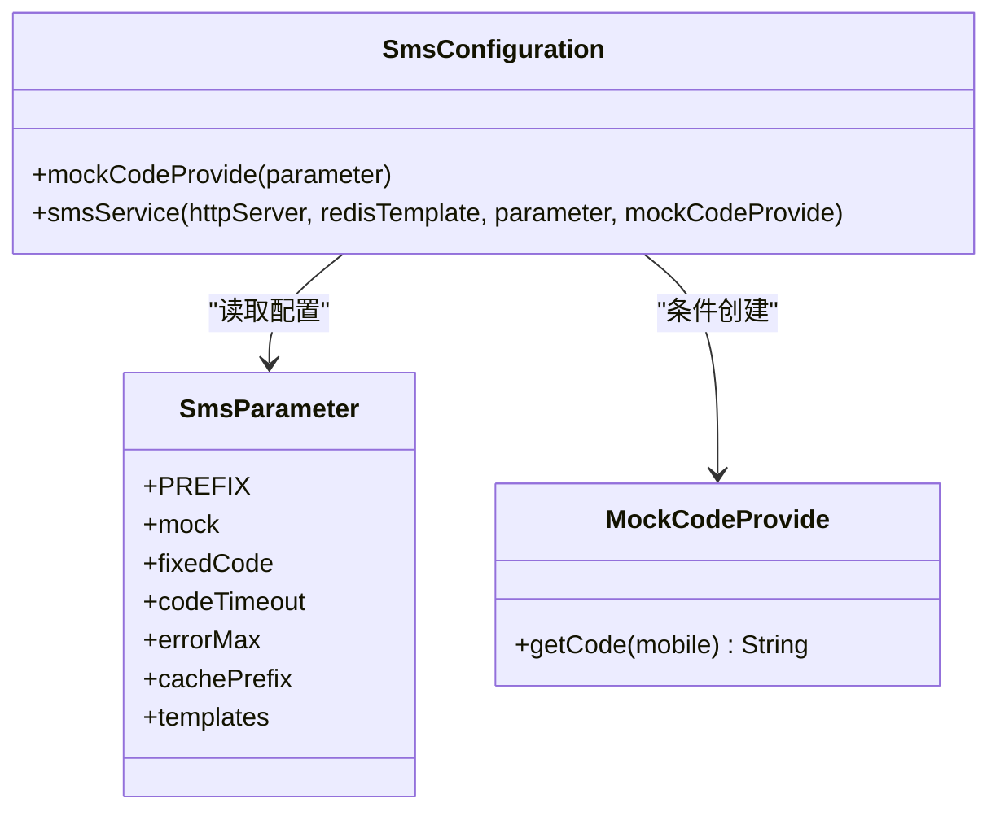
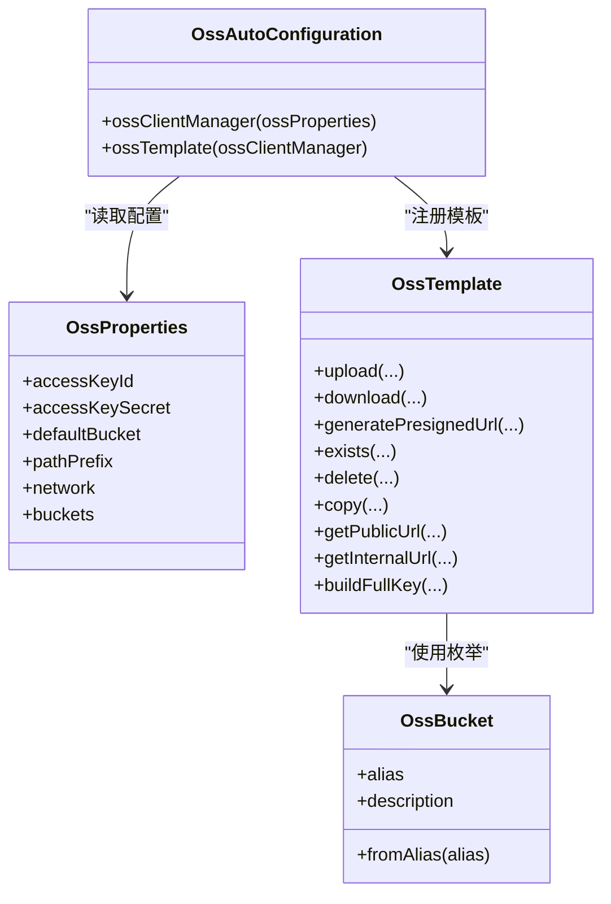
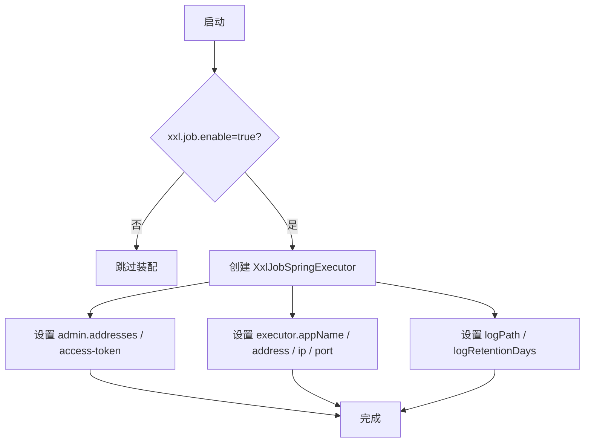
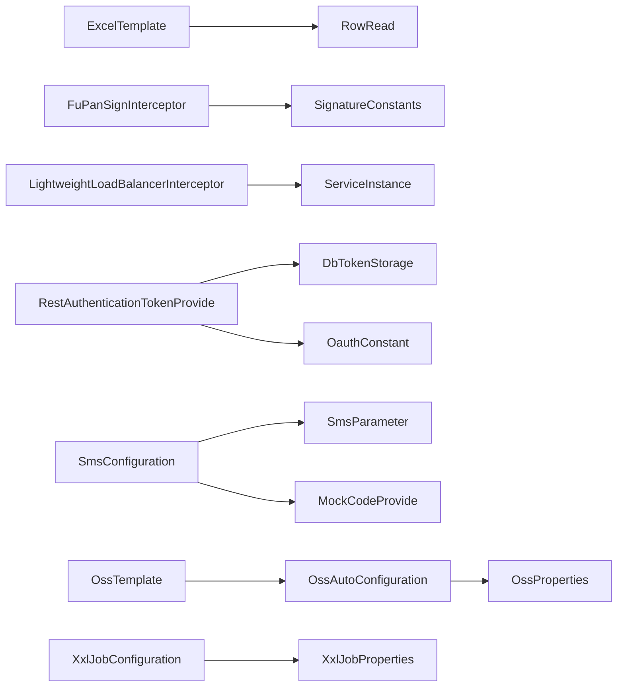

# 插件系统

<cite>
**本文引用的文件**
- [ExcelTemplate.java](file://src/main/java/com/jiuyu/governance/plugins/excel/ExcelTemplate.java)
- [ExcelReadListener.java](file://src/main/java/com/jiuyu/governance/plugins/excel/ExcelReadListener.java)
- [AutoColumnWidthStrategy.java](file://src/main/java/com/jiuyu/governance/plugins/excel/AutoColumnWidthStrategy.java)
- [RowRead.java](file://src/main/java/com/jiuyu/governance/plugins/excel/RowRead.java)
- [FuPanSignInterceptor.java](file://src/main/java/com/jiuyu/governance/plugins/http/FuPanSignInterceptor.java)
- [LightweightLoadBalancerInterceptor.java](file://src/main/java/com/jiuyu/governance/plugins/http/LightweightLoadBalancerInterceptor.java)
- [ServiceInstance.java](file://src/main/java/com/jiuyu/governance/plugins/http/ServiceInstance.java)
- [ReplaySignatureCalculate.java](file://src/main/java/com/jiuyu/governance/plugins/sign/ReplaySignatureCalculate.java)
- [SignatureConstants.java](file://src/main/java/com/jiuyu/governance/plugins/sign/SignatureConstants.java)
- [RestAuthenticationTokenProvide.java](file://src/main/java/com/jiuyu/governance/plugins/oauth/client/RestAuthenticationTokenProvide.java)
- [DbTokenStorage.java](file://src/main/java/com/jiuyu/governance/plugins/oauth/server/DbTokenStorage.java)
- [OauthConstant.java](file://src/main/java/com/jiuyu/governance/plugins/oauth/pojo/OauthConstant.java)
- [SmsConfiguration.java](file://src/main/java/com/jiuyu/governance/plugins/sms/SmsConfiguration.java)
- [SmsParameter.java](file://src/main/java/com/jiuyu/governance/plugins/sms/SmsParameter.java)
- [MockCodeProvide.java](file://src/main/java/com/jiuyu/governance/plugins/sms/MockCodeProvide.java)
- [OssAutoConfiguration.java](file://src/main/java/com/jiuyu/governance/plugins/oss/config/OssAutoConfiguration.java)
- [OssProperties.java](file://src/main/java/com/jiuyu/governance/plugins/oss/config/OssProperties.java)
- [OssTemplate.java](file://src/main/java/com/jiuyu/governance/plugins/oss/core/OssTemplate.java)
- [OssBucket.java](file://src/main/java/com/jiuyu/governance/plugins/oss/enums/OssBucket.java)
- [XxlJobConfiguration.java](file://src/main/java/com/jiuyu/governance/plugins/xxljob/XxlJobConfiguration.java)
- [XxlJobProperties.java](file://src/main/java/com/jiuyu/governance/plugins/xxljob/XxlJobProperties.java)
</cite>

## 目录
1. [简介](#简介)
2. [项目结构](#项目结构)
3. [核心组件](#核心组件)
4. [架构总览](#架构总览)
5. [详细组件分析](#详细组件分析)
6. [依赖分析](#依赖分析)
7. [性能考虑](#性能考虑)
8. [故障排查指南](#故障排查指南)
9. [结论](#结论)
10. [附录](#附录)

## 简介
本文件面向 fupan-governance-server 的插件系统，系统性阐述插件化架构的设计理念与实现原理，覆盖插件的加载机制、生命周期管理与依赖注入方式；并逐项详解各插件模块的功能特性与使用要点：
- Excel 处理插件：数据导入导出能力与批量写入策略
- HTTP 客户端插件：负载均衡与请求拦截、重试与故障转移
- OAuth 认证插件：基于远程调用的令牌鉴权与数据权限校验
- 签名验证插件：服务端签名与请求验签
- 短信服务插件：验证码发送与测试环境 Mock
- OSS 存储插件：对象存储管理与预签名链接
- XXL-Job 集成：任务调度执行器配置

同时给出配置方式、扩展接口与最佳实践，帮助插件开发者快速上手并安全稳定地集成。

## 项目结构
插件系统位于 src/main/java/com/jiuyu/governance/plugins 下，按功能域划分子包，采用“配置 + 核心模板/拦截器 + 数据模型”的分层组织方式，便于按需启用与扩展。

图表来源
- [ExcelTemplate.java:1-370](file://src/main/java/com/jiuyu/governance/plugins/excel/ExcelTemplate.java#L1-L370)
- [FuPanSignInterceptor.java:1-111](file://src/main/java/com/jiuyu/governance/plugins/http/FuPanSignInterceptor.java#L1-L111)
- [LightweightLoadBalancerInterceptor.java:1-190](file://src/main/java/com/jiuyu/governance/plugins/http/LightweightLoadBalancerInterceptor.java#L1-L190)
- [RestAuthenticationTokenProvide.java:1-122](file://src/main/java/com/jiuyu/governance/plugins/oauth/client/RestAuthenticationTokenProvide.java#L1-L122)
- [ReplaySignatureCalculate.java:1-199](file://src/main/java/com/jiuyu/governance/plugins/sign/ReplaySignatureCalculate.java#L1-L199)
- [SmsConfiguration.java:1-59](file://src/main/java/com/jiuyu/governance/plugins/sms/SmsConfiguration.java#L1-L59)
- [OssAutoConfiguration.java:1-40](file://src/main/java/com/jiuyu/governance/plugins/oss/config/OssAutoConfiguration.java#L1-L40)
- [OssTemplate.java:1-358](file://src/main/java/com/jiuyu/governance/plugins/oss/core/OssTemplate.java#L1-L358)
- [XxlJobConfiguration.java:1-78](file://src/main/java/com/jiuyu/governance/plugins/xxljob/XxlJobConfiguration.java#L1-L78)

章节来源
- [ExcelTemplate.java:1-370](file://src/main/java/com/jiuyu/governance/plugins/excel/ExcelTemplate.java#L1-L370)
- [SmsConfiguration.java:1-59](file://src/main/java/com/jiuyu/governance/plugins/sms/SmsConfiguration.java#L1-L59)
- [OssAutoConfiguration.java:1-40](file://src/main/java/com/jiuyu/governance/plugins/oss/config/OssAutoConfiguration.java#L1-L40)
- [XxlJobConfiguration.java:1-78](file://src/main/java/com/jiuyu/governance/plugins/xxljob/XxlJobConfiguration.java#L1-L78)

## 核心组件
- Excel 处理：提供同步/异步读取、批量写入、自动列宽、样式策略与下载响应封装
- HTTP 客户端：提供签名拦截器与轻量级负载均衡拦截器，支持重试与故障转移
- OAuth 认证：基于远程调用的令牌提供器与数据库 Token 存储接口
- 签名验证：统一的签名生成与验证实现，兼容多种签名算法
- 短信服务：自动装配短信服务 Bean，支持测试环境固定验证码
- OSS 存储：自动配置客户端与模板，统一封装上传/下载/预签名/管理操作
- XXL-Job：条件化装配执行器，支持多配置项

章节来源
- [ExcelTemplate.java:1-370](file://src/main/java/com/jiuyu/governance/plugins/excel/ExcelTemplate.java#L1-L370)
- [FuPanSignInterceptor.java:1-111](file://src/main/java/com/jiuyu/governance/plugins/http/FuPanSignInterceptor.java#L1-L111)
- [LightweightLoadBalancerInterceptor.java:1-190](file://src/main/java/com/jiuyu/governance/plugins/http/LightweightLoadBalancerInterceptor.java#L1-L190)
- [RestAuthenticationTokenProvide.java:1-122](file://src/main/java/com/jiuyu/governance/plugins/oauth/client/RestAuthenticationTokenProvide.java#L1-L122)
- [ReplaySignatureCalculate.java:1-199](file://src/main/java/com/jiuyu/governance/plugins/sign/ReplaySignatureCalculate.java#L1-L199)
- [SmsConfiguration.java:1-59](file://src/main/java/com/jiuyu/governance/plugins/sms/SmsConfiguration.java#L1-L59)
- [OssAutoConfiguration.java:1-40](file://src/main/java/com/jiuyu/governance/plugins/oss/config/OssAutoConfiguration.java#L1-L40)
- [OssTemplate.java:1-358](file://src/main/java/com/jiuyu/governance/plugins/oss/core/OssTemplate.java#L1-L358)
- [XxlJobConfiguration.java:1-78](file://src/main/java/com/jiuyu/governance/plugins/xxljob/XxlJobConfiguration.java#L1-L78)

## 架构总览
插件系统遵循 Spring Boot 自动装配与条件化装配原则，通过配置类在满足条件时注册 Bean，结合拦截器与模板类实现横切能力。认证与签名模块通过统一常量与接口抽象，确保跨模块一致性。

图表来源
- [SmsConfiguration.java:1-59](file://src/main/java/com/jiuyu/governance/plugins/sms/SmsConfiguration.java#L1-L59)
- [OssAutoConfiguration.java:1-40](file://src/main/java/com/jiuyu/governance/plugins/oss/config/OssAutoConfiguration.java#L1-L40)
- [XxlJobConfiguration.java:1-78](file://src/main/java/com/jiuyu/governance/plugins/xxljob/XxlJobConfiguration.java#L1-L78)
- [FuPanSignInterceptor.java:1-111](file://src/main/java/com/jiuyu/governance/plugins/http/FuPanSignInterceptor.java#L1-L111)
- [LightweightLoadBalancerInterceptor.java:1-190](file://src/main/java/com/jiuyu/governance/plugins/http/LightweightLoadBalancerInterceptor.java#L1-L190)
- [RestAuthenticationTokenProvide.java:1-122](file://src/main/java/com/jiuyu/governance/plugins/oauth/client/RestAuthenticationTokenProvide.java#L1-L122)
- [ReplaySignatureCalculate.java:1-199](file://src/main/java/com/jiuyu/governance/plugins/sign/ReplaySignatureCalculate.java#L1-L199)
- [ExcelTemplate.java:1-370](file://src/main/java/com/jiuyu/governance/plugins/excel/ExcelTemplate.java#L1-L370)
- [OssTemplate.java:1-358](file://src/main/java/com/jiuyu/governance/plugins/oss/core/OssTemplate.java#L1-L358)

## 详细组件分析

### Excel 处理插件
- 功能要点
  - 同步读取：支持指定 sheet、标题行与密码解密
  - 流式读取：监听器按批保存，避免大文件内存压力
  - 批量写入：支持分页/游标下载，内置样式与列宽策略
  - 响应封装：统一生成下载响应头与二进制流
- 关键类与职责
  - ExcelTemplate：读写入口、样式与列宽策略、下载响应封装
  - ExcelReadListener：监听行事件，批量提交与收尾回调
  - AutoColumnWidthStrategy：自动列宽与中英文长度计算
  - RowRead：行处理回调接口，支持 save/finish
- 生命周期
  - 读取：构造监听器 → 注册监听 → 执行读取 → 收尾回调
  - 写入：构建写入器 → 写入数据 → 完成输出流
- 依赖注入
  - 通过工具类静态方法使用，无需额外注入；如需扩展可注入 RowRead 实现

图表来源
- [ExcelTemplate.java:72-82](file://src/main/java/com/jiuyu/governance/plugins/excel/ExcelTemplate.java#L72-L82)
- [ExcelReadListener.java:16-56](file://src/main/java/com/jiuyu/governance/plugins/excel/ExcelReadListener.java#L16-L56)
- [RowRead.java:11-33](file://src/main/java/com/jiuyu/governance/plugins/excel/RowRead.java#L11-L33)

章节来源
- [ExcelTemplate.java:1-370](file://src/main/java/com/jiuyu/governance/plugins/excel/ExcelTemplate.java#L1-L370)
- [ExcelReadListener.java:1-58](file://src/main/java/com/jiuyu/governance/plugins/excel/ExcelReadListener.java#L1-L58)
- [AutoColumnWidthStrategy.java:1-142](file://src/main/java/com/jiuyu/governance/plugins/excel/AutoColumnWidthStrategy.java#L1-L142)
- [RowRead.java:1-33](file://src/main/java/com/jiuyu/governance/plugins/excel/RowRead.java#L1-L33)

### HTTP 客户端插件
- 功能要点
  - 签名拦截器：自动注入签名、时间戳、请求 ID、随机串等头部
  - 轻量负载均衡：基于权重轮询选择实例，支持重试与故障实例剔除
- 关键类与职责
  - FuPanSignInterceptor：HMAC-SHA256 签名，按 ASCII 排序拼接参数
  - LightweightLoadBalancerInterceptor：加权轮询 + 响应式重试
  - ServiceInstance：服务实例与权重模型
- 生命周期
  - 拦截阶段：构建签名参数 → 计算签名 → 包装请求 → 执行并重试
- 依赖注入
  - 通过 Spring Interceptor 注册；负载均衡器需注入实例列表与可选重试策略

图表来源
- [LightweightLoadBalancerInterceptor.java:108-126](file://src/main/java/com/jiuyu/governance/plugins/http/LightweightLoadBalancerInterceptor.java#L108-L126)
- [FuPanSignInterceptor.java:58-86](file://src/main/java/com/jiuyu/governance/plugins/http/FuPanSignInterceptor.java#L58-L86)
- [ServiceInstance.java](file://src/main/java/com/jiuyu/governance/plugins/http/ServiceInstance.java)

章节来源
- [FuPanSignInterceptor.java:1-111](file://src/main/java/com/jiuyu/governance/plugins/http/FuPanSignInterceptor.java#L1-L111)
- [LightweightLoadBalancerInterceptor.java:1-190](file://src/main/java/com/jiuyu/governance/plugins/http/LightweightLoadBalancerInterceptor.java#L1-L190)
- [ServiceInstance.java](file://src/main/java/com/jiuyu/governance/plugins/http/ServiceInstance.java)

### OAuth 认证插件
- 功能要点
  - 远程令牌提供：区分系统/客户端/治理用户类型，支持缓存与租户权限校验
  - 数据权限：通过常量定义不同粒度（公司/部门/小组/直播间）
  - Token 存储：接口定义登录、登出、批量登出与过期更新
- 关键类与职责
  - RestAuthenticationTokenProvide：远程获取用户信息，缓存与租户可用性校验
  - DbTokenStorage：数据库持久化 Token 存储接口
  - OauthConstant：用户类型与数据权限常量
- 生命周期
  - 获取用户：优先本地存储，否则远程调用并缓存
  - 权限校验：客户端用户需校验租户可用性
- 依赖注入
  - 通过构造注入 AuthenticationTokenStorage、TenantPrivilegeService、ReplayHttpServer

图表来源
- [RestAuthenticationTokenProvide.java:62-92](file://src/main/java/com/jiuyu/governance/plugins/oauth/client/RestAuthenticationTokenProvide.java#L62-L92)
- [DbTokenStorage.java:14-70](file://src/main/java/com/jiuyu/governance/plugins/oauth/server/DbTokenStorage.java#L14-L70)
- [OauthConstant.java:9-81](file://src/main/java/com/jiuyu/governance/plugins/oauth/pojo/OauthConstant.java#L9-L81)

章节来源
- [RestAuthenticationTokenProvide.java:1-122](file://src/main/java/com/jiuyu/governance/plugins/oauth/client/RestAuthenticationTokenProvide.java#L1-L122)
- [DbTokenStorage.java:1-70](file://src/main/java/com/jiuyu/governance/plugins/oauth/server/DbTokenStorage.java#L1-L70)
- [OauthConstant.java:1-81](file://src/main/java/com/jiuyu/governance/plugins/oauth/pojo/OauthConstant.java#L1-L81)

### 签名验证插件
- 功能要点
  - 生成签名：支持 HMAC-SHA256 与 MD5，按 ASCII 排序拼接参数
  - 验证签名：校验请求头中的 appId、timestamp、nonce、fingerprint、requestId 与 body
- 关键类与职责
  - ReplaySignatureCalculate：统一签名计算与验证
  - SignatureConstants：签名相关头部与分隔符常量
- 生命周期
  - 生成：组装参数 → 排序拼接 → 选择算法 → Base64/MD5 编码
  - 验证：解析请求头 → 组装签名串 → 与传入签名比对
- 依赖注入
  - 作为通用服务注册，供拦截器与控制器共同使用

图表来源
- [ReplaySignatureCalculate.java:49-163](file://src/main/java/com/jiuyu/governance/plugins/sign/ReplaySignatureCalculate.java#L49-L163)
- [SignatureConstants.java](file://src/main/java/com/jiuyu/governance/plugins/sign/SignatureConstants.java)

章节来源
- [ReplaySignatureCalculate.java:1-199](file://src/main/java/com/jiuyu/governance/plugins/sign/ReplaySignatureCalculate.java#L1-L199)
- [SignatureConstants.java](file://src/main/java/com/jiuyu/governance/plugins/sign/SignatureConstants.java)

### 短信服务插件
- 功能要点
  - 自动装配短信服务 Bean，支持模板、超时、缓存前缀与最大错误次数
  - 测试环境支持固定验证码或随机验证码的 Mock 提供者
- 关键类与职责
  - SmsConfiguration：条件化装配 MockCodeProvide 与 SmsService
  - SmsParameter：配置前缀、开关、验证码有效期、缓存前缀、模板
  - MockCodeProvide：函数式接口，提供验证码
- 生命周期
  - 启动：读取配置 → 条件创建 Mock 提供者 → 创建 SmsService Bean
- 依赖注入
  - SmsService 依赖 ReplayHttpServer、StringRedisTemplate、SmsParameter、MockCodeProvide

图表来源
- [SmsConfiguration.java:21-58](file://src/main/java/com/jiuyu/governance/plugins/sms/SmsConfiguration.java#L21-L58)
- [SmsParameter.java:15-70](file://src/main/java/com/jiuyu/governance/plugins/sms/SmsParameter.java#L15-L70)
- [MockCodeProvide.java:10-23](file://src/main/java/com/jiuyu/governance/plugins/sms/MockCodeProvide.java#L10-L23)

章节来源
- [SmsConfiguration.java:1-59](file://src/main/java/com/jiuyu/governance/plugins/sms/SmsConfiguration.java#L1-L59)
- [SmsParameter.java:1-70](file://src/main/java/com/jiuyu/governance/plugins/sms/SmsParameter.java#L1-L70)
- [MockCodeProvide.java:1-23](file://src/main/java/com/jiuyu/governance/plugins/sms/MockCodeProvide.java#L1-L23)

### OSS 存储插件
- 功能要点
  - 自动配置：检测配置存在即注册客户端管理器与模板
  - 统一模板：封装上传/下载/预签名/管理操作，自动处理路径前缀与网络策略
  - 桶枚举：定义业务桶别名，与配置映射
- 关键类与职责
  - OssAutoConfiguration：条件化注册 OssClientManager 与 OssTemplate
  - OssProperties：全局与桶级配置（AK、桶名、endpoint、路径前缀、网络策略）
  - OssTemplate：上传/下载/预签名/管理/URL 生成
  - OssBucket：桶枚举
- 生命周期
  - 启动：读取配置 → 初始化客户端 → 注册模板 Bean
  - 使用：通过模板调用具体操作，内部处理前缀与网络
- 依赖注入
  - OssTemplate 依赖 OssClientManager；配置类依赖 OssProperties

图表来源
- [OssAutoConfiguration.java:20-39](file://src/main/java/com/jiuyu/governance/plugins/oss/config/OssAutoConfiguration.java#L20-L39)
- [OssProperties.java:35-140](file://src/main/java/com/jiuyu/governance/plugins/oss/config/OssProperties.java#L35-L140)
- [OssTemplate.java:28-358](file://src/main/java/com/jiuyu/governance/plugins/oss/core/OssTemplate.java#L28-L358)
- [OssBucket.java:13-61](file://src/main/java/com/jiuyu/governance/plugins/oss/enums/OssBucket.java#L13-L61)

章节来源
- [OssAutoConfiguration.java:1-40](file://src/main/java/com/jiuyu/governance/plugins/oss/config/OssAutoConfiguration.java#L1-L40)
- [OssProperties.java:1-140](file://src/main/java/com/jiuyu/governance/plugins/oss/config/OssProperties.java#L1-L140)
- [OssTemplate.java:1-358](file://src/main/java/com/jiuyu/governance/plugins/oss/core/OssTemplate.java#L1-L358)
- [OssBucket.java:1-61](file://src/main/java/com/jiuyu/governance/plugins/oss/enums/OssBucket.java#L1-L61)

### XXL-Job 集成
- 功能要点
  - 条件化装配执行器，支持管理端地址、令牌、应用名、IP/端口、日志路径与保留天数
- 关键类与职责
  - XxlJobConfiguration：注册 XxlJobSpringExecutor Bean
  - XxlJobProperties：配置 enable、admin、executor
- 生命周期
  - 启动：读取配置 → 条件创建执行器 → 设置各项参数
- 依赖注入
  - 执行器 Bean 由 Spring 容器管理

图表来源
- [XxlJobConfiguration.java:20-76](file://src/main/java/com/jiuyu/governance/plugins/xxljob/XxlJobConfiguration.java#L20-L76)
- [XxlJobProperties.java:13-92](file://src/main/java/com/jiuyu/governance/plugins/xxljob/XxlJobProperties.java#L13-L92)

章节来源
- [XxlJobConfiguration.java:1-78](file://src/main/java/com/jiuyu/governance/plugins/xxljob/XxlJobConfiguration.java#L1-L78)
- [XxlJobProperties.java:1-92](file://src/main/java/com/jiuyu/governance/plugins/xxljob/XxlJobProperties.java#L1-L92)

## 依赖分析
- 组件耦合
  - Excel 插件与 RowRead 接口松耦合，便于替换实现
  - HTTP 插件通过拦截器与模板解耦，便于扩展签名算法与负载均衡策略
  - OAuth 插件通过接口与常量抽象，统一用户类型与权限级别
  - 短信插件通过条件化装配与函数式接口，降低测试与生产差异
  - OSS 插件通过配置类与枚举，实现配置驱动与类型安全
  - XXL-Job 插件通过条件注解，避免未启用时的资源浪费
- 外部依赖
  - HTTP：Spring Web、Reactor、Hutool
  - Excel：Fesod Sheet、Apache POI
  - 签名：Javax Crypto、Signature Core
  - 短信：Replay Http Server、Redis
  - OSS：Aliyun OSS SDK
  - XXL-Job：XxlJob Spring Executor

图表来源
- [ExcelTemplate.java:1-370](file://src/main/java/com/jiuyu/governance/plugins/excel/ExcelTemplate.java#L1-L370)
- [RowRead.java:1-33](file://src/main/java/com/jiuyu/governance/plugins/excel/RowRead.java#L1-L33)
- [FuPanSignInterceptor.java:1-111](file://src/main/java/com/jiuyu/governance/plugins/http/FuPanSignInterceptor.java#L1-L111)
- [LightweightLoadBalancerInterceptor.java:1-190](file://src/main/java/com/jiuyu/governance/plugins/http/LightweightLoadBalancerInterceptor.java#L1-L190)
- [ServiceInstance.java](file://src/main/java/com/jiuyu/governance/plugins/http/ServiceInstance.java)
- [RestAuthenticationTokenProvide.java:1-122](file://src/main/java/com/jiuyu/governance/plugins/oauth/client/RestAuthenticationTokenProvide.java#L1-L122)
- [DbTokenStorage.java:1-70](file://src/main/java/com/jiuyu/governance/plugins/oauth/server/DbTokenStorage.java#L1-L70)
- [OauthConstant.java:1-81](file://src/main/java/com/jiuyu/governance/plugins/oauth/pojo/OauthConstant.java#L1-L81)
- [SmsConfiguration.java:1-59](file://src/main/java/com/jiuyu/governance/plugins/sms/SmsConfiguration.java#L1-L59)
- [SmsParameter.java:1-70](file://src/main/java/com/jiuyu/governance/plugins/sms/SmsParameter.java#L1-L70)
- [MockCodeProvide.java:1-23](file://src/main/java/com/jiuyu/governance/plugins/sms/MockCodeProvide.java#L1-L23)
- [OssAutoConfiguration.java:1-40](file://src/main/java/com/jiuyu/governance/plugins/oss/config/OssAutoConfiguration.java#L1-L40)
- [OssProperties.java:1-140](file://src/main/java/com/jiuyu/governance/plugins/oss/config/OssProperties.java#L1-L140)
- [OssTemplate.java:1-358](file://src/main/java/com/jiuyu/governance/plugins/oss/core/OssTemplate.java#L1-L358)
- [XxlJobConfiguration.java:1-78](file://src/main/java/com/jiuyu/governance/plugins/xxljob/XxlJobConfiguration.java#L1-L78)
- [XxlJobProperties.java:1-92](file://src/main/java/com/jiuyu/governance/plugins/xxljob/XxlJobProperties.java#L1-L92)

## 性能考虑
- Excel
  - 流式读取与批量保存，控制批次大小，避免内存峰值
  - 自动列宽策略使用缓存与位运算优化计算开销
- HTTP
  - 负载均衡采用加权轮询与原子计数器，避免锁竞争
  - 响应式重试结合抖动与过滤策略，降低雪崩风险
- OAuth
  - 远程调用使用缓存，减少重复请求
  - 客户端用户租户可用性校验前置，避免无效流程
- 短信
  - 测试环境固定验证码减少外部依赖与延迟
- OSS
  - 预签名链接区分内外网，提升访问效率
  - 批量删除与复制操作减少网络往返
- XXL-Job
  - 合理设置日志路径与保留天数，避免磁盘压力

## 故障排查指南
- Excel
  - 读取异常：检查标题行数、sheet 编号与密码
  - 写入失败：确认输出流未提前关闭，样式与列宽策略是否冲突
- HTTP
  - 签名失败：核对 appId、timestamp、nonce、body 与签名算法
  - 负载均衡无实例：检查服务实例列表与权重配置
- OAuth
  - 令牌无效：确认 Token 是否在本地存储或远程可用
  - 租户不可用：检查租户权限服务返回状态
- 短信
  - 验证码未发送：检查 Redis 连接与缓存前缀
  - Mock 未生效：确认配置开关与固定验证码设置
- OSS
  - 上传/下载失败：核对 AK/SK、桶名、endpoint 与路径前缀
  - 预签名链接无效：确认过期时间与 Content-Type
- XXL-Job
  - 执行器未注册：检查 enable、admin 地址与令牌
  - 日志异常：确认日志路径与权限

章节来源
- [ExcelTemplate.java:259-264](file://src/main/java/com/jiuyu/governance/plugins/excel/ExcelTemplate.java#L259-L264)
- [OssTemplate.java:56-58](file://src/main/java/com/jiuyu/governance/plugins/oss/core/OssTemplate.java#L56-L58)
- [XxlJobConfiguration.java:30-76](file://src/main/java/com/jiuyu/governance/plugins/xxljob/XxlJobConfiguration.java#L30-L76)

## 结论
本插件系统以“配置驱动 + 条件化装配 + 拦截器/模板”为核心设计，围绕数据导入导出、HTTP 请求、认证授权、安全签名、消息通知、对象存储与任务调度等场景提供高内聚、低耦合的能力模块。通过清晰的接口抽象与可替换实现，既满足生产稳定性要求，又便于测试与扩展。

## 附录
- 配置参考
  - 短信：jiuyu.sms.mock、jiuyu.sms.fixedCode、jiuyu.sms.codeTimeout、jiuyu.sms.errorMax、jiuyu.sms.cachePrefix、jiuyu.sms.templates.verification
  - OSS：jiuyu.oss.access-key-id、jiuyu.oss.access-key-secret、jiuyu.oss.default-bucket、jiuyu.oss.path-prefix、jiuyu.oss.network.server-operation、jiuyu.oss.network.presigned-url、jiuyu.oss.buckets.<alias>
  - XXL-Job：xxl.job.enable、xxl.job.admin.addresses、xxl.job.admin.accessToken、xxl.job.executor.appName、xxl.job.executor.address、xxl.job.executor.ip、xxl.job.executor.port、xxl.job.executor.logPath、xxl.job.executor.logRetentionDays
- 扩展建议
  - 新增 Excel 处理：实现 RowRead，按需自定义样式与列宽策略
  - 新增 HTTP 策略：实现 ClientHttpRequestInterceptor，或扩展负载均衡策略
  - 新增签名算法：在签名计算类中增加分支与常量
  - 新增短信模板：在 SmsParameter 中扩展模板键
  - 新增 OSS 桶：在 OssBucket 中新增枚举并在配置中补充
  - 新增 XXL-Job 任务：实现 JobHandler 并注册到执行器