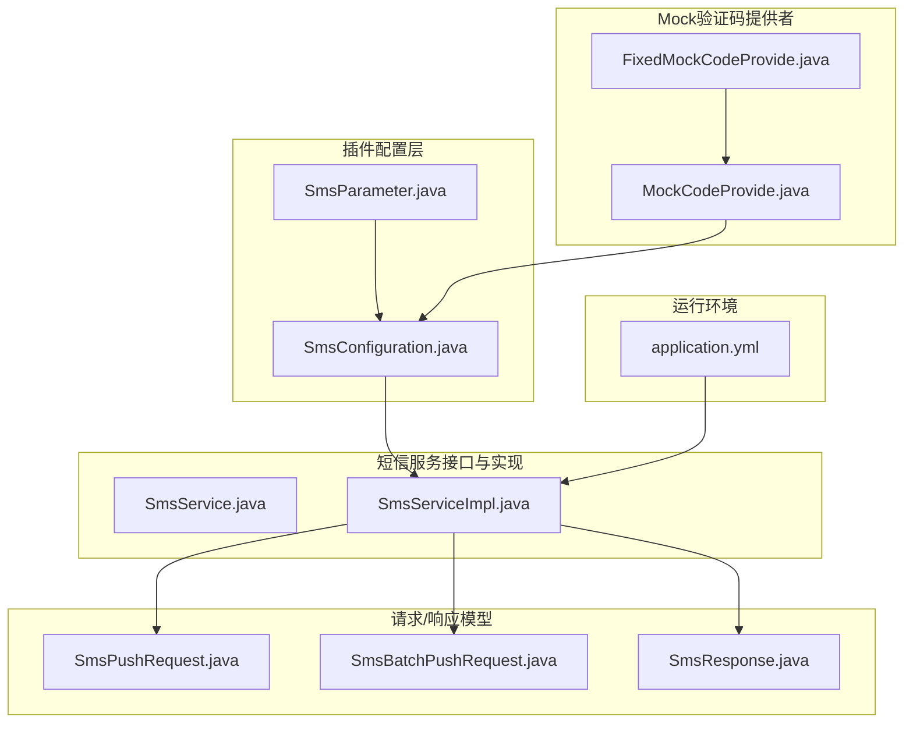
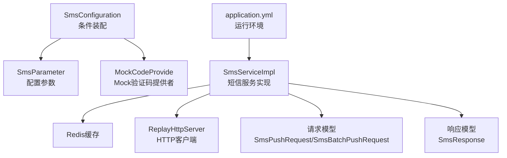
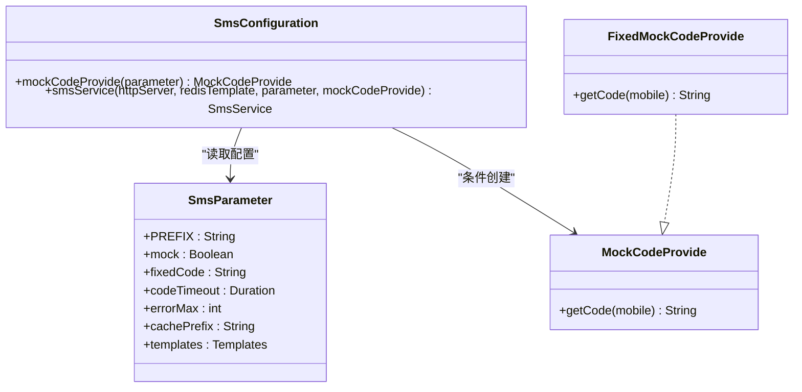
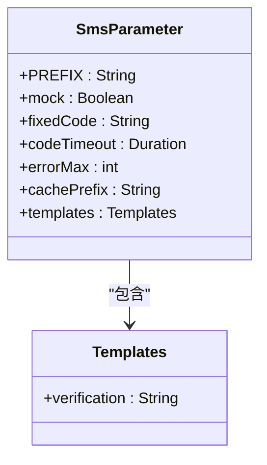
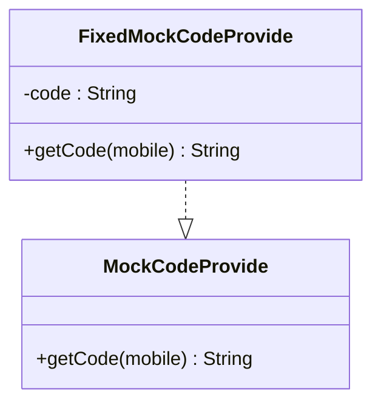
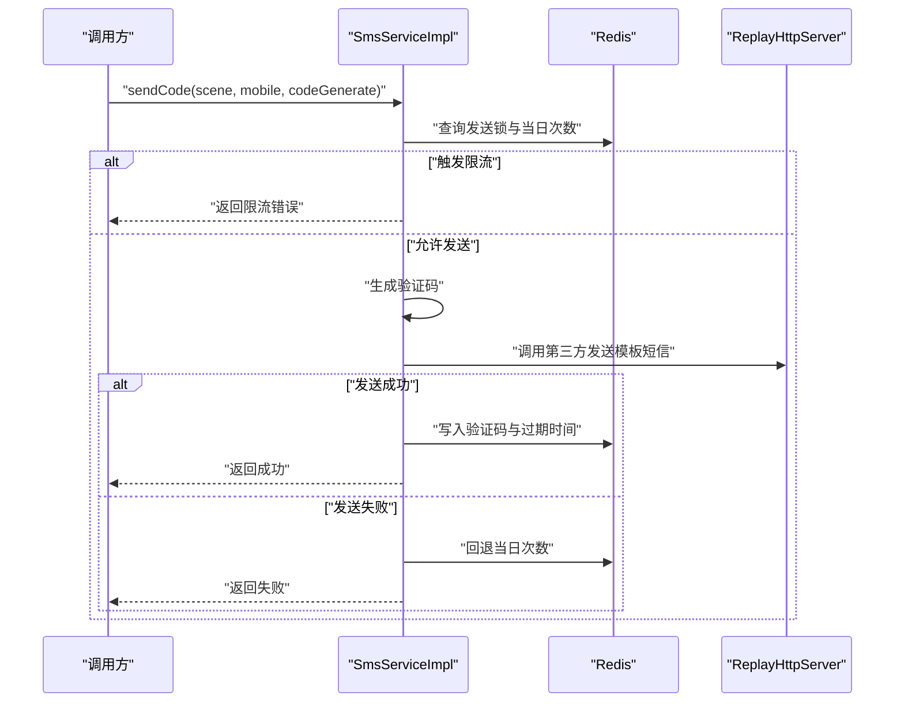
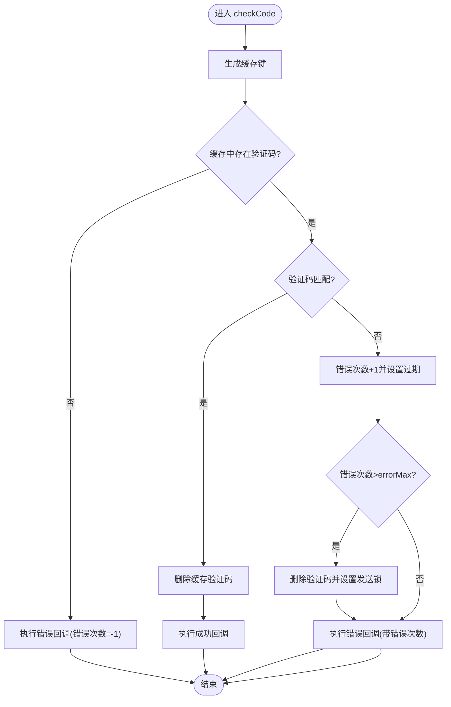
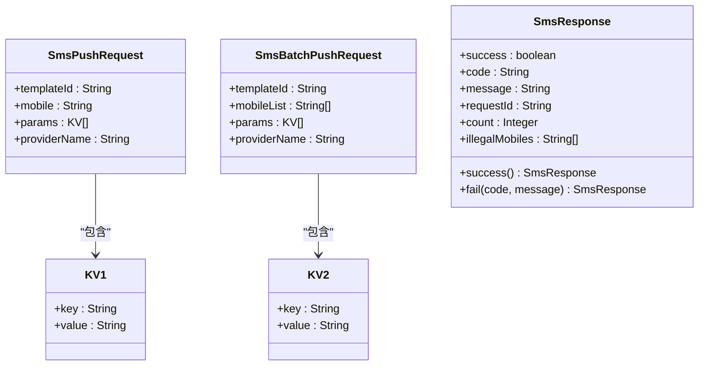
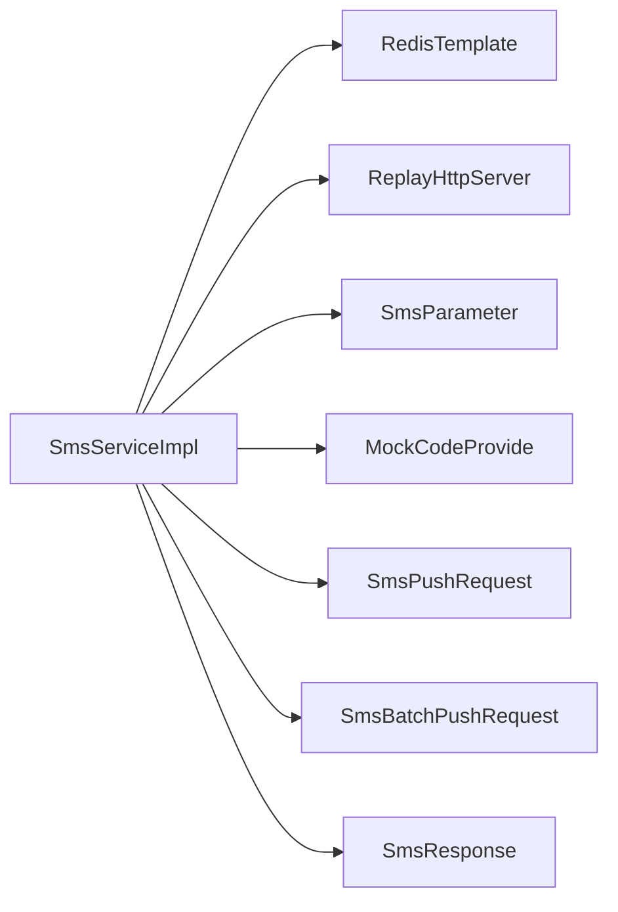

# 短信服务插件

<cite>
**本文引用的文件**
- [SmsConfiguration.java](file://src/main/java/com/jiuyu/governance/plugins/sms/SmsConfiguration.java)
- [SmsParameter.java](file://src/main/java/com/jiuyu/governance/plugins/sms/SmsParameter.java)
- [MockCodeProvide.java](file://src/main/java/com/jiuyu/governance/plugins/sms/MockCodeProvide.java)
- [FixedMockCodeProvide.java](file://src/main/java/com/jiuyu/governance/plugins/sms/FixedMockCodeProvide.java)
- [SmsService.java](file://src/main/java/com/jiuyu/governance/openfeign/replay/SmsService.java)
- [SmsServiceImpl.java](file://src/main/java/com/jiuyu/governance/openfeign/replay/impl/SmsServiceImpl.java)
- [SmsPushRequest.java](file://src/main/java/com/jiuyu/governance/openfeign/replay/request/SmsPushRequest.java)
- [SmsBatchPushRequest.java](file://src/main/java/com/jiuyu/governance/openfeign/replay/request/SmsBatchPushRequest.java)
- [SmsResponse.java](file://src/main/java/com/jiuyu/governance/openfeign/replay/response/SmsResponse.java)
- [application.yml](file://src/main/resources/application.yml)
</cite>

## 目录
1. [简介](#简介)
2. [项目结构](#项目结构)
3. [核心组件](#核心组件)
4. [架构总览](#架构总览)
5. [详细组件分析](#详细组件分析)
6. [依赖分析](#依赖分析)
7. [性能考虑](#性能考虑)
8. [故障排查指南](#故障排查指南)
9. [结论](#结论)
10. [附录](#附录)

## 简介
本技术文档围绕短信服务插件展开，系统性阐述短信发送功能的实现原理与工程实践，涵盖以下主题：
- SmsConfiguration 配置管理与条件装配
- SmsParameter 短信参数与模板配置
- 验证码生成机制与 MockCodeProvide 模拟验证码提供者
- 短信发送流程控制、错误处理与重试策略
- 完整使用示例：验证码发送、模板短信与批量发送
- 插件配置参数、第三方短信服务商集成与测试环境 Mock 机制
- 性能优化与成本控制建议

## 项目结构
短信服务插件位于 plugins 子模块中，核心接口与实现位于 openfeign.replay 层，配置与参数位于 plugins.sms 包中；请求/响应模型位于 openfeign.replay.request 与 openfeign.replay.response。

**图表来源**
- [SmsConfiguration.java:1-59](file://src/main/java/com/jiuyu/governance/plugins/sms/SmsConfiguration.java#L1-L59)
- [SmsParameter.java:1-70](file://src/main/java/com/jiuyu/governance/plugins/sms/SmsParameter.java#L1-L70)
- [MockCodeProvide.java:1-23](file://src/main/java/com/jiuyu/governance/plugins/sms/MockCodeProvide.java#L1-L23)
- [FixedMockCodeProvide.java:1-40](file://src/main/java/com/jiuyu/governance/plugins/sms/FixedMockCodeProvide.java#L1-L40)
- [SmsService.java:1-57](file://src/main/java/com/jiuyu/governance/openfeign/replay/SmsService.java#L1-L57)
- [SmsServiceImpl.java:1-279](file://src/main/java/com/jiuyu/governance/openfeign/replay/impl/SmsServiceImpl.java#L1-L279)
- [SmsPushRequest.java:1-70](file://src/main/java/com/jiuyu/governance/openfeign/replay/request/SmsPushRequest.java#L1-L70)
- [SmsBatchPushRequest.java:1-68](file://src/main/java/com/jiuyu/governance/openfeign/replay/request/SmsBatchPushRequest.java#L1-L68)
- [SmsResponse.java:1-77](file://src/main/java/com/jiuyu/governance/openfeign/replay/response/SmsResponse.java#L1-L77)
- [application.yml:1-148](file://src/main/resources/application.yml#L1-L148)

**章节来源**
- [SmsConfiguration.java:1-59](file://src/main/java/com/jiuyu/governance/plugins/sms/SmsConfiguration.java#L1-L59)
- [SmsParameter.java:1-70](file://src/main/java/com/jiuyu/governance/plugins/sms/SmsParameter.java#L1-L70)
- [SmsService.java:1-57](file://src/main/java/com/jiuyu/governance/openfeign/replay/SmsService.java#L1-L57)
- [SmsServiceImpl.java:1-279](file://src/main/java/com/jiuyu/governance/openfeign/replay/impl/SmsServiceImpl.java#L1-L279)
- [application.yml:1-148](file://src/main/resources/application.yml#L1-L148)

## 核心组件
- SmsConfiguration：基于 Spring Boot 条件装配创建 Mock 验证码提供者与短信服务 Bean，支持通过配置开关启用 Mock。
- SmsParameter：读取 jiuyu.sms 前缀下的配置项，包括验证码有效期、最大错误次数、缓存前缀、模板配置等。
- MockCodeProvide/FixedMockCodeProvide：测试环境下的验证码提供者接口与实现，支持固定验证码或随机验证码。
- SmsService/SmsServiceImpl：短信服务接口与实现，负责模板短信发送、验证码发送与校验、频率限制与错误锁定。
- 请求/响应模型：SmsPushRequest/SmsBatchPushRequest/SmsResponse，封装单发/批量短信请求与返回结构。

**章节来源**
- [SmsConfiguration.java:27-57](file://src/main/java/com/jiuyu/governance/plugins/sms/SmsConfiguration.java#L27-L57)
- [SmsParameter.java:15-69](file://src/main/java/com/jiuyu/governance/plugins/sms/SmsParameter.java#L15-L69)
- [MockCodeProvide.java:10-22](file://src/main/java/com/jiuyu/governance/plugins/sms/MockCodeProvide.java#L10-L22)
- [FixedMockCodeProvide.java:12-39](file://src/main/java/com/jiuyu/governance/plugins/sms/FixedMockCodeProvide.java#L12-L39)
- [SmsService.java:18-56](file://src/main/java/com/jiuyu/governance/openfeign/replay/SmsService.java#L18-L56)
- [SmsServiceImpl.java:34-68](file://src/main/java/com/jiuyu/governance/openfeign/replay/impl/SmsServiceImpl.java#L34-L68)

## 架构总览
短信服务采用“配置驱动 + 条件装配 + Redis 缓存 + 第三方 HTTP 接口”的架构模式：
- 配置层：SmsParameter 读取外部配置，SmsConfiguration 条件创建 Bean。
- 服务层：SmsServiceImpl 实现短信发送与验证码校验，依赖 Redis 进行限流与状态存储。
- 接口层：SmsService 对外暴露统一接口；内部通过 ReplayHttpServer 调用第三方开放接口。
- 模型层：请求/响应模型标准化参数与返回。

**图表来源**
- [SmsConfiguration.java:21-57](file://src/main/java/com/jiuyu/governance/plugins/sms/SmsConfiguration.java#L21-L57)
- [SmsParameter.java:15-69](file://src/main/java/com/jiuyu/governance/plugins/sms/SmsParameter.java#L15-L69)
- [SmsServiceImpl.java:34-68](file://src/main/java/com/jiuyu/governance/openfeign/replay/impl/SmsServiceImpl.java#L34-L68)
- [SmsPushRequest.java:16-69](file://src/main/java/com/jiuyu/governance/openfeign/replay/request/SmsPushRequest.java#L16-L69)
- [SmsBatchPushRequest.java:17-67](file://src/main/java/com/jiuyu/governance/openfeign/replay/request/SmsBatchPushRequest.java#L17-L67)
- [SmsResponse.java:17-76](file://src/main/java/com/jiuyu/governance/openfeign/replay/response/SmsResponse.java#L17-L76)
- [application.yml:85-100](file://src/main/resources/application.yml#L85-L100)

## 详细组件分析

### SmsConfiguration 配置管理
- 条件创建 Mock 验证码提供者：当配置项 jiuyu.sms.mock 为 true 时，优先使用固定验证码；否则使用随机验证码。
- 创建 SmsService Bean：注入 Redis、HTTP 客户端、模板配置、验证码超时、缓存前缀、最大错误次数与 Mock 提供者。

**图表来源**
- [SmsConfiguration.java:27-57](file://src/main/java/com/jiuyu/governance/plugins/sms/SmsConfiguration.java#L27-L57)
- [SmsParameter.java:15-69](file://src/main/java/com/jiuyu/governance/plugins/sms/SmsParameter.java#L15-L69)
- [MockCodeProvide.java:10-22](file://src/main/java/com/jiuyu/governance/plugins/sms/MockCodeProvide.java#L10-L22)
- [FixedMockCodeProvide.java:12-39](file://src/main/java/com/jiuyu/governance/plugins/sms/FixedMockCodeProvide.java#L12-L39)

**章节来源**
- [SmsConfiguration.java:27-57](file://src/main/java/com/jiuyu/governance/plugins/sms/SmsConfiguration.java#L27-L57)
- [SmsParameter.java:15-69](file://src/main/java/com/jiuyu/governance/plugins/sms/SmsParameter.java#L15-L69)

### SmsParameter 短信参数与模板
- 配置前缀：jiuyu.sms
- 关键参数：
  - mock：是否启用 Mock 验证码
  - fixedCode：固定验证码（可选）
  - codeTimeout：验证码有效期，默认 10 分钟
  - errorMax：最大错误次数，默认 4 次
  - cachePrefix：Redis 缓存前缀，默认 governance:sms-code
  - templates.verification：验证码短信模板 ID，默认 verification_code

**图表来源**
- [SmsParameter.java:15-69](file://src/main/java/com/jiuyu/governance/plugins/sms/SmsParameter.java#L15-L69)

**章节来源**
- [SmsParameter.java:15-69](file://src/main/java/com/jiuyu/governance/plugins/sms/SmsParameter.java#L15-L69)

### MockCodeProvide 模拟验证码提供者
- 接口职责：对外提供验证码字符串，便于测试环境快速验证。
- 实现策略：
  - FixedMockCodeProvide：支持固定验证码或随机验证码两种模式，日志记录当前启用的验证码。

**图表来源**
- [MockCodeProvide.java:10-22](file://src/main/java/com/jiuyu/governance/plugins/sms/MockCodeProvide.java#L10-L22)
- [FixedMockCodeProvide.java:12-39](file://src/main/java/com/jiuyu/governance/plugins/sms/FixedMockCodeProvide.java#L12-L39)

**章节来源**
- [MockCodeProvide.java:10-22](file://src/main/java/com/jiuyu/governance/plugins/sms/MockCodeProvide.java#L10-L22)
- [FixedMockCodeProvide.java:12-39](file://src/main/java/com/jiuyu/governance/plugins/sms/FixedMockCodeProvide.java#L12-L39)

### SmsService 与 SmsServiceImpl：短信发送与验证码流程
- sendTemplate：根据单发或多发场景构造请求体，调用第三方开放接口发送模板短信。
- sendCode：验证码发送流程，包含频率限制、每日发送次数限制、验证码有效期检查、发送成功后写入 Redis。
- checkCode：验证码校验流程，支持成功回调与错误回调，错误次数超过阈值时进行锁定。

**图表来源**
- [SmsServiceImpl.java:141-198](file://src/main/java/com/jiuyu/governance/openfeign/replay/impl/SmsServiceImpl.java#L141-L198)

**图表来源**
- [SmsServiceImpl.java:211-236](file://src/main/java/com/jiuyu/governance/openfeign/replay/impl/SmsServiceImpl.java#L211-L236)

**章节来源**
- [SmsService.java:18-56](file://src/main/java/com/jiuyu/governance/openfeign/replay/SmsService.java#L18-L56)
- [SmsServiceImpl.java:79-129](file://src/main/java/com/jiuyu/governance/openfeign/replay/impl/SmsServiceImpl.java#L79-L129)
- [SmsServiceImpl.java:141-198](file://src/main/java/com/jiuyu/governance/openfeign/replay/impl/SmsServiceImpl.java#L141-L198)
- [SmsServiceImpl.java:211-236](file://src/main/java/com/jiuyu/governance/openfeign/replay/impl/SmsServiceImpl.java#L211-L236)

### 请求/响应模型
- SmsPushRequest：单发短信请求，包含模板 ID、手机号、参数列表与可选提供商名称。
- SmsBatchPushRequest：批量短信请求，包含模板 ID、手机号列表、参数列表与可选提供商名称。
- SmsResponse：短信发送结果，包含成功标志、状态码、消息、请求 ID、发送数量与非法手机号列表。

**图表来源**
- [SmsPushRequest.java:16-69](file://src/main/java/com/jiuyu/governance/openfeign/replay/request/SmsPushRequest.java#L16-L69)
- [SmsBatchPushRequest.java:17-67](file://src/main/java/com/jiuyu/governance/openfeign/replay/request/SmsBatchPushRequest.java#L17-L67)
- [SmsResponse.java:17-76](file://src/main/java/com/jiuyu/governance/openfeign/replay/response/SmsResponse.java#L17-L76)

**章节来源**
- [SmsPushRequest.java:16-69](file://src/main/java/com/jiuyu/governance/openfeign/replay/request/SmsPushRequest.java#L16-L69)
- [SmsBatchPushRequest.java:17-67](file://src/main/java/com/jiuyu/governance/openfeign/replay/request/SmsBatchPushRequest.java#L17-L67)
- [SmsResponse.java:17-76](file://src/main/java/com/jiuyu/governance/openfeign/replay/response/SmsResponse.java#L17-L76)

## 依赖分析
- 组件耦合：
  - SmsServiceImpl 依赖 Redis 与 HTTP 客户端，通过 SmsParameter 注入模板与缓存策略。
  - MockCodeProvide 为可选依赖，仅在配置开启时注入。
- 外部依赖：
  - Redis：用于验证码缓存、频率控制与错误锁定。
  - 第三方短信开放接口：通过 ReplayHttpServer 调用，分别支持单发与批量短信。

**图表来源**
- [SmsServiceImpl.java:34-68](file://src/main/java/com/jiuyu/governance/openfeign/replay/impl/SmsServiceImpl.java#L34-L68)
- [SmsConfiguration.java:54-57](file://src/main/java/com/jiuyu/governance/plugins/sms/SmsConfiguration.java#L54-L57)

**章节来源**
- [SmsConfiguration.java:54-57](file://src/main/java/com/jiuyu/governance/plugins/sms/SmsConfiguration.java#L54-L57)
- [SmsServiceImpl.java:34-68](file://src/main/java/com/jiuyu/governance/openfeign/replay/impl/SmsServiceImpl.java#L34-L68)

## 性能考虑
- Redis 缓存策略：
  - 验证码有效期与上下文窗口：验证码有效期与上下文窗口（有效期+缓冲）共同决定限流与清理行为，避免频繁写入与过期风暴。
  - 错误次数与锁定：错误次数超过阈值后设置发送锁，降低重复请求带来的压力。
- 单发与批量：
  - 单发走单条推送接口，批量走批量推送接口，减少网络往返与接口调用次数。
- 日志脱敏：
  - 发送日志对手机号进行脱敏，兼顾可观测性与隐私保护。

[本节为通用性能建议，无需具体文件引用]

## 故障排查指南
- 常见错误与定位：
  - 参数无效：模板代码为空、手机号为空或格式错误，返回参数无效错误。
  - 频繁请求：发送锁存在或验证码仍在有效期，提示用户稍后再试。
  - 达到发送上限：当日发送次数超过阈值，提示用户等待上下文窗口结束。
  - 发送失败：第三方接口返回失败，记录消息并回退当日次数。
- 排查步骤：
  - 检查 Redis 中验证码键与错误计数键是否存在与过期时间。
  - 检查第三方接口返回的 SmsResponse 结构与消息字段。
  - 在测试环境开启 Mock 并确认验证码提供者生效。

**章节来源**
- [SmsServiceImpl.java:80-129](file://src/main/java/com/jiuyu/governance/openfeign/replay/impl/SmsServiceImpl.java#L80-L129)
- [SmsServiceImpl.java:141-198](file://src/main/java/com/jiuyu/governance/openfeign/replay/impl/SmsServiceImpl.java#L141-L198)
- [SmsServiceImpl.java:211-236](file://src/main/java/com/jiuyu/governance/openfeign/replay/impl/SmsServiceImpl.java#L211-L236)

## 结论
短信服务插件通过清晰的配置与接口设计，实现了验证码与模板短信的统一发送能力，并在测试环境提供了便捷的 Mock 支持。结合 Redis 的限流与错误锁定机制，能够在保证用户体验的同时控制资源消耗与成本。

[本节为总结性内容，无需具体文件引用]

## 附录

### 配置参数清单
- jiuyu.sms.mock：是否启用 Mock 验证码
- jiuyu.sms.fixedCode：固定验证码（可选）
- jiuyu.sms.codeTimeout：验证码有效期，默认 10 分钟
- jiuyu.sms.errorMax：最大错误次数，默认 4 次
- jiuyu.sms.cachePrefix：Redis 缓存前缀，默认 governance:sms-code
- jiuyu.sms.templates.verification：验证码短信模板 ID，默认 verification_code

**章节来源**
- [SmsParameter.java:20-68](file://src/main/java/com/jiuyu/governance/plugins/sms/SmsParameter.java#L20-L68)

### 使用示例（步骤说明）
- 验证码发送
  - 调用 sendCode(scene, mobile, codeGenerate)，其中 scene 用于区分业务场景，mobile 为手机号，codeGenerate 为验证码生成器。
  - 若启用 Mock，将由 MockCodeProvide 提供验证码；否则由 codeGenerate 生成。
  - 成功后验证码写入 Redis，有效期由 codeTimeout 控制。
- 模板短信
  - 调用 sendTemplate(templateCode, params, mobiles)，支持单发与批量。
  - 单发传入单个手机号，批量传入手机号集合。
- 批量发送
  - 传入手机号列表，内部过滤非法手机号后批量推送。

**章节来源**
- [SmsService.java:29-56](file://src/main/java/com/jiuyu/governance/openfeign/replay/SmsService.java#L29-L56)
- [SmsServiceImpl.java:79-129](file://src/main/java/com/jiuyu/governance/openfeign/replay/impl/SmsServiceImpl.java#L79-L129)
- [SmsServiceImpl.java:141-198](file://src/main/java/com/jiuyu/governance/openfeign/replay/impl/SmsServiceImpl.java#L141-L198)

### 第三方短信服务商集成
- 通过 ReplayHttpServer 调用第三方开放接口：
  - 单发：/replay/openapi/governance/sms/push
  - 批量：/replay/openapi/governance/batch-push
- 请求体包含模板 ID、手机号/列表与参数列表，响应体遵循 SmsResponse 规范。

**章节来源**
- [SmsServiceImpl.java:105-127](file://src/main/java/com/jiuyu/governance/openfeign/replay/impl/SmsServiceImpl.java#L105-L127)
- [SmsPushRequest.java:16-69](file://src/main/java/com/jiuyu/governance/openfeign/replay/request/SmsPushRequest.java#L16-L69)
- [SmsBatchPushRequest.java:17-67](file://src/main/java/com/jiuyu/governance/openfeign/replay/request/SmsBatchPushRequest.java#L17-L67)
- [SmsResponse.java:17-76](file://src/main/java/com/jiuyu/governance/openfeign/replay/response/SmsResponse.java#L17-L76)

### 测试环境 Mock 机制
- 当配置 jiuyu.sms.mock 为 true 时，条件装配 MockCodeProvide：
  - 若配置了 fixedCode，则使用固定验证码；
  - 否则使用随机验证码。
- 日志会输出当前启用的验证码，便于测试验证。

**章节来源**
- [SmsConfiguration.java:34-42](file://src/main/java/com/jiuyu/governance/plugins/sms/SmsConfiguration.java#L34-L42)
- [FixedMockCodeProvide.java:18-39](file://src/main/java/com/jiuyu/governance/plugins/sms/FixedMockCodeProvide.java#L18-L39)