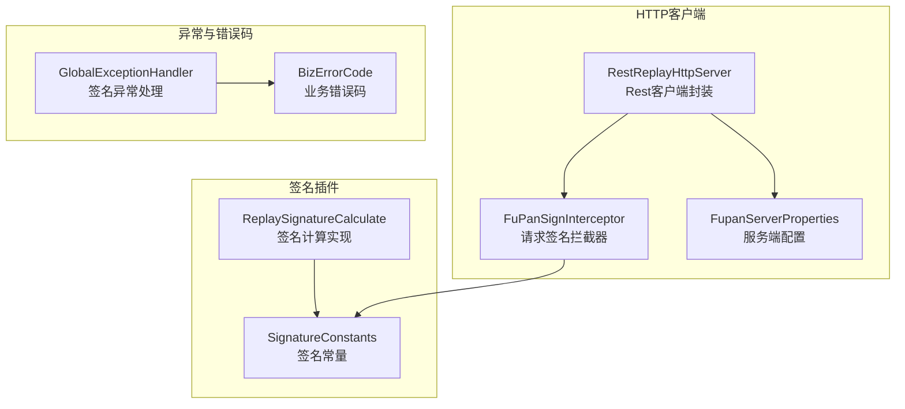
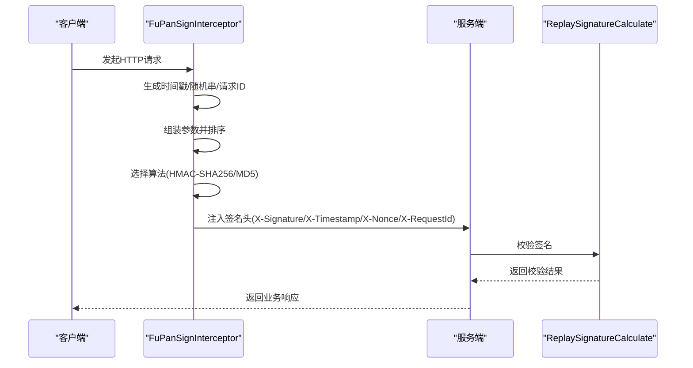
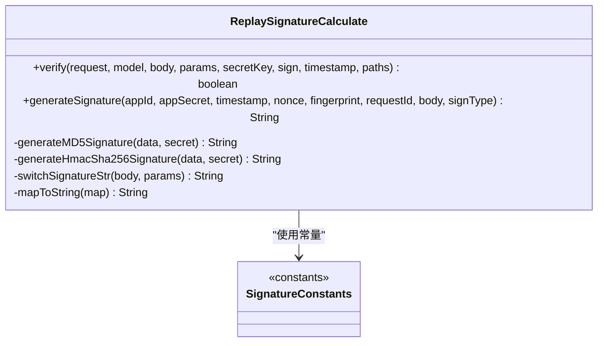
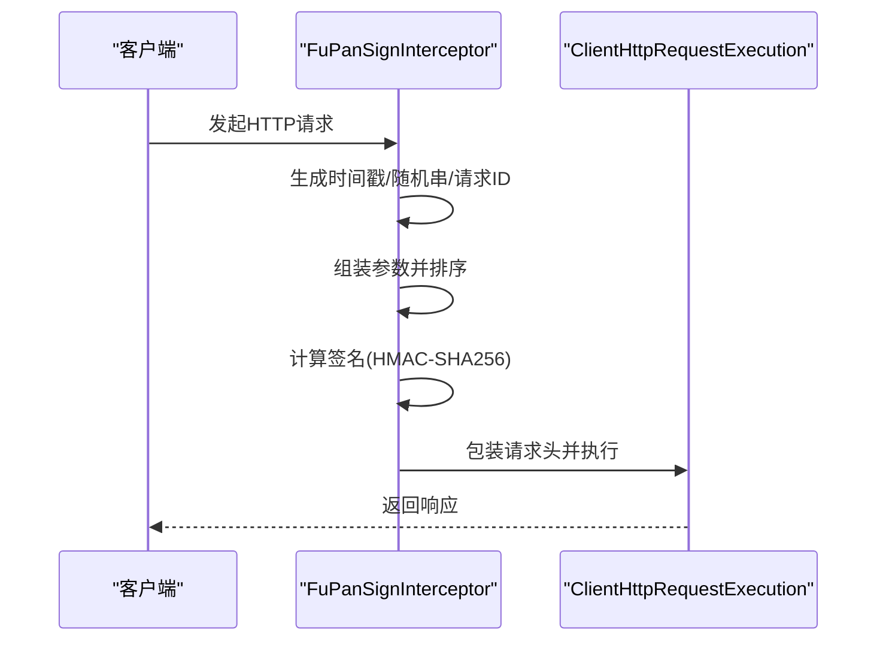
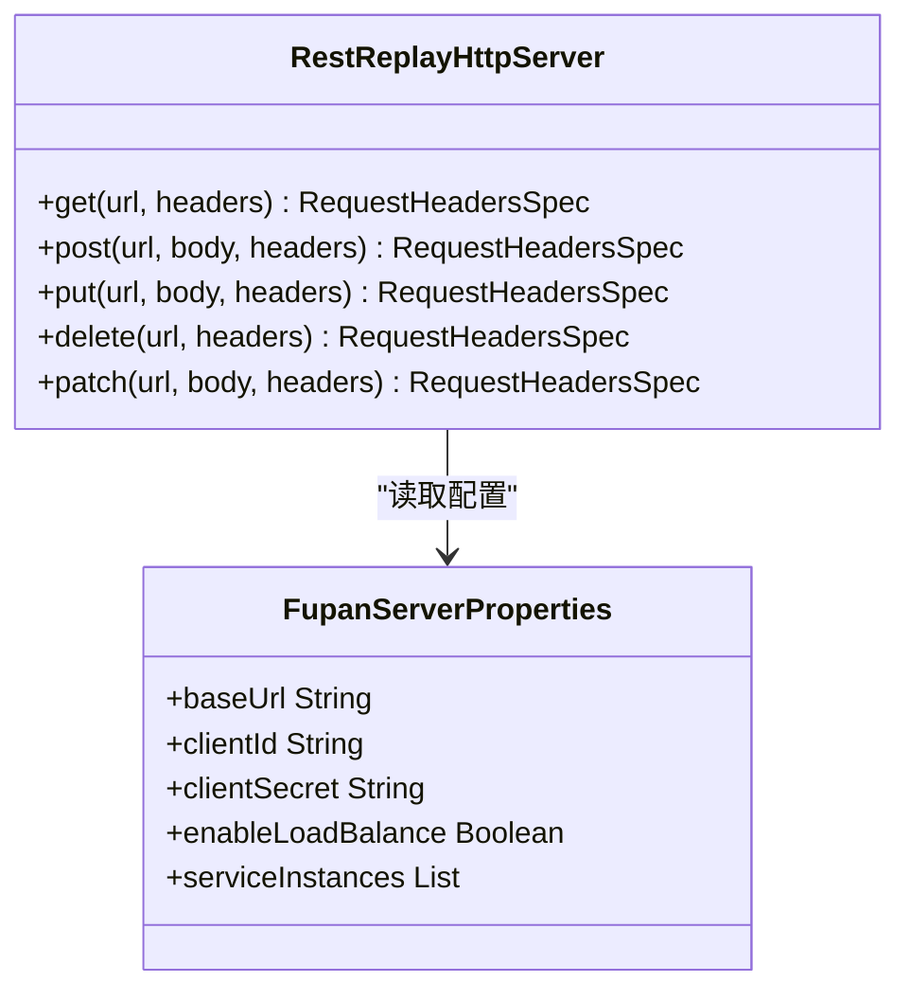
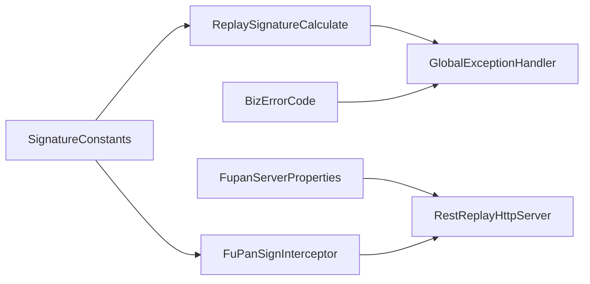

# 签名验证插件

<cite>
**本文引用的文件**
- [ReplaySignatureCalculate.java](file://src/main/java/com/jiuyu/governance/plugins/sign/ReplaySignatureCalculate.java)
- [SignatureConstants.java](file://src/main/java/com/jiuyu/governance/plugins/sign/SignatureConstants.java)
- [FuPanSignInterceptor.java](file://src/main/java/com/jiuyu/governance/plugins/http/FuPanSignInterceptor.java)
- [RestReplayHttpServer.java](file://src/main/java/com/jiuyu/governance/common/replay/RestReplayHttpServer.java)
- [FupanServerProperties.java](file://src/main/java/com/jiuyu/governance/common/replay/FupanServerProperties.java)
- [ReplayHttpServer.java](file://src/main/java/com/jiuyu/governance/common/replay/ReplayHttpServer.java)
- [GlobalExceptionHandler.java](file://src/main/java/com/jiuyu/governance/plugins/webmvc/GlobalExceptionHandler.java)
- [BizErrorCode.java](file://src/main/java/com/jiuyu/governance/common/pojo/BizErrorCode.java)
- [application.yml](file://src/main/resources/application.yml)
- [application-dev.yml](file://src/main/resources/application-dev.yml)
- [application-local.yml](file://src/main/resources/application-local.yml)
</cite>

## 目录
1. [简介](#简介)
2. [项目结构](#项目结构)
3. [核心组件](#核心组件)
4. [架构总览](#架构总览)
5. [详细组件分析](#详细组件分析)
6. [依赖关系分析](#依赖关系分析)
7. [性能考量](#性能考量)
8. [故障排查指南](#故障排查指南)
9. [结论](#结论)
10. [附录](#附录)

## 简介
本文件面向“签名验证插件”的技术文档，聚焦于API安全验证机制，涵盖以下关键点：
- ReplaySignatureCalculate签名计算算法的实现原理与流程
- SignatureConstants签名常量定义与用途
- 签名生成规则、时间戳验证机制与防重放策略
- 签名算法的参数配置、密钥管理与安全性考虑
- 完整的签名验证流程示例（请求签名生成、响应签名验证、异常处理）
- 插件在API安全防护中的作用及与其它安全组件的协作方式
- 调试工具与常见问题的解决方案

## 项目结构
围绕签名验证插件的相关模块分布如下：
- 插件签名计算与常量：plugins/sign
- HTTP客户端签名拦截器：plugins/http
- 内部HTTP服务封装：common/replay
- 全局异常处理：plugins/webmvc
- 业务错误码：common/pojo
- 应用配置：resources/application*.yml

图表来源
- [ReplaySignatureCalculate.java:1-199](file://src/main/java/com/jiuyu/governance/plugins/sign/ReplaySignatureCalculate.java#L1-L199)
- [SignatureConstants.java:1-81](file://src/main/java/com/jiuyu/governance/plugins/sign/SignatureConstants.java#L1-L81)
- [FuPanSignInterceptor.java:1-111](file://src/main/java/com/jiuyu/governance/plugins/http/FuPanSignInterceptor.java#L1-L111)
- [RestReplayHttpServer.java:1-118](file://src/main/java/com/jiuyu/governance/common/replay/RestReplayHttpServer.java#L1-L118)
- [FupanServerProperties.java:1-48](file://src/main/java/com/jiuyu/governance/common/replay/FupanServerProperties.java#L1-L48)
- [GlobalExceptionHandler.java:350-361](file://src/main/java/com/jiuyu/governance/plugins/webmvc/GlobalExceptionHandler.java#L350-L361)
- [BizErrorCode.java:1-55](file://src/main/java/com/jiuyu/governance/common/pojo/BizErrorCode.java#L1-L55)

章节来源
- [ReplaySignatureCalculate.java:1-199](file://src/main/java/com/jiuyu/governance/plugins/sign/ReplaySignatureCalculate.java#L1-L199)
- [SignatureConstants.java:1-81](file://src/main/java/com/jiuyu/governance/plugins/sign/SignatureConstants.java#L1-L81)
- [FuPanSignInterceptor.java:1-111](file://src/main/java/com/jiuyu/governance/plugins/http/FuPanSignInterceptor.java#L1-L111)
- [RestReplayHttpServer.java:1-118](file://src/main/java/com/jiuyu/governance/common/replay/RestReplayHttpServer.java#L1-L118)
- [FupanServerProperties.java:1-48](file://src/main/java/com/jiuyu/governance/common/replay/FupanServerProperties.java#L1-L48)
- [GlobalExceptionHandler.java:350-361](file://src/main/java/com/jiuyu/governance/plugins/webmvc/GlobalExceptionHandler.java#L350-L361)
- [BizErrorCode.java:1-55](file://src/main/java/com/jiuyu/governance/common/pojo/BizErrorCode.java#L1-L55)

## 核心组件
- 签名常量定义：统一管理请求头字段、算法名称、签名方式与默认值，确保客户端与服务端一致。
- 签名计算实现：负责生成与验证签名，支持HMAC-SHA256与MD5两种算法，默认采用HMAC-SHA256。
- HTTP签名拦截器：在发起HTTP请求前自动注入签名、时间戳、随机串等必要头部，并按规范排序与编码。
- 内部HTTP服务封装：基于RestClient封装GET/POST/PUT/DELETE/PATCH请求，内置签名拦截器与可选负载均衡拦截器。
- 全局异常处理：捕获签名异常并返回标准化错误响应。

章节来源
- [SignatureConstants.java:1-81](file://src/main/java/com/jiuyu/governance/plugins/sign/SignatureConstants.java#L1-L81)
- [ReplaySignatureCalculate.java:33-163](file://src/main/java/com/jiuyu/governance/plugins/sign/ReplaySignatureCalculate.java#L33-L163)
- [FuPanSignInterceptor.java:33-111](file://src/main/java/com/jiuyu/governance/plugins/http/FuPanSignInterceptor.java#L33-L111)
- [RestReplayHttpServer.java:21-118](file://src/main/java/com/jiuyu/governance/common/replay/RestReplayHttpServer.java#L21-L118)
- [GlobalExceptionHandler.java:350-361](file://src/main/java/com/jiuyu/governance/plugins/webmvc/GlobalExceptionHandler.java#L350-L361)

## 架构总览
签名验证插件贯穿“客户端请求签名生成”与“服务端请求签名验证”两条主线，形成闭环的安全通道。

图表来源
- [FuPanSignInterceptor.java:58-86](file://src/main/java/com/jiuyu/governance/plugins/http/FuPanSignInterceptor.java#L58-L86)
- [ReplaySignatureCalculate.java:49-59](file://src/main/java/com/jiuyu/governance/plugins/sign/ReplaySignatureCalculate.java#L49-L59)

## 详细组件分析

### 组件A：ReplaySignatureCalculate（签名计算与验证）
- 职责
  - 生成签名：根据appId、timestamp、nonce、requestId、fingerprint、body与签名模型，按ASCII排序拼接后进行HMAC-SHA256或MD5计算，并对HMAC结果进行Base64编码。
  - 验证签名：从请求头读取必要字段，构造待签字符串，与客户端传入的签名进行比较。
- 关键点
  - 默认签名算法为HMAC-SHA256；当签名模型为MD5时，采用“密钥拼接+MD5”的方式。
  - 参数按TreeMap排序，保证签名一致性。
  - 当缺少密钥或签名计算异常时，返回空或记录日志并返回null。
- 复杂度
  - 时间复杂度：O(n)（n为参数数量），主要由字符串拼接与哈希计算决定。
  - 空间复杂度：O(n)（参数集合与待签字符串）。

图表来源
- [ReplaySignatureCalculate.java:30-199](file://src/main/java/com/jiuyu/governance/plugins/sign/ReplaySignatureCalculate.java#L30-L199)
- [SignatureConstants.java:9-81](file://src/main/java/com/jiuyu/governance/plugins/sign/SignatureConstants.java#L9-L81)

章节来源
- [ReplaySignatureCalculate.java:33-163](file://src/main/java/com/jiuyu/governance/plugins/sign/ReplaySignatureCalculate.java#L33-L163)
- [SignatureConstants.java:11-80](file://src/main/java/com/jiuyu/governance/plugins/sign/SignatureConstants.java#L11-L80)

### 组件B：SignatureConstants（签名常量）
- 请求头字段
  - X-App-Id、X-Timestamp、X-Nonce、X-Signature、X-Fingerprint、X-RequestId、X-Sign-Type、token
- 算法与签名方式
  - HmacSHA256、MD5
  - HMAC-SHA256、MD5（作为签名方式）
- 默认签名方式
  - HMAC-SHA256

章节来源
- [SignatureConstants.java:11-80](file://src/main/java/com/jiuyu/governance/plugins/sign/SignatureConstants.java#L11-L80)

### 组件C：FuPanSignInterceptor（HTTP请求签名拦截器）
- 职责
  - 在请求发送前自动生成签名、时间戳、随机串与请求ID，并注入到请求头。
  - 使用TreeMap对参数进行ASCII排序，再按“key=value”形式拼接，最后进行HMAC-SHA256签名并Base64编码。
- 行为特征
  - 自动注入X-Signature、X-Timestamp、X-Nonce、X-RequestId、X-Sign-Type等头部。
  - 若签名失败，抛出业务异常（BizErrorCode.GENERAL_FAILED）。

图表来源
- [FuPanSignInterceptor.java:58-107](file://src/main/java/com/jiuyu/governance/plugins/http/FuPanSignInterceptor.java#L58-L107)

章节来源
- [FuPanSignInterceptor.java:33-111](file://src/main/java/com/jiuyu/governance/plugins/http/FuPanSignInterceptor.java#L33-L111)

### 组件D：RestReplayHttpServer（内部HTTP服务封装）
- 职责
  - 基于RestClient封装常用HTTP方法（GET/POST/PUT/DELETE/PATCH），统一注入签名拦截器。
  - 支持可选的负载均衡拦截器，结合服务实例列表进行路由。
- 配置
  - 通过FupanServerProperties读取基础URL、clientId、clientSecret、enableLoadBalance与serviceInstances。

图表来源
- [RestReplayHttpServer.java:21-118](file://src/main/java/com/jiuyu/governance/common/replay/RestReplayHttpServer.java#L21-L118)
- [FupanServerProperties.java:20-48](file://src/main/java/com/jiuyu/governance/common/replay/FupanServerProperties.java#L20-L48)

章节来源
- [RestReplayHttpServer.java:21-118](file://src/main/java/com/jiuyu/governance/common/replay/RestReplayHttpServer.java#L21-L118)
- [FupanServerProperties.java:20-48](file://src/main/java/com/jiuyu/governance/common/replay/FupanServerProperties.java#L20-L48)

### 组件E：全局异常处理与错误码
- 全局异常处理
  - 捕获SignatureException并返回SystemErrorCode.FORBIDDEN对应的错误码与消息。
- 业务错误码
  - BizErrorCode.GENERAL_FAILED用于签名失败场景（如签名拦截器内部异常）。

章节来源
- [GlobalExceptionHandler.java:350-361](file://src/main/java/com/jiuyu/governance/plugins/webmvc/GlobalExceptionHandler.java#L350-L361)
- [BizErrorCode.java:33](file://src/main/java/com/jiuyu/governance/common/pojo/BizErrorCode.java#L33)

## 依赖关系分析
- 组件耦合
  - ReplaySignatureCalculate依赖SignatureConstants提供的头部字段与算法常量。
  - FuPanSignInterceptor依赖SignatureConstants与签名模型（HMAC-SHA256）。
  - RestReplayHttpServer依赖FuPanSignInterceptor与FupanServerProperties。
  - 全局异常处理器依赖BizErrorCode与SystemErrorCode。
- 外部依赖
  - Spring WebClient/RestClient、HMAC/MD5算法、Base64编解码、TreeMap排序。

图表来源
- [SignatureConstants.java:9-81](file://src/main/java/com/jiuyu/governance/plugins/sign/SignatureConstants.java#L9-L81)
- [ReplaySignatureCalculate.java:30-199](file://src/main/java/com/jiuyu/governance/plugins/sign/ReplaySignatureCalculate.java#L30-L199)
- [FuPanSignInterceptor.java:33-111](file://src/main/java/com/jiuyu/governance/plugins/http/FuPanSignInterceptor.java#L33-L111)
- [RestReplayHttpServer.java:21-118](file://src/main/java/com/jiuyu/governance/common/replay/RestReplayHttpServer.java#L21-L118)
- [FupanServerProperties.java:20-48](file://src/main/java/com/jiuyu/governance/common/replay/FupanServerProperties.java#L20-L48)
- [GlobalExceptionHandler.java:350-361](file://src/main/java/com/jiuyu/governance/plugins/webmvc/GlobalExceptionHandler.java#L350-L361)
- [BizErrorCode.java:18-55](file://src/main/java/com/jiuyu/governance/common/pojo/BizErrorCode.java#L18-L55)

## 性能考量
- 签名计算
  - HMAC-SHA256相比MD5更安全，但CPU开销更高；在高并发场景建议优先使用HMAC-SHA256并优化密钥缓存。
- 参数排序
  - TreeMap保证排序稳定性，避免重复计算差异；注意参数数量较多时的拼接成本。
- 编解码
  - Base64编码与UTF-8字节转换为常数级开销；建议在批量请求中复用编码器实例。
- 网络与序列化
  - RestReplayHttpServer封装了HTTP请求，建议开启连接池与合理的超时设置以提升吞吐。

## 故障排查指南
- 常见问题与定位
  - 缺少请求头：若X-App-Id、X-Timestamp、X-Nonce、X-RequestId、X-Signature缺失，验证将失败。
  - 签名不一致：检查客户端与服务端是否使用相同的参数排序与算法；确认body是否正确传递。
  - 密钥错误：确认clientSecret是否正确配置，且与服务端存储的应用密钥一致。
  - 时间戳偏差：若服务端对时间戳有限制（例如允许误差范围），需调整客户端时间同步策略。
  - 负载均衡：启用负载均衡时，确保服务实例列表与权重配置正确。
- 日志与异常
  - 全局异常处理器会捕获签名异常并返回标准化错误；可在日志中查看具体异常原因。
- 调试建议
  - 使用HTTP抓包工具对比请求头与签名值，核对排序与编码过程。
  - 在本地/开发环境使用application-local.yml或application-dev.yml进行最小化配置验证。

章节来源
- [GlobalExceptionHandler.java:350-361](file://src/main/java/com/jiuyu/governance/plugins/webmvc/GlobalExceptionHandler.java#L350-L361)
- [application.yml:1](file://src/main/resources/application.yml#L1)
- [application-dev.yml:1](file://src/main/resources/application-dev.yml#L1)
- [application-local.yml:1](file://src/main/resources/application-local.yml#L1)

## 结论
签名验证插件通过“客户端自动签名+服务端严格校验”的双端协同，有效提升了API接口的安全性与可信度。ReplaySignatureCalculate提供了灵活的签名生成与验证能力，配合FuPanSignInterceptor与RestReplayHttpServer，实现了从请求到响应的全链路安全控制。建议在生产环境中优先采用HMAC-SHA256算法、严格管理密钥与时间戳策略，并结合全局异常处理与日志监控，持续优化性能与稳定性。

## 附录

### 签名验证流程示例（请求签名生成）
- 步骤
  - 生成请求ID（UUID）、时间戳（毫秒）、随机串（UUID）。
  - 组装参数：X-App-Id、X-Timestamp、X-Nonce、X-RequestId、可选X-Fingerprint、可选body。
  - 参数按ASCII升序排序并拼接为“key=value”形式，中间以“&”连接。
  - 使用HMAC-SHA256对拼接后的字符串进行签名，并进行Base64编码。
  - 将签名值写入X-Signature，同时写入X-Sign-Type为“HMAC-SHA256”。

章节来源
- [FuPanSignInterceptor.java:58-107](file://src/main/java/com/jiuyu/governance/plugins/http/FuPanSignInterceptor.java#L58-L107)
- [SignatureConstants.java:11-80](file://src/main/java/com/jiuyu/governance/plugins/sign/SignatureConstants.java#L11-L80)

### 签名验证流程示例（响应签名验证）
- 步骤
  - 从请求头读取X-App-Id、X-Timestamp、X-Nonce、X-RequestId、X-Signature、可选X-Fingerprint。
  - 根据请求体或查询参数构造“body”字段（JSON体保持原始，非JSON按“k=v&...”拼接）。
  - 按ASCII升序组装待签字符串并进行HMAC-SHA256签名（或MD5）。
  - 将计算得到的签名与X-Signature比较，一致则通过，否则拒绝。

章节来源
- [ReplaySignatureCalculate.java:49-59](file://src/main/java/com/jiuyu/governance/plugins/sign/ReplaySignatureCalculate.java#L49-L59)
- [ReplaySignatureCalculate.java:107-163](file://src/main/java/com/jiuyu/governance/plugins/sign/ReplaySignatureCalculate.java#L107-L163)

### 防重放攻击策略
- 时间戳校验：服务端可设定时间窗口（例如±5分钟），超出范围的请求直接拒绝。
- 随机串与请求ID：每次请求生成唯一随机串与请求ID，结合去重缓存可抵御重放。
- 设备指纹：可选的X-Fingerprint用于识别设备特征，增强风控能力。
- 密钥管理：仅服务端持有应用密钥，客户端仅持有clientSecret，避免密钥泄露导致的伪造风险。

章节来源
- [SignatureConstants.java:11-80](file://src/main/java/com/jiuyu/governance/plugins/sign/SignatureConstants.java#L11-L80)
- [ReplaySignatureCalculate.java:107-163](file://src/main/java/com/jiuyu/governance/plugins/sign/ReplaySignatureCalculate.java#L107-L163)

### 参数配置与密钥管理
- 配置项
  - jiuyu.fupan-server.base-url：服务基础URL
  - jiuyu.fupan-server.client-id：客户端ID
  - jiuyu.fupan-server.client-secret：客户端密钥
  - jiuyu.fupan-server.enable-load-balance：是否启用负载均衡
  - jiuyu.fupan-server.service-instances：服务实例列表
- 密钥管理
  - 建议使用环境变量或密钥管理服务存储clientSecret，避免明文写入配置文件。
  - 定期轮换密钥并下发新版本，旧密钥在切换期内保留以兼容过渡。

章节来源
- [FupanServerProperties.java:20-48](file://src/main/java/com/jiuyu/governance/common/replay/FupanServerProperties.java#L20-L48)
- [application.yml:1](file://src/main/resources/application.yml#L1)
- [application-dev.yml:1](file://src/main/resources/application-dev.yml#L1)
- [application-local.yml:1](file://src/main/resources/application-local.yml#L1)