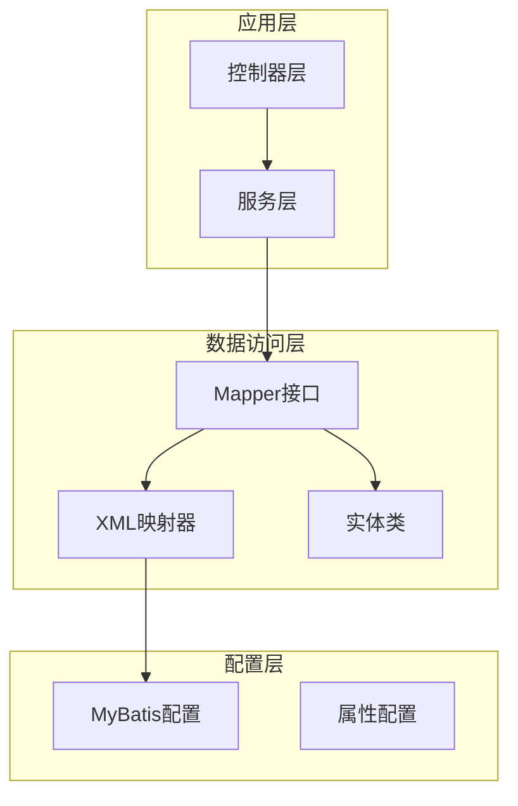
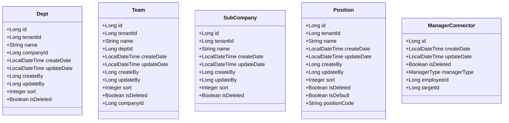
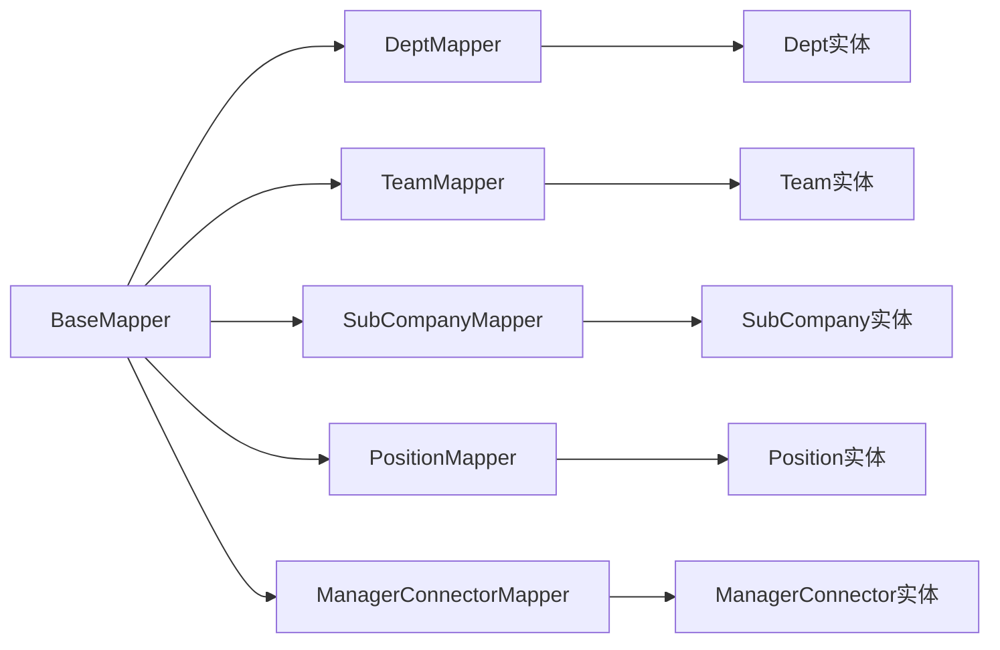
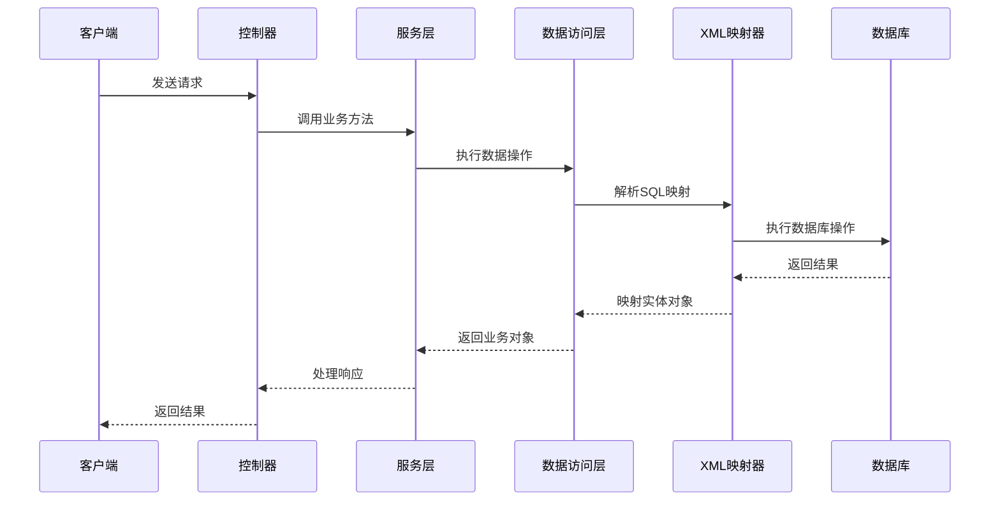
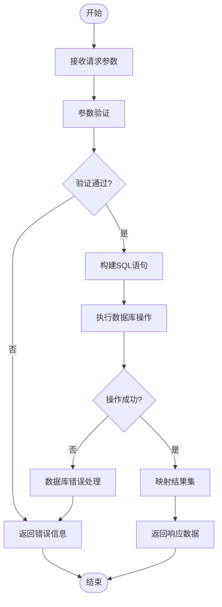
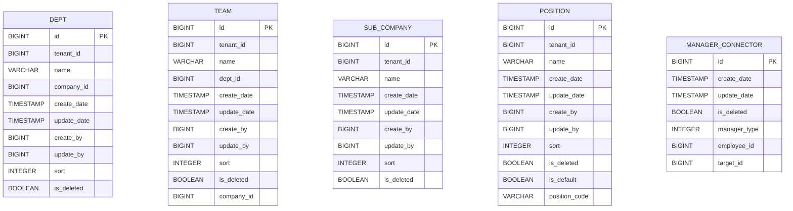
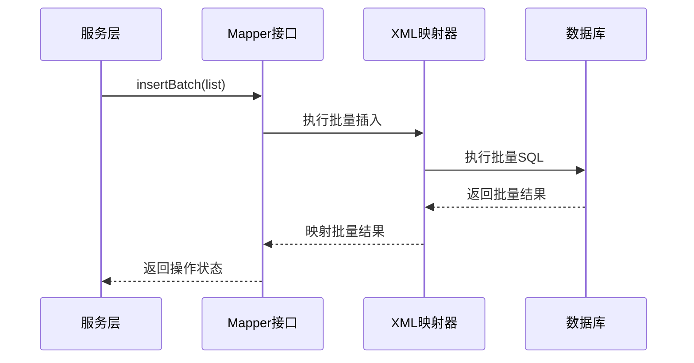
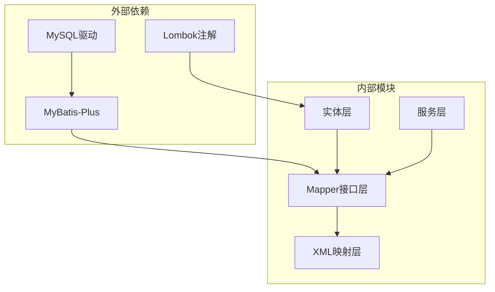

# XML映射器增强

<cite>
**本文档引用的文件**
- [DeptMapper.xml](file://src/main/resources/mapper/org/DeptMapper.xml)
- [TeamMapper.xml](file://src/main/resources/mapper/org/TeamMapper.xml)
- [SubCompanyMapper.xml](file://src/main/resources/mapper/org/SubCompanyMapper.xml)
- [PositionMapper.xml](file://src/main/resources/mapper/org/PositionMapper.xml)
- [ManagerConnectorMapper.xml](file://src/main/resources/mapper/org/ManagerConnectorMapper.xml)
- [Dept.java](file://src/main/java/com/jiuyu/governance/business/org/pojo/entity/Dept.java)
- [Team.java](file://src/main/java/com/jiuyu/governance/business/org/pojo/entity/Team.java)
- [SubCompany.java](file://src/main/java/com/jiuyu/governance/business/org/pojo/entity/SubCompany.java)
- [Position.java](file://src/main/java/com/jiuyu/governance/business/org/pojo/entity/Position.java)
- [ManagerConnector.java](file://src/main/java/com/jiuyu/governance/business/org/pojo/entity/ManagerConnector.java)
- [DeptMapper.java](file://src/main/java/com/jiuyu/governance/business/org/mapper/DeptMapper.java)
- [TeamMapper.java](file://src/main/java/com/jiuyu/governance/business/org/mapper/TeamMapper.java)
- [SubCompanyMapper.java](file://src/main/java/com/jiuyu/governance/business/org/mapper/SubCompanyMapper.java)
- [PositionMapper.java](file://src/main/java/com/jiuyu/governance/business/org/mapper/PositionMapper.java)
- [ManagerConnectorMapper.java](file://src/main/java/com/jiuyu/governance/business/org/mapper/ManagerConnectorMapper.java)
</cite>

## 目录
1. [项目概述](#项目概述)
2. [项目结构](#项目结构)
3. [核心组件](#核心组件)
4. [架构概览](#架构概览)
5. [详细组件分析](#详细组件分析)
6. [依赖关系分析](#依赖关系分析)
7. [性能考虑](#性能考虑)
8. [故障排除指南](#故障排除指南)
9. [结论](#结论)

## 项目概述

本项目是一个基于MyBatis的XML映射器增强项目，专注于组织架构相关的数据访问层优化。项目采用分层架构设计，包含部门、小组、子公司、岗位和管理员连接等核心业务实体的数据持久化功能。

项目的核心特色包括：
- 完整的XML映射器配置
- 标准化的MyBatis命名空间规范
- 批量操作支持（特别是管理员连接器的批量插入）
- 统一的实体字段映射策略
- 完善的数据库列定义和结果映射

## 项目结构

项目采用标准的Maven多模块结构，主要分为以下层次：

**图表来源**
- [DeptMapper.xml:1-24](file://src/main/resources/mapper/org/DeptMapper.xml#L1-L24)
- [DeptMapper.java:1-16](file://src/main/java/com/jiuyu/governance/business/org/mapper/DeptMapper.java#L1-L16)

**章节来源**
- [DeptMapper.xml:1-24](file://src/main/resources/mapper/org/DeptMapper.xml#L1-L24)
- [TeamMapper.xml:1-25](file://src/main/resources/mapper/org/TeamMapper.xml#L1-L25)
- [SubCompanyMapper.xml:1-22](file://src/main/resources/mapper/org/SubCompanyMapper.xml#L1-L22)
- [PositionMapper.xml:1-25](file://src/main/resources/mapper/org/PositionMapper.xml#L1-L25)
- [ManagerConnectorMapper.xml:1-27](file://src/main/resources/mapper/org/ManagerConnectorMapper.xml#L1-L27)

## 核心组件

### 实体模型设计

项目包含五个核心业务实体，每个实体都采用了统一的设计模式：

**图表来源**
- [Dept.java:1-92](file://src/main/java/com/jiuyu/governance/business/org/pojo/entity/Dept.java#L1-L92)
- [Team.java:1-100](file://src/main/java/com/jiuyu/governance/business/org/pojo/entity/Team.java#L1-L100)
- [SubCompany.java:1-85](file://src/main/java/com/jiuyu/governance/business/org/pojo/entity/SubCompany.java#L1-L85)
- [Position.java:1-99](file://src/main/java/com/jiuyu/governance/business/org/pojo/entity/Position.java#L1-L99)
- [ManagerConnector.java:1-69](file://src/main/java/com/jiuyu/governance/business/org/pojo/entity/ManagerConnector.java#L1-L69)

### Mapper接口体系

所有Mapper接口都继承自MyBatis-Plus的BaseMapper，提供标准的CRUD操作能力：

**图表来源**
- [DeptMapper.java:1-16](file://src/main/java/com/jiuyu/governance/business/org/mapper/DeptMapper.java#L1-L16)
- [TeamMapper.java:1-16](file://src/main/java/com/jiuyu/governance/business/org/mapper/TeamMapper.java#L1-L16)
- [SubCompanyMapper.java:1-18](file://src/main/java/com/jiuyu/governance/business/org/mapper/SubCompanyMapper.java#L1-L18)
- [PositionMapper.java:1-16](file://src/main/java/com/jiuyu/governance/business/org/mapper/PositionMapper.java#L1-L16)
- [ManagerConnectorMapper.java:1-25](file://src/main/java/com/jiuyu/governance/business/org/mapper/ManagerConnectorMapper.java#L1-L25)

**章节来源**
- [DeptMapper.java:1-16](file://src/main/java/com/jiuyu/governance/business/org/mapper/DeptMapper.java#L1-L16)
- [TeamMapper.java:1-16](file://src/main/java/com/jiuyu/governance/business/org/mapper/TeamMapper.java#L1-L16)
- [SubCompanyMapper.java:1-18](file://src/main/java/com/jiuyu/governance/business/org/mapper/SubCompanyMapper.java#L1-L18)
- [PositionMapper.java:1-16](file://src/main/java/com/jiuyu/governance/business/org/mapper/PositionMapper.java#L1-L16)
- [ManagerConnectorMapper.java:1-25](file://src/main/java/com/jiuyu/governance/business/org/mapper/ManagerConnectorMapper.java#L1-L25)

## 架构概览

项目采用经典的三层架构模式，结合MyBatis-Plus实现数据持久化：

**图表来源**
- [DeptMapper.xml:3-17](file://src/main/resources/mapper/org/DeptMapper.xml#L3-L17)
- [DeptMapper.java:14-15](file://src/main/java/com/jiuyu/governance/business/org/mapper/DeptMapper.java#L14-L15)

### 数据流处理

**图表来源**
- [ManagerConnectorMapper.xml:20-25](file://src/main/resources/mapper/org/ManagerConnectorMapper.xml#L20-L25)
- [ManagerConnectorMapper.java:18-23](file://src/main/java/com/jiuyu/governance/business/org/mapper/ManagerConnectorMapper.java#L18-L23)

## 详细组件分析

### 部门管理模块

部门模块是最复杂的实体之一，包含完整的组织架构信息：

#### 数据模型设计

**图表来源**
- [DeptMapper.xml:4-17](file://src/main/resources/mapper/org/DeptMapper.xml#L4-L17)
- [TeamMapper.xml:4-18](file://src/main/resources/mapper/org/TeamMapper.xml#L4-L18)
- [SubCompanyMapper.xml:4-16](file://src/main/resources/mapper/org/SubCompanyMapper.xml#L4-L16)
- [PositionMapper.xml:4-17](file://src/main/resources/mapper/org/PositionMapper.xml#L4-L17)
- [ManagerConnectorMapper.xml:4-14](file://src/main/resources/mapper/org/ManagerConnectorMapper.xml#L4-L14)

#### XML映射器配置

部门映射器提供了完整的结果映射和列列表定义：

**章节来源**
- [DeptMapper.xml:1-24](file://src/main/resources/mapper/org/DeptMapper.xml#L1-L24)
- [Dept.java:1-92](file://src/main/java/com/jiuyu/governance/business/org/pojo/entity/Dept.java#L1-L92)

### 小组管理模块

小组作为部门的下级组织单元，具有更精细的管理粒度：

#### 关键特性

- 支持所属公司的关联管理
- 完整的审计字段跟踪
- 标准化的排序机制
- 软删除支持

**章节来源**
- [TeamMapper.xml:1-25](file://src/main/resources/mapper/org/TeamMapper.xml#L1-L25)
- [Team.java:1-100](file://src/main/java/com/jiuyu/governance/business/org/pojo/entity/Team.java#L1-L100)

### 子公司管理模块

子公司作为独立的法律实体，具有独特的管理需求：

#### 设计特点

- 独立的命名空间和映射配置
- 简化的字段结构
- 完整的审计跟踪
- 支持多租户隔离

**章节来源**
- [SubCompanyMapper.xml:1-22](file://src/main/resources/mapper/org/SubCompanyMapper.xml#L1-L22)
- [SubCompany.java:1-85](file://src/main/java/com/jiuyu/governance/business/org/pojo/entity/SubCompany.java#L1-L85)

### 岗位管理模块

岗位管理模块提供了灵活的职位管理体系：

#### 核心功能

- 支持默认岗位和普通岗位区分
- 岗位编码系统用于业务逻辑识别
- 完整的权限管理支持
- 多租户环境下的岗位隔离

**章节来源**
- [PositionMapper.xml:1-25](file://src/main/resources/mapper/org/PositionMapper.xml#L1-L25)
- [Position.java:1-99](file://src/main/java/com/jiuyu/governance/business/org/pojo/entity/Position.java#L1-L99)

### 管理员连接器模块

管理员连接器是项目中最特殊的模块，提供了批量操作能力：

#### 批量操作特性

**图表来源**
- [ManagerConnectorMapper.xml:20-25](file://src/main/resources/mapper/org/ManagerConnectorMapper.xml#L20-L25)
- [ManagerConnectorMapper.java:18-23](file://src/main/java/com/jiuyu/governance/business/org/mapper/ManagerConnectorMapper.java#L18-L23)

**章节来源**
- [ManagerConnectorMapper.xml:1-27](file://src/main/resources/mapper/org/ManagerConnectorMapper.xml#L1-L27)
- [ManagerConnector.java:1-69](file://src/main/java/com/jiuyu/governance/business/org/pojo/entity/ManagerConnector.java#L1-L69)

## 依赖关系分析

项目采用松耦合的设计原则，各组件之间的依赖关系清晰明确：

### 组件耦合度分析

| 组件 | 内聚性 | 耦合度 | 依赖关系 |
|------|--------|--------|----------|
| 实体类 | 高 | 低 | 仅依赖Lombok注解 |
| Mapper接口 | 高 | 中 | 依赖MyBatis-Plus基础功能 |
| XML映射器 | 高 | 低 | 依赖实体类定义 |
| 服务层 | 中 | 高 | 依赖多个Mapper |

**图表来源**
- [DeptMapper.java:3-5](file://src/main/java/com/jiuyu/governance/business/org/mapper/DeptMapper.java#L3-L5)
- [TeamMapper.java:3-5](file://src/main/java/com/jiuyu/governance/business/org/mapper/TeamMapper.java#L3-L5)
- [SubCompanyMapper.java:3-5](file://src/main/java/com/jiuyu/governance/business/org/mapper/SubCompanyMapper.java#L3-L5)
- [PositionMapper.java:3-5](file://src/main/java/com/jiuyu/governance/business/org/mapper/PositionMapper.java#L3-L5)
- [ManagerConnectorMapper.java:3-5](file://src/main/java/com/jiuyu/governance/business/org/mapper/ManagerConnectorMapper.java#L3-L5)

## 性能考虑

### 查询优化策略

1. **索引设计建议**
   - 在tenant_id字段上建立索引以支持多租户查询
   - 在company_id和dept_id字段上建立索引以支持层级查询
   - 在create_date和update_date字段上建立索引以支持时间范围查询

2. **批量操作优化**
   - 管理员连接器的批量插入使用MyBatis的foreach循环
   - 建议控制批量大小在100-1000条之间以平衡内存使用和网络开销

3. **缓存策略**
   - 对于静态数据（如岗位信息）可以考虑添加二级缓存
   - 对于频繁查询的组合数据可以考虑本地缓存

### 连接池配置

## 故障排除指南

### 常见问题及解决方案

#### 1. XML映射器加载失败

**症状**: 启动时出现XML映射器找不到的错误

**解决方案**:
- 检查XML文件的命名空间是否与Mapper接口完全匹配
- 确认XML文件路径符合MyBatis的扫描规则
- 验证XML文件的DOCTYPE声明正确性

#### 2. 字段映射不匹配

**症状**: 实体对象字段值为null或映射错误

**解决方案**:
- 检查XML中的column属性与数据库字段名是否一致
- 确认property属性与实体类字段名是否匹配
- 验证jdbcType设置是否正确

#### 3. 批量插入性能问题

**症状**: 大量数据插入时性能下降

**解决方案**:
- 调整batch大小参数
- 考虑使用JDBC批量更新
- 优化数据库连接池配置

**章节来源**
- [ManagerConnectorMapper.xml:20-25](file://src/main/resources/mapper/org/ManagerConnectorMapper.xml#L20-L25)

## 结论

本XML映射器增强项目展现了良好的架构设计和代码组织能力。通过标准化的实体设计、完善的XML映射配置和高效的批量操作支持，项目为组织架构管理提供了可靠的数据持久化解决方案。

### 主要优势

1. **标准化设计**: 统一的实体字段命名和映射策略
2. **扩展性强**: 基于MyBatis-Plus的灵活扩展能力
3. **性能优化**: 批量操作和合理的索引设计
4. **维护友好**: 清晰的代码结构和文档说明

### 改进建议

1. **监控集成**: 添加数据库操作的性能监控
2. **事务管理**: 完善分布式事务处理机制
3. **缓存策略**: 实施更细粒度的缓存管理
4. **测试覆盖**: 增加单元测试和集成测试覆盖率