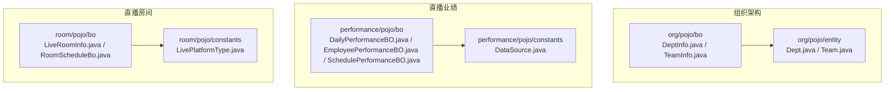
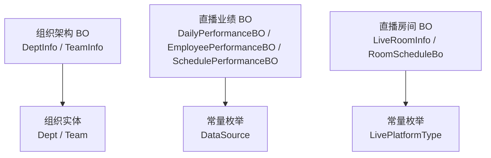
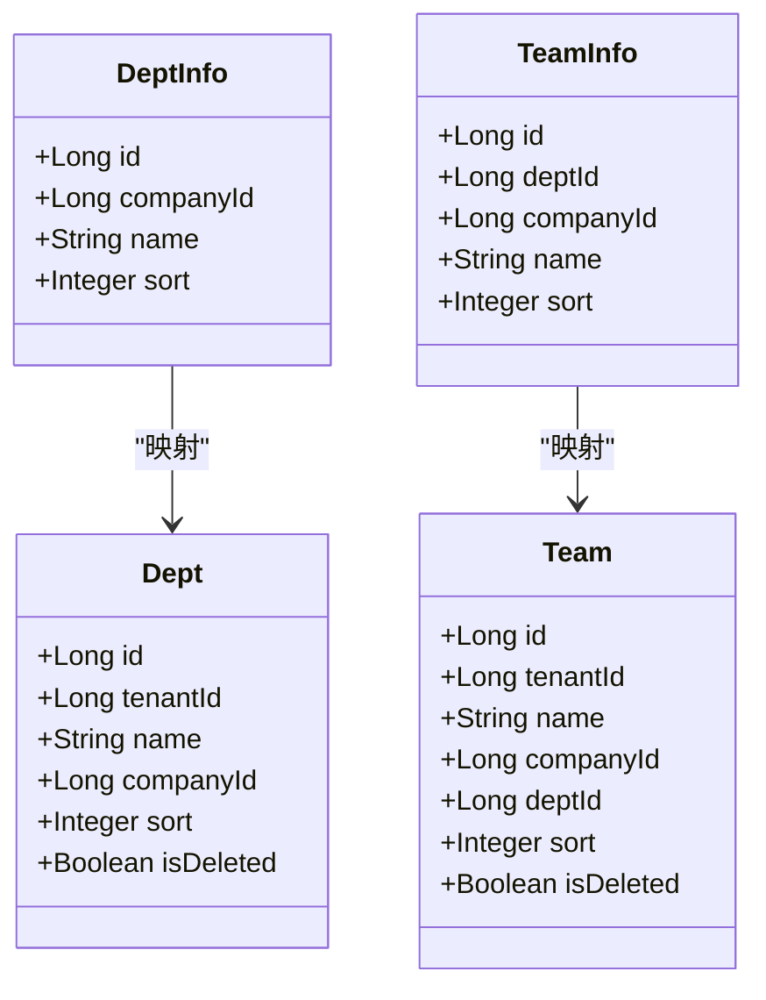
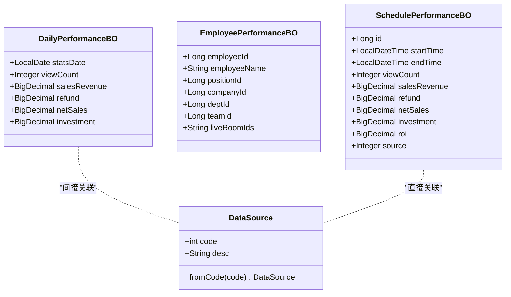
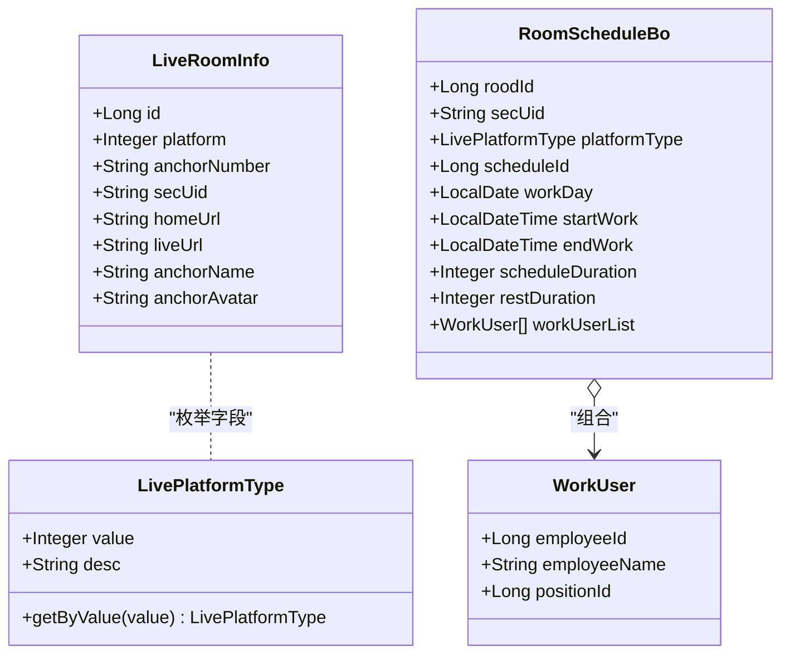
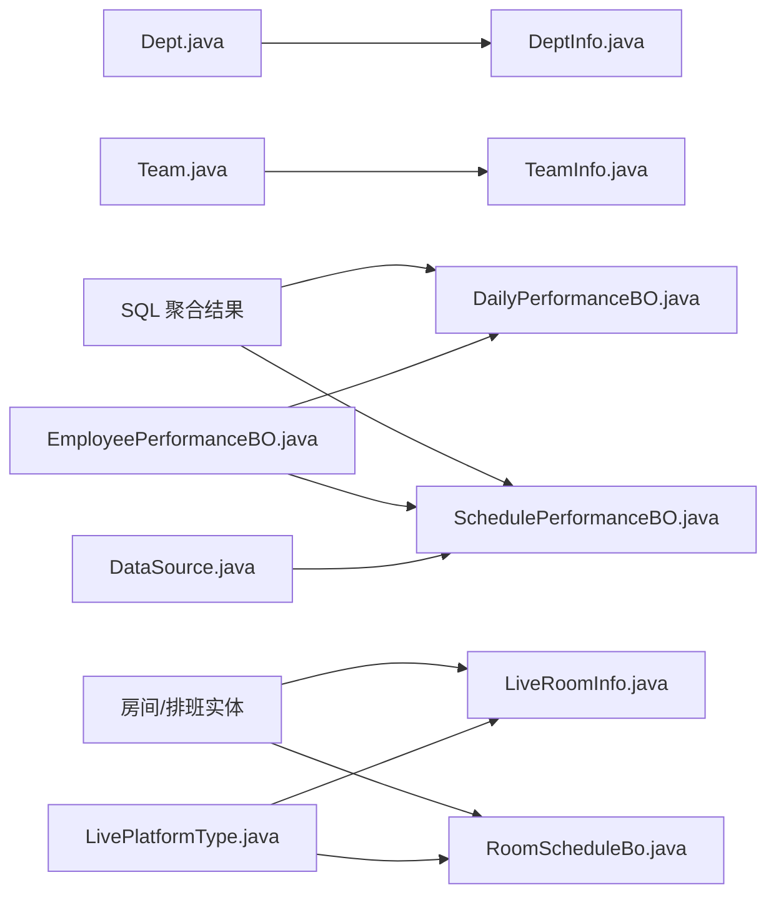

# 业务对象模型

<cite>
**本文引用的文件**
- [DeptInfo.java](file://src/main/java/com/jiuyu/governance/business/org/pojo/bo/DeptInfo.java)
- [TeamInfo.java](file://src/main/java/com/jiuyu/governance/business/org/pojo/bo/TeamInfo.java)
- [DailyPerformanceBO.java](file://src/main/java/com/jiuyu/governance/business/performance/pojo/bo/DailyPerformanceBO.java)
- [EmployeePerformanceBO.java](file://src/main/java/com/jiuyu/governance/business/performance/pojo/bo/EmployeePerformanceBO.java)
- [SchedulePerformanceBO.java](file://src/main/java/com/jiuyu/governance/business/performance/pojo/bo/SchedulePerformanceBO.java)
- [LiveRoomInfo.java](file://src/main/java/com/jiuyu/governance/business/room/pojo/bo/LiveRoomInfo.java)
- [RoomScheduleBo.java](file://src/main/java/com/jiuyu/governance/business/room/pojo/bo/RoomScheduleBo.java)
- [Dept.java](file://src/main/java/com/jiuyu/governance/business/org/pojo/entity/Dept.java)
- [Team.java](file://src/main/java/com/jiuyu/governance/business/org/pojo/entity/Team.java)
- [DataSource.java](file://src/main/java/com/jiuyu/governance/business/performance/pojo/constants/DataSource.java)
- [LivePlatformType.java](file://src/main/java/com/jiuyu/governance/business/room/pojo/constants/LivePlatformType.java)
</cite>

## 目录
1. [引言](#引言)
2. [项目结构](#项目结构)
3. [核心组件](#核心组件)
4. [架构总览](#架构总览)
5. [详细组件分析](#详细组件分析)
6. [依赖分析](#依赖分析)
7. [性能考虑](#性能考虑)
8. [故障排查指南](#故障排查指南)
9. [结论](#结论)
10. [附录](#附录)

## 引言
本文件面向业务开发者，系统化梳理 fupan-governance-server 的业务对象模型（BO），重点覆盖以下领域：
- 组织架构 BO：DeptInfo、TeamInfo
- 直播业绩 BO：DailyPerformanceBO、EmployeePerformanceBO、SchedulePerformanceBO
- 直播房间 BO：LiveRoomInfo、RoomScheduleBo

文档阐述 BO 在业务层的作用、数据流转方式，并明确 BO 与 Entity 实体的区别与转换关系；同时给出使用场景与最佳实践，帮助开发者高效、正确地使用业务对象。

## 项目结构
业务对象主要位于以下包中：
- 组织架构 BO：business/org/pojo/bo
- 直播业绩 BO：business/performance/pojo/bo
- 直播房间 BO：business/room/pojo/bo
- 对应的实体类位于 org/pojo/entity、performance/pojo/entity、room/pojo/entity
- 业务常量枚举位于 performance/pojo/constants、room/pojo/constants

图表来源
- [DeptInfo.java:1-38](file://src/main/java/com/jiuyu/governance/business/org/pojo/bo/DeptInfo.java#L1-L38)
- [TeamInfo.java:1-42](file://src/main/java/com/jiuyu/governance/business/org/pojo/bo/TeamInfo.java#L1-L42)
- [DailyPerformanceBO.java:1-56](file://src/main/java/com/jiuyu/governance/business/performance/pojo/bo/DailyPerformanceBO.java#L1-L56)
- [EmployeePerformanceBO.java:1-49](file://src/main/java/com/jiuyu/governance/business/performance/pojo/bo/EmployeePerformanceBO.java#L1-L49)
- [SchedulePerformanceBO.java:1-69](file://src/main/java/com/jiuyu/governance/business/performance/pojo/bo/SchedulePerformanceBO.java#L1-L69)
- [LiveRoomInfo.java:1-60](file://src/main/java/com/jiuyu/governance/business/room/pojo/bo/LiveRoomInfo.java#L1-L60)
- [RoomScheduleBo.java:1-103](file://src/main/java/com/jiuyu/governance/business/room/pojo/bo/RoomScheduleBo.java#L1-L103)
- [Dept.java:1-92](file://src/main/java/com/jiuyu/governance/business/org/pojo/entity/Dept.java#L1-L92)
- [Team.java:1-100](file://src/main/java/com/jiuyu/governance/business/org/pojo/entity/Team.java#L1-L100)
- [DataSource.java:1-31](file://src/main/java/com/jiuyu/governance/business/performance/pojo/constants/DataSource.java#L1-L31)
- [LivePlatformType.java:1-46](file://src/main/java/com/jiuyu/governance/business/room/pojo/constants/LivePlatformType.java#L1-L46)

章节来源
- [DeptInfo.java:1-38](file://src/main/java/com/jiuyu/governance/business/org/pojo/bo/DeptInfo.java#L1-L38)
- [TeamInfo.java:1-42](file://src/main/java/com/jiuyu/governance/business/org/pojo/bo/TeamInfo.java#L1-L42)
- [DailyPerformanceBO.java:1-56](file://src/main/java/com/jiuyu/governance/business/performance/pojo/bo/DailyPerformanceBO.java#L1-L56)
- [EmployeePerformanceBO.java:1-49](file://src/main/java/com/jiuyu/governance/business/performance/pojo/bo/EmployeePerformanceBO.java#L1-L49)
- [SchedulePerformanceBO.java:1-69](file://src/main/java/com/jiuyu/governance/business/performance/pojo/bo/SchedulePerformanceBO.java#L1-L69)
- [LiveRoomInfo.java:1-60](file://src/main/java/com/jiuyu/governance/business/room/pojo/bo/LiveRoomInfo.java#L1-L60)
- [RoomScheduleBo.java:1-103](file://src/main/java/com/jiuyu/governance/business/room/pojo/bo/RoomScheduleBo.java#L1-L103)
- [Dept.java:1-92](file://src/main/java/com/jiuyu/governance/business/org/pojo/entity/Dept.java#L1-L92)
- [Team.java:1-100](file://src/main/java/com/jiuyu/governance/business/org/pojo/entity/Team.java#L1-L100)
- [DataSource.java:1-31](file://src/main/java/com/jiuyu/governance/business/performance/pojo/constants/DataSource.java#L1-L31)
- [LivePlatformType.java:1-46](file://src/main/java/com/jiuyu/governance/business/room/pojo/constants/LivePlatformType.java#L1-L46)

## 核心组件
本节对各业务对象进行概览性说明，强调其职责与典型用途。

- 组织架构 BO
  - DeptInfo：封装部门维度的基础信息，包含公司归属、排序等字段，用于组织树构建与筛选。
  - TeamInfo：封装小组维度的基础信息，包含所属部门、公司、排序等字段，用于团队级统计与展示。

- 直播业绩 BO
  - DailyPerformanceBO：按自然日聚合的业绩指标容器，包含场观、销售额、退款、净销售额、投放等字段，常用于日报表与趋势分析。
  - EmployeePerformanceBO：员工维度的业绩统计载体，包含员工基本信息与直播间的关联信息，便于按人维度汇总与导出。
  - SchedulePerformanceBO：排班维度的业绩分页查询对象，包含开始/结束时间、场观、销售额、退款、净销售额、ROI、数据来源等字段，支撑排班报表与核对。

- 直播房间 BO
  - LiveRoomInfo：直播间基础信息载体，包含平台类型、主播账号、主页与直播链接、主播名称与头像等字段，用于房间侧展示与关联。
  - RoomScheduleBo：直播间排班计划对象，包含排班计划ID、班次归属日、工作时段、时长与休息时长、排班人员列表等，支撑排班管理与人员调度。

章节来源
- [DeptInfo.java:1-38](file://src/main/java/com/jiuyu/governance/business/org/pojo/bo/DeptInfo.java#L1-L38)
- [TeamInfo.java:1-42](file://src/main/java/com/jiuyu/governance/business/org/pojo/bo/TeamInfo.java#L1-L42)
- [DailyPerformanceBO.java:1-56](file://src/main/java/com/jiuyu/governance/business/performance/pojo/bo/DailyPerformanceBO.java#L1-L56)
- [EmployeePerformanceBO.java:1-49](file://src/main/java/com/jiuyu/governance/business/performance/pojo/bo/EmployeePerformanceBO.java#L1-L49)
- [SchedulePerformanceBO.java:1-69](file://src/main/java/com/jiuyu/governance/business/performance/pojo/bo/SchedulePerformanceBO.java#L1-L69)
- [LiveRoomInfo.java:1-60](file://src/main/java/com/jiuyu/governance/business/room/pojo/bo/LiveRoomInfo.java#L1-L60)
- [RoomScheduleBo.java:1-103](file://src/main/java/com/jiuyu/governance/business/room/pojo/bo/RoomScheduleBo.java#L1-L103)

## 架构总览
下图展示了 BO 在业务层的角色定位与与实体、常量之间的关系：

图表来源
- [DeptInfo.java:1-38](file://src/main/java/com/jiuyu/governance/business/org/pojo/bo/DeptInfo.java#L1-L38)
- [TeamInfo.java:1-42](file://src/main/java/com/jiuyu/governance/business/org/pojo/bo/TeamInfo.java#L1-L42)
- [DailyPerformanceBO.java:1-56](file://src/main/java/com/jiuyu/governance/business/performance/pojo/bo/DailyPerformanceBO.java#L1-L56)
- [EmployeePerformanceBO.java:1-49](file://src/main/java/com/jiuyu/governance/business/performance/pojo/bo/EmployeePerformanceBO.java#L1-L49)
- [SchedulePerformanceBO.java:1-69](file://src/main/java/com/jiuyu/governance/business/performance/pojo/bo/SchedulePerformanceBO.java#L1-L69)
- [LiveRoomInfo.java:1-60](file://src/main/java/com/jiuyu/governance/business/room/pojo/bo/LiveRoomInfo.java#L1-L60)
- [RoomScheduleBo.java:1-103](file://src/main/java/com/jiuyu/governance/business/room/pojo/bo/RoomScheduleBo.java#L1-L103)
- [Dept.java:1-92](file://src/main/java/com/jiuyu/governance/business/org/pojo/entity/Dept.java#L1-L92)
- [Team.java:1-100](file://src/main/java/com/jiuyu/governance/business/org/pojo/entity/Team.java#L1-L100)
- [DataSource.java:1-31](file://src/main/java/com/jiuyu/governance/business/performance/pojo/constants/DataSource.java#L1-L31)
- [LivePlatformType.java:1-46](file://src/main/java/com/jiuyu/governance/business/room/pojo/constants/LivePlatformType.java#L1-L46)

## 详细组件分析

### 组织架构 BO：DeptInfo 与 TeamInfo
- 设计要点
  - 聚焦“展示/筛选”场景，字段精简，便于跨模块复用。
  - 包含公司/部门/小组层级关系的关键字段，支持上层构建组织树与过滤。
- 数据流转
  - 服务层从实体层读取 Dept/Team，映射为 DeptInfo/TeamInfo，供控制器与前端使用。
- 使用场景
  - 组织树渲染、部门/小组选择器、按组织维度的业绩统计。
- 最佳实践
  - 仅暴露必要字段，避免将实体的全部字段透传到 BO 层。
  - 若需多语言或显示名，请在 BO 层增加本地化字段或通过字典映射。

图表来源
- [DeptInfo.java:1-38](file://src/main/java/com/jiuyu/governance/business/org/pojo/bo/DeptInfo.java#L1-L38)
- [TeamInfo.java:1-42](file://src/main/java/com/jiuyu/governance/business/org/pojo/bo/TeamInfo.java#L1-L42)
- [Dept.java:1-92](file://src/main/java/com/jiuyu/governance/business/org/pojo/entity/Dept.java#L1-L92)
- [Team.java:1-100](file://src/main/java/com/jiuyu/governance/business/org/pojo/entity/Team.java#L1-L100)

章节来源
- [DeptInfo.java:1-38](file://src/main/java/com/jiuyu/governance/business/org/pojo/bo/DeptInfo.java#L1-L38)
- [TeamInfo.java:1-42](file://src/main/java/com/jiuyu/governance/business/org/pojo/bo/TeamInfo.java#L1-L42)
- [Dept.java:1-92](file://src/main/java/com/jiuyu/governance/business/org/pojo/entity/Dept.java#L1-L92)
- [Team.java:1-100](file://src/main/java/com/jiuyu/governance/business/org/pojo/entity/Team.java#L1-L100)

### 直播业绩 BO：DailyPerformanceBO、EmployeePerformanceBO、SchedulePerformanceBO
- 设计要点
  - DailyPerformanceBO：面向“按日聚合”的报表与趋势分析，字段覆盖场观、销售、退款、净销售额、投放等。
  - EmployeePerformanceBO：面向“按人维度”的统计与导出，包含员工与直播间的关联信息。
  - SchedulePerformanceBO：面向“排班维度”的分页查询与核对，包含开始/结束时间、ROI、数据来源等。
- 数据来源与转换
  - 通常由 SQL 聚合查询结果映射为 DailyPerformanceBO 或 SchedulePerformanceBO。
  - 数据来源枚举 DataSource 提供“系统/手动”两类标记，便于审计与校验。
- 使用场景
  - 日报/周报生成、个人与团队业绩看板、排班核对与结算。
- 最佳实践
  - 对金额类字段统一精度处理，避免跨模块计算误差。
  - ROI 计算建议在服务层完成，BO 仅承载最终结果。

图表来源
- [DailyPerformanceBO.java:1-56](file://src/main/java/com/jiuyu/governance/business/performance/pojo/bo/DailyPerformanceBO.java#L1-L56)
- [EmployeePerformanceBO.java:1-49](file://src/main/java/com/jiuyu/governance/business/performance/pojo/bo/EmployeePerformanceBO.java#L1-L49)
- [SchedulePerformanceBO.java:1-69](file://src/main/java/com/jiuyu/governance/business/performance/pojo/bo/SchedulePerformanceBO.java#L1-L69)
- [DataSource.java:1-31](file://src/main/java/com/jiuyu/governance/business/performance/pojo/constants/DataSource.java#L1-L31)

章节来源
- [DailyPerformanceBO.java:1-56](file://src/main/java/com/jiuyu/governance/business/performance/pojo/bo/DailyPerformanceBO.java#L1-L56)
- [EmployeePerformanceBO.java:1-49](file://src/main/java/com/jiuyu/governance/business/performance/pojo/bo/EmployeePerformanceBO.java#L1-L49)
- [SchedulePerformanceBO.java:1-69](file://src/main/java/com/jiuyu/governance/business/performance/pojo/bo/SchedulePerformanceBO.java#L1-L69)
- [DataSource.java:1-31](file://src/main/java/com/jiuyu/governance/business/performance/pojo/constants/DataSource.java#L1-L31)

### 直播房间 BO：LiveRoomInfo、RoomScheduleBo
- 设计要点
  - LiveRoomInfo：聚焦第三方平台信息与展示链接，包含平台类型、主播账号、主页与直播链接、主播名称与头像等。
  - RoomScheduleBo：聚焦排班计划与人员安排，包含排班日期、工作时段、时长与休息时长、排班人员列表等。
- 平台类型与序列化
  - LivePlatformType 提供抖音/快手/视频号三类枚举，配合注解实现序列化描述。
- 使用场景
  - 房间侧展示、排班计划管理、人员调度与考勤。
- 最佳实践
  - 对外部链接字段进行有效性校验与白名单控制。
  - 排班人员列表建议在服务层做去重与权限校验。

图表来源
- [LiveRoomInfo.java:1-60](file://src/main/java/com/jiuyu/governance/business/room/pojo/bo/LiveRoomInfo.java#L1-L60)
- [RoomScheduleBo.java:1-103](file://src/main/java/com/jiuyu/governance/business/room/pojo/bo/RoomScheduleBo.java#L1-L103)
- [LivePlatformType.java:1-46](file://src/main/java/com/jiuyu/governance/business/room/pojo/constants/LivePlatformType.java#L1-L46)

章节来源
- [LiveRoomInfo.java:1-60](file://src/main/java/com/jiuyu/governance/business/room/pojo/bo/LiveRoomInfo.java#L1-L60)
- [RoomScheduleBo.java:1-103](file://src/main/java/com/jiuyu/governance/business/room/pojo/bo/RoomScheduleBo.java#L1-L103)
- [LivePlatformType.java:1-46](file://src/main/java/com/jiuyu/governance/business/room/pojo/constants/LivePlatformType.java#L1-L46)

## 依赖分析
- BO 与 Entity 的关系
  - 组织架构：DeptInfo/TeamInfo 由 Dept/Team 映射而来，字段聚焦展示与筛选。
  - 直播业绩：DailyPerformanceBO/SchedulePerformanceBO 由 SQL 聚合结果映射，EmployeePerformanceBO 作为人员维度的中间载体。
  - 直播房间：LiveRoomInfo/RoomScheduleBo 由房间与排班相关实体映射，包含平台类型枚举。
- 常量与枚举
  - DataSource：数据来源（系统/手动）。
  - LivePlatformType：直播平台类型（抖音/快手/视频号）。

图表来源
- [Dept.java:1-92](file://src/main/java/com/jiuyu/governance/business/org/pojo/entity/Dept.java#L1-L92)
- [Team.java:1-100](file://src/main/java/com/jiuyu/governance/business/org/pojo/entity/Team.java#L1-L100)
- [DeptInfo.java:1-38](file://src/main/java/com/jiuyu/governance/business/org/pojo/bo/DeptInfo.java#L1-L38)
- [TeamInfo.java:1-42](file://src/main/java/com/jiuyu/governance/business/org/pojo/bo/TeamInfo.java#L1-L42)
- [DailyPerformanceBO.java:1-56](file://src/main/java/com/jiuyu/governance/business/performance/pojo/bo/DailyPerformanceBO.java#L1-L56)
- [EmployeePerformanceBO.java:1-49](file://src/main/java/com/jiuyu/governance/business/performance/pojo/bo/EmployeePerformanceBO.java#L1-L49)
- [SchedulePerformanceBO.java:1-69](file://src/main/java/com/jiuyu/governance/business/performance/pojo/bo/SchedulePerformanceBO.java#L1-L69)
- [LiveRoomInfo.java:1-60](file://src/main/java/com/jiuyu/governance/business/room/pojo/bo/LiveRoomInfo.java#L1-L60)
- [RoomScheduleBo.java:1-103](file://src/main/java/com/jiuyu/governance/business/room/pojo/bo/RoomScheduleBo.java#L1-L103)
- [DataSource.java:1-31](file://src/main/java/com/jiuyu/governance/business/performance/pojo/constants/DataSource.java#L1-L31)
- [LivePlatformType.java:1-46](file://src/main/java/com/jiuyu/governance/business/room/pojo/constants/LivePlatformType.java#L1-L46)

章节来源
- [Dept.java:1-92](file://src/main/java/com/jiuyu/governance/business/org/pojo/entity/Dept.java#L1-L92)
- [Team.java:1-100](file://src/main/java/com/jiuyu/governance/business/org/pojo/entity/Team.java#L1-L100)
- [DeptInfo.java:1-38](file://src/main/java/com/jiuyu/governance/business/org/pojo/bo/DeptInfo.java#L1-L38)
- [TeamInfo.java:1-42](file://src/main/java/com/jiuyu/governance/business/org/pojo/bo/TeamInfo.java#L1-L42)
- [DailyPerformanceBO.java:1-56](file://src/main/java/com/jiuyu/governance/business/performance/pojo/bo/DailyPerformanceBO.java#L1-L56)
- [EmployeePerformanceBO.java:1-49](file://src/main/java/com/jiuyu/governance/business/performance/pojo/bo/EmployeePerformanceBO.java#L1-L49)
- [SchedulePerformanceBO.java:1-69](file://src/main/java/com/jiuyu/governance/business/performance/pojo/bo/SchedulePerformanceBO.java#L1-L69)
- [LiveRoomInfo.java:1-60](file://src/main/java/com/jiuyu/governance/business/room/pojo/bo/LiveRoomInfo.java#L1-L60)
- [RoomScheduleBo.java:1-103](file://src/main/java/com/jiuyu/governance/business/room/pojo/bo/RoomScheduleBo.java#L1-L103)
- [DataSource.java:1-31](file://src/main/java/com/jiuyu/governance/business/performance/pojo/constants/DataSource.java#L1-L31)
- [LivePlatformType.java:1-46](file://src/main/java/com/jiuyu/governance/business/room/pojo/constants/LivePlatformType.java#L1-L46)

## 性能考虑
- 字段裁剪与映射
  - BO 仅包含业务所需字段，减少序列化与传输开销。
- 聚合与缓存
  - DailyPerformanceBO/SchedulePerformanceBO 来源于 SQL 聚合，建议结合缓存策略提升报表加载性能。
- 枚举与序列化
  - 使用枚举与描述注解可减少前端重复逻辑，但需注意序列化成本，建议在必要处启用描述输出。

## 故障排查指南
- 字段缺失或类型不匹配
  - 确认 SQL 查询列与 BO 字段一一对应，特别是金额与日期类型。
- 数据来源异常
  - 检查 DataSource 枚举映射，确保“系统/手动”来源标记正确。
- 平台类型错误
  - 校验 LivePlatformType 的取值范围，避免非法平台类型导致展示异常。
- 排班人员为空
  - 确保 RoomScheduleBo.WorkUser 列表在服务层填充完整，避免空指针。

## 结论
本文档系统化梳理了 fupan-governance-server 的业务对象模型，明确了 BO 的职责边界、与 Entity 的映射关系以及与常量枚举的协作方式。通过遵循本文的最佳实践，业务开发者可在保证数据准确性的同时，提升系统的可维护性与性能表现。

## 附录
- BO 与 Entity 的转换建议
  - 采用轻量映射：仅映射必要字段，避免实体全量透传。
  - 在服务层集中处理复杂转换与计算，保持 BO 的简洁性。
- 常见问题
  - 多语言与显示名：建议在 BO 层增加本地化字段或通过字典映射。
  - 外链安全：对外部链接进行白名单与有效性校验。