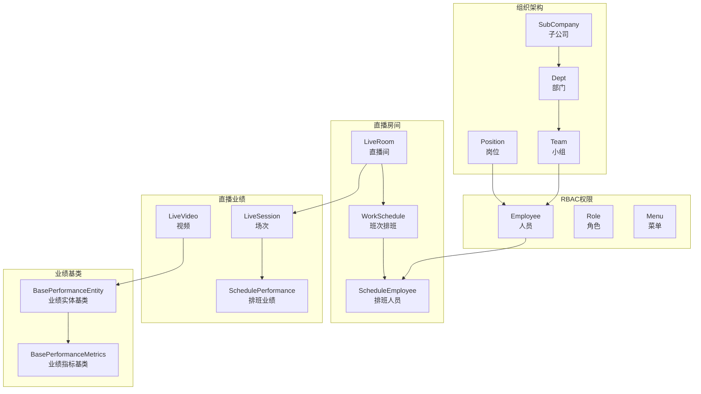
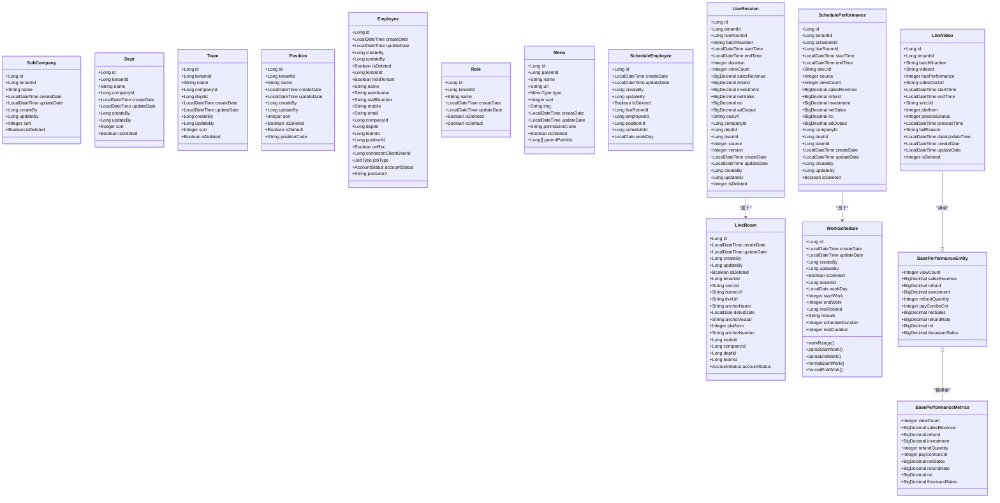
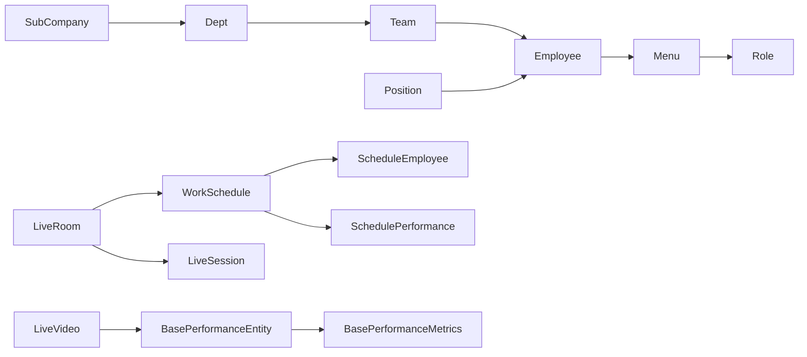

# 实体类设计

<cite>
**本文引用的文件**
- [SubCompany.java](file://src/main/java/com/jiuyu/governance/business/org/pojo/entity/SubCompany.java)
- [Dept.java](file://src/main/java/com/jiuyu/governance/business/org/pojo/entity/Dept.java)
- [Team.java](file://src/main/java/com/jiuyu/governance/business/org/pojo/entity/Team.java)
- [Position.java](file://src/main/java/com/jiuyu/governance/business/org/pojo/entity/Position.java)
- [Employee.java](file://src/main/java/com/jiuyu/governance/business/rbac/pojo/entity/Employee.java)
- [Role.java](file://src/main/java/com/jiuyu/governance/business/rbac/pojo/entity/Role.java)
- [Menu.java](file://src/main/java/com/jiuyu/governance/business/rbac/pojo/entity/Menu.java)
- [LiveRoom.java](file://src/main/java/com/jiuyu/governance/business/room/pojo/entity/LiveRoom.java)
- [LiveSession.java](file://src/main/java/com/jiuyu/governance/business/performance/pojo/entity/LiveSession.java)
- [SchedulePerformance.java](file://src/main/java/com/jiuyu/governance/business/performance/pojo/entity/SchedulePerformance.java)
- [WorkSchedule.java](file://src/main/java/com/jiuyu/governance/business/room/pojo/entity/WorkSchedule.java)
- [ScheduleEmployee.java](file://src/main/java/com/jiuyu/governance/business/room/pojo/entity/ScheduleEmployee.java)
- [LiveVideo.java](file://src/main/java/com/jiuyu/governance/business/performance/pojo/entity/LiveVideo.java)
- [BasePerformanceEntity.java](file://src/main/java/com/jiuyu/governance/business/performance/pojo/base/BasePerformanceEntity.java)
- [BasePerformanceMetrics.java](file://src/main/java/com/jiuyu/governance/business/performance/pojo/base/BasePerformanceMetrics.java)
</cite>

## 目录
1. [引言](#引言)
2. [项目结构](#项目结构)
3. [核心组件](#核心组件)
4. [架构总览](#架构总览)
5. [详细组件分析](#详细组件分析)
6. [依赖分析](#依赖分析)
7. [性能考虑](#性能考虑)
8. [故障排查指南](#故障排查指南)
9. [结论](#结论)
10. [附录](#附录)

## 引言
本文件面向Java开发者，系统梳理fupan-governance-server中的POJO实体类设计，覆盖组织架构、人员权限、直播房间与直播业绩等模块。文档从实体的业务含义、字段类型、校验规则、命名规范与设计原则出发，并给出实体关系图与序列化说明，帮助读者快速理解并正确使用各实体类。

**更新** 本次更新反映了LiveVideo实体类的重构和BasePerformanceMetrics类的增强，包括移除cumulative_view和cumulative_refund字段，新增view_count、refund等字段，以及BasePerformanceMetrics类新增ROI、退款数量、销售单量等指标。

## 项目结构
实体类主要分布在以下包路径：
- 组织架构：business/org/pojo/entity
- RBAC权限：business/rbac/pojo/entity
- 直播房间：business/room/pojo/entity
- 直播业绩：business/performance/pojo/entity
- 业绩基类：business/performance/pojo/base

**图表来源**
- [SubCompany.java:1-85](file://src/main/java/com/jiuyu/governance/business/org/pojo/entity/SubCompany.java#L1-L85)
- [Dept.java:1-92](file://src/main/java/com/jiuyu/governance/business/org/pojo/entity/Dept.java#L1-L92)
- [Team.java:1-100](file://src/main/java/com/jiuyu/governance/business/org/pojo/entity/Team.java#L1-L100)
- [Position.java:1-99](file://src/main/java/com/jiuyu/governance/business/org/pojo/entity/Position.java#L1-L99)
- [Employee.java:1-171](file://src/main/java/com/jiuyu/governance/business/rbac/pojo/entity/Employee.java#L1-L171)
- [Role.java:1-71](file://src/main/java/com/jiuyu/governance/business/rbac/pojo/entity/Role.java#L1-L71)
- [Menu.java:1-111](file://src/main/java/com/jiuyu/governance/business/rbac/pojo/entity/Menu.java#L1-L111)
- [LiveRoom.java:1-168](file://src/main/java/com/jiuyu/governance/business/room/pojo/entity/LiveRoom.java#L1-L168)
- [LiveSession.java:1-173](file://src/main/java/com/jiuyu/governance/business/performance/pojo/entity/LiveSession.java#L1-L173)
- [SchedulePerformance.java:1-160](file://src/main/java/com/jiuyu/governance/business/performance/pojo/entity/SchedulePerformance.java#L1-L160)
- [WorkSchedule.java:1-190](file://src/main/java/com/jiuyu/governance/business/room/pojo/entity/WorkSchedule.java#L1-L190)
- [ScheduleEmployee.java:1-98](file://src/main/java/com/jiuyu/governance/business/room/pojo/entity/ScheduleEmployee.java#L1-L98)
- [LiveVideo.java:1-124](file://src/main/java/com/jiuyu/governance/business/performance/pojo/entity/LiveVideo.java#L1-L124)
- [BasePerformanceEntity.java:1-95](file://src/main/java/com/jiuyu/governance/business/performance/pojo/base/BasePerformanceEntity.java#L1-L95)
- [BasePerformanceMetrics.java:1-83](file://src/main/java/com/jiuyu/governance/business/performance/pojo/base/BasePerformanceMetrics.java#L1-L83)

## 核心组件
本节按模块概述关键实体的职责与字段要点，便于快速定位与使用。

- 组织架构实体
  - SubCompany：企业级组织单元，包含租户标识、名称、时间戳、操作人、排序与逻辑删除标记。
  - Dept：部门，关联所属公司与租户，具备标准元数据与删除标记。
  - Team：小组，归属公司与部门，具备标准元数据与删除标记。
  - Position：岗位，支持默认岗位与岗位编码，具备标准元数据与删除标记。

- 人员权限实体
  - Employee：员工档案，含姓名、工号、手机、邮箱、所属组织链路、岗位、权限开关、账户状态与密码等。
  - Role：角色，支持默认角色与标准元数据。
  - Menu：菜单/功能/目录，包含父节点、类型、排序、图标、权限码与父子路径等。

- 直播房间实体
  - LiveRoom：直播间，包含主播标识、主页与直播URL、名称、首播日期、头像、平台类型、抖音号、所属组织、账号状态等。
  - WorkSchedule：班次排班，包含班次归属日、起止工作时间（内部格式）、直播房间、备注、时长与休息时长等。
  - ScheduleEmployee：排班人员，绑定员工、岗位、排班计划与班次归属日。

- 直播业绩实体
  - LiveSession：直播场次，包含批次号、起止时间、时长、场观、销售、退款、投放、净销售额、ROI、广告产出、OSS地址、组织维度、来源、乐观锁与逻辑删除等。
  - SchedulePerformance：排班业绩，包含排班ID、直播房间、起止时间、主播SecUid、来源、场观、销售、退款、投放、净销售额、ROI、广告产出、组织维度与时间戳、人员信息、逻辑删除等。
  - LiveVideo：视频实体，包含租户ID、批次号、视频ID、视频文件OSS地址、开始结束时间、主播SecUid、平台类型、处理状态等。

- 业绩基类
  - BasePerformanceEntity：业绩实体基类，统一管理10个核心指标字段（view_count、sales_revenue、refund、investment、refund_quantity、pay_combo_cnt、net_sales、refund_rate、roi、thousand_sales）。
  - BasePerformanceMetrics：业绩指标基类，统一管理BO/Response/Export层的核心指标字段，支持Builder模式。

**章节来源**
- [SubCompany.java:14-84](file://src/main/java/com/jiuyu/governance/business/org/pojo/entity/SubCompany.java#L14-L84)
- [Dept.java:14-91](file://src/main/java/com/jiuyu/governance/business/org/pojo/entity/Dept.java#L14-L91)
- [Team.java:14-99](file://src/main/java/com/jiuyu/governance/business/org/pojo/entity/Team.java#L14-L99)
- [Position.java:14-98](file://src/main/java/com/jiuyu/governance/business/org/pojo/entity/Position.java#L14-L98)
- [Employee.java:18-170](file://src/main/java/com/jiuyu/governance/business/rbac/pojo/entity/Employee.java#L18-L170)
- [Role.java:14-70](file://src/main/java/com/jiuyu/governance/business/rbac/pojo/entity/Role.java#L14-L70)
- [Menu.java:18-110](file://src/main/java/com/jiuyu/governance/business/rbac/pojo/entity/Menu.java#L18-L110)
- [LiveRoom.java:16-167](file://src/main/java/com/jiuyu/governance/business/room/pojo/entity/LiveRoom.java#L16-L167)
- [WorkSchedule.java:18-189](file://src/main/java/com/jiuyu/governance/business/room/pojo/entity/WorkSchedule.java#L18-L189)
- [ScheduleEmployee.java:14-97](file://src/main/java/com/jiuyu/governance/business/room/pojo/entity/ScheduleEmployee.java#L14-L97)
- [LiveSession.java:10-172](file://src/main/java/com/jiuyu/governance/business/performance/pojo/entity/LiveSession.java#L10-L172)
- [SchedulePerformance.java:10-159](file://src/main/java/com/jiuyu/governance/business/performance/pojo/entity/SchedulePerformance.java#L10-L159)
- [LiveVideo.java:16-124](file://src/main/java/com/jiuyu/governance/business/performance/pojo/entity/LiveVideo.java#L16-L124)
- [BasePerformanceEntity.java:9-95](file://src/main/java/com/jiuyu/governance/business/performance/pojo/base/BasePerformanceEntity.java#L9-L95)
- [BasePerformanceMetrics.java:10-83](file://src/main/java/com/jiuyu/governance/business/performance/pojo/base/BasePerformanceMetrics.java#L10-L83)

## 架构总览
实体类遵循统一的分层与命名规范，采用MyBatis-Plus注解映射数据库表，结合Jakarta Bean Validation进行参数校验，部分实体引入乐观锁与逻辑删除增强并发与数据治理能力。新增的BasePerformanceEntity和BasePerformanceMetrics基类提供了统一的业绩指标管理机制。

**图表来源**
- [SubCompany.java:14-84](file://src/main/java/com/jiuyu/governance/business/org/pojo/entity/SubCompany.java#L14-L84)
- [Dept.java:14-91](file://src/main/java/com/jiuyu/governance/business/org/pojo/entity/Dept.java#L14-L91)
- [Team.java:14-99](file://src/main/java/com/jiuyu/governance/business/org/pojo/entity/Team.java#L14-L99)
- [Position.java:14-98](file://src/main/java/com/jiuyu/governance/business/org/pojo/entity/Position.java#L14-L98)
- [Employee.java:18-170](file://src/main/java/com/jiuyu/governance/business/rbac/pojo/entity/Employee.java#L18-L170)
- [Role.java:14-70](file://src/main/java/com/jiuyu/governance/business/rbac/pojo/entity/Role.java#L14-L70)
- [Menu.java:18-110](file://src/main/java/com/jiuyu/governance/business/rbac/pojo/entity/Menu.java#L18-L110)
- [LiveRoom.java:16-167](file://src/main/java/com/jiuyu/governance/business/room/pojo/entity/LiveRoom.java#L16-L167)
- [WorkSchedule.java:18-189](file://src/main/java/com/jiuyu/governance/business/room/pojo/entity/WorkSchedule.java#L18-L189)
- [ScheduleEmployee.java:14-97](file://src/main/java/com/jiuyu/governance/business/room/pojo/entity/ScheduleEmployee.java#L14-L97)
- [LiveSession.java:10-172](file://src/main/java/com/jiuyu/governance/business/performance/pojo/entity/LiveSession.java#L10-L172)
- [SchedulePerformance.java:10-159](file://src/main/java/com/jiuyu/governance/business/performance/pojo/entity/SchedulePerformance.java#L10-L159)
- [LiveVideo.java:16-124](file://src/main/java/com/jiuyu/governance/business/performance/pojo/entity/LiveVideo.java#L16-L124)
- [BasePerformanceEntity.java:9-95](file://src/main/java/com/jiuyu/governance/business/performance/pojo/base/BasePerformanceEntity.java#L9-L95)
- [BasePerformanceMetrics.java:10-83](file://src/main/java/com/jiuyu/governance/business/performance/pojo/base/BasePerformanceMetrics.java#L10-L83)

## 详细组件分析

### 组织架构实体
- SubCompany（子公司）
  - 业务含义：企业级组织单元，用于多租户隔离与层级管理。
  - 关键字段：租户ID、名称、创建/更新时间、创建者/更新者、排序、逻辑删除。
  - 校验规则：名称非空且长度限制；时间与人员字段非空；排序与删除标记非空。
  - 设计原则：统一元数据字段、支持软删除、雪花ID主键。

- Dept（部门）
  - 业务含义：公司下的二级组织，承载员工与小组。
  - 关键字段：所属公司ID、租户ID、名称、时间戳、操作人、排序、删除标记。
  - 校验规则：名称非空且长度限制；所属公司ID与时间字段非空。
  - 设计原则：与SubCompany形成树形层级关系。

- Team（小组）
  - 业务含义：最小业务执行单元，归属部门与公司。
  - 关键字段：公司ID、部门ID、租户ID、名称、时间戳、操作人、排序、删除标记。
  - 校验规则：名称非空且长度限制；所属公司/部门ID与时间字段非空。
  - 设计原则：与Dept/Team形成三层组织树。

- Position（岗位）
  - 业务含义：员工所处的职位，支持默认岗位与枚举编码。
  - 关键字段：租户ID、名称、默认标志、岗位编码、时间戳、操作人、排序、删除标记。
  - 校验规则：名称非空且长度限制；默认标志与删除标记非空；可选编码长度限制。
  - 设计原则：默认岗位用于系统内枚举查询，避免硬编码。

**章节来源**
- [SubCompany.java:14-84](file://src/main/java/com/jiuyu/governance/business/org/pojo/entity/SubCompany.java#L14-L84)
- [Dept.java:14-91](file://src/main/java/com/jiuyu/governance/business/org/pojo/entity/Dept.java#L14-L91)
- [Team.java:14-99](file://src/main/java/com/jiuyu/governance/business/org/pojo/entity/Team.java#L14-L99)
- [Position.java:14-98](file://src/main/java/com/jiuyu/governance/business/org/pojo/entity/Position.java#L14-L98)

### 人员权限实体
- Employee（人员）
  - 业务含义：系统内的员工档案，关联组织链路与岗位，承载登录与权限控制信息。
  - 关键字段：姓名、头像、工号、手机、邮箱、所属公司/部门/小组/岗位、录制权限开关、客户端关联ID、岗位类型、账户状态、密码等。
  - 校验规则：姓名、工号、手机非空且长度限制；邮箱格式校验；所属公司必填；录制权限必填。
  - 设计原则：字段覆盖RBAC与组织链路，支持多租户隔离。

- Role（角色）
  - 业务含义：权限集合的抽象，支持默认角色。
  - 关键字段：租户ID、名称、创建/更新时间、删除标记、默认标志。
  - 校验规则：名称非空且长度限制；时间与删除标记非空；默认标志非空。
  - 设计原则：默认角色用于初始化与兜底授权。

- Menu（菜单）
  - 业务含义：系统菜单/功能/目录，支持父子关系与权限码。
  - 关键字段：父ID、名称、URL、类型、排序、图标、创建/更新时间、权限码、删除标记、父路径ID列表。
  - 校验规则：名称、权限码非空且长度限制；类型、排序、父ID、删除标记非空；父路径ID使用自定义TypeHandler持久化。
  - 设计原则：支持树形结构与权限解耦。

**章节来源**
- [Employee.java:18-170](file://src/main/java/com/jiuyu/governance/business/rbac/pojo/entity/Employee.java#L18-L170)
- [Role.java:14-70](file://src/main/java/com/jiuyu/governance/business/rbac/pojo/entity/Role.java#L14-L70)
- [Menu.java:18-110](file://src/main/java/com/jiuyu/governance/business/rbac/pojo/entity/Menu.java#L18-L110)

### 直播房间实体
- LiveRoom（直播间）
  - 业务含义：直播业务主体，记录主播信息、平台类型、所属组织与账号状态。
  - 关键字段：主播唯一标识、主页与直播URL、名称、首播日期、头像、平台类型、抖音号、所属公司/部门/小组、行业ID、租户ID、账号状态等。
  - 校验规则：多个字符串字段长度限制与非空校验；平台类型与所属组织字段非空；行业ID与组织ID非空。
  - 设计原则：统一平台抽象与组织归属，支持多平台扩展。

- WorkSchedule（班次排班）
  - 业务含义：直播排班计划，以"日+时间片"描述轮班区间。
  - 关键字段：班次归属日、起止工作时间（内部整数格式：月天小时分钟）、直播房间、备注、时长与休息时长、时间戳、操作人、删除标记。
  - 校验规则：起止时间、工作日、直播房间、备注、时长与休息时长均非空；备注长度限制。
  - 设计原则：提供时间解析/格式化工具方法，保证跨日边界处理正确性。

- ScheduleEmployee（排班人员）
  - 业务含义：将员工绑定到具体排班计划与岗位。
  - 关键字段：直播房间ID、员工ID、岗位ID、排班计划ID、班次归属日、时间戳、操作人、删除标记。
  - 校验规则：所有外键与归属日非空。
  - 设计原则：支持多员工、多岗位在同一天的排班组合。

**章节来源**
- [LiveRoom.java:16-167](file://src/main/java/com/jiuyu/governance/business/room/pojo/entity/LiveRoom.java#L16-L167)
- [WorkSchedule.java:18-189](file://src/main/java/com/jiuyu/governance/business/room/pojo/entity/WorkSchedule.java#L18-L189)
- [ScheduleEmployee.java:14-97](file://src/main/java/com/jiuyu/governance/business/room/pojo/entity/ScheduleEmployee.java#L14-L97)

### 直播业绩实体
- LiveSession（直播场次）
  - 业务含义：一次直播场次的聚合指标，支持系统推送与手动录入两种来源。
  - 关键字段：租户ID、直播间ID、批次号、起止时间、时长、场观、销售、退款、投放、净销售额、ROI、广告产出、OSS地址、组织维度、来源、乐观锁版本、时间戳、人员信息、逻辑删除。
  - 校验规则：来源与逻辑删除字段语义明确；金额类字段使用高精度类型。
  - 设计原则：引入乐观锁与逻辑删除，保障并发写入与历史数据保留。

- SchedulePerformance（排班业绩）
  - 业务含义：基于排班计划的业绩汇总，支持系统与手动两种来源。
  - 关键字段：租户ID、排班ID、直播间ID、起止时间、主播SecUid、来源、场观、销售、退款、投放、净销售额、ROI、广告产出、组织维度、时间戳、人员信息、逻辑删除。
  - 校验规则：来源与逻辑删除字段语义明确；金额类字段使用高精度类型。
  - 设计原则：与排班计划强关联，便于按日/人/岗位维度统计。

- LiveVideo（视频实体）
  - 业务含义：直播视频记录，包含视频文件存储信息、处理状态与时间维度。
  - 关键字段：租户ID、批次号、视频ID、业绩数据存在标志、视频文件OSS地址、开始结束时间、主播SecUid、平台类型、处理状态、处理时间、失败原因、数据更新时间、创建/更新时间、逻辑删除。
  - 校验规则：批次号与视频ID非空；平台类型与处理状态枚举值有效；时间字段非空。
  - 设计原则：继承BasePerformanceEntity，复用统一的业绩指标字段定义。

**章节来源**
- [LiveSession.java:10-172](file://src/main/java/com/jiuyu/governance/business/performance/pojo/entity/LiveSession.java#L10-L172)
- [SchedulePerformance.java:10-159](file://src/main/java/com/jiuyu/governance/business/performance/pojo/entity/SchedulePerformance.java#L10-L159)
- [LiveVideo.java:16-124](file://src/main/java/com/jiuyu/governance/business/performance/pojo/entity/LiveVideo.java#L16-L124)

### 业绩基类
- BasePerformanceEntity（业绩实体基类）
  - 业务含义：统一管理业绩实体的核心指标字段，消除跨表字段冗余。
  - 关键字段：总观看人次（view_count）、销售额（sales_revenue）、退款（refund）、投放（investment）、退款数量（refund_quantity）、销售单量（pay_combo_cnt）、净销售额（net_sales）、退款率（refund_rate）、投资回报率（roi）、千次成交（thousand_sales）。
  - 设计原则：通过@TableField注解实现字段映射，支持MyBatis-Plus自动识别父类注解。

- BasePerformanceMetrics（业绩指标基类）
  - 业务含义：统一管理BO/Response/Export层的核心指标字段，支持Builder模式。
  - 关键字段：与BasePerformanceEntity相同的10个核心指标字段。
  - 设计原则：使用@SuperBuilder支持子类的Builder模式，提供统一的指标管理机制。

**章节来源**
- [BasePerformanceEntity.java:9-95](file://src/main/java/com/jiuyu/governance/business/performance/pojo/base/BasePerformanceEntity.java#L9-L95)
- [BasePerformanceMetrics.java:10-83](file://src/main/java/com/jiuyu/governance/business/performance/pojo/base/BasePerformanceMetrics.java#L10-L83)

## 依赖分析
- 组件耦合
  - 组织链路：SubCompany → Dept → Team → Employee；Position独立绑定至Employee。
  - 直播链路：LiveRoom → WorkSchedule → ScheduleEmployee；LiveSession与SchedulePerformance分别面向场次与排班维度；LiveVideo继承BasePerformanceEntity复用指标字段。
  - 权限链路：Menu与Role通过中间表关联，Employee通过UserRole与MenuRole建立最终权限闭环。

- 外部依赖
  - MyBatis-Plus注解：表名映射、主键策略、字段填充、乐观锁、逻辑删除。
  - Jakarta Bean Validation：参数非空、长度与格式校验。
  - 自定义TypeHandler：菜单父路径ID列表的持久化。
  - Lombok注解：简化实体类代码，提供Builder模式支持。

**图表来源**
- [SubCompany.java:14-84](file://src/main/java/com/jiuyu/governance/business/org/pojo/entity/SubCompany.java#L14-L84)
- [Dept.java:14-91](file://src/main/java/com/jiuyu/governance/business/org/pojo/entity/Dept.java#L14-L91)
- [Team.java:14-99](file://src/main/java/com/jiuyu/governance/business/org/pojo/entity/Team.java#L14-L99)
- [Position.java:14-98](file://src/main/java/com/jiuyu/governance/business/org/pojo/entity/Position.java#L14-L98)
- [Employee.java:18-170](file://src/main/java/com/jiuyu/governance/business/rbac/pojo/entity/Employee.java#L18-L170)
- [Role.java:14-70](file://src/main/java/com/jiuyu/governance/business/rbac/pojo/entity/Role.java#L14-L70)
- [Menu.java:18-110](file://src/main/java/com/jiuyu/governance/business/rbac/pojo/entity/Menu.java#L18-L110)
- [LiveRoom.java:16-167](file://src/main/java/com/jiuyu/governance/business/room/pojo/entity/LiveRoom.java#L16-L167)
- [WorkSchedule.java:18-189](file://src/main/java/com/jiuyu/governance/business/room/pojo/entity/WorkSchedule.java#L18-L189)
- [ScheduleEmployee.java:14-97](file://src/main/java/com/jiuyu/governance/business/room/pojo/entity/ScheduleEmployee.java#L14-L97)
- [LiveSession.java:10-172](file://src/main/java/com/jiuyu/governance/business/performance/pojo/entity/LiveSession.java#L10-L172)
- [SchedulePerformance.java:10-159](file://src/main/java/com/jiuyu/governance/business/performance/pojo/entity/SchedulePerformance.java#L10-L159)
- [LiveVideo.java:16-124](file://src/main/java/com/jiuyu/governance/business/performance/pojo/entity/LiveVideo.java#L16-L124)
- [BasePerformanceEntity.java:9-95](file://src/main/java/com/jiuyu/governance/business/performance/pojo/base/BasePerformanceEntity.java#L9-L95)
- [BasePerformanceMetrics.java:10-83](file://src/main/java/com/jiuyu/governance/business/performance/pojo/base/BasePerformanceMetrics.java#L10-L83)

## 性能考虑
- 字段类型选择
  - 金额类使用高精度数值类型，避免浮点误差。
  - 时间类统一使用JSR-310时间类型，便于序列化与跨时区处理。
- 索引与查询
  - 建议在常用过滤字段（如tenant_id、live_room_id、schedule_id、work_day、employee_id、batch_number）上建立索引，提升分页与条件查询性能。
- 并发与一致性
  - LiveSession引入乐观锁版本号，降低并发写冲突风险。
  - 逻辑删除替代物理删除，减少大表DDL成本并保留审计痕迹。
- 序列化建议
  - 使用默认JSON序列化策略即可满足大多数场景；若需自定义，建议通过全局序列化配置或Jackson模块实现，避免在实体上添加复杂注解。
- 基类继承优化
  - BasePerformanceEntity和BasePerformanceMetrics的继承关系减少了字段冗余，提高了代码复用效率。

## 故障排查指南
- 参数校验失败
  - 现象：接口返回字段校验错误。
  - 排查：检查实体字段上的非空、长度与格式注解，确认请求参数是否满足约束。
  - 参考路径：[SubCompany.java:24-41](file://src/main/java/com/jiuyu/governance/business/org/pojo/entity/SubCompany.java#L24-L41)、[Employee.java:77-111](file://src/main/java/com/jiuyu/governance/business/rbac/pojo/entity/Employee.java#L77-L111)、[LiveRoom.java:75-131](file://src/main/java/com/jiuyu/governance/business/room/pojo/entity/LiveRoom.java#L75-L131)。
- 并发写入冲突
  - 现象：更新失败或数据不一致。
  - 排查：确认是否正确传递乐观锁版本号；检查是否存在未提交事务导致的脏读。
  - 参考路径：[LiveSession.java:138-140](file://src/main/java/com/jiuyu/governance/business/performance/pojo/entity/LiveSession.java#L138-L140)。
- 逻辑删除与历史数据
  - 现象：查询不到数据或统计异常。
  - 排查：确认查询是否忽略逻辑删除；必要时使用带删除标记的查询接口。
  - 参考路径：[LiveSession.java:169-171](file://src/main/java/com/jiuyu/governance/business/performance/pojo/entity/LiveSession.java#L169-L171)、[SchedulePerformance.java:156-158](file://src/main/java/com/jiuyu/governance/business/performance/pojo/entity/SchedulePerformance.java#L156-L158)。
- 时间边界问题
  - 现象：跨日排班时间计算异常。
  - 排查：确认WorkSchedule的起止时间解析逻辑与跨日处理分支；确保输入格式符合约定。
  - 参考路径：[WorkSchedule.java:128-135](file://src/main/java/com/jiuyu/governance/business/room/pojo/entity/WorkSchedule.java#L128-L135)、[WorkSchedule.java:170-188](file://src/main/java/com/jiuyu/governance/business/room/pojo/entity/WorkSchedule.java#L170-L188)。
- 基类字段映射问题
  - 现象：继承BasePerformanceEntity的实体无法正确映射字段。
  - 排查：确认@TableField注解正确配置；检查MyBatis-Plus版本是否支持父类注解识别。
  - 参考路径：[BasePerformanceEntity.java:34-93](file://src/main/java/com/jiuyu/governance/business/performance/pojo/base/BasePerformanceEntity.java#L34-L93)。

**章节来源**
- [SubCompany.java:24-41](file://src/main/java/com/jiuyu/governance/business/org/pojo/entity/SubCompany.java#L24-L41)
- [Employee.java:77-111](file://src/main/java/com/jiuyu/governance/business/rbac/pojo/entity/Employee.java#L77-L111)
- [LiveRoom.java:75-131](file://src/main/java/com/jiuyu/governance/business/room/pojo/entity/LiveRoom.java#L75-L131)
- [LiveSession.java:138-140](file://src/main/java/com/jiuyu/governance/business/performance/pojo/entity/LiveSession.java#L138-L140)
- [LiveSession.java:169-171](file://src/main/java/com/jiuyu/governance/business/performance/pojo/entity/LiveSession.java#L169-L171)
- [SchedulePerformance.java:156-158](file://src/main/java/com/jiuyu/governance/business/performance/pojo/entity/SchedulePerformance.java#L156-L158)
- [WorkSchedule.java:128-135](file://src/main/java/com/jiuyu/governance/business/room/pojo/entity/WorkSchedule.java#L128-L135)
- [WorkSchedule.java:170-188](file://src/main/java/com/jiuyu/governance/business/room/pojo/entity/WorkSchedule.java#L170-L188)
- [BasePerformanceEntity.java:34-93](file://src/main/java/com/jiuyu/governance/business/performance/pojo/base/BasePerformanceEntity.java#L34-L93)

## 结论
本实体类设计遵循统一的命名与注解规范，结合Bean Validation与MyBatis-Plus特性，实现了组织架构、人员权限、直播房间与直播业绩的清晰建模。通过逻辑删除、乐观锁与标准化元数据，提升了系统的可维护性与并发安全性。

**更新** 本次更新特别体现了以下改进：
- LiveVideo实体类重构：移除了cumulative_view和cumulative_refund字段，采用更简洁的字段命名（view_count、refund等），与BasePerformanceEntity保持一致。
- BasePerformanceMetrics类增强：新增ROI、退款数量、销售单量等关键指标，完善了业绩分析体系。
- 基类继承优化：通过BasePerformanceEntity和BasePerformanceMetrics的继承关系，实现了字段定义的统一管理，减少了代码冗余。

建议在实际开发中严格遵守字段约束与命名约定，并在查询层注意逻辑删除与时间边界处理。同时，充分利用基类提供的统一指标管理机制，确保不同业务场景下的一致性。

## 附录
- 命名规范与设计原则
  - 类名：采用名词短语，首字母大写，体现业务实体。
  - 字段：驼峰命名，与数据库列名通过注解映射；通用元数据字段统一置于实体末尾。
  - 注解：优先使用MyBatis-Plus与Bean Validation注解，减少重复校验代码。
  - 枚举：使用强类型枚举（如MenuType、AccountStatus），避免魔法值。
  - 时间：统一使用JSR-310时间类型，便于序列化与跨时区处理。
  - 金额：使用高精度数值类型，避免浮点误差。
  - 删除：优先逻辑删除，保留审计痕迹；必要时配合乐观锁。
  - 继承：通过基类统一管理公共字段，提高代码复用性与维护性。