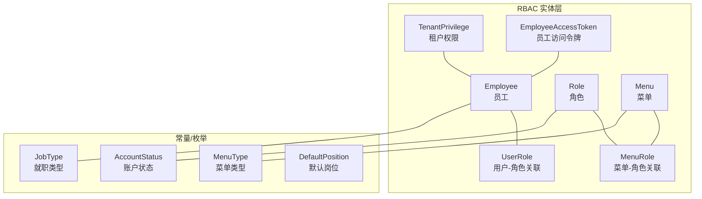
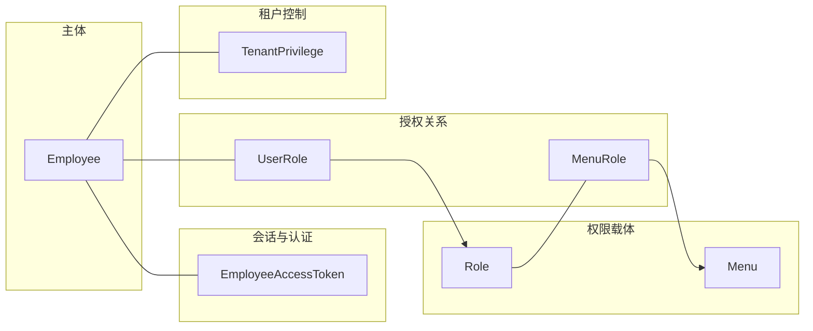
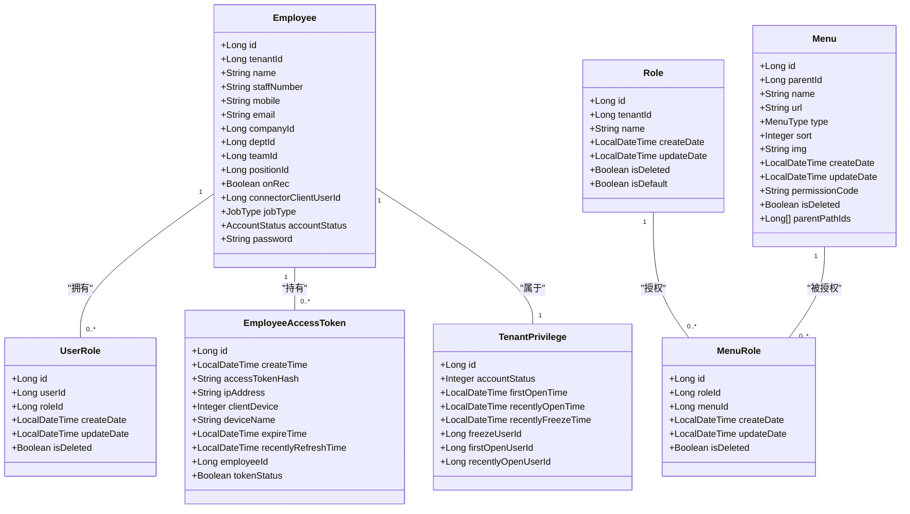
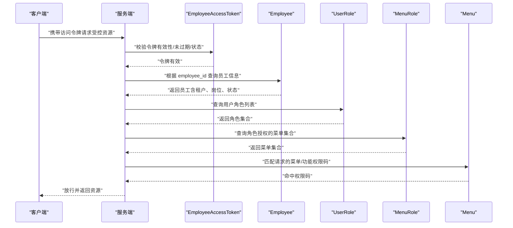
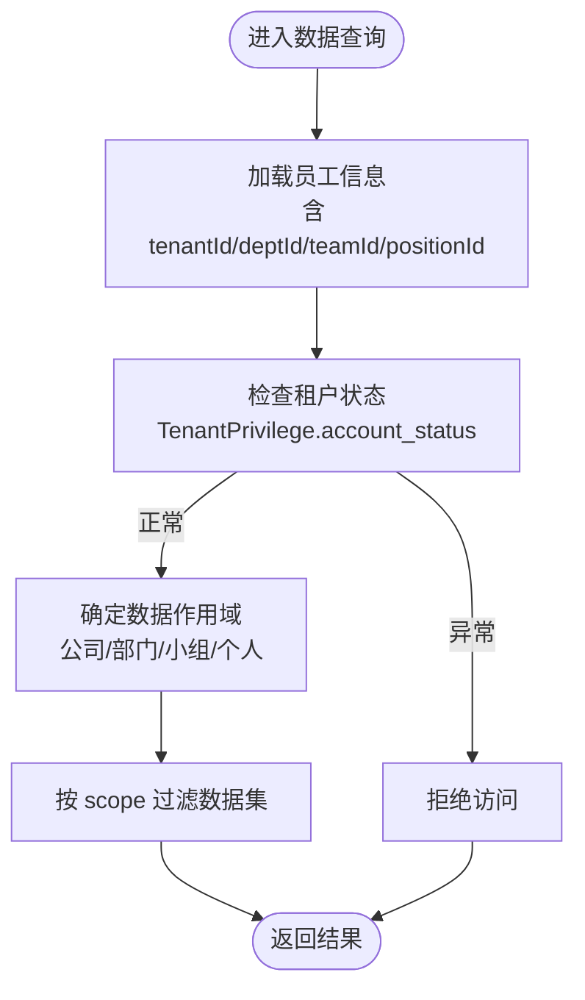
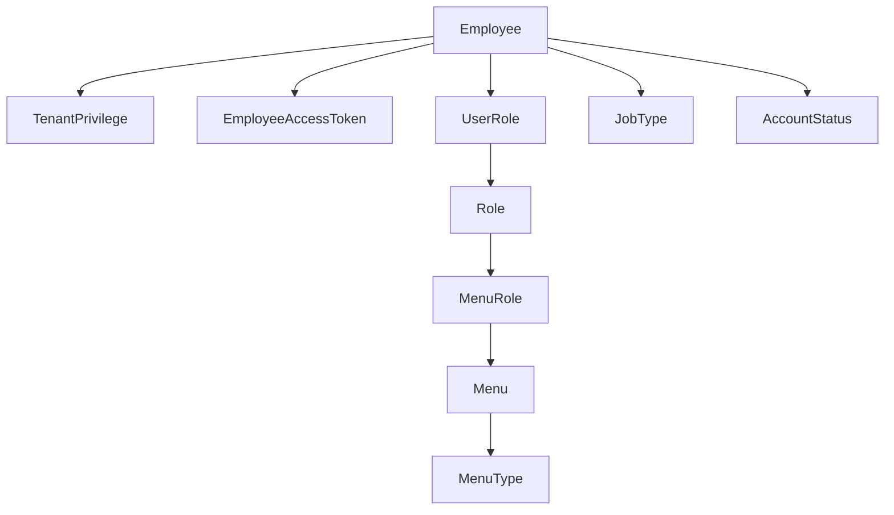

# 权限控制实体类

<cite>
**本文引用的文件**
- [Employee.java](file://src/main/java/com/jiuyu/governance/business/rbac/pojo/entity/Employee.java)
- [Role.java](file://src/main/java/com/jiuyu/governance/business/rbac/pojo/entity/Role.java)
- [Menu.java](file://src/main/java/com/jiuyu/governance/business/rbac/pojo/entity/Menu.java)
- [UserRole.java](file://src/main/java/com/jiuyu/governance/business/rbac/pojo/entity/UserRole.java)
- [MenuRole.java](file://src/main/java/com/jiuyu/governance/business/rbac/pojo/entity/MenuRole.java)
- [TenantPrivilege.java](file://src/main/java/com/jiuyu/governance/business/rbac/pojo/entity/TenantPrivilege.java)
- [EmployeeAccessToken.java](file://src/main/java/com/jiuyu/governance/business/rbac/pojo/entity/EmployeeAccessToken.java)
- [AccountStatus.java](file://src/main/java/com/jiuyu/governance/business/rbac/pojo/constants/AccountStatus.java)
- [JobType.java](file://src/main/java/com/jiuyu/governance/business/rbac/pojo/constants/JobType.java)
- [MenuType.java](file://src/main/java/com/jiuyu/governance/business/rbac/pojo/constants/MenuType.java)
- [DefaultPosition.java](file://src/main/java/com/jiuyu/governance/business/rbac/pojo/constants/DefaultPosition.java)
</cite>

## 目录
1. [简介](#简介)
2. [项目结构](#项目结构)
3. [核心组件](#核心组件)
4. [架构总览](#架构总览)
5. [详细组件分析](#详细组件分析)
6. [依赖分析](#依赖分析)
7. [性能考虑](#性能考虑)
8. [故障排查指南](#故障排查指南)
9. [结论](#结论)
10. [附录](#附录)

## 简介
本文件系统性梳理 RBAC（基于角色的访问控制）模型在本项目中的实体设计与实现，重点覆盖以下实体类：Employee（员工）、Role（角色）、Menu（菜单）、UserRole（用户角色关联）、MenuRole（菜单角色关联）、TenantPrivilege（租户权限）、EmployeeAccessToken（员工访问令牌）。文档从数据模型、字段语义、约束规则、业务关系、权限验证机制与数据权限控制支撑等方面进行深入解析，并给出常见业务场景与调用路径参考。

## 项目结构
RBAC 相关实体位于业务模块的 rbac 子包下，采用按领域分层的组织方式：
- 实体类集中于 pojo/entity 目录
- 枚举常量集中在 pojo/constants 目录
- 控制器、服务、映射器分别位于 controller、service、mapper 目录

图表来源
- [Employee.java:1-171](file://src/main/java/com/jiuyu/governance/business/rbac/pojo/entity/Employee.java#L1-L171)
- [Role.java:1-71](file://src/main/java/com/jiuyu/governance/business/rbac/pojo/entity/Role.java#L1-L71)
- [Menu.java:1-111](file://src/main/java/com/jiuyu/governance/business/rbac/pojo/entity/Menu.java#L1-L111)
- [UserRole.java:1-61](file://src/main/java/com/jiuyu/governance/business/rbac/pojo/entity/UserRole.java#L1-L61)
- [MenuRole.java:1-61](file://src/main/java/com/jiuyu/governance/business/rbac/pojo/entity/MenuRole.java#L1-L61)
- [TenantPrivilege.java:1-72](file://src/main/java/com/jiuyu/governance/business/rbac/pojo/entity/TenantPrivilege.java#L1-L72)
- [EmployeeAccessToken.java:1-93](file://src/main/java/com/jiuyu/governance/business/rbac/pojo/entity/EmployeeAccessToken.java#L1-L93)
- [AccountStatus.java:1-30](file://src/main/java/com/jiuyu/governance/business/rbac/pojo/constants/AccountStatus.java#L1-L30)
- [JobType.java:1-27](file://src/main/java/com/jiuyu/governance/business/rbac/pojo/constants/JobType.java#L1-L27)
- [MenuType.java:1-40](file://src/main/java/com/jiuyu/governance/business/rbac/pojo/constants/MenuType.java#L1-L40)
- [DefaultPosition.java:1-35](file://src/main/java/com/jiuyu/governance/business/rbac/pojo/constants/DefaultPosition.java#L1-L35)

章节来源
- [Employee.java:1-171](file://src/main/java/com/jiuyu/governance/business/rbac/pojo/entity/Employee.java#L1-L171)
- [Role.java:1-71](file://src/main/java/com/jiuyu/governance/business/rbac/pojo/entity/Role.java#L1-L71)
- [Menu.java:1-111](file://src/main/java/com/jiuyu/governance/business/rbac/pojo/entity/Menu.java#L1-L111)
- [UserRole.java:1-61](file://src/main/java/com/jiuyu/governance/business/rbac/pojo/entity/UserRole.java#L1-L61)
- [MenuRole.java:1-61](file://src/main/java/com/jiuyu/governance/business/rbac/pojo/entity/MenuRole.java#L1-L61)
- [TenantPrivilege.java:1-72](file://src/main/java/com/jiuyu/governance/business/rbac/pojo/entity/TenantPrivilege.java#L1-L72)
- [EmployeeAccessToken.java:1-93](file://src/main/java/com/jiuyu/governance/business/rbac/pojo/entity/EmployeeAccessToken.java#L1-L93)
- [AccountStatus.java:1-30](file://src/main/java/com/jiuyu/governance/business/rbac/pojo/constants/AccountStatus.java#L1-L30)
- [JobType.java:1-27](file://src/main/java/com/jiuyu/governance/business/rbac/pojo/constants/JobType.java#L1-L27)
- [MenuType.java:1-40](file://src/main/java/com/jiuyu/governance/business/rbac/pojo/constants/MenuType.java#L1-L40)
- [DefaultPosition.java:1-35](file://src/main/java/com/jiuyu/governance/business/rbac/pojo/constants/DefaultPosition.java#L1-L35)

## 核心组件
本节对各实体类进行逐个剖析，涵盖字段含义、约束、业务语义及典型使用场景。

- Employee（员工）
  - 关键字段：主键 id、租户标识 tenantId、姓名 name、工号 staffNumber、手机号 mobile、邮箱 email、所属公司/部门/小组/岗位、是否开启录制权限 onRec、关联客户端用户 connectorClientUserId、岗位类型 jobType、账户状态 accountStatus、密码 password 等。
  - 约束与校验：多处使用非空、长度限制、邮箱格式等校验注解；包含软删除标记 isDeleted、创建/更新时间 create_date/update_date、操作人 create_by/update_by。
  - 业务要点：支持多租户隔离；通过账户状态与岗位类型参与权限判定；可绑定到租户管理员角色；与 AccessToken 关联用于会话管理。

- Role（角色）
  - 关键字段：主键 id、租户标识 tenantId、角色名 name、创建/更新时间、软删除标记 is_deleted、是否默认角色 is_default。
  - 约束与校验：角色名长度限制、必填校验；默认角色与租户强相关。
  - 业务要点：作为权限聚合载体，与菜单通过中间表建立授权关系；默认角色可用于新员工初始化。

- Menu（菜单）
  - 关键字段：主键 id、父菜单 parentId、菜单名 name、URL url、类型 type（菜单/功能/目录）、排序 sort、图标 img、权限码 permissionCode、创建/更新时间、软删除标记 is_deleted、祖先路径 parent_path_ids（LongListTypeHandler 支持）。
  - 约束与校验：菜单名、URL、权限码长度限制与必填；类型为枚举 MenuType；目录类型不参与权限控制，仅用于展示。
  - 业务要点：权限码用于细粒度 API/按钮级权限；父子关系与祖先路径支持树形结构与权限继承/回溯。

- UserRole（用户-角色关联）
  - 关键字段：主键 id、用户 id userId、角色 id roleId、创建/更新时间、软删除标记 is_deleted。
  - 约束与校验：用户与角色均必填。
  - 业务要点：员工可拥有多个角色（多对多），用于灵活授权。

- MenuRole（菜单-角色关联）
  - 关键字段：主键 id、角色 id roleId、菜单 id menuId、创建/更新时间、软删除标记 is_deleted。
  - 约束与校验：角色与菜单均必填。
  - 业务要点：角色获得对菜单及其子菜单的访问权限；配合 Menu 的权限码实现功能级权限。

- TenantPrivilege（租户权限）
  - 关键字段：主键 id（租户ID）、账户状态 account_status、首次/最近开通时间、最近冻结时间、冻结操作人 freeze_user_id、首次/最近开通操作人 first_open_user_id/recently_open_user_id。
  - 约束与校验：关键字段均必填或可选时间字段。
  - 业务要点：用于租户生命周期与权限开关控制，影响员工在该租户下的可用性与可见范围。

- EmployeeAccessToken（员工访问令牌）
  - 关键字段：主键 id、创建时间 create_time、访问令牌哈希 accessToken_hash、登录 IP ip_address、客户端设备 client_device、设备名称 device_name、过期时间 expire_time、最近刷新时间 recently_refresh_time、员工 id employee_id、令牌状态 token_status。
  - 约束与校验：令牌哈希、IP、设备名称长度限制与必填；过期与刷新时间必填；状态字段用于启用/禁用。
  - 业务要点：支撑员工登录态管理与会话续期；结合服务端鉴权流程实现安全访问。

章节来源
- [Employee.java:18-171](file://src/main/java/com/jiuyu/governance/business/rbac/pojo/entity/Employee.java#L18-L171)
- [Role.java:14-71](file://src/main/java/com/jiuyu/governance/business/rbac/pojo/entity/Role.java#L14-L71)
- [Menu.java:18-111](file://src/main/java/com/jiuyu/governance/business/rbac/pojo/entity/Menu.java#L18-L111)
- [UserRole.java:12-61](file://src/main/java/com/jiuyu/governance/business/rbac/pojo/entity/UserRole.java#L12-L61)
- [MenuRole.java:12-61](file://src/main/java/com/jiuyu/governance/business/rbac/pojo/entity/MenuRole.java#L12-L61)
- [TenantPrivilege.java:12-72](file://src/main/java/com/jiuyu/governance/business/rbac/pojo/entity/TenantPrivilege.java#L12-L72)
- [EmployeeAccessToken.java:14-93](file://src/main/java/com/jiuyu/governance/business/rbac/pojo/entity/EmployeeAccessToken.java#L14-L93)

## 架构总览
RBAC 权限模型的核心在于“员工—角色—菜单”的三层授权链路，以及“租户”维度的隔离与“令牌”维度的会话管理。

图表来源
- [Employee.java:62-169](file://src/main/java/com/jiuyu/governance/business/rbac/pojo/entity/Employee.java#L62-L169)
- [Role.java:28-69](file://src/main/java/com/jiuyu/governance/business/rbac/pojo/entity/Role.java#L28-L69)
- [Menu.java:32-95](file://src/main/java/com/jiuyu/governance/business/rbac/pojo/entity/Menu.java#L32-L95)
- [UserRole.java:26-38](file://src/main/java/com/jiuyu/governance/business/rbac/pojo/entity/UserRole.java#L26-L38)
- [MenuRole.java:26-38](file://src/main/java/com/jiuyu/governance/business/rbac/pojo/entity/MenuRole.java#L26-L38)
- [TenantPrivilege.java:19-71](file://src/main/java/com/jiuyu/governance/business/rbac/pojo/entity/TenantPrivilege.java#L19-L71)
- [EmployeeAccessToken.java:24-92](file://src/main/java/com/jiuyu/governance/business/rbac/pojo/entity/EmployeeAccessToken.java#L24-L92)

## 详细组件分析

### 类图：RBAC 实体关系

图表来源
- [Employee.java:24-169](file://src/main/java/com/jiuyu/governance/business/rbac/pojo/entity/Employee.java#L24-L169)
- [Role.java:24-69](file://src/main/java/com/jiuyu/governance/business/rbac/pojo/entity/Role.java#L24-L69)
- [Menu.java:28-109](file://src/main/java/com/jiuyu/governance/business/rbac/pojo/entity/Menu.java#L28-L109)
- [UserRole.java:22-59](file://src/main/java/com/jiuyu/governance/business/rbac/pojo/entity/UserRole.java#L22-L59)
- [MenuRole.java:22-59](file://src/main/java/com/jiuyu/governance/business/rbac/pojo/entity/MenuRole.java#L22-L59)
- [TenantPrivilege.java:22-71](file://src/main/java/com/jiuyu/governance/business/rbac/pojo/entity/TenantPrivilege.java#L22-L71)
- [EmployeeAccessToken.java:24-92](file://src/main/java/com/jiuyu/governance/business/rbac/pojo/entity/EmployeeAccessToken.java#L24-L92)

章节来源
- [Employee.java:1-171](file://src/main/java/com/jiuyu/governance/business/rbac/pojo/entity/Employee.java#L1-L171)
- [Role.java:1-71](file://src/main/java/com/jiuyu/governance/business/rbac/pojo/entity/Role.java#L1-L71)
- [Menu.java:1-111](file://src/main/java/com/jiuyu/governance/business/rbac/pojo/entity/Menu.java#L1-L111)
- [UserRole.java:1-61](file://src/main/java/com/jiuyu/governance/business/rbac/pojo/entity/UserRole.java#L1-L61)
- [MenuRole.java:1-61](file://src/main/java/com/jiuyu/governance/business/rbac/pojo/entity/MenuRole.java#L1-L61)
- [TenantPrivilege.java:1-72](file://src/main/java/com/jiuyu/governance/business/rbac/pojo/entity/TenantPrivilege.java#L1-L72)
- [EmployeeAccessToken.java:1-93](file://src/main/java/com/jiuyu/governance/business/rbac/pojo/entity/EmployeeAccessToken.java#L1-L93)

### 权限验证与数据权限流程
以下序列图展示“员工访问受控资源”的典型流程，包括令牌校验、角色授权、菜单/功能权限与数据范围控制。

图表来源
- [EmployeeAccessToken.java:38-92](file://src/main/java/com/jiuyu/governance/business/rbac/pojo/entity/EmployeeAccessToken.java#L38-L92)
- [Employee.java:62-169](file://src/main/java/com/jiuyu/governance/business/rbac/pojo/entity/Employee.java#L62-L169)
- [UserRole.java:26-38](file://src/main/java/com/jiuyu/governance/business/rbac/pojo/entity/UserRole.java#L26-L38)
- [MenuRole.java:26-38](file://src/main/java/com/jiuyu/governance/business/rbac/pojo/entity/MenuRole.java#L26-L38)
- [Menu.java:56-95](file://src/main/java/com/jiuyu/governance/business/rbac/pojo/entity/Menu.java#L56-L95)

章节来源
- [EmployeeAccessToken.java:1-93](file://src/main/java/com/jiuyu/governance/business/rbac/pojo/entity/EmployeeAccessToken.java#L1-L93)
- [Employee.java:1-171](file://src/main/java/com/jiuyu/governance/business/rbac/pojo/entity/Employee.java#L1-L171)
- [UserRole.java:1-61](file://src/main/java/com/jiuyu/governance/business/rbac/pojo/entity/UserRole.java#L1-L61)
- [MenuRole.java:1-61](file://src/main/java/com/jiuyu/governance/business/rbac/pojo/entity/MenuRole.java#L1-L61)
- [Menu.java:1-111](file://src/main/java/com/jiuyu/governance/business/rbac/pojo/entity/Menu.java#L1-L111)

### 数据权限控制流程
数据权限通常基于“租户+组织层级+岗位类型”进行过滤。以下流程图展示典型的数据权限决策点：

图表来源
- [Employee.java:62-136](file://src/main/java/com/jiuyu/governance/business/rbac/pojo/entity/Employee.java#L62-L136)
- [TenantPrivilege.java:26-31](file://src/main/java/com/jiuyu/governance/business/rbac/pojo/entity/TenantPrivilege.java#L26-L31)

章节来源
- [Employee.java:1-171](file://src/main/java/com/jiuyu/governance/business/rbac/pojo/entity/Employee.java#L1-L171)
- [TenantPrivilege.java:1-72](file://src/main/java/com/jiuyu/governance/business/rbac/pojo/entity/TenantPrivilege.java#L1-L72)

## 依赖分析
- 内聚性：各实体围绕 RBAC 与租户权限职责清晰，字段与业务语义一一对应。
- 耦合性：Employee 与 TenantPrivilege 强耦合（租户隔离）；Employee 与 AccessToken 弱耦合（会话管理）；Menu 与 MenuRole 强耦合（权限树）；UserRole 与 MenuRole 共同构成授权闭环。
- 外部依赖：MyBatis-Plus 注解驱动的 ORM 映射；枚举类型用于统一状态/类型的表达；LongListTypeHandler 用于菜单祖先路径的持久化。

图表来源
- [Employee.java:62-169](file://src/main/java/com/jiuyu/governance/business/rbac/pojo/entity/Employee.java#L62-L169)
- [Role.java:28-69](file://src/main/java/com/jiuyu/governance/business/rbac/pojo/entity/Role.java#L28-L69)
- [Menu.java:56-109](file://src/main/java/com/jiuyu/governance/business/rbac/pojo/entity/Menu.java#L56-L109)
- [UserRole.java:26-38](file://src/main/java/com/jiuyu/governance/business/rbac/pojo/entity/UserRole.java#L26-L38)
- [MenuRole.java:26-38](file://src/main/java/com/jiuyu/governance/business/rbac/pojo/entity/MenuRole.java#L26-L38)
- [TenantPrivilege.java:19-71](file://src/main/java/com/jiuyu/governance/business/rbac/pojo/entity/TenantPrivilege.java#L19-L71)
- [EmployeeAccessToken.java:84-92](file://src/main/java/com/jiuyu/governance/business/rbac/pojo/entity/EmployeeAccessToken.java#L84-L92)
- [MenuType.java:12-40](file://src/main/java/com/jiuyu/governance/business/rbac/pojo/constants/MenuType.java#L12-L40)
- [JobType.java:12-27](file://src/main/java/com/jiuyu/governance/business/rbac/pojo/constants/JobType.java#L12-L27)
- [AccountStatus.java:12-30](file://src/main/java/com/jiuyu/governance/business/rbac/pojo/constants/AccountStatus.java#L12-L30)

章节来源
- [Employee.java:1-171](file://src/main/java/com/jiuyu/governance/business/rbac/pojo/entity/Employee.java#L1-L171)
- [Role.java:1-71](file://src/main/java/com/jiuyu/governance/business/rbac/pojo/entity/Role.java#L1-L71)
- [Menu.java:1-111](file://src/main/java/com/jiuyu/governance/business/rbac/pojo/entity/Menu.java#L1-L111)
- [UserRole.java:1-61](file://src/main/java/com/jiuyu/governance/business/rbac/pojo/entity/UserRole.java#L1-L61)
- [MenuRole.java:1-61](file://src/main/java/com/jiuyu/governance/business/rbac/pojo/entity/MenuRole.java#L1-L61)
- [TenantPrivilege.java:1-72](file://src/main/java/com/jiuyu/governance/business/rbac/pojo/entity/TenantPrivilege.java#L1-L72)
- [EmployeeAccessToken.java:1-93](file://src/main/java/com/jiuyu/governance/business/rbac/pojo/entity/EmployeeAccessToken.java#L1-L93)
- [MenuType.java:1-40](file://src/main/java/com/jiuyu/governance/business/rbac/pojo/constants/MenuType.java#L1-L40)
- [JobType.java:1-27](file://src/main/java/com/jiuyu/governance/business/rbac/pojo/constants/JobType.java#L1-L27)
- [AccountStatus.java:1-30](file://src/main/java/com/jiuyu/governance/business/rbac/pojo/constants/AccountStatus.java#L1-L30)

## 性能考虑
- 索引建议：在常用查询字段上建立索引，如 Employee.tenant_id、UserRole.user_id、MenuRole.role_id/menu_id、EmployeeAccessToken.access_token_hash、Menu.permission_code。
- 缓存策略：将菜单树与角色-菜单映射缓存于内存，降低频繁查询成本；令牌校验可引入布隆过滤器快速排除无效令牌。
- 分页与投影：数据权限查询应尽量使用投影查询与分页，避免一次性加载大结果集。
- 枚举与字典：统一使用枚举常量，减少字符串比较与数据库存储冗余。

## 故障排查指南
- 令牌失效/过期
  - 现象：接口返回未授权或登录态异常。
  - 排查：检查 EmployeeAccessToken.expire_time 与 recently_refresh_time；确认 token_status 状态；核对客户端续期逻辑。
  - 参考路径：[EmployeeAccessToken.java:69-92](file://src/main/java/com/jiuyu/governance/business/rbac/pojo/entity/EmployeeAccessToken.java#L69-L92)

- 菜单/功能权限缺失
  - 现象：按钮或接口不可见/不可用。
  - 排查：确认 Menu.permission_code 是否正确配置；检查 Role 是否授予相应 MenuRole；核对员工是否具备对应 UserRole。
  - 参考路径：[Menu.java:90-95](file://src/main/java/com/jiuyu/governance/business/rbac/pojo/entity/Menu.java#L90-L95)、[MenuRole.java:26-38](file://src/main/java/com/jiuyu/governance/business/rbac/pojo/entity/MenuRole.java#L26-L38)、[UserRole.java:26-38](file://src/main/java/com/jiuyu/governance/business/rbac/pojo/entity/UserRole.java#L26-L38)

- 租户权限受限
  - 现象：员工无法看到某些数据或功能。
  - 排查：检查 TenantPrivilege.account_status 与时间字段；确认员工 tenantId 与数据范围一致。
  - 参考路径：[TenantPrivilege.java:26-31](file://src/main/java/com/jiuyu/governance/business/rbac/pojo/entity/TenantPrivilege.java#L26-L31)

- 员工状态异常
  - 现象：登录失败或权限异常。
  - 排查：检查 Employee.account_status 与 job_type；确认是否被停用或岗位类型不匹配。
  - 参考路径：[Employee.java:157-162](file://src/main/java/com/jiuyu/governance/business/rbac/pojo/entity/Employee.java#L157-L162)、[AccountStatus.java:12-30](file://src/main/java/com/jiuyu/governance/business/rbac/pojo/constants/AccountStatus.java#L12-L30)、[JobType.java:12-27](file://src/main/java/com/jiuyu/governance/business/rbac/pojo/constants/JobType.java#L12-L27)

章节来源
- [EmployeeAccessToken.java:1-93](file://src/main/java/com/jiuyu/governance/business/rbac/pojo/entity/EmployeeAccessToken.java#L1-L93)
- [Menu.java:1-111](file://src/main/java/com/jiuyu/governance/business/rbac/pojo/entity/Menu.java#L1-L111)
- [MenuRole.java:1-61](file://src/main/java/com/jiuyu/governance/business/rbac/pojo/entity/MenuRole.java#L1-L61)
- [UserRole.java:1-61](file://src/main/java/com/jiuyu/governance/business/rbac/pojo/entity/UserRole.java#L1-L61)
- [TenantPrivilege.java:1-72](file://src/main/java/com/jiuyu/governance/business/rbac/pojo/entity/TenantPrivilege.java#L1-L72)
- [Employee.java:1-171](file://src/main/java/com/jiuyu/governance/business/rbac/pojo/entity/Employee.java#L1-L171)
- [AccountStatus.java:1-30](file://src/main/java/com/jiuyu/governance/business/rbac/pojo/constants/AccountStatus.java#L1-L30)
- [JobType.java:1-27](file://src/main/java/com/jiuyu/governance/business/rbac/pojo/constants/JobType.java#L1-L27)

## 结论
本项目的 RBAC 实体设计以清晰的职责划分与强约束保障了权限控制的准确性与可维护性。通过“员工—角色—菜单—令牌—租户”的完整链路，既能满足菜单导航与功能按钮级权限控制，也能支撑多租户与数据范围的精细化治理。建议在生产环境中配合缓存、索引与审计日志，持续优化权限查询与校验性能。

## 附录
- 业务场景与调用路径参考（以路径代替具体代码）
  - 员工登录与令牌发放
    - 路径参考：[EmployeeAccessToken.java:24-92](file://src/main/java/com/jiuyu/governance/business/rbac/pojo/entity/EmployeeAccessToken.java#L24-L92)
  - 员工角色授权与菜单访问
    - 路径参考：[UserRole.java:26-38](file://src/main/java/com/jiuyu/governance/business/rbac/pojo/entity/UserRole.java#L26-L38)、[MenuRole.java:26-38](file://src/main/java/com/jiuyu/governance/business/rbac/pojo/entity/MenuRole.java#L26-L38)、[Menu.java:56-95](file://src/main/java/com/jiuyu/governance/business/rbac/pojo/entity/Menu.java#L56-L95)
  - 租户权限与数据范围控制
    - 路径参考：[TenantPrivilege.java:26-31](file://src/main/java/com/jiuyu/governance/business/rbac/pojo/entity/TenantPrivilege.java#L26-L31)、[Employee.java:62-136](file://src/main/java/com/jiuyu/governance/business/rbac/pojo/entity/Employee.java#L62-L136)
  - 账户状态与岗位类型
    - 路径参考：[AccountStatus.java:12-30](file://src/main/java/com/jiuyu/governance/business/rbac/pojo/constants/AccountStatus.java#L12-L30)、[JobType.java:12-27](file://src/main/java/com/jiuyu/governance/business/rbac/pojo/constants/JobType.java#L12-L27)